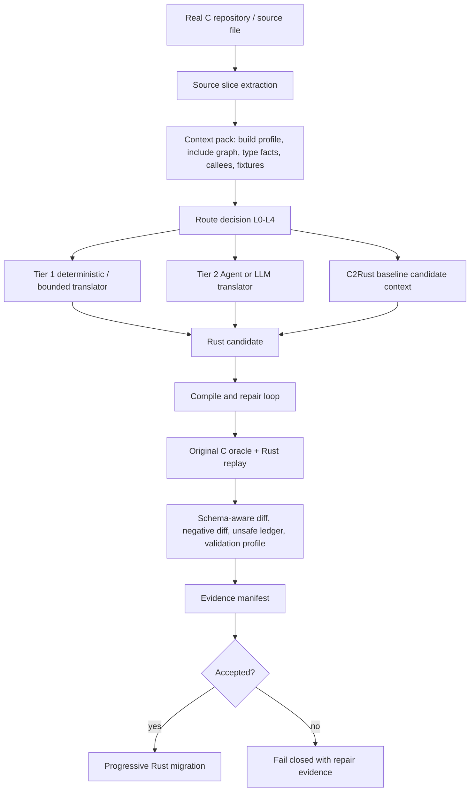

# CONTEXT.md

本文件用于把当前会话的关键上下文固化到仓库中。一个完全看不到聊天记录的新 Codex 会话，读取本文件和代码仓库后，应能准确理解当前项目状态，并直接继续工作。

## 1. 当前仓库与路径

- 当前应继续工作的本地路径：`C:\Users\Administrator\Documents\c-to-rust-flashdb`
- GitHub 仓库：`https://github.com/guoqihan342-svg/c-to-rust`
- 当前分支：`codex/flashdb-rust-skeleton`
- 当前远端分支：`origin/codex/flashdb-rust-skeleton`
- 最近已推送提交：
  - `3d12e65c5599441e9886acb29c8ac40f196d7b22`
  - message: `Add C2Rust baseline route evidence pipeline`
- 注意：`C:\Users\Administrator\Documents\c-to-rust` 是早期或主工作区路径，当前这轮 FlashDB/C2Rust pipeline 工作不要误切回那里继续开发，除非用户明确要求。
- C2Rust 参考源码路径：`F:\agent\c2rust-master`
  - 这是参考项目和潜在工具链来源。
  - 当前工作区没有确认可直接调用的 `c2rust` 可执行文件。

如果默认 Git HTTPS push 遇到 `Recv failure: Connection was reset`，此前可用的推送命令是：

```powershell
git -c http.version=HTTP/1.1 -c http.postBuffer=524288000 push origin codex/flashdb-rust-skeleton
```

## 2. 用户当前项目要求

项目目标是构建一个面向 Codex、OpenCode 或其他 Agent 调用的 C 到 Rust 渐进式迁移 Agent / pipeline。它不是只服务一个人工 demo，而是要逐步走向真实 C 项目的受限自动翻译与强验证。

当前明确要求：

- 使用 OpenSpec 管理需求、设计、任务和验收。
- 复杂任务可以开多个智能体或并行子任务，但共享文件写入必须受控，不能互相覆盖。
- 项目不再要求“小而精”，可以适当扩大规模以补齐真实翻译能力。
- 不再把 10000 轮回归作为每次开发的阻塞条件。
- 日常当前先跑 10 轮、默认 10000 轮等固定轮数要求已经去掉。
- 回归轮数应作为 validation profile 或运行策略输入，而不是硬编码全局门禁。
- Rust first-party non-test `unsafe` 比例必须小于 10%。
- “最好为 0% unsafe”已从硬性要求中去掉，不能把 0% 当作验收条件。
- 实际只有一个 Agent/LLM 接口，不再区分廉价模型和强模型。
- C2Rust、LLM、手写规则都只能提供 candidate，不是 correctness source。
- 正确性以原始 C 行为和证据链为准。
- 真正的翻译证据必须来自真实 C 源文件自动抽取的 slice/context，不应把手写 `c_source` demo 当作真实迁移成果。
- 需要跨文件深度关联性上下文管理，在不破坏项目模块调用关系的前提下，实现单点渐进式重构。
- 编译/编译自愈需要双向闭环：根据 error stack 精确定位、自动打补丁、重新验证。
- 语义等价性要求非常高：业务逻辑不能被破坏，测试和 oracle 证据必须覆盖主干路径。
- 重构后的 FlashDB Rust 目录名目标仍可使用 `flashDB_rust`，但当前本分支重点已经从手写 FlashDB 重写转向“受限自动翻译器 + 强验证项目”。

一个重要边界：不要再恢复旧的 `flashdb-10000` 自动心跳或默认长跑监控。用户已经明确表示自动化消息让人困扰，并取消了 10000 轮作为日常阻塞条件。

## 3. 当前核心方案

当前采用的是治理优先的混合式 C 到 Rust 迁移 pipeline：



设计原则：

- C2Rust baseline 用于候选上下文、对照和 cross-check，不作为正确性证明。
- LLM/Agent 翻译可以作为兜底，但所有候选必须走统一验证门禁。
- Tree-sitter 或手写语法扫描只能提供 syntax indexing，不能直接证明类型、别名和 UB 语义。
- 真实 typed semantic facts 需要 compile profile、clang/libclang、原始 C oracle 或显式 unsupported/block 记录。
- C-side UB 和 Rust-side UB 证据要分开。MIRI 不是 C UB 证明。
- OpenSpec 管能力和批次，slice evidence manifest 管每个函数迁移证据。
- 不支持的情况必须 fail closed，不能假装翻译成功。

## 4. 已完成的主要实现

最近完成并推送的 OpenSpec change：

- `openspec/changes/add-c2rust-baseline-migration-pipeline/`

该 change 的任务已全部勾选完成，核心目标是把 C2Rust baseline、route decision 和 validation profile 纳入 L3 自动翻译证据链。

关键新增或修改：

- `validation/tools/auto_migrate.py`
  - 生成 C2Rust baseline manifest。
  - 生成 route decision。
  - 生成 validation profile。
  - 将这三类证据绑定到 auto manifest、L3 evidence manifest、final verification、cache metadata 和 generated artifacts。
  - cache identity 包含 `c2rust_baseline_identity`、`route_decision_identity`、`validation_profile_identity`。
  - route 为 L4 时 fail closed，写出 blocked repair evidence。
  - semantic pass 改为基于 `accepted`、Rust compile/check 和 validation profile 共同判定，不能绕过 profile。

- `validation/tools/validate_auto_translation_evidence.py`
  - 校验 C2Rust baseline manifest schema。
  - 校验 route decision schema。
  - 校验 validation profile schema。
  - 校验 auto manifest、L3 manifest、final verification、cache metadata 之间的引用一致性。
  - 校验 sha256、status consistency、route/profile consistency、cache identity fields。
  - semantic pass 要求 profile passed、没有 skipped gates、route 不是 L4，并且 C2Rust 仍保持 `candidate_context_only`。

- `validation/tools/extract_source_slice.py`
  - 用于从真实 C 源文件自动抽取函数 slice。
  - 真实源函数迁移必须先走这个工具或等价自动抽取路径。

- `validation/tools/test_extract_source_slice.py`
  - 覆盖真实源 slice 抽取行为。

- 新增 schema：
  - `validation/auto-translation-template/c2rust-baseline-manifest.schema.json`
  - `validation/auto-translation-template/route-decision.schema.json`
  - `validation/auto-translation-template/validation-profile.schema.json`

- 修改 schema：
  - `validation/l3-template/evidence-manifest.schema.json`
    - 已要求 L3 evidence manifest 包含 `c2rust_baseline`、`route_decision`、`validation_profile`。

- 文档更新：
  - `validation/README.md`
  - `validation/gates.md`

- OpenSpec active spec 更新：
  - `openspec/specs/flashdb-l3-agent-migration-loop/spec.md`
  - 已将 `unsafe` 要求改为 first-party non-test `<10%`，不再写 0% 硬性要求。

## 5. 当前真实证据状态

真实 FlashDB slice spec：

- `validation/slice-specs/flashdb-real-fdb-calc-crc32.json`

对应证据目录：

- `validation/evidence/flashdb/auto-translation/real-fdb-calc-crc32/`

此前运行命令：

```powershell
python validation/tools/auto_migrate.py --slice-spec validation/slice-specs/flashdb-real-fdb-calc-crc32.json --skip-c-oracle
python validation/tools/validate_auto_translation_evidence.py --target-id flashdb --slice-id real-fdb-calc-crc32 --slice-spec validation/slice-specs/flashdb-real-fdb-calc-crc32.json
```

当前结果必须如实理解：

- schema validation 通过。
- semantic pass 不成立。
- route decision 是 `L4`。
- route status 是 `refused`。
- `translator.kind` 是 `refuse`。
- `candidate_generation_allowed` 是 `false`。
- validation profile 是 `L4-dev`，status 是 `blocked`。
- C2Rust baseline manifest status 是 `skipped`，原因是本机当前没有可用的 `c2rust` 可执行工具链。
- C2Rust baseline 的 `correctness_role` 是 `candidate_context_only`。
- auto manifest status 是 `candidate_generated`，但 `semantic_pass=false`，并且没有 accepted evidence binding。

严禁误判：

- 不要声称 `real-fdb-calc-crc32` 已经完成语义接受。
- 不要声称当前工具已经能自动翻译真实 FlashDB 函数并通过 L3。
- 当前完成的是“证据合约、路线决策、C2Rust baseline 接入点、fail-closed 机制和验证器硬化”，不是完整真实函数迁移成功。

## 6. 最近验证结果

最近一次代码提交前完成的验证：

```powershell
python -m unittest validation.tools.test_extract_source_slice validation.tools.test_auto_migrate validation.tools.test_validate_auto_translation_evidence
```

结果：

```text
Ran 32 tests in 37.812s
OK
```

OpenSpec 验证：

```powershell
openspec validate --all --strict
```

结果：

```text
37 passed, 0 failed
```

空白和补丁检查：

```powershell
git diff --check
```

结果：通过。Windows 下曾出现 CRLF warning，但不是失败。

当前分支已推送到远端，推送后远端验证为：

```text
3d12e65c5599441e9886acb29c8ac40f196d7b22 refs/heads/codex/flashdb-rust-skeleton
```

## 7. 新会话接手后的第一组命令

建议新会话先运行：

```powershell
cd C:\Users\Administrator\Documents\c-to-rust-flashdb
git status --short --branch --untracked-files=all
git log -3 --oneline --decorate
openspec validate --all --strict
python -m unittest validation.tools.test_extract_source_slice validation.tools.test_auto_migrate validation.tools.test_validate_auto_translation_evidence
python validation/tools/validate_auto_translation_evidence.py --target-id flashdb --slice-id real-fdb-calc-crc32 --slice-spec validation/slice-specs/flashdb-real-fdb-calc-crc32.json
```

如果只是文档改动，不需要重跑完整迁移。若要继续开发 translator、validator 或 evidence schema，至少跑上面的 unittest 和 OpenSpec validate。

## 8. 代码地图

核心 pipeline：

- `validation/tools/auto_migrate.py`
  - 自动迁移主入口。
  - 负责生成 candidate、manifest、route、profile、cache metadata 和最终证据。

- `validation/tools/validate_auto_translation_evidence.py`
  - 自动迁移证据校验器。
  - 是防止证据链退化的关键门禁。

- `validation/tools/extract_source_slice.py`
  - 从真实 C 源文件抽取函数 slice。
  - 后续真实函数迁移应优先扩展这里，而不是继续手写 `c_source` demo。

关键 schema：

- `validation/auto-translation-template/auto-translation-manifest.schema.json`
- `validation/auto-translation-template/c2rust-baseline-manifest.schema.json`
- `validation/auto-translation-template/route-decision.schema.json`
- `validation/auto-translation-template/validation-profile.schema.json`
- `validation/l3-template/evidence-manifest.schema.json`

关键 docs：

- `validation/README.md`
- `validation/gates.md`
- `openspec/specs/flashdb-l3-agent-migration-loop/spec.md`
- `openspec/changes/add-c2rust-baseline-migration-pipeline/design.md`
- `openspec/changes/add-c2rust-baseline-migration-pipeline/tasks.md`

## 9. 下一步建议

建议优先级如下：

1. 不要继续堆 demo 规则。先把真实源函数自动抽取、typed context 和 oracle harness 做实。
2. 安装或接入可用 C2Rust 工具链，让 baseline manifest 从 `skipped` 进入真实 `generated` 或明确 `blocked`。
3. 选一个比 `fdb_calc_crc32` 更小、更清晰的真实 FlashDB 函数，目标是跑出第一个真实 accepted L3 semantic pass。
4. 将当前 route 逻辑提前到 candidate generation 之前，避免“先生成再 backfill route”的时序不够干净。
5. 接入 clang/libclang 或等价 typed semantic fact provider，补足 tree-sitter/字符串扫描无法提供的类型、别名、宏和 include 事实。
6. 自动生成 C oracle harness 初稿和 Rust replay test 初稿。
7. 对 compile error stack 做结构化 repair hints，并将修复循环限制为 fail-closed。
8. 增加 fuzz/property profile，但不要恢复 10000 轮硬阻塞。
9. 如用户要求提交或发 PR，再基于当前分支创建 PR；当前不要擅自改变目标仓库或路径。

## 10. 与外部评价和论文对齐后的结论

用户接受过的关键判断：

- 之前的手写翻译规则和少量 demo 不能代表真实自动翻译能力。
- `flashDB_rust` 更接近手写 safe Rust 重写 + 差分验证成果，不能当作翻译器自动产出的证据。
- Corrode 的优点是能作为通用 C99 到 Rust 翻译器处理广度，即使输出不够 idiomatic 或 unsafe 偏多；当前项目需要吸收的是自动读取 C 文件、解析函数、生成候选和证据的 pipeline 能力。
- Rustine/SACTOR/Syzygy 等方案说明，“LLM/Agent 候选 + 强验证 + 修复闭环”比只靠手写规则更现实。
- 本项目差异化不应吹成“验证世界第一”或“翻译已规模化”，而应定位为：
  - Agent 编排友好。
  - OpenSpec 治理。
  - 机器可读证据交接。
  - fail-closed。
  - 原始 C oracle 驱动的可审计渐进迁移。

## 11. 工作习惯与沟通注意

- 用户偏好中文状态、中文文档和清晰的路径说明。
- 用户反复强调“开多几个智能体干活”，但并行应只用于互不冲突的分析、测试、调研或独立文件任务。
- 用户不喜欢无意义等待和频繁自动消息。长跑监控不应主动恢复。
- 如果问“好了没有”，必须回答已验证状态、剩余缺口和下一步，不要把 partial pass 说成 done。
- 如果要提交或推送，必须先验证，并且只有实际完成 git action 后才能在最终答复里发 git directive。
- 如果工作涉及 OpenSpec artifact，保留 parser-required anchors，例如 `Purpose`、`Requirements`、`Scenario`、`WHEN`、`THEN`、`## ADDED Requirements` 和任务 checkbox 语法。

## 12. 2026-06-26 最新接手状态

本轮继续推进了两个 fail-closed 证据硬化点：

1. L4/refused route 不再被记录为 `candidate_generated`。
   - `validation/tools/auto_migrate.py` 会把 L4/refused 自动迁移 run 的 auto manifest 标为 `candidate_refused`。
   - 对应 plan/events/replay 里的 Rust draft 状态为 `blocked` diagnostic，而不是 candidate evidence。
   - `validation/tools/validate_auto_translation_evidence.py` 会拒绝 L4/refused 下顶层或嵌套残留的 `candidate_generated` / `status: candidate` 证据。

2. 真实源码 slice 抽取开始记录同文件顶层全局对象依赖。
   - `validation/tools/extract_source_slice.py` 现在会从 masked function body 中识别同文件顶层对象引用。
   - 已加测试覆盖：真实引用会记录 global dependency；注释、字符串、参数同名 shadowing 和局部变量同名 shadowing 不会误报。
   - 局部同名 shadowing 现在按作用域 span 判断，不会因为内层 block 声明过同名局部变量，就漏掉 block 外对同文件全局对象的真实引用。
   - 复审后又修了一个 `:` 解析边界：三元表达式初始化（如 `value ? 1U : 2U`）不会被误当成 C label，从而不会漏记局部 shadow binding。
   - `validation/slice-specs/flashdb-real-fdb-calc-crc32.json` 已刷新，`c_boundary.direct_dependencies` 现在包含 `crc32_table`：
     - `kind: global`
     - `name: crc32_table`
     - `source: extracted_function_body_reference`
     - `definition_status: same_file_top_level_declared`
     - `source_span.file: src/fdb_utils.c`
     - `source_span.line_start: 21`
     - `source_span.line_end: 66`

真实 `real-fdb-calc-crc32` evidence 已用当前工具刷新，但状态仍必须如实理解：

- auto manifest status: `candidate_refused`
- route level/status: `L4` / `refused`
- validation profile: `L4-dev` / `blocked`
- semantic pass: `false`
- C2Rust baseline: `skipped`
- 不要声明该 slice 已 accepted L3，也不要声明当前工具已能自动翻译真实 FlashDB 函数通过语义门禁。
- 即使将来对 L4/refused 路线使用 `--accept-existing-evidence`，生成 draft 的 evidence status 也必须保持 `blocked`，不能被 promotion 路径重新写成 `candidate`。

本轮已验证过的命令：

```powershell
python -m unittest validation.tools.test_extract_source_slice validation.tools.test_auto_migrate validation.tools.test_validate_auto_translation_evidence
python validation/tools/validate_auto_translation_evidence.py --target-id flashdb --slice-id real-fdb-calc-crc32 --slice-spec validation/slice-specs/flashdb-real-fdb-calc-crc32.json
openspec validate add-c2rust-baseline-migration-pipeline --strict
openspec validate --all --strict
```

建议下一步优先级：

1. 继续把真实源 context 做实：把 `direct_dependencies` 中的 `global` 依赖喂给 context pack/type-map/oracle harness draft。
2. 针对 `crc32_table` 这类同文件全局 const 数据，生成明确的 harness/linkage requirement，而不是继续把 oracle harness 停留在占位 `puts()`。
3. 仍然不要恢复 10000 轮硬阻塞；验证轮数只作为 profile/run-policy 输入。

## 13. 2026-06-26 继续推进：global dependency 进入证据链

本轮把 `c_boundary.direct_dependencies` 里的同文件 global 依赖从“原始 metadata”提升为一等证据字段：

1. `validation/tools/auto_migrate.py`
   - 新增 `global_dependency_requirements(spec)`，统一从 slice spec 过滤 `kind=global` 依赖。
   - `context-pack` 现在写入：
     - `global_dependencies`
     - `source_boundary.globals`
   - `type-map` 现在写入 `global_dependencies`，不再让全局对象依赖在 type-map 中静默空白。
   - `pointer-graph.source_boundary.globals` 现在来自同一份 global dependency 列表。
   - C oracle status 现在写入 `global_linkage_requirements`。
   - C oracle harness draft 现在至少在注释中记录 `global dependency: <name>`，用于提醒后续真实 harness 必须把该全局对象纳入同一编译/链接边界。
   - cache metadata 增加 `global_dependency_identity`，并把它列入 `cache_input_fields`。

2. `validation/tools/validate_auto_translation_evidence.py`
   - 新增跨 artifact invariant：只要 slice spec 存在 `kind=global` 依赖，就要求 context-pack、type-map、oracle status、pointer source boundary、cache identity 和 harness draft 同步声明该依赖。
   - 已加负测：删除 type-map 的 `global_dependencies` 或删除 oracle status 的 `global_linkage_requirements` 时，schema-only validator 也必须失败。
   - 复审后继续加严：global dependency 不再只按 `name` 校验，还会校验完整 canonical object，包括 `source_span`、`sha256`、`definition_status`、`linkage_requirement` 和 `semantic_status`。
   - validator 现在也检查 `slice-contract.c_boundary.direct_dependencies`，防止 slice-contract 陈旧但其它 artifact 看似同步。
   - cache metadata 的 `global_dependency_identity.count/names/sha256` 会按 canonical global dependency 列表重算校验。
   - L4/refused 下的状态扫描扩展为拒绝 `candidate`、`candidate_generated`、`draft_generated` 和 `accepted_after_gates`，避免 refused route 混入候选或接受态 artifact。

3. `real-fdb-calc-crc32` 已刷新：
   - `crc32_table` 已出现在 `context-pack.global_dependencies`。
   - `crc32_table` 已出现在 `type-map.global_dependencies`。
   - `crc32_table` 已出现在 `pointer-graph.source_boundary.globals`。
   - `crc32_table` 已出现在 `c-oracle-status.global_linkage_requirements`。
   - harness draft 中已有 `global dependency: crc32_table` 注释。
   - cache metadata 中已有 `global_dependency_identity.names: ["crc32_table"]`。

状态仍然是 fail-closed：

- auto manifest status: `candidate_refused`
- route level/status: `L4` / `refused`
- validation profile: `L4-dev` / `blocked`
- semantic pass: `false`
- 不要把这次证据链补强解释成 accepted L3 或真实语义通过。

下一步建议：

1. 把 oracle harness 从注释要求推进到可编译初稿：包含真实函数 prototype、fixture 输入绑定、同文件 global/source linkage 说明和待编译命令。
2. 为 global dependency 增加更强 typed fact：数组维度、元素类型、const/extern/static/linkage 属性。
3. 继续保持 validator 的 fail-closed 风格：任何将来要 claim semantic pass 的路径，都必须证明 global dependency 被 oracle/replay/diff 一致覆盖。

## 14. 2026-06-26 路由内嵌证据引用和 cache identity 继续加固

本轮复核发现 real-fdb 的 `route_decision.source_artifacts.translation_plan.sha256`
曾经保留旧值，validator 只检查顶层 manifest/final/cache 引用时会漏过这种嵌套
artifact drift。已修复：

1. `validation/tools/validate_auto_translation_evidence.py`
   - 新增 `validate_route_source_artifact_refs()`。
   - 强校验 route 内的 `type_map`、`cfg`、`pointer_graph`、`c2rust_baseline`
     路径、状态和 sha。
   - 对 `translation_plan` 校验 path/status；如果 route 中出现 sha，则必须匹配
     当前 plan 文件，否则拒绝。
2. `validation/tools/auto_migrate.py`
   - 生成 route decision 时，`source_artifacts.translation_plan` 不再写 sha。
   - 原因是后续 `bind_route_decision_to_generated_artifacts()` 会把 route ref 反向写入
     plan；route 若同时绑定 plan 文件 hash，会形成不稳定的循环引用。
3. `validation/tools/test_validate_auto_translation_evidence.py`
   - 新增 route source artifact stale sha 负测。
   - `cache` identity drift 负测现在覆盖 `c2rust_baseline_identity`、
     `route_decision_identity`、`validation_profile_identity` 三类字段。
   - no-global 场景下也会拒绝残留的 `global_dependency_identity`。

当前 `real-fdb-calc-crc32` 已刷新，`route_decision.source_artifacts.translation_plan`
只保留 path/status，不再保留旧 sha。状态仍是 fail-closed：

- auto manifest status: `candidate_refused`
- route level/status: `L4` / `refused`
- validation profile: `L4-dev` / `blocked`
- semantic pass: `false`

本轮最终验证命令：

```powershell
python -m unittest validation.tools.test_extract_source_slice validation.tools.test_auto_migrate validation.tools.test_validate_auto_translation_evidence
python validation/tools/validate_auto_translation_evidence.py --target-id flashdb --slice-id real-fdb-calc-crc32 --slice-spec validation/slice-specs/flashdb-real-fdb-calc-crc32.json
openspec validate add-c2rust-baseline-migration-pipeline --strict
openspec validate --all --strict
git diff --check
```

## 15. 2026-06-26 C oracle harness draft 可审计化推进

本轮把 C oracle harness draft 从“只有占位 puts 和 global 注释”推进到更可审计的
draft，但仍然保持 fail-closed，不声明语义通过。

1. `validation/tools/auto_migrate.py`
   - `generate_oracle_harness_draft()` 现在从 slice spec 生成目标函数 prototype。
   - harness draft 现在写入：
     - draft-only 边界注释；
     - fixture input 路径；
     - source file/hash 绑定；
     - global dependency trace；
     - 目标函数 prototype；
     - TODO 占位，明确还没有 fixture value load 和 observable assertion。
   - `c-oracle-status.json` 新增：
     - `toolchain_status: DRAFT_NOT_EXECUTED`
     - `fixture_binding`
     - `harness_contract`
     - `compile_command_draft`
   - `status` 仍是 `SKIPPED_LOCAL_NO_C_TOOLCHAIN` 或 `DRAFT_GENERATED`，`semantic_pass` 仍是 `false`。
2. `validation/tools/validate_auto_translation_evidence.py`
   - 新增 `validate_oracle_harness_contract()`。
   - 当 slice spec 有 global dependency 时，强制 oracle status 提供 `harness_contract`。
   - 校验 function prototype、fixture binding、source file list、compile command draft 和
     `harness_contract.global_dependencies` 与 canonical global dependency 列表一致。
   - 新增 draft oracle fail-closed invariant：如果 C oracle 不是 `C_ORACLE_GENERATED`
     且 `semantic_pass=true`，则 final verification、evidence manifest、validation profile
     不得宣称 passed 或 semantic pass。
   - 为兼容旧无 global 的静态 demo evidence，`harness_contract` 只在存在 global dependency
     或 artifact 自己声明该 contract 时强制。
3. `real-fdb-calc-crc32` 已刷新：
   - `harness_contract.function_prototype` 为
     `uint32_t fdb_calc_crc32(uint32_t crc, const void *buf, size_t size);`
   - `fixture_binding.binding_status` 为 `missing_or_empty`。
   - `toolchain_status` 为 `DRAFT_NOT_EXECUTED`。
   - 没有写入 `C_ORACLE_GENERATED`、`semantic_pass=true` 或 `accepted_evidence_bound`。

本轮验证命令：

```powershell
python -m unittest validation.tools.test_extract_source_slice validation.tools.test_auto_migrate validation.tools.test_validate_auto_translation_evidence
python validation/tools/validate_auto_translation_evidence.py --target-id flashdb --slice-id real-fdb-calc-crc32 --slice-spec validation/slice-specs/flashdb-real-fdb-calc-crc32.json
rg -n '"toolchain_status"\s*:\s*"C_ORACLE_GENERATED"|"semantic_pass"\s*:\s*true|"status"\s*:\s*"accepted_evidence_bound"' validation/evidence/flashdb/auto-translation/real-fdb-calc-crc32
```

下一步建议：

1. 给 harness draft 增加 `harness_draft_ref` 或 `c_oracle_harness_identity`，并放进
   cache input fields，防止 harness 文件内容漂移但 status/cache 不失效。
2. 把 compile command 从 evidence-dir 相对 `-Iinc` 推进到 source-root 解析后的 include/source
   linkage plan。
3. 只有在 fixture cases、expected outputs、编译执行和 diff/negative/unsafe gates 都齐全时，
   才允许推进 `C_ORACLE_GENERATED`。

## 16. 2026-06-26 C oracle harness draft identity 纳入 cache

本轮把 harness draft 文件本身纳入证据身份，防止 C harness 文件内容变化但
`c-oracle-status.json` 和 cache metadata 不失效。

1. `validation/tools/auto_migrate.py`
   - `generate_oracle_harness_draft()` 写完 harness 文件后生成 `harness_draft_ref`。
   - `harness_draft_ref` 绑定：
     - `path`
     - `status: draft`
     - harness 文件内容 `sha256`
   - `CACHE_INPUT_FIELDS` 新增 `c_oracle_harness_identity`。
   - `cache_identity()` 新增 `c_oracle_harness_identity`，值来自 oracle status 的
     `harness_draft_ref`，只 hash harness 文件，不 hash 整个 oracle status，避免自引用或过宽失效。
   - `promote_accepted_oracle()` 保留 draft harness identity；accepted oracle 语义仍来自外部
     accepted evidence，不来自 draft harness。
2. `validation/tools/validate_auto_translation_evidence.py`
   - `validate_oracle_harness_contract()` 现在校验 `harness_draft_ref` 指向同一个 harness 文件，
     且 sha/status 匹配。
   - cache metadata 必须包含 `c_oracle_harness_identity`，并且该字段必须列在
     `cache_input_fields` 中。
   - cache 中的 `c_oracle_harness_identity` 必须完整等于 oracle status 的 `harness_draft_ref`。
   - draft/pass 判断改为以 `toolchain_status == C_ORACLE_GENERATED` 为准；仅伪造顶层
     `status: C_ORACLE_GENERATED` 不能越过 draft fail-closed 检查。
3. `validation/tools/test_auto_migrate.py`
   - 覆盖生成端 `harness_draft_ref` 和 cache identity 输出。
4. `validation/tools/test_validate_auto_translation_evidence.py`
   - 覆盖 harness draft ref sha 漂移。
   - 覆盖 cache oracle harness identity 漂移。
   - 覆盖顶层 oracle status 伪装通过但 `toolchain_status` 仍为 draft 的拒绝路径。

当前 `real-fdb-calc-crc32` 已刷新：

- `c-oracle-status.json` 有 `harness_draft_ref`。
- `auto-cache-metadata.json` 有 `c_oracle_harness_identity`，并列入 `cache_input_fields`。
- 状态仍是 fail-closed：`toolchain_status: DRAFT_NOT_EXECUTED`、`semantic_pass: false`、
  `candidate_refused`、`L4/refused`。

下一步建议：

1. 把 `compile_command_draft` 从 evidence-dir 相对 `-Iinc` 推进到 source-root 解析后的 include/source linkage plan。
2. 给 fixture cases 和 expected outputs 建立真实 oracle 输入输出绑定。
3. 只有在 C oracle 编译/执行和 diff/negative/unsafe gates 齐全时，才考虑推进 `C_ORACLE_GENERATED`。

## 17. 2026-06-26 C oracle compile draft source-root linkage

本轮把 `compile_command_draft` 从只包含 evidence-dir 相对 `-Iinc` 的弱 draft，推进为可由 validator
复算的 source-root include/source linkage plan。状态仍然 fail-closed，不声明 C oracle 已编译或语义通过。

1. `validation/tools/auto_migrate.py`
   - `c_oracle_compile_command()` 现在写入：
     - `source_root`
     - `defines`
     - `resolved_include_paths`
     - `link_source_files`
     - `link_strategy: compile_harness_with_declared_c_boundary_sources`
     - 精确 `argv`
   - include path 由 `source.source_root + build_profile.include_paths[]` 解析。
   - C source linkage 由 `source.source_root + c_boundary.files[]` 解析，并保留原始 path、role、sha256。
   - 已兼容 `c_boundary.files[].path` 已经带 source-root 前缀的历史样本，避免生成 `unit/unit/...`。
   - `build_profile.defines[]` 现在显式进入 `defines` 和 `argv` 的 `-D...`。
2. `validation/tools/validate_auto_translation_evidence.py`
   - `validate_oracle_harness_contract()` 不再只检查 argv 中有 harness 文件名。
   - 新增 `validate_compile_command_draft()`，按 slice spec 复算并强校验：
     - `working_directory`
     - `source_root`
     - `defines`
     - `resolved_include_paths`
     - `link_source_files`
     - `link_strategy`
     - 完整 `argv`
     - `status: draft_not_executed`
   - 额外 object、response-file、错误 include 或漏掉 source file 都会因 argv 不匹配而失败。
3. `validation/tools/test_auto_migrate.py`
   - `test_global_dependency_flows_into_context_type_map_and_oracle_requirements` 覆盖：
     - `source_root: unit`
     - `-DUNIT_TEST=1`
     - `-Iunit/inc`
     - `unit/global.c` source linkage
4. `validation/tools/test_validate_auto_translation_evidence.py`
   - 新增 include path drift 负测。
   - 新增 source linkage drift 负测。

当前 `real-fdb-calc-crc32` 已刷新：

- `compile_command_draft.resolved_include_paths` 为
  `C:/Users/Administrator/Documents/c-to-rust/sources/FlashDB/inc`。
- `compile_command_draft.link_source_files[0].resolved_path` 为
  `C:/Users/Administrator/Documents/c-to-rust/sources/FlashDB/src/fdb_utils.c`。
- `compile_command_draft.defines` 为空数组，符合当前 slice spec。
- 状态仍是 fail-closed：`toolchain_status: DRAFT_NOT_EXECUTED`、`semantic_pass: false`、
  `candidate_refused`、`L4/refused`。

本轮最终验证命令：

```powershell
python -m unittest validation.tools.test_extract_source_slice validation.tools.test_auto_migrate validation.tools.test_validate_auto_translation_evidence
python validation/tools/validate_auto_translation_evidence.py --target-id flashdb --slice-id real-fdb-calc-crc32 --slice-spec validation/slice-specs/flashdb-real-fdb-calc-crc32.json
rg -n '"toolchain_status"\s*:\s*"C_ORACLE_GENERATED"|"semantic_pass"\s*:\s*true|"status"\s*:\s*"accepted_evidence_bound"' validation/evidence/flashdb/auto-translation/real-fdb-calc-crc32
openspec validate add-c2rust-baseline-migration-pipeline --strict
openspec validate --all --strict
git diff --check
```

验证结果：

- 59 个 Python 单测通过。
- real-fdb validator 通过，且 `semantic_pass=false`。
- 禁止状态扫描无匹配。
- `openspec validate add-c2rust-baseline-migration-pipeline --strict` 通过。
- `openspec validate --all --strict` 37/37 通过。
- `git diff --check` 通过，仅有 Windows CRLF 提示。

下一步建议：

1. 给 fixture cases 和 expected outputs 建立真实 oracle 输入输出绑定。
2. 将 compile draft 推进到可实际执行的 C oracle 编译命令，但只有执行和输出 diff 证据齐全后才允许
   `C_ORACLE_GENERATED`。
3. 继续保持 validator fail-closed：任何新路径要 claim semantic pass，必须同时覆盖 C oracle、Rust replay、
   diff、negative diff、unsafe gates 和版本/config 绑定。

## 18. 2026-06-26 C oracle fixture case/output binding

本轮把 `fixture_contract.cases` 和 expected outputs 纳入 C oracle draft 的可审计绑定，但仍不执行
C oracle，也不声明语义通过。

1. `validation/tools/auto_migrate.py`
   - `oracle_fixture_binding()` 现在写入：
     - `observable_outputs`
     - `case_bindings`
     - `expected_output_status`
   - `case_bindings[]` 记录：
     - `id`
     - `input_ref`
     - `expected_ref`
     - `expected_outputs`
     - `observable_outputs`
     - `missing_observable_outputs`
     - `binding_status`
   - 支持两类 expected output 来源：
     - case 内联 `expected_outputs`
     - JSON fixture/expected 文件中的 `{ "cases": [...] }` 或顶层数组，并按 `cases[N]` 引用解析
   - 解析时只抽取 `observable_outputs` 指定字段，避免把 input-only 字段误标成 oracle output。
   - harness draft 新增审计注释：
     - `fixture cases: <N>`
     - `observable outputs: ...`
     - `fixture case: <id> input_ref=... expected_ref=... expected_outputs=...`
2. `validation/tools/validate_auto_translation_evidence.py`
   - 新增同构 fixture binding 复算逻辑。
   - `validate_oracle_harness_contract()` 现在强制：
     - `oracle.fixture_binding` 等于从 slice spec 复算的 binding
     - `harness_contract.fixture` 等于同一份 binding
     - harness draft 文本包含 fixture case/output 审计注释
   - 顶层 fixture binding 或 harness contract fixture 任一处 expected output 漂移都会失败。
3. `validation/tools/test_auto_migrate.py`
   - 新增 direct unit test：从临时 fixture JSON 的 `cases[1]` 提取 `value: 42`，并确认不会抽取
     `input_only` 字段。
   - 既有 global dependency 测试现在覆盖内联 expected output、harness 注释和
     `harness_contract.fixture == fixture_binding`。
4. `validation/tools/test_validate_auto_translation_evidence.py`
   - 新增顶层 `fixture_binding.case_bindings[].expected_outputs` 漂移负测。
   - 新增 `harness_contract.fixture.case_bindings[].expected_outputs` 漂移负测。

当前 `real-fdb-calc-crc32` 已刷新：

- `fixture_binding.case_bindings` 为空数组。
- `fixture_binding.expected_output_status` 为 `missing_or_empty`。
- harness draft 包含 `fixture cases: 0` 和 `observable outputs: return_code`。
- 状态仍是 fail-closed：`toolchain_status: DRAFT_NOT_EXECUTED`、`semantic_pass: false`、
  `candidate_refused`、`L4/refused`。

本轮最终验证命令：

```powershell
python -m unittest validation.tools.test_extract_source_slice validation.tools.test_auto_migrate validation.tools.test_validate_auto_translation_evidence
python validation/tools/validate_auto_translation_evidence.py --target-id flashdb --slice-id real-fdb-calc-crc32 --slice-spec validation/slice-specs/flashdb-real-fdb-calc-crc32.json
rg -n '"toolchain_status"\s*:\s*"C_ORACLE_GENERATED"|"semantic_pass"\s*:\s*true|"status"\s*:\s*"accepted_evidence_bound"' validation/evidence/flashdb/auto-translation/real-fdb-calc-crc32
openspec validate add-c2rust-baseline-migration-pipeline --strict
openspec validate --all --strict
git diff --check
```

验证结果：

- 62 个 Python 单测通过。
- real-fdb validator 通过，且 `semantic_pass=false`。
- 禁止状态扫描无匹配。
- `openspec validate add-c2rust-baseline-migration-pipeline --strict` 通过。
- `openspec validate --all --strict` 37/37 通过。
- `git diff --check` 通过，仅有 Windows CRLF 提示。

下一步建议：

1. 将 C oracle compile draft 推进到真实可执行的编译步骤，但先只记录 execution attempt/diagnostics，
   不直接提升 `C_ORACLE_GENERATED`。
2. 给 real-fdb 增加最小 fixture cases/expected outputs，或显式记录当前缺少 fixture cases 的阻塞原因。
3. 只有 C oracle 编译、执行、Rust replay、diff/negative/unsafe/version gates 全部通过后，才允许
   语义通过路径。

## 19. 2026-06-26 C oracle compile execution diagnostics

本轮把 C oracle compile draft 推进到可执行的编译尝试记录，但仍只作为诊断证据；
不会因为 C draft 编译成功就声明 `C_ORACLE_GENERATED` 或 `semantic_pass=true`。

1. `validation/tools/auto_migrate.py`
   - `generate_oracle_harness_draft()` 现在写入 `compile_execution`。
   - `c_oracle_compile_execution()` 支持：
     - `skipped_by_flag`
     - `missing_argv`
     - `compiler_not_found`
     - `compile_timeout`
     - `compile_failed`
     - `compile_succeeded_not_oracle`
   - 非 skip 路径会在 evidence dir 下执行 `compile_command_draft.argv`，记录 `compiler_path`、
     `returncode`、截断后的 `stdout/stderr` 和 diagnostics。
   - `compile_succeeded_not_oracle` 只表示 draft 编译命令可跑通，仍不是 C oracle 语义通过。
2. `validation/tools/validate_auto_translation_evidence.py`
   - `validate_compile_execution()` 强制校验：
     - `argv` 必须等于 `compile_command_draft.argv`
     - `working_directory` 必须等于 `compile_command_draft.working_directory`
     - `semantic_pass` 必须为 `false`
     - `status` 必须映射到唯一允许的 `toolchain_status_after_attempt`
     - `toolchain_status_after_attempt` 必须等于顶层 `toolchain_status`
   - 状态映射为：
     - `skipped_by_flag -> DRAFT_NOT_EXECUTED`
     - `missing_argv/compiler_not_found -> COMPILE_NOT_EXECUTED`
     - `compile_failed/compile_timeout -> COMPILE_FAILED`
     - `compile_succeeded_not_oracle -> COMPILE_SUCCEEDED_NOT_ORACLE`
   - 新增负向约束：`skipped_by_flag` 不能伪造 `C_ORACLE_GENERATED`。
   - `validate_draft_oracle_fail_closed()` 的 accepted early return 现在必须同时满足
     `status == C_ORACLE_GENERATED`、`toolchain_status == C_ORACLE_GENERATED` 和
     `semantic_pass is true`。
3. `validation/tools/test_auto_migrate.py`
   - 覆盖 skip 模式下的 `compile_execution` 输出结构。
4. `validation/tools/test_validate_auto_translation_evidence.py`
   - 覆盖 `compile_execution.argv` 漂移。
   - 覆盖 `skipped_by_flag` 伪造 generated toolchain 的拒绝路径。
   - 覆盖顶层 `toolchain_status`/`semantic_pass` 伪造但 oracle `status` 仍非 generated 的拒绝路径。
5. 并行审查结论
   - 子智能体读到的主要风险是：`compile_execution` 不能成为 `C_ORACLE_GENERATED` 的旁路。
   - 已按该风险加了 status/toolchain 硬映射和负向测试。

当前 `real-fdb-calc-crc32` 已刷新：

- `compile_execution.status` 为 `skipped_by_flag`。
- `compile_execution.attempted` 为 `false`。
- `compile_execution.toolchain_status_after_attempt` 为 `DRAFT_NOT_EXECUTED`。
- 顶层状态仍是 fail-closed：`toolchain_status: DRAFT_NOT_EXECUTED`、`semantic_pass: false`。
- 禁止状态扫描没有发现 `C_ORACLE_GENERATED`、`semantic_pass: true` 或
  `accepted_evidence_bound`。

本轮最终验证命令：

```powershell
python -m unittest validation.tools.test_extract_source_slice validation.tools.test_auto_migrate validation.tools.test_validate_auto_translation_evidence
python validation/tools/validate_auto_translation_evidence.py --target-id flashdb --slice-id real-fdb-calc-crc32 --slice-spec validation/slice-specs/flashdb-real-fdb-calc-crc32.json
rg -n '"toolchain_status"\s*:\s*"C_ORACLE_GENERATED"|"semantic_pass"\s*:\s*true|"status"\s*:\s*"accepted_evidence_bound"' validation/evidence/flashdb/auto-translation/real-fdb-calc-crc32
openspec validate add-c2rust-baseline-migration-pipeline --strict
openspec validate --all --strict
git diff --check
```

验证结果：

- 65 个 Python 单测通过。
- real-fdb validator 通过，且 `semantic_pass=false`。
- 禁止状态扫描无匹配。
- `openspec validate add-c2rust-baseline-migration-pipeline --strict` 通过。
- `openspec validate --all --strict` 37/37 通过。
- `git diff --check` 通过，仅有 Windows CRLF 提示。

下一步建议：

1. 对 real-fdb 跑一次非 `--skip-c-oracle` 的 compile attempt，保留真实编译器/缺编译器诊断。
2. 给 real-fdb 增加最小 fixture cases/expected outputs，解除当前 `missing_or_empty` 状态。
3. 在 C oracle 编译诊断稳定后，再推进执行、Rust replay、diff/negative/unsafe/version gates；
   只有这些证据齐全时才允许进入 `C_ORACLE_GENERATED` 路径。

## 20. 2026-06-26 real-fdb compile diagnostics and minimal fixture binding

本轮沿第 19 节的下一步继续推进两件事：

1. 对 `real-fdb-calc-crc32` 跑了一次非 `--skip-c-oracle` 的 auto migrate。
2. 给 `real-fdb-calc-crc32` 补了一个最小 fixture case，并刷新 evidence 绑定。

### 非 skip compile attempt

运行命令：

```powershell
python validation/tools/auto_migrate.py --slice-spec validation/slice-specs/flashdb-real-fdb-calc-crc32.json
```

当前 Windows 环境没有 `cc`：

```powershell
where.exe cc
cc --version
```

两者都确认 `cc` 不在 PATH。FlashDB 源路径本身存在：

- `C:\Users\Administrator\Documents\c-to-rust\sources\FlashDB\src\fdb_utils.c`
- `C:\Users\Administrator\Documents\c-to-rust\sources\FlashDB\inc`

刷新后的 `c-oracle-status.json` 记录为：

- `compile_execution.status: compiler_not_found`
- `compile_execution.attempted: false`
- `compile_execution.diagnostics: ["C compiler not found on PATH: cc"]`
- `compile_execution.toolchain_status_after_attempt: COMPILE_NOT_EXECUTED`
- 顶层 `status: DRAFT_GENERATED`
- 顶层 `toolchain_status: COMPILE_NOT_EXECUTED`
- 顶层 `semantic_pass: false`

这仍然是 fail-closed 诊断证据，不是 C oracle 通过证据。

### 最小 fixture case

新增文件：

- `validation/l2_slices/fixtures/real-fdb-calc-crc32.json`

新增的 case：

- `id: empty-crc-zero`
- `crc: 0`
- `buf: []`
- `size: 0`
- `return_code: 0`
- `coverage_kind: empty_buffer_identity`

选择这个 case 的原因：`size=0` 时 `fdb_calc_crc32()` 不解引用 `buf`，也不会读取 `crc32_table`；
函数返回输入 `crc`，所以 `crc=0` 的 expected `return_code=0` 是一个最小可审计边界 case。

`validation/slice-specs/flashdb-real-fdb-calc-crc32.json` 现在在 `fixture_contract.cases[]`
引用该 fixture：

- `input_ref: cases[0]`
- `expected_ref: validation/l2_slices/fixtures/real-fdb-calc-crc32.json`

刷新后的绑定状态：

- `fixture_binding.case_count: 1`
- `fixture_binding.binding_status: declared_not_executed`
- `fixture_binding.expected_output_status: declared_not_executed`
- `fixture_binding.case_bindings[0].expected_outputs: {"return_code": 0}`
- `fixture_binding.case_bindings[0].missing_observable_outputs: []`

harness draft 也已刷新，包含：

```c
/* fixture cases: 1 */
/* observable outputs: return_code */
/* fixture case: empty-crc-zero input_ref=cases[0] expected_ref=validation/l2_slices/fixtures/real-fdb-calc-crc32.json expected_outputs={"return_code": 0} */
```

### 并行审查结论

本轮两个 explorer 子智能体均为只读：

- compile diagnostics explorer 确认非 skip auto migrate 会重写整包 evidence；当前因 `cc` 不在 PATH，
  只记录 `compiler_not_found`，不会进入 subprocess，也不会提升 `C_ORACLE_GENERATED`。
- fixture binding explorer 确认：case payload 应放 fixture JSON，binding metadata 应放 slice spec；
  validator 只从 `observable_outputs` 中抽取 expected output 字段，因此 `crc/buf/size/status`
  不会被误当成 oracle output。

### 本轮最终验证命令

```powershell
python -m unittest validation.tools.test_extract_source_slice validation.tools.test_auto_migrate validation.tools.test_validate_auto_translation_evidence
python validation/tools/validate_auto_translation_evidence.py --target-id flashdb --slice-id real-fdb-calc-crc32 --slice-spec validation/slice-specs/flashdb-real-fdb-calc-crc32.json
rg -n '"toolchain_status"\s*:\s*"C_ORACLE_GENERATED"|"semantic_pass"\s*:\s*true|"status"\s*:\s*"accepted_evidence_bound"' validation/evidence/flashdb/auto-translation/real-fdb-calc-crc32 validation/l2_slices/fixtures/real-fdb-calc-crc32.json validation/slice-specs/flashdb-real-fdb-calc-crc32.json
openspec validate add-c2rust-baseline-migration-pipeline --strict
openspec validate --all --strict
git diff --check
```

验证结果：

- 65 个 Python 单测通过。
- real-fdb validator 通过，且 `semantic_pass=false`。
- 禁止状态扫描无匹配。
- `openspec validate add-c2rust-baseline-migration-pipeline --strict` 通过。
- `openspec validate --all --strict` 37/37 通过。
- `git diff --check` 通过，仅有 Windows CRLF 提示。

下一步建议：

1. 先修一个小的 manifest fixture path 漂移点：顶层 summary 仍从 `fixture_contract.input`
   取值，导致当前 summary 的 `fixture.path` 可能为 `null`；应改为优先 `fixture_contract.path`。
2. 在有 `cc`/clang/gcc 的环境下复跑非 skip compile attempt，记录真实 `compile_failed`
   或 `compile_succeeded_not_oracle`。
3. 之后再推进真实 C harness fixture 加载、函数调用、输出比较、Rust replay 和 diff gates；
   在这些门全部通过之前仍不能进入 `C_ORACLE_GENERATED`。

## 21. 2026-06-26 fixture path fallback consistency

本轮修复了第 20 节发现的 `fixture.path` 漂移：部分输出只读取
`fixture_contract.input`，而 `real-fdb-calc-crc32` 使用的是 `fixture_contract.path`。

### 根因

`validation/tools/auto_migrate.py` 中旧逻辑有两处未统一使用 `fixture_path(spec)`：

1. `emit_manifest()` 顶层 `payload["fixture"]["path"]` 直接读
   `spec.get("fixture_contract", {}).get("input")`。
2. `generate_rust_replay_test_draft()` 的 Rust draft 文本里直接读
   `fixture.get("input", "")`，导致 path-only spec 生成 `let _fixture = '';`。

`write_context_pack()`、L3 evidence manifest、C oracle harness draft 和 replay JSON payload 的多数位置
已经能使用 `path or input`，但上述两处仍有漂移。

### TDD 过程

在 `validation/tools/test_auto_migrate.py` 的
`test_route_baseline_and_validation_profile_evidence_are_emitted` 中把测试 spec 改为只含
`fixture_contract.path`，不含 `input`，并新增两个断言：

- `manifest["fixture"]["path"] == "unit-test-fixture.json"`
- Rust replay draft 包含 `let _fixture = 'unit-test-fixture.json';`

红测结果：

```powershell
python -m unittest validation.tools.test_auto_migrate.AutoMigrateTests.test_route_baseline_and_validation_profile_evidence_are_emitted
```

先失败于：

- `manifest["fixture"]["path"]` 为 `None`
- 修第一处后，又失败于 replay draft 仍为 `let _fixture = '';`

### 实现

`validation/tools/auto_migrate.py` 现在统一使用 `fixture_path(spec)`：

- `emit_manifest().fixture.path`
- `emit_manifest().fixture.hash` 同步改用 `fixture_hash(spec)`
- `generate_rust_replay_test_draft()` 的 draft 文本 `let _fixture = ...`
- `generate_rust_replay_test_draft()` 的 `source_test_inputs.fixtures[].path`
- `generate_rust_replay_test_draft()` 的 `translation_mappings[].source`

### real-fdb 刷新状态

已重跑：

```powershell
python validation/tools/auto_migrate.py --slice-spec validation/slice-specs/flashdb-real-fdb-calc-crc32.json
```

当前 real-fdb evidence：

- auto-translation manifest 顶层 `fixture.path` 为
  `validation/l2_slices/fixtures/real-fdb-calc-crc32.json`。
- Rust replay draft 为：

```rust
let _fixture = 'validation/l2_slices/fixtures/real-fdb-calc-crc32.json';
```

- `test-translation-generated.json` 中：
  - `source_test_inputs.fixtures[0].path` 为实际 fixture 路径。
  - `translation_mappings[0].source` 为实际 fixture 路径。
- `compile_execution.status` 仍为 `compiler_not_found`。
- 顶层 `toolchain_status` 仍为 `COMPILE_NOT_EXECUTED`。
- `semantic_pass` 仍为 `false`。

### 并行审查结论

本轮两个 explorer 子智能体均为只读：

- manifest/replay explorer 找到剩余漂移点：Rust replay draft 的 `let _fixture = ''`。
- validator/evidence explorer 确认当前 validator 不读取 summary 内容；本轮只需修生成端并刷新 evidence，
  不需要立即新增 summary fixture validator 约束。

### 本轮最终验证命令

```powershell
python -m unittest validation.tools.test_auto_migrate.AutoMigrateTests.test_route_baseline_and_validation_profile_evidence_are_emitted
python -m unittest validation.tools.test_extract_source_slice validation.tools.test_auto_migrate validation.tools.test_validate_auto_translation_evidence
python validation/tools/validate_auto_translation_evidence.py --target-id flashdb --slice-id real-fdb-calc-crc32 --slice-spec validation/slice-specs/flashdb-real-fdb-calc-crc32.json
rg -n '"path"\s*:\s*null|let _fixture = ''''|"toolchain_status"\s*:\s*"C_ORACLE_GENERATED"|"semantic_pass"\s*:\s*true|"status"\s*:\s*"accepted_evidence_bound"' validation/evidence/flashdb/auto-translation/real-fdb-calc-crc32 validation/l2_slices/fixtures/real-fdb-calc-crc32.json validation/slice-specs/flashdb-real-fdb-calc-crc32.json
openspec validate add-c2rust-baseline-migration-pipeline --strict
openspec validate --all --strict
git diff --check
```

验证结果：

- 目标红测已转绿。
- 65 个 Python 单测通过。
- real-fdb validator 通过，且 `semantic_pass=false`。
- 空 fixture path / 空 replay fixture / 禁止状态扫描无匹配。
- `openspec validate add-c2rust-baseline-migration-pipeline --strict` 通过。
- `openspec validate --all --strict` 37/37 通过。
- `git diff --check` 通过，仅有 Windows CRLF 提示。

下一步建议：

1. 在生成端补一个更明确的 summary provenance 字段，或确认 summary 继续保持极简状态；
   如果新增 summary fixture 字段，先加 validator 约束。
2. 继续推进真实 C harness：从只写 fixture 路径变为加载 `real-fdb-calc-crc32.json`、
   调用 `fdb_calc_crc32()`，并比较 `return_code`。
3. 在有 C 编译器环境下复跑 compile attempt，进入 `compile_failed` 或
   `compile_succeeded_not_oracle` 诊断，再推进执行/diff gates。

## 22. 2026-06-26 C oracle harness draft call/compare

本轮继续第 21 节的下一步：真实 C harness 从只写 fixture 路径，推进到对当前最小
`real-fdb-calc-crc32.json` case 生成受限的内联调用和 `return_code` 比较。

### TDD 过程

新增生成器红测：

```powershell
python -m unittest validation.tools.test_auto_migrate.AutoMigrateTests.test_oracle_harness_draft_calls_bound_empty_buffer_fixture
```

红测先失败于 harness 仍只有 TODO，缺少：

- `static const uint8_t empty_crc_zero_buf[] = { 0 };`
- `fdb_calc_crc32((uint32_t)0u, empty_crc_zero_buf, (size_t)0u)`
- `if (actual_empty_crc_zero_return_code != (uint32_t)0u)`

### 实现

`validation/tools/auto_migrate.py` 新增了受限 harness 片段生成逻辑：

- 只支持当前已声明签名：
  `uint32_t fdb_calc_crc32(uint32_t crc, const void *buf, size_t size);`
- 只在 `behavior_fields == ["return_code"]` 时生成调用和比较。
- 从 fixture path / expected ref 解析 `cases[N]`，读取 `crc`、`buf`、`size` 和
  `return_code`。
- 对不支持的 case 或签名继续输出 TODO/diagnostic，不提升任何 evidence 状态。
- 空 buffer 生成 `static const uint8_t empty_crc_zero_buf[] = { 0 };`，保证即使
  `size=0` 也有稳定地址可传入。

刷新后的 harness draft 现在包含：

```c
static const uint8_t empty_crc_zero_buf[] = { 0 };

uint32_t actual_empty_crc_zero_return_code =
  fdb_calc_crc32((uint32_t)0u, empty_crc_zero_buf, (size_t)0u);

if (actual_empty_crc_zero_return_code != (uint32_t)0u) {
  fprintf(stderr, "empty-crc-zero return_code mismatch: expected 0 got %llu\n",
          (unsigned long long)actual_empty_crc_zero_return_code);
  return 1;
}
```

实际文件中调用保持单行输出，方便单测精确断言：

- `validation/evidence/flashdb/auto-translation/real-fdb-calc-crc32/l3-real-fdb-calc-crc32-c-oracle-harness-draft.c`

### 状态边界

刷新命令：

```powershell
python validation/tools/auto_migrate.py --slice-spec validation/slice-specs/flashdb-real-fdb-calc-crc32.json
```

刷新后的状态仍然 fail-closed：

- `oracle.status: DRAFT_GENERATED`
- `oracle.toolchain_status: COMPILE_NOT_EXECUTED`
- `oracle.semantic_pass: false`
- `compile_execution.status: compiler_not_found`
- `compile_execution.toolchain_status_after_attempt: COMPILE_NOT_EXECUTED`
- `fixture_binding.expected_output_status: declared_not_executed`

本轮没有、也不应把任何证据提升为 `C_ORACLE_GENERATED` 或
`accepted_evidence_bound`。

### 并行审查结论

本轮两个 explorer 子智能体均为只读：

- C harness boundary explorer 确认当前最小 C 代码应只内联简单 fixture 输入、调用真实
  C 函数、比较返回值；不支持或缺失字段时必须保留 TODO/diagnostic。
- validator/test coverage explorer 确认 validator 当前绑定 harness sha 和 draft ref，可挡住
  文件漂移，但不证明 harness 已包含 call/compare；因此本轮红测应放在
  `test_auto_migrate.py`，不在 validator 中硬编码 real-fdb 内容。

### 本轮最终验证命令

```powershell
python -B -m unittest validation.tools.test_extract_source_slice validation.tools.test_auto_migrate validation.tools.test_validate_auto_translation_evidence
python -B validation/tools/validate_auto_translation_evidence.py --target-id flashdb --slice-id real-fdb-calc-crc32 --slice-spec validation/slice-specs/flashdb-real-fdb-calc-crc32.json
rg -n '"path"\s*:\s*null|let _fixture = ''''|"toolchain_status"\s*:\s*"C_ORACLE_GENERATED"|"semantic_pass"\s*:\s*true|"status"\s*:\s*"accepted_evidence_bound"' validation/evidence/flashdb/auto-translation/real-fdb-calc-crc32 validation/l2_slices/fixtures/real-fdb-calc-crc32.json validation/slice-specs/flashdb-real-fdb-calc-crc32.json
openspec validate add-c2rust-baseline-migration-pipeline --strict
openspec validate --all --strict
git diff --check
```

验证结果：

- 66 个 Python 单测通过。
- real-fdb validator 通过，且 `semantic_pass=false`。
- 空 fixture path / 空 replay fixture / 禁止状态扫描无匹配。
- `openspec validate add-c2rust-baseline-migration-pipeline --strict` 通过。
- `openspec validate --all --strict` 37/37 通过。
- `git diff --check` 通过，仅有 Windows CRLF 提示。

下一步建议：

1. 在有 C 编译器的环境下复跑 compile attempt，确认进入 `compile_failed` 或
   `compile_succeeded_not_oracle` 诊断。
2. 将 C harness 从 draft 生成推进到真实执行记录：编译、运行、捕获 stdout/stderr/exit code，
   并仍保持未通过 diff gates 前不提升语义状态。
3. 扩展 fixture case 覆盖非空 buffer，再推动 Rust replay 和 schema-aware diff gates。

## 23. 2026-06-26 compile-success harness execution record

本轮继续第 22 节的下一步，但不依赖本机安装真实 C 编译器：先用 fake compiler
覆盖 `compile_succeeded_not_oracle` 分支，补齐“编译成功后运行 harness 可执行文件并记录结果”的
draft 证据结构。

### TDD 过程

新增生成器测试：

```powershell
python -m unittest validation.tools.test_auto_migrate.AutoMigrateTests.test_compile_success_records_harness_execution_without_oracle_claim
```

红测过程分两步暴露问题：

1. Windows 上 `shutil.which("cc")` 能找到临时 `cc.cmd`，但旧实现随后仍执行字面量
   `cc`，`shell=False` 下 `CreateProcess` 找不到该命令。
2. 修正为用解析后的 `compiler_path` 执行后，测试失败于缺少
   `compile_execution.harness_execution`，这是目标红测失败点。

### 实现

`validation/tools/auto_migrate.py` 现在：

- 仍在 JSON 中保留原始 `compile_command_draft.argv` 和 `compile_execution.argv`。
- 实际 subprocess compile 调用使用 `[compiler_path, *argv[1:]]`，让 Windows `cc.cmd`
  以及 POSIX `cc` 都能被执行。
- 仅当 compile returncode 为 0 时解析 `-o <exe>`，运行生成的 harness 可执行文件。
- 将运行结果写入 `compile_execution.harness_execution`，不复用编译器进程的
  `returncode/stdout/stderr`。

新增 nested 字段形态：

```json
"harness_execution": {
  "status": "exited_zero_not_oracle",
  "attempted": true,
  "argv": [".../l3-compile-run-c-oracle-harness-draft.exe"],
  "working_directory": ".../compile-run",
  "executable_path": ".../l3-compile-run-c-oracle-harness-draft.exe",
  "timeout_seconds": 30,
  "semantic_pass": false,
  "returncode": 0,
  "stdout": "...",
  "stderr": "...",
  "diagnostics": [
    "C oracle harness executed, but execution output has not passed oracle diff gates."
  ]
}
```

支持的运行状态只描述进程事实，不能表达 oracle 通过：

- `exited_zero_not_oracle`
- `exited_nonzero_not_oracle`
- `execution_timeout_not_oracle`
- `executable_missing_not_oracle`
- `execution_error_not_oracle`

顶层仍保持：

- `compile_execution.status: compile_succeeded_not_oracle`
- `toolchain_status_after_attempt: COMPILE_SUCCEEDED_NOT_ORACLE`
- `semantic_pass: false`

### Validator gate

新增 validator 红测：

```powershell
python -m unittest validation.tools.test_validate_auto_translation_evidence.ValidateAutoTranslationEvidenceTests.test_rejects_harness_execution_semantic_pass_spoofing
```

红测先证明 validator 会放过 `harness_execution.semantic_pass=true`。实现后
`validate_auto_translation_evidence.py` 增加可选 nested 校验：

- 只有 `compile_succeeded_not_oracle` 可以携带 `harness_execution`。
- `harness_execution.semantic_pass` 必须是 `false`。
- `working_directory` 必须与 compile execution 一致。
- `timeout_seconds`、`stdout/stderr`、`diagnostics`、`argv/executable_path` 和
  `returncode/attempted` 必须与 status 匹配。

### real-fdb 当前状态

已重跑：

```powershell
python validation/tools/auto_migrate.py --slice-spec validation/slice-specs/flashdb-real-fdb-calc-crc32.json
```

当前本机仍无 `cc`，所以 real-fdb evidence 没有进入 compile-success 分支：

- `compile_execution.status: compiler_not_found`
- `compile_execution.attempted: false`
- `toolchain_status: COMPILE_NOT_EXECUTED`
- `semantic_pass: false`
- 未写入 `compile_execution.harness_execution`

### 并行审查结论

本轮两个 explorer 子智能体均为只读：

- execution/status boundary explorer 建议把 harness 运行结果放在
  `compile_execution.harness_execution`，且所有状态都必须带 `_not_oracle` 边界。
- fake compiler test explorer 指出 Windows `cc.cmd` 能被 `shutil.which()` 找到，但原始
  `argv[0]="cc"` 不能直接执行；本轮已修正为用 `compiler_path` 启动。

下一步建议：

1. 在真实 C 编译器环境中重跑 real-fdb compile attempt，验证真实 `compile_failed` 或
   `compile_succeeded_not_oracle + harness_execution` 路径。
2. 若真实 harness 执行成功，再新增 oracle output/diff gate；在 diff 通过前仍不得提升
   `C_ORACLE_GENERATED`。
3. 扩展非空 buffer fixture，避免只覆盖 empty-buffer identity case。

## 24. 2026-06-26 non-empty CRC32 fixture case

本轮继续第 23 节的下一步：扩展 `real-fdb-calc-crc32` 的 fixture 覆盖，避免只验证
empty-buffer identity case。新增的第二个 case 使用标准 CRC32/IEEE check vector
`"123456789" -> 0xCBF43926`，十进制为 `3421780262`。

### TDD 过程

新增实际 fixture 红测：

```powershell
python -m unittest validation.tools.test_auto_migrate.AutoMigrateTests.test_real_fdb_crc32_fixture_includes_non_empty_check_vector
```

红测先失败于当前 fixture 只有 `empty-crc-zero`，缺少
`ascii-123456789-crc-zero`。

随后更新：

- `validation/l2_slices/fixtures/real-fdb-calc-crc32.json`
- `validation/slice-specs/flashdb-real-fdb-calc-crc32.json`

并把 `test_oracle_harness_draft_calls_bound_empty_buffer_fixture` 扩展为两 case harness
断言，覆盖第二个静态 buffer、函数调用和 `return_code` 比较。

### 新增 fixture case

```json
{
  "id": "ascii-123456789-crc-zero",
  "crc": 0,
  "buf": [49, 50, 51, 52, 53, 54, 55, 56, 57],
  "size": 9,
  "return_code": 3421780262,
  "coverage_kind": "standard_crc32_check_vector",
  "status": "draft_expected_from_standard_crc32_check_vector"
}
```

该值来自标准 CRC32 check vector：

```powershell
python -c "import zlib; print(hex(zlib.crc32(b'123456789') & 0xffffffff)); print(zlib.crc32(b'123456789') & 0xffffffff)"
```

输出：

- `0xcbf43926`
- `3421780262`

FlashDB 源码中的 `fdb_calc_crc32()` 使用 reflected CRC32 table，并对输入 `crc`
执行初始/结束异或；`crc=0`、`buf="123456789"`、`size=9` 与上述 check vector 一致。

### real-fdb evidence 刷新

已重跑：

```powershell
python validation/tools/auto_migrate.py --slice-spec validation/slice-specs/flashdb-real-fdb-calc-crc32.json
```

刷新后：

- `fixture_binding.case_count: 2`
- 第二个 `case_bindings[].expected_outputs: {"return_code": 3421780262}`
- `test-translation-generated.json.source_test_inputs.fixtures[0].operation_count: 2`
- harness draft 包含：
  - `/* fixture cases: 2 */`
  - `static const uint8_t ascii_123456789_crc_zero_buf[] = { 49u, 50u, 51u, 52u, 53u, 54u, 55u, 56u, 57u };`
  - `fdb_calc_crc32((uint32_t)0u, ascii_123456789_crc_zero_buf, (size_t)9u)`
  - `if (actual_ascii_123456789_crc_zero_return_code != (uint32_t)3421780262u)`

### 状态边界

新增非空 case 会覆盖 `crc32_table` 路径，但仍只是 draft fixture/harness 扩展：

- `compile_execution.status: compiler_not_found`
- `toolchain_status: COMPILE_NOT_EXECUTED`
- `semantic_pass: false`
- 无 `compile_execution.harness_execution`
- 未出现 `C_ORACLE_GENERATED`
- 未出现 `accepted_evidence_bound`

### 并行审查结论

本轮两个 explorer 子智能体均为只读：

- CRC case explorer 确认 `123456789 -> 0xCBF43926` 与 FlashDB 源码算法一致，适合作为
  最小非空 draft case。
- Evidence/validator explorer 确认当前生成器和 validator 已支持多 case；需要保持 fixture、
  slice spec、oracle status、harness、replay/manifest operation count 和 cache identity 一起刷新。

下一步建议：

1. 在真实 C 编译器环境下复跑 real-fdb compile attempt，让非空 case 进入真实 compile/run 诊断。
2. 为 `harness_execution` 增加后续 oracle output/diff gate，而不是直接提升
   `C_ORACLE_GENERATED`。
3. 扩展 Rust replay draft，使它不仅记录 fixture path，也能显式枚举并断言两个 fixture case。

## 25. 2026-06-26 Rust replay draft fixture case enumeration

本轮继续第 24 节的下一步：Rust replay draft 不再只记录 fixture path，而是显式枚举
`real-fdb-calc-crc32` 当前绑定的两个 fixture case。同时保持 draft 边界：该文件不调用
Rust 实现，不 claim semantic pass，并用 draft-only panic 防止被误读为可通过 replay test。

### TDD 过程

新增红测：

```powershell
python -B -m unittest validation.tools.test_auto_migrate.AutoMigrateTests.test_rust_replay_draft_enumerates_bound_fixture_cases_without_semantic_claim
```

第一轮红测失败于现有 draft 缺少 `struct FixtureCase`。实现最小枚举后，根据并行
explorer 审查再收紧测试，要求：

- Rust 字符串使用双引号，而不是 Python `repr()` 生成的单引号。
- draft 包含 `const GENERATED_DRAFT_SEMANTIC_PASS: bool = false;`。
- 两个 case 都包含 `id`、`crc`、`buf`、`size`、`return_code`。
- draft 包含 `panic!("draft only: ...")`，避免 fixture 自检变成绿色 replay。
- draft 不包含 `fdb_calc_crc32(` 调用。
- `test-translation-generated.json.status` 仍为 `recorded`。
- `generated_draft_semantic_pass` 仍为 `false`。
- `translation_mappings[0].status` 仍为 `gap`。

### 生成器更新

`validation/tools/auto_migrate.py` 新增/更新：

- `generate_rust_replay_test_draft()` 复用 `oracle_fixture_binding()` 解析 fixture case。
- `rust_replay_fixture_cases_source()` 仅在 `behavior_fields == ["return_code"]` 时生成
  case 枚举；其它形状仍保留 TODO。
- `rust_replay_fixture_case_literal()` 只接受 `crc: u32`、`buf: [u8]`、`size == len(buf)`
  和 `return_code: u32` 的 case。
- `rust_string_literal()` 用 JSON 字符串规则生成合法 Rust string literal。

当前 real-fdb draft 关键内容：

```rust
let _fixture = "validation/l2_slices/fixtures/real-fdb-calc-crc32.json";
let _api = "fdb_calc_crc32";
const GENERATED_DRAFT_SEMANTIC_PASS: bool = false;

FixtureCase { id: "empty-crc-zero", crc: 0u32, buf: &[], size: 0usize, return_code: 0u32 },
FixtureCase { id: "ascii-123456789-crc-zero", crc: 0u32, buf: &[49u8, 50u8, 51u8, 52u8, 53u8, 54u8, 55u8, 56u8, 57u8], size: 9usize, return_code: 3421780262u32 },

panic!("draft only: generated Rust API assertions are not bound; Rust implementation is not called");
```

### real-fdb evidence 刷新

已重跑：

```powershell
python -B validation/tools/auto_migrate.py --slice-spec validation/slice-specs/flashdb-real-fdb-calc-crc32.json
```

刷新后：

- `l3-real-fdb-calc-crc32-rust-replay-test-draft.rs` 显式枚举两个 fixture case。
- `test-translation-generated.json.generated_draft_semantic_pass: false`
- `test-translation-generated.json.source_test_inputs.fixtures[0].operation_count: 2`
- `test-translation-generated.json.translation_mappings[0].status: gap`
- `auto-translation-manifest.json.replay.generated_draft_semantic_pass: false`
- `auto-translation-manifest.json.status: candidate_refused`
- `auto-translation-manifest.json.claim_boundary.semantic_pass: false`

C oracle 状态仍未提升：

- `c-oracle-status.json.status: DRAFT_GENERATED`
- `toolchain_status: COMPILE_NOT_EXECUTED`
- `compile_execution.status: compiler_not_found`
- `compile_execution.attempted: false`
- `semantic_pass: false`
- 无 `compile_execution.harness_execution`

### 并行审查结论

本轮两个 explorer 子智能体均为只读：

- Rust replay draft explorer 指出单引号不是合法 Rust string literal，并要求 draft
  不能成为无条件通过的绿色测试；本轮已改为双引号和 draft-only panic。
- Evidence/validator explorer 确认当前不需要改 validator；刷新证据时必须保持
  `candidate_refused`、`semantic_pass=false`、`generated_draft_semantic_pass=false`、
  replay mapping `gap` 和 C oracle `compiler_not_found` 边界。

下一步建议：

1. 在真实 C 编译器环境中复跑 real-fdb compile attempt，观察真实 `compile_failed` 或
   `compile_succeeded_not_oracle + harness_execution`。
2. 为成功执行的 harness 增加 oracle output/diff gate；在 diff 通过前仍不得提升
   `C_ORACLE_GENERATED`。
3. 后续 Rust replay 要先绑定真实 Rust API 调用和 accepted C oracle 输出，再移除
   draft-only panic。

## 26. 2026-06-26 harness output gate recorded as not-oracle

本轮继续第 25 节的下一步：为成功执行的 C oracle harness 增加结构化 stdout marker
检查，但仍不把它当作 C oracle 通过。该 gate 只记录在
`compile_execution.harness_execution.output_gate` 下，所有状态都带 `_not_oracle`。

### TDD 过程

新增红测：

```powershell
python -B -m unittest validation.tools.test_auto_migrate.AutoMigrateTests.test_harness_output_gate_matches_fixture_stdout_without_oracle_claim validation.tools.test_validate_auto_translation_evidence.ValidateAutoTranslationEvidenceTests.test_rejects_harness_output_gate_semantic_pass_spoofing
```

第一轮红测结果：

- `auto_migrate.py` 缺少 `c_oracle_harness_output_gate()`。
- validator 会放过 `output_gate.semantic_pass=true`。

实现后又根据并行 explorer 审查补了一个截断边界红测：

```powershell
python -B -m unittest validation.tools.test_auto_migrate.AutoMigrateTests.test_harness_output_gate_uses_raw_stdout_before_report_truncation
```

该红测先失败于 output gate 使用已截断 stdout，导致 marker 在 4000 字符之后时被误判为
`mismatch_not_oracle`。实现改为：用原始 stdout 计算 output gate，写入报告的
`harness_execution.stdout` 仍可截断。

### 生成器更新

`validation/tools/auto_migrate.py` 新增/更新：

- `c_oracle_harness_execution()` 接收 `spec` 和 `fixture_binding`。
- 成功/失败/超时/缺少 executable 的 harness 执行结果均可携带 `output_gate`。
- `c_oracle_harness_output_gate()` 生成结构化 gate：
  - `gate: c_oracle_harness_output`
  - `semantic_pass: false`
  - `compared_fields`
  - `fixture_expected_output_status`
  - `expected_stdout_fragments`
  - `matched_stdout_fragments`
  - `missing_stdout_fragments`
  - `boundary`
- `c_oracle_expected_stdout_fragments()` 从 fixture binding 推导 marker，例如：
  - `fixture case empty-crc-zero return_code matched`
  - `fixture case ascii-123456789-crc-zero return_code matched`

状态集合：

- `matched_not_oracle`
- `mismatch_not_oracle`
- `unsupported_not_oracle`
- `not_run_not_oracle`

即使 stdout marker 全部匹配，也只是 `matched_not_oracle`，不能推进
`C_ORACLE_GENERATED` 或 `semantic_pass=true`。

### Validator 更新

`validation/tools/validate_auto_translation_evidence.py` 现在在
`validate_harness_execution()` 中校验可选 `output_gate`：

- `semantic_pass` 必须为 `false`。
- `gate` 必须是 `c_oracle_harness_output`。
- `compared_fields`、`expected_stdout_fragments`、`matched_stdout_fragments`、
  `missing_stdout_fragments` 必须是字符串数组。
- `fixture_expected_output_status` 必须是字符串。
- `matched_not_oracle` 要求 harness 已 `exited_zero_not_oracle`、`returncode == 0`、
  `matched_stdout_fragments == expected_stdout_fragments` 且无 missing。
- `mismatch_not_oracle` 要求有 missing，且 matched/missing 分区等于 expected。
- `unsupported_not_oracle` 不允许携带 expected/matched/missing。
- `not_run_not_oracle` 不能出现在 exited-zero harness 下。

### real-fdb evidence 刷新

已重跑：

```powershell
python -B validation/tools/auto_migrate.py --slice-spec validation/slice-specs/flashdb-real-fdb-calc-crc32.json
```

当前本机仍无 `cc`：

- `compile_execution.status: compiler_not_found`
- `compile_execution.attempted: false`
- `toolchain_status: COMPILE_NOT_EXECUTED`
- `semantic_pass: false`
- 无 `compile_execution.harness_execution`
- 因此 real-fdb 当前也没有 `harness_execution.output_gate`

### 并行审查结论

本轮两个 explorer 子智能体均为只读：

- harness/output explorer 确认 `output_gate` 放在 `harness_execution` 下是最小合适结构；
  关键风险是 stdout marker 不是结构化 oracle diff，必须保持 `_not_oracle`。
- validator/evidence explorer 确认 `matched_not_oracle` 不能被 semantic gate 使用；
  real-fdb 当前仍必须保持 `candidate_refused`、`validation_profile.status=blocked`、
  `diff.semantic_pass=false` 和 `negative_diff.mutation_detected=false`。

下一步建议：

1. 在真实 C 编译器环境复跑 real-fdb，使 harness 实际执行并产出
   `output_gate.status=matched_not_oracle` 或 `mismatch_not_oracle`。
2. 将 stdout marker gate 之后的真正 schema-aware C/Rust diff 设计为独立 accepted gate；
   不要复用 `matched_not_oracle` 作为通过条件。
3. 如果 fixture 数量继续增加，保留“raw stdout 先比较、报告 stdout 可截断”的顺序。

## 27. 2026-06-26 require harness execution and output gate after compile success

本轮继续收紧第 26 节的 fail-closed 边界：如果 C oracle draft 编译成功并进入
`compile_succeeded_not_oracle`，validator 现在要求必须记录 `harness_execution`，且
`harness_execution` 必须携带 `output_gate`。这样避免 evidence 只记录“编译成功”而跳过
执行和 stdout gate。

### TDD 过程

新增红测：

```powershell
python -B -m unittest validation.tools.test_validate_auto_translation_evidence.ValidateAutoTranslationEvidenceTests.test_rejects_harness_execution_missing_output_gate
```

第一轮失败于 validator 放过了没有 `output_gate` 的 `harness_execution`。实现后该测试通过。

并行 explorer 随后指出另一个旁路：`compile_succeeded_not_oracle` 仍可完全省略
`harness_execution`。继续新增红测：

```powershell
python -B -m unittest validation.tools.test_validate_auto_translation_evidence.ValidateAutoTranslationEvidenceTests.test_rejects_compile_success_missing_harness_execution
```

第一轮失败于 validator 放过了缺失 `harness_execution` 的 compile-success 证据。实现后该测试通过。

### Validator 更新

`validation/tools/validate_auto_translation_evidence.py` 现在要求：

- `compile_execution.status == compile_succeeded_not_oracle` 时，`harness_execution` 必须是对象。
- `harness_execution` 必须包含 `output_gate`。
- `output_gate` 仍按第 26 节校验：
  - `semantic_pass: false`
  - `gate: c_oracle_harness_output`
  - 状态只能是 `_not_oracle`
  - matched/missing fragment 分区必须自洽

这不会改变 `compile_failed`、`compile_timeout`、`compiler_not_found` 和 `skipped_by_flag`
路径；这些路径仍不能携带 accepted oracle 语义。

### real-fdb 当前影响

当前本机仍无 `cc`，real-fdb 仍停在：

- `compile_execution.status: compiler_not_found`
- `compile_execution.attempted: false`
- `toolchain_status: COMPILE_NOT_EXECUTED`
- `semantic_pass: false`
- 无 `compile_execution.harness_execution`
- 无 `harness_execution.output_gate`

因此这次收紧不会误伤当前 real-fdb evidence。只有未来真实编译成功时，才会要求
`harness_execution + output_gate` 同时存在。

### 并行审查结论

本轮两个 explorer 子智能体均为只读：

- output-gate validator explorer 确认：生成器所有 harness execution 分支都会写
  `output_gate`；现有最大旁路是 compile success 完全省略 `harness_execution`。
- real-fdb evidence explorer 确认：当前 real-fdb 没有 `harness_execution/output_gate`，
  因为仍是 `compiler_not_found`；普通 validator 仍通过，semantic-pass 仍按预期失败。

下一步建议：

1. 在真实 C 编译器环境运行 real-fdb，验证 compile-success 分支会同时产出
   `harness_execution` 和 `output_gate`。
2. 为 `exited_nonzero_not_oracle` 或 `executable_missing_not_oracle` 也增加专门负测，
   确认这些 harness 状态同样必须携带 `output_gate`。
3. 继续设计真正 schema-aware C/Rust diff accepted gate，不要把 stdout marker gate
   当作 semantic pass。

## 28. 2026-06-26 draft schema diff prerequisite gate

本轮继续收紧 draft-only evidence 的 fail-closed 边界：`l3-*-diff.json` 和
`l3-*-negative-diff.json` 不再只写自然语言 `reason`，而是写入机器可读的
prerequisite gate，明确说明当前没有 semantic pass 是因为缺 accepted C oracle、
accepted Rust replay report 和 passed schema diff。

### TDD 过程

先新增红测：

```powershell
python -B -m unittest validation.tools.test_auto_migrate.AutoMigrateTests.test_route_baseline_and_validation_profile_evidence_are_emitted
python -B -m unittest validation.tools.test_validate_auto_translation_evidence.ValidateAutoTranslationEvidenceTests.test_rejects_schema_diff_missing_draft_blockers validation.tools.test_validate_auto_translation_evidence.ValidateAutoTranslationEvidenceTests.test_rejects_negative_diff_missing_draft_requirements
```

第一条先失败于 `diff["diff_gate"]` 缺失；后两条先失败于 validator 放过了被删掉
`blocked_by` 或 `required_inputs` 的 draft diff evidence。实现后这三条测试均通过。

### 生成器更新

`validation/tools/auto_migrate.py` 的 draft-only diff 现在写入：

- `diff_gate: schema_aware_c_rust_diff`
- `accepted_diff_required: true`
- `blocked_by: ["c_oracle", "rust_replay"]`
- `required_inputs.c_oracle_required_status: C_ORACLE_GENERATED`
- `required_inputs.rust_report_required_status: passed`
- `required_inputs.*_actual_status` 记录当前 draft 状态
- `compared_fields` 来自 fixture contract behavior fields

draft-only negative diff 现在写入：

- `negative_diff_gate: schema_aware_negative_diff`
- `accepted_negative_diff_required: true`
- `blocked_by: ["schema_diff"]`
- `root_blocked_by: ["c_oracle", "rust_replay"]`
- `required_inputs.schema_diff_required_status: passed`
- `required_inputs.schema_diff_actual_status: incomplete`

这些字段仍然保持 `semantic_pass: false`、`status: incomplete`、
`mutation_detected: false`，不能被解释成 accepted evidence。

### Validator 更新

`validation/tools/validate_auto_translation_evidence.py` 新增普通路径校验：
`validate_schema_diff_contract()`。即使不传 `--require-semantic-pass`，validator 也会检查
draft/incomplete schema diff 和 negative diff 的 gate 字段：

- draft schema diff 必须是 `incomplete/draft/blocked`，且 `semantic_pass: false`。
- draft schema diff 必须声明 `diff_gate`、`accepted_diff_required`、`blocked_by`、
  `required_inputs` 和覆盖行为字段的 `compared_fields`。
- draft schema diff 不允许携带 `accepted_diff` 或真实 `first_mismatch` evidence。
- draft negative diff 必须声明 `negative_diff_gate`、`accepted_negative_diff_required`、
  `blocked_by: ["schema_diff"]` 和 `required_inputs.schema_diff_required_status: passed`。
- draft negative diff 不允许 `mutation_detected: true`、`accepted_negative_diff` 或真实
  `first_mismatch` evidence。

### real-fdb evidence 刷新

已重跑：

```powershell
python -B validation/tools/auto_migrate.py --slice-spec validation/slice-specs/flashdb-real-fdb-calc-crc32.json --out-root validation/evidence
```

当前 real-fdb 仍是 L4 refused / draft-only：

- `compile_execution.status: compiler_not_found`
- `toolchain_status: COMPILE_NOT_EXECUTED`
- `diff.status: incomplete`
- `diff.blocked_by: ["c_oracle", "rust_replay"]`
- `negative_diff.status: incomplete`
- `negative_diff.blocked_by: ["schema_diff"]`
- `semantic_pass: false`

普通 validator 通过；`--require-semantic-pass` 仍应失败。

### 并行审查结论

本轮两个 explorer 均为只读：

- 生成器 explorer 确认占位 diff 的真实写入点是 `write_l3_candidate_supporting_evidence()`，
  应补 `diff_gate`、`blocked_by`、`required_inputs` 和 `compared_fields`。
- validator explorer 确认当前 `validate_semantic_pass()` 只覆盖 semantic-pass 路径，
  draft/incomplete diff 必须新增无条件 fail-closed 校验。

下一步建议：

1. 继续把 accepted/passed diff 的同名 gate 字段结构化，减少 draft 和 accepted 两条路径的形状差异。
2. 为 semantic-pass 路径补 `compared_fields`、`accepted_diff`、`accepted_negative_diff` 的更深校验。
3. 在有真实 C 编译器的环境重跑 real-fdb，推进到 harness execution 后的真正 schema-aware diff gate。

## 29. 2026-06-26 accepted diff gate fields and semantic-pass accepted refs

本轮承接第 28 节，把 `--accept-existing-evidence` 路径的 passed diff/negative-diff
也补上结构化 gate 字段，并收紧 `--require-semantic-pass` 下对 accepted diff refs 的校验。

### TDD 过程

先新增红测：

```powershell
python -B -m unittest validation.tools.test_auto_migrate.AutoMigrateTests.test_l4_refused_accept_existing_evidence_keeps_generated_draft_blocked
python -B -m unittest validation.tools.test_validate_auto_translation_evidence.ValidateAutoTranslationEvidenceTests.test_rejects_semantic_pass_schema_diff_missing_accepted_ref validation.tools.test_validate_auto_translation_evidence.ValidateAutoTranslationEvidenceTests.test_rejects_semantic_pass_negative_diff_missing_accepted_ref
```

第一条先失败于 accepted-path `diff["diff_gate"]` 缺失；后两条先失败于 semantic-pass
validator 放过缺失 `accepted_diff` / `accepted_negative_diff` 的 passed evidence。

### 生成器更新

`validation/tools/auto_migrate.py` 的 `write_accepted_supporting_evidence()` 现在为 accepted
schema diff 写入：

- `diff_gate: schema_aware_c_rust_diff`
- `accepted_diff_required: true`
- `blocked_by: []`
- `required_inputs.c_oracle_required_status: C_ORACLE_GENERATED`
- `required_inputs.rust_report_required_status: passed`
- `required_inputs.c_oracle_actual_status` 来自本轮 promoted oracle wrapper
- `required_inputs.rust_replay_actual_status` 来自本轮 replay wrapper
- `required_inputs.schema_diff_actual_status` 来自 accepted source diff report

accepted negative diff 现在写入：

- `negative_diff_gate: schema_aware_negative_diff`
- `accepted_negative_diff_required: true`
- `blocked_by: []`
- `root_blocked_by: []`
- `required_inputs.schema_diff_required_status: passed`
- `required_inputs.schema_diff_required_first_mismatch: null`
- `required_inputs.negative_diff_actual_status` 来自 accepted negative source report

L4/refused + `--accept-existing-evidence` 的整体状态仍保持 `candidate_refused`，
generated draft 仍为 `blocked`，这些 gate 字段只说明外部 accepted diff refs 被绑定，
不改变 route/refusal 结论。

### Validator 更新

`validation/tools/validate_auto_translation_evidence.py` 新增 semantic-pass 专用校验：

- `validate_passed_schema_diff_report()` 要求：
  - `semantic_pass: true`
  - `first_mismatch: null`
  - `compared_fields` 为非空字符串数组并覆盖 slice behavior fields
  - `accepted_diff` 存在、path 存在、sha256 匹配、payload status 为 `passed`
  - 若存在 `diff_gate` / `accepted_diff_required` / `blocked_by`，则必须是 accepted 形态
- `validate_passed_negative_diff_report()` 要求：
  - `status` 为 `passed`、`expected_failed` 或 `failed`
  - `expected_failure: true`
  - `mutation_detected/detected: true`
  - `first_mismatch` 为真实对象，且字段落在 schema diff compared fields 内
  - `accepted_negative_diff` 存在、path 存在、sha256 匹配
  - 若存在 `negative_diff_gate` / `accepted_negative_diff_required` / `blocked_by` /
    `root_blocked_by`，则必须是 accepted 形态

这次没有把 manifest `load_ref()` 的 sha/status 全面加严；那会影响更多历史 fixture，
适合下一轮单独用红测推进。

### Evidence 修正

新 accepted-ref 校验暴露了 `validation/evidence/demo/auto-translation/call-expression/`
里两个 wrapper ref 的 sha256 已陈旧。本轮只刷新了：

- `l3-call-expression-diff.json.accepted_diff.sha256`
- `l3-call-expression-negative-diff.json.accepted_negative_diff.sha256`

没有批量改写旧 passed fixture 的 gate 字段；旧 fixture 只要 accepted refs、compared fields
和 negative mismatch 真实有效，仍保持兼容。

### 并行审查结论

本轮两个 explorer 均为只读：

- accepted-path explorer 确认字段应在 `write_accepted_supporting_evidence()` 写入，数据来源已有：
  `accepted["reports"]`、`accepted["paths"]`、promoted `oracle` 和 `replay`。
- semantic-pass explorer 确认 passed diff 不能继续绕过 `accepted_diff`、
  `accepted_negative_diff`、`compared_fields` 和 negative mismatch 校验；同时提示
  negative accepted wrapper status 与 payload status 不一定相同，不能简单套用 `require_ref()`。

下一步建议：

1. 单独加红测收紧 semantic-pass `load_ref()` 的 manifest ref sha/status 校验。
2. 为 passed diff/negative-diff 的 gate 字段缺失增加专门负例，然后决定是否批量回填旧 fixture。
3. 在真实 C 编译器环境继续推进 real-fdb，从 `compiler_not_found` 进入 harness execution。

## 30. 2026-06-26 semantic-pass manifest ref sha/status fail-closed

本轮承接第 29 节，把 `--require-semantic-pass` 路径中的 manifest evidence refs
也纳入 fail-closed 校验。此前 `load_ref()` 只按 `path` 读取文件，不校验 manifest
里记录的 `sha256` 和 `status`，因此 stale 或 spoofed manifest ref 可能绕过 semantic-pass
的后续内容校验。

### TDD 过程

先新增红测：

```powershell
python -B -m unittest validation.tools.test_validate_auto_translation_evidence.ValidateAutoTranslationEvidenceTests.test_rejects_semantic_pass_manifest_schema_diff_sha_drift validation.tools.test_validate_auto_translation_evidence.ValidateAutoTranslationEvidenceTests.test_rejects_semantic_pass_manifest_negative_diff_status_drift
```

两条先失败于 validator 返回 0：`load_ref()` 放过了 manifest 中错误的
`schema_diff.sha256` 和与 payload 不一致的 `negative_diff.status`。

并行 explorer 随后指出 payload 缺 `status` 也会被旧逻辑放过，因此补充一条窄单元红测：

```powershell
python -B -m unittest validation.tools.test_validate_auto_translation_evidence.ValidateAutoTranslationEvidenceTests.test_rejects_semantic_pass_manifest_ref_payload_missing_status
```

该测试直接调用 `load_ref()`，确认 payload 没有 `status` 时必须失败。

### Validator 更新

`validation/tools/validate_auto_translation_evidence.py` 的 `load_ref()` 现在要求：

- manifest ref 必须有非空 `path`。
- manifest ref 必须有非空 `status`。
- manifest ref 必须有非空 `sha256`。
- `path` 必须存在，支持绝对路径和 repo-relative 路径。
- manifest `sha256` 必须等于目标文件真实 sha256。
- 目标 payload 必须有非空 `status`。
- manifest `status` 必须等于 payload `status`。

该校验只运行在 `--require-semantic-pass` 路径，不影响普通 schema-only validator。

### 测试 helper 更新

`_call_expression_semantic_pass_fixture()` 复制 legacy call-expression semantic fixture 到临时目录后，
现在会用 `_bind_manifest_ref()` 刷新临时 manifest 的：

- `schema_diff`
- `negative_diff`

这样 semantic-pass 负例可以按需修改临时 artifact 并同步 ref，避免先被无关 sha drift 拦住。
`test_rejects_semantic_pass_missing_external_callee_context_binding` 已改为复用该 helper。

### Evidence 修正

新 manifest ref 校验暴露出仓库中 call-expression legacy fixture 两个 manifest ref 已陈旧。
本轮刷新了：

- `validation/evidence/demo/auto-translation/call-expression/l3-call-expression-evidence-manifest.json`
  的 `evidence.schema_diff.sha256`
- 同文件的 `evidence.negative_diff.sha256`

没有补全该 legacy fixture 缺失的 `c2rust_baseline`、`route_decision`、`validation_profile`
manifest refs；直接对仓库落盘的 call-expression 运行 validator 仍会先被 current schema required
properties 拦住。测试路径通过 backfill helper 补齐这些 legacy refs。

### 并行审查结论

本轮两个 explorer 均为只读：

- `load_ref` explorer 确认最小安全规则是 semantic-pass 下强制校验 manifest ref 的
  `path/status/sha256`，并要求 payload 自身也有 `status`。
- fixture explorer 确认 call-expression 仓库 fixture 的 `schema_diff` 与 `negative_diff`
  manifest sha 已陈旧，应同步刷新；更大范围的 legacy fixture schema backfill 可留作后续。

下一步建议：

1. 为 passed diff/negative-diff gate 字段缺失增加专门 semantic-pass 负例。
2. 决定是否把 legacy call-expression fixture 完整 backfill 成当前 schema 可直接 validator 通过的 fixture。
3. 在真实 C 编译器环境继续推进 real-fdb harness execution。
## 31. 2026-06-26 semantic-pass passed diff gate fields fail-closed

本轮承接第 30 节下一步，把 `--require-semantic-pass` 路径下 passed
schema diff 和 passed negative diff 的 gate 元数据从“存在才校验”收紧为“必须存在且为 accepted 形态”。
这样旧 fixture 或伪造 evidence 不能只带 `accepted_diff` / `accepted_negative_diff` 就绕过前置 gate provenance。

### TDD 过程

先新增红测：

```powershell
python -B -m unittest validation.tools.test_validate_auto_translation_evidence.ValidateAutoTranslationEvidenceTests.test_rejects_semantic_pass_schema_diff_missing_gate_fields validation.tools.test_validate_auto_translation_evidence.ValidateAutoTranslationEvidenceTests.test_rejects_semantic_pass_negative_diff_missing_gate_fields
```

两条测试起初失败于 validator 返回 0。随后将测试扩成 subTest，分别删除：

- schema diff: `diff_gate`、`accepted_diff_required`、`blocked_by`、`required_inputs`
- negative diff: `negative_diff_gate`、`accepted_negative_diff_required`、`blocked_by`、`root_blocked_by`、`required_inputs`

每次删除后都会重新绑定临时 manifest sha/status，确保失败原因来自 gate 字段本身，而不是 sha drift。

### Validator 更新

`validation/tools/validate_auto_translation_evidence.py` 现在要求：

- `validate_passed_schema_diff_report()`:
  - `diff_gate == "schema_aware_c_rust_diff"`
  - `accepted_diff_required is True`
  - `blocked_by == []`
  - `required_inputs` 必须是 dict
  - `required_inputs.c_oracle_required_status == "C_ORACLE_GENERATED"`
  - `required_inputs.rust_report_required_status == "passed"`
  - `required_inputs.schema_diff_actual_status` 只能是 `passed` 或旧兼容的 `null`
- `validate_passed_negative_diff_report()`:
  - `negative_diff_gate == "schema_aware_negative_diff"`
  - `accepted_negative_diff_required is True`
  - `blocked_by == []`
  - `root_blocked_by == []`
  - `required_inputs` 必须是 dict
  - `required_inputs.schema_diff_required_status == "passed"`
  - `required_inputs.schema_diff_required_first_mismatch is null`
  - `required_inputs.schema_diff_actual_status` 只能是 `passed` 或旧兼容的 `null`

draft/incomplete 路径已经在第 28 节强制 gate 字段，本轮只收紧 passed semantic-pass 路径。

### Evidence 和测试 helper 更新

只读 explorer 指出只在测试 helper 回填会掩盖真实 fixture 缺字段。因此本轮持久补齐了：

- `validation/evidence/demo/auto-translation/call-expression/l3-call-expression-diff.json`
- `validation/evidence/demo/auto-translation/call-expression/l3-call-expression-negative-diff.json`
- 同目录 `l3-call-expression-evidence-manifest.json` 的 `schema_diff.sha256` 和 `negative_diff.sha256`

`_call_expression_semantic_pass_fixture()` 不再临时写入这些字段，而是调用
`_assert_call_expression_passed_diff_gate_fields()` 断言源 fixture 已经具备字段。测试仍保留
`_bind_manifest_ref()`，用于负例修改临时 payload 后重新绑定 manifest ref。

直接运行仓库落盘 call-expression semantic validator 仍会先遇到旧 fixture 缺少
`c2rust_baseline`、`route_decision`、`validation_profile` manifest refs。这是第 30 节已记录的遗留 schema
backfill 问题，不属于本轮 gate 字段收紧；测试路径仍通过 legacy backfill helper 补齐这些 refs。

### 并行审查结论

本轮两个 explorer 均为只读：

- Godel 确认 passed schema diff / negative diff 的 gate 字段原先都是可选校验，并建议把负例扩成全部字段覆盖。
- Nash 确认真实 call-expression fixture 也应补齐 gate 字段，否则 helper 会掩盖坏 fixture；同时提醒 manifest
  `schema_diff` / `negative_diff` sha 必须同步刷新，embedded accepted refs 不应改动。

下一步建议：

1. 决定是否把 legacy call-expression fixture 完整 backfill 到可直接通过当前 schema validator。
2. 在真实 C 编译器环境继续推进 real-fdb harness execution，从 `compiler_not_found` 进入可执行 oracle/harness 输出校验。
3. 如果继续收紧 semantic-pass，可为 passed diff `required_inputs` 的 actual status 字段补更完整的源证据一致性校验。
## 32. 2026-06-26 call-expression legacy manifest route/profile backfill

本轮承接第 31 节的第一条下一步：把 legacy call-expression fixture 补齐到可以直接通过当前
`--require-semantic-pass` validator，而不再只依赖测试 helper 临时回填。

### 红测

先复现上一轮留下的直接失败：

```powershell
python -B -m unittest validation.tools.test_call_expression_l3_evidence.CallExpressionL3EvidenceTests.test_call_expression_auto_translation_semantic_gate_passes
```

失败点在 `validate_auto_translation_evidence.py` schema 阶段：`l3-call-expression-evidence-manifest.json`
的 `evidence` 缺少 `c2rust_baseline` required property，因此还没有进入 semantic `load_ref()`。

### 持久 evidence 三件套

新增落盘 fixture：

- `validation/evidence/demo/auto-translation/call-expression/l3-call-expression-c2rust-baseline-manifest.json`
- `validation/evidence/demo/auto-translation/call-expression/l3-call-expression-route-decision.json`
- `validation/evidence/demo/auto-translation/call-expression/l3-call-expression-validation-profile.json`

语义选择：

- C2Rust baseline 是 `status: skipped`，`correctness_role: candidate_context_only`，不得作为语义等价证明。
- route decision 是 `status: recorded`、`level: L0`、`verification_profile: L0-dev`。这是按当前正式
  `auto_migrate.py` route 逻辑来的：call-expression pointer graph 没有 pointer surface，因此是 scalar-only L0。
- validation profile 是 `status: passed`、`profile: L0-dev`、`route_level: L0`、`skipped_gates: []`。

同步更新：

- `l3-call-expression-auto-translation-manifest.json`
- `l3-call-expression-evidence-manifest.json`
- `l3-call-expression-final-verification.json`
- `l3-call-expression-auto-cache-metadata.json`

其中普通 refs 使用文件字节 sha；cache identity 使用 `json.dumps(payload, sort_keys=True)` 的 canonical JSON sha。
这两类 sha 不能混用。

### 关键绑定值

- baseline ref: `status=skipped`,
  `sha256=5a51b4cec6db030effe03906be26c3e75c3b25aca4cd3063c3bb337a148a5f57`
- route ref: `status=recorded`, `level=L0`,
  `sha256=fa4b7514f5bcefcd6fb4d7c256268e9df40a00a5085e86d22ce6e88470288a19`
- profile ref: `status=passed`, `profile=L0-dev`,
  `sha256=c3f9f760260836a5da8e28524cd7dc05287096a1c25a96d842d1b2e5728de5f0`

cache identity:

- `c2rust_baseline_identity.sha256=d3c06611a51b11cb55ce2dd25df16d8ac5deeea24d27c90397d4598bc54fce87`
- `route_decision_identity.sha256=6b8de9bff3f7801b8656dc24a0ba41b459607b753491bb91e17a5d1b1b49bff5`
- `validation_profile_identity.sha256=c7363c575867d3fc3cacf72c7e8bec9064f01e866720d1cce3613ae8fa605ace`

### 验证

直接 validator 现在通过：

```powershell
python -B validation/tools/validate_auto_translation_evidence.py --target-id demo --slice-id call-expression --require-semantic-pass
```

输出 `semantic_pass: true`，并检查了 `c2rust_baseline`、`route_decision`、`validation_profile`、
`c_oracle`、`rust_report`、`schema_diff`、`negative_diff`、`unsafe_scan`、`unsafe_ledger`、
`final_verification`、`version_or_config_binding`。

完整 call-expression 测试通过：

```powershell
python -B -m unittest validation.tools.test_call_expression_l3_evidence
```

### 并行审查结论

本轮两个 explorer 均为只读：

- Sartre 确认最初失败链先卡在 manifest schema 缺 `c2rust_baseline`，并列出后续会挡住的
  route/baseline/profile 交叉绑定、semantic `load_ref()`、cache identity 和 diff gate 规则。
- Turing 确认当前持久三件套绑定值正确，提醒新增三个 fixture 仍是 untracked，需要纳入工作树；
  同时确认持久 fixture 不应照搬测试 helper 的 `unit_test_backfill_for_legacy_fixture` 占位值。

下一步建议：

1. 继续推进 real-fdb harness execution，从 `compiler_not_found` 进入真实可执行 oracle/harness 输出校验。
2. 如需进一步去除测试 helper 遗留，可把 `_backfill_route_baseline_profile_evidence()` 改为刷新 copied fixture refs，
   而不是生成 unit-test backfill payload；当前 direct call-expression 测试已覆盖落盘 fixture。
## 33. 2026-06-26 real-fdb WSL C harness execution

本轮承接第 32 节的 real-fdb harness execution，把 `real-fdb-calc-crc32`
从 `compiler_not_found` 推进到真实 WSL 编译和 harness 执行，但仍保持 fail-closed：

- `c_oracle_status.status` 仍为 `DRAFT_GENERATED`
- `toolchain_status` 变为 `COMPILE_SUCCEEDED_NOT_ORACLE`
- `compile_execution.status` 为 `compile_succeeded_not_oracle`
- `harness_execution.status` 为 `exited_zero_not_oracle`
- `output_gate.status` 为 `matched_not_oracle`
- 顶层和所有子 gate 的 `semantic_pass` 仍为 `false`
- 整体 auto-translation 状态仍为 `candidate_refused`

### 工具链和 build profile

`validation/tools/auto_migrate.py` 新增/收紧：
- `cc` 缺失时按顺序探测 `gcc`、`clang`
- Windows 本地没有 C 编译器时探测 `wsl.exe`，在 WSL 内执行 `cc/gcc/clang`
- WSL 编译和 harness 执行使用 `wslpath` 转换绝对路径
- `compile_execution` 记录 `requested_compiler`、`compiler_candidates`、`compiler_name`、
  `compiler_path`、`toolchain_adapter`、`execution_argv`
- WSL `wslpath` 非零或 timeout 会写结构化 `compile_failed` / `compile_timeout` evidence，
  不再让 Python traceback 中断 evidence 生成
- `build_profile.link_source_files` 可声明 link-only 源文件，不污染 `c_boundary.files`

`validation/slice-specs/flashdb-real-fdb-calc-crc32.json` 更新：
- include path 从 `inc` 扩展为 `inc` + `tests`
- 增加 `build_profile.link_source_files`:
  `src/fdb_file.c`, sha256 `c27b7bc5e57253774a29f363305ba3ffdcf8c9afea3a8674ea03a33c83d2e02d`

原因：`tests/fdb_cfg.h` 打开 `FDB_USING_FILE_POSIX_MODE`，从而通过 `fdb_def.h`
启用 `FDB_USING_FILE_MODE`；`fdb_utils.c` 内的 `_fdb_flash_*` 包装函数会引用
`_fdb_file_read/_fdb_file_write/_fdb_file_erase`，这些定义在 `src/fdb_file.c`。

### Validator 收紧

`validation/tools/validate_auto_translation_evidence.py` 同步：
- 认可并校验 `build_profile.link_source_files` 生成的 compile command
- 校验新的 link strategy:
  `compile_harness_with_declared_c_boundary_and_build_profile_sources`
- 当 evidence 声明 `toolchain_adapter` / `execution_argv` 时，要求 provenance 自洽
- WSL compile execution 必须由 `wsl` / `wsl.exe` launcher 执行，且命令中包含记录的 compiler path
- WSL harness execution 必须同样记录 WSL launcher 和可审计 execution argv

这些校验只增强审计性，不把 compile/harness 成功提升为 oracle success。

### 验证

手工 WSL 最小命令先确认：
- `-I FlashDB/inc`
- `-I FlashDB/tests`
- `src/fdb_utils.c`
- `src/fdb_file.c`

输出两个 fixture marker：
- `fixture case empty-crc-zero return_code matched`
- `fixture case ascii-123456789-crc-zero return_code matched`

自动迁移命令：
```powershell
python -B validation/tools/auto_migrate.py --slice-spec validation/slice-specs/flashdb-real-fdb-calc-crc32.json
```

生成的 `l3-real-fdb-calc-crc32-c-oracle-status.json` 记录：
- adapter: `wsl`
- compiler: `/usr/bin/cc`
- harness return code: `0`
- output gate matched fragment count: `2`

schema/fail-closed validator 通过：
```powershell
python -B validation/tools/validate_auto_translation_evidence.py --target-id flashdb --slice-id real-fdb-calc-crc32 --slice-spec validation/slice-specs/flashdb-real-fdb-calc-crc32.json
```

完整相关回归通过：
```powershell
python -B -m unittest validation.tools.test_auto_migrate validation.tools.test_validate_auto_translation_evidence
```

结果：`Ran 84 tests ... OK`

### 并行审查结论

本轮两个只读 explorer 均已关闭：
- Ptolemy 确认 `_fdb_file_*` 位于 `src/fdb_file.c`，当前 profile 下不需要 `src/fdb.c`、
  `src/fdb_kvdb.c`、`src/fdb_tsdb.c` 或 `-lpthread`
- Boole 确认没有 fail-open semantic pass 路径，同时指出 WSL path failure、fallback 测试隔离、
  WSL provenance validator 三个缺口；本轮均已补测试并修正

下一步建议：
1. 继续从 `COMPILE_SUCCEEDED_NOT_ORACLE` 推进到 accepted C oracle / Rust replay / schema diff 链路。
2. 若要长期支持 WSL，可把 distro、`uname`、compiler version 纳入 cache input 和 evidence provenance。
3. 再补 `cc/gcc` 缺失 fallback 到 `clang`、全部候选缺失、WSL harness nonzero/timeout 的负例覆盖。

## 34. 2026-06-26 real-fdb Rust replay / diff evidence groundwork

本轮承接第 33 节，但没有把 C harness 的 `*_NOT_ORACLE` 状态提升为语义通过。新增的是
real-fdb `fdb_calc_crc32` 的 Rust replay 实现和可重复生成的 Rust-side evidence：

- `validation/l2_slices/src/fdb_calc_crc32.rs`
- `validation/l2_slices/tests/fdb_calc_crc32.rs`
- `validation/l2_slices/fixtures/real-fdb-calc-crc32.json`
- `validation/l2_slices/src/bin/emit_reports.rs`
- `validation/tools/test_real_fdb_calc_crc32_l3_evidence.py`

Rust 实现按 FlashDB CRC32 逻辑逐字节处理：
- 初始 `crc ^ !0u32`
- 每字节低位移位 8 次
- 多项式 `0xEDB8_8320`
- 返回 `crc ^ !0u32`

fixture 当前覆盖两个 case：
- empty buffer identity：`crc=0`，返回 `0`
- 标准 `123456789` CRC32 check vector：返回 `3421780262`

`cargo run --manifest-path validation/l2_slices/Cargo.toml --bin emit_reports` 现在会额外生成：
- `validation/evidence/flashdb/l3-real-fdb-calc-crc32-rust-report.json`
- `validation/evidence/flashdb/l3-real-fdb-calc-crc32-diff.json`
- `validation/evidence/flashdb/l3-real-fdb-calc-crc32-negative-diff.json`

这三个文件只证明 Rust replay 对当前 fixture 的 `return_code` 一致，并且 negative diff 能抓到
`return_code` mutation。它们不是 accepted C oracle，也不会让 auto-translation 的语义门禁通过。

### 验证

先红后绿：
- 新增 Python 回归测试后，首次运行失败在缺少
  `validation/evidence/flashdb/l3-real-fdb-calc-crc32-rust-report.json`
- 补 `emit_real_fdb_calc_crc32()` 后同一测试通过

已通过命令：
```powershell
cargo test --manifest-path validation/l2_slices/Cargo.toml fdb_calc_crc32_matches_real_flashdb_c_oracle_fixture
python -B -m unittest validation.tools.test_real_fdb_calc_crc32_l3_evidence
```

### 并行审查结论

本轮两个只读 explorer 均已关闭：
- Hypatia 确认 C oracle promotion 必须走 accepted evidence，且 real-fdb 带 `crc32_table`
  global dependency，不能复用普通 demo 的提升路径。
- Einstein 确认当前语义通过仍卡在 C oracle acceptance、L4 route/profile、accepted Rust report、
  schema diff、negative diff 和 manifest/final verification 链路。

下一步建议：
1. 产出真正 accepted C oracle report，且保留 `crc32_table` global linkage provenance。
2. 把本轮生成的 Rust report/diff/negative diff 绑定进 `fixture_contract` accepted evidence。
3. 解除 real-fdb 当前 L4 route，或明确新增 accepted-evidence route 策略；否则
   `semantic_pass_for_run()` 仍会拒绝。

## 35. 2026-06-26 L4 accepted-evidence authoritative policy hardening

本轮从第 34 节的第三个阻塞点继续：L4/refused route 默认仍不能语义通过，但允许 slice spec
显式声明 accepted evidence 作为权威证据链，从而表达“生成草稿未被验收，语义通过绑定到已有 accepted
C oracle / Rust report / diff / negative diff / unsafe evidence”。

核心改动：
- `validation/tools/auto_migrate.py`
  - 新增 `claim_boundary.accepted_evidence_authoritative=true` 显式开关。
  - 只有同时满足 `--accept-existing-evidence` 成功解析出 `accepted.status=accepted`，且 route 为
    `L4/refused` 时，才会在 route policy 写入：
    - `accepted_evidence_authoritative=true`
    - `generated_draft_semantic_pass=false`
    - `verification_profile=L4-accepted-evidence`
  - `emit_validation_profile()` 对该显式路线不再把 `candidate_generation` 记为 skipped gate。
  - `semantic_pass_for_run()` 仍默认拒绝 L4；只有 profile 同时声明
    `accepted_evidence_authoritative=true` 和 `generated_draft_semantic_pass=false` 时才允许通过。
  - auto manifest、L3 evidence manifest、final verification 都同步写入 authoritative / generated-draft
    边界字段。
  - `promote_accepted_oracle()` 对带 global dependency 的 slice 保留 draft oracle 中的
    `fixture_binding`、`harness_contract`、`global_linkage_requirements`、`compile_command_draft`、
    `compile_execution`，避免 real-fdb `crc32_table` 这类全局依赖在 accepted oracle promotion
    时丢失审计字段。

- `validation/tools/validate_auto_translation_evidence.py`
  - L4/refused 的 candidate artifact status 扫描保持默认 fail-closed。
  - 只有 auto manifest、route policy、accepted evidence binding、claim boundary 一致声明
    authoritative，且 slice spec 本身也声明
    `claim_boundary.accepted_evidence_authoritative=true`，才跳过 L4/refused candidate status 扫描。
  - semantic pass 对 L4/refused 同样回查 slice spec 授权，防止手工篡改 evidence artifacts 绕过
    spec claim boundary。

新增/加强测试：
- 默认 L4/refused + `--accept-existing-evidence` 仍为 `candidate_refused`，且
  `semantic_pass=false`、authoritative 字段全为 false。
- 显式 authoritative 的 L4/refused accepted evidence 可生成 `accepted_evidence_bound`，并能被
  `validate_auto_translation_evidence.py --require-semantic-pass` 接受。
- 未授权 spec 即使手工伪造 route/profile/manifest/final authoritative artifacts，也会被 validator
  拒绝。
- `semantic_pass_for_run()` 覆盖 L4 默认拒绝和 L4 authoritative 放行分支。
- accepted oracle promotion 对 global linkage audit 字段有单测覆盖。

本轮使用三条只读/分析子任务：
- Fermat：确认提交后工作树里的大量 evidence 改动主要是生成噪声，真实待提交范围是工具和测试文件。
- Ampere：建议优先补 accepted-evidence authoritative route/profile policy，而不是继续扩 translator surface。
- Kepler：指出 validator 还需回查 slice spec 授权；本轮已按该 review 补负例和修复。

已通过命令：
```powershell
python -B -m unittest validation.tools.test_auto_migrate.AutoMigrateTests.test_semantic_pass_requires_validation_profile_passed
python -B -m unittest validation.tools.test_auto_migrate.AutoMigrateTests.test_l4_refused_accept_existing_evidence_keeps_generated_draft_blocked validation.tools.test_auto_migrate.AutoMigrateTests.test_l4_refused_accept_existing_evidence_can_be_authoritative_when_requested
python -B -m unittest validation.tools.test_validate_auto_translation_evidence.ValidateAutoTranslationEvidenceTests.test_semantic_pass_allows_l4_refused_route_when_accepted_evidence_binding_is_authoritative validation.tools.test_validate_auto_translation_evidence.ValidateAutoTranslationEvidenceTests.test_semantic_pass_rejects_l4_authoritative_artifacts_without_spec_authorization validation.tools.test_validate_auto_translation_evidence.ValidateAutoTranslationEvidenceTests.test_l4_refused_status_scanner_rejects_draft_and_accepted_artifact_statuses
python -B -m unittest validation.tools.test_real_fdb_calc_crc32_l3_evidence validation.tools.test_auto_migrate validation.tools.test_validate_auto_translation_evidence
```

完整相关 Python 回归结果：`Ran 89 tests ... OK`。

下一步建议：
1. 给 real-fdb `fdb_calc_crc32` 生成/绑定真正 accepted C oracle report，保留 `crc32_table`
   global linkage provenance。
2. 在 real-fdb slice spec 上显式选择是否使用
   `claim_boundary.accepted_evidence_authoritative=true`，并绑定第 34 节的 Rust report/diff/negative diff。
3. 继续扩 translator surface 时，再单独处理 `const uint8_t *p`、`const void *` cast、`size--`、
   `*p++`、`crc32_table[...]` 和 bit operations。

## 36. 2026-06-26 real-fdb accepted evidence semantic pass

本轮把 `flashdb/real-fdb-calc-crc32` 从 fail-closed evidence 推进到 accepted evidence
语义通过，但仍不声称 generated Rust draft 本身通过。translator route 仍是 `L4/refused`，
语义通过绑定到显式 accepted C oracle / Rust report / diff / negative diff / unsafe evidence。

核心改动：
- 新增 accepted C oracle 输入：
  `validation/evidence/flashdb/l3-real-fdb-calc-crc32-c-oracle.json`
  - `status=passed`
  - `toolchain_status=C_ORACLE_GENERATED`
  - `semantic_pass=true`
  - 绑定两个 fixture case 的 `return_code`
- 更新 `validation/slice-specs/flashdb-real-fdb-calc-crc32.json`
  - `claim_boundary.accepted_evidence_authoritative=true`
  - `fixture_contract.c_oracle` 绑定新 root C oracle
  - `fixture_contract.rust_report/diff/negative_diff` 绑定第 34 节生成的 root evidence
  - `fixture_contract.unsafe_scan/unsafe_ledger` 绑定 auto-translation 目录已有 passed evidence
- 刷新 `validation/evidence/flashdb/auto-translation/real-fdb-calc-crc32/`
  - auto manifest 现在是 `status=accepted_evidence_bound`
  - L3 evidence manifest `semantic_pass=true`
  - validation profile `profile=L4-accepted-evidence`, `status=passed`
  - route 仍为 `L4/refused`
  - promoted c-oracle status 为 `C_ORACLE_GENERATED`
  - promoted c-oracle 保留 `crc32_table` 的 `global_linkage_requirements`、
    `harness_contract.global_dependencies`、`compile_command_draft`、`compile_execution`
- `validation/tools/validate_auto_translation_evidence.py`
  - 允许 promoted accepted oracle wrapper 的顶层 `toolchain_status=C_ORACLE_GENERATED`
    与 embedded draft compile provenance `COMPILE_SUCCEEDED_NOT_ORACLE` 并存。
  - embedded compile/harness execution 仍必须 `semantic_pass=false`。
  - WSL provenance 校验支持 Windows 8.3 短路径和 repo-relative path 到 `/mnt/<drive>/...`
    的等价映射，避免 `ADMINI~1` 这类路径导致误报。
- `validation/tools/test_auto_migrate.py`
  - 新增 real-fdb 端到端测试：运行 `auto_migrate.py --accept-existing-evidence` 到临时 out-root，
    断言 manifest/profile/oracle/global linkage，并继续调用 validator `--require-semantic-pass`。

TDD 红绿过程：
- 初始红灯：
  `--accept-existing-evidence requires fixture_contract.c_oracle`
- 绑定 accepted evidence 后，validator 红灯：
  `oracle harness compile execution toolchain status drift`
- 修 promoted wrapper 后，validator 红灯：
  `oracle harness harness execution toolchain provenance drift`
- 补 WSL 等价路径后，real-fdb 端到端测试通过。

已通过命令：
```powershell
python -B -m unittest validation.tools.test_auto_migrate.AutoMigrateTests.test_real_fdb_calc_crc32_accept_existing_evidence_reaches_authoritative_semantic_pass
python -B -m unittest validation.tools.test_auto_migrate.AutoMigrateTests.test_real_fdb_calc_crc32_accept_existing_evidence_reaches_authoritative_semantic_pass validation.tools.test_validate_auto_translation_evidence.ValidateAutoTranslationEvidenceTests.test_rejects_wsl_compile_execution_missing_execution_argv validation.tools.test_validate_auto_translation_evidence.ValidateAutoTranslationEvidenceTests.test_rejects_wsl_compile_execution_launcher_drift validation.tools.test_validate_auto_translation_evidence.ValidateAutoTranslationEvidenceTests.test_rejects_compile_execution_skipped_spoofing_generated_toolchain
python -B validation/tools/auto_migrate.py --slice-spec validation/slice-specs/flashdb-real-fdb-calc-crc32.json --accept-existing-evidence
python -B validation/tools/validate_auto_translation_evidence.py --target-id flashdb --slice-id real-fdb-calc-crc32 --slice-spec validation/slice-specs/flashdb-real-fdb-calc-crc32.json --require-semantic-pass
python -B -m unittest validation.tools.test_real_fdb_calc_crc32_l3_evidence validation.tools.test_auto_migrate validation.tools.test_validate_auto_translation_evidence
cargo fmt --manifest-path validation/l2_slices/Cargo.toml -- --check
cargo test --manifest-path validation/l2_slices/Cargo.toml
git diff --check -- validation/evidence/flashdb/auto-translation/real-fdb-calc-crc32 validation/evidence/flashdb/l3-real-fdb-calc-crc32-c-oracle.json validation/slice-specs/flashdb-real-fdb-calc-crc32.json validation/tools/test_auto_migrate.py validation/tools/validate_auto_translation_evidence.py
```

完整相关 Python 回归结果：`Ran 90 tests ... OK`。

并行审查结论：
- Pasteur：确认 root `rust_report/diff/negative_diff` 可作为 accepted binding 输入；
  auto `unsafe_scan/unsafe_ledger` 可复用；原 auto `final_verification` 不应手工绑定，应由 accepted
  run 重新生成。
- Lovelace：确认 accepted C oracle 原始 report 最小条件是 `status=passed/expected_failed`、
  `toolchain_status=C_ORACLE_GENERATED`、`source_commit` 匹配；promoted wrapper 必须保留
  real-fdb 的 `crc32_table` global linkage audit 字段。

下一步建议：
1. 如果要减少 evidence 体积，后续可把 accepted C oracle 的 provenance 从手工 root JSON
   提升为可重复生成脚本，但不要改变当前 semantic boundary。
2. 继续扩 translator surface 时，仍应独立处理 `const void*` cast、byte cursor post-increment、
   `size--` 和 `crc32_table[...]`；当前 semantic pass 不代表 translator 已支持这些语法。
3. 提交时只 stage real-fdb evidence/spec/tool/test/CONTEXT 这一组；旧 demo/l2/libuv evidence
   仍有换行/生成噪声，继续不要带入提交。

## 37. 2026-06-26 real-fdb accepted C oracle root report generation

本轮承接第 36 节的第一条下一步，把 root accepted C oracle 从手工 JSON 推进为
`emit_reports` 可重复生成的 report，同时不改变 semantic boundary：语义通过仍绑定到 accepted
C oracle / Rust report / diff / negative diff / unsafe evidence；generated Rust draft 仍是候选，
translator route 仍为 `L4/refused`。

核心改动：
- `validation/l2_slices/src/bin/emit_reports.rs`
  - `emit_real_fdb_calc_crc32()` 现在会同时生成：
    - `validation/evidence/flashdb/l3-real-fdb-calc-crc32-c-oracle.json`
    - `validation/evidence/flashdb/l3-real-fdb-calc-crc32-rust-report.json`
    - `validation/evidence/flashdb/l3-real-fdb-calc-crc32-diff.json`
    - `validation/evidence/flashdb/l3-real-fdb-calc-crc32-negative-diff.json`
  - root C oracle 新增 `generator` 和 `command` provenance：
    - `validation/l2_slices/src/bin/emit_reports.rs::emit_real_fdb_calc_crc32`
    - `cargo run --manifest-path validation/l2_slices/Cargo.toml --bin emit_reports`
  - root C oracle 仍保留 `toolchain_status=C_ORACLE_GENERATED`、`semantic_pass=true`、
    `status=passed` 和两个 fixture case 的 `return_code`。
- `validation/tools/test_real_fdb_calc_crc32_l3_evidence.py`
  - 同一个 `emit_reports` 回归测试现在会读取 root C oracle，并断言 target/slice/status、
    `semantic_pass`、`toolchain_status`、`generator`、`command` 和两个 return code。
- 刷新 `validation/evidence/flashdb/auto-translation/real-fdb-calc-crc32/`
  - accepted evidence binding 中 root C oracle 的 sha256 更新为
    `70c3bcef167c436abcd0eb7512a65da5097628ab06ad28a3fe748936a7ff501a`。
  - auto manifest 仍为 `status=accepted_evidence_bound`，validator 仍报告 `semantic_pass=true`。

TDD 红绿过程：
- 红灯：
  `KeyError: 'generator'`
- 绿灯：
  `python -B -m unittest validation.tools.test_real_fdb_calc_crc32_l3_evidence.RealFdbCalcCrc32L3EvidenceTests.test_emit_reports_records_real_fdb_calc_crc32_replay_and_diff_gates`
  通过。

本轮并行只读审查结论：
- Franklin：确认 root `c-oracle/rust-report/diff/negative-diff` 现在都由
  `emit_real_fdb_calc_crc32()` 生成；建议后续如需继续增强，可把 `fixture_sha256`、
  `source_file_hashes`、`source_span_sha256`、`crc32_table` global dependency、
  harness/compile provenance 作为非循环 provenance 对象加入 root C oracle。
- Epicurus：确认 translator 路线仍 blocked/refused，关键表面积是 `const uint8_t *p`、
  `const void*` 到 byte buffer、`while (size--)`、`*p++`、`crc32_table[...]`
  和全局表内容输入。该方向应作为独立 translator capability change 处理，不应混入本轮 evidence
  生成化提交。

已通过命令：
```powershell
python -B -m unittest validation.tools.test_real_fdb_calc_crc32_l3_evidence.RealFdbCalcCrc32L3EvidenceTests.test_emit_reports_records_real_fdb_calc_crc32_replay_and_diff_gates
python -B validation/tools/auto_migrate.py --slice-spec validation/slice-specs/flashdb-real-fdb-calc-crc32.json --accept-existing-evidence
python -B validation/tools/validate_auto_translation_evidence.py --target-id flashdb --slice-id real-fdb-calc-crc32 --slice-spec validation/slice-specs/flashdb-real-fdb-calc-crc32.json --require-semantic-pass
python -B -m unittest validation.tools.test_real_fdb_calc_crc32_l3_evidence validation.tools.test_auto_migrate validation.tools.test_validate_auto_translation_evidence
cargo fmt --manifest-path validation/l2_slices/Cargo.toml -- --check
cargo test --manifest-path validation/l2_slices/Cargo.toml
```

完整相关 Python 回归结果：`Ran 90 tests ... OK`。

下一步建议：
1. 若继续增强 accepted C oracle provenance，按 Franklin 建议补非循环 provenance 字段，并继续用
   `emit_reports` 单测先红后绿。
2. 若转向 translator，要先做一个窄的 byte-cursor CRC loop capability change，不要泛化到完整 C
   pointer side-effect 表达式。
3. 提交时继续只 stage real-fdb auto evidence、root C oracle、`emit_reports.rs`、对应 Python 测试和
   `CONTEXT.md`；旧 demo/l2/libuv evidence 噪声仍不带入。

## 38. 2026-06-26 real-fdb root C oracle non-cyclic provenance

本轮承接第 37 节第一条下一步，继续增强 root accepted C oracle 的 provenance，但仍保持非循环边界：
root C oracle 不写入自身 sha256，也不写入包含自身 sha256 的 status/version/evidence manifest hash。
这些 hash 仍由外层 auto evidence 绑定。

核心改动：
- `validation/l2_slices/src/bin/emit_reports.rs`
  - `emit_real_fdb_calc_crc32()` 现在会读取：
    - `validation/slice-specs/flashdb-real-fdb-calc-crc32.json`
    - `validation/evidence/flashdb/auto-translation/real-fdb-calc-crc32/l3-real-fdb-calc-crc32-c-oracle-status.json`
  - root C oracle 新增 `provenance` 对象：
    - `fixture_sha256`
    - `source_file_hashes`
    - `source_span_sha256`
    - `global_dependencies`，保留 `crc32_table` linkage/hash/span
    - `harness_draft_ref`
    - `compile_execution` 摘要：`status`、`semantic_pass`、`toolchain_adapter`、
      `toolchain_status_after_attempt`
    - `evidence_refs` 仅记录 path，不记录这些 ref 的 sha256
    - `cycle_boundary` 明确说明 root self-hash 由外层 auto evidence 记录
  - 新增 `required_json_value()` helper：必需 provenance 字段缺失时 fail closed。
- `validation/tools/test_real_fdb_calc_crc32_l3_evidence.py`
  - 先红后绿新增 root C oracle provenance 断言。
  - 明确断言 `provenance` 不包含 `c_oracle_sha256`，避免把 root 文件自身 hash 写回自身。
- 刷新 `validation/evidence/flashdb/auto-translation/real-fdb-calc-crc32/`
  - accepted evidence binding 中 root C oracle sha256 更新为
    `1ee9b240ea08cb1d32b2cb8f1c3108bdbc826e6994192a63034302eb1d063334`。
  - validator 仍报告 `semantic_pass=true`。

TDD 红绿过程：
- 红灯：
  `KeyError: 'provenance'`
- 绿灯：
  `python -B -m unittest validation.tools.test_real_fdb_calc_crc32_l3_evidence.RealFdbCalcCrc32L3EvidenceTests.test_emit_reports_records_real_fdb_calc_crc32_replay_and_diff_gates`
  通过。

本轮并行只读审查结论：
- Pascal：确认当前 provenance 字段都是非循环来源；不要把 `c_oracle_sha256` 或
  `c_oracle_status/version/evidence-manifest` 的 sha256 写回 root C oracle。
- Erdos：确认 auto evidence 是按 root C oracle 实际 sha256 绑定，而不是复制 provenance 全量；
  本轮只加可选 provenance 不需要改 schema/validator。若后续要让 validator 主动 rehash root
  accepted oracle 文件，需要另起一轮加负例测试和 validator 检查。

已通过命令：
```powershell
python -B -m unittest validation.tools.test_real_fdb_calc_crc32_l3_evidence.RealFdbCalcCrc32L3EvidenceTests.test_emit_reports_records_real_fdb_calc_crc32_replay_and_diff_gates
python -B validation/tools/auto_migrate.py --slice-spec validation/slice-specs/flashdb-real-fdb-calc-crc32.json --accept-existing-evidence
python -B -m unittest validation.tools.test_real_fdb_calc_crc32_l3_evidence validation.tools.test_auto_migrate validation.tools.test_validate_auto_translation_evidence
cargo fmt --manifest-path validation/l2_slices/Cargo.toml
cargo fmt --manifest-path validation/l2_slices/Cargo.toml -- --check
cargo test --manifest-path validation/l2_slices/Cargo.toml
python -B validation/tools/validate_auto_translation_evidence.py --target-id flashdb --slice-id real-fdb-calc-crc32 --slice-spec validation/slice-specs/flashdb-real-fdb-calc-crc32.json --require-semantic-pass
```

完整相关 Python 回归结果：`Ran 90 tests ... OK`。

下一步建议：
1. 如果继续强化 accepted evidence，可以按 Erdos 的建议增加 validator 对
   `accepted_evidence_binding.paths.c_oracle` / `c-oracle-status.accepted_oracle` 的实际文件 hash
   rehash 检查，并补伪造 hash 负例。
2. 如果转向 translator，仍单独做受限 byte-cursor CRC loop capability change。
3. 提交时仍只 stage real-fdb auto evidence、root C oracle、`emit_reports.rs`、对应 Python 测试和
   `CONTEXT.md`。

## 39. 2026-06-26 accepted C oracle root hash fail-closed

本轮承接第 38 节第一条下一步，把 `--require-semantic-pass` 路径下的 accepted C oracle
绑定从“校验 c-oracle-status wrapper”收紧为“继续 rehash root accepted C oracle 文件”。这防止
`c-oracle-status.accepted_oracle.sha256` 或
`auto_manifest.accepted_evidence_binding.path_sha256.c_oracle` 指向的 root oracle 内容漂移后，
semantic-pass 仍误报通过。

核心改动：
- `validation/tools/validate_auto_translation_evidence.py`
  - 在 `validate_semantic_pass()` 校验 promoted accepted oracle wrapper 后调用
    `validate_accepted_c_oracle_file_binding()`。
  - 新 helper 会读取 `l3-*-auto-translation-manifest.json`，要求：
    - `c-oracle-status.accepted_oracle.path/sha256/status` 存在且 `status=passed`
    - `accepted_evidence_binding.paths.c_oracle` 存在
    - `accepted_evidence_binding.path_sha256.c_oracle` 存在
    - 两个 path 解析后指向同一文件
    - 实际 root C oracle 文件 sha256 同时匹配 `accepted_oracle.sha256` 和
      `path_sha256.c_oracle`
  - 普通 schema-only validator 不受影响；该检查只随 `--require-semantic-pass` 运行。
- `validation/tools/test_validate_auto_translation_evidence.py`
  - 新增 `test_semantic_pass_rejects_root_accepted_c_oracle_sha_drift`。
  - 测试用 `auto_migrate.py --accept-existing-evidence --out-root <temp>` 生成临时 real-fdb
    accepted evidence，再复制 root C oracle 到临时目录，记录旧 sha 后篡改
    `cases[0].return_code`，断言 validator 拒绝并报告 `accepted c_oracle` / `sha256`。

TDD 红绿过程：
- 红灯：
  `test_semantic_pass_rejects_root_accepted_c_oracle_sha_drift` 初始失败，validator 返回 0。
- 绿灯：
  增加 root C oracle rehash 后，该负例通过；相邻 L4 authoritative 正例仍通过。

本轮并行只读审查结论：
- Mill：确认 hook 应放在 `validate_semantic_pass()` 的 c_oracle 校验后，不应塞入通用
  `load_ref()`；root C oracle 是 semantic-pass 证据链的一环，只应在
  `--require-semantic-pass` 下展开校验。
- Anscombe：确认最小负例就是临时复制 root accepted C oracle，篡改 `cases[0].return_code`
  且不刷新 stale hash；预期错误可宽断言 `accepted c_oracle` 和 `sha256`。

已通过命令：
```powershell
python -B -m unittest validation.tools.test_validate_auto_translation_evidence.ValidateAutoTranslationEvidenceTests.test_semantic_pass_rejects_root_accepted_c_oracle_sha_drift
python -B -m unittest validation.tools.test_validate_auto_translation_evidence.ValidateAutoTranslationEvidenceTests.test_semantic_pass_rejects_root_accepted_c_oracle_sha_drift validation.tools.test_validate_auto_translation_evidence.ValidateAutoTranslationEvidenceTests.test_semantic_pass_allows_l4_refused_route_when_accepted_evidence_binding_is_authoritative
python -B validation/tools/validate_auto_translation_evidence.py --target-id flashdb --slice-id real-fdb-calc-crc32 --slice-spec validation/slice-specs/flashdb-real-fdb-calc-crc32.json --require-semantic-pass
python -B -m unittest validation.tools.test_validate_auto_translation_evidence validation.tools.test_auto_migrate validation.tools.test_real_fdb_calc_crc32_l3_evidence
cargo fmt --manifest-path validation/l2_slices/Cargo.toml -- --check
cargo test --manifest-path validation/l2_slices/Cargo.toml
```

完整相关 Python 回归结果：`Ran 91 tests ... OK`。

当前核心翻译功能状态：
- 真实 FlashDB `fdb_calc_crc32` 切片已经有 accepted evidence 语义通过，验证器能 fail-closed
  检查 root C oracle / Rust report / diff / negative diff / unsafe / final verification 证据链。
- 这仍不代表 generated Rust draft 本身已通过；route 仍是 `L4/refused`，semantic pass 绑定到
  显式 accepted evidence。
- translator 本体下一步仍应单独做受限 byte-cursor CRC loop capability change，重点是
  `const uint8_t *p`、`const void *` cast、`size--`、`*p++` 和 `crc32_table[...]`。

下一步建议：
1. 若继续 accepted evidence hardening，可补 cache identity 或 final verification 对 root accepted
   oracle path 的更多交叉校验。
2. 若转向核心 translator，先写 byte-cursor CRC loop capability 的红测和最小实现，不要直接泛化到完整
   C pointer side-effect 表达式。

## 40. 2026-06-26 real-fdb byte-cursor CRC translator candidate

本轮承接第 39 节的核心 translator 下一步，做受限 FlashDB `fdb_calc_crc32` byte-cursor CRC loop
能力，不泛化到完整 C pointer side-effect 表达式。目标是让 generated Rust draft 能作为候选生成并通过
Rust compile check；不声称 generated draft 已语义通过。

核心改动：
- `crates/c2r-translator/src/lib.rs`
  - 在通用 unsupported 检测前加入严格 recognizer：
    `uint32_t fdb_calc_crc32(uint32_t crc, const void *buf, size_t size)`、
    `const uint8_t *p`、`p = (const uint8_t *)buf`、`while (size--)`、
    `crc32_table[(crc ^ *p++) & 0xFF] ^ (crc >> 8)`。
  - 增加 C 类型映射：`uint8_t -> u8`、`size_t -> usize`、`const void* -> &[u8]`、
    `const uint8_t* -> &[u8]`。
  - 为该受限模式生成安全 Rust draft：
    `pub fn fdb_calc_crc32(mut crc: u32, buf: &[u8], size: usize) -> u32`，
    用 `usize` cursor 和 `crc32_update_byte()` bitwise helper 替代 `crc32_table` 与 `*p++`。
  - pointer graph 记录 `buf` 为 `&[u8]` borrowed input，read effect 包含 `*p++`，
    boundary decision 包含 `byte_cursor_post_increment_read`。
- `validation/tools/auto_migrate.py`
  - 将 `byte_cursor_post_increment_read` 归一化为 input buffer decision，并把 `buf` 的
    length companion 推断为 `size`。
  - 增加 rule mapping：`byte-cursor-post-increment-read`。
  - 修正 `--accept-existing-evidence` 的优先级：即使 translator 现在能生成 L1 candidate，
    显式 accepted evidence 运行仍强制走 `L4/refused` + `L4-accepted-evidence`，
    保持旧 semantic boundary 不漂移。
- `crates/c2r-translator/tests/bounded_translation.rs`
  - 新增 `flashdb_crc32_byte_cursor_loop_generates_safe_slice_boundary_and_rules`。
- `validation/tools/test_auto_migrate.py`
  - 新增 real-fdb candidate-only 端到端测试，断言：
    `status=candidate_generated`、route `L1/recorded/tier1`、plan `draft_generated`、
    pointer node 为 `buffer/input/size`、draft 不含 `*p++`/`crc32_table`、`rust_check=passed`。

TDD 红绿过程：
- 红灯：
  - translator 单测最初失败在 `const uint8_t *p`、`size--`、`*p++` unsupported。
  - auto_migrate 目标测试最初返回 `candidate_refused`。
- 绿灯：
  - 受限 recognizer + Rust emitter + pointer normalization 后，两条目标测试均通过。
  - 回归中发现 `--accept-existing-evidence` 正例不再 authoritative；根因是 route 已变 L1，
    原 override 只接受已有 L4/refused。修正为显式 accepted evidence 请求强制 authoritative route 后通过。

本轮并行只读审查结论：
- Godel：确认 translator 主入口、route 分级和 real-fdb 当前拒绝点；建议最小写集限制在
  translator、auto_migrate 归一化和对应测试，不刷新 repo 内 real-fdb evidence。
- Galileo：确认当前语义通过是 accepted evidence authoritative，而非 generated draft semantic pass；
  若只生成候选，应保持 `semantic_pass=false`，route 用非 L4 candidate-only 状态。

已通过命令：
```powershell
cargo test --manifest-path crates/c2r-translator/Cargo.toml flashdb_crc32_byte_cursor_loop_generates_safe_slice_boundary_and_rules
python -B -m unittest validation.tools.test_auto_migrate.AutoMigrateTests.test_real_fdb_calc_crc32_byte_cursor_translator_generates_candidate_route
cargo fmt --manifest-path crates/c2r-translator/Cargo.toml
cargo test --manifest-path crates/c2r-translator/Cargo.toml
python -B -m unittest validation.tools.test_auto_migrate validation.tools.test_validate_auto_translation_evidence validation.tools.test_real_fdb_calc_crc32_l3_evidence
cargo fmt --manifest-path crates/c2r-translator/Cargo.toml -- --check
python -B validation/tools/validate_auto_translation_evidence.py --target-id flashdb --slice-id real-fdb-calc-crc32 --slice-spec validation/slice-specs/flashdb-real-fdb-calc-crc32.json --require-semantic-pass
python -B validation/tools/auto_migrate.py --slice-spec validation/slice-specs/flashdb-real-fdb-calc-crc32.json --out-root <temp> --skip-c-oracle
```

完整结果：
- translator crate：`33 passed`。
- Python 相关回归：`Ran 92 tests ... OK`。
- 当前仓库 accepted evidence validator：`semantic_pass=true`。
- 临时 candidate-only auto_migrate：`status=candidate_generated`、route `L1`、`rust_check=passed`、
  `semantic_pass=false`。

当前核心翻译功能状态：
- real-fdb `fdb_calc_crc32` 的 generated Rust draft 现在能生成候选并通过 Rust compile check。
- candidate-only 路径不再是 `L4/refused`；它是 `L1/recorded`，但仍不是 semantic pass。
- `--accept-existing-evidence` 路径仍保持 `L4/refused` + accepted evidence authoritative，
  用于现有 `--require-semantic-pass` 语义通过声明。

下一步建议：
1. 若要把 generated draft 从 candidate 推进到 semantic pass，需要补真实 C oracle/Rust replay/diff/
   negative diff/unsafe/final verification gates，并让 profile/manifest/final 同步引用 generated draft。
2. 若继续扩 translator 表面积，先沿此模式小步扩展相近 byte cursor 形态，不要一次泛化所有
   `++/--` value semantics。
3. 提交时只 stage `crates/c2r-translator/*`、`validation/tools/auto_migrate.py`、
   `validation/tools/test_auto_migrate.py` 和 `CONTEXT.md`；旧 demo/l2/libuv evidence 噪声仍不带入。

## 41. 2026-06-26 real-fdb generated Rust replay gate

本轮承接第 40 节第一条下一步，但只推进 generated draft semantic pass 的第一块：
让 real-fdb `fdb_calc_crc32` generated Rust draft 执行 fixture replay，并把 auto evidence 下的
Rust report 从 draft/incomplete 推到 `passed` 或 `failed`。这仍不是 full semantic pass：
`semantic_pass=false`、`generated_draft_semantic_pass=false` 继续保持，C oracle、schema diff、
negative diff、unsafe、final verification gates 仍未完成。

核心改动：
- `validation/tools/auto_migrate.py`
  - `generate_rust_replay_test_draft()` 现在对 `return_code` fixture case 生成真实调用：
    `let actual = fdb_calc_crc32(case.crc, case.buf, case.size);`
    并断言 `actual == case.return_code`，删除旧的 TODO/panic draft-only 逻辑。
  - 新增 `run_generated_rust_replay()`：
    - 只在 `rust_check.status == "passed"` 且 plan 含 `crc32-byte-cursor-loop` 时执行。
    - 在临时目录拼接 generated `rust-draft.rs` 与 replay test，用 `rustc --test` 编译并运行。
    - 把结果写回 `l3-*-test-translation-generated.json`：
      `status=passed/failed`、`generated_draft_replay_pass=true/false`、
      `generated_draft_semantic_pass=false`、`replay_execution` 日志引用。
  - 非 accepted 分支的 `write_l3_candidate_supporting_evidence()` 现在会消费 replay 结果：
    - replay 通过时 `l3-*-rust-report.json.status=passed`
    - replay 失败时 `status=failed`
    - 两种情况都保持 `semantic_pass=false`
    - `diff.status` 仍为 `incomplete`，但 `required_inputs.rust_report_actual_status`
      会记录 `passed` 或 `failed`。
  - 新增 `generated_rust_report_cases()`，让 generated Rust report 带上与 root rust-report
    对齐的 fixture `cases[]`。
- `validation/tools/test_auto_migrate.py`
  - 更新 replay draft 单测：现在期望真实 API call，而不是 TODO/panic。
  - 新增正例 `test_real_fdb_calc_crc32_generated_replay_executes_candidate_fixture`。
  - 新增负例 `test_real_fdb_calc_crc32_generated_replay_failure_stays_non_semantic`：
    临时篡改第二个 fixture `return_code`，要求 replay/rust-report failed，且 manifest 仍不 claim semantic pass。

TDD 红绿过程：
- 红灯：
  - replay draft 仍缺 `fdb_calc_crc32(case.crc, case.buf, case.size)` 调用。
  - real-fdb generated replay 正例初始只有 TODO/panic，不能写 `status=passed`。
  - 负例初始缺 `cases[]`，且 replay 失败仍写 `rust-report.status=incomplete`。
- 绿灯：
  - 删除旧 panic、加入 generated replay runner 和 Rust report 状态消费后，三条目标测试通过。

本轮并行只读审查结论：
- Avicenna：建议最小路径是临时 Rust runner 调用 generated draft，写 auto-translation 下的
  rust-report，同时只声明 `generated_draft_replay_pass=true`，不要复用 accepted evidence 语义。
- Carver：确认 full generated semantic pass 还需要非 L4 generated path、profile/manifest/final、
  draft binding refs、schema diff/negative diff/unsafe/final gates 同步；本轮不应只改 boolean 直接 claim。

已通过命令：
```powershell
python -B -m unittest validation.tools.test_auto_migrate.AutoMigrateTests.test_rust_replay_draft_enumerates_bound_fixture_cases_without_semantic_claim validation.tools.test_auto_migrate.AutoMigrateTests.test_real_fdb_calc_crc32_generated_replay_executes_candidate_fixture validation.tools.test_auto_migrate.AutoMigrateTests.test_real_fdb_calc_crc32_generated_replay_failure_stays_non_semantic
python -B -m unittest validation.tools.test_auto_migrate
python -B -m unittest validation.tools.test_auto_migrate validation.tools.test_validate_auto_translation_evidence validation.tools.test_real_fdb_calc_crc32_l3_evidence
python -B validation/tools/auto_migrate.py --slice-spec validation/slice-specs/flashdb-real-fdb-calc-crc32.json --out-root <temp> --skip-c-oracle
python -B validation/tools/validate_auto_translation_evidence.py --target-id flashdb --slice-id real-fdb-calc-crc32 --slice-spec validation/slice-specs/flashdb-real-fdb-calc-crc32.json --require-semantic-pass
```

完整结果：
- `validation.tools.test_auto_migrate`：`Ran 41 tests ... OK`。
- 相关 Python 回归：`Ran 94 tests ... OK`。
- 临时 candidate-only auto_migrate：`status=candidate_generated`、route `L1`、
  `rust_check=passed`、`generated_draft_replay_pass=true`、`semantic_pass=false`。
- 当前仓库 accepted evidence validator 仍为 `semantic_pass=true`。

当前核心翻译功能状态：
- generated Rust draft 已经不只是 compile pass；它还能跑 real-fdb fixture replay，并生成 passed Rust report。
- full generated draft semantic pass 仍未完成，因为 C oracle、schema diff、negative diff、unsafe、
  final verification 还没有绑定到 exact generated draft。
- accepted evidence authoritative 路径未改变，仍是当前仓库 `--require-semantic-pass` 的语义通过来源。

下一步建议：
1. 给 generated candidate 增加 schema diff gate：当 C oracle 可用且 generated Rust report passed 时，
   比较 C oracle 与 generated Rust report 的 `return_code` cases，但仍不要复用 root accepted diff。
2. 然后补 negative diff 和 final verification，使 generated path 最终能独立进入
   `generated_draft_semantic_pass=true`。
3. 提交时只 stage `validation/tools/auto_migrate.py`、`validation/tools/test_auto_migrate.py`
   和 `CONTEXT.md`；旧 demo/l2/libuv evidence 噪声仍不带入。

## 42. 2026-06-26 typed IR crc32 emitter bridge

本轮承接第 41 节之后的 translator 架构下一步，但按收窄版执行：只给 Rust translator
增加 feature-gated typed IR emitter 地基，不接 libclang、不改 Python pipeline、不刷新仓库 evidence，
也不改变 generated draft 的 semantic-pass 边界。

核心改动：
- `crates/c2r-translator/Cargo.toml`
  - 新增 `[features]`：`default = []`、`typed-ir = []`。
  - 默认构建不启用 typed IR，保持现有字符串 recognizer 路径。
- `crates/c2r-translator/src/typed_ir.rs`
  - 新增 typed IR 数据结构：`IrType`、`IrTypeKind`、`IrExpr`、`IrStmt`、`IrFunction`、
    `IrParam`、`SourceSpan`。
  - 表达式层保留显式节点：`Binary`、`Unary(BitNot)`、`Cast { implicit }`、`Index`、
    `IncDec`、`Deref` 等，为后续 libclang lowering 承接 `Cast(implicit)`、`*p++`、
    `size--`、`crc32_table[...]`。
  - 新增 `emit_rust_from_ir()`，当前只 fail-closed 支持 `fdb_calc_crc32` byte-cursor CRC
    expression tree；非匹配函数返回 `IrEmitError`，不猜测。
  - 新增 `crc32_byte_cursor_function()` 作为当前字符串 recognizer 到 typed IR emitter 的
    临时 bridge；后续 libclang 前端应直接 lower 出等价 `IrFunction`。
- `crates/c2r-translator/src/lib.rs`
  - `typed_ir` 模块只在 `--features typed-ir` 下导出。
  - `emit_crc32_byte_cursor_rust()` 在 feature 开启时先构造 typed IR 并调用
    `typed_ir::emit_rust_from_ir()`；bridge 必须成功，不再静默回落后继续记录 typed IR rule。
  - `record_crc32_byte_cursor_rules()` 在 feature 开启时额外记录
    `typed-ir-crc32-emitter`，用于证明 crc32 candidate 的 Rust draft 开始经过 typed IR
    emitter bridge。
- `crates/c2r-translator/tests/bounded_translation.rs`
  - 新增 `typed_ir_emits_flashdb_crc32_without_string_recognizer`，直接构造 typed expression tree，
    断言 emitter 产出安全 Rust：`buf: &[u8]`、`let byte = buf[p]`、
    `crc32_update_byte(crc, byte)`，且不泄漏 `*p++` 或 `crc32_table`。
  - 新增 `typed_ir_rejects_crc32_loop_with_extra_top_level_term`，证明在合法 crc32 RHS 外层
    额外 XOR 字面量时必须 fail-closed，不能被当成标准 crc32 模板接受。
  - 现有 `flashdb_crc32_byte_cursor_loop_generates_safe_slice_boundary_and_rules` 在
    `--features typed-ir` 下断言 rule ids 包含 `typed-ir-crc32-emitter`。

TDD 红绿过程：
- 红灯 1：
  `cargo test --manifest-path crates/c2r-translator/Cargo.toml typed_ir_emits_flashdb_crc32_without_string_recognizer`
  初始失败：`E0432 could not find typed_ir in c2r_translator`。
- 绿灯 1：
  增加 `typed_ir.rs` 和 `pub mod typed_ir` 后，direct typed IR emitter focused test 通过。
- 红灯 2：
  `cargo test --manifest-path crates/c2r-translator/Cargo.toml --features typed-ir flashdb_crc32_byte_cursor_loop_generates_safe_slice_boundary_and_rules`
  初始失败：`E0425 cannot find function crc32_byte_cursor_function in module typed_ir`。
- 绿灯 2：
  增加 `crc32_byte_cursor_function()` bridge 后，`--features typed-ir` 的 crc32 focused tests 通过。
- 红灯 3：
  `cargo test --manifest-path crates/c2r-translator/Cargo.toml --features typed-ir typed_ir_rejects_crc32_loop_with_extra_top_level_term`
  初始失败：偏宽 matcher 把额外 top-level XOR 项也接受并发出标准 crc32 Rust。
- 绿灯 3：
  将 typed IR crc32 matcher 收紧为顶层 `table_lookup ^ (crc >> 8)`，并让 table index 精确匹配
  `(crc ^ *p++) & 0xFF`；负例通过，合法 crc32 focused tests 仍通过。

本轮并行只读审查结论：
- Feynman：建议第一刀加 `typed-ir` feature gate，默认不破坏旧 recognizer；typed IR emitter
  与旧 `emit_crc32_byte_cursor_rust` 使用同一输出契约，证据 schema 暂不扩展。
- Archimedes：建议本轮不改 Python。`write_translator_spec()` 目前只传 `c_source`/build profile；
  真实 TU 的 `source_root/source_file/compile_commands` contract 应单独定义并测试，且 generated
  path 必须继续保持 `semantic_pass=false`。
- Parfit：代码审查指出两个 Important：`typed-ir-crc32-emitter` rule 不能和实际 bridge 成功脱节，
  typed IR matcher 不能用宽松 contains 逻辑接受额外表达式项。本轮已按负例修正。

已通过命令：
```powershell
cargo test --manifest-path crates/c2r-translator/Cargo.toml --features typed-ir crc32
cargo fmt --manifest-path crates/c2r-translator/Cargo.toml
cargo fmt --manifest-path crates/c2r-translator/Cargo.toml -- --check
cargo test --manifest-path crates/c2r-translator/Cargo.toml
cargo test --manifest-path crates/c2r-translator/Cargo.toml --features typed-ir
python -B -m unittest validation.tools.test_auto_migrate.AutoMigrateTests.test_real_fdb_calc_crc32_generated_replay_executes_candidate_fixture validation.tools.test_auto_migrate.AutoMigrateTests.test_real_fdb_calc_crc32_generated_replay_failure_stays_non_semantic
```

完整结果：
- 默认 translator crate：`33 passed`。
- `--features typed-ir` translator crate：`35 passed`。
- Python generated replay 正负例：`Ran 2 tests ... OK`。
- `cargo fmt --check` 通过。

当前核心翻译功能状态：
- 默认路径行为不变：现有 strict crc32 string recognizer 仍可生成 L1 candidate，semantic pass
  仍不来自 generated draft。
- `--features typed-ir` 路径下，crc32 candidate 的 Rust draft 已开始经过 typed IR emitter bridge；
  这只是 emitter 地基，不是 libclang lowering，也不是 generated semantic pass。
- Python evidence pipeline、accepted evidence authoritative 路径、`semantic_pass=false` 边界均未改变。

下一步建议：
1. 定义真实 TU/libclang 输入 contract：`source_root`、`source_file`、`compile_commands` 或完整
   compiler args、source/global dependency hash；保持 `c_source` fallback。
2. 为 translator spec 元数据透传写 Python 临时 out-root 测试，再扩 `SliceSpec` 可选字段。
3. 新增 `clang-frontend` feature 和 libclang lowering skeleton，让真实 `fdb_calc_crc32` lower 出
   与当前 bridge 等价的 `IrFunction`。
4. generated semantic pass 仍按第 41 节继续：先 schema diff gate，再 negative diff/final verification，
   不直接删除 accepted `validation/l2_slices/src/fdb_calc_crc32.rs`。

## 43. 2026-06-26 real TU translator-input metadata contract

本轮承接第 42 节第一条下一步：定义并透传真实 TU/libclang 后续所需的输入元数据，但仍不接
libclang、不改变 translator 当前 `c_source` fallback、不刷新仓库 evidence，也不改变 generated draft
的 semantic-pass 边界。

核心改动：
- `validation/tools/auto_migrate.py`
  - `write_translator_spec()` 保留原有 `function_name/c_source` fallback：
    顶层 `c_source` → `c_boundary.signatures[0].c_source` → `c_boundary.c_source`。
  - 新增真实源输入 metadata 透传：
    - `source_root` 来自 `source.source_root`
    - `source_files` 来自 `c_boundary.files[]`，保留 `path/role/sha256`
    - `source_file` 取 `role=source` 的主文件，否则取第一个 `c_boundary.files[]`
    - `source_file_hashes` 来自 `source.source_file_hashes`
    - `function_source_span` 来自匹配函数签名的 `source_span`
  - `source_file_hashes` 复用 cache identity 的合并逻辑：如果 `source.source_file_hashes` 缺失，
    也会从 `c_boundary.files[].sha256` 或可解析的真实文件补齐，避免 translator input 与 cache
    provenance 不一致。
  - 只在 slice 明确提供 `build_profile.compile_commands` 或 `compile_commands_path` 时写
    `compile_commands`；当前 real-fdb 的 `compiler_command_source=CMakeLists.txt` 只保留在
    `build_profile.compiler_command_source`，不伪装成 compile database。
- `validation/tools/test_auto_migrate.py`
  - 新增 `test_real_fdb_calc_crc32_translator_input_records_real_tu_metadata`，用临时
    `--out-root <temp>` 运行 real-fdb candidate，读取临时
    `l3-real-fdb-calc-crc32-translator-input.json`，断言上面的 metadata 都被写出，并断言
    `compile_commands` 不存在。
  - 新增 `test_translator_input_source_file_hashes_fall_back_to_c_boundary_files`，证明只有
    `c_boundary.files[].sha256` 时 translator input 仍会写出 `source_file_hashes`。
- `crates/c2r-translator/src/lib.rs`
  - `SliceSpec` 显式接收可选 metadata：
    `source_root`、`source_file`、`source_files`、`source_file_hashes`、
    `function_source_span`、`compile_commands`。
  - 新增 `SourceFileRef` 和 `SourceSpanRef`。
  - 这些字段目前只被反序列化和保留，`translate_slice()` 不消费它们，默认翻译行为不变。
- `crates/c2r-translator/tests/bounded_translation.rs`
  - 新增 `slice_spec_deserializes_real_tu_metadata_without_changing_translation`，证明带真实 TU
    metadata 的 JSON 可反序列化到 `SliceSpec`，且同一个 `c_source` 仍按旧路径正常翻译。
  - 现有 `SliceSpec` struct literal 统一补 `..SliceSpec::default()`，适配新增可选字段。

TDD 红绿过程：
- 红灯 1：
  `python -B -m unittest validation.tools.test_auto_migrate.AutoMigrateTests.test_real_fdb_calc_crc32_translator_input_records_real_tu_metadata`
  初始失败：`KeyError: 'source_root'`，translator input 还没有真实源 metadata。
- 绿灯 1：
  增加 `c_boundary_source_files()`、`function_source_span()` 并在 `write_translator_spec()` 写入
  metadata 后，该 Python 测试通过。
- 红灯 2：
  `cargo test --manifest-path crates/c2r-translator/Cargo.toml slice_spec_deserializes_real_tu_metadata_without_changing_translation`
  初始失败：`SliceSpec` 没有 `source_root/source_file/source_files/source_file_hashes/
  function_source_span/compile_commands` 字段。
- 绿灯 2：
  给 `SliceSpec` 增加 serde-default 的可选 metadata 字段和对应结构后，该 Rust 测试通过。
- 红灯 3：
  `python -B -m unittest validation.tools.test_auto_migrate.AutoMigrateTests.test_translator_input_source_file_hashes_fall_back_to_c_boundary_files`
  初始失败：`KeyError: 'source_file_hashes'`，translator input 未复用 cache identity 的 hash fallback。
- 绿灯 3：
  `write_translator_spec()` 改为调用既有 `source_file_hashes(spec)` 后，该测试通过。

本轮并行只读审查结论：
- Banach：确认 `write_translator_spec()` 当前只写 `c_source`/build profile；real-fdb slice 的真实源
  信息来自 `source.source_root`、`source.source_file_hashes`、`c_boundary.files[]` 和签名
  `source_span`；当前 `compiler_command_source` 是 CMakeLists provenance，不应伪装为
  `compile_commands`。
- Socrates：确认 `c2r_translate` 通过 serde 直接读取 `SliceSpec`，新增 Option/default 字段无需改
  CLI；`translate_slice()` 当前只消费 `c_source/function_name/build_profile`，所以 metadata 保留不应
  改变翻译行为。
- Lagrange：代码审查指出 `translator-input.source_file_hashes` 应和 cache identity 的
  `source_file_hashes(spec)` fallback 对齐；本轮已用负例修正。另指出新增 public `SliceSpec`
  字段会影响外部 Rust struct literal 源码兼容；当前 crate 作为仓库内部 CLI/测试消费，仓库内构造点
  已统一补 `..SliceSpec::default()`，JSON 兼容由 serde default 保证。

已通过命令：
```powershell
python -B -m unittest validation.tools.test_auto_migrate.AutoMigrateTests.test_real_fdb_calc_crc32_translator_input_records_real_tu_metadata
cargo test --manifest-path crates/c2r-translator/Cargo.toml slice_spec_deserializes_real_tu_metadata_without_changing_translation
python -B -m unittest validation.tools.test_auto_migrate.AutoMigrateTests.test_translator_input_source_file_hashes_fall_back_to_c_boundary_files
cargo fmt --manifest-path crates/c2r-translator/Cargo.toml
cargo fmt --manifest-path crates/c2r-translator/Cargo.toml -- --check
python -B -m unittest validation.tools.test_auto_migrate.AutoMigrateTests.test_real_fdb_calc_crc32_translator_input_records_real_tu_metadata validation.tools.test_auto_migrate.AutoMigrateTests.test_real_fdb_calc_crc32_generated_replay_executes_candidate_fixture validation.tools.test_auto_migrate.AutoMigrateTests.test_real_fdb_calc_crc32_generated_replay_failure_stays_non_semantic
cargo test --manifest-path crates/c2r-translator/Cargo.toml
cargo test --manifest-path crates/c2r-translator/Cargo.toml --features typed-ir
python -B -m unittest validation.tools.test_auto_migrate
python -B -m unittest validation.tools.test_auto_migrate validation.tools.test_validate_auto_translation_evidence validation.tools.test_real_fdb_calc_crc32_l3_evidence
git diff --check -- CONTEXT.md crates/c2r-translator/Cargo.toml crates/c2r-translator/src/lib.rs crates/c2r-translator/src/typed_ir.rs crates/c2r-translator/tests/bounded_translation.rs validation/tools/auto_migrate.py validation/tools/test_auto_migrate.py
```

完整结果：
- 默认 translator crate：`34 passed`。
- `--features typed-ir` translator crate：`36 passed`。
- `validation.tools.test_auto_migrate`：`Ran 43 tests ... OK`。
- 相关 Python 回归：`Ran 96 tests ... OK`。
- `cargo fmt --check` 和 `git diff --check` 均通过。

当前核心翻译功能状态：
- translator input 已具备真实 TU/libclang 后续需要的 source metadata contract，但还没有
  `clang-frontend` 或 libclang lowering。
- Rust `SliceSpec` 已显式保留这些 metadata，后续 libclang 前端可直接消费。
- 默认 generated candidate 行为不变：`semantic_pass=false`，accepted evidence authoritative 路径不变。

下一步建议：
1. 新增 `clang-frontend` feature 和可选 libclang 依赖 skeleton，先做环境探测和 fail-closed fallback，
   不改变默认构建。
2. 在 Rust 侧定义从真实 TU metadata 到 `ClangParseSpec` 的转换，但先只做 dry-run/diagnostic artifact。
3. 再让真实 `fdb_calc_crc32` lower 出与当前 `crc32_byte_cursor_function()` bridge 等价的
   `IrFunction`，通过 typed IR emitter 生成同一 Rust draft。

## 44. 2026-06-26 clang-frontend dry-run parse spec skeleton

本轮承接第 43 节第 1/2 条下一步，但继续保持收窄边界：只在 Rust translator crate
增加 feature-gated 的 `clang-frontend` dry-run 输入面，不接真实 libclang、不改 Python pipeline、
不刷新仓库 evidence，也不改变 generated draft 的 semantic-pass 边界。

核心改动：
- `crates/c2r-translator/Cargo.toml`
  - `[features]` 新增 `clang-frontend = []`，默认仍为 `default = []`。
  - `typed-ir` 和 `clang-frontend` 相互独立；后续可以组合启用，但当前 dry-run 不依赖 typed IR。
- `crates/c2r-translator/src/lib.rs`
  - 仅在 `--features clang-frontend` 下导出 `pub mod clang_frontend;`。
  - 默认构建路径不引入 clang frontend 模块或测试 import。
- `crates/c2r-translator/src/clang_frontend.rs`
  - 新增 `ClangParseSpec`，从 `SliceSpec` 消费真实 TU metadata：
    `source_root`、`source_file`、`function_name`、`include_paths`、`defines`、
    `compile_commands`、`source_file_hashes`、`function_source_span`。
  - 新增 `ClangDryRun`，`dry_run()` 是纯函数，不访问文件系统、不调用 libclang，只返回：
    `status=ready_without_libclang`、source/function 信息、clang 参数或 compile database 引用、
    以及明确的 dry-run diagnostic。
  - 无 `compile_commands` 时从 `source_root + include_paths` 合成 `-I...`，并从 defines 合成 `-D...`。
    有 `compile_commands` 时不再合成手工参数，避免把 compile database 和 fallback args 混在一起。
  - `ClangParseSpec::from_slice_spec()` 对 `source_root`、`source_file`、非空 `function_name`、
    `source_file_hashes[source_file]`、`function_source_span`、`function_source_span.file == source_file`
    以及非空 `function_source_span.sha256` fail closed；错误类型 `ClangFrontendError` 实现 `Display`
    和 `Error`，便于后续 CLI/diagnostic artifact 直接复用。
- `validation/tools/auto_migrate.py`
  - `write_translator_spec()` 选择 `source_file` 时优先使用匹配函数的 `source_span.file`，只有找不到匹配文件时
    才回落到旧的第一个 `role=source` 文件，避免多源 slice 把 clang TU 指到错误文件。
- `validation/tools/test_auto_migrate.py`
  - 新增 `test_translator_input_source_file_prefers_matching_function_span_file`，覆盖多源文件场景。
- `crates/c2r-translator/tests/bounded_translation.rs`
  - 新增 feature-gated 测试：
    - `clang_parse_spec_dry_run_uses_real_tu_metadata_without_libclang`
    - `clang_parse_spec_dry_run_prefers_compile_commands_over_synthesized_args`
    - `clang_parse_spec_rejects_missing_real_tu_metadata`
    - `clang_parse_spec_rejects_missing_source_hash_and_function_span`
    - `clang_parse_spec_rejects_function_span_for_a_different_source_file`
  - 测试覆盖真实 TU metadata 保留、dry-run 参数生成、compile database 优先级、缺 metadata 的诊断失败、
    source hash 覆盖和 function span 绑定。

TDD 红绿过程：
- 红灯 1：
  `cargo test --manifest-path crates/c2r-translator/Cargo.toml --features clang-frontend clang_parse_spec_dry_run_uses_real_tu_metadata_without_libclang`
  初始失败：`the package 'c2r-translator' does not contain this feature: clang-frontend`。
- 绿灯 1：
  增加 feature gate、模块导出和 `ClangParseSpec` dry-run skeleton 后，目标测试通过。
- 红灯 2：
  `cargo test --manifest-path crates/c2r-translator/Cargo.toml --features clang-frontend clang_parse_spec`
  初始失败：`ClangFrontendError` 没有实现 `Display`，不能用于 `to_string()` 断言。
- 绿灯 2：
  为 `ClangFrontendError` 增加 `Display`/`Error` 后，三条 `clang_parse_spec*` focused tests 全部通过。
- 红灯 3：
  Hooke review 后新增 `clang_parse_spec_rejects_missing_source_hash_and_function_span` 和
  `clang_parse_spec_rejects_function_span_for_a_different_source_file`；初始失败，因为 dry-run 仍会对缺
  hash/span 或 span 文件不一致的输入返回 `ClangParseSpec`。
- 绿灯 3：
  收紧 `from_slice_spec()` 的 source hash/span 校验后，两条负例通过。
- 红灯 4：
  新增 `test_translator_input_source_file_prefers_matching_function_span_file`；初始失败，translator input
  把 `source_file` 写成多源文件列表里的第一个 `role=source` 文件。
- 绿灯 4：
  `write_translator_spec()` 改为优先匹配 `function_source_span.file` 后，该 Python 负例通过。

本轮并行只读审查结论：
- Zeno：确认最小 feature gate、`ClangParseSpec` 字段边界和 dry-run 纯函数语义；建议不要把
  `clang-frontend` 绑定到 `typed-ir`，也不要在骨架里消费 snippet `c_source`。
- Planck：确认本轮不应先改 Python pipeline；上一轮 translator input metadata 已足够构造 dry-run
  `ClangParseSpec`，但真实 libclang lowering 还需要后续单独做。建议下一步先做 Rust CLI dry-run artifact，
  再考虑 Python temp out-root opt-in，不要刷新 repo evidence。
- Hooke：代码审查无 Critical；两个 Important 已处理：
  - Rust dry-run 不再接受缺失/不一致的 `source_file_hashes` 和 `function_source_span`。
  - Python translator input 不再在多源文件 slice 中盲取第一个 source 文件，而是优先使用函数 span 文件。
  Minor 中的 compile database diagnostic 也已补充；public `SliceSpec` 字段兼容风险沿用第 43 节判断：
  仓库内构造点已补 `..SliceSpec::default()`，JSON 兼容由 serde default 保证。

已通过命令：
```powershell
cargo test --manifest-path crates/c2r-translator/Cargo.toml --features clang-frontend clang_parse_spec_dry_run_uses_real_tu_metadata_without_libclang
cargo test --manifest-path crates/c2r-translator/Cargo.toml --features clang-frontend clang_parse_spec
cargo test --manifest-path crates/c2r-translator/Cargo.toml --features clang-frontend clang_parse_spec_rejects
python -B -m unittest validation.tools.test_auto_migrate.AutoMigrateTests.test_translator_input_source_file_prefers_matching_function_span_file
cargo fmt --manifest-path crates/c2r-translator/Cargo.toml
cargo test --manifest-path crates/c2r-translator/Cargo.toml
cargo test --manifest-path crates/c2r-translator/Cargo.toml --features typed-ir
cargo test --manifest-path crates/c2r-translator/Cargo.toml --features clang-frontend
cargo test --manifest-path crates/c2r-translator/Cargo.toml --features typed-ir,clang-frontend
python -B -m unittest validation.tools.test_auto_migrate
cargo fmt --manifest-path crates/c2r-translator/Cargo.toml -- --check
git diff --check -- crates/c2r-translator/Cargo.toml crates/c2r-translator/src/lib.rs crates/c2r-translator/src/typed_ir.rs crates/c2r-translator/src/clang_frontend.rs crates/c2r-translator/tests/bounded_translation.rs validation/tools/auto_migrate.py validation/tools/test_auto_migrate.py CONTEXT.md
```

完整结果：
- 默认 translator crate：`34 passed`。
- `--features typed-ir` translator crate：`36 passed`。
- `--features clang-frontend` translator crate：`39 passed`。
- `--features typed-ir,clang-frontend` translator crate：`41 passed`。
- `validation.tools.test_auto_migrate`：`Ran 44 tests ... OK`。
- `cargo fmt --check` 和 `git diff --check` 均通过。

当前核心翻译功能状态：
- 默认生成路径不变，`clang-frontend` 默认关闭。
- Rust 侧已有真实 TU metadata 到 `ClangParseSpec` 的 fail-closed dry-run 输入面。
- 仍未接真实 libclang，仍未把 dry-run artifact 写入 CLI/Python pipeline，generated draft semantic pass
  边界仍保持不变。

下一步建议：
1. 若继续按 libclang 方向推进，先给 `c2r_translate` 增加 feature-gated dry-run diagnostic artifact，
   默认构建不产物，`--features clang-frontend` 才输出可观测 JSON。
2. 再用 Python temp `--out-root` 做显式 opt-in 接入测试，不写 `validation/evidence`。
3. 之后才接真实 libclang lowering：先小 C fixture，再 real-fdb `fdb_calc_crc32`，目标是 lower 出与
   `crc32_byte_cursor_function()` 等价的 `IrFunction`。
