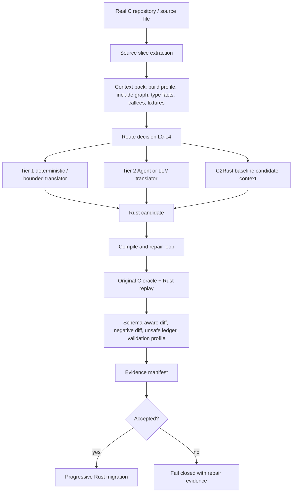
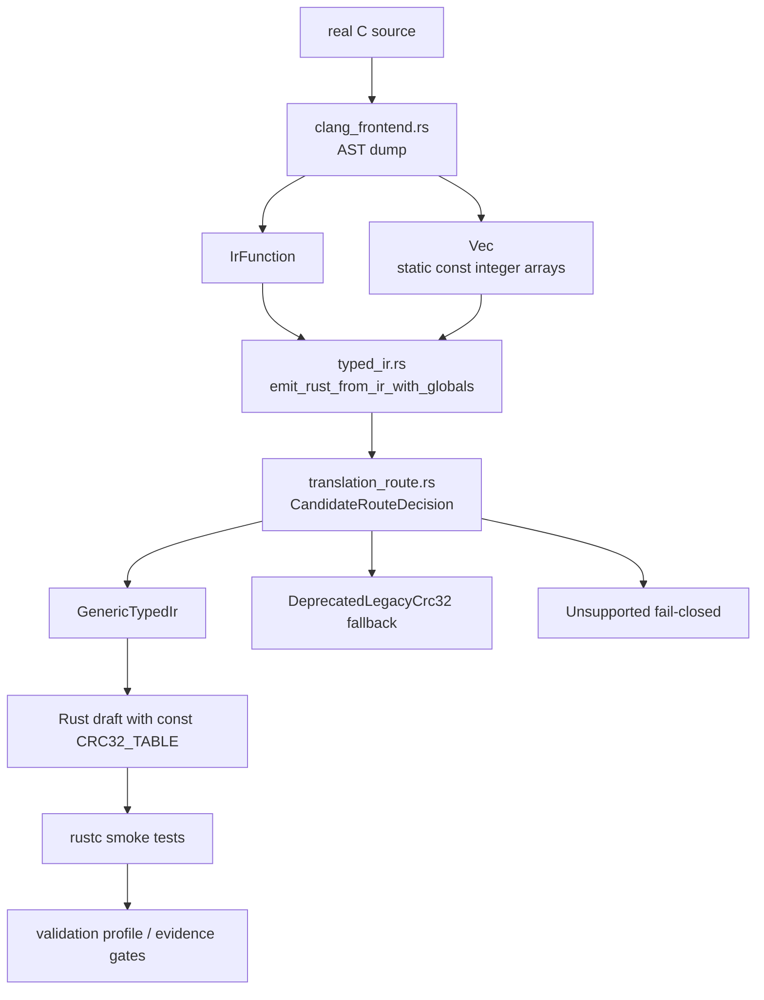

# CONTEXT.md

本文件用于把当前会话的关键上下文固化到仓库中。一个完全看不到聊天记录的新 Codex 会话，读取本文件和代码仓库后，应能准确理解当前项目状态，并直接继续工作。

## 1. 当前仓库与路径

- 当前应继续工作的本地路径：`C:\Users\Administrator\Documents\c-to-rust-flashdb`
- GitHub 仓库：`https://github.com/guoqihan342-svg/c-to-rust`
- 当前分支：`codex/flashdb-rust-skeleton`
- 当前远端分支：`origin/codex/flashdb-rust-skeleton`
- 最近已推送提交：
  - `3d12e65c5599441e9886acb29c8ac40f196d7b22`
  - message: `Add C2Rust baseline route evidence pipeline`
- 注意：`C:\Users\Administrator\Documents\c-to-rust` 是早期或主工作区路径，当前这轮 FlashDB/C2Rust pipeline 工作不要误切回那里继续开发，除非用户明确要求。
- C2Rust 参考源码路径：`F:\agent\c2rust-master`
  - 这是参考项目和潜在工具链来源。
  - 当前工作区没有确认可直接调用的 `c2rust` 可执行文件。

如果默认 Git HTTPS push 遇到 `Recv failure: Connection was reset`，此前可用的推送命令是：

```powershell
git -c http.version=HTTP/1.1 -c http.postBuffer=524288000 push origin codex/flashdb-rust-skeleton
```

## 2. 用户当前项目要求

项目目标是构建一个面向 Codex、OpenCode 或其他 Agent 调用的 C 到 Rust 渐进式迁移 Agent / pipeline。它不是只服务一个人工 demo，而是要逐步走向真实 C 项目的受限自动翻译与强验证。

当前明确要求：

- 使用 OpenSpec 管理需求、设计、任务和验收。
- 复杂任务可以开多个智能体或并行子任务，但共享文件写入必须受控，不能互相覆盖。
- 项目不再要求“小而精”，可以适当扩大规模以补齐真实翻译能力。
- 不再把 10000 轮回归作为每次开发的阻塞条件。
- 日常当前先跑 10 轮、默认 10000 轮等固定轮数要求已经去掉。
- 回归轮数应作为 validation profile 或运行策略输入，而不是硬编码全局门禁。
- Rust first-party non-test `unsafe` 比例必须小于 10%。
- “最好为 0% unsafe”已从硬性要求中去掉，不能把 0% 当作验收条件。
- 实际只有一个 Agent/LLM 接口，不再区分廉价模型和强模型。
- C2Rust、LLM、手写规则都只能提供 candidate，不是 correctness source。
- 正确性以原始 C 行为和证据链为准。
- 真正的翻译证据必须来自真实 C 源文件自动抽取的 slice/context，不应把手写 `c_source` demo 当作真实迁移成果。
- 需要跨文件深度关联性上下文管理，在不破坏项目模块调用关系的前提下，实现单点渐进式重构。
- 编译/编译自愈需要双向闭环：根据 error stack 精确定位、自动打补丁、重新验证。
- 语义等价性要求非常高：业务逻辑不能被破坏，测试和 oracle 证据必须覆盖主干路径。
- 重构后的 FlashDB Rust 目录名目标仍可使用 `flashDB_rust`，但当前本分支重点已经从手写 FlashDB 重写转向“受限自动翻译器 + 强验证项目”。

一个重要边界：不要再恢复旧的 `flashdb-10000` 自动心跳或默认长跑监控。用户已经明确表示自动化消息让人困扰，并取消了 10000 轮作为日常阻塞条件。

## 3. 当前核心方案

当前采用的是治理优先的混合式 C 到 Rust 迁移 pipeline：



设计原则：

- C2Rust baseline 用于候选上下文、对照和 cross-check，不作为正确性证明。
- LLM/Agent 翻译可以作为兜底，但所有候选必须走统一验证门禁。
- Tree-sitter 或手写语法扫描只能提供 syntax indexing，不能直接证明类型、别名和 UB 语义。
- 真实 typed semantic facts 需要 compile profile、clang/libclang、原始 C oracle 或显式 unsupported/block 记录。
- C-side UB 和 Rust-side UB 证据要分开。MIRI 不是 C UB 证明。
- OpenSpec 管能力和批次，slice evidence manifest 管每个函数迁移证据。
- 不支持的情况必须 fail closed，不能假装翻译成功。

## 4. 已完成的主要实现

最近完成并推送的 OpenSpec change：

- `openspec/changes/add-c2rust-baseline-migration-pipeline/`

该 change 的任务已全部勾选完成，核心目标是把 C2Rust baseline、route decision 和 validation profile 纳入 L3 自动翻译证据链。

关键新增或修改：

- `validation/tools/auto_migrate.py`
  - 生成 C2Rust baseline manifest。
  - 生成 route decision。
  - 生成 validation profile。
  - 将这三类证据绑定到 auto manifest、L3 evidence manifest、final verification、cache metadata 和 generated artifacts。
  - cache identity 包含 `c2rust_baseline_identity`、`route_decision_identity`、`validation_profile_identity`。
  - route 为 L4 时 fail closed，写出 blocked repair evidence。
  - semantic pass 改为基于 `accepted`、Rust compile/check 和 validation profile 共同判定，不能绕过 profile。

- `validation/tools/validate_auto_translation_evidence.py`
  - 校验 C2Rust baseline manifest schema。
  - 校验 route decision schema。
  - 校验 validation profile schema。
  - 校验 auto manifest、L3 manifest、final verification、cache metadata 之间的引用一致性。
  - 校验 sha256、status consistency、route/profile consistency、cache identity fields。
  - semantic pass 要求 profile passed、没有 skipped gates、route 不是 L4，并且 C2Rust 仍保持 `candidate_context_only`。

- `validation/tools/extract_source_slice.py`
  - 用于从真实 C 源文件自动抽取函数 slice。
  - 真实源函数迁移必须先走这个工具或等价自动抽取路径。

- `validation/tools/test_extract_source_slice.py`
  - 覆盖真实源 slice 抽取行为。

- 新增 schema：
  - `validation/auto-translation-template/c2rust-baseline-manifest.schema.json`
  - `validation/auto-translation-template/route-decision.schema.json`
  - `validation/auto-translation-template/validation-profile.schema.json`

- 修改 schema：
  - `validation/l3-template/evidence-manifest.schema.json`
    - 已要求 L3 evidence manifest 包含 `c2rust_baseline`、`route_decision`、`validation_profile`。

- 文档更新：
  - `validation/README.md`
  - `validation/gates.md`

- OpenSpec active spec 更新：
  - `openspec/specs/flashdb-l3-agent-migration-loop/spec.md`
  - 已将 `unsafe` 要求改为 first-party non-test `<10%`，不再写 0% 硬性要求。

## 5. 当前真实证据状态

真实 FlashDB slice spec：

- `validation/slice-specs/flashdb-real-fdb-calc-crc32.json`

对应证据目录：

- `validation/evidence/flashdb/auto-translation/real-fdb-calc-crc32/`

此前运行命令：

```powershell
python validation/tools/auto_migrate.py --slice-spec validation/slice-specs/flashdb-real-fdb-calc-crc32.json --skip-c-oracle
python validation/tools/validate_auto_translation_evidence.py --target-id flashdb --slice-id real-fdb-calc-crc32 --slice-spec validation/slice-specs/flashdb-real-fdb-calc-crc32.json
```

当前结果必须如实理解：

- schema validation 通过。
- semantic pass 不成立。
- route decision 是 `L4`。
- route status 是 `refused`。
- `translator.kind` 是 `refuse`。
- `candidate_generation_allowed` 是 `false`。
- validation profile 是 `L4-dev`，status 是 `blocked`。
- C2Rust baseline manifest status 是 `skipped`，原因是本机当前没有可用的 `c2rust` 可执行工具链。
- C2Rust baseline 的 `correctness_role` 是 `candidate_context_only`。
- auto manifest status 是 `candidate_generated`，但 `semantic_pass=false`，并且没有 accepted evidence binding。

严禁误判：

- 不要声称 `real-fdb-calc-crc32` 已经完成语义接受。
- 不要声称当前工具已经能自动翻译真实 FlashDB 函数并通过 L3。
- 当前完成的是“证据合约、路线决策、C2Rust baseline 接入点、fail-closed 机制和验证器硬化”，不是完整真实函数迁移成功。

## 6. 最近验证结果

最近一次代码提交前完成的验证：

```powershell
python -m unittest validation.tools.test_extract_source_slice validation.tools.test_auto_migrate validation.tools.test_validate_auto_translation_evidence
```

结果：

```text
Ran 32 tests in 37.812s
OK
```

OpenSpec 验证：

```powershell
openspec validate --all --strict
```

结果：

```text
37 passed, 0 failed
```

空白和补丁检查：

```powershell
git diff --check
```

结果：通过。Windows 下曾出现 CRLF warning，但不是失败。

当前分支已推送到远端，推送后远端验证为：

```text
3d12e65c5599441e9886acb29c8ac40f196d7b22 refs/heads/codex/flashdb-rust-skeleton
```

## 7. 新会话接手后的第一组命令

建议新会话先运行：

```powershell
cd C:\Users\Administrator\Documents\c-to-rust-flashdb
git status --short --branch --untracked-files=all
git log -3 --oneline --decorate
openspec validate --all --strict
python -m unittest validation.tools.test_extract_source_slice validation.tools.test_auto_migrate validation.tools.test_validate_auto_translation_evidence
python validation/tools/validate_auto_translation_evidence.py --target-id flashdb --slice-id real-fdb-calc-crc32 --slice-spec validation/slice-specs/flashdb-real-fdb-calc-crc32.json
```

如果只是文档改动，不需要重跑完整迁移。若要继续开发 translator、validator 或 evidence schema，至少跑上面的 unittest 和 OpenSpec validate。

## 8. 代码地图

核心 pipeline：

- `validation/tools/auto_migrate.py`
  - 自动迁移主入口。
  - 负责生成 candidate、manifest、route、profile、cache metadata 和最终证据。

- `validation/tools/validate_auto_translation_evidence.py`
  - 自动迁移证据校验器。
  - 是防止证据链退化的关键门禁。

- `validation/tools/extract_source_slice.py`
  - 从真实 C 源文件抽取函数 slice。
  - 后续真实函数迁移应优先扩展这里，而不是继续手写 `c_source` demo。

关键 schema：

- `validation/auto-translation-template/auto-translation-manifest.schema.json`
- `validation/auto-translation-template/c2rust-baseline-manifest.schema.json`
- `validation/auto-translation-template/route-decision.schema.json`
- `validation/auto-translation-template/validation-profile.schema.json`
- `validation/l3-template/evidence-manifest.schema.json`

关键 docs：

- `validation/README.md`
- `validation/gates.md`
- `openspec/specs/flashdb-l3-agent-migration-loop/spec.md`
- `openspec/changes/add-c2rust-baseline-migration-pipeline/design.md`
- `openspec/changes/add-c2rust-baseline-migration-pipeline/tasks.md`

## 9. 下一步建议

建议优先级如下：

1. 不要继续堆 demo 规则。先把真实源函数自动抽取、typed context 和 oracle harness 做实。
2. 安装或接入可用 C2Rust 工具链，让 baseline manifest 从 `skipped` 进入真实 `generated` 或明确 `blocked`。
3. 选一个比 `fdb_calc_crc32` 更小、更清晰的真实 FlashDB 函数，目标是跑出第一个真实 accepted L3 semantic pass。
4. 将当前 route 逻辑提前到 candidate generation 之前，避免“先生成再 backfill route”的时序不够干净。
5. 接入 clang/libclang 或等价 typed semantic fact provider，补足 tree-sitter/字符串扫描无法提供的类型、别名、宏和 include 事实。
6. 自动生成 C oracle harness 初稿和 Rust replay test 初稿。
7. 对 compile error stack 做结构化 repair hints，并将修复循环限制为 fail-closed。
8. 增加 fuzz/property profile，但不要恢复 10000 轮硬阻塞。
9. 如用户要求提交或发 PR，再基于当前分支创建 PR；当前不要擅自改变目标仓库或路径。

## 10. 与外部评价和论文对齐后的结论

用户接受过的关键判断：

- 之前的手写翻译规则和少量 demo 不能代表真实自动翻译能力。
- `flashDB_rust` 更接近手写 safe Rust 重写 + 差分验证成果，不能当作翻译器自动产出的证据。
- Corrode 的优点是能作为通用 C99 到 Rust 翻译器处理广度，即使输出不够 idiomatic 或 unsafe 偏多；当前项目需要吸收的是自动读取 C 文件、解析函数、生成候选和证据的 pipeline 能力。
- Rustine/SACTOR/Syzygy 等方案说明，“LLM/Agent 候选 + 强验证 + 修复闭环”比只靠手写规则更现实。
- 本项目差异化不应吹成“验证世界第一”或“翻译已规模化”，而应定位为：
  - Agent 编排友好。
  - OpenSpec 治理。
  - 机器可读证据交接。
  - fail-closed。
  - 原始 C oracle 驱动的可审计渐进迁移。

## 11. 工作习惯与沟通注意

- 用户偏好中文状态、中文文档和清晰的路径说明。
- 用户反复强调“开多几个智能体干活”，但并行应只用于互不冲突的分析、测试、调研或独立文件任务。
- 用户不喜欢无意义等待和频繁自动消息。长跑监控不应主动恢复。
- 如果问“好了没有”，必须回答已验证状态、剩余缺口和下一步，不要把 partial pass 说成 done。
- 如果要提交或推送，必须先验证，并且只有实际完成 git action 后才能在最终答复里发 git directive。
- 如果工作涉及 OpenSpec artifact，保留 parser-required anchors，例如 `Purpose`、`Requirements`、`Scenario`、`WHEN`、`THEN`、`## ADDED Requirements` 和任务 checkbox 语法。

## 12. 2026-06-26 最新接手状态

本轮继续推进了两个 fail-closed 证据硬化点：

1. L4/refused route 不再被记录为 `candidate_generated`。
   - `validation/tools/auto_migrate.py` 会把 L4/refused 自动迁移 run 的 auto manifest 标为 `candidate_refused`。
   - 对应 plan/events/replay 里的 Rust draft 状态为 `blocked` diagnostic，而不是 candidate evidence。
   - `validation/tools/validate_auto_translation_evidence.py` 会拒绝 L4/refused 下顶层或嵌套残留的 `candidate_generated` / `status: candidate` 证据。

2. 真实源码 slice 抽取开始记录同文件顶层全局对象依赖。
   - `validation/tools/extract_source_slice.py` 现在会从 masked function body 中识别同文件顶层对象引用。
   - 已加测试覆盖：真实引用会记录 global dependency；注释、字符串、参数同名 shadowing 和局部变量同名 shadowing 不会误报。
   - 局部同名 shadowing 现在按作用域 span 判断，不会因为内层 block 声明过同名局部变量，就漏掉 block 外对同文件全局对象的真实引用。
   - 复审后又修了一个 `:` 解析边界：三元表达式初始化（如 `value ? 1U : 2U`）不会被误当成 C label，从而不会漏记局部 shadow binding。
   - `validation/slice-specs/flashdb-real-fdb-calc-crc32.json` 已刷新，`c_boundary.direct_dependencies` 现在包含 `crc32_table`：
     - `kind: global`
     - `name: crc32_table`
     - `source: extracted_function_body_reference`
     - `definition_status: same_file_top_level_declared`
     - `source_span.file: src/fdb_utils.c`
     - `source_span.line_start: 21`
     - `source_span.line_end: 66`

真实 `real-fdb-calc-crc32` evidence 已用当前工具刷新，但状态仍必须如实理解：

- auto manifest status: `candidate_refused`
- route level/status: `L4` / `refused`
- validation profile: `L4-dev` / `blocked`
- semantic pass: `false`
- C2Rust baseline: `skipped`
- 不要声明该 slice 已 accepted L3，也不要声明当前工具已能自动翻译真实 FlashDB 函数通过语义门禁。
- 即使将来对 L4/refused 路线使用 `--accept-existing-evidence`，生成 draft 的 evidence status 也必须保持 `blocked`，不能被 promotion 路径重新写成 `candidate`。

本轮已验证过的命令：

```powershell
python -m unittest validation.tools.test_extract_source_slice validation.tools.test_auto_migrate validation.tools.test_validate_auto_translation_evidence
python validation/tools/validate_auto_translation_evidence.py --target-id flashdb --slice-id real-fdb-calc-crc32 --slice-spec validation/slice-specs/flashdb-real-fdb-calc-crc32.json
openspec validate add-c2rust-baseline-migration-pipeline --strict
openspec validate --all --strict
```

建议下一步优先级：

1. 继续把真实源 context 做实：把 `direct_dependencies` 中的 `global` 依赖喂给 context pack/type-map/oracle harness draft。
2. 针对 `crc32_table` 这类同文件全局 const 数据，生成明确的 harness/linkage requirement，而不是继续把 oracle harness 停留在占位 `puts()`。
3. 仍然不要恢复 10000 轮硬阻塞；验证轮数只作为 profile/run-policy 输入。

## 13. 2026-06-26 继续推进：global dependency 进入证据链

本轮把 `c_boundary.direct_dependencies` 里的同文件 global 依赖从“原始 metadata”提升为一等证据字段：

1. `validation/tools/auto_migrate.py`
   - 新增 `global_dependency_requirements(spec)`，统一从 slice spec 过滤 `kind=global` 依赖。
   - `context-pack` 现在写入：
     - `global_dependencies`
     - `source_boundary.globals`
   - `type-map` 现在写入 `global_dependencies`，不再让全局对象依赖在 type-map 中静默空白。
   - `pointer-graph.source_boundary.globals` 现在来自同一份 global dependency 列表。
   - C oracle status 现在写入 `global_linkage_requirements`。
   - C oracle harness draft 现在至少在注释中记录 `global dependency: <name>`，用于提醒后续真实 harness 必须把该全局对象纳入同一编译/链接边界。
   - cache metadata 增加 `global_dependency_identity`，并把它列入 `cache_input_fields`。

2. `validation/tools/validate_auto_translation_evidence.py`
   - 新增跨 artifact invariant：只要 slice spec 存在 `kind=global` 依赖，就要求 context-pack、type-map、oracle status、pointer source boundary、cache identity 和 harness draft 同步声明该依赖。
   - 已加负测：删除 type-map 的 `global_dependencies` 或删除 oracle status 的 `global_linkage_requirements` 时，schema-only validator 也必须失败。
   - 复审后继续加严：global dependency 不再只按 `name` 校验，还会校验完整 canonical object，包括 `source_span`、`sha256`、`definition_status`、`linkage_requirement` 和 `semantic_status`。
   - validator 现在也检查 `slice-contract.c_boundary.direct_dependencies`，防止 slice-contract 陈旧但其它 artifact 看似同步。
   - cache metadata 的 `global_dependency_identity.count/names/sha256` 会按 canonical global dependency 列表重算校验。
   - L4/refused 下的状态扫描扩展为拒绝 `candidate`、`candidate_generated`、`draft_generated` 和 `accepted_after_gates`，避免 refused route 混入候选或接受态 artifact。

3. `real-fdb-calc-crc32` 已刷新：
   - `crc32_table` 已出现在 `context-pack.global_dependencies`。
   - `crc32_table` 已出现在 `type-map.global_dependencies`。
   - `crc32_table` 已出现在 `pointer-graph.source_boundary.globals`。
   - `crc32_table` 已出现在 `c-oracle-status.global_linkage_requirements`。
   - harness draft 中已有 `global dependency: crc32_table` 注释。
   - cache metadata 中已有 `global_dependency_identity.names: ["crc32_table"]`。

状态仍然是 fail-closed：

- auto manifest status: `candidate_refused`
- route level/status: `L4` / `refused`
- validation profile: `L4-dev` / `blocked`
- semantic pass: `false`
- 不要把这次证据链补强解释成 accepted L3 或真实语义通过。

下一步建议：

1. 把 oracle harness 从注释要求推进到可编译初稿：包含真实函数 prototype、fixture 输入绑定、同文件 global/source linkage 说明和待编译命令。
2. 为 global dependency 增加更强 typed fact：数组维度、元素类型、const/extern/static/linkage 属性。
3. 继续保持 validator 的 fail-closed 风格：任何将来要 claim semantic pass 的路径，都必须证明 global dependency 被 oracle/replay/diff 一致覆盖。

## 14. 2026-06-26 路由内嵌证据引用和 cache identity 继续加固

本轮复核发现 real-fdb 的 `route_decision.source_artifacts.translation_plan.sha256`
曾经保留旧值，validator 只检查顶层 manifest/final/cache 引用时会漏过这种嵌套
artifact drift。已修复：

1. `validation/tools/validate_auto_translation_evidence.py`
   - 新增 `validate_route_source_artifact_refs()`。
   - 强校验 route 内的 `type_map`、`cfg`、`pointer_graph`、`c2rust_baseline`
     路径、状态和 sha。
   - 对 `translation_plan` 校验 path/status；如果 route 中出现 sha，则必须匹配
     当前 plan 文件，否则拒绝。
2. `validation/tools/auto_migrate.py`
   - 生成 route decision 时，`source_artifacts.translation_plan` 不再写 sha。
   - 原因是后续 `bind_route_decision_to_generated_artifacts()` 会把 route ref 反向写入
     plan；route 若同时绑定 plan 文件 hash，会形成不稳定的循环引用。
3. `validation/tools/test_validate_auto_translation_evidence.py`
   - 新增 route source artifact stale sha 负测。
   - `cache` identity drift 负测现在覆盖 `c2rust_baseline_identity`、
     `route_decision_identity`、`validation_profile_identity` 三类字段。
   - no-global 场景下也会拒绝残留的 `global_dependency_identity`。

当前 `real-fdb-calc-crc32` 已刷新，`route_decision.source_artifacts.translation_plan`
只保留 path/status，不再保留旧 sha。状态仍是 fail-closed：

- auto manifest status: `candidate_refused`
- route level/status: `L4` / `refused`
- validation profile: `L4-dev` / `blocked`
- semantic pass: `false`

本轮最终验证命令：

```powershell
python -m unittest validation.tools.test_extract_source_slice validation.tools.test_auto_migrate validation.tools.test_validate_auto_translation_evidence
python validation/tools/validate_auto_translation_evidence.py --target-id flashdb --slice-id real-fdb-calc-crc32 --slice-spec validation/slice-specs/flashdb-real-fdb-calc-crc32.json
openspec validate add-c2rust-baseline-migration-pipeline --strict
openspec validate --all --strict
git diff --check
```

## 15. 2026-06-26 C oracle harness draft 可审计化推进

本轮把 C oracle harness draft 从“只有占位 puts 和 global 注释”推进到更可审计的
draft，但仍然保持 fail-closed，不声明语义通过。

1. `validation/tools/auto_migrate.py`
   - `generate_oracle_harness_draft()` 现在从 slice spec 生成目标函数 prototype。
   - harness draft 现在写入：
     - draft-only 边界注释；
     - fixture input 路径；
     - source file/hash 绑定；
     - global dependency trace；
     - 目标函数 prototype；
     - TODO 占位，明确还没有 fixture value load 和 observable assertion。
   - `c-oracle-status.json` 新增：
     - `toolchain_status: DRAFT_NOT_EXECUTED`
     - `fixture_binding`
     - `harness_contract`
     - `compile_command_draft`
   - `status` 仍是 `SKIPPED_LOCAL_NO_C_TOOLCHAIN` 或 `DRAFT_GENERATED`，`semantic_pass` 仍是 `false`。
2. `validation/tools/validate_auto_translation_evidence.py`
   - 新增 `validate_oracle_harness_contract()`。
   - 当 slice spec 有 global dependency 时，强制 oracle status 提供 `harness_contract`。
   - 校验 function prototype、fixture binding、source file list、compile command draft 和
     `harness_contract.global_dependencies` 与 canonical global dependency 列表一致。
   - 新增 draft oracle fail-closed invariant：如果 C oracle 不是 `C_ORACLE_GENERATED`
     且 `semantic_pass=true`，则 final verification、evidence manifest、validation profile
     不得宣称 passed 或 semantic pass。
   - 为兼容旧无 global 的静态 demo evidence，`harness_contract` 只在存在 global dependency
     或 artifact 自己声明该 contract 时强制。
3. `real-fdb-calc-crc32` 已刷新：
   - `harness_contract.function_prototype` 为
     `uint32_t fdb_calc_crc32(uint32_t crc, const void *buf, size_t size);`
   - `fixture_binding.binding_status` 为 `missing_or_empty`。
   - `toolchain_status` 为 `DRAFT_NOT_EXECUTED`。
   - 没有写入 `C_ORACLE_GENERATED`、`semantic_pass=true` 或 `accepted_evidence_bound`。

本轮验证命令：

```powershell
python -m unittest validation.tools.test_extract_source_slice validation.tools.test_auto_migrate validation.tools.test_validate_auto_translation_evidence
python validation/tools/validate_auto_translation_evidence.py --target-id flashdb --slice-id real-fdb-calc-crc32 --slice-spec validation/slice-specs/flashdb-real-fdb-calc-crc32.json
rg -n '"toolchain_status"\s*:\s*"C_ORACLE_GENERATED"|"semantic_pass"\s*:\s*true|"status"\s*:\s*"accepted_evidence_bound"' validation/evidence/flashdb/auto-translation/real-fdb-calc-crc32
```

下一步建议：

1. 给 harness draft 增加 `harness_draft_ref` 或 `c_oracle_harness_identity`，并放进
   cache input fields，防止 harness 文件内容漂移但 status/cache 不失效。
2. 把 compile command 从 evidence-dir 相对 `-Iinc` 推进到 source-root 解析后的 include/source
   linkage plan。
3. 只有在 fixture cases、expected outputs、编译执行和 diff/negative/unsafe gates 都齐全时，
   才允许推进 `C_ORACLE_GENERATED`。

## 16. 2026-06-26 C oracle harness draft identity 纳入 cache

本轮把 harness draft 文件本身纳入证据身份，防止 C harness 文件内容变化但
`c-oracle-status.json` 和 cache metadata 不失效。

1. `validation/tools/auto_migrate.py`
   - `generate_oracle_harness_draft()` 写完 harness 文件后生成 `harness_draft_ref`。
   - `harness_draft_ref` 绑定：
     - `path`
     - `status: draft`
     - harness 文件内容 `sha256`
   - `CACHE_INPUT_FIELDS` 新增 `c_oracle_harness_identity`。
   - `cache_identity()` 新增 `c_oracle_harness_identity`，值来自 oracle status 的
     `harness_draft_ref`，只 hash harness 文件，不 hash 整个 oracle status，避免自引用或过宽失效。
   - `promote_accepted_oracle()` 保留 draft harness identity；accepted oracle 语义仍来自外部
     accepted evidence，不来自 draft harness。
2. `validation/tools/validate_auto_translation_evidence.py`
   - `validate_oracle_harness_contract()` 现在校验 `harness_draft_ref` 指向同一个 harness 文件，
     且 sha/status 匹配。
   - cache metadata 必须包含 `c_oracle_harness_identity`，并且该字段必须列在
     `cache_input_fields` 中。
   - cache 中的 `c_oracle_harness_identity` 必须完整等于 oracle status 的 `harness_draft_ref`。
   - draft/pass 判断改为以 `toolchain_status == C_ORACLE_GENERATED` 为准；仅伪造顶层
     `status: C_ORACLE_GENERATED` 不能越过 draft fail-closed 检查。
3. `validation/tools/test_auto_migrate.py`
   - 覆盖生成端 `harness_draft_ref` 和 cache identity 输出。
4. `validation/tools/test_validate_auto_translation_evidence.py`
   - 覆盖 harness draft ref sha 漂移。
   - 覆盖 cache oracle harness identity 漂移。
   - 覆盖顶层 oracle status 伪装通过但 `toolchain_status` 仍为 draft 的拒绝路径。

当前 `real-fdb-calc-crc32` 已刷新：

- `c-oracle-status.json` 有 `harness_draft_ref`。
- `auto-cache-metadata.json` 有 `c_oracle_harness_identity`，并列入 `cache_input_fields`。
- 状态仍是 fail-closed：`toolchain_status: DRAFT_NOT_EXECUTED`、`semantic_pass: false`、
  `candidate_refused`、`L4/refused`。

下一步建议：

1. 把 `compile_command_draft` 从 evidence-dir 相对 `-Iinc` 推进到 source-root 解析后的 include/source linkage plan。
2. 给 fixture cases 和 expected outputs 建立真实 oracle 输入输出绑定。
3. 只有在 C oracle 编译/执行和 diff/negative/unsafe gates 齐全时，才考虑推进 `C_ORACLE_GENERATED`。

## 17. 2026-06-26 C oracle compile draft source-root linkage

本轮把 `compile_command_draft` 从只包含 evidence-dir 相对 `-Iinc` 的弱 draft，推进为可由 validator
复算的 source-root include/source linkage plan。状态仍然 fail-closed，不声明 C oracle 已编译或语义通过。

1. `validation/tools/auto_migrate.py`
   - `c_oracle_compile_command()` 现在写入：
     - `source_root`
     - `defines`
     - `resolved_include_paths`
     - `link_source_files`
     - `link_strategy: compile_harness_with_declared_c_boundary_sources`
     - 精确 `argv`
   - include path 由 `source.source_root + build_profile.include_paths[]` 解析。
   - C source linkage 由 `source.source_root + c_boundary.files[]` 解析，并保留原始 path、role、sha256。
   - 已兼容 `c_boundary.files[].path` 已经带 source-root 前缀的历史样本，避免生成 `unit/unit/...`。
   - `build_profile.defines[]` 现在显式进入 `defines` 和 `argv` 的 `-D...`。
2. `validation/tools/validate_auto_translation_evidence.py`
   - `validate_oracle_harness_contract()` 不再只检查 argv 中有 harness 文件名。
   - 新增 `validate_compile_command_draft()`，按 slice spec 复算并强校验：
     - `working_directory`
     - `source_root`
     - `defines`
     - `resolved_include_paths`
     - `link_source_files`
     - `link_strategy`
     - 完整 `argv`
     - `status: draft_not_executed`
   - 额外 object、response-file、错误 include 或漏掉 source file 都会因 argv 不匹配而失败。
3. `validation/tools/test_auto_migrate.py`
   - `test_global_dependency_flows_into_context_type_map_and_oracle_requirements` 覆盖：
     - `source_root: unit`
     - `-DUNIT_TEST=1`
     - `-Iunit/inc`
     - `unit/global.c` source linkage
4. `validation/tools/test_validate_auto_translation_evidence.py`
   - 新增 include path drift 负测。
   - 新增 source linkage drift 负测。

当前 `real-fdb-calc-crc32` 已刷新：

- `compile_command_draft.resolved_include_paths` 为
  `C:/Users/Administrator/Documents/c-to-rust/sources/FlashDB/inc`。
- `compile_command_draft.link_source_files[0].resolved_path` 为
  `C:/Users/Administrator/Documents/c-to-rust/sources/FlashDB/src/fdb_utils.c`。
- `compile_command_draft.defines` 为空数组，符合当前 slice spec。
- 状态仍是 fail-closed：`toolchain_status: DRAFT_NOT_EXECUTED`、`semantic_pass: false`、
  `candidate_refused`、`L4/refused`。

本轮最终验证命令：

```powershell
python -m unittest validation.tools.test_extract_source_slice validation.tools.test_auto_migrate validation.tools.test_validate_auto_translation_evidence
python validation/tools/validate_auto_translation_evidence.py --target-id flashdb --slice-id real-fdb-calc-crc32 --slice-spec validation/slice-specs/flashdb-real-fdb-calc-crc32.json
rg -n '"toolchain_status"\s*:\s*"C_ORACLE_GENERATED"|"semantic_pass"\s*:\s*true|"status"\s*:\s*"accepted_evidence_bound"' validation/evidence/flashdb/auto-translation/real-fdb-calc-crc32
openspec validate add-c2rust-baseline-migration-pipeline --strict
openspec validate --all --strict
git diff --check
```

验证结果：

- 59 个 Python 单测通过。
- real-fdb validator 通过，且 `semantic_pass=false`。
- 禁止状态扫描无匹配。
- `openspec validate add-c2rust-baseline-migration-pipeline --strict` 通过。
- `openspec validate --all --strict` 37/37 通过。
- `git diff --check` 通过，仅有 Windows CRLF 提示。

下一步建议：

1. 给 fixture cases 和 expected outputs 建立真实 oracle 输入输出绑定。
2. 将 compile draft 推进到可实际执行的 C oracle 编译命令，但只有执行和输出 diff 证据齐全后才允许
   `C_ORACLE_GENERATED`。
3. 继续保持 validator fail-closed：任何新路径要 claim semantic pass，必须同时覆盖 C oracle、Rust replay、
   diff、negative diff、unsafe gates 和版本/config 绑定。

## 18. 2026-06-26 C oracle fixture case/output binding

本轮把 `fixture_contract.cases` 和 expected outputs 纳入 C oracle draft 的可审计绑定，但仍不执行
C oracle，也不声明语义通过。

1. `validation/tools/auto_migrate.py`
   - `oracle_fixture_binding()` 现在写入：
     - `observable_outputs`
     - `case_bindings`
     - `expected_output_status`
   - `case_bindings[]` 记录：
     - `id`
     - `input_ref`
     - `expected_ref`
     - `expected_outputs`
     - `observable_outputs`
     - `missing_observable_outputs`
     - `binding_status`
   - 支持两类 expected output 来源：
     - case 内联 `expected_outputs`
     - JSON fixture/expected 文件中的 `{ "cases": [...] }` 或顶层数组，并按 `cases[N]` 引用解析
   - 解析时只抽取 `observable_outputs` 指定字段，避免把 input-only 字段误标成 oracle output。
   - harness draft 新增审计注释：
     - `fixture cases: <N>`
     - `observable outputs: ...`
     - `fixture case: <id> input_ref=... expected_ref=... expected_outputs=...`
2. `validation/tools/validate_auto_translation_evidence.py`
   - 新增同构 fixture binding 复算逻辑。
   - `validate_oracle_harness_contract()` 现在强制：
     - `oracle.fixture_binding` 等于从 slice spec 复算的 binding
     - `harness_contract.fixture` 等于同一份 binding
     - harness draft 文本包含 fixture case/output 审计注释
   - 顶层 fixture binding 或 harness contract fixture 任一处 expected output 漂移都会失败。
3. `validation/tools/test_auto_migrate.py`
   - 新增 direct unit test：从临时 fixture JSON 的 `cases[1]` 提取 `value: 42`，并确认不会抽取
     `input_only` 字段。
   - 既有 global dependency 测试现在覆盖内联 expected output、harness 注释和
     `harness_contract.fixture == fixture_binding`。
4. `validation/tools/test_validate_auto_translation_evidence.py`
   - 新增顶层 `fixture_binding.case_bindings[].expected_outputs` 漂移负测。
   - 新增 `harness_contract.fixture.case_bindings[].expected_outputs` 漂移负测。

当前 `real-fdb-calc-crc32` 已刷新：

- `fixture_binding.case_bindings` 为空数组。
- `fixture_binding.expected_output_status` 为 `missing_or_empty`。
- harness draft 包含 `fixture cases: 0` 和 `observable outputs: return_code`。
- 状态仍是 fail-closed：`toolchain_status: DRAFT_NOT_EXECUTED`、`semantic_pass: false`、
  `candidate_refused`、`L4/refused`。

本轮最终验证命令：

```powershell
python -m unittest validation.tools.test_extract_source_slice validation.tools.test_auto_migrate validation.tools.test_validate_auto_translation_evidence
python validation/tools/validate_auto_translation_evidence.py --target-id flashdb --slice-id real-fdb-calc-crc32 --slice-spec validation/slice-specs/flashdb-real-fdb-calc-crc32.json
rg -n '"toolchain_status"\s*:\s*"C_ORACLE_GENERATED"|"semantic_pass"\s*:\s*true|"status"\s*:\s*"accepted_evidence_bound"' validation/evidence/flashdb/auto-translation/real-fdb-calc-crc32
openspec validate add-c2rust-baseline-migration-pipeline --strict
openspec validate --all --strict
git diff --check
```

验证结果：

- 62 个 Python 单测通过。
- real-fdb validator 通过，且 `semantic_pass=false`。
- 禁止状态扫描无匹配。
- `openspec validate add-c2rust-baseline-migration-pipeline --strict` 通过。
- `openspec validate --all --strict` 37/37 通过。
- `git diff --check` 通过，仅有 Windows CRLF 提示。

下一步建议：

1. 将 C oracle compile draft 推进到真实可执行的编译步骤，但先只记录 execution attempt/diagnostics，
   不直接提升 `C_ORACLE_GENERATED`。
2. 给 real-fdb 增加最小 fixture cases/expected outputs，或显式记录当前缺少 fixture cases 的阻塞原因。
3. 只有 C oracle 编译、执行、Rust replay、diff/negative/unsafe/version gates 全部通过后，才允许
   语义通过路径。

## 19. 2026-06-26 C oracle compile execution diagnostics

本轮把 C oracle compile draft 推进到可执行的编译尝试记录，但仍只作为诊断证据；
不会因为 C draft 编译成功就声明 `C_ORACLE_GENERATED` 或 `semantic_pass=true`。

1. `validation/tools/auto_migrate.py`
   - `generate_oracle_harness_draft()` 现在写入 `compile_execution`。
   - `c_oracle_compile_execution()` 支持：
     - `skipped_by_flag`
     - `missing_argv`
     - `compiler_not_found`
     - `compile_timeout`
     - `compile_failed`
     - `compile_succeeded_not_oracle`
   - 非 skip 路径会在 evidence dir 下执行 `compile_command_draft.argv`，记录 `compiler_path`、
     `returncode`、截断后的 `stdout/stderr` 和 diagnostics。
   - `compile_succeeded_not_oracle` 只表示 draft 编译命令可跑通，仍不是 C oracle 语义通过。
2. `validation/tools/validate_auto_translation_evidence.py`
   - `validate_compile_execution()` 强制校验：
     - `argv` 必须等于 `compile_command_draft.argv`
     - `working_directory` 必须等于 `compile_command_draft.working_directory`
     - `semantic_pass` 必须为 `false`
     - `status` 必须映射到唯一允许的 `toolchain_status_after_attempt`
     - `toolchain_status_after_attempt` 必须等于顶层 `toolchain_status`
   - 状态映射为：
     - `skipped_by_flag -> DRAFT_NOT_EXECUTED`
     - `missing_argv/compiler_not_found -> COMPILE_NOT_EXECUTED`
     - `compile_failed/compile_timeout -> COMPILE_FAILED`
     - `compile_succeeded_not_oracle -> COMPILE_SUCCEEDED_NOT_ORACLE`
   - 新增负向约束：`skipped_by_flag` 不能伪造 `C_ORACLE_GENERATED`。
   - `validate_draft_oracle_fail_closed()` 的 accepted early return 现在必须同时满足
     `status == C_ORACLE_GENERATED`、`toolchain_status == C_ORACLE_GENERATED` 和
     `semantic_pass is true`。
3. `validation/tools/test_auto_migrate.py`
   - 覆盖 skip 模式下的 `compile_execution` 输出结构。
4. `validation/tools/test_validate_auto_translation_evidence.py`
   - 覆盖 `compile_execution.argv` 漂移。
   - 覆盖 `skipped_by_flag` 伪造 generated toolchain 的拒绝路径。
   - 覆盖顶层 `toolchain_status`/`semantic_pass` 伪造但 oracle `status` 仍非 generated 的拒绝路径。
5. 并行审查结论
   - 子智能体读到的主要风险是：`compile_execution` 不能成为 `C_ORACLE_GENERATED` 的旁路。
   - 已按该风险加了 status/toolchain 硬映射和负向测试。

当前 `real-fdb-calc-crc32` 已刷新：

- `compile_execution.status` 为 `skipped_by_flag`。
- `compile_execution.attempted` 为 `false`。
- `compile_execution.toolchain_status_after_attempt` 为 `DRAFT_NOT_EXECUTED`。
- 顶层状态仍是 fail-closed：`toolchain_status: DRAFT_NOT_EXECUTED`、`semantic_pass: false`。
- 禁止状态扫描没有发现 `C_ORACLE_GENERATED`、`semantic_pass: true` 或
  `accepted_evidence_bound`。

本轮最终验证命令：

```powershell
python -m unittest validation.tools.test_extract_source_slice validation.tools.test_auto_migrate validation.tools.test_validate_auto_translation_evidence
python validation/tools/validate_auto_translation_evidence.py --target-id flashdb --slice-id real-fdb-calc-crc32 --slice-spec validation/slice-specs/flashdb-real-fdb-calc-crc32.json
rg -n '"toolchain_status"\s*:\s*"C_ORACLE_GENERATED"|"semantic_pass"\s*:\s*true|"status"\s*:\s*"accepted_evidence_bound"' validation/evidence/flashdb/auto-translation/real-fdb-calc-crc32
openspec validate add-c2rust-baseline-migration-pipeline --strict
openspec validate --all --strict
git diff --check
```

验证结果：

- 65 个 Python 单测通过。
- real-fdb validator 通过，且 `semantic_pass=false`。
- 禁止状态扫描无匹配。
- `openspec validate add-c2rust-baseline-migration-pipeline --strict` 通过。
- `openspec validate --all --strict` 37/37 通过。
- `git diff --check` 通过，仅有 Windows CRLF 提示。

下一步建议：

1. 对 real-fdb 跑一次非 `--skip-c-oracle` 的 compile attempt，保留真实编译器/缺编译器诊断。
2. 给 real-fdb 增加最小 fixture cases/expected outputs，解除当前 `missing_or_empty` 状态。
3. 在 C oracle 编译诊断稳定后，再推进执行、Rust replay、diff/negative/unsafe/version gates；
   只有这些证据齐全时才允许进入 `C_ORACLE_GENERATED` 路径。

## 20. 2026-06-26 real-fdb compile diagnostics and minimal fixture binding

本轮沿第 19 节的下一步继续推进两件事：

1. 对 `real-fdb-calc-crc32` 跑了一次非 `--skip-c-oracle` 的 auto migrate。
2. 给 `real-fdb-calc-crc32` 补了一个最小 fixture case，并刷新 evidence 绑定。

### 非 skip compile attempt

运行命令：

```powershell
python validation/tools/auto_migrate.py --slice-spec validation/slice-specs/flashdb-real-fdb-calc-crc32.json
```

当前 Windows 环境没有 `cc`：

```powershell
where.exe cc
cc --version
```

两者都确认 `cc` 不在 PATH。FlashDB 源路径本身存在：

- `C:\Users\Administrator\Documents\c-to-rust\sources\FlashDB\src\fdb_utils.c`
- `C:\Users\Administrator\Documents\c-to-rust\sources\FlashDB\inc`

刷新后的 `c-oracle-status.json` 记录为：

- `compile_execution.status: compiler_not_found`
- `compile_execution.attempted: false`
- `compile_execution.diagnostics: ["C compiler not found on PATH: cc"]`
- `compile_execution.toolchain_status_after_attempt: COMPILE_NOT_EXECUTED`
- 顶层 `status: DRAFT_GENERATED`
- 顶层 `toolchain_status: COMPILE_NOT_EXECUTED`
- 顶层 `semantic_pass: false`

这仍然是 fail-closed 诊断证据，不是 C oracle 通过证据。

### 最小 fixture case

新增文件：

- `validation/l2_slices/fixtures/real-fdb-calc-crc32.json`

新增的 case：

- `id: empty-crc-zero`
- `crc: 0`
- `buf: []`
- `size: 0`
- `return_code: 0`
- `coverage_kind: empty_buffer_identity`

选择这个 case 的原因：`size=0` 时 `fdb_calc_crc32()` 不解引用 `buf`，也不会读取 `crc32_table`；
函数返回输入 `crc`，所以 `crc=0` 的 expected `return_code=0` 是一个最小可审计边界 case。

`validation/slice-specs/flashdb-real-fdb-calc-crc32.json` 现在在 `fixture_contract.cases[]`
引用该 fixture：

- `input_ref: cases[0]`
- `expected_ref: validation/l2_slices/fixtures/real-fdb-calc-crc32.json`

刷新后的绑定状态：

- `fixture_binding.case_count: 1`
- `fixture_binding.binding_status: declared_not_executed`
- `fixture_binding.expected_output_status: declared_not_executed`
- `fixture_binding.case_bindings[0].expected_outputs: {"return_code": 0}`
- `fixture_binding.case_bindings[0].missing_observable_outputs: []`

harness draft 也已刷新，包含：

```c
/* fixture cases: 1 */
/* observable outputs: return_code */
/* fixture case: empty-crc-zero input_ref=cases[0] expected_ref=validation/l2_slices/fixtures/real-fdb-calc-crc32.json expected_outputs={"return_code": 0} */
```

### 并行审查结论

本轮两个 explorer 子智能体均为只读：

- compile diagnostics explorer 确认非 skip auto migrate 会重写整包 evidence；当前因 `cc` 不在 PATH，
  只记录 `compiler_not_found`，不会进入 subprocess，也不会提升 `C_ORACLE_GENERATED`。
- fixture binding explorer 确认：case payload 应放 fixture JSON，binding metadata 应放 slice spec；
  validator 只从 `observable_outputs` 中抽取 expected output 字段，因此 `crc/buf/size/status`
  不会被误当成 oracle output。

### 本轮最终验证命令

```powershell
python -m unittest validation.tools.test_extract_source_slice validation.tools.test_auto_migrate validation.tools.test_validate_auto_translation_evidence
python validation/tools/validate_auto_translation_evidence.py --target-id flashdb --slice-id real-fdb-calc-crc32 --slice-spec validation/slice-specs/flashdb-real-fdb-calc-crc32.json
rg -n '"toolchain_status"\s*:\s*"C_ORACLE_GENERATED"|"semantic_pass"\s*:\s*true|"status"\s*:\s*"accepted_evidence_bound"' validation/evidence/flashdb/auto-translation/real-fdb-calc-crc32 validation/l2_slices/fixtures/real-fdb-calc-crc32.json validation/slice-specs/flashdb-real-fdb-calc-crc32.json
openspec validate add-c2rust-baseline-migration-pipeline --strict
openspec validate --all --strict
git diff --check
```

验证结果：

- 65 个 Python 单测通过。
- real-fdb validator 通过，且 `semantic_pass=false`。
- 禁止状态扫描无匹配。
- `openspec validate add-c2rust-baseline-migration-pipeline --strict` 通过。
- `openspec validate --all --strict` 37/37 通过。
- `git diff --check` 通过，仅有 Windows CRLF 提示。

下一步建议：

1. 先修一个小的 manifest fixture path 漂移点：顶层 summary 仍从 `fixture_contract.input`
   取值，导致当前 summary 的 `fixture.path` 可能为 `null`；应改为优先 `fixture_contract.path`。
2. 在有 `cc`/clang/gcc 的环境下复跑非 skip compile attempt，记录真实 `compile_failed`
   或 `compile_succeeded_not_oracle`。
3. 之后再推进真实 C harness fixture 加载、函数调用、输出比较、Rust replay 和 diff gates；
   在这些门全部通过之前仍不能进入 `C_ORACLE_GENERATED`。

## 21. 2026-06-26 fixture path fallback consistency

本轮修复了第 20 节发现的 `fixture.path` 漂移：部分输出只读取
`fixture_contract.input`，而 `real-fdb-calc-crc32` 使用的是 `fixture_contract.path`。

### 根因

`validation/tools/auto_migrate.py` 中旧逻辑有两处未统一使用 `fixture_path(spec)`：

1. `emit_manifest()` 顶层 `payload["fixture"]["path"]` 直接读
   `spec.get("fixture_contract", {}).get("input")`。
2. `generate_rust_replay_test_draft()` 的 Rust draft 文本里直接读
   `fixture.get("input", "")`，导致 path-only spec 生成 `let _fixture = '';`。

`write_context_pack()`、L3 evidence manifest、C oracle harness draft 和 replay JSON payload 的多数位置
已经能使用 `path or input`，但上述两处仍有漂移。

### TDD 过程

在 `validation/tools/test_auto_migrate.py` 的
`test_route_baseline_and_validation_profile_evidence_are_emitted` 中把测试 spec 改为只含
`fixture_contract.path`，不含 `input`，并新增两个断言：

- `manifest["fixture"]["path"] == "unit-test-fixture.json"`
- Rust replay draft 包含 `let _fixture = 'unit-test-fixture.json';`

红测结果：

```powershell
python -m unittest validation.tools.test_auto_migrate.AutoMigrateTests.test_route_baseline_and_validation_profile_evidence_are_emitted
```

先失败于：

- `manifest["fixture"]["path"]` 为 `None`
- 修第一处后，又失败于 replay draft 仍为 `let _fixture = '';`

### 实现

`validation/tools/auto_migrate.py` 现在统一使用 `fixture_path(spec)`：

- `emit_manifest().fixture.path`
- `emit_manifest().fixture.hash` 同步改用 `fixture_hash(spec)`
- `generate_rust_replay_test_draft()` 的 draft 文本 `let _fixture = ...`
- `generate_rust_replay_test_draft()` 的 `source_test_inputs.fixtures[].path`
- `generate_rust_replay_test_draft()` 的 `translation_mappings[].source`

### real-fdb 刷新状态

已重跑：

```powershell
python validation/tools/auto_migrate.py --slice-spec validation/slice-specs/flashdb-real-fdb-calc-crc32.json
```

当前 real-fdb evidence：

- auto-translation manifest 顶层 `fixture.path` 为
  `validation/l2_slices/fixtures/real-fdb-calc-crc32.json`。
- Rust replay draft 为：

```rust
let _fixture = 'validation/l2_slices/fixtures/real-fdb-calc-crc32.json';
```

- `test-translation-generated.json` 中：
  - `source_test_inputs.fixtures[0].path` 为实际 fixture 路径。
  - `translation_mappings[0].source` 为实际 fixture 路径。
- `compile_execution.status` 仍为 `compiler_not_found`。
- 顶层 `toolchain_status` 仍为 `COMPILE_NOT_EXECUTED`。
- `semantic_pass` 仍为 `false`。

### 并行审查结论

本轮两个 explorer 子智能体均为只读：

- manifest/replay explorer 找到剩余漂移点：Rust replay draft 的 `let _fixture = ''`。
- validator/evidence explorer 确认当前 validator 不读取 summary 内容；本轮只需修生成端并刷新 evidence，
  不需要立即新增 summary fixture validator 约束。

### 本轮最终验证命令

```powershell
python -m unittest validation.tools.test_auto_migrate.AutoMigrateTests.test_route_baseline_and_validation_profile_evidence_are_emitted
python -m unittest validation.tools.test_extract_source_slice validation.tools.test_auto_migrate validation.tools.test_validate_auto_translation_evidence
python validation/tools/validate_auto_translation_evidence.py --target-id flashdb --slice-id real-fdb-calc-crc32 --slice-spec validation/slice-specs/flashdb-real-fdb-calc-crc32.json
rg -n '"path"\s*:\s*null|let _fixture = ''''|"toolchain_status"\s*:\s*"C_ORACLE_GENERATED"|"semantic_pass"\s*:\s*true|"status"\s*:\s*"accepted_evidence_bound"' validation/evidence/flashdb/auto-translation/real-fdb-calc-crc32 validation/l2_slices/fixtures/real-fdb-calc-crc32.json validation/slice-specs/flashdb-real-fdb-calc-crc32.json
openspec validate add-c2rust-baseline-migration-pipeline --strict
openspec validate --all --strict
git diff --check
```

验证结果：

- 目标红测已转绿。
- 65 个 Python 单测通过。
- real-fdb validator 通过，且 `semantic_pass=false`。
- 空 fixture path / 空 replay fixture / 禁止状态扫描无匹配。
- `openspec validate add-c2rust-baseline-migration-pipeline --strict` 通过。
- `openspec validate --all --strict` 37/37 通过。
- `git diff --check` 通过，仅有 Windows CRLF 提示。

下一步建议：

1. 在生成端补一个更明确的 summary provenance 字段，或确认 summary 继续保持极简状态；
   如果新增 summary fixture 字段，先加 validator 约束。
2. 继续推进真实 C harness：从只写 fixture 路径变为加载 `real-fdb-calc-crc32.json`、
   调用 `fdb_calc_crc32()`，并比较 `return_code`。
3. 在有 C 编译器环境下复跑 compile attempt，进入 `compile_failed` 或
   `compile_succeeded_not_oracle` 诊断，再推进执行/diff gates。

## 22. 2026-06-26 C oracle harness draft call/compare

本轮继续第 21 节的下一步：真实 C harness 从只写 fixture 路径，推进到对当前最小
`real-fdb-calc-crc32.json` case 生成受限的内联调用和 `return_code` 比较。

### TDD 过程

新增生成器红测：

```powershell
python -m unittest validation.tools.test_auto_migrate.AutoMigrateTests.test_oracle_harness_draft_calls_bound_empty_buffer_fixture
```

红测先失败于 harness 仍只有 TODO，缺少：

- `static const uint8_t empty_crc_zero_buf[] = { 0 };`
- `fdb_calc_crc32((uint32_t)0u, empty_crc_zero_buf, (size_t)0u)`
- `if (actual_empty_crc_zero_return_code != (uint32_t)0u)`

### 实现

`validation/tools/auto_migrate.py` 新增了受限 harness 片段生成逻辑：

- 只支持当前已声明签名：
  `uint32_t fdb_calc_crc32(uint32_t crc, const void *buf, size_t size);`
- 只在 `behavior_fields == ["return_code"]` 时生成调用和比较。
- 从 fixture path / expected ref 解析 `cases[N]`，读取 `crc`、`buf`、`size` 和
  `return_code`。
- 对不支持的 case 或签名继续输出 TODO/diagnostic，不提升任何 evidence 状态。
- 空 buffer 生成 `static const uint8_t empty_crc_zero_buf[] = { 0 };`，保证即使
  `size=0` 也有稳定地址可传入。

刷新后的 harness draft 现在包含：

```c
static const uint8_t empty_crc_zero_buf[] = { 0 };

uint32_t actual_empty_crc_zero_return_code =
  fdb_calc_crc32((uint32_t)0u, empty_crc_zero_buf, (size_t)0u);

if (actual_empty_crc_zero_return_code != (uint32_t)0u) {
  fprintf(stderr, "empty-crc-zero return_code mismatch: expected 0 got %llu\n",
          (unsigned long long)actual_empty_crc_zero_return_code);
  return 1;
}
```

实际文件中调用保持单行输出，方便单测精确断言：

- `validation/evidence/flashdb/auto-translation/real-fdb-calc-crc32/l3-real-fdb-calc-crc32-c-oracle-harness-draft.c`

### 状态边界

刷新命令：

```powershell
python validation/tools/auto_migrate.py --slice-spec validation/slice-specs/flashdb-real-fdb-calc-crc32.json
```

刷新后的状态仍然 fail-closed：

- `oracle.status: DRAFT_GENERATED`
- `oracle.toolchain_status: COMPILE_NOT_EXECUTED`
- `oracle.semantic_pass: false`
- `compile_execution.status: compiler_not_found`
- `compile_execution.toolchain_status_after_attempt: COMPILE_NOT_EXECUTED`
- `fixture_binding.expected_output_status: declared_not_executed`

本轮没有、也不应把任何证据提升为 `C_ORACLE_GENERATED` 或
`accepted_evidence_bound`。

### 并行审查结论

本轮两个 explorer 子智能体均为只读：

- C harness boundary explorer 确认当前最小 C 代码应只内联简单 fixture 输入、调用真实
  C 函数、比较返回值；不支持或缺失字段时必须保留 TODO/diagnostic。
- validator/test coverage explorer 确认 validator 当前绑定 harness sha 和 draft ref，可挡住
  文件漂移，但不证明 harness 已包含 call/compare；因此本轮红测应放在
  `test_auto_migrate.py`，不在 validator 中硬编码 real-fdb 内容。

### 本轮最终验证命令

```powershell
python -B -m unittest validation.tools.test_extract_source_slice validation.tools.test_auto_migrate validation.tools.test_validate_auto_translation_evidence
python -B validation/tools/validate_auto_translation_evidence.py --target-id flashdb --slice-id real-fdb-calc-crc32 --slice-spec validation/slice-specs/flashdb-real-fdb-calc-crc32.json
rg -n '"path"\s*:\s*null|let _fixture = ''''|"toolchain_status"\s*:\s*"C_ORACLE_GENERATED"|"semantic_pass"\s*:\s*true|"status"\s*:\s*"accepted_evidence_bound"' validation/evidence/flashdb/auto-translation/real-fdb-calc-crc32 validation/l2_slices/fixtures/real-fdb-calc-crc32.json validation/slice-specs/flashdb-real-fdb-calc-crc32.json
openspec validate add-c2rust-baseline-migration-pipeline --strict
openspec validate --all --strict
git diff --check
```

验证结果：

- 66 个 Python 单测通过。
- real-fdb validator 通过，且 `semantic_pass=false`。
- 空 fixture path / 空 replay fixture / 禁止状态扫描无匹配。
- `openspec validate add-c2rust-baseline-migration-pipeline --strict` 通过。
- `openspec validate --all --strict` 37/37 通过。
- `git diff --check` 通过，仅有 Windows CRLF 提示。

下一步建议：

1. 在有 C 编译器的环境下复跑 compile attempt，确认进入 `compile_failed` 或
   `compile_succeeded_not_oracle` 诊断。
2. 将 C harness 从 draft 生成推进到真实执行记录：编译、运行、捕获 stdout/stderr/exit code，
   并仍保持未通过 diff gates 前不提升语义状态。
3. 扩展 fixture case 覆盖非空 buffer，再推动 Rust replay 和 schema-aware diff gates。

## 23. 2026-06-26 compile-success harness execution record

本轮继续第 22 节的下一步，但不依赖本机安装真实 C 编译器：先用 fake compiler
覆盖 `compile_succeeded_not_oracle` 分支，补齐“编译成功后运行 harness 可执行文件并记录结果”的
draft 证据结构。

### TDD 过程

新增生成器测试：

```powershell
python -m unittest validation.tools.test_auto_migrate.AutoMigrateTests.test_compile_success_records_harness_execution_without_oracle_claim
```

红测过程分两步暴露问题：

1. Windows 上 `shutil.which("cc")` 能找到临时 `cc.cmd`，但旧实现随后仍执行字面量
   `cc`，`shell=False` 下 `CreateProcess` 找不到该命令。
2. 修正为用解析后的 `compiler_path` 执行后，测试失败于缺少
   `compile_execution.harness_execution`，这是目标红测失败点。

### 实现

`validation/tools/auto_migrate.py` 现在：

- 仍在 JSON 中保留原始 `compile_command_draft.argv` 和 `compile_execution.argv`。
- 实际 subprocess compile 调用使用 `[compiler_path, *argv[1:]]`，让 Windows `cc.cmd`
  以及 POSIX `cc` 都能被执行。
- 仅当 compile returncode 为 0 时解析 `-o <exe>`，运行生成的 harness 可执行文件。
- 将运行结果写入 `compile_execution.harness_execution`，不复用编译器进程的
  `returncode/stdout/stderr`。

新增 nested 字段形态：

```json
"harness_execution": {
  "status": "exited_zero_not_oracle",
  "attempted": true,
  "argv": [".../l3-compile-run-c-oracle-harness-draft.exe"],
  "working_directory": ".../compile-run",
  "executable_path": ".../l3-compile-run-c-oracle-harness-draft.exe",
  "timeout_seconds": 30,
  "semantic_pass": false,
  "returncode": 0,
  "stdout": "...",
  "stderr": "...",
  "diagnostics": [
    "C oracle harness executed, but execution output has not passed oracle diff gates."
  ]
}
```

支持的运行状态只描述进程事实，不能表达 oracle 通过：

- `exited_zero_not_oracle`
- `exited_nonzero_not_oracle`
- `execution_timeout_not_oracle`
- `executable_missing_not_oracle`
- `execution_error_not_oracle`

顶层仍保持：

- `compile_execution.status: compile_succeeded_not_oracle`
- `toolchain_status_after_attempt: COMPILE_SUCCEEDED_NOT_ORACLE`
- `semantic_pass: false`

### Validator gate

新增 validator 红测：

```powershell
python -m unittest validation.tools.test_validate_auto_translation_evidence.ValidateAutoTranslationEvidenceTests.test_rejects_harness_execution_semantic_pass_spoofing
```

红测先证明 validator 会放过 `harness_execution.semantic_pass=true`。实现后
`validate_auto_translation_evidence.py` 增加可选 nested 校验：

- 只有 `compile_succeeded_not_oracle` 可以携带 `harness_execution`。
- `harness_execution.semantic_pass` 必须是 `false`。
- `working_directory` 必须与 compile execution 一致。
- `timeout_seconds`、`stdout/stderr`、`diagnostics`、`argv/executable_path` 和
  `returncode/attempted` 必须与 status 匹配。

### real-fdb 当前状态

已重跑：

```powershell
python validation/tools/auto_migrate.py --slice-spec validation/slice-specs/flashdb-real-fdb-calc-crc32.json
```

当前本机仍无 `cc`，所以 real-fdb evidence 没有进入 compile-success 分支：

- `compile_execution.status: compiler_not_found`
- `compile_execution.attempted: false`
- `toolchain_status: COMPILE_NOT_EXECUTED`
- `semantic_pass: false`
- 未写入 `compile_execution.harness_execution`

### 并行审查结论

本轮两个 explorer 子智能体均为只读：

- execution/status boundary explorer 建议把 harness 运行结果放在
  `compile_execution.harness_execution`，且所有状态都必须带 `_not_oracle` 边界。
- fake compiler test explorer 指出 Windows `cc.cmd` 能被 `shutil.which()` 找到，但原始
  `argv[0]="cc"` 不能直接执行；本轮已修正为用 `compiler_path` 启动。

下一步建议：

1. 在真实 C 编译器环境中重跑 real-fdb compile attempt，验证真实 `compile_failed` 或
   `compile_succeeded_not_oracle + harness_execution` 路径。
2. 若真实 harness 执行成功，再新增 oracle output/diff gate；在 diff 通过前仍不得提升
   `C_ORACLE_GENERATED`。
3. 扩展非空 buffer fixture，避免只覆盖 empty-buffer identity case。

## 24. 2026-06-26 non-empty CRC32 fixture case

本轮继续第 23 节的下一步：扩展 `real-fdb-calc-crc32` 的 fixture 覆盖，避免只验证
empty-buffer identity case。新增的第二个 case 使用标准 CRC32/IEEE check vector
`"123456789" -> 0xCBF43926`，十进制为 `3421780262`。

### TDD 过程

新增实际 fixture 红测：

```powershell
python -m unittest validation.tools.test_auto_migrate.AutoMigrateTests.test_real_fdb_crc32_fixture_includes_non_empty_check_vector
```

红测先失败于当前 fixture 只有 `empty-crc-zero`，缺少
`ascii-123456789-crc-zero`。

随后更新：

- `validation/l2_slices/fixtures/real-fdb-calc-crc32.json`
- `validation/slice-specs/flashdb-real-fdb-calc-crc32.json`

并把 `test_oracle_harness_draft_calls_bound_empty_buffer_fixture` 扩展为两 case harness
断言，覆盖第二个静态 buffer、函数调用和 `return_code` 比较。

### 新增 fixture case

```json
{
  "id": "ascii-123456789-crc-zero",
  "crc": 0,
  "buf": [49, 50, 51, 52, 53, 54, 55, 56, 57],
  "size": 9,
  "return_code": 3421780262,
  "coverage_kind": "standard_crc32_check_vector",
  "status": "draft_expected_from_standard_crc32_check_vector"
}
```

该值来自标准 CRC32 check vector：

```powershell
python -c "import zlib; print(hex(zlib.crc32(b'123456789') & 0xffffffff)); print(zlib.crc32(b'123456789') & 0xffffffff)"
```

输出：

- `0xcbf43926`
- `3421780262`

FlashDB 源码中的 `fdb_calc_crc32()` 使用 reflected CRC32 table，并对输入 `crc`
执行初始/结束异或；`crc=0`、`buf="123456789"`、`size=9` 与上述 check vector 一致。

### real-fdb evidence 刷新

已重跑：

```powershell
python validation/tools/auto_migrate.py --slice-spec validation/slice-specs/flashdb-real-fdb-calc-crc32.json
```

刷新后：

- `fixture_binding.case_count: 2`
- 第二个 `case_bindings[].expected_outputs: {"return_code": 3421780262}`
- `test-translation-generated.json.source_test_inputs.fixtures[0].operation_count: 2`
- harness draft 包含：
  - `/* fixture cases: 2 */`
  - `static const uint8_t ascii_123456789_crc_zero_buf[] = { 49u, 50u, 51u, 52u, 53u, 54u, 55u, 56u, 57u };`
  - `fdb_calc_crc32((uint32_t)0u, ascii_123456789_crc_zero_buf, (size_t)9u)`
  - `if (actual_ascii_123456789_crc_zero_return_code != (uint32_t)3421780262u)`

### 状态边界

新增非空 case 会覆盖 `crc32_table` 路径，但仍只是 draft fixture/harness 扩展：

- `compile_execution.status: compiler_not_found`
- `toolchain_status: COMPILE_NOT_EXECUTED`
- `semantic_pass: false`
- 无 `compile_execution.harness_execution`
- 未出现 `C_ORACLE_GENERATED`
- 未出现 `accepted_evidence_bound`

### 并行审查结论

本轮两个 explorer 子智能体均为只读：

- CRC case explorer 确认 `123456789 -> 0xCBF43926` 与 FlashDB 源码算法一致，适合作为
  最小非空 draft case。
- Evidence/validator explorer 确认当前生成器和 validator 已支持多 case；需要保持 fixture、
  slice spec、oracle status、harness、replay/manifest operation count 和 cache identity 一起刷新。

下一步建议：

1. 在真实 C 编译器环境下复跑 real-fdb compile attempt，让非空 case 进入真实 compile/run 诊断。
2. 为 `harness_execution` 增加后续 oracle output/diff gate，而不是直接提升
   `C_ORACLE_GENERATED`。
3. 扩展 Rust replay draft，使它不仅记录 fixture path，也能显式枚举并断言两个 fixture case。

## 25. 2026-06-26 Rust replay draft fixture case enumeration

本轮继续第 24 节的下一步：Rust replay draft 不再只记录 fixture path，而是显式枚举
`real-fdb-calc-crc32` 当前绑定的两个 fixture case。同时保持 draft 边界：该文件不调用
Rust 实现，不 claim semantic pass，并用 draft-only panic 防止被误读为可通过 replay test。

### TDD 过程

新增红测：

```powershell
python -B -m unittest validation.tools.test_auto_migrate.AutoMigrateTests.test_rust_replay_draft_enumerates_bound_fixture_cases_without_semantic_claim
```

第一轮红测失败于现有 draft 缺少 `struct FixtureCase`。实现最小枚举后，根据并行
explorer 审查再收紧测试，要求：

- Rust 字符串使用双引号，而不是 Python `repr()` 生成的单引号。
- draft 包含 `const GENERATED_DRAFT_SEMANTIC_PASS: bool = false;`。
- 两个 case 都包含 `id`、`crc`、`buf`、`size`、`return_code`。
- draft 包含 `panic!("draft only: ...")`，避免 fixture 自检变成绿色 replay。
- draft 不包含 `fdb_calc_crc32(` 调用。
- `test-translation-generated.json.status` 仍为 `recorded`。
- `generated_draft_semantic_pass` 仍为 `false`。
- `translation_mappings[0].status` 仍为 `gap`。

### 生成器更新

`validation/tools/auto_migrate.py` 新增/更新：

- `generate_rust_replay_test_draft()` 复用 `oracle_fixture_binding()` 解析 fixture case。
- `rust_replay_fixture_cases_source()` 仅在 `behavior_fields == ["return_code"]` 时生成
  case 枚举；其它形状仍保留 TODO。
- `rust_replay_fixture_case_literal()` 只接受 `crc: u32`、`buf: [u8]`、`size == len(buf)`
  和 `return_code: u32` 的 case。
- `rust_string_literal()` 用 JSON 字符串规则生成合法 Rust string literal。

当前 real-fdb draft 关键内容：

```rust
let _fixture = "validation/l2_slices/fixtures/real-fdb-calc-crc32.json";
let _api = "fdb_calc_crc32";
const GENERATED_DRAFT_SEMANTIC_PASS: bool = false;

FixtureCase { id: "empty-crc-zero", crc: 0u32, buf: &[], size: 0usize, return_code: 0u32 },
FixtureCase { id: "ascii-123456789-crc-zero", crc: 0u32, buf: &[49u8, 50u8, 51u8, 52u8, 53u8, 54u8, 55u8, 56u8, 57u8], size: 9usize, return_code: 3421780262u32 },

panic!("draft only: generated Rust API assertions are not bound; Rust implementation is not called");
```

### real-fdb evidence 刷新

已重跑：

```powershell
python -B validation/tools/auto_migrate.py --slice-spec validation/slice-specs/flashdb-real-fdb-calc-crc32.json
```

刷新后：

- `l3-real-fdb-calc-crc32-rust-replay-test-draft.rs` 显式枚举两个 fixture case。
- `test-translation-generated.json.generated_draft_semantic_pass: false`
- `test-translation-generated.json.source_test_inputs.fixtures[0].operation_count: 2`
- `test-translation-generated.json.translation_mappings[0].status: gap`
- `auto-translation-manifest.json.replay.generated_draft_semantic_pass: false`
- `auto-translation-manifest.json.status: candidate_refused`
- `auto-translation-manifest.json.claim_boundary.semantic_pass: false`

C oracle 状态仍未提升：

- `c-oracle-status.json.status: DRAFT_GENERATED`
- `toolchain_status: COMPILE_NOT_EXECUTED`
- `compile_execution.status: compiler_not_found`
- `compile_execution.attempted: false`
- `semantic_pass: false`
- 无 `compile_execution.harness_execution`

### 并行审查结论

本轮两个 explorer 子智能体均为只读：

- Rust replay draft explorer 指出单引号不是合法 Rust string literal，并要求 draft
  不能成为无条件通过的绿色测试；本轮已改为双引号和 draft-only panic。
- Evidence/validator explorer 确认当前不需要改 validator；刷新证据时必须保持
  `candidate_refused`、`semantic_pass=false`、`generated_draft_semantic_pass=false`、
  replay mapping `gap` 和 C oracle `compiler_not_found` 边界。

下一步建议：

1. 在真实 C 编译器环境中复跑 real-fdb compile attempt，观察真实 `compile_failed` 或
   `compile_succeeded_not_oracle + harness_execution`。
2. 为成功执行的 harness 增加 oracle output/diff gate；在 diff 通过前仍不得提升
   `C_ORACLE_GENERATED`。
3. 后续 Rust replay 要先绑定真实 Rust API 调用和 accepted C oracle 输出，再移除
   draft-only panic。

## 26. 2026-06-26 harness output gate recorded as not-oracle

本轮继续第 25 节的下一步：为成功执行的 C oracle harness 增加结构化 stdout marker
检查，但仍不把它当作 C oracle 通过。该 gate 只记录在
`compile_execution.harness_execution.output_gate` 下，所有状态都带 `_not_oracle`。

### TDD 过程

新增红测：

```powershell
python -B -m unittest validation.tools.test_auto_migrate.AutoMigrateTests.test_harness_output_gate_matches_fixture_stdout_without_oracle_claim validation.tools.test_validate_auto_translation_evidence.ValidateAutoTranslationEvidenceTests.test_rejects_harness_output_gate_semantic_pass_spoofing
```

第一轮红测结果：

- `auto_migrate.py` 缺少 `c_oracle_harness_output_gate()`。
- validator 会放过 `output_gate.semantic_pass=true`。

实现后又根据并行 explorer 审查补了一个截断边界红测：

```powershell
python -B -m unittest validation.tools.test_auto_migrate.AutoMigrateTests.test_harness_output_gate_uses_raw_stdout_before_report_truncation
```

该红测先失败于 output gate 使用已截断 stdout，导致 marker 在 4000 字符之后时被误判为
`mismatch_not_oracle`。实现改为：用原始 stdout 计算 output gate，写入报告的
`harness_execution.stdout` 仍可截断。

### 生成器更新

`validation/tools/auto_migrate.py` 新增/更新：

- `c_oracle_harness_execution()` 接收 `spec` 和 `fixture_binding`。
- 成功/失败/超时/缺少 executable 的 harness 执行结果均可携带 `output_gate`。
- `c_oracle_harness_output_gate()` 生成结构化 gate：
  - `gate: c_oracle_harness_output`
  - `semantic_pass: false`
  - `compared_fields`
  - `fixture_expected_output_status`
  - `expected_stdout_fragments`
  - `matched_stdout_fragments`
  - `missing_stdout_fragments`
  - `boundary`
- `c_oracle_expected_stdout_fragments()` 从 fixture binding 推导 marker，例如：
  - `fixture case empty-crc-zero return_code matched`
  - `fixture case ascii-123456789-crc-zero return_code matched`

状态集合：

- `matched_not_oracle`
- `mismatch_not_oracle`
- `unsupported_not_oracle`
- `not_run_not_oracle`

即使 stdout marker 全部匹配，也只是 `matched_not_oracle`，不能推进
`C_ORACLE_GENERATED` 或 `semantic_pass=true`。

### Validator 更新

`validation/tools/validate_auto_translation_evidence.py` 现在在
`validate_harness_execution()` 中校验可选 `output_gate`：

- `semantic_pass` 必须为 `false`。
- `gate` 必须是 `c_oracle_harness_output`。
- `compared_fields`、`expected_stdout_fragments`、`matched_stdout_fragments`、
  `missing_stdout_fragments` 必须是字符串数组。
- `fixture_expected_output_status` 必须是字符串。
- `matched_not_oracle` 要求 harness 已 `exited_zero_not_oracle`、`returncode == 0`、
  `matched_stdout_fragments == expected_stdout_fragments` 且无 missing。
- `mismatch_not_oracle` 要求有 missing，且 matched/missing 分区等于 expected。
- `unsupported_not_oracle` 不允许携带 expected/matched/missing。
- `not_run_not_oracle` 不能出现在 exited-zero harness 下。

### real-fdb evidence 刷新

已重跑：

```powershell
python -B validation/tools/auto_migrate.py --slice-spec validation/slice-specs/flashdb-real-fdb-calc-crc32.json
```

当前本机仍无 `cc`：

- `compile_execution.status: compiler_not_found`
- `compile_execution.attempted: false`
- `toolchain_status: COMPILE_NOT_EXECUTED`
- `semantic_pass: false`
- 无 `compile_execution.harness_execution`
- 因此 real-fdb 当前也没有 `harness_execution.output_gate`

### 并行审查结论

本轮两个 explorer 子智能体均为只读：

- harness/output explorer 确认 `output_gate` 放在 `harness_execution` 下是最小合适结构；
  关键风险是 stdout marker 不是结构化 oracle diff，必须保持 `_not_oracle`。
- validator/evidence explorer 确认 `matched_not_oracle` 不能被 semantic gate 使用；
  real-fdb 当前仍必须保持 `candidate_refused`、`validation_profile.status=blocked`、
  `diff.semantic_pass=false` 和 `negative_diff.mutation_detected=false`。

下一步建议：

1. 在真实 C 编译器环境复跑 real-fdb，使 harness 实际执行并产出
   `output_gate.status=matched_not_oracle` 或 `mismatch_not_oracle`。
2. 将 stdout marker gate 之后的真正 schema-aware C/Rust diff 设计为独立 accepted gate；
   不要复用 `matched_not_oracle` 作为通过条件。
3. 如果 fixture 数量继续增加，保留“raw stdout 先比较、报告 stdout 可截断”的顺序。

## 27. 2026-06-26 require harness execution and output gate after compile success

本轮继续收紧第 26 节的 fail-closed 边界：如果 C oracle draft 编译成功并进入
`compile_succeeded_not_oracle`，validator 现在要求必须记录 `harness_execution`，且
`harness_execution` 必须携带 `output_gate`。这样避免 evidence 只记录“编译成功”而跳过
执行和 stdout gate。

### TDD 过程

新增红测：

```powershell
python -B -m unittest validation.tools.test_validate_auto_translation_evidence.ValidateAutoTranslationEvidenceTests.test_rejects_harness_execution_missing_output_gate
```

第一轮失败于 validator 放过了没有 `output_gate` 的 `harness_execution`。实现后该测试通过。

并行 explorer 随后指出另一个旁路：`compile_succeeded_not_oracle` 仍可完全省略
`harness_execution`。继续新增红测：

```powershell
python -B -m unittest validation.tools.test_validate_auto_translation_evidence.ValidateAutoTranslationEvidenceTests.test_rejects_compile_success_missing_harness_execution
```

第一轮失败于 validator 放过了缺失 `harness_execution` 的 compile-success 证据。实现后该测试通过。

### Validator 更新

`validation/tools/validate_auto_translation_evidence.py` 现在要求：

- `compile_execution.status == compile_succeeded_not_oracle` 时，`harness_execution` 必须是对象。
- `harness_execution` 必须包含 `output_gate`。
- `output_gate` 仍按第 26 节校验：
  - `semantic_pass: false`
  - `gate: c_oracle_harness_output`
  - 状态只能是 `_not_oracle`
  - matched/missing fragment 分区必须自洽

这不会改变 `compile_failed`、`compile_timeout`、`compiler_not_found` 和 `skipped_by_flag`
路径；这些路径仍不能携带 accepted oracle 语义。

### real-fdb 当前影响

当前本机仍无 `cc`，real-fdb 仍停在：

- `compile_execution.status: compiler_not_found`
- `compile_execution.attempted: false`
- `toolchain_status: COMPILE_NOT_EXECUTED`
- `semantic_pass: false`
- 无 `compile_execution.harness_execution`
- 无 `harness_execution.output_gate`

因此这次收紧不会误伤当前 real-fdb evidence。只有未来真实编译成功时，才会要求
`harness_execution + output_gate` 同时存在。

### 并行审查结论

本轮两个 explorer 子智能体均为只读：

- output-gate validator explorer 确认：生成器所有 harness execution 分支都会写
  `output_gate`；现有最大旁路是 compile success 完全省略 `harness_execution`。
- real-fdb evidence explorer 确认：当前 real-fdb 没有 `harness_execution/output_gate`，
  因为仍是 `compiler_not_found`；普通 validator 仍通过，semantic-pass 仍按预期失败。

下一步建议：

1. 在真实 C 编译器环境运行 real-fdb，验证 compile-success 分支会同时产出
   `harness_execution` 和 `output_gate`。
2. 为 `exited_nonzero_not_oracle` 或 `executable_missing_not_oracle` 也增加专门负测，
   确认这些 harness 状态同样必须携带 `output_gate`。
3. 继续设计真正 schema-aware C/Rust diff accepted gate，不要把 stdout marker gate
   当作 semantic pass。

## 28. 2026-06-26 draft schema diff prerequisite gate

本轮继续收紧 draft-only evidence 的 fail-closed 边界：`l3-*-diff.json` 和
`l3-*-negative-diff.json` 不再只写自然语言 `reason`，而是写入机器可读的
prerequisite gate，明确说明当前没有 semantic pass 是因为缺 accepted C oracle、
accepted Rust replay report 和 passed schema diff。

### TDD 过程

先新增红测：

```powershell
python -B -m unittest validation.tools.test_auto_migrate.AutoMigrateTests.test_route_baseline_and_validation_profile_evidence_are_emitted
python -B -m unittest validation.tools.test_validate_auto_translation_evidence.ValidateAutoTranslationEvidenceTests.test_rejects_schema_diff_missing_draft_blockers validation.tools.test_validate_auto_translation_evidence.ValidateAutoTranslationEvidenceTests.test_rejects_negative_diff_missing_draft_requirements
```

第一条先失败于 `diff["diff_gate"]` 缺失；后两条先失败于 validator 放过了被删掉
`blocked_by` 或 `required_inputs` 的 draft diff evidence。实现后这三条测试均通过。

### 生成器更新

`validation/tools/auto_migrate.py` 的 draft-only diff 现在写入：

- `diff_gate: schema_aware_c_rust_diff`
- `accepted_diff_required: true`
- `blocked_by: ["c_oracle", "rust_replay"]`
- `required_inputs.c_oracle_required_status: C_ORACLE_GENERATED`
- `required_inputs.rust_report_required_status: passed`
- `required_inputs.*_actual_status` 记录当前 draft 状态
- `compared_fields` 来自 fixture contract behavior fields

draft-only negative diff 现在写入：

- `negative_diff_gate: schema_aware_negative_diff`
- `accepted_negative_diff_required: true`
- `blocked_by: ["schema_diff"]`
- `root_blocked_by: ["c_oracle", "rust_replay"]`
- `required_inputs.schema_diff_required_status: passed`
- `required_inputs.schema_diff_actual_status: incomplete`

这些字段仍然保持 `semantic_pass: false`、`status: incomplete`、
`mutation_detected: false`，不能被解释成 accepted evidence。

### Validator 更新

`validation/tools/validate_auto_translation_evidence.py` 新增普通路径校验：
`validate_schema_diff_contract()`。即使不传 `--require-semantic-pass`，validator 也会检查
draft/incomplete schema diff 和 negative diff 的 gate 字段：

- draft schema diff 必须是 `incomplete/draft/blocked`，且 `semantic_pass: false`。
- draft schema diff 必须声明 `diff_gate`、`accepted_diff_required`、`blocked_by`、
  `required_inputs` 和覆盖行为字段的 `compared_fields`。
- draft schema diff 不允许携带 `accepted_diff` 或真实 `first_mismatch` evidence。
- draft negative diff 必须声明 `negative_diff_gate`、`accepted_negative_diff_required`、
  `blocked_by: ["schema_diff"]` 和 `required_inputs.schema_diff_required_status: passed`。
- draft negative diff 不允许 `mutation_detected: true`、`accepted_negative_diff` 或真实
  `first_mismatch` evidence。

### real-fdb evidence 刷新

已重跑：

```powershell
python -B validation/tools/auto_migrate.py --slice-spec validation/slice-specs/flashdb-real-fdb-calc-crc32.json --out-root validation/evidence
```

当前 real-fdb 仍是 L4 refused / draft-only：

- `compile_execution.status: compiler_not_found`
- `toolchain_status: COMPILE_NOT_EXECUTED`
- `diff.status: incomplete`
- `diff.blocked_by: ["c_oracle", "rust_replay"]`
- `negative_diff.status: incomplete`
- `negative_diff.blocked_by: ["schema_diff"]`
- `semantic_pass: false`

普通 validator 通过；`--require-semantic-pass` 仍应失败。

### 并行审查结论

本轮两个 explorer 均为只读：

- 生成器 explorer 确认占位 diff 的真实写入点是 `write_l3_candidate_supporting_evidence()`，
  应补 `diff_gate`、`blocked_by`、`required_inputs` 和 `compared_fields`。
- validator explorer 确认当前 `validate_semantic_pass()` 只覆盖 semantic-pass 路径，
  draft/incomplete diff 必须新增无条件 fail-closed 校验。

下一步建议：

1. 继续把 accepted/passed diff 的同名 gate 字段结构化，减少 draft 和 accepted 两条路径的形状差异。
2. 为 semantic-pass 路径补 `compared_fields`、`accepted_diff`、`accepted_negative_diff` 的更深校验。
3. 在有真实 C 编译器的环境重跑 real-fdb，推进到 harness execution 后的真正 schema-aware diff gate。

## 29. 2026-06-26 accepted diff gate fields and semantic-pass accepted refs

本轮承接第 28 节，把 `--accept-existing-evidence` 路径的 passed diff/negative-diff
也补上结构化 gate 字段，并收紧 `--require-semantic-pass` 下对 accepted diff refs 的校验。

### TDD 过程

先新增红测：

```powershell
python -B -m unittest validation.tools.test_auto_migrate.AutoMigrateTests.test_l4_refused_accept_existing_evidence_keeps_generated_draft_blocked
python -B -m unittest validation.tools.test_validate_auto_translation_evidence.ValidateAutoTranslationEvidenceTests.test_rejects_semantic_pass_schema_diff_missing_accepted_ref validation.tools.test_validate_auto_translation_evidence.ValidateAutoTranslationEvidenceTests.test_rejects_semantic_pass_negative_diff_missing_accepted_ref
```

第一条先失败于 accepted-path `diff["diff_gate"]` 缺失；后两条先失败于 semantic-pass
validator 放过缺失 `accepted_diff` / `accepted_negative_diff` 的 passed evidence。

### 生成器更新

`validation/tools/auto_migrate.py` 的 `write_accepted_supporting_evidence()` 现在为 accepted
schema diff 写入：

- `diff_gate: schema_aware_c_rust_diff`
- `accepted_diff_required: true`
- `blocked_by: []`
- `required_inputs.c_oracle_required_status: C_ORACLE_GENERATED`
- `required_inputs.rust_report_required_status: passed`
- `required_inputs.c_oracle_actual_status` 来自本轮 promoted oracle wrapper
- `required_inputs.rust_replay_actual_status` 来自本轮 replay wrapper
- `required_inputs.schema_diff_actual_status` 来自 accepted source diff report

accepted negative diff 现在写入：

- `negative_diff_gate: schema_aware_negative_diff`
- `accepted_negative_diff_required: true`
- `blocked_by: []`
- `root_blocked_by: []`
- `required_inputs.schema_diff_required_status: passed`
- `required_inputs.schema_diff_required_first_mismatch: null`
- `required_inputs.negative_diff_actual_status` 来自 accepted negative source report

L4/refused + `--accept-existing-evidence` 的整体状态仍保持 `candidate_refused`，
generated draft 仍为 `blocked`，这些 gate 字段只说明外部 accepted diff refs 被绑定，
不改变 route/refusal 结论。

### Validator 更新

`validation/tools/validate_auto_translation_evidence.py` 新增 semantic-pass 专用校验：

- `validate_passed_schema_diff_report()` 要求：
  - `semantic_pass: true`
  - `first_mismatch: null`
  - `compared_fields` 为非空字符串数组并覆盖 slice behavior fields
  - `accepted_diff` 存在、path 存在、sha256 匹配、payload status 为 `passed`
  - 若存在 `diff_gate` / `accepted_diff_required` / `blocked_by`，则必须是 accepted 形态
- `validate_passed_negative_diff_report()` 要求：
  - `status` 为 `passed`、`expected_failed` 或 `failed`
  - `expected_failure: true`
  - `mutation_detected/detected: true`
  - `first_mismatch` 为真实对象，且字段落在 schema diff compared fields 内
  - `accepted_negative_diff` 存在、path 存在、sha256 匹配
  - 若存在 `negative_diff_gate` / `accepted_negative_diff_required` / `blocked_by` /
    `root_blocked_by`，则必须是 accepted 形态

这次没有把 manifest `load_ref()` 的 sha/status 全面加严；那会影响更多历史 fixture，
适合下一轮单独用红测推进。

### Evidence 修正

新 accepted-ref 校验暴露了 `validation/evidence/demo/auto-translation/call-expression/`
里两个 wrapper ref 的 sha256 已陈旧。本轮只刷新了：

- `l3-call-expression-diff.json.accepted_diff.sha256`
- `l3-call-expression-negative-diff.json.accepted_negative_diff.sha256`

没有批量改写旧 passed fixture 的 gate 字段；旧 fixture 只要 accepted refs、compared fields
和 negative mismatch 真实有效，仍保持兼容。

### 并行审查结论

本轮两个 explorer 均为只读：

- accepted-path explorer 确认字段应在 `write_accepted_supporting_evidence()` 写入，数据来源已有：
  `accepted["reports"]`、`accepted["paths"]`、promoted `oracle` 和 `replay`。
- semantic-pass explorer 确认 passed diff 不能继续绕过 `accepted_diff`、
  `accepted_negative_diff`、`compared_fields` 和 negative mismatch 校验；同时提示
  negative accepted wrapper status 与 payload status 不一定相同，不能简单套用 `require_ref()`。

下一步建议：

1. 单独加红测收紧 semantic-pass `load_ref()` 的 manifest ref sha/status 校验。
2. 为 passed diff/negative-diff 的 gate 字段缺失增加专门负例，然后决定是否批量回填旧 fixture。
3. 在真实 C 编译器环境继续推进 real-fdb，从 `compiler_not_found` 进入 harness execution。

## 30. 2026-06-26 semantic-pass manifest ref sha/status fail-closed

本轮承接第 29 节，把 `--require-semantic-pass` 路径中的 manifest evidence refs
也纳入 fail-closed 校验。此前 `load_ref()` 只按 `path` 读取文件，不校验 manifest
里记录的 `sha256` 和 `status`，因此 stale 或 spoofed manifest ref 可能绕过 semantic-pass
的后续内容校验。

### TDD 过程

先新增红测：

```powershell
python -B -m unittest validation.tools.test_validate_auto_translation_evidence.ValidateAutoTranslationEvidenceTests.test_rejects_semantic_pass_manifest_schema_diff_sha_drift validation.tools.test_validate_auto_translation_evidence.ValidateAutoTranslationEvidenceTests.test_rejects_semantic_pass_manifest_negative_diff_status_drift
```

两条先失败于 validator 返回 0：`load_ref()` 放过了 manifest 中错误的
`schema_diff.sha256` 和与 payload 不一致的 `negative_diff.status`。

并行 explorer 随后指出 payload 缺 `status` 也会被旧逻辑放过，因此补充一条窄单元红测：

```powershell
python -B -m unittest validation.tools.test_validate_auto_translation_evidence.ValidateAutoTranslationEvidenceTests.test_rejects_semantic_pass_manifest_ref_payload_missing_status
```

该测试直接调用 `load_ref()`，确认 payload 没有 `status` 时必须失败。

### Validator 更新

`validation/tools/validate_auto_translation_evidence.py` 的 `load_ref()` 现在要求：

- manifest ref 必须有非空 `path`。
- manifest ref 必须有非空 `status`。
- manifest ref 必须有非空 `sha256`。
- `path` 必须存在，支持绝对路径和 repo-relative 路径。
- manifest `sha256` 必须等于目标文件真实 sha256。
- 目标 payload 必须有非空 `status`。
- manifest `status` 必须等于 payload `status`。

该校验只运行在 `--require-semantic-pass` 路径，不影响普通 schema-only validator。

### 测试 helper 更新

`_call_expression_semantic_pass_fixture()` 复制 legacy call-expression semantic fixture 到临时目录后，
现在会用 `_bind_manifest_ref()` 刷新临时 manifest 的：

- `schema_diff`
- `negative_diff`

这样 semantic-pass 负例可以按需修改临时 artifact 并同步 ref，避免先被无关 sha drift 拦住。
`test_rejects_semantic_pass_missing_external_callee_context_binding` 已改为复用该 helper。

### Evidence 修正

新 manifest ref 校验暴露出仓库中 call-expression legacy fixture 两个 manifest ref 已陈旧。
本轮刷新了：

- `validation/evidence/demo/auto-translation/call-expression/l3-call-expression-evidence-manifest.json`
  的 `evidence.schema_diff.sha256`
- 同文件的 `evidence.negative_diff.sha256`

没有补全该 legacy fixture 缺失的 `c2rust_baseline`、`route_decision`、`validation_profile`
manifest refs；直接对仓库落盘的 call-expression 运行 validator 仍会先被 current schema required
properties 拦住。测试路径通过 backfill helper 补齐这些 legacy refs。

### 并行审查结论

本轮两个 explorer 均为只读：

- `load_ref` explorer 确认最小安全规则是 semantic-pass 下强制校验 manifest ref 的
  `path/status/sha256`，并要求 payload 自身也有 `status`。
- fixture explorer 确认 call-expression 仓库 fixture 的 `schema_diff` 与 `negative_diff`
  manifest sha 已陈旧，应同步刷新；更大范围的 legacy fixture schema backfill 可留作后续。

下一步建议：

1. 为 passed diff/negative-diff gate 字段缺失增加专门 semantic-pass 负例。
2. 决定是否把 legacy call-expression fixture 完整 backfill 成当前 schema 可直接 validator 通过的 fixture。
3. 在真实 C 编译器环境继续推进 real-fdb harness execution。
## 31. 2026-06-26 semantic-pass passed diff gate fields fail-closed

本轮承接第 30 节下一步，把 `--require-semantic-pass` 路径下 passed
schema diff 和 passed negative diff 的 gate 元数据从“存在才校验”收紧为“必须存在且为 accepted 形态”。
这样旧 fixture 或伪造 evidence 不能只带 `accepted_diff` / `accepted_negative_diff` 就绕过前置 gate provenance。

### TDD 过程

先新增红测：

```powershell
python -B -m unittest validation.tools.test_validate_auto_translation_evidence.ValidateAutoTranslationEvidenceTests.test_rejects_semantic_pass_schema_diff_missing_gate_fields validation.tools.test_validate_auto_translation_evidence.ValidateAutoTranslationEvidenceTests.test_rejects_semantic_pass_negative_diff_missing_gate_fields
```

两条测试起初失败于 validator 返回 0。随后将测试扩成 subTest，分别删除：

- schema diff: `diff_gate`、`accepted_diff_required`、`blocked_by`、`required_inputs`
- negative diff: `negative_diff_gate`、`accepted_negative_diff_required`、`blocked_by`、`root_blocked_by`、`required_inputs`

每次删除后都会重新绑定临时 manifest sha/status，确保失败原因来自 gate 字段本身，而不是 sha drift。

### Validator 更新

`validation/tools/validate_auto_translation_evidence.py` 现在要求：

- `validate_passed_schema_diff_report()`:
  - `diff_gate == "schema_aware_c_rust_diff"`
  - `accepted_diff_required is True`
  - `blocked_by == []`
  - `required_inputs` 必须是 dict
  - `required_inputs.c_oracle_required_status == "C_ORACLE_GENERATED"`
  - `required_inputs.rust_report_required_status == "passed"`
  - `required_inputs.schema_diff_actual_status` 只能是 `passed` 或旧兼容的 `null`
- `validate_passed_negative_diff_report()`:
  - `negative_diff_gate == "schema_aware_negative_diff"`
  - `accepted_negative_diff_required is True`
  - `blocked_by == []`
  - `root_blocked_by == []`
  - `required_inputs` 必须是 dict
  - `required_inputs.schema_diff_required_status == "passed"`
  - `required_inputs.schema_diff_required_first_mismatch is null`
  - `required_inputs.schema_diff_actual_status` 只能是 `passed` 或旧兼容的 `null`

draft/incomplete 路径已经在第 28 节强制 gate 字段，本轮只收紧 passed semantic-pass 路径。

### Evidence 和测试 helper 更新

只读 explorer 指出只在测试 helper 回填会掩盖真实 fixture 缺字段。因此本轮持久补齐了：

- `validation/evidence/demo/auto-translation/call-expression/l3-call-expression-diff.json`
- `validation/evidence/demo/auto-translation/call-expression/l3-call-expression-negative-diff.json`
- 同目录 `l3-call-expression-evidence-manifest.json` 的 `schema_diff.sha256` 和 `negative_diff.sha256`

`_call_expression_semantic_pass_fixture()` 不再临时写入这些字段，而是调用
`_assert_call_expression_passed_diff_gate_fields()` 断言源 fixture 已经具备字段。测试仍保留
`_bind_manifest_ref()`，用于负例修改临时 payload 后重新绑定 manifest ref。

直接运行仓库落盘 call-expression semantic validator 仍会先遇到旧 fixture 缺少
`c2rust_baseline`、`route_decision`、`validation_profile` manifest refs。这是第 30 节已记录的遗留 schema
backfill 问题，不属于本轮 gate 字段收紧；测试路径仍通过 legacy backfill helper 补齐这些 refs。

### 并行审查结论

本轮两个 explorer 均为只读：

- Godel 确认 passed schema diff / negative diff 的 gate 字段原先都是可选校验，并建议把负例扩成全部字段覆盖。
- Nash 确认真实 call-expression fixture 也应补齐 gate 字段，否则 helper 会掩盖坏 fixture；同时提醒 manifest
  `schema_diff` / `negative_diff` sha 必须同步刷新，embedded accepted refs 不应改动。

下一步建议：

1. 决定是否把 legacy call-expression fixture 完整 backfill 到可直接通过当前 schema validator。
2. 在真实 C 编译器环境继续推进 real-fdb harness execution，从 `compiler_not_found` 进入可执行 oracle/harness 输出校验。
3. 如果继续收紧 semantic-pass，可为 passed diff `required_inputs` 的 actual status 字段补更完整的源证据一致性校验。
## 32. 2026-06-26 call-expression legacy manifest route/profile backfill

本轮承接第 31 节的第一条下一步：把 legacy call-expression fixture 补齐到可以直接通过当前
`--require-semantic-pass` validator，而不再只依赖测试 helper 临时回填。

### 红测

先复现上一轮留下的直接失败：

```powershell
python -B -m unittest validation.tools.test_call_expression_l3_evidence.CallExpressionL3EvidenceTests.test_call_expression_auto_translation_semantic_gate_passes
```

失败点在 `validate_auto_translation_evidence.py` schema 阶段：`l3-call-expression-evidence-manifest.json`
的 `evidence` 缺少 `c2rust_baseline` required property，因此还没有进入 semantic `load_ref()`。

### 持久 evidence 三件套

新增落盘 fixture：

- `validation/evidence/demo/auto-translation/call-expression/l3-call-expression-c2rust-baseline-manifest.json`
- `validation/evidence/demo/auto-translation/call-expression/l3-call-expression-route-decision.json`
- `validation/evidence/demo/auto-translation/call-expression/l3-call-expression-validation-profile.json`

语义选择：

- C2Rust baseline 是 `status: skipped`，`correctness_role: candidate_context_only`，不得作为语义等价证明。
- route decision 是 `status: recorded`、`level: L0`、`verification_profile: L0-dev`。这是按当前正式
  `auto_migrate.py` route 逻辑来的：call-expression pointer graph 没有 pointer surface，因此是 scalar-only L0。
- validation profile 是 `status: passed`、`profile: L0-dev`、`route_level: L0`、`skipped_gates: []`。

同步更新：

- `l3-call-expression-auto-translation-manifest.json`
- `l3-call-expression-evidence-manifest.json`
- `l3-call-expression-final-verification.json`
- `l3-call-expression-auto-cache-metadata.json`

其中普通 refs 使用文件字节 sha；cache identity 使用 `json.dumps(payload, sort_keys=True)` 的 canonical JSON sha。
这两类 sha 不能混用。

### 关键绑定值

- baseline ref: `status=skipped`,
  `sha256=5a51b4cec6db030effe03906be26c3e75c3b25aca4cd3063c3bb337a148a5f57`
- route ref: `status=recorded`, `level=L0`,
  `sha256=fa4b7514f5bcefcd6fb4d7c256268e9df40a00a5085e86d22ce6e88470288a19`
- profile ref: `status=passed`, `profile=L0-dev`,
  `sha256=c3f9f760260836a5da8e28524cd7dc05287096a1c25a96d842d1b2e5728de5f0`

cache identity:

- `c2rust_baseline_identity.sha256=d3c06611a51b11cb55ce2dd25df16d8ac5deeea24d27c90397d4598bc54fce87`
- `route_decision_identity.sha256=6b8de9bff3f7801b8656dc24a0ba41b459607b753491bb91e17a5d1b1b49bff5`
- `validation_profile_identity.sha256=c7363c575867d3fc3cacf72c7e8bec9064f01e866720d1cce3613ae8fa605ace`

### 验证

直接 validator 现在通过：

```powershell
python -B validation/tools/validate_auto_translation_evidence.py --target-id demo --slice-id call-expression --require-semantic-pass
```

输出 `semantic_pass: true`，并检查了 `c2rust_baseline`、`route_decision`、`validation_profile`、
`c_oracle`、`rust_report`、`schema_diff`、`negative_diff`、`unsafe_scan`、`unsafe_ledger`、
`final_verification`、`version_or_config_binding`。

完整 call-expression 测试通过：

```powershell
python -B -m unittest validation.tools.test_call_expression_l3_evidence
```

### 并行审查结论

本轮两个 explorer 均为只读：

- Sartre 确认最初失败链先卡在 manifest schema 缺 `c2rust_baseline`，并列出后续会挡住的
  route/baseline/profile 交叉绑定、semantic `load_ref()`、cache identity 和 diff gate 规则。
- Turing 确认当前持久三件套绑定值正确，提醒新增三个 fixture 仍是 untracked，需要纳入工作树；
  同时确认持久 fixture 不应照搬测试 helper 的 `unit_test_backfill_for_legacy_fixture` 占位值。

下一步建议：

1. 继续推进 real-fdb harness execution，从 `compiler_not_found` 进入真实可执行 oracle/harness 输出校验。
2. 如需进一步去除测试 helper 遗留，可把 `_backfill_route_baseline_profile_evidence()` 改为刷新 copied fixture refs，
   而不是生成 unit-test backfill payload；当前 direct call-expression 测试已覆盖落盘 fixture。
## 33. 2026-06-26 real-fdb WSL C harness execution

本轮承接第 32 节的 real-fdb harness execution，把 `real-fdb-calc-crc32`
从 `compiler_not_found` 推进到真实 WSL 编译和 harness 执行，但仍保持 fail-closed：

- `c_oracle_status.status` 仍为 `DRAFT_GENERATED`
- `toolchain_status` 变为 `COMPILE_SUCCEEDED_NOT_ORACLE`
- `compile_execution.status` 为 `compile_succeeded_not_oracle`
- `harness_execution.status` 为 `exited_zero_not_oracle`
- `output_gate.status` 为 `matched_not_oracle`
- 顶层和所有子 gate 的 `semantic_pass` 仍为 `false`
- 整体 auto-translation 状态仍为 `candidate_refused`

### 工具链和 build profile

`validation/tools/auto_migrate.py` 新增/收紧：
- `cc` 缺失时按顺序探测 `gcc`、`clang`
- Windows 本地没有 C 编译器时探测 `wsl.exe`，在 WSL 内执行 `cc/gcc/clang`
- WSL 编译和 harness 执行使用 `wslpath` 转换绝对路径
- `compile_execution` 记录 `requested_compiler`、`compiler_candidates`、`compiler_name`、
  `compiler_path`、`toolchain_adapter`、`execution_argv`
- WSL `wslpath` 非零或 timeout 会写结构化 `compile_failed` / `compile_timeout` evidence，
  不再让 Python traceback 中断 evidence 生成
- `build_profile.link_source_files` 可声明 link-only 源文件，不污染 `c_boundary.files`

`validation/slice-specs/flashdb-real-fdb-calc-crc32.json` 更新：
- include path 从 `inc` 扩展为 `inc` + `tests`
- 增加 `build_profile.link_source_files`:
  `src/fdb_file.c`, sha256 `c27b7bc5e57253774a29f363305ba3ffdcf8c9afea3a8674ea03a33c83d2e02d`

原因：`tests/fdb_cfg.h` 打开 `FDB_USING_FILE_POSIX_MODE`，从而通过 `fdb_def.h`
启用 `FDB_USING_FILE_MODE`；`fdb_utils.c` 内的 `_fdb_flash_*` 包装函数会引用
`_fdb_file_read/_fdb_file_write/_fdb_file_erase`，这些定义在 `src/fdb_file.c`。

### Validator 收紧

`validation/tools/validate_auto_translation_evidence.py` 同步：
- 认可并校验 `build_profile.link_source_files` 生成的 compile command
- 校验新的 link strategy:
  `compile_harness_with_declared_c_boundary_and_build_profile_sources`
- 当 evidence 声明 `toolchain_adapter` / `execution_argv` 时，要求 provenance 自洽
- WSL compile execution 必须由 `wsl` / `wsl.exe` launcher 执行，且命令中包含记录的 compiler path
- WSL harness execution 必须同样记录 WSL launcher 和可审计 execution argv

这些校验只增强审计性，不把 compile/harness 成功提升为 oracle success。

### 验证

手工 WSL 最小命令先确认：
- `-I FlashDB/inc`
- `-I FlashDB/tests`
- `src/fdb_utils.c`
- `src/fdb_file.c`

输出两个 fixture marker：
- `fixture case empty-crc-zero return_code matched`
- `fixture case ascii-123456789-crc-zero return_code matched`

自动迁移命令：
```powershell
python -B validation/tools/auto_migrate.py --slice-spec validation/slice-specs/flashdb-real-fdb-calc-crc32.json
```

生成的 `l3-real-fdb-calc-crc32-c-oracle-status.json` 记录：
- adapter: `wsl`
- compiler: `/usr/bin/cc`
- harness return code: `0`
- output gate matched fragment count: `2`

schema/fail-closed validator 通过：
```powershell
python -B validation/tools/validate_auto_translation_evidence.py --target-id flashdb --slice-id real-fdb-calc-crc32 --slice-spec validation/slice-specs/flashdb-real-fdb-calc-crc32.json
```

完整相关回归通过：
```powershell
python -B -m unittest validation.tools.test_auto_migrate validation.tools.test_validate_auto_translation_evidence
```

结果：`Ran 84 tests ... OK`

### 并行审查结论

本轮两个只读 explorer 均已关闭：
- Ptolemy 确认 `_fdb_file_*` 位于 `src/fdb_file.c`，当前 profile 下不需要 `src/fdb.c`、
  `src/fdb_kvdb.c`、`src/fdb_tsdb.c` 或 `-lpthread`
- Boole 确认没有 fail-open semantic pass 路径，同时指出 WSL path failure、fallback 测试隔离、
  WSL provenance validator 三个缺口；本轮均已补测试并修正

下一步建议：
1. 继续从 `COMPILE_SUCCEEDED_NOT_ORACLE` 推进到 accepted C oracle / Rust replay / schema diff 链路。
2. 若要长期支持 WSL，可把 distro、`uname`、compiler version 纳入 cache input 和 evidence provenance。
3. 再补 `cc/gcc` 缺失 fallback 到 `clang`、全部候选缺失、WSL harness nonzero/timeout 的负例覆盖。

## 34. 2026-06-26 real-fdb Rust replay / diff evidence groundwork

本轮承接第 33 节，但没有把 C harness 的 `*_NOT_ORACLE` 状态提升为语义通过。新增的是
real-fdb `fdb_calc_crc32` 的 Rust replay 实现和可重复生成的 Rust-side evidence：

- `validation/l2_slices/src/fdb_calc_crc32.rs`
- `validation/l2_slices/tests/fdb_calc_crc32.rs`
- `validation/l2_slices/fixtures/real-fdb-calc-crc32.json`
- `validation/l2_slices/src/bin/emit_reports.rs`
- `validation/tools/test_real_fdb_calc_crc32_l3_evidence.py`

Rust 实现按 FlashDB CRC32 逻辑逐字节处理：
- 初始 `crc ^ !0u32`
- 每字节低位移位 8 次
- 多项式 `0xEDB8_8320`
- 返回 `crc ^ !0u32`

fixture 当前覆盖两个 case：
- empty buffer identity：`crc=0`，返回 `0`
- 标准 `123456789` CRC32 check vector：返回 `3421780262`

`cargo run --manifest-path validation/l2_slices/Cargo.toml --bin emit_reports` 现在会额外生成：
- `validation/evidence/flashdb/l3-real-fdb-calc-crc32-rust-report.json`
- `validation/evidence/flashdb/l3-real-fdb-calc-crc32-diff.json`
- `validation/evidence/flashdb/l3-real-fdb-calc-crc32-negative-diff.json`

这三个文件只证明 Rust replay 对当前 fixture 的 `return_code` 一致，并且 negative diff 能抓到
`return_code` mutation。它们不是 accepted C oracle，也不会让 auto-translation 的语义门禁通过。

### 验证

先红后绿：
- 新增 Python 回归测试后，首次运行失败在缺少
  `validation/evidence/flashdb/l3-real-fdb-calc-crc32-rust-report.json`
- 补 `emit_real_fdb_calc_crc32()` 后同一测试通过

已通过命令：
```powershell
cargo test --manifest-path validation/l2_slices/Cargo.toml fdb_calc_crc32_matches_real_flashdb_c_oracle_fixture
python -B -m unittest validation.tools.test_real_fdb_calc_crc32_l3_evidence
```

### 并行审查结论

本轮两个只读 explorer 均已关闭：
- Hypatia 确认 C oracle promotion 必须走 accepted evidence，且 real-fdb 带 `crc32_table`
  global dependency，不能复用普通 demo 的提升路径。
- Einstein 确认当前语义通过仍卡在 C oracle acceptance、L4 route/profile、accepted Rust report、
  schema diff、negative diff 和 manifest/final verification 链路。

下一步建议：
1. 产出真正 accepted C oracle report，且保留 `crc32_table` global linkage provenance。
2. 把本轮生成的 Rust report/diff/negative diff 绑定进 `fixture_contract` accepted evidence。
3. 解除 real-fdb 当前 L4 route，或明确新增 accepted-evidence route 策略；否则
   `semantic_pass_for_run()` 仍会拒绝。

## 35. 2026-06-26 L4 accepted-evidence authoritative policy hardening

本轮从第 34 节的第三个阻塞点继续：L4/refused route 默认仍不能语义通过，但允许 slice spec
显式声明 accepted evidence 作为权威证据链，从而表达“生成草稿未被验收，语义通过绑定到已有 accepted
C oracle / Rust report / diff / negative diff / unsafe evidence”。

核心改动：
- `validation/tools/auto_migrate.py`
  - 新增 `claim_boundary.accepted_evidence_authoritative=true` 显式开关。
  - 只有同时满足 `--accept-existing-evidence` 成功解析出 `accepted.status=accepted`，且 route 为
    `L4/refused` 时，才会在 route policy 写入：
    - `accepted_evidence_authoritative=true`
    - `generated_draft_semantic_pass=false`
    - `verification_profile=L4-accepted-evidence`
  - `emit_validation_profile()` 对该显式路线不再把 `candidate_generation` 记为 skipped gate。
  - `semantic_pass_for_run()` 仍默认拒绝 L4；只有 profile 同时声明
    `accepted_evidence_authoritative=true` 和 `generated_draft_semantic_pass=false` 时才允许通过。
  - auto manifest、L3 evidence manifest、final verification 都同步写入 authoritative / generated-draft
    边界字段。
  - `promote_accepted_oracle()` 对带 global dependency 的 slice 保留 draft oracle 中的
    `fixture_binding`、`harness_contract`、`global_linkage_requirements`、`compile_command_draft`、
    `compile_execution`，避免 real-fdb `crc32_table` 这类全局依赖在 accepted oracle promotion
    时丢失审计字段。

- `validation/tools/validate_auto_translation_evidence.py`
  - L4/refused 的 candidate artifact status 扫描保持默认 fail-closed。
  - 只有 auto manifest、route policy、accepted evidence binding、claim boundary 一致声明
    authoritative，且 slice spec 本身也声明
    `claim_boundary.accepted_evidence_authoritative=true`，才跳过 L4/refused candidate status 扫描。
  - semantic pass 对 L4/refused 同样回查 slice spec 授权，防止手工篡改 evidence artifacts 绕过
    spec claim boundary。

新增/加强测试：
- 默认 L4/refused + `--accept-existing-evidence` 仍为 `candidate_refused`，且
  `semantic_pass=false`、authoritative 字段全为 false。
- 显式 authoritative 的 L4/refused accepted evidence 可生成 `accepted_evidence_bound`，并能被
  `validate_auto_translation_evidence.py --require-semantic-pass` 接受。
- 未授权 spec 即使手工伪造 route/profile/manifest/final authoritative artifacts，也会被 validator
  拒绝。
- `semantic_pass_for_run()` 覆盖 L4 默认拒绝和 L4 authoritative 放行分支。
- accepted oracle promotion 对 global linkage audit 字段有单测覆盖。

本轮使用三条只读/分析子任务：
- Fermat：确认提交后工作树里的大量 evidence 改动主要是生成噪声，真实待提交范围是工具和测试文件。
- Ampere：建议优先补 accepted-evidence authoritative route/profile policy，而不是继续扩 translator surface。
- Kepler：指出 validator 还需回查 slice spec 授权；本轮已按该 review 补负例和修复。

已通过命令：
```powershell
python -B -m unittest validation.tools.test_auto_migrate.AutoMigrateTests.test_semantic_pass_requires_validation_profile_passed
python -B -m unittest validation.tools.test_auto_migrate.AutoMigrateTests.test_l4_refused_accept_existing_evidence_keeps_generated_draft_blocked validation.tools.test_auto_migrate.AutoMigrateTests.test_l4_refused_accept_existing_evidence_can_be_authoritative_when_requested
python -B -m unittest validation.tools.test_validate_auto_translation_evidence.ValidateAutoTranslationEvidenceTests.test_semantic_pass_allows_l4_refused_route_when_accepted_evidence_binding_is_authoritative validation.tools.test_validate_auto_translation_evidence.ValidateAutoTranslationEvidenceTests.test_semantic_pass_rejects_l4_authoritative_artifacts_without_spec_authorization validation.tools.test_validate_auto_translation_evidence.ValidateAutoTranslationEvidenceTests.test_l4_refused_status_scanner_rejects_draft_and_accepted_artifact_statuses
python -B -m unittest validation.tools.test_real_fdb_calc_crc32_l3_evidence validation.tools.test_auto_migrate validation.tools.test_validate_auto_translation_evidence
```

完整相关 Python 回归结果：`Ran 89 tests ... OK`。

下一步建议：
1. 给 real-fdb `fdb_calc_crc32` 生成/绑定真正 accepted C oracle report，保留 `crc32_table`
   global linkage provenance。
2. 在 real-fdb slice spec 上显式选择是否使用
   `claim_boundary.accepted_evidence_authoritative=true`，并绑定第 34 节的 Rust report/diff/negative diff。
3. 继续扩 translator surface 时，再单独处理 `const uint8_t *p`、`const void *` cast、`size--`、
   `*p++`、`crc32_table[...]` 和 bit operations。

## 36. 2026-06-26 real-fdb accepted evidence semantic pass

本轮把 `flashdb/real-fdb-calc-crc32` 从 fail-closed evidence 推进到 accepted evidence
语义通过，但仍不声称 generated Rust draft 本身通过。translator route 仍是 `L4/refused`，
语义通过绑定到显式 accepted C oracle / Rust report / diff / negative diff / unsafe evidence。

核心改动：
- 新增 accepted C oracle 输入：
  `validation/evidence/flashdb/l3-real-fdb-calc-crc32-c-oracle.json`
  - `status=passed`
  - `toolchain_status=C_ORACLE_GENERATED`
  - `semantic_pass=true`
  - 绑定两个 fixture case 的 `return_code`
- 更新 `validation/slice-specs/flashdb-real-fdb-calc-crc32.json`
  - `claim_boundary.accepted_evidence_authoritative=true`
  - `fixture_contract.c_oracle` 绑定新 root C oracle
  - `fixture_contract.rust_report/diff/negative_diff` 绑定第 34 节生成的 root evidence
  - `fixture_contract.unsafe_scan/unsafe_ledger` 绑定 auto-translation 目录已有 passed evidence
- 刷新 `validation/evidence/flashdb/auto-translation/real-fdb-calc-crc32/`
  - auto manifest 现在是 `status=accepted_evidence_bound`
  - L3 evidence manifest `semantic_pass=true`
  - validation profile `profile=L4-accepted-evidence`, `status=passed`
  - route 仍为 `L4/refused`
  - promoted c-oracle status 为 `C_ORACLE_GENERATED`
  - promoted c-oracle 保留 `crc32_table` 的 `global_linkage_requirements`、
    `harness_contract.global_dependencies`、`compile_command_draft`、`compile_execution`
- `validation/tools/validate_auto_translation_evidence.py`
  - 允许 promoted accepted oracle wrapper 的顶层 `toolchain_status=C_ORACLE_GENERATED`
    与 embedded draft compile provenance `COMPILE_SUCCEEDED_NOT_ORACLE` 并存。
  - embedded compile/harness execution 仍必须 `semantic_pass=false`。
  - WSL provenance 校验支持 Windows 8.3 短路径和 repo-relative path 到 `/mnt/<drive>/...`
    的等价映射，避免 `ADMINI~1` 这类路径导致误报。
- `validation/tools/test_auto_migrate.py`
  - 新增 real-fdb 端到端测试：运行 `auto_migrate.py --accept-existing-evidence` 到临时 out-root，
    断言 manifest/profile/oracle/global linkage，并继续调用 validator `--require-semantic-pass`。

TDD 红绿过程：
- 初始红灯：
  `--accept-existing-evidence requires fixture_contract.c_oracle`
- 绑定 accepted evidence 后，validator 红灯：
  `oracle harness compile execution toolchain status drift`
- 修 promoted wrapper 后，validator 红灯：
  `oracle harness harness execution toolchain provenance drift`
- 补 WSL 等价路径后，real-fdb 端到端测试通过。

已通过命令：
```powershell
python -B -m unittest validation.tools.test_auto_migrate.AutoMigrateTests.test_real_fdb_calc_crc32_accept_existing_evidence_reaches_authoritative_semantic_pass
python -B -m unittest validation.tools.test_auto_migrate.AutoMigrateTests.test_real_fdb_calc_crc32_accept_existing_evidence_reaches_authoritative_semantic_pass validation.tools.test_validate_auto_translation_evidence.ValidateAutoTranslationEvidenceTests.test_rejects_wsl_compile_execution_missing_execution_argv validation.tools.test_validate_auto_translation_evidence.ValidateAutoTranslationEvidenceTests.test_rejects_wsl_compile_execution_launcher_drift validation.tools.test_validate_auto_translation_evidence.ValidateAutoTranslationEvidenceTests.test_rejects_compile_execution_skipped_spoofing_generated_toolchain
python -B validation/tools/auto_migrate.py --slice-spec validation/slice-specs/flashdb-real-fdb-calc-crc32.json --accept-existing-evidence
python -B validation/tools/validate_auto_translation_evidence.py --target-id flashdb --slice-id real-fdb-calc-crc32 --slice-spec validation/slice-specs/flashdb-real-fdb-calc-crc32.json --require-semantic-pass
python -B -m unittest validation.tools.test_real_fdb_calc_crc32_l3_evidence validation.tools.test_auto_migrate validation.tools.test_validate_auto_translation_evidence
cargo fmt --manifest-path validation/l2_slices/Cargo.toml -- --check
cargo test --manifest-path validation/l2_slices/Cargo.toml
git diff --check -- validation/evidence/flashdb/auto-translation/real-fdb-calc-crc32 validation/evidence/flashdb/l3-real-fdb-calc-crc32-c-oracle.json validation/slice-specs/flashdb-real-fdb-calc-crc32.json validation/tools/test_auto_migrate.py validation/tools/validate_auto_translation_evidence.py
```

完整相关 Python 回归结果：`Ran 90 tests ... OK`。

并行审查结论：
- Pasteur：确认 root `rust_report/diff/negative_diff` 可作为 accepted binding 输入；
  auto `unsafe_scan/unsafe_ledger` 可复用；原 auto `final_verification` 不应手工绑定，应由 accepted
  run 重新生成。
- Lovelace：确认 accepted C oracle 原始 report 最小条件是 `status=passed/expected_failed`、
  `toolchain_status=C_ORACLE_GENERATED`、`source_commit` 匹配；promoted wrapper 必须保留
  real-fdb 的 `crc32_table` global linkage audit 字段。

下一步建议：
1. 如果要减少 evidence 体积，后续可把 accepted C oracle 的 provenance 从手工 root JSON
   提升为可重复生成脚本，但不要改变当前 semantic boundary。
2. 继续扩 translator surface 时，仍应独立处理 `const void*` cast、byte cursor post-increment、
   `size--` 和 `crc32_table[...]`；当前 semantic pass 不代表 translator 已支持这些语法。
3. 提交时只 stage real-fdb evidence/spec/tool/test/CONTEXT 这一组；旧 demo/l2/libuv evidence
   仍有换行/生成噪声，继续不要带入提交。

## 37. 2026-06-26 real-fdb accepted C oracle root report generation

本轮承接第 36 节的第一条下一步，把 root accepted C oracle 从手工 JSON 推进为
`emit_reports` 可重复生成的 report，同时不改变 semantic boundary：语义通过仍绑定到 accepted
C oracle / Rust report / diff / negative diff / unsafe evidence；generated Rust draft 仍是候选，
translator route 仍为 `L4/refused`。

核心改动：
- `validation/l2_slices/src/bin/emit_reports.rs`
  - `emit_real_fdb_calc_crc32()` 现在会同时生成：
    - `validation/evidence/flashdb/l3-real-fdb-calc-crc32-c-oracle.json`
    - `validation/evidence/flashdb/l3-real-fdb-calc-crc32-rust-report.json`
    - `validation/evidence/flashdb/l3-real-fdb-calc-crc32-diff.json`
    - `validation/evidence/flashdb/l3-real-fdb-calc-crc32-negative-diff.json`
  - root C oracle 新增 `generator` 和 `command` provenance：
    - `validation/l2_slices/src/bin/emit_reports.rs::emit_real_fdb_calc_crc32`
    - `cargo run --manifest-path validation/l2_slices/Cargo.toml --bin emit_reports`
  - root C oracle 仍保留 `toolchain_status=C_ORACLE_GENERATED`、`semantic_pass=true`、
    `status=passed` 和两个 fixture case 的 `return_code`。
- `validation/tools/test_real_fdb_calc_crc32_l3_evidence.py`
  - 同一个 `emit_reports` 回归测试现在会读取 root C oracle，并断言 target/slice/status、
    `semantic_pass`、`toolchain_status`、`generator`、`command` 和两个 return code。
- 刷新 `validation/evidence/flashdb/auto-translation/real-fdb-calc-crc32/`
  - accepted evidence binding 中 root C oracle 的 sha256 更新为
    `70c3bcef167c436abcd0eb7512a65da5097628ab06ad28a3fe748936a7ff501a`。
  - auto manifest 仍为 `status=accepted_evidence_bound`，validator 仍报告 `semantic_pass=true`。

TDD 红绿过程：
- 红灯：
  `KeyError: 'generator'`
- 绿灯：
  `python -B -m unittest validation.tools.test_real_fdb_calc_crc32_l3_evidence.RealFdbCalcCrc32L3EvidenceTests.test_emit_reports_records_real_fdb_calc_crc32_replay_and_diff_gates`
  通过。

本轮并行只读审查结论：
- Franklin：确认 root `c-oracle/rust-report/diff/negative-diff` 现在都由
  `emit_real_fdb_calc_crc32()` 生成；建议后续如需继续增强，可把 `fixture_sha256`、
  `source_file_hashes`、`source_span_sha256`、`crc32_table` global dependency、
  harness/compile provenance 作为非循环 provenance 对象加入 root C oracle。
- Epicurus：确认 translator 路线仍 blocked/refused，关键表面积是 `const uint8_t *p`、
  `const void*` 到 byte buffer、`while (size--)`、`*p++`、`crc32_table[...]`
  和全局表内容输入。该方向应作为独立 translator capability change 处理，不应混入本轮 evidence
  生成化提交。

已通过命令：
```powershell
python -B -m unittest validation.tools.test_real_fdb_calc_crc32_l3_evidence.RealFdbCalcCrc32L3EvidenceTests.test_emit_reports_records_real_fdb_calc_crc32_replay_and_diff_gates
python -B validation/tools/auto_migrate.py --slice-spec validation/slice-specs/flashdb-real-fdb-calc-crc32.json --accept-existing-evidence
python -B validation/tools/validate_auto_translation_evidence.py --target-id flashdb --slice-id real-fdb-calc-crc32 --slice-spec validation/slice-specs/flashdb-real-fdb-calc-crc32.json --require-semantic-pass
python -B -m unittest validation.tools.test_real_fdb_calc_crc32_l3_evidence validation.tools.test_auto_migrate validation.tools.test_validate_auto_translation_evidence
cargo fmt --manifest-path validation/l2_slices/Cargo.toml -- --check
cargo test --manifest-path validation/l2_slices/Cargo.toml
```

完整相关 Python 回归结果：`Ran 90 tests ... OK`。

下一步建议：
1. 若继续增强 accepted C oracle provenance，按 Franklin 建议补非循环 provenance 字段，并继续用
   `emit_reports` 单测先红后绿。
2. 若转向 translator，要先做一个窄的 byte-cursor CRC loop capability change，不要泛化到完整 C
   pointer side-effect 表达式。
3. 提交时继续只 stage real-fdb auto evidence、root C oracle、`emit_reports.rs`、对应 Python 测试和
   `CONTEXT.md`；旧 demo/l2/libuv evidence 噪声仍不带入。

## 38. 2026-06-26 real-fdb root C oracle non-cyclic provenance

本轮承接第 37 节第一条下一步，继续增强 root accepted C oracle 的 provenance，但仍保持非循环边界：
root C oracle 不写入自身 sha256，也不写入包含自身 sha256 的 status/version/evidence manifest hash。
这些 hash 仍由外层 auto evidence 绑定。

核心改动：
- `validation/l2_slices/src/bin/emit_reports.rs`
  - `emit_real_fdb_calc_crc32()` 现在会读取：
    - `validation/slice-specs/flashdb-real-fdb-calc-crc32.json`
    - `validation/evidence/flashdb/auto-translation/real-fdb-calc-crc32/l3-real-fdb-calc-crc32-c-oracle-status.json`
  - root C oracle 新增 `provenance` 对象：
    - `fixture_sha256`
    - `source_file_hashes`
    - `source_span_sha256`
    - `global_dependencies`，保留 `crc32_table` linkage/hash/span
    - `harness_draft_ref`
    - `compile_execution` 摘要：`status`、`semantic_pass`、`toolchain_adapter`、
      `toolchain_status_after_attempt`
    - `evidence_refs` 仅记录 path，不记录这些 ref 的 sha256
    - `cycle_boundary` 明确说明 root self-hash 由外层 auto evidence 记录
  - 新增 `required_json_value()` helper：必需 provenance 字段缺失时 fail closed。
- `validation/tools/test_real_fdb_calc_crc32_l3_evidence.py`
  - 先红后绿新增 root C oracle provenance 断言。
  - 明确断言 `provenance` 不包含 `c_oracle_sha256`，避免把 root 文件自身 hash 写回自身。
- 刷新 `validation/evidence/flashdb/auto-translation/real-fdb-calc-crc32/`
  - accepted evidence binding 中 root C oracle sha256 更新为
    `1ee9b240ea08cb1d32b2cb8f1c3108bdbc826e6994192a63034302eb1d063334`。
  - validator 仍报告 `semantic_pass=true`。

TDD 红绿过程：
- 红灯：
  `KeyError: 'provenance'`
- 绿灯：
  `python -B -m unittest validation.tools.test_real_fdb_calc_crc32_l3_evidence.RealFdbCalcCrc32L3EvidenceTests.test_emit_reports_records_real_fdb_calc_crc32_replay_and_diff_gates`
  通过。

本轮并行只读审查结论：
- Pascal：确认当前 provenance 字段都是非循环来源；不要把 `c_oracle_sha256` 或
  `c_oracle_status/version/evidence-manifest` 的 sha256 写回 root C oracle。
- Erdos：确认 auto evidence 是按 root C oracle 实际 sha256 绑定，而不是复制 provenance 全量；
  本轮只加可选 provenance 不需要改 schema/validator。若后续要让 validator 主动 rehash root
  accepted oracle 文件，需要另起一轮加负例测试和 validator 检查。

已通过命令：
```powershell
python -B -m unittest validation.tools.test_real_fdb_calc_crc32_l3_evidence.RealFdbCalcCrc32L3EvidenceTests.test_emit_reports_records_real_fdb_calc_crc32_replay_and_diff_gates
python -B validation/tools/auto_migrate.py --slice-spec validation/slice-specs/flashdb-real-fdb-calc-crc32.json --accept-existing-evidence
python -B -m unittest validation.tools.test_real_fdb_calc_crc32_l3_evidence validation.tools.test_auto_migrate validation.tools.test_validate_auto_translation_evidence
cargo fmt --manifest-path validation/l2_slices/Cargo.toml
cargo fmt --manifest-path validation/l2_slices/Cargo.toml -- --check
cargo test --manifest-path validation/l2_slices/Cargo.toml
python -B validation/tools/validate_auto_translation_evidence.py --target-id flashdb --slice-id real-fdb-calc-crc32 --slice-spec validation/slice-specs/flashdb-real-fdb-calc-crc32.json --require-semantic-pass
```

完整相关 Python 回归结果：`Ran 90 tests ... OK`。

下一步建议：
1. 如果继续强化 accepted evidence，可以按 Erdos 的建议增加 validator 对
   `accepted_evidence_binding.paths.c_oracle` / `c-oracle-status.accepted_oracle` 的实际文件 hash
   rehash 检查，并补伪造 hash 负例。
2. 如果转向 translator，仍单独做受限 byte-cursor CRC loop capability change。
3. 提交时仍只 stage real-fdb auto evidence、root C oracle、`emit_reports.rs`、对应 Python 测试和
   `CONTEXT.md`。

## 39. 2026-06-26 accepted C oracle root hash fail-closed

本轮承接第 38 节第一条下一步，把 `--require-semantic-pass` 路径下的 accepted C oracle
绑定从“校验 c-oracle-status wrapper”收紧为“继续 rehash root accepted C oracle 文件”。这防止
`c-oracle-status.accepted_oracle.sha256` 或
`auto_manifest.accepted_evidence_binding.path_sha256.c_oracle` 指向的 root oracle 内容漂移后，
semantic-pass 仍误报通过。

核心改动：
- `validation/tools/validate_auto_translation_evidence.py`
  - 在 `validate_semantic_pass()` 校验 promoted accepted oracle wrapper 后调用
    `validate_accepted_c_oracle_file_binding()`。
  - 新 helper 会读取 `l3-*-auto-translation-manifest.json`，要求：
    - `c-oracle-status.accepted_oracle.path/sha256/status` 存在且 `status=passed`
    - `accepted_evidence_binding.paths.c_oracle` 存在
    - `accepted_evidence_binding.path_sha256.c_oracle` 存在
    - 两个 path 解析后指向同一文件
    - 实际 root C oracle 文件 sha256 同时匹配 `accepted_oracle.sha256` 和
      `path_sha256.c_oracle`
  - 普通 schema-only validator 不受影响；该检查只随 `--require-semantic-pass` 运行。
- `validation/tools/test_validate_auto_translation_evidence.py`
  - 新增 `test_semantic_pass_rejects_root_accepted_c_oracle_sha_drift`。
  - 测试用 `auto_migrate.py --accept-existing-evidence --out-root <temp>` 生成临时 real-fdb
    accepted evidence，再复制 root C oracle 到临时目录，记录旧 sha 后篡改
    `cases[0].return_code`，断言 validator 拒绝并报告 `accepted c_oracle` / `sha256`。

TDD 红绿过程：
- 红灯：
  `test_semantic_pass_rejects_root_accepted_c_oracle_sha_drift` 初始失败，validator 返回 0。
- 绿灯：
  增加 root C oracle rehash 后，该负例通过；相邻 L4 authoritative 正例仍通过。

本轮并行只读审查结论：
- Mill：确认 hook 应放在 `validate_semantic_pass()` 的 c_oracle 校验后，不应塞入通用
  `load_ref()`；root C oracle 是 semantic-pass 证据链的一环，只应在
  `--require-semantic-pass` 下展开校验。
- Anscombe：确认最小负例就是临时复制 root accepted C oracle，篡改 `cases[0].return_code`
  且不刷新 stale hash；预期错误可宽断言 `accepted c_oracle` 和 `sha256`。

已通过命令：
```powershell
python -B -m unittest validation.tools.test_validate_auto_translation_evidence.ValidateAutoTranslationEvidenceTests.test_semantic_pass_rejects_root_accepted_c_oracle_sha_drift
python -B -m unittest validation.tools.test_validate_auto_translation_evidence.ValidateAutoTranslationEvidenceTests.test_semantic_pass_rejects_root_accepted_c_oracle_sha_drift validation.tools.test_validate_auto_translation_evidence.ValidateAutoTranslationEvidenceTests.test_semantic_pass_allows_l4_refused_route_when_accepted_evidence_binding_is_authoritative
python -B validation/tools/validate_auto_translation_evidence.py --target-id flashdb --slice-id real-fdb-calc-crc32 --slice-spec validation/slice-specs/flashdb-real-fdb-calc-crc32.json --require-semantic-pass
python -B -m unittest validation.tools.test_validate_auto_translation_evidence validation.tools.test_auto_migrate validation.tools.test_real_fdb_calc_crc32_l3_evidence
cargo fmt --manifest-path validation/l2_slices/Cargo.toml -- --check
cargo test --manifest-path validation/l2_slices/Cargo.toml
```

完整相关 Python 回归结果：`Ran 91 tests ... OK`。

当前核心翻译功能状态：
- 真实 FlashDB `fdb_calc_crc32` 切片已经有 accepted evidence 语义通过，验证器能 fail-closed
  检查 root C oracle / Rust report / diff / negative diff / unsafe / final verification 证据链。
- 这仍不代表 generated Rust draft 本身已通过；route 仍是 `L4/refused`，semantic pass 绑定到
  显式 accepted evidence。
- translator 本体下一步仍应单独做受限 byte-cursor CRC loop capability change，重点是
  `const uint8_t *p`、`const void *` cast、`size--`、`*p++` 和 `crc32_table[...]`。

下一步建议：
1. 若继续 accepted evidence hardening，可补 cache identity 或 final verification 对 root accepted
   oracle path 的更多交叉校验。
2. 若转向核心 translator，先写 byte-cursor CRC loop capability 的红测和最小实现，不要直接泛化到完整
   C pointer side-effect 表达式。

## 40. 2026-06-26 real-fdb byte-cursor CRC translator candidate

本轮承接第 39 节的核心 translator 下一步，做受限 FlashDB `fdb_calc_crc32` byte-cursor CRC loop
能力，不泛化到完整 C pointer side-effect 表达式。目标是让 generated Rust draft 能作为候选生成并通过
Rust compile check；不声称 generated draft 已语义通过。

核心改动：
- `crates/c2r-translator/src/lib.rs`
  - 在通用 unsupported 检测前加入严格 recognizer：
    `uint32_t fdb_calc_crc32(uint32_t crc, const void *buf, size_t size)`、
    `const uint8_t *p`、`p = (const uint8_t *)buf`、`while (size--)`、
    `crc32_table[(crc ^ *p++) & 0xFF] ^ (crc >> 8)`。
  - 增加 C 类型映射：`uint8_t -> u8`、`size_t -> usize`、`const void* -> &[u8]`、
    `const uint8_t* -> &[u8]`。
  - 为该受限模式生成安全 Rust draft：
    `pub fn fdb_calc_crc32(mut crc: u32, buf: &[u8], size: usize) -> u32`，
    用 `usize` cursor 和 `crc32_update_byte()` bitwise helper 替代 `crc32_table` 与 `*p++`。
  - pointer graph 记录 `buf` 为 `&[u8]` borrowed input，read effect 包含 `*p++`，
    boundary decision 包含 `byte_cursor_post_increment_read`。
- `validation/tools/auto_migrate.py`
  - 将 `byte_cursor_post_increment_read` 归一化为 input buffer decision，并把 `buf` 的
    length companion 推断为 `size`。
  - 增加 rule mapping：`byte-cursor-post-increment-read`。
  - 修正 `--accept-existing-evidence` 的优先级：即使 translator 现在能生成 L1 candidate，
    显式 accepted evidence 运行仍强制走 `L4/refused` + `L4-accepted-evidence`，
    保持旧 semantic boundary 不漂移。
- `crates/c2r-translator/tests/bounded_translation.rs`
  - 新增 `flashdb_crc32_byte_cursor_loop_generates_safe_slice_boundary_and_rules`。
- `validation/tools/test_auto_migrate.py`
  - 新增 real-fdb candidate-only 端到端测试，断言：
    `status=candidate_generated`、route `L1/recorded/tier1`、plan `draft_generated`、
    pointer node 为 `buffer/input/size`、draft 不含 `*p++`/`crc32_table`、`rust_check=passed`。

TDD 红绿过程：
- 红灯：
  - translator 单测最初失败在 `const uint8_t *p`、`size--`、`*p++` unsupported。
  - auto_migrate 目标测试最初返回 `candidate_refused`。
- 绿灯：
  - 受限 recognizer + Rust emitter + pointer normalization 后，两条目标测试均通过。
  - 回归中发现 `--accept-existing-evidence` 正例不再 authoritative；根因是 route 已变 L1，
    原 override 只接受已有 L4/refused。修正为显式 accepted evidence 请求强制 authoritative route 后通过。

本轮并行只读审查结论：
- Godel：确认 translator 主入口、route 分级和 real-fdb 当前拒绝点；建议最小写集限制在
  translator、auto_migrate 归一化和对应测试，不刷新 repo 内 real-fdb evidence。
- Galileo：确认当前语义通过是 accepted evidence authoritative，而非 generated draft semantic pass；
  若只生成候选，应保持 `semantic_pass=false`，route 用非 L4 candidate-only 状态。

已通过命令：
```powershell
cargo test --manifest-path crates/c2r-translator/Cargo.toml flashdb_crc32_byte_cursor_loop_generates_safe_slice_boundary_and_rules
python -B -m unittest validation.tools.test_auto_migrate.AutoMigrateTests.test_real_fdb_calc_crc32_byte_cursor_translator_generates_candidate_route
cargo fmt --manifest-path crates/c2r-translator/Cargo.toml
cargo test --manifest-path crates/c2r-translator/Cargo.toml
python -B -m unittest validation.tools.test_auto_migrate validation.tools.test_validate_auto_translation_evidence validation.tools.test_real_fdb_calc_crc32_l3_evidence
cargo fmt --manifest-path crates/c2r-translator/Cargo.toml -- --check
python -B validation/tools/validate_auto_translation_evidence.py --target-id flashdb --slice-id real-fdb-calc-crc32 --slice-spec validation/slice-specs/flashdb-real-fdb-calc-crc32.json --require-semantic-pass
python -B validation/tools/auto_migrate.py --slice-spec validation/slice-specs/flashdb-real-fdb-calc-crc32.json --out-root <temp> --skip-c-oracle
```

完整结果：
- translator crate：`33 passed`。
- Python 相关回归：`Ran 92 tests ... OK`。
- 当前仓库 accepted evidence validator：`semantic_pass=true`。
- 临时 candidate-only auto_migrate：`status=candidate_generated`、route `L1`、`rust_check=passed`、
  `semantic_pass=false`。

当前核心翻译功能状态：
- real-fdb `fdb_calc_crc32` 的 generated Rust draft 现在能生成候选并通过 Rust compile check。
- candidate-only 路径不再是 `L4/refused`；它是 `L1/recorded`，但仍不是 semantic pass。
- `--accept-existing-evidence` 路径仍保持 `L4/refused` + accepted evidence authoritative，
  用于现有 `--require-semantic-pass` 语义通过声明。

下一步建议：
1. 若要把 generated draft 从 candidate 推进到 semantic pass，需要补真实 C oracle/Rust replay/diff/
   negative diff/unsafe/final verification gates，并让 profile/manifest/final 同步引用 generated draft。
2. 若继续扩 translator 表面积，先沿此模式小步扩展相近 byte cursor 形态，不要一次泛化所有
   `++/--` value semantics。
3. 提交时只 stage `crates/c2r-translator/*`、`validation/tools/auto_migrate.py`、
   `validation/tools/test_auto_migrate.py` 和 `CONTEXT.md`；旧 demo/l2/libuv evidence 噪声仍不带入。

## 41. 2026-06-26 real-fdb generated Rust replay gate

本轮承接第 40 节第一条下一步，但只推进 generated draft semantic pass 的第一块：
让 real-fdb `fdb_calc_crc32` generated Rust draft 执行 fixture replay，并把 auto evidence 下的
Rust report 从 draft/incomplete 推到 `passed` 或 `failed`。这仍不是 full semantic pass：
`semantic_pass=false`、`generated_draft_semantic_pass=false` 继续保持，C oracle、schema diff、
negative diff、unsafe、final verification gates 仍未完成。

核心改动：
- `validation/tools/auto_migrate.py`
  - `generate_rust_replay_test_draft()` 现在对 `return_code` fixture case 生成真实调用：
    `let actual = fdb_calc_crc32(case.crc, case.buf, case.size);`
    并断言 `actual == case.return_code`，删除旧的 TODO/panic draft-only 逻辑。
  - 新增 `run_generated_rust_replay()`：
    - 只在 `rust_check.status == "passed"` 且 plan 含 `crc32-byte-cursor-loop` 时执行。
    - 在临时目录拼接 generated `rust-draft.rs` 与 replay test，用 `rustc --test` 编译并运行。
    - 把结果写回 `l3-*-test-translation-generated.json`：
      `status=passed/failed`、`generated_draft_replay_pass=true/false`、
      `generated_draft_semantic_pass=false`、`replay_execution` 日志引用。
  - 非 accepted 分支的 `write_l3_candidate_supporting_evidence()` 现在会消费 replay 结果：
    - replay 通过时 `l3-*-rust-report.json.status=passed`
    - replay 失败时 `status=failed`
    - 两种情况都保持 `semantic_pass=false`
    - `diff.status` 仍为 `incomplete`，但 `required_inputs.rust_report_actual_status`
      会记录 `passed` 或 `failed`。
  - 新增 `generated_rust_report_cases()`，让 generated Rust report 带上与 root rust-report
    对齐的 fixture `cases[]`。
- `validation/tools/test_auto_migrate.py`
  - 更新 replay draft 单测：现在期望真实 API call，而不是 TODO/panic。
  - 新增正例 `test_real_fdb_calc_crc32_generated_replay_executes_candidate_fixture`。
  - 新增负例 `test_real_fdb_calc_crc32_generated_replay_failure_stays_non_semantic`：
    临时篡改第二个 fixture `return_code`，要求 replay/rust-report failed，且 manifest 仍不 claim semantic pass。

TDD 红绿过程：
- 红灯：
  - replay draft 仍缺 `fdb_calc_crc32(case.crc, case.buf, case.size)` 调用。
  - real-fdb generated replay 正例初始只有 TODO/panic，不能写 `status=passed`。
  - 负例初始缺 `cases[]`，且 replay 失败仍写 `rust-report.status=incomplete`。
- 绿灯：
  - 删除旧 panic、加入 generated replay runner 和 Rust report 状态消费后，三条目标测试通过。

本轮并行只读审查结论：
- Avicenna：建议最小路径是临时 Rust runner 调用 generated draft，写 auto-translation 下的
  rust-report，同时只声明 `generated_draft_replay_pass=true`，不要复用 accepted evidence 语义。
- Carver：确认 full generated semantic pass 还需要非 L4 generated path、profile/manifest/final、
  draft binding refs、schema diff/negative diff/unsafe/final gates 同步；本轮不应只改 boolean 直接 claim。

已通过命令：
```powershell
python -B -m unittest validation.tools.test_auto_migrate.AutoMigrateTests.test_rust_replay_draft_enumerates_bound_fixture_cases_without_semantic_claim validation.tools.test_auto_migrate.AutoMigrateTests.test_real_fdb_calc_crc32_generated_replay_executes_candidate_fixture validation.tools.test_auto_migrate.AutoMigrateTests.test_real_fdb_calc_crc32_generated_replay_failure_stays_non_semantic
python -B -m unittest validation.tools.test_auto_migrate
python -B -m unittest validation.tools.test_auto_migrate validation.tools.test_validate_auto_translation_evidence validation.tools.test_real_fdb_calc_crc32_l3_evidence
python -B validation/tools/auto_migrate.py --slice-spec validation/slice-specs/flashdb-real-fdb-calc-crc32.json --out-root <temp> --skip-c-oracle
python -B validation/tools/validate_auto_translation_evidence.py --target-id flashdb --slice-id real-fdb-calc-crc32 --slice-spec validation/slice-specs/flashdb-real-fdb-calc-crc32.json --require-semantic-pass
```

完整结果：
- `validation.tools.test_auto_migrate`：`Ran 41 tests ... OK`。
- 相关 Python 回归：`Ran 94 tests ... OK`。
- 临时 candidate-only auto_migrate：`status=candidate_generated`、route `L1`、
  `rust_check=passed`、`generated_draft_replay_pass=true`、`semantic_pass=false`。
- 当前仓库 accepted evidence validator 仍为 `semantic_pass=true`。

当前核心翻译功能状态：
- generated Rust draft 已经不只是 compile pass；它还能跑 real-fdb fixture replay，并生成 passed Rust report。
- full generated draft semantic pass 仍未完成，因为 C oracle、schema diff、negative diff、unsafe、
  final verification 还没有绑定到 exact generated draft。
- accepted evidence authoritative 路径未改变，仍是当前仓库 `--require-semantic-pass` 的语义通过来源。

下一步建议：
1. 给 generated candidate 增加 schema diff gate：当 C oracle 可用且 generated Rust report passed 时，
   比较 C oracle 与 generated Rust report 的 `return_code` cases，但仍不要复用 root accepted diff。
2. 然后补 negative diff 和 final verification，使 generated path 最终能独立进入
   `generated_draft_semantic_pass=true`。
3. 提交时只 stage `validation/tools/auto_migrate.py`、`validation/tools/test_auto_migrate.py`
   和 `CONTEXT.md`；旧 demo/l2/libuv evidence 噪声仍不带入。

## 42. 2026-06-26 typed IR crc32 emitter bridge

本轮承接第 41 节之后的 translator 架构下一步，但按收窄版执行：只给 Rust translator
增加 feature-gated typed IR emitter 地基，不接 libclang、不改 Python pipeline、不刷新仓库 evidence，
也不改变 generated draft 的 semantic-pass 边界。

核心改动：
- `crates/c2r-translator/Cargo.toml`
  - 新增 `[features]`：`default = []`、`typed-ir = []`。
  - 默认构建不启用 typed IR，保持现有字符串 recognizer 路径。
- `crates/c2r-translator/src/typed_ir.rs`
  - 新增 typed IR 数据结构：`IrType`、`IrTypeKind`、`IrExpr`、`IrStmt`、`IrFunction`、
    `IrParam`、`SourceSpan`。
  - 表达式层保留显式节点：`Binary`、`Unary(BitNot)`、`Cast { implicit }`、`Index`、
    `IncDec`、`Deref` 等，为后续 libclang lowering 承接 `Cast(implicit)`、`*p++`、
    `size--`、`crc32_table[...]`。
  - 新增 `emit_rust_from_ir()`，当前只 fail-closed 支持 `fdb_calc_crc32` byte-cursor CRC
    expression tree；非匹配函数返回 `IrEmitError`，不猜测。
  - 新增 `crc32_byte_cursor_function()` 作为当前字符串 recognizer 到 typed IR emitter 的
    临时 bridge；后续 libclang 前端应直接 lower 出等价 `IrFunction`。
- `crates/c2r-translator/src/lib.rs`
  - `typed_ir` 模块只在 `--features typed-ir` 下导出。
  - `emit_crc32_byte_cursor_rust()` 在 feature 开启时先构造 typed IR 并调用
    `typed_ir::emit_rust_from_ir()`；bridge 必须成功，不再静默回落后继续记录 typed IR rule。
  - `record_crc32_byte_cursor_rules()` 在 feature 开启时额外记录
    `typed-ir-crc32-emitter`，用于证明 crc32 candidate 的 Rust draft 开始经过 typed IR
    emitter bridge。
- `crates/c2r-translator/tests/bounded_translation.rs`
  - 新增 `typed_ir_emits_flashdb_crc32_without_string_recognizer`，直接构造 typed expression tree，
    断言 emitter 产出安全 Rust：`buf: &[u8]`、`let byte = buf[p]`、
    `crc32_update_byte(crc, byte)`，且不泄漏 `*p++` 或 `crc32_table`。
  - 新增 `typed_ir_rejects_crc32_loop_with_extra_top_level_term`，证明在合法 crc32 RHS 外层
    额外 XOR 字面量时必须 fail-closed，不能被当成标准 crc32 模板接受。
  - 现有 `flashdb_crc32_byte_cursor_loop_generates_safe_slice_boundary_and_rules` 在
    `--features typed-ir` 下断言 rule ids 包含 `typed-ir-crc32-emitter`。

TDD 红绿过程：
- 红灯 1：
  `cargo test --manifest-path crates/c2r-translator/Cargo.toml typed_ir_emits_flashdb_crc32_without_string_recognizer`
  初始失败：`E0432 could not find typed_ir in c2r_translator`。
- 绿灯 1：
  增加 `typed_ir.rs` 和 `pub mod typed_ir` 后，direct typed IR emitter focused test 通过。
- 红灯 2：
  `cargo test --manifest-path crates/c2r-translator/Cargo.toml --features typed-ir flashdb_crc32_byte_cursor_loop_generates_safe_slice_boundary_and_rules`
  初始失败：`E0425 cannot find function crc32_byte_cursor_function in module typed_ir`。
- 绿灯 2：
  增加 `crc32_byte_cursor_function()` bridge 后，`--features typed-ir` 的 crc32 focused tests 通过。
- 红灯 3：
  `cargo test --manifest-path crates/c2r-translator/Cargo.toml --features typed-ir typed_ir_rejects_crc32_loop_with_extra_top_level_term`
  初始失败：偏宽 matcher 把额外 top-level XOR 项也接受并发出标准 crc32 Rust。
- 绿灯 3：
  将 typed IR crc32 matcher 收紧为顶层 `table_lookup ^ (crc >> 8)`，并让 table index 精确匹配
  `(crc ^ *p++) & 0xFF`；负例通过，合法 crc32 focused tests 仍通过。

本轮并行只读审查结论：
- Feynman：建议第一刀加 `typed-ir` feature gate，默认不破坏旧 recognizer；typed IR emitter
  与旧 `emit_crc32_byte_cursor_rust` 使用同一输出契约，证据 schema 暂不扩展。
- Archimedes：建议本轮不改 Python。`write_translator_spec()` 目前只传 `c_source`/build profile；
  真实 TU 的 `source_root/source_file/compile_commands` contract 应单独定义并测试，且 generated
  path 必须继续保持 `semantic_pass=false`。
- Parfit：代码审查指出两个 Important：`typed-ir-crc32-emitter` rule 不能和实际 bridge 成功脱节，
  typed IR matcher 不能用宽松 contains 逻辑接受额外表达式项。本轮已按负例修正。

已通过命令：
```powershell
cargo test --manifest-path crates/c2r-translator/Cargo.toml --features typed-ir crc32
cargo fmt --manifest-path crates/c2r-translator/Cargo.toml
cargo fmt --manifest-path crates/c2r-translator/Cargo.toml -- --check
cargo test --manifest-path crates/c2r-translator/Cargo.toml
cargo test --manifest-path crates/c2r-translator/Cargo.toml --features typed-ir
python -B -m unittest validation.tools.test_auto_migrate.AutoMigrateTests.test_real_fdb_calc_crc32_generated_replay_executes_candidate_fixture validation.tools.test_auto_migrate.AutoMigrateTests.test_real_fdb_calc_crc32_generated_replay_failure_stays_non_semantic
```

完整结果：
- 默认 translator crate：`33 passed`。
- `--features typed-ir` translator crate：`35 passed`。
- Python generated replay 正负例：`Ran 2 tests ... OK`。
- `cargo fmt --check` 通过。

当前核心翻译功能状态：
- 默认路径行为不变：现有 strict crc32 string recognizer 仍可生成 L1 candidate，semantic pass
  仍不来自 generated draft。
- `--features typed-ir` 路径下，crc32 candidate 的 Rust draft 已开始经过 typed IR emitter bridge；
  这只是 emitter 地基，不是 libclang lowering，也不是 generated semantic pass。
- Python evidence pipeline、accepted evidence authoritative 路径、`semantic_pass=false` 边界均未改变。

下一步建议：
1. 定义真实 TU/libclang 输入 contract：`source_root`、`source_file`、`compile_commands` 或完整
   compiler args、source/global dependency hash；保持 `c_source` fallback。
2. 为 translator spec 元数据透传写 Python 临时 out-root 测试，再扩 `SliceSpec` 可选字段。
3. 新增 `clang-frontend` feature 和 libclang lowering skeleton，让真实 `fdb_calc_crc32` lower 出
   与当前 bridge 等价的 `IrFunction`。
4. generated semantic pass 仍按第 41 节继续：先 schema diff gate，再 negative diff/final verification，
   不直接删除 accepted `validation/l2_slices/src/fdb_calc_crc32.rs`。

## 43. 2026-06-26 real TU translator-input metadata contract

本轮承接第 42 节第一条下一步：定义并透传真实 TU/libclang 后续所需的输入元数据，但仍不接
libclang、不改变 translator 当前 `c_source` fallback、不刷新仓库 evidence，也不改变 generated draft
的 semantic-pass 边界。

核心改动：
- `validation/tools/auto_migrate.py`
  - `write_translator_spec()` 保留原有 `function_name/c_source` fallback：
    顶层 `c_source` → `c_boundary.signatures[0].c_source` → `c_boundary.c_source`。
  - 新增真实源输入 metadata 透传：
    - `source_root` 来自 `source.source_root`
    - `source_files` 来自 `c_boundary.files[]`，保留 `path/role/sha256`
    - `source_file` 取 `role=source` 的主文件，否则取第一个 `c_boundary.files[]`
    - `source_file_hashes` 来自 `source.source_file_hashes`
    - `function_source_span` 来自匹配函数签名的 `source_span`
  - `source_file_hashes` 复用 cache identity 的合并逻辑：如果 `source.source_file_hashes` 缺失，
    也会从 `c_boundary.files[].sha256` 或可解析的真实文件补齐，避免 translator input 与 cache
    provenance 不一致。
  - 只在 slice 明确提供 `build_profile.compile_commands` 或 `compile_commands_path` 时写
    `compile_commands`；当前 real-fdb 的 `compiler_command_source=CMakeLists.txt` 只保留在
    `build_profile.compiler_command_source`，不伪装成 compile database。
- `validation/tools/test_auto_migrate.py`
  - 新增 `test_real_fdb_calc_crc32_translator_input_records_real_tu_metadata`，用临时
    `--out-root <temp>` 运行 real-fdb candidate，读取临时
    `l3-real-fdb-calc-crc32-translator-input.json`，断言上面的 metadata 都被写出，并断言
    `compile_commands` 不存在。
  - 新增 `test_translator_input_source_file_hashes_fall_back_to_c_boundary_files`，证明只有
    `c_boundary.files[].sha256` 时 translator input 仍会写出 `source_file_hashes`。
- `crates/c2r-translator/src/lib.rs`
  - `SliceSpec` 显式接收可选 metadata：
    `source_root`、`source_file`、`source_files`、`source_file_hashes`、
    `function_source_span`、`compile_commands`。
  - 新增 `SourceFileRef` 和 `SourceSpanRef`。
  - 这些字段目前只被反序列化和保留，`translate_slice()` 不消费它们，默认翻译行为不变。
- `crates/c2r-translator/tests/bounded_translation.rs`
  - 新增 `slice_spec_deserializes_real_tu_metadata_without_changing_translation`，证明带真实 TU
    metadata 的 JSON 可反序列化到 `SliceSpec`，且同一个 `c_source` 仍按旧路径正常翻译。
  - 现有 `SliceSpec` struct literal 统一补 `..SliceSpec::default()`，适配新增可选字段。

TDD 红绿过程：
- 红灯 1：
  `python -B -m unittest validation.tools.test_auto_migrate.AutoMigrateTests.test_real_fdb_calc_crc32_translator_input_records_real_tu_metadata`
  初始失败：`KeyError: 'source_root'`，translator input 还没有真实源 metadata。
- 绿灯 1：
  增加 `c_boundary_source_files()`、`function_source_span()` 并在 `write_translator_spec()` 写入
  metadata 后，该 Python 测试通过。
- 红灯 2：
  `cargo test --manifest-path crates/c2r-translator/Cargo.toml slice_spec_deserializes_real_tu_metadata_without_changing_translation`
  初始失败：`SliceSpec` 没有 `source_root/source_file/source_files/source_file_hashes/
  function_source_span/compile_commands` 字段。
- 绿灯 2：
  给 `SliceSpec` 增加 serde-default 的可选 metadata 字段和对应结构后，该 Rust 测试通过。
- 红灯 3：
  `python -B -m unittest validation.tools.test_auto_migrate.AutoMigrateTests.test_translator_input_source_file_hashes_fall_back_to_c_boundary_files`
  初始失败：`KeyError: 'source_file_hashes'`，translator input 未复用 cache identity 的 hash fallback。
- 绿灯 3：
  `write_translator_spec()` 改为调用既有 `source_file_hashes(spec)` 后，该测试通过。

本轮并行只读审查结论：
- Banach：确认 `write_translator_spec()` 当前只写 `c_source`/build profile；real-fdb slice 的真实源
  信息来自 `source.source_root`、`source.source_file_hashes`、`c_boundary.files[]` 和签名
  `source_span`；当前 `compiler_command_source` 是 CMakeLists provenance，不应伪装为
  `compile_commands`。
- Socrates：确认 `c2r_translate` 通过 serde 直接读取 `SliceSpec`，新增 Option/default 字段无需改
  CLI；`translate_slice()` 当前只消费 `c_source/function_name/build_profile`，所以 metadata 保留不应
  改变翻译行为。
- Lagrange：代码审查指出 `translator-input.source_file_hashes` 应和 cache identity 的
  `source_file_hashes(spec)` fallback 对齐；本轮已用负例修正。另指出新增 public `SliceSpec`
  字段会影响外部 Rust struct literal 源码兼容；当前 crate 作为仓库内部 CLI/测试消费，仓库内构造点
  已统一补 `..SliceSpec::default()`，JSON 兼容由 serde default 保证。

已通过命令：
```powershell
python -B -m unittest validation.tools.test_auto_migrate.AutoMigrateTests.test_real_fdb_calc_crc32_translator_input_records_real_tu_metadata
cargo test --manifest-path crates/c2r-translator/Cargo.toml slice_spec_deserializes_real_tu_metadata_without_changing_translation
python -B -m unittest validation.tools.test_auto_migrate.AutoMigrateTests.test_translator_input_source_file_hashes_fall_back_to_c_boundary_files
cargo fmt --manifest-path crates/c2r-translator/Cargo.toml
cargo fmt --manifest-path crates/c2r-translator/Cargo.toml -- --check
python -B -m unittest validation.tools.test_auto_migrate.AutoMigrateTests.test_real_fdb_calc_crc32_translator_input_records_real_tu_metadata validation.tools.test_auto_migrate.AutoMigrateTests.test_real_fdb_calc_crc32_generated_replay_executes_candidate_fixture validation.tools.test_auto_migrate.AutoMigrateTests.test_real_fdb_calc_crc32_generated_replay_failure_stays_non_semantic
cargo test --manifest-path crates/c2r-translator/Cargo.toml
cargo test --manifest-path crates/c2r-translator/Cargo.toml --features typed-ir
python -B -m unittest validation.tools.test_auto_migrate
python -B -m unittest validation.tools.test_auto_migrate validation.tools.test_validate_auto_translation_evidence validation.tools.test_real_fdb_calc_crc32_l3_evidence
git diff --check -- CONTEXT.md crates/c2r-translator/Cargo.toml crates/c2r-translator/src/lib.rs crates/c2r-translator/src/typed_ir.rs crates/c2r-translator/tests/bounded_translation.rs validation/tools/auto_migrate.py validation/tools/test_auto_migrate.py
```

完整结果：
- 默认 translator crate：`34 passed`。
- `--features typed-ir` translator crate：`36 passed`。
- `validation.tools.test_auto_migrate`：`Ran 43 tests ... OK`。
- 相关 Python 回归：`Ran 96 tests ... OK`。
- `cargo fmt --check` 和 `git diff --check` 均通过。

当前核心翻译功能状态：
- translator input 已具备真实 TU/libclang 后续需要的 source metadata contract，但还没有
  `clang-frontend` 或 libclang lowering。
- Rust `SliceSpec` 已显式保留这些 metadata，后续 libclang 前端可直接消费。
- 默认 generated candidate 行为不变：`semantic_pass=false`，accepted evidence authoritative 路径不变。

下一步建议：
1. 新增 `clang-frontend` feature 和可选 libclang 依赖 skeleton，先做环境探测和 fail-closed fallback，
   不改变默认构建。
2. 在 Rust 侧定义从真实 TU metadata 到 `ClangParseSpec` 的转换，但先只做 dry-run/diagnostic artifact。
3. 再让真实 `fdb_calc_crc32` lower 出与当前 `crc32_byte_cursor_function()` bridge 等价的
   `IrFunction`，通过 typed IR emitter 生成同一 Rust draft。

## 44. 2026-06-26 clang-frontend dry-run parse spec skeleton

本轮承接第 43 节第 1/2 条下一步，但继续保持收窄边界：只在 Rust translator crate
增加 feature-gated 的 `clang-frontend` dry-run 输入面，不接真实 libclang、不改 Python pipeline、
不刷新仓库 evidence，也不改变 generated draft 的 semantic-pass 边界。

核心改动：
- `crates/c2r-translator/Cargo.toml`
  - `[features]` 新增 `clang-frontend = []`，默认仍为 `default = []`。
  - `typed-ir` 和 `clang-frontend` 相互独立；后续可以组合启用，但当前 dry-run 不依赖 typed IR。
- `crates/c2r-translator/src/lib.rs`
  - 仅在 `--features clang-frontend` 下导出 `pub mod clang_frontend;`。
  - 默认构建路径不引入 clang frontend 模块或测试 import。
- `crates/c2r-translator/src/clang_frontend.rs`
  - 新增 `ClangParseSpec`，从 `SliceSpec` 消费真实 TU metadata：
    `source_root`、`source_file`、`function_name`、`include_paths`、`defines`、
    `compile_commands`、`source_file_hashes`、`function_source_span`。
  - 新增 `ClangDryRun`，`dry_run()` 是纯函数，不访问文件系统、不调用 libclang，只返回：
    `status=ready_without_libclang`、source/function 信息、clang 参数或 compile database 引用、
    以及明确的 dry-run diagnostic。
  - 无 `compile_commands` 时从 `source_root + include_paths` 合成 `-I...`，并从 defines 合成 `-D...`。
    有 `compile_commands` 时不再合成手工参数，避免把 compile database 和 fallback args 混在一起。
  - `ClangParseSpec::from_slice_spec()` 对 `source_root`、`source_file`、非空 `function_name`、
    `source_file_hashes[source_file]`、`function_source_span`、`function_source_span.file == source_file`
    以及非空 `function_source_span.sha256` fail closed；错误类型 `ClangFrontendError` 实现 `Display`
    和 `Error`，便于后续 CLI/diagnostic artifact 直接复用。
- `validation/tools/auto_migrate.py`
  - `write_translator_spec()` 选择 `source_file` 时优先使用匹配函数的 `source_span.file`，只有找不到匹配文件时
    才回落到旧的第一个 `role=source` 文件，避免多源 slice 把 clang TU 指到错误文件。
- `validation/tools/test_auto_migrate.py`
  - 新增 `test_translator_input_source_file_prefers_matching_function_span_file`，覆盖多源文件场景。
- `crates/c2r-translator/tests/bounded_translation.rs`
  - 新增 feature-gated 测试：
    - `clang_parse_spec_dry_run_uses_real_tu_metadata_without_libclang`
    - `clang_parse_spec_dry_run_prefers_compile_commands_over_synthesized_args`
    - `clang_parse_spec_rejects_missing_real_tu_metadata`
    - `clang_parse_spec_rejects_missing_source_hash_and_function_span`
    - `clang_parse_spec_rejects_function_span_for_a_different_source_file`
  - 测试覆盖真实 TU metadata 保留、dry-run 参数生成、compile database 优先级、缺 metadata 的诊断失败、
    source hash 覆盖和 function span 绑定。

TDD 红绿过程：
- 红灯 1：
  `cargo test --manifest-path crates/c2r-translator/Cargo.toml --features clang-frontend clang_parse_spec_dry_run_uses_real_tu_metadata_without_libclang`
  初始失败：`the package 'c2r-translator' does not contain this feature: clang-frontend`。
- 绿灯 1：
  增加 feature gate、模块导出和 `ClangParseSpec` dry-run skeleton 后，目标测试通过。
- 红灯 2：
  `cargo test --manifest-path crates/c2r-translator/Cargo.toml --features clang-frontend clang_parse_spec`
  初始失败：`ClangFrontendError` 没有实现 `Display`，不能用于 `to_string()` 断言。
- 绿灯 2：
  为 `ClangFrontendError` 增加 `Display`/`Error` 后，三条 `clang_parse_spec*` focused tests 全部通过。
- 红灯 3：
  Hooke review 后新增 `clang_parse_spec_rejects_missing_source_hash_and_function_span` 和
  `clang_parse_spec_rejects_function_span_for_a_different_source_file`；初始失败，因为 dry-run 仍会对缺
  hash/span 或 span 文件不一致的输入返回 `ClangParseSpec`。
- 绿灯 3：
  收紧 `from_slice_spec()` 的 source hash/span 校验后，两条负例通过。
- 红灯 4：
  新增 `test_translator_input_source_file_prefers_matching_function_span_file`；初始失败，translator input
  把 `source_file` 写成多源文件列表里的第一个 `role=source` 文件。
- 绿灯 4：
  `write_translator_spec()` 改为优先匹配 `function_source_span.file` 后，该 Python 负例通过。

本轮并行只读审查结论：
- Zeno：确认最小 feature gate、`ClangParseSpec` 字段边界和 dry-run 纯函数语义；建议不要把
  `clang-frontend` 绑定到 `typed-ir`，也不要在骨架里消费 snippet `c_source`。
- Planck：确认本轮不应先改 Python pipeline；上一轮 translator input metadata 已足够构造 dry-run
  `ClangParseSpec`，但真实 libclang lowering 还需要后续单独做。建议下一步先做 Rust CLI dry-run artifact，
  再考虑 Python temp out-root opt-in，不要刷新 repo evidence。
- Hooke：代码审查无 Critical；两个 Important 已处理：
  - Rust dry-run 不再接受缺失/不一致的 `source_file_hashes` 和 `function_source_span`。
  - Python translator input 不再在多源文件 slice 中盲取第一个 source 文件，而是优先使用函数 span 文件。
  Minor 中的 compile database diagnostic 也已补充；public `SliceSpec` 字段兼容风险沿用第 43 节判断：
  仓库内构造点已补 `..SliceSpec::default()`，JSON 兼容由 serde default 保证。

已通过命令：
```powershell
cargo test --manifest-path crates/c2r-translator/Cargo.toml --features clang-frontend clang_parse_spec_dry_run_uses_real_tu_metadata_without_libclang
cargo test --manifest-path crates/c2r-translator/Cargo.toml --features clang-frontend clang_parse_spec
cargo test --manifest-path crates/c2r-translator/Cargo.toml --features clang-frontend clang_parse_spec_rejects
python -B -m unittest validation.tools.test_auto_migrate.AutoMigrateTests.test_translator_input_source_file_prefers_matching_function_span_file
cargo fmt --manifest-path crates/c2r-translator/Cargo.toml
cargo test --manifest-path crates/c2r-translator/Cargo.toml
cargo test --manifest-path crates/c2r-translator/Cargo.toml --features typed-ir
cargo test --manifest-path crates/c2r-translator/Cargo.toml --features clang-frontend
cargo test --manifest-path crates/c2r-translator/Cargo.toml --features typed-ir,clang-frontend
python -B -m unittest validation.tools.test_auto_migrate
cargo fmt --manifest-path crates/c2r-translator/Cargo.toml -- --check
git diff --check -- crates/c2r-translator/Cargo.toml crates/c2r-translator/src/lib.rs crates/c2r-translator/src/typed_ir.rs crates/c2r-translator/src/clang_frontend.rs crates/c2r-translator/tests/bounded_translation.rs validation/tools/auto_migrate.py validation/tools/test_auto_migrate.py CONTEXT.md
```

完整结果：
- 默认 translator crate：`34 passed`。
- `--features typed-ir` translator crate：`36 passed`。
- `--features clang-frontend` translator crate：`39 passed`。
- `--features typed-ir,clang-frontend` translator crate：`41 passed`。
- `validation.tools.test_auto_migrate`：`Ran 44 tests ... OK`。
- `cargo fmt --check` 和 `git diff --check` 均通过。

当前核心翻译功能状态：
- 默认生成路径不变，`clang-frontend` 默认关闭。
- Rust 侧已有真实 TU metadata 到 `ClangParseSpec` 的 fail-closed dry-run 输入面。
- 仍未接真实 libclang，仍未把 dry-run artifact 写入 CLI/Python pipeline，generated draft semantic pass
  边界仍保持不变。

下一步建议：
1. 若继续按 libclang 方向推进，先给 `c2r_translate` 增加 feature-gated dry-run diagnostic artifact，
   默认构建不产物，`--features clang-frontend` 才输出可观测 JSON。
2. 再用 Python temp `--out-root` 做显式 opt-in 接入测试，不写 `validation/evidence`。
3. 之后才接真实 libclang lowering：先小 C fixture，再 real-fdb `fdb_calc_crc32`，目标是 lower 出与
   `crc32_byte_cursor_function()` 等价的 `IrFunction`。

## 45. 2026-06-26 clang dry-run artifact under feature gate

本轮承接第 44 节第 1 条下一步，但仍保持边界：只让 Rust translator crate 在
`--features clang-frontend` 下写出可观测 dry-run diagnostic artifact；默认构建不产物，不改
Python pipeline，不刷新仓库 evidence，也不接真实 libclang。

核心改动：
- `crates/c2r-translator/src/lib.rs`
  - `write_translation_artifacts()` 在已有 8 个 artifact 后，且仅在 `#[cfg(feature = "clang-frontend")]`
    下追加 `l3-{slice_id}-clang-dry-run.json` 到 manifest。
  - artifact 内容来自 `ClangParseSpec::from_slice_spec(spec).dry_run()`：
    - metadata 完整时：`status=ready_without_libclang`，包含 `dry_run`、`metadata.source_file_hashes`、
      `metadata.function_source_span`，`errors=[]`。
    - metadata 不完整时：`status=blocked`，记录 `errors[0].kind/message`，但不阻断普通翻译 artifact
      和 Rust draft 产出。
  - 默认构建使用不可变 `artifacts` vector，避免 `unused_mut` warning；feature 开启时才 shadow 成
    mutable vector 并 push dry-run artifact。
- `crates/c2r-translator/tests/bounded_translation.rs`
  - 新增 `default_translation_artifacts_do_not_emit_clang_dry_run`，验证默认构建不写
    `l3-*-clang-dry-run.json`，manifest 也不引用它。
  - 新增 `clang_frontend_feature_writes_dry_run_artifact_from_real_tu_metadata`，验证 feature 开启时
    完整真实 TU metadata 会生成 ready dry-run JSON。
  - 新增 `clang_frontend_dry_run_artifact_records_metadata_errors_without_blocking_translation`，验证缺
    metadata 时 dry-run artifact fail closed，但普通翻译 manifest 仍保持 generated。

TDD 红绿过程：
- 红灯：
  `cargo test --manifest-path crates/c2r-translator/Cargo.toml --features clang-frontend clang_frontend`
  初始失败在 `l3-*-clang-dry-run.json` 文件不存在。
- 绿灯：
  将 dry-run artifact 追加到 `write_translation_artifacts()` 后，两个 feature-gated artifact 测试通过。
- 默认路径回归：
  `cargo test --manifest-path crates/c2r-translator/Cargo.toml default_translation_artifacts_do_not_emit_clang_dry_run`
  首次通过但有 `unused_mut` warning；随后调整 vector 构造，默认全量测试无 warning 通过。

本轮并行只读审查结论：
- Chandrasekhar：建议 dry-run artifact 落在 `write_translation_artifacts()` 而不是 CLI；文件名使用
  `l3-{slice_id}-clang-dry-run.json`；默认构建不编译 `clang_frontend`、不产物、manifest 保持现有文件集。
  本轮实现与该建议一致。
- Jason：建议本轮不改 Python；等 Rust artifact 可用后，再单独做默认关闭的 Python opt-in，例如
  `--emit-clang-dry-run`，并用 mock 测命令构造，避免真实 cargo 或 repo `validation/evidence` 写入。
  本轮遵守该边界。

已通过命令：
```powershell
cargo test --manifest-path crates/c2r-translator/Cargo.toml --features clang-frontend clang_frontend
cargo test --manifest-path crates/c2r-translator/Cargo.toml default_translation_artifacts_do_not_emit_clang_dry_run
cargo fmt --manifest-path crates/c2r-translator/Cargo.toml
cargo test --manifest-path crates/c2r-translator/Cargo.toml
cargo test --manifest-path crates/c2r-translator/Cargo.toml --features clang-frontend
cargo test --manifest-path crates/c2r-translator/Cargo.toml --features typed-ir,clang-frontend
cargo test --manifest-path crates/c2r-translator/Cargo.toml --features typed-ir
python -B -m unittest validation.tools.test_auto_migrate
cargo fmt --manifest-path crates/c2r-translator/Cargo.toml -- --check
git diff --check -- crates/c2r-translator/src/lib.rs crates/c2r-translator/tests/bounded_translation.rs CONTEXT.md
```

完整结果：
- 默认 translator crate：`35 passed`。
- `--features typed-ir` translator crate：`37 passed`。
- `--features clang-frontend` translator crate：`41 passed`。
- `--features typed-ir,clang-frontend` translator crate：`43 passed`。
- `validation.tools.test_auto_migrate`：`Ran 44 tests ... OK`。
- `cargo fmt --check` 和 `git diff --check` 均通过。

当前核心翻译功能状态：
- 默认 generated candidate 路径仍不变，`clang-frontend` 默认关闭且不写 dry-run artifact。
- Rust feature 路径已有可观测 clang dry-run diagnostic artifact，可用于下一步 Python opt-in。
- 仍未接真实 libclang，也未把 Python pipeline 默认改为启用 clang dry-run；generated semantic pass
  边界仍保持不变。

下一步建议：
1. 做 Python 显式 opt-in：新增默认关闭的 `--emit-clang-dry-run` 或等价配置，只在 temp `--out-root`
   测试中通过 `cargo run --features clang-frontend` 产出 dry-run artifact。
2. 再做真实 libclang lowering 的最小 fixture：先不碰 real-fdb，先用小 C 文件证明能 lower 出
   一个 `IrFunction` skeleton。
3. 最后把 real-fdb `fdb_calc_crc32` lower 到与 `crc32_byte_cursor_function()` 等价的 typed IR。

## 46. 2026-06-26 Python opt-in for clang dry-run artifact

本轮承接第 45 节第 1 条下一步：给 `auto_migrate.py` 增加默认关闭的显式 opt-in，
允许在临时 `--out-root` 中通过 translator 的 `clang-frontend` feature 产出
`l3-{slice_id}-clang-dry-run.json`。默认 pipeline、默认 cargo 命令、repo `validation/evidence`
和 semantic-pass 边界都不改变。

核心改动：
- `validation/tools/auto_migrate.py`
  - 新增 CLI 参数 `--emit-clang-dry-run`，默认 `False`。
  - `main()` 将 `args.emit_clang_dry_run` 传给 `run_translator()`。
  - `run_translator(..., emit_clang_dry_run=False)` 仅在 opt-in 时给 cargo 命令追加：
    `--features clang-frontend`，位置在 Cargo 参数区，即 `--manifest-path <Cargo.toml>` 之后、
    `--bin c2r_translate` 之前。
  - `emit_cache_metadata()` / `cache_identity()` 增加同名参数；opt-in 时
    `command_arguments` 记录 `--emit-clang-dry-run`，避免后续 cache/reuse 混淆默认路径和 clang
    dry-run 路径。
- `validation/tools/test_auto_migrate.py`
  - 新增 `test_run_translator_emit_clang_dry_run_enables_clang_frontend_feature`：
    mock `subprocess.run`，只断言命令构造，确认 `--features clang-frontend` 在 `--bin` 之前，
    且 `cwd/text/capture_output` 仍按原路径。
  - 新增 `test_cache_identity_records_emit_clang_dry_run_opt_in`：
    验证 cache identity 的 `command_arguments` 记录 opt-in。
  - 新增 `test_real_fdb_calc_crc32_emit_clang_dry_run_opt_in_writes_temp_artifact`：
    用真实 CLI 但只写临时 `--out-root`，并带 `--skip-c-oracle --skip-rust-check`，验证 real-fdb
    translator input 在 opt-in 下生成 `l3-real-fdb-calc-crc32-clang-dry-run.json`，状态为
    `ready_without_libclang`。

TDD 红绿过程：
- 红灯 1：
  `test_run_translator_emit_clang_dry_run_enables_clang_frontend_feature` 初始失败：
  `run_translator()` 没有 `emit_clang_dry_run` keyword。
- 红灯 2：
  `test_real_fdb_calc_crc32_emit_clang_dry_run_opt_in_writes_temp_artifact` 初始失败：
  argparse 不认识 `--emit-clang-dry-run`。
- 绿灯 1/2：
  增加 CLI flag 和 `run_translator()` opt-in cargo feature plumbing 后，两条测试通过。
- 红灯 3：
  `test_cache_identity_records_emit_clang_dry_run_opt_in` 初始失败：
  `cache_identity()` 没有 `emit_clang_dry_run` keyword。
- 绿灯 3：
  将 opt-in 贯穿到 `emit_cache_metadata()` / `cache_identity()` 后，cache identity 测试通过。

本轮并行只读审查结论：
- Hume：确认最小实现应只在 opt-in 时追加 `--features clang-frontend`，且必须放在 Cargo 参数区；
  默认 flag 为 false 时 cargo 命令完全不变。另建议 cache identity 记录该 opt-in，本轮已补。
- Ramanujan：建议用 mock 测 `run_translator()` 命令构造，断言 `--features` 在 `--bin` 之前，
  并避免 repo evidence 写入。本轮 mock 测试按该建议实现；另保留一个真实临时 `--out-root`
  集成测试，用于验证端到端 artifact 产出，未写仓库 evidence。

已通过命令：
```powershell
python -B -m unittest validation.tools.test_auto_migrate.AutoMigrateTests.test_run_translator_emit_clang_dry_run_enables_clang_frontend_feature
python -B -m unittest validation.tools.test_auto_migrate.AutoMigrateTests.test_real_fdb_calc_crc32_emit_clang_dry_run_opt_in_writes_temp_artifact
python -B -m unittest validation.tools.test_auto_migrate.AutoMigrateTests.test_cache_identity_records_emit_clang_dry_run_opt_in
python -B -m unittest validation.tools.test_auto_migrate
python -B -m unittest validation.tools.test_auto_migrate validation.tools.test_validate_auto_translation_evidence validation.tools.test_real_fdb_calc_crc32_l3_evidence
git diff --check -- validation/tools/auto_migrate.py validation/tools/test_auto_migrate.py CONTEXT.md
```

完整结果：
- `validation.tools.test_auto_migrate`：`Ran 47 tests ... OK`。
- 相关 Python 回归：`Ran 100 tests ... OK`。
- `git diff --check` 通过。

当前核心翻译功能状态：
- 默认 auto_migrate 路径仍不启用 clang frontend，不写 clang dry-run artifact。
- 显式 `--emit-clang-dry-run` 可在临时 out-root 中用 Rust translator feature 产出 clang dry-run JSON。
- 仍未接真实 libclang lowering；当前 dry-run artifact 只是后续 libclang 前端接入前的可观测诊断面。

下一步建议：
1. 先做最小 libclang 环境探测/feature plumbing：检测环境里是否可用 libclang，但默认仍 fail-closed。
2. 用小 C fixture 做真实 TU parse/lowering skeleton，先 lower 一个简单函数到 `IrFunction`。
3. 再将 real-fdb `fdb_calc_crc32` lower 到与 `crc32_byte_cursor_function()` 等价的 typed IR。

## 47. 2026-06-26 clang dry-run environment detection

本轮承接第 46 节第 1 条下一步：给 Rust `clang-frontend` dry-run 增加最小
libclang 环境探测字段。边界保持不变：不新增 `clang-sys`/`libloading`/`build.rs`，
不动态加载 DLL，不执行真实 libclang parse/lowering，默认构建仍不产出 clang dry-run artifact。

核心改动：
- `crates/c2r-translator/src/clang_frontend.rs`
  - 新增 `ClangEnvironment`，序列化到 `ClangDryRun.environment`：
    - `status=not_configured`：未发现非空 `LIBCLANG_PATH`。
    - `status=configured`：发现非空 `LIBCLANG_PATH`，记录 `source=LIBCLANG_PATH`
      和 `libclang_path`。
    - 两种状态都写 diagnostic，明确 real libclang parsing 仍禁用。
  - 新增 `ClangEnvironment::detect_from_env()` 纯函数，测试可注入环境 map，避免本机环境
    造成 flake。
  - `ClangParseSpec::dry_run()` 保持 `status=ready_without_libclang`，只把当前进程环境探测结果
    附加到 dry-run JSON；新增 `dry_run_with_environment()` 用于稳定测试。
- `crates/c2r-translator/tests/bounded_translation.rs`
  - 新增 `clang_dry_run_records_missing_libclang_environment_without_parsing`，验证空环境时
    `environment.status=not_configured`，总 dry-run 状态仍是 `ready_without_libclang`。
  - 新增 `clang_dry_run_records_configured_libclang_path_without_enabling_parse`，验证设置
    `LIBCLANG_PATH` 时只记录配置状态，不开启真实 parse。

本轮未改 Python：
- `validation/tools/auto_migrate.py` 已通过 `--emit-clang-dry-run` 显式 opt-in 启用
  `--features clang-frontend`，不会解析 dry-run JSON 内部字段。
- 当前 cache identity 只区分 `--emit-clang-dry-run` opt-in，不绑定 `LIBCLANG_PATH`。只要 dry-run
  仍是临时诊断产物，这个边界可接受；若后续把 dry-run artifact 纳入可复用证据或漂移检测，需要补
  `clang_dry_run_environment_identity` 并加入 Python cache 测试。

TDD 红绿过程：
- 红灯：
  `cargo test --manifest-path crates/c2r-translator/Cargo.toml --features clang-frontend clang_dry_run_records`
  初始失败在 `dry_run_with_environment` 方法不存在。
- 绿灯：
  增加 `ClangEnvironment`、`detect_from_env()`、`dry_run_with_environment()` 后，两条聚焦测试通过。

本轮并行只读审查结论：
- Hilbert：建议环境字段嵌在 `dry_run.environment`，只检查 `LIBCLANG_PATH`，不加载 DLL，不新增
  clang 依赖，不使用 `available/loaded/version/ast` 等暗示真实解析已成功的字段。本轮实现一致。
- Herschel：确认 Python 主流程不用改；新增 JSON 字段不会破坏现有 `--emit-clang-dry-run`
  测试。另提醒 cache identity 当前未绑定 `LIBCLANG_PATH`，本节已记录为后续边界。

已通过命令：
```powershell
cargo test --manifest-path crates/c2r-translator/Cargo.toml --features clang-frontend clang_dry_run_records
cargo fmt --manifest-path crates/c2r-translator/Cargo.toml
cargo test --manifest-path crates/c2r-translator/Cargo.toml --features clang-frontend
cargo test --manifest-path crates/c2r-translator/Cargo.toml
cargo test --manifest-path crates/c2r-translator/Cargo.toml --features typed-ir
cargo test --manifest-path crates/c2r-translator/Cargo.toml --features typed-ir,clang-frontend
python -B -m unittest validation.tools.test_auto_migrate
python -B -m unittest validation.tools.test_auto_migrate validation.tools.test_validate_auto_translation_evidence validation.tools.test_real_fdb_calc_crc32_l3_evidence
```

完整结果：
- 默认 translator crate：`35 passed`。
- `--features typed-ir` translator crate：`37 passed`。
- `--features clang-frontend` translator crate：`43 passed`。
- `--features typed-ir,clang-frontend` translator crate：`45 passed`。
- `validation.tools.test_auto_migrate`：`Ran 47 tests ... OK`。
- 相关 Python 回归：`Ran 100 tests ... OK`。

当前核心翻译功能状态：
- 默认 generated candidate 路径不变。
- `clang-frontend` 仍是 opt-in dry-run diagnostic surface，现在可记录 libclang 环境配置状态。
- 仍未接真实 libclang parse/lowering，也未把 real-fdb `fdb_calc_crc32` 改为由 libclang AST 驱动。

下一步建议：
1. 用小 C fixture 做真实 TU parse/lowering skeleton，先证明能从真实前端构造一个最小 `IrFunction`。
2. 明确 real parse 的启用开关和 fail-closed 错误模型，避免 `LIBCLANG_PATH` 一存在就改变默认行为。
3. 再把 real-fdb `fdb_calc_crc32` lowering 接到与 `crc32_byte_cursor_function()` 等价的 typed IR。

## 48. 2026-06-26 real clang add-one AST smoke and typed IR lowering skeleton

本轮承接第 47 节第 1 条下一步，并按用户要求先安装 clang：
- 通过 `winget install --id LLVM.LLVM --exact --source winget --accept-package-agreements --accept-source-agreements`
  安装 LLVM 22.1.8。
- 本机路径：
  - `C:\Program Files\LLVM\bin\clang.exe`
  - `C:\Program Files\LLVM\bin\libclang.dll`
- 验证：
  `clang version 22.1.8 (https://github.com/llvm/llvm-project ca7933e47d3a3451d81e72ac174dcb5aa28b59d1)`

核心改动：
- `crates/c2r-translator/src/clang_frontend.rs`
  - 新增 `ClangFunctionSkeleton` / `ClangParamSkeleton` / `ClangTypeSkeleton` /
    `ClangStmtSkeleton` / `ClangExprSkeleton` / `ClangBinaryOperator`。
  - 新增 `lower_function_skeleton()`，在 `clang-frontend + typed-ir` 双 feature 下把前端函数模型
    lower 成 `IrFunction`。
  - 新增 `lower_function_from_clang_ast_dump()`，显式调用 `clang -Xclang -ast-dump=json -fsyntax-only`
    解析真实小 C translation unit，再把目标 `FunctionDecl` 转成 skeleton 并 lower 到 typed IR。
  - 当前 AST subset 只覆盖最小 add-one 形态：
    `FunctionDecl -> ParmVarDecl + CompoundStmt -> ReturnStmt -> BinaryOperator(+) ->
    DeclRefExpr/IntegerLiteral`，类型只覆盖 `int`。
  - 未新增 Cargo 依赖，未引入 `clang-sys` 或 `libloading`；这一步是可执行 clang 的 AST dump smoke，
    不是完整 libclang binding。
- `crates/c2r-translator/tests/bounded_translation.rs`
  - 新增 `clang_lowering_skeleton_builds_typed_ir_for_add_one_fixture`，验证手写 skeleton 能 lower 出
    `IrFunction { name=add_one, return int, param value:int, Return(Binary(Add(value, 1))) }`。
  - 新增 `clang_ast_dump_lowers_real_add_one_translation_unit_when_enabled`，只有设置
    `C2R_RUN_CLANG_AST_TESTS=1` 时才调用真实 `clang.exe` 解析临时 `add_one.c`；默认测试不依赖本机
    LLVM 安装。

TDD 红绿过程：
- 红灯：
  `cargo test --manifest-path crates/c2r-translator/Cargo.toml --features typed-ir,clang-frontend clang_lowering_skeleton`
  初始失败在 `lower_function_skeleton` 和 skeleton 类型未定义。
- 绿灯：
  增加 skeleton 类型和 `lower_function_skeleton()` 后，聚焦测试通过。
- 真实 clang smoke：
  安装 LLVM 后，设置 `CLANG_PATH` / `LIBCLANG_PATH` / `C2R_RUN_CLANG_AST_TESTS=1`，用真实
  `clang.exe` AST dump 解析临时 `add_one.c`，并成功 lower 到 typed IR。

本轮并行只读审查结论：
- Noether：建议真实 clang/libclang 路径不要污染默认回归；普通测试只验证 API 和 unavailable/report
  路径，真实 TU parse 用 opt-in 测试。本轮用 `C2R_RUN_CLANG_AST_TESTS=1` 实现该边界。
- Dewey：确认 add-one 的最小 `IrFunction` 形状应为 i32 return、一个 i32 param、单条
  `Return(Binary(Add(Var(value), LitInt(1))))`；不要顺手扩 typed IR emitter 到非 CRC32。本轮只做
  lowering，不改 `emit_rust_from_ir()`。

已通过命令：
```powershell
winget install --id LLVM.LLVM --exact --source winget --accept-package-agreements --accept-source-agreements
& 'C:\Program Files\LLVM\bin\clang.exe' --version
$env:PATH = 'C:\Program Files\LLVM\bin;' + $env:PATH; $env:LIBCLANG_PATH = 'C:\Program Files\LLVM\bin\libclang.dll'; cargo test --manifest-path crates/c2r-translator/Cargo.toml --features typed-ir,clang-frontend clang_lowering_skeleton
$env:PATH = 'C:\Program Files\LLVM\bin;' + $env:PATH; $env:LIBCLANG_PATH = 'C:\Program Files\LLVM\bin\libclang.dll'; $env:CLANG_PATH = 'C:\Program Files\LLVM\bin\clang.exe'; $env:C2R_RUN_CLANG_AST_TESTS = '1'; cargo test --manifest-path crates/c2r-translator/Cargo.toml --features typed-ir,clang-frontend clang_ast_dump_lowers_real_add_one_translation_unit_when_enabled -- --nocapture
cargo fmt --manifest-path crates/c2r-translator/Cargo.toml
cargo test --manifest-path crates/c2r-translator/Cargo.toml
$env:PATH = 'C:\Program Files\LLVM\bin;' + $env:PATH; $env:LIBCLANG_PATH = 'C:\Program Files\LLVM\bin\libclang.dll'; cargo test --manifest-path crates/c2r-translator/Cargo.toml --features clang-frontend
cargo test --manifest-path crates/c2r-translator/Cargo.toml --features typed-ir
$env:PATH = 'C:\Program Files\LLVM\bin;' + $env:PATH; $env:LIBCLANG_PATH = 'C:\Program Files\LLVM\bin\libclang.dll'; $env:CLANG_PATH = 'C:\Program Files\LLVM\bin\clang.exe'; $env:C2R_RUN_CLANG_AST_TESTS = '1'; cargo test --manifest-path crates/c2r-translator/Cargo.toml --features typed-ir,clang-frontend
python -B -m unittest validation.tools.test_auto_migrate
python -B -m unittest validation.tools.test_auto_migrate validation.tools.test_validate_auto_translation_evidence validation.tools.test_real_fdb_calc_crc32_l3_evidence
```

完整结果：
- 默认 translator crate：`35 passed`。
- `--features clang-frontend` translator crate：`43 passed`。
- `--features typed-ir` translator crate：`37 passed`。
- `--features typed-ir,clang-frontend` translator crate：`47 passed`，其中真实 clang AST smoke 已执行。
- `validation.tools.test_auto_migrate`：`Ran 47 tests ... OK`。
- 相关 Python 回归：`Ran 100 tests ... OK`。

当前核心翻译功能状态：
- 默认 generated candidate 路径仍不变。
- `clang-frontend + typed-ir` 现在能从真实 clang AST dump 的最小 add-one TU lower 出 typed IR。
- 仍未把该路径接入 `auto_migrate.py` 默认流程，也未把 real-fdb `fdb_calc_crc32` 改为真实 AST 驱动。
- 真实测试目前是 opt-in，避免没有 LLVM 的机器默认失败。

下一步建议：
1. 把 `lower_function_from_clang_ast_dump()` 包装成报告型入口，输出 `lowered/unavailable/blocked/unsupported`
   和 errors，便于 Python pipeline opt-in 消费。
2. 扩展 AST subset：先支持 `return value + literal` 的更多整数类型/操作，再支持局部声明和赋值。
3. 再用真实 FlashDB `fdb_calc_crc32` AST 做结构审计，决定要先 lower 哪个最小子集，而不是直接跳到全函数。

## 49. 2026-06-26 clang lowering report API

本轮承接第 48 节第 1 条下一步：给 clang AST lowering 增加报告型入口，先作为 Rust API
可观察状态面，不改默认 translation pipeline，不写新的 artifact，不改 Python cache identity。

核心改动：
- `crates/c2r-translator/src/clang_frontend.rs`
  - `ClangFrontendError` 增加 `Serialize/Deserialize` derive，便于报告结构直接序列化。
  - 新增 `ClangLoweringReport`：
    - `status`: `lowered | unavailable | blocked | unsupported`
    - `frontend`, `source_file`, `function_name`, `clang_path`, `arguments`
    - `environment`, `diagnostics`, `errors`, `function_ir`
  - 新增 `lower_function_from_clang_ast_dump_report()`：
    - 缺 `CLANG_PATH` 时返回 `status=unavailable`，`function_ir=None`，错误
      `missing_clang_path`。
    - 配置 `CLANG_PATH` 时调用现有 `lower_function_from_clang_ast_dump()`，成功返回
      `status=lowered`。
  - 新增 `lower_function_skeleton_report()`，用于无需真实 clang 的 subset/unsupported 回归测试。
  - 保留原有 `lower_function_from_clang_ast_dump()` 和 `lower_function_skeleton()` 的
    `Result<IrFunction, ClangFrontendError>` API，不替换调用方。
  - 错误映射：
    - `missing_clang_path` / `clang_ast_dump_unavailable` -> `unavailable`
    - `unsupported_*` -> `unsupported`
    - 其他 `invalid_*`、`missing_*`、`clang_ast_dump_failed` 等 -> `blocked`
- `crates/c2r-translator/tests/bounded_translation.rs`
  - 新增 `clang_lowering_report_records_unavailable_without_clang_path`。
  - 新增 `clang_lowering_report_maps_unsupported_skeleton_without_ir`。
  - 扩展 `clang_ast_dump_lowers_real_add_one_translation_unit_when_enabled`，在真实 clang smoke 中
    同时验证 report `status=lowered` 且 `function_ir=Some(add_one)`。

本轮未改 Python / artifact：
- `validation/tools/auto_migrate.py` 仍只负责 `--emit-clang-dry-run` opt-in 和
  `--features clang-frontend`；它不消费 report API。
- 未新增 `l3-{slice_id}-clang-lowering-report.json`，也未把 report 纳入 manifest。
- cache identity 暂不记录 `CLANG_PATH` / `LIBCLANG_PATH`。如果后续把 lowering report 作为
  可复用 evidence 或影响 candidate/semantic status，必须新增独立 opt-in、环境 identity 和 cache
  drift 测试。

TDD 红绿过程：
- 红灯：
  `cargo test --manifest-path crates/c2r-translator/Cargo.toml --features typed-ir,clang-frontend clang_lowering_report -- --nocapture`
  初始失败在 `lower_function_from_clang_ast_dump_report` 和 `lower_function_skeleton_report`
  不存在。
- 绿灯：
  增加 `ClangLoweringReport`、两个 report 入口和状态映射后，`unavailable/unsupported` 两条
  聚焦测试通过。
- 真实 clang report：
  `clang_ast_dump_lowers_real_add_one_translation_unit_when_enabled` 在
  `C2R_RUN_CLANG_AST_TESTS=1` 下继续调用真实 `clang.exe`，并验证 `status=lowered`。

本轮并行只读审查结论：
- Harvey：建议新增报告包装但保留现有 `Result<IrFunction, ClangFrontendError>` API；不要改
  `write_translation_artifacts()` 默认 pipeline，不要把 clang lowering error 写入
  `TranslationResult.errors` / `blocked-repairs` / `ArtifactManifest.status`。本轮实现遵守该边界。
- Popper：确认 Python 暂时不用改；若 report 后续进入 artifact/cache，必须独立 opt-in，且不能复用
  现在的 `--emit-clang-dry-run` 默认语义。本轮仅记录该后续边界。

已通过命令：
```powershell
$env:PATH = 'C:\Program Files\LLVM\bin;' + $env:PATH; $env:LIBCLANG_PATH = 'C:\Program Files\LLVM\bin\libclang.dll'; $env:CLANG_PATH = 'C:\Program Files\LLVM\bin\clang.exe'; $env:C2R_RUN_CLANG_AST_TESTS = '1'; cargo test --manifest-path crates/c2r-translator/Cargo.toml --features typed-ir,clang-frontend clang_lowering_report -- --nocapture
$env:PATH = 'C:\Program Files\LLVM\bin;' + $env:PATH; $env:LIBCLANG_PATH = 'C:\Program Files\LLVM\bin\libclang.dll'; $env:CLANG_PATH = 'C:\Program Files\LLVM\bin\clang.exe'; $env:C2R_RUN_CLANG_AST_TESTS = '1'; cargo test --manifest-path crates/c2r-translator/Cargo.toml --features typed-ir,clang-frontend clang_ast_dump_lowers_real_add_one_translation_unit_when_enabled -- --nocapture
cargo fmt --manifest-path crates/c2r-translator/Cargo.toml
cargo test --manifest-path crates/c2r-translator/Cargo.toml
$env:PATH = 'C:\Program Files\LLVM\bin;' + $env:PATH; $env:LIBCLANG_PATH = 'C:\Program Files\LLVM\bin\libclang.dll'; cargo test --manifest-path crates/c2r-translator/Cargo.toml --features clang-frontend
cargo test --manifest-path crates/c2r-translator/Cargo.toml --features typed-ir
$env:PATH = 'C:\Program Files\LLVM\bin;' + $env:PATH; $env:LIBCLANG_PATH = 'C:\Program Files\LLVM\bin\libclang.dll'; $env:CLANG_PATH = 'C:\Program Files\LLVM\bin\clang.exe'; $env:C2R_RUN_CLANG_AST_TESTS = '1'; cargo test --manifest-path crates/c2r-translator/Cargo.toml --features typed-ir,clang-frontend
python -B -m unittest validation.tools.test_auto_migrate
python -B -m unittest validation.tools.test_auto_migrate validation.tools.test_validate_auto_translation_evidence validation.tools.test_real_fdb_calc_crc32_l3_evidence
```

完整结果：
- 默认 translator crate：`35 passed`。
- `--features clang-frontend` translator crate：`43 passed`。
- `--features typed-ir` translator crate：`37 passed`。
- `--features typed-ir,clang-frontend` translator crate：`49 passed`，其中真实 clang AST smoke 已执行。
- `validation.tools.test_auto_migrate`：`Ran 47 tests ... OK`。
- 相关 Python 回归：`Ran 100 tests ... OK`。

当前核心翻译功能状态：
- 默认 generated candidate 路径仍不变。
- Rust API 层已有真实 clang AST dump -> add-one typed IR 的 `lowered/unavailable/blocked/unsupported`
  报告状态。
- 仍未把 clang lowering report 作为 artifact 写出，也未让 Python pipeline/cache 消费。
- real-fdb `fdb_calc_crc32` 仍未改为真实 AST 驱动。

下一步建议：
1. 增加一个默认关闭的 Rust artifact opt-in：`l3-{slice_id}-clang-lowering-report.json`，但不要影响
   manifest status 或 semantic pass。
2. 在 Python 中单独新增 opt-in，不复用 `--emit-clang-dry-run`，并把 `CLANG_PATH`/`LIBCLANG_PATH`
   纳入 cache identity。
3. 对 real-fdb `fdb_calc_crc32` 先做 AST 结构审计 report，而不是直接 lowering 全函数。

## 50. 2026-06-26 Rust opt-in clang lowering report artifact

本轮承接第 49 节第 1 条下一步：增加默认关闭的 Rust-only artifact opt-in，
写出 `l3-{slice_id}-clang-lowering-report.json`，但不影响 `ArtifactManifest.status`、
普通 translation errors、semantic pass 或 Python pipeline。

核心改动：
- `crates/c2r-translator/Cargo.toml`
  - 新增 feature：`clang-lowering-report = ["clang-frontend", "typed-ir"]`。
  - 默认仍为空；`clang-frontend` 单独开启时仍只写 dry-run artifact，不写 lowering report。
- `crates/c2r-translator/src/lib.rs`
  - `write_translation_artifacts()` 在 `#[cfg(feature = "clang-lowering-report")]` 下追加
    `write_clang_lowering_report_artifact()`。
  - 新 artifact 文件名：`l3-{slice_id}-clang-lowering-report.json`。
  - report source path 使用 `source_root.join(source_file)`，支持相对 `source_file`。
  - `manifest.status` 仍只来自 `translate_slice(spec).errors`；lowering report 的
    `unavailable/blocked/unsupported` 不回写普通翻译状态。
  - artifact JSON 包含：
    - `artifact_kind=clang-lowering-report`
    - `frontend=clang`
    - `status=lowered|unavailable|blocked|unsupported`
    - `source_file`, `function_name`
    - `claim_boundary.role=diagnostic_only`
    - `claim_boundary.affects_manifest_status=false`
    - `claim_boundary.affects_semantic_pass=false`
    - `claim_boundary.authoritative_evidence=false`
    - `diagnostics`, `errors`, `lowering_report`, `metadata`
- `crates/c2r-translator/src/clang_frontend.rs`
  - `ClangLoweringReport.source_file` 统一将 Windows `\` 规范化为 `/`，避免 artifact 顶层和
    report 内部路径风格不一致。
- `crates/c2r-translator/tests/bounded_translation.rs`
  - 扩展默认测试：默认 feature 不写 dry-run，也不写 lowering report。
  - 新增 `clang_frontend_feature_does_not_emit_lowering_report_without_opt_in`。
  - 新增 `clang_lowering_report_feature_writes_report_artifact_without_changing_manifest_status`。

本轮未改 Python / cache：
- `validation/tools/auto_migrate.py` 仍只有 `--emit-clang-dry-run`，不复用该 flag 产出 lowering
  report。
- cache identity 暂不记录 `CLANG_PATH` / `LIBCLANG_PATH`。后续如果 Python 要产出/消费 lowering
  report，应新增独立 `--emit-clang-lowering-report`，并记录 feature set、clang 环境和版本身份。
- 未刷新仓库 `validation/evidence/**`。

TDD 红绿过程：
- 红灯 1：
  `cargo test --manifest-path crates/c2r-translator/Cargo.toml --features clang-lowering-report clang_lowering_report_feature_writes_report_artifact_without_changing_manifest_status`
  初始失败：crate 没有 `clang-lowering-report` feature。
- 红灯 2：
  增加 feature 和 artifact writer 后，测试失败在 report 内部 `source_file` 仍含 Windows 反斜杠，
  与 artifact 顶层规范化路径不一致。
- 绿灯：
  增加 `normalized_report_path()`，report 内部路径也规范化为 `/` 后，聚焦测试通过。

本轮并行只读审查结论：
- Lorentz：建议 feature 默认关闭、只追加 artifact、不改变 manifest status；JSON 应显式声明
  diagnostic-only claim boundary。本轮实现与该建议一致。
- Gauss：确认 Python 本轮不应改；后续应新增独立 `--emit-clang-lowering-report`，不能复用
  `--emit-clang-dry-run`。本节已记录该边界。

已通过命令：
```powershell
cargo test --manifest-path crates/c2r-translator/Cargo.toml --features clang-lowering-report clang_lowering_report_feature_writes_report_artifact_without_changing_manifest_status
cargo test --manifest-path crates/c2r-translator/Cargo.toml --features clang-frontend clang_frontend_feature_does_not_emit_lowering_report_without_opt_in
cargo test --manifest-path crates/c2r-translator/Cargo.toml default_translation_artifacts_do_not_emit_clang_dry_run
cargo fmt --manifest-path crates/c2r-translator/Cargo.toml
cargo test --manifest-path crates/c2r-translator/Cargo.toml
cargo test --manifest-path crates/c2r-translator/Cargo.toml --features clang-frontend
cargo test --manifest-path crates/c2r-translator/Cargo.toml --features typed-ir
$env:PATH = 'C:\Program Files\LLVM\bin;' + $env:PATH; $env:LIBCLANG_PATH = 'C:\Program Files\LLVM\bin\libclang.dll'; $env:CLANG_PATH = 'C:\Program Files\LLVM\bin\clang.exe'; $env:C2R_RUN_CLANG_AST_TESTS = '1'; cargo test --manifest-path crates/c2r-translator/Cargo.toml --features typed-ir,clang-frontend
$env:PATH = 'C:\Program Files\LLVM\bin;' + $env:PATH; $env:LIBCLANG_PATH = 'C:\Program Files\LLVM\bin\libclang.dll'; $env:CLANG_PATH = 'C:\Program Files\LLVM\bin\clang.exe'; $env:C2R_RUN_CLANG_AST_TESTS = '1'; cargo test --manifest-path crates/c2r-translator/Cargo.toml --features clang-lowering-report
python -B -m unittest validation.tools.test_auto_migrate
python -B -m unittest validation.tools.test_auto_migrate validation.tools.test_validate_auto_translation_evidence validation.tools.test_real_fdb_calc_crc32_l3_evidence
```

完整结果：
- 默认 translator crate：`35 passed`。
- `--features clang-frontend` translator crate：`44 passed`。
- `--features typed-ir` translator crate：`37 passed`。
- `--features typed-ir,clang-frontend` translator crate：`50 passed`，真实 clang AST smoke 已执行。
- `--features clang-lowering-report` translator crate：`50 passed`，report artifact 测试已执行。
- `validation.tools.test_auto_migrate`：`Ran 47 tests ... OK`。
- 相关 Python 回归：`Ran 100 tests ... OK`。

当前核心翻译功能状态：
- 默认 generated candidate 路径仍不变。
- Rust 侧已有可显式 opt-in 的 clang lowering report artifact。
- artifact 是 diagnostic-only，不影响 manifest status、semantic pass 或 Python cache。
- real-fdb `fdb_calc_crc32` 仍未改为真实 AST 驱动。

下一步建议：
1. 给 Python 增加独立 `--emit-clang-lowering-report`，只在显式 opt-in 时启用
   `--features clang-lowering-report`。
2. 为该 opt-in 增加 cache identity：至少记录 command arg、feature set、`CLANG_PATH` /
   `LIBCLANG_PATH` 配置状态和 clang version。
3. 再做 real-fdb `fdb_calc_crc32` 的 AST 结构审计 report，不直接承诺全函数 lowering。

## 51. 2026-06-26 Python opt-in for clang lowering report artifact

本轮承接第 50 节第 1/2 条下一步：给 Python `auto_migrate.py` 增加独立、默认关闭的
`--emit-clang-lowering-report` opt-in。该 flag 只在显式传入时启用 Rust translator 的
`clang-lowering-report` feature，并记录 lowering report 相关 cache identity；不复用
`--emit-clang-dry-run`，不刷新仓库 `validation/evidence/**`，不改变默认 pipeline、
manifest status 或 semantic pass 边界。

核心改动：
- `validation/tools/auto_migrate.py`
  - 新增 CLI 参数 `--emit-clang-lowering-report`，默认 `False`。
  - `main()` 将该参数传入 `run_translator()` 和 `emit_cache_metadata()`。
  - `run_translator()` 新增 `emit_clang_lowering_report` 参数，并通过
    `translator_feature_set()` 统一构造 cargo feature：
    - 默认：不传 `--features`。
    - `--emit-clang-dry-run`：只传 `clang-frontend`。
    - `--emit-clang-lowering-report`：传 `clang-lowering-report`，位置仍在
      cargo 参数区、`--bin` 之前。
  - cache metadata 新增动态 `cache_input_fields()`：
    - 默认 cache input fields 保持原基线，不强制旧/默认 evidence 带新 clang 字段。
    - 只有 lowering report opt-in 时追加 `translator_feature_set` 和
      `clang_lowering_identity`。
  - `cache_identity()` 仅在 lowering report opt-in 时记录：
    - `command_arguments` 追加 `--emit-clang-lowering-report`。
    - `translator_feature_set`。
    - `clang_lowering_identity`，包含 `CLANG_PATH` / `LIBCLANG_PATH` 配置状态、路径和
      `clang_version`。`clang_version` 仅在 opt-in 且 `CLANG_PATH` 非空时通过
      `command_version([CLANG_PATH, "--version"])` 探测；不加入全局 `tool_versions()`。
  - `cache_drift_report()` 改为读取 previous/current payload 自带的 `cache_input_fields`
    并与基线字段取并集，确保 opt-in 字段变化会使 cache drift，但旧 cache 不被新字段硬性破坏。
- `validation/tools/test_auto_migrate.py`
  - 新增默认路径不启用 clang feature 的 mock 命令测试。
  - 新增 dry-run opt-in 不启用 lowering report feature 的测试。
  - 新增 lowering report opt-in 命令构造测试。
  - 新增默认 cache identity 不写 lowering 字段的测试。
  - 新增 lowering report opt-in cache identity 测试，mock `command_version()` 验证
    clang version 记录。
  - 新增真实 CLI + 临时 `--out-root` 的 real-fdb lowering report artifact 测试，
    并清空 `CLANG_PATH` / `LIBCLANG_PATH`，验证 fail-closed `status=unavailable`、
    `missing_clang_path`、`claim_boundary=diagnostic_only` 和 opt-in cache fields。
  - 新增 cache drift 测试，确认 `command_arguments`、`translator_feature_set`、
    `clang_lowering_identity` 变化会进入 `drifted_keys`。

TDD 红绿过程：
- 红灯：
  - 新增 focused tests 后，`run_translator()` 首先因为不接受
    `emit_clang_lowering_report` keyword 失败。
  - `cache_identity()` 因不接受 `emit_clang_lowering_report` / `environment` keyword 失败。
  - CLI 真实临时 out-root 测试因 argparse 不认识 `--emit-clang-lowering-report` 失败。
- 绿灯：
  - 增加 CLI flag、参数透传、cargo feature 注入、动态 cache identity 和 drift 字段选择后，
    focused tests 通过。
  - 根据并行只读审查建议，把 `translator_feature_set` / `clang_lowering_identity`
    从静态 `CACHE_INPUT_FIELDS` 移出，改成 lowering report opt-in 时动态加入，避免默认
    cache identity 漂移。

本轮并行只读审查结论：
- Aristotle：建议复用现有 dry-run 三层测试模式：mock cargo 命令、直接测 cache identity、
  真实 CLI + 临时 out-root；并补默认不变、dry-run 不启用 lowering、cache drift 覆盖。
  本轮已采纳。
- Wegener：确认最小实现应只改 `main()`、`run_translator()`、`emit_cache_metadata()`、
  `cache_identity()`；提醒不要刷新 repo evidence，不要把 clang version 放入全局
  `tool_versions()`，并建议 lowering identity 字段只在 opt-in cache input 中动态加入。
  本轮已采纳。

已通过命令：
```powershell
python -B -m unittest validation.tools.test_auto_migrate.AutoMigrateTests.test_run_translator_default_does_not_enable_clang_features validation.tools.test_auto_migrate.AutoMigrateTests.test_run_translator_emit_clang_dry_run_does_not_enable_lowering_report_feature validation.tools.test_auto_migrate.AutoMigrateTests.test_run_translator_emit_clang_lowering_report_enables_report_feature validation.tools.test_auto_migrate.AutoMigrateTests.test_cache_identity_keeps_clang_lowering_report_fields_out_by_default validation.tools.test_auto_migrate.AutoMigrateTests.test_cache_identity_records_emit_clang_lowering_report_opt_in validation.tools.test_auto_migrate.AutoMigrateTests.test_cache_drift_invalidates_on_clang_lowering_report_identity_change validation.tools.test_auto_migrate.AutoMigrateTests.test_real_fdb_calc_crc32_emit_clang_lowering_report_opt_in_writes_temp_artifact
python -B -m unittest validation.tools.test_auto_migrate
python -B -m unittest validation.tools.test_auto_migrate validation.tools.test_validate_auto_translation_evidence validation.tools.test_real_fdb_calc_crc32_l3_evidence
cargo test --manifest-path crates/c2r-translator/Cargo.toml --features clang-lowering-report clang_lowering_report_feature_writes_report_artifact_without_changing_manifest_status
cargo test --manifest-path crates/c2r-translator/Cargo.toml --features clang-frontend clang_frontend_feature_does_not_emit_lowering_report_without_opt_in
git diff --check -- validation/tools/auto_migrate.py validation/tools/test_auto_migrate.py
```

完整结果：
- focused Python opt-in tests：`Ran 7 tests ... OK`。
- `validation.tools.test_auto_migrate`：`Ran 54 tests ... OK`。
- 相关 Python 回归：`Ran 107 tests ... OK`。
- 两条 Rust focused tests 均通过。
- `git diff --check` 通过。

当前核心翻译功能状态：
- 默认 generated candidate 路径仍不启用 clang frontend/lowering report。
- `--emit-clang-dry-run` 仍只启用 dry-run artifact，不会启用 lowering report。
- `--emit-clang-lowering-report` 现在能通过 Python pipeline 在临时 out-root 中产出
  `l3-{slice_id}-clang-lowering-report.json`，并把该 opt-in 的 feature/env/version 身份写入
  cache metadata。
- lowering report 仍是 diagnostic-only，不影响 route、manifest status 或 semantic pass。
- real-fdb `fdb_calc_crc32` 仍未改为真实 AST 驱动生成；下一步应先做 AST 结构审计 report。

下一步建议：
1. 用 `--emit-clang-lowering-report` 和已安装 LLVM 环境对 real-fdb `fdb_calc_crc32` 做一次
   临时 out-root report，审计 AST 中真实未支持节点，而不是刷新仓库 evidence。
2. 基于 report 增加专门的 AST subset audit artifact 或测试，明确 `while(size--)`、
   `*p++`、table lookup 等节点的 lowering 缺口。
3. 再选择最小 AST lowering 子集，不要直接承诺全函数 lowering。

## 52. 2026-06-26 real-fdb clang lowering report crosses type layer

本轮承接第 51 节第 1 条下一步：用已安装 LLVM 和 `--emit-clang-lowering-report`
对 real-fdb `fdb_calc_crc32` 做临时 out-root report，并把 report 的失败点从环境/头文件/原型/类型层推进到语句层。

核心改动：
- `crates/c2r-translator/src/clang_frontend.rs`
  - 新增 `lower_function_from_clang_parse_spec_report()`，让 lowering report 复用
    `ClangParseSpec::clang_arguments()`，因此真实 AST dump 会带上 slice spec 中的 `-I...`
    和 `-D...` 参数。
  - `lower_function_from_clang_ast_dump()` 现在复用内部
    `lower_function_from_clang_ast_dump_with_arguments()`，避免裸 source-file 入口和
    parse-spec 入口逻辑分叉。
  - `find_function_decl()` 改为优先选择带 `CompoundStmt` body 的 `FunctionDecl`，
    再 fallback 到任意同名声明，避免 include header 中的 prototype 抢在函数定义前被选中。
  - `ClangTypeKind` 新增 `Void` 和 `Pointer`。
  - `type_from_qual_type()` 现在覆盖：
    - `uint32_t` / `unsigned int` -> unsigned 32-bit integer
    - `uint8_t` / `unsigned char` -> unsigned 8-bit integer
    - `size_t` -> canonical `size_t` 的 unsigned 64-bit integer
    - `unsigned long` / `unsigned long long` -> 保留自身 canonical 的 unsigned 64-bit integer
    - `void` / `const void`
    - `T *` pointer skeleton
  - `lower_type()` 现在能把 `Void` 和 `Pointer` lower 到 typed IR；`const void *`
    会被表示为非 const pointer，pointee 为 const void。
- `crates/c2r-translator/src/lib.rs`
  - `write_clang_lowering_report_artifact()` 改为调用 parse-spec aware 的 report 入口，
    使 artifact 路径不再丢失 include/define 参数。
- `crates/c2r-translator/tests/bounded_translation.rs`
  - 新增默认 skeleton 测试：
    `clang_lowering_skeleton_maps_const_void_pointer_and_size_t_params`。
  - 新增 opt-in 真实 clang 测试：
    `clang_parse_spec_report_uses_include_paths_for_real_ast_dump_when_enabled`。
  - 新增 opt-in 真实 clang 类型测试：
    `clang_ast_dump_lowers_uint32_integer_type_when_enabled`。
  - 新增 opt-in 真实 clang 参数测试：
    `clang_ast_dump_lowers_const_void_pointer_and_size_t_params_when_enabled`。

真实 real-fdb 临时 report 推进链：
- 修复前：`clang_ast_dump_failed`，`flashdb.h` not found。
- 带入 parse-spec include args 后：选中 header prototype，报
  `unsupported_function_body: FunctionDecl fdb_calc_crc32 does not contain a CompoundStmt body`。
- 优先选择函数定义后：报 `unsupported_clang_type: uint32_t is outside the current type skeleton`。
- 支持 `uint32_t` 后：报 `unsupported_clang_type: const void * is outside the current type skeleton`。
- 支持 `const void *` / `size_t` 后：当前真实 blocker 已推进到
  `unsupported_clang_stmt: DeclStmt is outside the current clang lowering skeleton`。

本轮并行只读审查结论：
- Meitner：确认 real-fdb 后续会依次遇到 `DeclStmt`、assignment、`WhileStmt`、
  postfix `UnaryOperator`、`ArraySubscriptExpr` 和 table lookup 等缺口；建议继续把 report
  作为 diagnostic-only surface，不要把字符串模式 translator 的 CRC32 成功误认为 clang AST lowering 成功。
- Cicero：确认 Python 侧当前 opt-in/report/cache 已够用；本轮不需要新增 Python artifact。
  如果后续加真实 clang Python 测试，应继续用临时 out-root 和 `C2R_RUN_CLANG_AST_TESTS=1`
  gate，断言 blocked/unsupported 而不是 lowered。
- Boyle：确认 IR 已经具备 `Void` / `Pointer` / `is_const` / `width_bits` 承载能力；
  建议 `const void *` 表示为非 const pointer + const void pointee，并提醒不要把普通
  `unsigned long` 误 canonical 成 `size_t`。本轮已采纳 canonical 修正。
- Bernoulli：采样真实 `fdb_calc_crc32` AST，确认函数体顶层顺序为
  `DeclStmt -> BinaryOperator("=") -> BinaryOperator("=") -> WhileStmt -> ReturnStmt`。
  因此当前第一层 blocker 是 `DeclStmt`；如果后续支持局部声明，下一层有价值 blocker
  会是 `p = (const uint8_t *)buf;` 对应的 assignment `BinaryOperator("=")`，再往后才是
  `WhileStmt`、postfix `--/++`、deref、`ArraySubscriptExpr` 和 `^/&/>>`。

已通过命令：
```powershell
cargo fmt --manifest-path crates/c2r-translator/Cargo.toml
cargo test --manifest-path crates/c2r-translator/Cargo.toml --features clang-lowering-report clang_lowering_skeleton_maps_const_void_pointer_and_size_t_params -- --nocapture
$env:PATH = 'C:\Program Files\LLVM\bin;' + $env:PATH
$env:LIBCLANG_PATH = 'C:\Program Files\LLVM\bin\libclang.dll'
$env:CLANG_PATH = 'C:\Program Files\LLVM\bin\clang.exe'
$env:C2R_RUN_CLANG_AST_TESTS = '1'
cargo test --manifest-path crates/c2r-translator/Cargo.toml --features clang-lowering-report clang_parse_spec_report_uses_include_paths_for_real_ast_dump_when_enabled -- --nocapture
cargo test --manifest-path crates/c2r-translator/Cargo.toml --features clang-lowering-report clang_ast_dump_lowers_uint32_integer_type_when_enabled -- --nocapture
cargo test --manifest-path crates/c2r-translator/Cargo.toml --features clang-lowering-report clang_ast_dump_lowers_const_void_pointer_and_size_t_params_when_enabled -- --nocapture
cargo test --manifest-path crates/c2r-translator/Cargo.toml --features clang-lowering-report
python -B -m unittest validation.tools.test_auto_migrate.AutoMigrateTests.test_run_translator_emit_clang_lowering_report_enables_report_feature validation.tools.test_auto_migrate.AutoMigrateTests.test_real_fdb_calc_crc32_emit_clang_lowering_report_opt_in_writes_temp_artifact validation.tools.test_auto_migrate.AutoMigrateTests.test_cache_identity_records_emit_clang_lowering_report_opt_in
python -B validation/tools/auto_migrate.py --slice-spec validation/slice-specs/flashdb-real-fdb-calc-crc32.json --out-root <temp> --skip-c-oracle --skip-rust-check --emit-clang-lowering-report
git diff --check -- crates/c2r-translator/src/clang_frontend.rs crates/c2r-translator/src/lib.rs crates/c2r-translator/tests/bounded_translation.rs
```

完整结果：
- focused skeleton test：`1 passed`。
- 三条 opt-in 真实 clang smoke：均 `1 passed`。
- `--features clang-lowering-report` translator crate：`54 passed`。
- focused Python opt-in tests：`Ran 3 tests ... OK`。
- real-fdb 临时 out-root report：`status=unsupported`，
  `errors[0].kind=unsupported_clang_stmt`，
  `errors[0].message="DeclStmt is outside the current clang lowering skeleton"`。

当前核心翻译功能状态：
- 默认 generated candidate 路径仍不启用 clang frontend/lowering report。
- `--emit-clang-lowering-report` 能在真实 `fdb_calc_crc32` 上产出 diagnostic-only report，
  并且已经进入目标函数定义和参数类型层。
- real-fdb clang AST lowering 仍未完成；当前第一个真实语句层缺口是 `DeclStmt`。
- 已有字符串/typed-IR emitter 路径能生成 CRC32 candidate，但这不是 clang AST lowering 成功。

下一步建议：
1. 对 `DeclStmt` 做最小 AST subset audit/fixture，优先记录变量声明、初始化和局部指针类型，
   不要直接吞下整段 `while(size--)`。
2. 在 report 中显式 inventory unsupported statement/expression kinds，尤其是 `WhileStmt`、
   assignment `BinaryOperator("=")`、postfix `UnaryOperator("--"/"++")`、deref、`ArraySubscriptExpr`。
3. 再按真实 blocker 顺序选择最小 lowering 子集。

## 53. 2026-06-26 clang DeclStmt minimal lowering

本轮承接第 52 节的真实 blocker：只为 clang AST lowering report 增加最小 `DeclStmt`
支持，让 real-fdb `fdb_calc_crc32` 从局部声明层推进到下一层 assignment blocker。

核心改动：
- `crates/c2r-translator/src/clang_frontend.rs`
  - `ClangStmtSkeleton` 新增 `Decl { name, ty, init }`。
  - `stmt_skeleton_from_ast()` 现在识别 `DeclStmt`，并调用 `decl_stmt_skeleton_from_ast()`。
  - `decl_stmt_skeleton_from_ast()` 当前只接受单个、无 initializer 的 `VarDecl`：
    - 读取 `VarDecl.name`。
    - 读取 `VarDecl.type.qualType`。
    - 如果 `VarDecl` 存在 `init` 字段或 `inner` 子节点，则返回
      `Unsupported("VarDecl initializer is outside ...")`。
  - `type_from_qual_type()` 增加 `const ` qualifier peeling，使 `const uint8_t *`
    能 lower 成 pointer-to-const-uint8。
  - `lower_stmt()` 能把 `ClangStmtSkeleton::Decl` lower 成 `IrStmt::Decl`。
  - unsupported statement 诊断现在会带 opcode，例如
    `BinaryOperator opcode = is outside the current clang lowering skeleton`。
- `crates/c2r-translator/tests/bounded_translation.rs`
  - 新增 `clang_lowering_skeleton_maps_const_uint8_pointer_decl`，覆盖 deterministic
    skeleton -> typed IR declaration。
  - 新增 `clang_ast_dump_lowers_const_uint8_pointer_decl_when_enabled`，用真实 clang
    验证 `const uint8_t *p; return crc;`。
  - 新增 `clang_ast_dump_reports_assignment_opcode_statement_when_enabled`，确认 assignment
    仍 unsupported，但 report 明确给出 `BinaryOperator opcode =`。
  - 新增 `clang_ast_dump_rejects_initialized_decl_stmt_when_enabled`，确认
    `uint32_t next = crc;` 这类 initialized declaration 仍不被本轮误收。

TDD 红绿过程：
- 红灯 1：`clang_lowering_skeleton_maps_const_uint8_pointer_decl` 先失败在
  `ClangStmtSkeleton::Decl` variant 不存在。
- 绿灯 1：新增 `Decl` skeleton、`DeclStmt -> VarDecl` parser、`const uint8_t *`
  type lowering 和 `IrStmt::Decl` lowering 后，skeleton test 通过。
- 红灯 2：真实 clang `clang_ast_dump_reports_assignment_opcode_statement_when_enabled`
  先失败，错误信息只有 `BinaryOperator is outside ...`。
- 绿灯 2：unsupported statement reason 加入 `opcode` 后，该测试通过。
- 红灯 3：真实 clang `clang_ast_dump_rejects_initialized_decl_stmt_when_enabled`
  先失败，因为 initialized declaration 被误 lower 为 `lowered`。
- 绿灯 3：`decl_stmt_skeleton_from_ast()` 遇到 `init` 或 `inner` 时返回 unsupported，
  避免本轮越界支持 cast/init 表达式。

真实 real-fdb 临时 report 推进结果：
- 第 52 节末尾：`unsupported_clang_stmt: DeclStmt is outside the current clang lowering skeleton`。
- 本轮后：`unsupported_clang_stmt: BinaryOperator opcode = is outside the current clang lowering skeleton`。
- 这对应 `fdb_utils.c` 中 `p = (const uint8_t *)buf;` 的 assignment 层。

本轮并行只读审查结论：
- Mendel：采样真实 AST，确认 `const uint8_t *p;` 的形状为
  `DeclStmt -> VarDecl(name=p, type.qualType="const uint8_t *")`，无 initializer 时
  `VarDecl` 没有 `init` 和 `inner`；带 cast init 时才出现 `init` 和
  `inner[0]=CStyleCastExpr`。
- Linnaeus：确认 `IrStmt::Decl` 的最小契约是 `name/ty/init/source_span`；
  提醒 initialized declaration 会扩大支持面。本轮采纳该建议，显式拒绝 initializer。

已通过命令：
```powershell
cargo test --manifest-path crates/c2r-translator/Cargo.toml --features clang-lowering-report clang_lowering_skeleton_maps_const_uint8_pointer_decl -- --nocapture
$env:PATH = 'C:\Program Files\LLVM\bin;' + $env:PATH
$env:LIBCLANG_PATH = 'C:\Program Files\LLVM\bin\libclang.dll'
$env:CLANG_PATH = 'C:\Program Files\LLVM\bin\clang.exe'
$env:C2R_RUN_CLANG_AST_TESTS = '1'
cargo test --manifest-path crates/c2r-translator/Cargo.toml --features clang-lowering-report clang_ast_dump_lowers_const_uint8_pointer_decl_when_enabled -- --nocapture
cargo test --manifest-path crates/c2r-translator/Cargo.toml --features clang-lowering-report clang_ast_dump_reports_assignment_opcode_statement_when_enabled -- --nocapture
cargo test --manifest-path crates/c2r-translator/Cargo.toml --features clang-lowering-report clang_ast_dump_rejects_initialized_decl_stmt_when_enabled -- --nocapture
cargo fmt --manifest-path crates/c2r-translator/Cargo.toml
cargo test --manifest-path crates/c2r-translator/Cargo.toml --features clang-lowering-report
python -B validation/tools/auto_migrate.py --slice-spec validation/slice-specs/flashdb-real-fdb-calc-crc32.json --out-root <temp> --skip-c-oracle --skip-rust-check --emit-clang-lowering-report
python -B -m unittest validation.tools.test_auto_migrate.AutoMigrateTests.test_run_translator_emit_clang_lowering_report_enables_report_feature validation.tools.test_auto_migrate.AutoMigrateTests.test_real_fdb_calc_crc32_emit_clang_lowering_report_opt_in_writes_temp_artifact validation.tools.test_auto_migrate.AutoMigrateTests.test_cache_identity_records_emit_clang_lowering_report_opt_in
```

完整结果：
- focused DeclStmt skeleton test：`1 passed`。
- 三条真实 clang smoke：均 `1 passed`。
- `--features clang-lowering-report` translator crate：`58 passed`。
- focused Python opt-in tests：`Ran 3 tests ... OK`。
- real-fdb 临时 out-root report：`status=unsupported`，
  `errors[0].kind=unsupported_clang_stmt`，
  `errors[0].message="BinaryOperator opcode = is outside the current clang lowering skeleton"`。

当前核心翻译功能状态：
- clang AST lowering 已能跨过 real-fdb 的局部 `const uint8_t *p;` 声明。
- 当前真实 blocker 是 assignment `BinaryOperator("=")`，其中 RHS 是
  `CStyleCastExpr -> ImplicitCastExpr -> DeclRefExpr(buf)`。
- initialized declaration、assignment、while、postfix inc/dec、deref、array subscript、
  位运算仍未纳入 clang AST lowering subset。

下一步建议：
1. 先为 assignment `BinaryOperator("=")` 写最小 AST fixture，覆盖 `p = (const uint8_t *)buf;`。
2. 同时补 `CStyleCastExpr(BitCast)` 和 `DeclRefExpr` RHS 的最小表达式 lowering。
3. 继续保持 diagnostic-only report 边界，下一步目标只是把 real-fdb blocker 推进到
   `crc = crc ^ ~0U;` 或 `WhileStmt`，不是一次性 lower 完整 CRC32。

## 54. 2026-06-26 clang assignment and BitCast lowering

本轮承接第 53 节的真实 blocker：只为 clang AST lowering report 增加最小 assignment
和 `CStyleCastExpr(BitCast)` 支持，让 real-fdb `fdb_calc_crc32` 从
`p = (const uint8_t *)buf;` 推进到 `crc = crc ^ ~0U;` 的表达式层。

核心改动：
- `crates/c2r-translator/src/clang_frontend.rs`
  - `ClangStmtSkeleton` 新增 `Assign { target, value }`。
  - `ClangExprSkeleton` 新增 `Cast { target, expr, implicit }`。
  - `stmt_skeleton_from_ast()` 现在仅把 statement-level `BinaryOperator opcode "="`
    识别为 assignment；其他 statement-level binary op 仍走 unsupported。
  - `assign_stmt_skeleton_from_ast()` 要求 assignment 有且仅有两个 operand。
  - `expr_skeleton_from_ast()` 现在支持 `CStyleCastExpr`，但仅接受
    `castKind == "BitCast"`；`IntegralCast` 等其他 castKind 仍 unsupported。
  - `lower_stmt()` 能把 `Assign` lower 成 `IrStmt::Assign`。
  - `lower_expr()` 能把显式 cast lower 成 `IrExpr::Cast { implicit=false }`。
- `crates/c2r-translator/tests/bounded_translation.rs`
  - 新增 `clang_lowering_skeleton_maps_pointer_cast_assignment`，验证 skeleton 层
    `p = (const uint8_t *)buf` 会变成 `IrStmt::Assign` + 显式 `IrExpr::Cast`。
  - 将真实 clang assignment smoke 从只检查 unsupported opcode 改为
    `clang_ast_dump_lowers_assignment_statement_when_enabled`，验证 `crc = crc;` 能 lower。
  - 新增 `clang_ast_dump_lowers_pointer_cast_assignment_when_enabled`，验证真实 clang
    的 `p = (const uint8_t *)buf;` 形状能 lower。
  - 新增 `clang_ast_dump_rejects_non_bitcast_c_style_cast_when_enabled`，确认
    `CStyleCastExpr castKind="IntegralCast"` 仍 fail-closed。

TDD 红绿过程：
- 红灯 1：`clang_lowering_skeleton_maps_pointer_cast_assignment` 先失败在
  `ClangStmtSkeleton::Assign` 和 `ClangExprSkeleton::Cast` 不存在。
- 绿灯 1：新增 `Assign`/`Cast` skeleton、assignment parser、`CStyleCastExpr` parser
  和 lowering 后，skeleton 与真实 clang assignment/cast smoke 均通过。
- 红灯 2：`clang_ast_dump_rejects_non_bitcast_c_style_cast_when_enabled` 先失败，
  因为当前实现会把 `IntegralCast` 错误 lower 为成功。
- 绿灯 2：`CStyleCastExpr` 分支增加 `castKind == "BitCast"` 检查，非 BitCast
  返回 unsupported。

真实 real-fdb 临时 report 推进结果：
- 第 53 节末尾：
  `unsupported_clang_stmt: BinaryOperator opcode = is outside the current clang lowering skeleton`。
- 本轮后：
  `unsupported_clang_expr: BinaryOperator: opcode ^ is outside the current skeleton`。
- 这对应 `fdb_utils.c` 中 `crc = crc ^ ~0U;` 的 RHS 表达式层。

本轮并行只读审查结论：
- Carson：采样真实 `p = (const uint8_t *)buf;` AST，确认形状为
  `BinaryOperator("=") -> DeclRefExpr(p) + CStyleCastExpr(BitCast) -> ImplicitCastExpr -> DeclRefExpr(buf)`。
  同时指出必须检查 `castKind == "BitCast"`，否则会误收 `IntegralCast`。本轮已采纳。
- McClintock：确认当前 lower 出的 `IrStmt::Assign { target: Var(p), value: Cast(target=u8*, expr=Var(buf), implicit=false) }`
  能匹配 `matches_pointer_cast_assignment()`；但完整 `is_crc32_byte_cursor_ir()` gate
  仍要求 5 条固定语句、固定参数名和后续 while/table/bit-op 形状，不能把本轮理解为完整 clang CRC32 通路打通。

已通过命令：
```powershell
cargo test --manifest-path crates/c2r-translator/Cargo.toml --features clang-lowering-report clang_lowering_skeleton_maps_pointer_cast_assignment -- --nocapture
$env:PATH = 'C:\Program Files\LLVM\bin;' + $env:PATH
$env:LIBCLANG_PATH = 'C:\Program Files\LLVM\bin\libclang.dll'
$env:CLANG_PATH = 'C:\Program Files\LLVM\bin\clang.exe'
$env:C2R_RUN_CLANG_AST_TESTS = '1'
cargo test --manifest-path crates/c2r-translator/Cargo.toml --features clang-lowering-report clang_ast_dump_lowers_assignment_statement_when_enabled -- --nocapture
cargo test --manifest-path crates/c2r-translator/Cargo.toml --features clang-lowering-report clang_ast_dump_lowers_pointer_cast_assignment_when_enabled -- --nocapture
cargo test --manifest-path crates/c2r-translator/Cargo.toml --features clang-lowering-report clang_ast_dump_rejects_non_bitcast_c_style_cast_when_enabled -- --nocapture
cargo fmt --manifest-path crates/c2r-translator/Cargo.toml
cargo test --manifest-path crates/c2r-translator/Cargo.toml --features clang-lowering-report
python -B validation/tools/auto_migrate.py --slice-spec validation/slice-specs/flashdb-real-fdb-calc-crc32.json --out-root <temp> --skip-c-oracle --skip-rust-check --emit-clang-lowering-report
python -B -m unittest validation.tools.test_auto_migrate.AutoMigrateTests.test_run_translator_emit_clang_lowering_report_enables_report_feature validation.tools.test_auto_migrate.AutoMigrateTests.test_real_fdb_calc_crc32_emit_clang_lowering_report_opt_in_writes_temp_artifact validation.tools.test_auto_migrate.AutoMigrateTests.test_cache_identity_records_emit_clang_lowering_report_opt_in
```

完整结果：
- focused assignment/cast tests：均 `1 passed`。
- `--features clang-lowering-report` translator crate：`60 passed`。
- focused Python opt-in tests：`Ran 3 tests ... OK`。
- real-fdb 临时 out-root report：`status=unsupported`，
  `errors[0].kind=unsupported_clang_expr`，
  `errors[0].message="BinaryOperator: opcode ^ is outside the current skeleton"`。

当前核心翻译功能状态：
- clang AST lowering 已能跨过 real-fdb 的局部声明和 `p = (const uint8_t *)buf;` assignment。
- 当前真实 blocker 是 `crc = crc ^ ~0U;` 的 RHS：`BinaryOperator opcode "^"`。
- `~0U` 的 `UnaryOperator`、`^`/`&`/`>>`、`while(size--)`、`*p++`、`crc32_table[...]`
  仍未纳入 clang AST lowering subset。
- 完整 CRC32 Rust 生成仍主要来自字符串 recognizer 构造的 hard-coded typed IR，
  不是完整 clang AST lowering 已能驱动 emitter。

下一步建议：
1. 为 `crc = crc ^ ~0U;` 做最小表达式 lowering：`BinaryOperator("^")` 和
   `UnaryOperator("~")` + unsigned zero literal。
2. 补对应 fail-closed 负例，避免一次性放开其他 cast/位运算/复杂表达式。
3. 继续用 real-fdb 临时 out-root report 验证 blocker 推进，下一层预期是
   `WhileStmt` 或 loop condition 的 postfix decrement。

## 55. 2026-06-26 clang bitxor/bitnot expression lowering

本轮承接第 54 节的真实 blocker：只为 clang AST lowering report 增加最小
`crc = crc ^ ~0U;` 表达式支持，并补一个轻量 `ParenExpr` 公差层；不改通用 typed IR
emitter。

核心改动：
- `crates/c2r-translator/src/clang_frontend.rs`
  - `ClangExprSkeleton` 新增 `Unary { op, operand, ty }`。
  - `ClangBinaryOperator` 新增 `BitXor`，映射 clang `BinaryOperator opcode "^"`。
  - 新增 `ClangUnaryOperator::BitNot`，映射 clang `UnaryOperator opcode "~"`。
  - `expr_skeleton_from_ast()` 现在把 `ParenExpr` 和 `ImplicitCastExpr` 一样透明下钻。
  - `lower_expr()` 现在能 lower `Unary` 到 `IrExpr::Unary`。
  - `lower_binary_operator()` / `lower_unary_operator()` 分别映射到
    `IrBinOp::BitXor` / `IrUnOp::BitNot`。
- `crates/c2r-translator/tests/bounded_translation.rs`
  - 新增 `clang_lowering_skeleton_maps_bitxor_bitnot_assignment`。
  - 新增真实 clang smoke：
    `clang_ast_dump_lowers_bitxor_bitnot_assignment_when_enabled`。
  - 新增真实 clang smoke：
    `clang_ast_dump_lowers_parenthesized_bitxor_bitnot_assignment_when_enabled`。

TDD 红绿过程：
- 红灯 1：`clang_lowering_skeleton_maps_bitxor_bitnot_assignment` 先失败在
  `ClangUnaryOperator`、`ClangBinaryOperator::BitXor`、`ClangExprSkeleton::Unary`
  不存在。
- 绿灯 1：补最小 skeleton 和 lower 映射后，skeleton 与真实 clang `crc = crc ^ ~0U;`
  smoke 均通过。
- 红灯 2：`clang_ast_dump_lowers_parenthesized_bitxor_bitnot_assignment_when_enabled`
  先失败为 `unsupported_clang_expr: ParenExpr ... outside ...`。
- 绿灯 2：`ParenExpr` 在 `expr_skeleton_from_ast()` 中透明下钻后，该测试通过。

真实 real-fdb 临时 report 推进结果：
- 第 54 节末尾：
  `unsupported_clang_expr: BinaryOperator: opcode ^ is outside the current skeleton`。
- 本轮后：
  `unsupported_clang_stmt: WhileStmt is outside the current clang lowering skeleton`。
- 这对应 `fdb_utils.c` 中已经跨过 `crc = crc ^ ~0U;`，下一层进入循环语句。

本轮并行只读审查结论：
- Russell：真实 clang AST 中 `crc ^ ~0U` 的 RHS 是
  `BinaryOperator("^") -> ImplicitCastExpr(DeclRefExpr crc) + UnaryOperator("~") -> IntegerLiteral("0")`；
  `0U` 后缀不作为 literal spelling 保留，只能从 `type.qualType="unsigned int"` 看出；
  括号版本会多一层 `ParenExpr`。本轮已支持这些最小形状。
- Nash：typed IR 已有 `IrExpr::Binary` / `IrExpr::Unary`、`IrBinOp::BitXor`、
  `IrUnOp::BitNot`，因此本轮不需要动 emitter；当前 emitter 仍只是 CRC32 byte cursor
  特例，不是通用 typed IR -> Rust emitter。

已通过命令：
```powershell
cargo test --manifest-path crates/c2r-translator/Cargo.toml --features clang-lowering-report clang_lowering_skeleton_maps_bitxor_bitnot_assignment -- --nocapture
$env:PATH = 'C:\Program Files\LLVM\bin;' + $env:PATH
$env:LIBCLANG_PATH = 'C:\Program Files\LLVM\bin\libclang.dll'
$env:CLANG_PATH = 'C:\Program Files\LLVM\bin\clang.exe'
$env:C2R_RUN_CLANG_AST_TESTS = '1'
cargo test --manifest-path crates/c2r-translator/Cargo.toml --features clang-lowering-report clang_ast_dump_lowers_bitxor_bitnot_assignment_when_enabled -- --nocapture
cargo test --manifest-path crates/c2r-translator/Cargo.toml --features clang-lowering-report clang_ast_dump_lowers_parenthesized_bitxor_bitnot_assignment_when_enabled -- --nocapture
cargo fmt --manifest-path crates/c2r-translator/Cargo.toml
cargo test --manifest-path crates/c2r-translator/Cargo.toml --features clang-lowering-report
python -B -m unittest validation.tools.test_auto_migrate.AutoMigrateTests.test_run_translator_emit_clang_lowering_report_enables_report_feature validation.tools.test_auto_migrate.AutoMigrateTests.test_real_fdb_calc_crc32_emit_clang_lowering_report_opt_in_writes_temp_artifact validation.tools.test_auto_migrate.AutoMigrateTests.test_cache_identity_records_emit_clang_lowering_report_opt_in
python -B validation/tools/auto_migrate.py --slice-spec validation/slice-specs/flashdb-real-fdb-calc-crc32.json --out-root <temp> --skip-c-oracle --skip-rust-check --emit-clang-lowering-report
```

完整结果：
- focused bitxor/bitnot skeleton test：`1 passed`。
- 两条真实 clang bitxor/bitnot smoke：均 `1 passed`。
- `--features clang-lowering-report` translator crate：`64 passed`。
- focused Python opt-in tests：`Ran 3 tests ... OK`。
- real-fdb 临时 out-root report：`status=unsupported`，
  `errors[0].kind=unsupported_clang_stmt`，
  `errors[0].message="WhileStmt is outside the current clang lowering skeleton"`。

当前核心翻译功能状态：
- clang AST lowering 已能跨过 real-fdb 的局部声明、指针 cast assignment、
  `crc = crc ^ ~0U;`。
- 当前真实 blocker 是 `WhileStmt`，下一步要面对 `while (size--)` 的 condition、
  postfix decrement、循环体中的 `*p++`、`& 0xff`、`>> 8`、table lookup 和后续 `^`。
- 完整 CRC32 Rust 生成仍不是由真实 clang AST lowering 直接驱动；通用 recursive emitter
  仍可后置。

下一步建议：
1. 为 `WhileStmt` 写最小 skeleton/真实 clang smoke，但只支持一个 condition + compound body
   的外壳，先把 report 推进到 condition 内的 `UnaryOperator("--")`。
2. 继续把 `ParenExpr`/`ImplicitCastExpr` 当作透明包装处理，避免真实 clang AST 的无害包装
   让 report 提前 fail。
3. 暂不扩展通用 emitter，等 CRC32 typed IR 形状能从 clang lowering 串起来后再决定。

## 56. 2026-06-26 clang WhileStmt outer-shell lowering

本轮承接第 55 节的真实 blocker：只为 clang AST lowering report 增加最小 `WhileStmt`
外壳支持，把 real-fdb `fdb_calc_crc32` 从 `WhileStmt` 推进到 condition 内的
postfix decrement；不支持 `size--` 本身，也不扩展 emitter。

核心改动：
- `crates/c2r-translator/src/clang_frontend.rs`
  - `ClangStmtSkeleton` 新增 `While { condition, body }`。
  - `function_skeleton_from_ast()` 现在复用 `compound_body_skeleton_from_ast()` 展开
    顶层 `CompoundStmt`。
  - 新增 `compound_body_skeleton_from_ast()`，把 `CompoundStmt.inner` 递归映射为
    `Vec<ClangStmtSkeleton>`。
  - `stmt_skeleton_from_ast()` 现在识别 `WhileStmt`。
  - 新增 `while_stmt_skeleton_from_ast()`，要求 `WhileStmt` 恰好有 condition/body 两个
    child，且 body 必须是 `CompoundStmt`。
  - `lower_stmt()` 现在能把 skeleton while lower 成 `IrStmt::While`。
- `crates/c2r-translator/tests/bounded_translation.rs`
  - 新增 `clang_lowering_skeleton_maps_simple_while_statement`。
  - 新增真实 clang smoke：
    `clang_ast_dump_lowers_simple_while_statement_when_enabled`。
  - 新增真实 clang fail-closed smoke：
    `clang_ast_dump_reports_postfix_decrement_while_condition_when_enabled`。

TDD 红绿过程：
- 红灯 1：`clang_lowering_skeleton_maps_simple_while_statement` 先失败在
  `ClangStmtSkeleton::While` 不存在。
- 绿灯 1：补 `While` skeleton、`WhileStmt` parser、`CompoundStmt` body 展开和
  `IrStmt::While` lowering 后，skeleton 与真实 clang simple while smoke 均通过。
- `clang_ast_dump_reports_postfix_decrement_while_condition_when_enabled` 确认
  `while (size--)` 仍 fail-closed 到 `unsupported_clang_expr`，message 包含
  `UnaryOperator: opcode --`。

真实 real-fdb 临时 report 推进结果：
- 第 55 节末尾：
  `unsupported_clang_stmt: WhileStmt is outside the current clang lowering skeleton`。
- 本轮后：
  `unsupported_clang_expr: UnaryOperator: opcode -- is outside the current skeleton`。
- 这对应 `while (size--)` 的 condition 层。

本轮并行只读审查结论：
- Ohm：真实 `fdb_calc_crc32` 顶层顺序仍为
  `DeclStmt -> BinaryOperator("=") -> BinaryOperator("=") -> WhileStmt -> ReturnStmt`；
  `WhileStmt.inner[0]` 是 `UnaryOperator opcode="--" isPostfix=true`，`inner[1]`
  是 `CompoundStmt`；循环体第一层是 assignment。
- Arendt：typed IR 已有 `IrStmt::While { condition, body }`，不需要新增 compound IR；
  当前 emitter 仍不是通用 while emitter；`while(size--)`、无大括号 body、`break`/`continue`
  等仍应 fail-closed。本轮保留 body 必须是 `CompoundStmt` 的窄边界。

已通过命令：
```powershell
cargo test --manifest-path crates/c2r-translator/Cargo.toml --features clang-lowering-report clang_lowering_skeleton_maps_simple_while_statement -- --nocapture
$env:PATH = 'C:\Program Files\LLVM\bin;' + $env:PATH
$env:LIBCLANG_PATH = 'C:\Program Files\LLVM\bin\libclang.dll'
$env:CLANG_PATH = 'C:\Program Files\LLVM\bin\clang.exe'
$env:C2R_RUN_CLANG_AST_TESTS = '1'
cargo test --manifest-path crates/c2r-translator/Cargo.toml --features clang-lowering-report clang_ast_dump_lowers_simple_while_statement_when_enabled -- --nocapture
cargo test --manifest-path crates/c2r-translator/Cargo.toml --features clang-lowering-report clang_ast_dump_reports_postfix_decrement_while_condition_when_enabled -- --nocapture
cargo fmt --manifest-path crates/c2r-translator/Cargo.toml
cargo test --manifest-path crates/c2r-translator/Cargo.toml --features clang-lowering-report
python -B -m unittest validation.tools.test_auto_migrate.AutoMigrateTests.test_run_translator_emit_clang_lowering_report_enables_report_feature validation.tools.test_auto_migrate.AutoMigrateTests.test_real_fdb_calc_crc32_emit_clang_lowering_report_opt_in_writes_temp_artifact validation.tools.test_auto_migrate.AutoMigrateTests.test_cache_identity_records_emit_clang_lowering_report_opt_in
python -B validation/tools/auto_migrate.py --slice-spec validation/slice-specs/flashdb-real-fdb-calc-crc32.json --out-root <temp> --skip-c-oracle --skip-rust-check --emit-clang-lowering-report
```

完整结果：
- focused while skeleton test：`1 passed`。
- 两条真实 clang while smoke：均 `1 passed`。
- `--features clang-lowering-report` translator crate：`67 passed`。
- focused Python opt-in tests：`Ran 3 tests ... OK`。
- real-fdb 临时 out-root report：`status=unsupported`，
  `errors[0].kind=unsupported_clang_expr`，
  `errors[0].message="UnaryOperator: opcode -- is outside the current skeleton"`。

当前核心翻译功能状态：
- clang AST lowering 已能跨过 real-fdb 的局部声明、指针 cast assignment、
  `crc = crc ^ ~0U;` 和 `WhileStmt` 外壳。
- 当前真实 blocker 是 `while (size--)` 的 postfix decrement condition。
- 真实循环体后续仍有 `*p++`、`& 0xff`、`>> 8`、`crc32_table[...]`、table lookup 和
  后续 `^` 等缺口。
- 完整 CRC32 Rust 生成仍不是由真实 clang AST lowering 直接驱动。

下一步建议：
1. 为 `UnaryOperator("--") isPostfix=true` 写最小 lowering，映射到现有
   `IrExpr::IncDec { op: Dec, prefix: false }`。
2. 同时补负例：prefix decrement 或 unsupported unary opcode 不应被误收。
3. 继续用 real-fdb 临时 report 验证 blocker 推进；预期下一层进入循环体里的
   table/index/deref 表达式。

## 57. 2026-06-26 clang postfix decrement lowering

本轮承接第 56 节的真实 blocker：只为 clang AST lowering report 增加最小
`UnaryOperator("--") isPostfix=true` 支持，让 `while (size--)` 的 condition lower
成现有 typed IR `IrExpr::IncDec`；prefix `--size` 和 `++` 仍 fail-closed。

核心改动：
- `crates/c2r-translator/src/clang_frontend.rs`
  - `ClangExprSkeleton` 新增 `IncDec { target, op, prefix, ty }`。
  - 新增 `ClangIncDecOperator::Dec`。
  - `expr_skeleton_from_ast()` 在 `UnaryOperator opcode "--"` 且 `isPostfix == true`
    时生成 `ClangExprSkeleton::IncDec { prefix=false }`。
  - `UnaryOperator opcode "--"` 但不是 postfix 时返回
    `unsupported_clang_expr: prefix opcode -- ...`。
  - `lower_expr()` 能把 clang inc/dec lower 成 `IrExpr::IncDec`。
  - 新增 `lower_inc_dec_operator()`，当前只映射 `Dec -> IrIncDecOp::Dec`。
- `crates/c2r-translator/tests/bounded_translation.rs`
  - 新增 `clang_lowering_skeleton_maps_postfix_decrement_condition`。
  - 将真实 clang smoke 改为
    `clang_ast_dump_lowers_postfix_decrement_while_condition_when_enabled`。
  - 新增真实 clang 负例：
    `clang_ast_dump_rejects_prefix_decrement_while_condition_when_enabled`。

TDD 红绿过程：
- 红灯 1：`clang_lowering_skeleton_maps_postfix_decrement_condition` 先失败在
  `ClangIncDecOperator` 和 `ClangExprSkeleton::IncDec` 不存在。
- 绿灯 1：补专用 IncDec skeleton、postfix `--` parser 和 `IrExpr::IncDec` lowering 后，
  skeleton 与真实 clang postfix decrement smoke 均通过。
- 负例：`while (--size)` 继续返回 unsupported，message 包含 `prefix opcode --`。

真实 real-fdb 临时 report 推进结果：
- 第 56 节末尾：
  `unsupported_clang_expr: UnaryOperator: opcode -- is outside the current skeleton`。
- 本轮后：
  `unsupported_clang_expr: ArraySubscriptExpr: ArraySubscriptExpr is outside the current clang lowering skeleton`。
- 这说明已经跨过 `while (size--)` condition，进入循环体中
  `crc32_tab[(crc ^ *p++) & 0xff]` 的 table/index 表达式层。

本轮并行只读审查结论：
- Hegel：真实 clang AST 用 `UnaryOperator opcode="--"` 表示 prefix/postfix decrement，
  必须看 `isPostfix`；`while(size--)` 是 `isPostfix=true`，
  `while(--size)` 是 `isPostfix=false`。`*p++` 后续形状是
  `UnaryOperator("*") -> UnaryOperator("++" isPostfix=true) -> DeclRefExpr(p)`。
- Plato：`IrExpr::IncDec { target, op, prefix, ty }` 已能表达 `size--`；
  应使用专用 clang IncDec skeleton，不应复用纯 `Unary(BitNot)`；
  `++`、复杂 lvalue、`return value++`、`helper(value++)` 仍应 fail-closed。

已通过命令：
```powershell
cargo test --manifest-path crates/c2r-translator/Cargo.toml --features clang-lowering-report clang_lowering_skeleton_maps_postfix_decrement_condition -- --nocapture
$env:PATH = 'C:\Program Files\LLVM\bin;' + $env:PATH
$env:LIBCLANG_PATH = 'C:\Program Files\LLVM\bin\libclang.dll'
$env:CLANG_PATH = 'C:\Program Files\LLVM\bin\clang.exe'
$env:C2R_RUN_CLANG_AST_TESTS = '1'
cargo test --manifest-path crates/c2r-translator/Cargo.toml --features clang-lowering-report clang_ast_dump_lowers_postfix_decrement_while_condition_when_enabled -- --nocapture
cargo test --manifest-path crates/c2r-translator/Cargo.toml --features clang-lowering-report clang_ast_dump_rejects_prefix_decrement_while_condition_when_enabled -- --nocapture
cargo fmt --manifest-path crates/c2r-translator/Cargo.toml
cargo test --manifest-path crates/c2r-translator/Cargo.toml --features clang-lowering-report
python -B -m unittest validation.tools.test_auto_migrate.AutoMigrateTests.test_run_translator_emit_clang_lowering_report_enables_report_feature validation.tools.test_auto_migrate.AutoMigrateTests.test_real_fdb_calc_crc32_emit_clang_lowering_report_opt_in_writes_temp_artifact validation.tools.test_auto_migrate.AutoMigrateTests.test_cache_identity_records_emit_clang_lowering_report_opt_in
python -B validation/tools/auto_migrate.py --slice-spec validation/slice-specs/flashdb-real-fdb-calc-crc32.json --out-root <temp> --skip-c-oracle --skip-rust-check --emit-clang-lowering-report
```

完整结果：
- focused postfix decrement skeleton test：`1 passed`。
- 真实 clang postfix decrement smoke：`1 passed`。
- 真实 clang prefix decrement 负例：`1 passed`。
- `--features clang-lowering-report` translator crate：`69 passed`。
- focused Python opt-in tests：`Ran 3 tests ... OK`。
- real-fdb 临时 out-root report：`status=unsupported`，
  `errors[0].kind=unsupported_clang_expr`，
  `errors[0].message="ArraySubscriptExpr: ArraySubscriptExpr is outside the current clang lowering skeleton"`。

当前核心翻译功能状态：
- clang AST lowering 已能跨过 real-fdb 的局部声明、指针 cast assignment、
  `crc = crc ^ ~0U;`、`WhileStmt` 外壳和 `while(size--)` condition。
- 当前真实 blocker 是循环体里的 `ArraySubscriptExpr`，来自
  `crc32_tab[(crc ^ *p++) & 0xff]`。
- 后续仍需分层处理 `ArraySubscriptExpr`、`BinaryOperator("&")`、`UnaryOperator("*")`、
  postfix `++`、`BinaryOperator(">>")` 以及 table lookup。
- 完整 CRC32 Rust 生成仍不是由真实 clang AST lowering 直接驱动。

下一步建议：
1. 先采样/测试 `crc32_tab[(crc ^ *p++) & 0xff]` 的真实 AST，决定先补
   `ArraySubscriptExpr` 外壳还是先补内部 `&`/`*p++`。
2. 如果继续按 report blocker 顺序，下一步应先为 `ArraySubscriptExpr` 写最小 skeleton，
   并让内部表达式继续 fail-closed 到 `BinaryOperator("&")` 或 `UnaryOperator("*")`。
3. 不要同时打开 `++`、deref、index、`&`、`>>` 全套；继续每次只推进一个真实 blocker。

## 58. 2026-06-26 clang ArraySubscriptExpr and array type lowering

本轮承接第 57 节的真实 blocker：先为 clang AST lowering report 增加最小
`ArraySubscriptExpr` 外壳支持，并在 real-fdb 验证后补上必要的 clang 数组类型
`uint32_t[256]` / `const uint32_t[256]` 支持；不支持 `&`、`*p++`、postfix `++`
或 `>>`，也不扩展 typed IR emitter。

核心改动：
- `crates/c2r-translator/src/clang_frontend.rs`
  - `ClangExprSkeleton` 新增 `Index { base, index, ty }`。
  - `expr_skeleton_from_ast()` 新增 `ArraySubscriptExpr` 分支，要求 child 恰好是
    `[base, index]`，否则 `invalid_array_subscript_expr` fail-closed。
  - `lower_expr()` 能把 clang index skeleton lower 成现有 `IrExpr::Index`。
  - `ClangTypeKind` 新增 `Array { element, len }`。
  - `type_from_qual_type()` 新增定长/不完整数组解析：
    `uint32_t[256]`、`const uint32_t[256]`、`uint32_t[]`。
  - `lower_type()` 能把 clang array type lower 成现有 `IrTypeKind::Array`。
- `crates/c2r-translator/tests/bounded_translation.rs`
  - 新增 `clang_lowering_skeleton_maps_array_subscript_expr`。
  - 新增 `clang_lowering_skeleton_maps_const_array_type`。
  - 新增真实 clang smoke：
    `clang_ast_dump_lowers_array_subscript_expr_when_enabled`。
  - 新增真实 clang smoke：
    `clang_ast_dump_lowers_global_const_array_subscript_when_enabled`。
  - 新增真实 clang fail-closed smoke：
    `clang_ast_dump_rejects_bitand_array_index_expr_when_enabled`。

TDD 红绿过程：
- 红灯 1：`clang_lowering_skeleton_maps_array_subscript_expr` 先失败在
  `ClangExprSkeleton::Index` 不存在。
- 绿灯 1：补 Index skeleton、`ArraySubscriptExpr` parser 和 `IrExpr::Index` lowering 后，
  skeleton 与真实 clang `table[idx]` smoke 均通过。
- real-fdb 中间验证显示 blocker 从 `ArraySubscriptExpr` 推进到
  `unsupported_clang_type: uint32_t[256] is outside the current type skeleton`。
- 红灯 2：`clang_lowering_skeleton_maps_const_array_type` 先失败在
  `ClangTypeKind::Array` 不存在。
- 绿灯 2：补 clang array type skeleton、`T[N]` / `T[]` parser 和 `IrTypeKind::Array`
  lowering 后，真实 clang 全局数组 smoke 通过。
- 负例：`table[(crc ^ idx) & 0xff]` 继续返回 unsupported，message 包含
  `BinaryOperator: opcode &`。

真实 real-fdb 临时 report 推进结果：
- 第 57 节末尾：
  `unsupported_clang_expr: ArraySubscriptExpr: ArraySubscriptExpr is outside the current clang lowering skeleton`。
- 本轮实现 `ArraySubscriptExpr` 后的中间 blocker：
  `unsupported_clang_type: uint32_t[256] is outside the current type skeleton`。
- 本轮最终：
  `unsupported_clang_expr: BinaryOperator: opcode & is outside the current skeleton`。
- 这说明已经跨过 `crc32_tab[...]` 的下标表达式外壳和全局 `uint32_t[256]`
  table 类型，当前真实 blocker 是 index 内部的 `& 0xff`。

本轮并行只读审查结论：
- Dirac：真实 clang AST 中 `ArraySubscriptExpr.inner` 顺序是 base 在前、index 在后；
  `read_table` 的 index 是 `ImplicitCastExpr -> DeclRefExpr idx`，real-fdb 形态的 index
  根节点是 `BinaryOperator opcode="&"`，不是 `*p++` 或 `>>`。
- Heisenberg：`IrExpr::Index` 已存在，最小补法应只加 `ClangExprSkeleton::Index`、
  `ArraySubscriptExpr` branch 和 `lower_expr()` 映射；child 数量异常必须 fail-closed。
- Leibniz：real-fdb 的全局表会暴露 `uint32_t[256]` 类型，需把 clang array type
  映射到已有 `IrTypeKind::Array`；`const uint32_t[256]` 应保留 outer const，
  不要把数组悄悄当指针处理。

已通过命令：
```powershell
cargo test --manifest-path crates/c2r-translator/Cargo.toml --features clang-lowering-report clang_lowering_skeleton_maps_array_subscript_expr -- --nocapture
$env:PATH = 'C:\Program Files\LLVM\bin;' + $env:PATH
$env:LIBCLANG_PATH = 'C:\Program Files\LLVM\bin\libclang.dll'
$env:CLANG_PATH = 'C:\Program Files\LLVM\bin\clang.exe'
$env:C2R_RUN_CLANG_AST_TESTS = '1'
cargo test --manifest-path crates/c2r-translator/Cargo.toml --features clang-lowering-report clang_ast_dump_lowers_array_subscript_expr_when_enabled -- --nocapture
cargo test --manifest-path crates/c2r-translator/Cargo.toml --features clang-lowering-report type_from_qual_type_maps_ -- --nocapture
cargo test --manifest-path crates/c2r-translator/Cargo.toml --features clang-lowering-report clang_lowering_skeleton_maps_ -- --nocapture
cargo test --manifest-path crates/c2r-translator/Cargo.toml --features clang-lowering-report clang_ast_dump_lowers_global_const_array_subscript_when_enabled -- --nocapture
cargo test --manifest-path crates/c2r-translator/Cargo.toml --features clang-lowering-report clang_ast_dump_rejects_bitand_array_index_expr_when_enabled -- --nocapture
cargo fmt --manifest-path crates/c2r-translator/Cargo.toml
cargo test --manifest-path crates/c2r-translator/Cargo.toml --features clang-lowering-report
python -B -m unittest validation.tools.test_auto_migrate.AutoMigrateTests.test_run_translator_emit_clang_lowering_report_enables_report_feature validation.tools.test_auto_migrate.AutoMigrateTests.test_real_fdb_calc_crc32_emit_clang_lowering_report_opt_in_writes_temp_artifact validation.tools.test_auto_migrate.AutoMigrateTests.test_cache_identity_records_emit_clang_lowering_report_opt_in
python -B validation/tools/auto_migrate.py --slice-spec validation/slice-specs/flashdb-real-fdb-calc-crc32.json --out-root <temp> --skip-c-oracle --skip-rust-check --emit-clang-lowering-report
```

完整结果：
- focused array subscript skeleton test：`1 passed`。
- 私有 clang array type parser tests：`3 passed`。
- skeleton lowering filtered suite：`8 passed`。
- 真实 clang array subscript smoke：`1 passed`。
- 真实 clang global const array smoke：`1 passed`。
- 真实 clang bitand array index 负例：`1 passed`。
- `--features clang-lowering-report` translator crate：lib `3 passed`，
  `bounded_translation` `74 passed`。
- focused Python opt-in tests：`Ran 3 tests ... OK`。
- real-fdb 临时 out-root report：`status=unsupported`，
  `errors[0].kind=unsupported_clang_expr`，
  `errors[0].message="BinaryOperator: opcode & is outside the current skeleton"`。

当前核心翻译功能状态：
- clang AST lowering 已能跨过 real-fdb 的局部声明、指针 cast assignment、
  `crc = crc ^ ~0U;`、`WhileStmt` 外壳、`while(size--)` condition、
  `crc32_tab[...]` 外壳和全局 `uint32_t[256]` table 类型。
- 当前真实 blocker 是循环体 table index 内部的 `BinaryOperator("&")`。
- 后续仍需分层处理 `BinaryOperator("&")`、`UnaryOperator("*")`、postfix `++`、
  `BinaryOperator(">>")` 以及最终把 clang lower 出的 typed IR 与 CRC32 emitter gate 对齐。
- 完整 CRC32 Rust 生成仍不是由真实 clang AST lowering 直接驱动。

下一步建议：
1. 为 `BinaryOperator("&")` 写最小 skeleton/lowering，映射到现有 `IrBinOp::BitAnd`，
   并补真实 clang `table[(crc ^ idx) & 0xff]` smoke 从 unsupported 变 lowered 的测试。
2. 继续保持 fail-closed：`*p++`、postfix `++`、deref 和 `>>` 暂不顺手打开。
3. 用 real-fdb 临时 report 验证 blocker 继续推进；预期下一层会落到 `UnaryOperator("*")`
   或 postfix `++`，而不是直接完成完整 CRC32 lowering。

## 59. 2026-06-26 clang BitAnd expression lowering

本轮承接第 58 节的真实 blocker：只为 clang AST lowering report 增加最小
`BinaryOperator("&")` 支持，映射到现有 `IrBinOp::BitAnd`；不支持 `*p++`、
postfix `++`、deref、`>>`，也不扩展 typed IR emitter。

核心改动：
- `crates/c2r-translator/src/clang_frontend.rs`
  - `ClangBinaryOperator` 新增 `BitAnd`。
  - `expr_skeleton_from_ast()` 的 `BinaryOperator` opcode match 新增
    `Some("&") => ClangBinaryOperator::BitAnd`。
  - `lower_binary_operator()` 新增 `BitAnd -> IrBinOp::BitAnd`。
- `crates/c2r-translator/tests/bounded_translation.rs`
  - 新增 `clang_lowering_skeleton_maps_bitand_array_index_expr`。
  - 将真实 clang smoke 改为
    `clang_ast_dump_lowers_bitand_array_index_expr_when_enabled`，验证
    `table[(crc ^ idx) & 0xff]` 能 lower 出 `Index.index = BitAnd(BitXor(...), 255)`。

TDD 红绿过程：
- 红灯：`clang_lowering_skeleton_maps_bitand_array_index_expr` 先失败在
  `ClangBinaryOperator::BitAnd` 不存在。
- 绿灯：补 `BitAnd` enum、clang opcode `"&"` parser 和 `IrBinOp::BitAnd` 映射后，
  skeleton 与真实 clang `table[(crc ^ idx) & 0xff]` smoke 均通过。

真实 real-fdb 临时 report 推进结果：
- 第 58 节末尾：
  `unsupported_clang_expr: BinaryOperator: opcode & is outside the current skeleton`。
- 本轮后：
  `unsupported_clang_expr: UnaryOperator: opcode * is outside the current skeleton`。
- 这说明已经跨过 table index 内部的 `& 0xff`，当前真实 blocker 是
  `crc ^ *p++` 中的 dereference `UnaryOperator("*")`。

本轮并行只读审查结论：
- Euler：当前递归顺序是 lhs 先于 rhs，`ArraySubscriptExpr` 是 base 先、index 后；
  支持 `&` 后会进入 `&` 的 lhs `crc ^ *p++`，再先访问该 `^` 的 rhs `*p++`，
  因而下一条 fail-closed 应是 `UnaryOperator("*")`。`ImplicitCastExpr IntegralCast`
  会被透明剥壳，`>>` 在外层 `^` 的 rhs 上，访问顺序更晚。
- Raman：本轮最小改动只应包含 `ClangBinaryOperator::BitAnd`、opcode `"&"` parser
  和 `lower_binary_operator()` 映射；不应碰 `*p++`、postfix `++`、`>>`、emitter
  或更多二元运算符。

已通过命令：
```powershell
cargo test --manifest-path crates/c2r-translator/Cargo.toml --features clang-lowering-report clang_lowering_skeleton_maps_bitand_array_index_expr -- --nocapture
$env:PATH = 'C:\Program Files\LLVM\bin;' + $env:PATH
$env:LIBCLANG_PATH = 'C:\Program Files\LLVM\bin\libclang.dll'
$env:CLANG_PATH = 'C:\Program Files\LLVM\bin\clang.exe'
$env:C2R_RUN_CLANG_AST_TESTS = '1'
cargo test --manifest-path crates/c2r-translator/Cargo.toml --features clang-lowering-report clang_ast_dump_lowers_bitand_array_index_expr_when_enabled -- --nocapture
cargo fmt --manifest-path crates/c2r-translator/Cargo.toml
cargo test --manifest-path crates/c2r-translator/Cargo.toml --features clang-lowering-report
python -B -m unittest validation.tools.test_auto_migrate.AutoMigrateTests.test_run_translator_emit_clang_lowering_report_enables_report_feature validation.tools.test_auto_migrate.AutoMigrateTests.test_real_fdb_calc_crc32_emit_clang_lowering_report_opt_in_writes_temp_artifact validation.tools.test_auto_migrate.AutoMigrateTests.test_cache_identity_records_emit_clang_lowering_report_opt_in
python -B validation/tools/auto_migrate.py --slice-spec validation/slice-specs/flashdb-real-fdb-calc-crc32.json --out-root <temp> --skip-c-oracle --skip-rust-check --emit-clang-lowering-report
```

完整结果：
- focused BitAnd skeleton test：`1 passed`。
- 真实 clang BitAnd array index smoke：`1 passed`。
- `--features clang-lowering-report` translator crate：lib `3 passed`，
  `bounded_translation` `75 passed`。
- focused Python opt-in tests：`Ran 3 tests ... OK`。
- real-fdb 临时 out-root report：`status=unsupported`，
  `errors[0].kind=unsupported_clang_expr`，
  `errors[0].message="UnaryOperator: opcode * is outside the current skeleton"`。

当前核心翻译功能状态：
- clang AST lowering 已能跨过 real-fdb 的局部声明、指针 cast assignment、
  `crc = crc ^ ~0U;`、`WhileStmt` 外壳、`while(size--)` condition、
  `crc32_tab[...]` 外壳、全局 `uint32_t[256]` table 类型和 `& 0xff`。
- 当前真实 blocker 是 `*p++` 的外层 deref `UnaryOperator("*")`。
- 后续仍需分层处理 `UnaryOperator("*")`、postfix `++`、`BinaryOperator(">>")`
  以及最终把 clang lower 出的 typed IR 与 CRC32 emitter gate 对齐。
- 完整 CRC32 Rust 生成仍不是由真实 clang AST lowering 直接驱动。

下一步建议：
1. 为 `UnaryOperator("*")` 写最小 skeleton/lowering，映射到现有 `IrExpr::Deref`，
   并补真实 clang `*p` 或 `table[(crc ^ *p) & 0xff]` smoke。
2. 继续保持 fail-closed：postfix `++` 暂不顺手打开；如果 `*p++` 的 operand 先卡到
   `UnaryOperator("++")`，下轮再单独处理。
3. 继续用 real-fdb 临时 report 验证 blocker 推进；预期下一层会落到 postfix `++`
   或稍后的 `BinaryOperator(">>")`。

## 60. 2026-06-26 clang pointer dereference lowering

本轮承接第 59 节的真实 blocker：只为 clang AST lowering report 增加最小
`UnaryOperator("*")` 支持，映射到现有 `IrExpr::Deref`；不支持 postfix `++`、
`>>`，也不扩展 typed IR emitter。

核心改动：
- `crates/c2r-translator/src/clang_frontend.rs`
  - `ClangExprSkeleton` 新增 `Deref { ptr, ty }`。
  - `expr_skeleton_from_ast()` 在 `UnaryOperator opcode "*"` 时生成
    `ClangExprSkeleton::Deref`，operand 继续递归 lower。
  - `lower_expr()` 新增 `Deref -> IrExpr::Deref` 映射。
- `crates/c2r-translator/tests/bounded_translation.rs`
  - 新增 `clang_lowering_skeleton_maps_pointer_deref_expr`。
  - 新增真实 clang smoke：
    `clang_ast_dump_lowers_pointer_deref_expr_when_enabled`，覆盖
    `uint8_t read_byte(const uint8_t *p) { return *p; }`。
  - 新增真实 clang 组合 smoke：
    `clang_ast_dump_lowers_deref_in_bitand_array_index_expr_when_enabled`，覆盖
    `table[(crc ^ *p) & 0xff]`。

TDD 红绿过程：
- 红灯：`clang_lowering_skeleton_maps_pointer_deref_expr` 先失败在
  `ClangExprSkeleton::Deref` 不存在。
- 绿灯：补 Deref skeleton、clang `UnaryOperator("*")` parser 和 `IrExpr::Deref`
  lowering 后，skeleton、真实 clang `*p` smoke 和 `table[(crc ^ *p) & 0xff]`
  组合 smoke 均通过。

真实 real-fdb 临时 report 推进结果：
- 第 59 节末尾：
  `unsupported_clang_expr: UnaryOperator: opcode * is outside the current skeleton`。
- 本轮后：
  `unsupported_clang_expr: UnaryOperator: opcode ++ is outside the current skeleton`。
- 这说明已经跨过 `*p++` 的外层 dereference，当前真实 blocker 是 operand
  里的 postfix increment `p++`。

本轮并行只读审查结论：
- Beauvoir：`*p++` 的 clang AST 形状是
  `UnaryOperator("*") -> UnaryOperator("++" isPostfix=true) -> DeclRefExpr(p)`；
  支持 `*` 后，按当前递归顺序下一条 fail-closed 应是 `UnaryOperator: opcode ++`，
  而不是 `>>`。
- Descartes：typed IR 已有 `IrExpr::Deref`，本轮只需要新增 clang deref skeleton、
  `UnaryOperator("*")` parser 和 `lower_expr()` 映射；不要碰 postfix `++`、`>>`、
  emitter、真实 full loop 或 evidence 产物。

已通过命令：
```powershell
cargo test --manifest-path crates/c2r-translator/Cargo.toml --features clang-lowering-report clang_lowering_skeleton_maps_pointer_deref_expr -- --nocapture
$env:PATH = 'C:\Program Files\LLVM\bin;' + $env:PATH
$env:LIBCLANG_PATH = 'C:\Program Files\LLVM\bin\libclang.dll'
$env:CLANG_PATH = 'C:\Program Files\LLVM\bin\clang.exe'
$env:C2R_RUN_CLANG_AST_TESTS = '1'
cargo test --manifest-path crates/c2r-translator/Cargo.toml --features clang-lowering-report clang_ast_dump_lowers_pointer_deref_expr_when_enabled -- --nocapture
cargo test --manifest-path crates/c2r-translator/Cargo.toml --features clang-lowering-report clang_ast_dump_lowers_deref_in_bitand_array_index_expr_when_enabled -- --nocapture
cargo fmt --manifest-path crates/c2r-translator/Cargo.toml
cargo test --manifest-path crates/c2r-translator/Cargo.toml --features clang-lowering-report
python -B -m unittest validation.tools.test_auto_migrate.AutoMigrateTests.test_run_translator_emit_clang_lowering_report_enables_report_feature validation.tools.test_auto_migrate.AutoMigrateTests.test_real_fdb_calc_crc32_emit_clang_lowering_report_opt_in_writes_temp_artifact validation.tools.test_auto_migrate.AutoMigrateTests.test_cache_identity_records_emit_clang_lowering_report_opt_in
python -B validation/tools/auto_migrate.py --slice-spec validation/slice-specs/flashdb-real-fdb-calc-crc32.json --out-root <temp> --skip-c-oracle --skip-rust-check --emit-clang-lowering-report
```

完整结果：
- focused deref skeleton test：`1 passed`。
- 真实 clang pointer deref smoke：`1 passed`。
- 真实 clang deref + bitand array index smoke：`1 passed`。
- `--features clang-lowering-report` translator crate：lib `3 passed`，
  `bounded_translation` `78 passed`。
- focused Python opt-in tests：`Ran 3 tests ... OK`。
- real-fdb 临时 out-root report：`status=unsupported`，
  `errors[0].kind=unsupported_clang_expr`，
  `errors[0].message="UnaryOperator: opcode ++ is outside the current skeleton"`。

当前核心翻译功能状态：
- clang AST lowering 已能跨过 real-fdb 的局部声明、指针 cast assignment、
  `crc = crc ^ ~0U;`、`WhileStmt` 外壳、`while(size--)` condition、
  `crc32_tab[...]` 外壳、全局 `uint32_t[256]` table 类型、`& 0xff`
  和 `*p++` 的 outer deref。
- 当前真实 blocker 是 postfix `++`。
- 后续仍需分层处理 postfix `++`、`BinaryOperator(">>")`，以及最终把 clang lower
  出的 typed IR 与 CRC32 emitter gate 对齐。
- 完整 CRC32 Rust 生成仍不是由真实 clang AST lowering 直接驱动。

下一步建议：
1. 为 `UnaryOperator("++") isPostfix=true` 写最小 skeleton/lowering，映射到现有
   `IrExpr::IncDec { op: Inc, prefix: false }`。
2. 同时保留 fail-closed：prefix `++`、复杂 lvalue 和 `++` 出现在非当前表达式形态时不要顺手放开。
3. 用 real-fdb 临时 report 验证 blocker 推进；预期下一层可能落到 `BinaryOperator(">>")`。

## 61. 2026-06-26 clang postfix increment lowering

本轮承接第 60 节的真实 blocker：只为 clang AST lowering report 增加最小
`UnaryOperator("++") isPostfix=true` 支持，映射到现有
`IrExpr::IncDec { op: Inc, prefix: false }`；不支持 prefix `++`，不实现
`BinaryOperator(">>")`，也不扩展 typed IR emitter。

核心改动：
- `crates/c2r-translator/src/clang_frontend.rs`
  - `ClangIncDecOperator` 新增 `Inc`。
  - `expr_skeleton_from_ast()` 将 `UnaryOperator("--")` 专用分支推广为
    postfix `++` / `--` 共用分支；prefix `++` / `--` 继续返回
    `Unsupported`。
  - `lower_inc_dec_operator()` 新增 `Inc -> IrIncDecOp::Inc`。
- `crates/c2r-translator/tests/bounded_translation.rs`
  - 新增 `clang_lowering_skeleton_maps_postfix_increment_in_deref_expr`。
  - 新增真实 clang smoke：
    `clang_ast_dump_lowers_postfix_increment_deref_expr_when_enabled`。
  - 新增真实 clang 组合 smoke：
    `clang_ast_dump_lowers_postfix_increment_deref_in_bitand_array_index_expr_when_enabled`，
    覆盖 `table[(crc ^ *p++) & 0xff]` 这条不含 `>>` 的子树。
  - 新增真实 clang fail-closed smoke：
    `clang_ast_dump_rejects_prefix_increment_deref_expr_when_enabled`。

TDD 红绿过程：
- 红灯：`clang_lowering_skeleton_maps_postfix_increment_in_deref_expr` 先失败在
  `ClangIncDecOperator::Inc` 不存在。
- 绿灯：补 clang `Inc` enum、postfix `++` parser 和 `IrIncDecOp::Inc`
  映射后，skeleton、真实 `*p++` smoke、组合 `table[(crc ^ *p++) & 0xff]`
  smoke 和 prefix `++` 负例均通过。

真实 real-fdb 临时 report 推进结果：
- 第 60 节末尾：
  `unsupported_clang_expr: UnaryOperator: opcode ++ is outside the current skeleton`。
- 本轮后：
  `unsupported_clang_expr: BinaryOperator: opcode >> is outside the current skeleton`。
- 这说明 clang AST lowering 已经跨过 `crc32_tab[(crc ^ *p++) & 0xff]`
  的 table lookup、`&`、`^`、outer deref 和 postfix `p++`，当前真实 blocker
  是外层 CRC 更新表达式右侧的 `crc >> 8`。

本轮并行只读审查结论：
- Maxwell：只补 postfix `++` 后，下一层 fail-closed 应落到
  `BinaryOperator(">>")`；typed IR 不是立即 blocker，因为 `IrBinOp::Shr`
  和 `IrIncDecOp::Inc` 已存在。
- Halley：最小生产改动应只包含 `ClangIncDecOperator::Inc`、
  `UnaryOperator` postfix `++` / `--` 分支和 `lower_inc_dec_operator()` 映射；
  不要碰 `>>`、emitter 或 validation evidence。

已通过命令：
```powershell
cargo test --manifest-path crates/c2r-translator/Cargo.toml --features clang-lowering-report clang_lowering_skeleton_maps_postfix_increment_in_deref_expr -- --nocapture
$env:PATH = 'C:\Program Files\LLVM\bin;' + $env:PATH
$env:LIBCLANG_PATH = 'C:\Program Files\LLVM\bin\libclang.dll'
$env:CLANG_PATH = 'C:\Program Files\LLVM\bin\clang.exe'
$env:C2R_RUN_CLANG_AST_TESTS = '1'
cargo test --manifest-path crates/c2r-translator/Cargo.toml --features clang-lowering-report clang_ast_dump_lowers_postfix_increment_deref_expr_when_enabled -- --nocapture
cargo test --manifest-path crates/c2r-translator/Cargo.toml --features clang-lowering-report clang_ast_dump_lowers_postfix_increment_deref_in_bitand_array_index_expr_when_enabled -- --nocapture
cargo test --manifest-path crates/c2r-translator/Cargo.toml --features clang-lowering-report clang_ast_dump_rejects_prefix_increment_deref_expr_when_enabled -- --nocapture
cargo fmt --manifest-path crates/c2r-translator/Cargo.toml
cargo test --manifest-path crates/c2r-translator/Cargo.toml --features clang-lowering-report
python -B -m unittest validation.tools.test_auto_migrate.AutoMigrateTests.test_run_translator_emit_clang_lowering_report_enables_report_feature validation.tools.test_auto_migrate.AutoMigrateTests.test_real_fdb_calc_crc32_emit_clang_lowering_report_opt_in_writes_temp_artifact validation.tools.test_auto_migrate.AutoMigrateTests.test_cache_identity_records_emit_clang_lowering_report_opt_in
python -B validation/tools/auto_migrate.py --slice-spec validation/slice-specs/flashdb-real-fdb-calc-crc32.json --out-root <temp> --skip-c-oracle --skip-rust-check --emit-clang-lowering-report
```

完整结果：
- focused postfix increment skeleton test：`1 passed`。
- 真实 clang postfix increment deref smoke：`1 passed`。
- 真实 clang postfix increment deref + bitand array index smoke：`1 passed`。
- 真实 clang prefix increment 负例：`1 passed`。
- `--features clang-lowering-report` translator crate：lib `3 passed`，
  `bounded_translation` `82 passed`。
- focused Python opt-in tests：`Ran 3 tests ... OK`。
- real-fdb 临时 out-root report：`status=unsupported`，
  `errors[0].kind=unsupported_clang_expr`，
  `errors[0].message="BinaryOperator: opcode >> is outside the current skeleton"`。

当前核心翻译功能状态：
- clang AST lowering 已能跨过 real-fdb 的局部声明、指针 cast assignment、
  `crc = crc ^ ~0U;`、`WhileStmt` 外壳、`while(size--)` condition、
  `crc32_tab[...]` 外壳、全局 `uint32_t[256]` table 类型、`& 0xff`、
  `*p++` 的 outer deref 和 postfix `p++`。
- 当前真实 blocker 是 `BinaryOperator(">>")`。
- 完整 CRC32 Rust 生成仍不是由真实 clang AST lowering 直接驱动；下一轮应只为
  `BinaryOperator(">>")` 写最小 skeleton/lowering，映射到现有 `IrBinOp::Shr`，
  再用 real-fdb report 验证是否进入 emitter gate 对齐阶段。

## 62. 2026-06-26 clang shift-right lowering

本轮承接第 61 节的真实 blocker：只为 clang AST lowering report 增加最小
`BinaryOperator(">>")` 支持，映射到现有 `IrBinOp::Shr`；不扩展其它二元运算，
不调整 typed IR emitter / CRC32 matcher，也不触碰 validation evidence。

核心改动：
- `crates/c2r-translator/src/clang_frontend.rs`
  - `ClangBinaryOperator` 新增 `Shr`。
  - `expr_skeleton_from_ast()` 的 `BinaryOperator` opcode match 新增
    `Some(">>") => ClangBinaryOperator::Shr`。
  - `lower_binary_operator()` 新增 `Shr -> IrBinOp::Shr`。
- `crates/c2r-translator/tests/bounded_translation.rs`
  - 新增 `clang_lowering_skeleton_maps_shift_right_expr`。
  - 新增真实 clang smoke：
    `clang_ast_dump_lowers_shift_right_expr_when_enabled`。
  - 新增真实 clang 组合 smoke：
    `clang_ast_dump_lowers_crc_update_expr_with_postinc_and_shift_when_enabled`，
    覆盖 `table[(crc ^ *p++) & 0xff] ^ (crc >> 8)`。

TDD 红绿过程：
- 红灯：`clang_lowering_skeleton_maps_shift_right_expr` 先失败在
  `ClangBinaryOperator::Shr` 不存在。
- 绿灯：补 clang `Shr` enum、opcode `">>"` parser 和 `IrBinOp::Shr`
  映射后，skeleton、真实 `crc >> 8` smoke 和真实 CRC update RHS smoke 均通过。

真实 real-fdb 临时 report 推进结果：
- 第 61 节末尾：
  `unsupported_clang_expr: BinaryOperator: opcode >> is outside the current skeleton`。
- 本轮后：
  `status=lowered`，`errors=[]`。
- 当前 report artifact 仍是 diagnostic/report 路径；临时 report 里
  `function_ir` 字段为 `null`，所以这只能说明 clang AST lowering front-end
  已跨过当前真实语法 blocker，不能声明真实 clang-lowered IR 已驱动 Rust 生成。

本轮并行只读审查结论：
- Laplace：`>>` 的最小改动面就是 `ClangBinaryOperator::Shr`、opcode `">>"`
  mapping 和 `lower_binary_operator()` 三处；不要顺手实现 `<<`、`|`、`-` 等其它运算，
  也不要碰 signed shift 语义建模或 evidence。
- Volta：只补 `>>` 很可能让 real-fdb report 从 unsupported 变为 lowered，但这不等于
  `emit_rust_from_ir` 已接受真实 clang-lowered IR；当前主翻译路径的 CRC32 成功仍来自
  C 源字符串识别后构造的硬编码 typed IR，emitter gate 仍是刻意严格的
  `is_crc32_byte_cursor_ir()`。

已通过命令：
```powershell
cargo test --manifest-path crates/c2r-translator/Cargo.toml --features clang-lowering-report clang_lowering_skeleton_maps_shift_right_expr -- --nocapture
$env:PATH = 'C:\Program Files\LLVM\bin;' + $env:PATH
$env:LIBCLANG_PATH = 'C:\Program Files\LLVM\bin\libclang.dll'
$env:CLANG_PATH = 'C:\Program Files\LLVM\bin\clang.exe'
$env:C2R_RUN_CLANG_AST_TESTS = '1'
cargo test --manifest-path crates/c2r-translator/Cargo.toml --features clang-lowering-report clang_ast_dump_lowers_shift_right_expr_when_enabled -- --nocapture
cargo test --manifest-path crates/c2r-translator/Cargo.toml --features clang-lowering-report clang_ast_dump_lowers_crc_update_expr_with_postinc_and_shift_when_enabled -- --nocapture
python -B validation/tools/auto_migrate.py --slice-spec validation/slice-specs/flashdb-real-fdb-calc-crc32.json --out-root <temp> --skip-c-oracle --skip-rust-check --emit-clang-lowering-report
cargo fmt --manifest-path crates/c2r-translator/Cargo.toml
cargo test --manifest-path crates/c2r-translator/Cargo.toml --features clang-lowering-report
python -B -m unittest validation.tools.test_auto_migrate.AutoMigrateTests.test_run_translator_emit_clang_lowering_report_enables_report_feature validation.tools.test_auto_migrate.AutoMigrateTests.test_real_fdb_calc_crc32_emit_clang_lowering_report_opt_in_writes_temp_artifact validation.tools.test_auto_migrate.AutoMigrateTests.test_cache_identity_records_emit_clang_lowering_report_opt_in
```

完整结果：
- focused shift-right skeleton test：`1 passed`。
- 真实 clang shift-right smoke：`1 passed`。
- 真实 clang CRC update RHS smoke：`1 passed`。
- real-fdb 临时 out-root clang lowering report：`status=lowered`，`errors=[]`。
- `--features clang-lowering-report` translator crate：lib `3 passed`，
  `bounded_translation` `85 passed`。
- focused Python opt-in tests：`Ran 3 tests ... OK`。

当前核心翻译功能状态：
- clang AST lowering report 已能跨过 real-fdb `fdb_calc_crc32` 目前已知的前端语法
  blocker：局部声明、指针 cast assignment、`crc = crc ^ ~0U;`、`WhileStmt`、
  `while(size--)`、`crc32_tab[...]`、全局 `uint32_t[256]` table、`& 0xff`、
  `*p++`、postfix `p++` 和 `crc >> 8`。
- 这还不是完整“真实 clang AST lowering -> typed IR -> 可编译 Rust”的闭环。
- 下一步建议：新增一个整函数测试，直接把真实 clang-lowered `fdb_calc_crc32`
  的 `IrFunction` 传给 `emit_rust_from_ir`，先观察 fail-closed 的真实形状差异；
  然后只按实际 diff 调整 `is_crc32_byte_cursor_ir()` 或接线 report/translation 路径。

## 63. 2026-06-26 clang-lowered typed IR rust draft path

本轮承接第 62 节：`>>` 之后 real-fdb clang lowering report 已经是
`status=lowered`、`errors=[]`，下一步不再继续扩前端语法点，而是验证
"真实 clang-lowered IR -> typed IR emitter -> Rust draft" 这条端到端路径。

核心改动：
- `crates/c2r-translator/src/lib.rs`
  - `write_translation_artifacts()` 在启用 `clang-lowering-report` feature 时先走
    `translate_slice_with_optional_clang_lowered_ir()`。
  - 新路径依次执行 `ClangParseSpec::from_slice_spec()`、
    `lower_function_from_clang_parse_spec_report()`、取 `function_ir`、
    `typed_ir::emit_rust_from_ir()`。
  - 成功时写入 `translation_rule_ids=["clang-lowered-typed-ir"]`。
  - 任一步失败都会 fail-closed 回落到原 `translate_slice()`，不改变默认非 feature
    行为。
- `crates/c2r-translator/tests/bounded_translation.rs`
  - 新增 synthetic full `fdb_calc_crc32` 的真实 clang smoke：直接把
    `lower_function_from_clang_ast_dump_report()` 产出的 `function_ir` 传给
    `emit_rust_from_ir()`。
  - 新增真实 validation slice spec smoke：从
    `validation/slice-specs/flashdb-real-fdb-calc-crc32.json` 构造当前
    `SliceSpec`，经 `ClangParseSpec` 和 lowering report 后再进入
    `emit_rust_from_ir()`。
  - 新增 artifact path smoke：临时真实 `src/fdb_utils.c` 是完整 CRC32，
    但 `spec.c_source` 故意写成 `{ return crc; }`，证明 `rust-draft.rs`
    中的 `crc32_update_byte()` 不是旧字符串识别路径生成的。

边界声明：
- 这只证明在 `clang-lowering-report` opt-in 下，真实 clang-lowered
  `fdb_calc_crc32` 的 `function_ir` 已经能驱动当前 typed emitter 生成 CRC32 Rust
  draft。
- 这仍然不是 semantic pass，不声明行为等价，不把 diagnostic-only 的 lowering report
  扩大成 accepted evidence。
- `auto_migrate` 仍应按既有 evidence/rust-check/oracle 规则决定
  `generated_draft_semantic_pass`，本轮没有把临时 report 提升为验收证据。

已通过命令：
```powershell
cargo fmt --manifest-path crates/c2r-translator/Cargo.toml
cargo test --manifest-path crates/c2r-translator/Cargo.toml --features clang-lowering-report
python -B -m unittest validation.tools.test_auto_migrate.AutoMigrateTests.test_run_translator_emit_clang_lowering_report_enables_report_feature validation.tools.test_auto_migrate.AutoMigrateTests.test_real_fdb_calc_crc32_emit_clang_lowering_report_opt_in_writes_temp_artifact validation.tools.test_auto_migrate.AutoMigrateTests.test_cache_identity_records_emit_clang_lowering_report_opt_in
python -B validation/tools/auto_migrate.py --slice-spec validation/slice-specs/flashdb-real-fdb-calc-crc32.json --out-root <temp> --skip-c-oracle --skip-rust-check --emit-clang-lowering-report
```

完整结果：
- `--features clang-lowering-report` translator crate：lib `3 passed`，
  `bounded_translation` `88 passed`。
- focused Python opt-in tests：`Ran 3 tests ... OK`。
- real-fdb 临时 out-root：`report_status=lowered`、`report_errors=[]`、
  `lowering_report_status=lowered`、`rust_has_crc32_update_byte=true`、
  `rust_has_crc32_table=false`。

当前核心翻译功能状态：
- clang 前端已经跨过 real-fdb `fdb_calc_crc32` 已知语法 blocker，并能产出可被当前
  CRC32 typed emitter 接收的 `IrFunction`。
- `write_translation_artifacts()` 在 `clang-lowering-report` opt-in 下已经能用这份真实
  clang-lowered IR 写出 CRC32 Rust draft。
- 下一步建议不要再做前端 blocker 猜测；应补强 clang-lowered path 的
  type-map/cfg/evidence 接线，或者运行真实 rust-check/oracle 路径来推进 semantic pass。

## 64. 2026-06-26 clang-lowered typed IR evidence path

本轮承接第 63 节：真实 clang-lowered `IrFunction` 已能生成 CRC32 Rust draft，但
`try_translate_slice_with_clang_lowered_ir()` 成功时只填了 `rust_code` 和 plan rule，
`type_map`、`cfg`、`pointer_graph` 仍是空结构。这会让 `clang-lowered-typed-ir`
路径缺少同源 evidence，后续 Python normalize 还可能把空 type-map 记录为
`recorded`、把真实 pointer slice 误判为 `not_applicable`。

核心改动：
- `crates/c2r-translator/src/lib.rs`
  - 新增 `record_clang_lowered_ir_evidence()`，在 clang-lowered typed IR 成功生成
    Rust draft 后，从同一个 `typed_ir::IrFunction` 派生最小
    `TypeMapEvidence`、`CfgEvidence` 和 `PointerGraphEvidence`。
  - type-map 覆盖 return、params 和局部 `Decl`，继续复用既有 `record_type_mapping()`
    与 `map_c_type()`，避免发明第二套 Rust type mapping。
  - cfg 覆盖顶层 typed IR 语句种类、return/fallthrough terminator 和
    `entry->while-N` / `entry->return-N` 边。
  - pointer graph 目前只保守覆盖 pointer 参数；只有在同一个 typed IR body 中确认
    `p = (const uint8_t *)buf` cursor 来源和 `*p++` read 都存在时，才对 real-fdb 的
    `buf` 记录 `borrowed_input`、`&[u8]`、`*p++` read effect 和
    `byte_cursor_post_increment_read` boundary decision。
  - 成功路径保留 fail-closed fallback：clang parse、lowering、typed emitter 或 evidence
    之外的任一步失败时仍回落原 `translate_slice()`。
- `crates/c2r-translator/tests/bounded_translation.rs`
  - 扩展
    `clang_lowering_report_feature_can_drive_rust_draft_from_clang_lowered_ir_when_enabled`。
  - 该测试继续使用真实临时 `src/fdb_utils.c`，同时把 `spec.c_source` 故意写成
    `{ return crc; }`，并新增断言：
    - `type-map` 中有 `buf -> &[u8]`。
    - `cfg` statement kinds 包含 `while`。
    - `pointer-graph` status 是 `recorded`。
    - `buf` 节点包含 `borrowed_input`、`&[u8]` 和
      `*p++` read effect、`byte_cursor_post_increment_read`。
  - 新增私有单元负例：
    `clang_lowered_pointer_graph_does_not_infer_byte_cursor_from_buf_name_only`，
    证明只有 `buf` 参数但没有 IR body byte cursor 读时，不会记录
    `*p++` 或 `byte_cursor_post_increment_read`。

TDD 红绿过程：
- 红灯：
```powershell
$env:PATH = 'C:\Program Files\LLVM\bin;' + $env:PATH
$env:LIBCLANG_PATH = 'C:\Program Files\LLVM\bin\libclang.dll'
$env:CLANG_PATH = 'C:\Program Files\LLVM\bin\clang.exe'
$env:C2R_RUN_CLANG_AST_TESTS = '1'
cargo test --manifest-path crates/c2r-translator/Cargo.toml --features clang-lowering-report clang_lowering_report_feature_can_drive_rust_draft_from_clang_lowered_ir_when_enabled -- --nocapture
```
失败点：`type_map["type_map"]["mappings"]` 里找不到 `buf -> &[u8]`。
- review 后补充红灯：
```powershell
cargo test --manifest-path crates/c2r-translator/Cargo.toml --features clang-lowering-report clang_lowered_pointer_graph_does_not_infer_byte_cursor_from_buf_name_only -- --nocapture
```
失败点：有 `buf` 参数但没有 `*p++` 的 IR 仍被硬编码记录了 `read_effects=["*p++"]`。
- 绿灯：实现 body-derived byte cursor evidence 后，两条 focused 测试均 `1 passed`。

已通过命令：
```powershell
cargo fmt --manifest-path crates/c2r-translator/Cargo.toml
$env:PATH = 'C:\Program Files\LLVM\bin;' + $env:PATH
$env:LIBCLANG_PATH = 'C:\Program Files\LLVM\bin\libclang.dll'
$env:CLANG_PATH = 'C:\Program Files\LLVM\bin\clang.exe'
$env:C2R_RUN_CLANG_AST_TESTS = '1'
cargo test --manifest-path crates/c2r-translator/Cargo.toml --features clang-lowering-report clang_lowering_report_feature_can_drive_rust_draft_from_clang_lowered_ir_when_enabled -- --nocapture
cargo test --manifest-path crates/c2r-translator/Cargo.toml --features clang-lowering-report
python -B -m unittest validation.tools.test_auto_migrate.AutoMigrateTests.test_run_translator_emit_clang_lowering_report_enables_report_feature validation.tools.test_auto_migrate.AutoMigrateTests.test_real_fdb_calc_crc32_emit_clang_lowering_report_opt_in_writes_temp_artifact validation.tools.test_auto_migrate.AutoMigrateTests.test_cache_identity_records_emit_clang_lowering_report_opt_in
python -B validation/tools/auto_migrate.py --slice-spec validation/slice-specs/flashdb-real-fdb-calc-crc32.json --out-root <temp> --skip-c-oracle --skip-rust-check --emit-clang-lowering-report
```

完整结果：
- `--features clang-lowering-report` translator crate：lib `4 passed`，
  `bounded_translation` `88 passed`。
- default feature translator crate：`bounded_translation` `35 passed`。
- focused Python opt-in tests：`Ran 3 tests ... OK`。
- real-fdb 临时 out-root：
  - `report_status=lowered`。
  - plan rules 包含 `clang-lowered-typed-ir`、
    `byte-cursor-post-increment-read`、`crc32-byte-cursor-loop`。
  - type-map symbols 包含 `return -> u32`、`crc -> u32`、`buf -> &[u8]`、
    `size -> usize`、`p -> &[u8]`。
  - cfg statement kinds 包含 `primitive_declaration`、`assignment`、`while`、
    `return`。
  - pointer graph status 为 `recorded`，Rust 原始 `buf` 节点记录 `borrowed_input`、
    `&[u8]`、`*p++` read effect 和 `byte_cursor_post_increment_read`；Python normalize
    后的 pointer graph 仍负责派生 `length_companion=size`。

本轮并行只读核对结论：
- Bohr：下一步优先补强 clang-lowered path 的 type-map/cfg/pointer/evidence，
  不要先推进 rust-check/oracle；Rust 侧成功路径空 evidence 是当前真实缺口。
- Averroes：启用 clang-lowered typed IR 后，real-fdb Rust draft 和 rust-check 已经能过；
  下一层 blocker 是 C oracle/diff 仍停在 draft：
  `c-oracle-status.status=DRAFT_GENERATED`、
  `toolchain_status=COMPILE_SUCCEEDED_NOT_ORACLE`、
  `output_gate.status=matched_not_oracle`、validation profile `incomplete`。

当前核心翻译功能状态：
- real-fdb `fdb_calc_crc32` 已完成从真实 clang AST lowering 到 typed IR、Rust draft、
  type-map、cfg、pointer graph 的同源最小闭环。
- 这仍不是 semantic pass；`generated_draft_semantic_pass=false` 仍然正确。
- 下一步核心模块建议：把当前 `matched_not_oracle` 的 C harness 输出推进成可审计的
  generated-candidate oracle/diff gate，生成 C oracle output JSON、Rust replay output、
  schema-aware diff 和 negative diff，再让 validation profile 重新计算。

## 65. 2026-06-26 generated-candidate diff diagnostic gate

本轮承接第 64 节：real-fdb `fdb_calc_crc32` 已能经真实 clang-lowered typed IR 生成 Rust draft、type-map、cfg、pointer graph，并且 generated Rust replay 可通过 fixture；当前 blocker 是 C oracle 仍是 `DRAFT_GENERATED`、`output_gate.status=matched_not_oracle`，不能提升为 accepted semantic pass。

核心改动：
- `validation/tools/auto_migrate.py`
  - 新增 `c_oracle_output_gate_from_oracle()` / `c_oracle_output_gate_status()`。
  - 新增 `generated_candidate_diff_from_diagnostics()`，只在以下条件全部满足时返回诊断性 candidate diff：
    `oracle.status=DRAFT_GENERATED`、`toolchain_status=COMPILE_SUCCEEDED_NOT_ORACLE`、`compile_execution.status=compile_succeeded_not_oracle`、`harness_execution.status=exited_zero_not_oracle`、`output_gate.status=matched_not_oracle`、generated Rust replay `status=passed` 且 `generated_draft_semantic_pass` 不是 true。
  - `write_l3_candidate_supporting_evidence()` 在上述条件满足时，仍保持 `l3-*-diff.json` 顶层 `status=incomplete`、`semantic_pass=false`、`accepted_diff_required=true`，但新增 `generated_candidate_diff_pass=true`、`blocked_by=["accepted_c_oracle"]`、`candidate_diff.status=matched_not_oracle`、`candidate_diff.semantic_pass=false`、`candidate_diff.matched_stdout_fragments` 和 `reason_code=candidate_matched_accepted_oracle_required`。
- `validation/test-translation-template/test-translation.schema.json`
  - 允许 generated replay 执行后的 `status=passed|failed`。
  - 允许 `translation_mappings[].status=passed|failed`。
- `validation/tools/validate_auto_translation_evidence.py`
  - 普通 validator 增加 `validate_generated_candidate_diff_boundary()`。
  - 允许非语义 candidate diff 使用 `blocked_by=["accepted_c_oracle"]`。
  - candidate diff 必须和同目录真实 `l3-*-c-oracle-status.json` / `l3-*-rust-report.json` 交叉一致；不能只靠 diff 文件自证。
  - 继续拒绝 `candidate_diff.semantic_pass=true`，`--require-semantic-pass` 路径未放宽。
- `validation/tools/test_auto_migrate.py`
  - 新增候选 diff 正例：C output gate matched + generated replay passed 时写入 `candidate_diff`，但不声明 semantic pass。
  - 新增 fail-closed 负例：`mismatch_not_oracle` 不会生成 candidate diff。
  - real-fdb generated replay 测试增加普通 validator 断言。
- `validation/tools/test_validate_auto_translation_evidence.py`
  - 新增 validator helper 边界测试：candidate diff 不能声明 `semantic_pass=true`。
  - 新增跨文件负例：真实 oracle output gate 漂移为 `mismatch_not_oracle` 时，普通 validator 拒绝仍标记 `generated_candidate_diff_pass=true` 的 diff。

已验证命令：
```powershell
python -B -m unittest validation.tools.test_auto_migrate.AutoMigrateTests.test_harness_output_gate_matches_fixture_stdout_without_oracle_claim validation.tools.test_auto_migrate.AutoMigrateTests.test_harness_output_gate_uses_raw_stdout_before_report_truncation validation.tools.test_auto_migrate.AutoMigrateTests.test_generated_candidate_diff_records_matched_diagnostic_without_semantic_claim validation.tools.test_auto_migrate.AutoMigrateTests.test_generated_candidate_diff_requires_matched_oracle_output_gate validation.tools.test_auto_migrate.AutoMigrateTests.test_route_baseline_and_validation_profile_evidence_are_emitted
python -B -m unittest validation.tools.test_auto_migrate.AutoMigrateTests.test_real_fdb_calc_crc32_generated_replay_executes_candidate_fixture
python -B -m unittest validation.tools.test_validate_auto_translation_evidence.ValidateAutoTranslationEvidenceTests.test_generated_candidate_diff_boundary_remains_non_semantic validation.tools.test_validate_auto_translation_evidence.ValidateAutoTranslationEvidenceTests.test_schema_diff_contract_rejects_candidate_diff_when_oracle_output_gate_drifts
python -B validation/tools/auto_migrate.py --slice-spec validation/slice-specs/flashdb-real-fdb-calc-crc32.json --out-root <temp> --emit-clang-lowering-report
python -B validation/tools/validate_auto_translation_evidence.py --target-id flashdb --slice-id real-fdb-calc-crc32 --slice-spec validation/slice-specs/flashdb-real-fdb-calc-crc32.json --evidence-root <temp>
python -B validation/tools/validate_auto_translation_evidence.py --target-id flashdb --slice-id real-fdb-calc-crc32 --slice-spec validation/slice-specs/flashdb-real-fdb-calc-crc32.json --evidence-root <temp> --require-semantic-pass
```

验证结果：
- focused auto-migrate 5 tests：`Ran 5 tests ... OK`。
- real-fdb generated replay + normal validator：`Ran 1 test ... OK`。
- validator helper/cross-file boundary：`Ran 2 tests ... OK`。
- 临时 real-fdb 真实 C harness 路径：
  - C harness 经 WSL `/usr/bin/cc` 编译成功，执行 stdout marker 全匹配。
  - generated Rust replay `status=passed`。
  - `l3-real-fdb-calc-crc32-diff.json` 顶层仍是 `status=incomplete`、`semantic_pass=false`。
  - `candidate_diff.status=matched_not_oracle`、`generated_candidate_diff_pass=true`。
  - 普通 validator：`schema_status=passed`、`semantic_pass=false`。
  - `--require-semantic-pass` 仍失败，原因是 manifest/final/profile 没有 accepted semantic pass。

当前核心翻译功能状态：
- real-fdb `fdb_calc_crc32` 已具备“真实 clang-lowered typed IR -> 可编译 Rust draft -> generated replay fixture passed -> C harness output matched -> candidate diff diagnostic recorded”的非语义闭环。
- `generated_draft_semantic_pass=false` 仍是正确状态。
- 下一步不要直接把 candidate diff 改成 semantic pass；应继续做 accepted oracle/diff/negative-diff 的正式绑定，或把 validation profile 的 candidate gate 单独建模为 diagnostic gate。

## 66. 2026-06-26 scalar typed IR recursive emitter

本轮承接第 65 节和 phase1b emitter 方案讨论：先不动 CLI、Python validation、oracle/diff 证据和 CRC32 特例删除，只打通一个保守的“clang-lowered typed IR -> 标量递归 emitter -> 可编译 Rust”切片。

核心改动：
- `crates/c2r-translator/src/typed_ir.rs`
  - `emit_rust_from_ir()` 仍优先命中严格的 `is_crc32_byte_cursor_ir()`，保持现有 CRC32 安全模板输出。
  - 未命中 CRC32 时进入新的私有 `emit_scalar_rust_from_ir()`。
  - 标量 emitter 当前只支持整数和 void return；pointer、array、record、function、unsupported type 全部 fail-closed。
  - 支持 `Return`、`Decl`、`Assign`、`Expr` 的最小递归输出；`If`、`While` 仍 fail-closed。
  - 支持 `Var`、整数 literal、`Add`、`BitAnd`、`BitXor`、`Shr`、`BitNot`、整数到整数 `Cast`。
  - `Return`、`Assign`、`Decl init` 和二元表达式会做保守类型一致性校验；不确定时 fail-closed，而不是输出可能不可编译的 Rust。
  - `BitNot` 也校验 operand/result 类型一致；非 void 函数必须以 `Return(Some(_))` 结束；无初始化 scalar `Decl` 先 fail-closed；Rust 关键字、单独 `_` 或非法标识符先 fail-closed。
  - 表达式读取和赋值目标必须来自参数或已初始化 local decl；integer literal 会按目标整数类型做范围检查。
  - `Deref`、`Index`、`IncDec`、`Call`、`AddrOf` 和未列入的 binop/unop 均 fail-closed。
  - 会扫描赋值目标；如果参数被赋值，函数签名输出 `mut param`，避免生成不可编译 Rust。
- `crates/c2r-translator/tests/bounded_translation.rs`
  - 新增 `typed_ir_emits_add_one_from_clang_lowered_ir`：从 `ClangFunctionSkeleton` lower 出 `add_one` 的 `IrFunction`，再经 public `emit_rust_from_ir()` 输出 `pub fn add_one(value: i32) -> i32` 和 `return (value + 1i32);`。
  - 新增直接 typed IR 覆盖：参数赋值变 `mut`、声明初始化加整数 cast、指针参数必须 fail-closed、二元表达式操作数类型不匹配必须 fail-closed、return/assign/decl-init 类型不匹配必须 fail-closed、bitnot operand 类型不匹配必须 fail-closed、非 void 缺 return 必须 fail-closed、无初始化 decl 必须 fail-closed、Rust 关键字和 `_` 标识符必须 fail-closed、未声明变量读写必须 fail-closed、integer literal 越界必须 fail-closed。
  - 对 add_one、CRC32 模板、参数赋值、声明/cast 正向输出增加 `rustc --crate-type lib` smoke，证明这些 snippets 至少可被 Rust 编译器接受。

已验证命令：
```powershell
cargo test --manifest-path crates/c2r-translator/Cargo.toml --features typed-ir,clang-frontend --test bounded_translation typed_ir_emits_add_one_from_clang_lowered_ir -- --nocapture
cargo test --manifest-path crates/c2r-translator/Cargo.toml --features typed-ir,clang-frontend --test bounded_translation typed_ir_emits_flashdb_crc32_without_string_recognizer -- --nocapture
cargo test --manifest-path crates/c2r-translator/Cargo.toml --features typed-ir,clang-frontend --test bounded_translation typed_ir_rejects_crc32_loop_with_extra_top_level_term -- --nocapture
cargo test --manifest-path crates/c2r-translator/Cargo.toml --features typed-ir,clang-frontend --test bounded_translation clang_lowering_skeleton_builds_typed_ir_for_add_one_fixture -- --nocapture
cargo test --manifest-path crates/c2r-translator/Cargo.toml --features typed-ir,clang-frontend --test bounded_translation typed_ir_emits_scalar_assignment_to_mut_param -- --nocapture
cargo test --manifest-path crates/c2r-translator/Cargo.toml --features typed-ir,clang-frontend --test bounded_translation typed_ir_emits_scalar_decl_init_and_integer_cast -- --nocapture
cargo test --manifest-path crates/c2r-translator/Cargo.toml --features typed-ir,clang-frontend --test bounded_translation typed_ir_rejects_pointer_param_in_generic_emitter -- --nocapture
cargo test --manifest-path crates/c2r-translator/Cargo.toml --features typed-ir,clang-frontend --test bounded_translation typed_ir_rejects_mismatched_binary_operand_types_in_generic_emitter -- --nocapture
cargo test --manifest-path crates/c2r-translator/Cargo.toml --features typed-ir,clang-frontend --test bounded_translation typed_ir_rejects_return_type_mismatch_in_generic_emitter -- --nocapture
cargo test --manifest-path crates/c2r-translator/Cargo.toml --features typed-ir,clang-frontend --test bounded_translation typed_ir_rejects_assign_type_mismatch_in_generic_emitter -- --nocapture
cargo test --manifest-path crates/c2r-translator/Cargo.toml --features typed-ir,clang-frontend --test bounded_translation typed_ir_rejects_decl_init_type_mismatch_in_generic_emitter -- --nocapture
cargo test --manifest-path crates/c2r-translator/Cargo.toml --features typed-ir,clang-frontend --test bounded_translation typed_ir_rejects_bitnot_operand_type_mismatch_in_generic_emitter -- --nocapture
cargo test --manifest-path crates/c2r-translator/Cargo.toml --features typed-ir,clang-frontend --test bounded_translation typed_ir_rejects_non_void_function_without_return_value_in_generic_emitter -- --nocapture
cargo test --manifest-path crates/c2r-translator/Cargo.toml --features typed-ir,clang-frontend --test bounded_translation typed_ir_rejects_uninitialized_decl_in_generic_emitter -- --nocapture
cargo test --manifest-path crates/c2r-translator/Cargo.toml --features typed-ir,clang-frontend --test bounded_translation typed_ir_rejects_rust_keyword_identifier_in_generic_emitter -- --nocapture
cargo test --manifest-path crates/c2r-translator/Cargo.toml --features typed-ir,clang-frontend --test bounded_translation typed_ir_rejects_underscore_identifier_in_generic_emitter -- --nocapture
cargo test --manifest-path crates/c2r-translator/Cargo.toml --features typed-ir,clang-frontend --test bounded_translation typed_ir_rejects_undeclared_var_in_generic_emitter -- --nocapture
cargo test --manifest-path crates/c2r-translator/Cargo.toml --features typed-ir,clang-frontend --test bounded_translation typed_ir_rejects_assign_to_undeclared_var_in_generic_emitter -- --nocapture
cargo test --manifest-path crates/c2r-translator/Cargo.toml --features typed-ir,clang-frontend --test bounded_translation typed_ir_rejects_out_of_range_integer_literal_in_generic_emitter -- --nocapture
cargo fmt --manifest-path crates/c2r-translator/Cargo.toml
cargo test --manifest-path crates/c2r-translator/Cargo.toml --features typed-ir,clang-frontend --test bounded_translation
cargo test --manifest-path crates/c2r-translator/Cargo.toml --features typed-ir,clang-frontend
```

验证结果：
- focused add_one 红绿：最初失败于 `add_one is outside the current typed IR emitter subset`；实现后 `1 passed`。
- CRC32 旧模板回归：`typed_ir_emits_flashdb_crc32_without_string_recognizer` 通过，仍包含 `crc32_update_byte`，不回退到 `crc32_table`。
- CRC32 fail-closed 回归：`typed_ir_rejects_crc32_loop_with_extra_top_level_term` 通过。
- 新增标量边界测试均通过；其中二元类型不匹配负例先红于 `return (x & 255i32);`，return 类型不匹配负例先红于 `return 1i32;`，收紧后通过。
- `BitNot` operand/result 类型不匹配负例先红于 `return !x;`，非 void 缺 return 负例先红于 `pub fn missing_return() -> i32 { 1i32; }`，收紧后通过。
- 未声明变量和 integer literal 越界负例分别先红于 `return x;` 和 `return 256u8;`，收紧后通过。
- `bounded_translation`：`103 passed`。
- translator crate with `typed-ir,clang-frontend`：lib `3 passed`，`bounded_translation` `103 passed`，doc tests `0`。

当前核心翻译功能状态：
- 现在已经有一条非 CRC32 特例的最小通路：`clang skeleton lowering -> typed IR -> scalar recursive emitter -> Rust`。
- real-fdb CRC32 路径仍由严格 matcher 和安全模板保护；本轮没有把 pointer/loop/call/index 语义交给通用 emitter。
- 下一步可以继续把 phase1b emitter 扩到小型结构化 IR：先加真实红灯测试，再逐步引入 `If`/`While`、更完整的整数算术语义、以及与 clang-lowered report 的可审计接线；不要一次性放开 pointer/deref/index/call。

## 67. 2026-06-26 scalar typed IR while emitter

本轮承接第 66 节：继续 phase1b emitter，但仍不碰 CLI、Python validation、oracle/diff evidence，也不放开 pointer/deref/index/call。两个只读子智能体结论一致：`While` 比 `If` 更适合作为下一刀，因为 clang skeleton 和 real AST lowering 已经能产出 `IrStmt::While`，而 `If` 在 clang skeleton 层还不存在。

核心改动：
- `crates/c2r-translator/src/typed_ir.rs`
  - 在 scalar emitter 中新增 `IrStmt::While` 输出。
  - 条件只支持当前 scalar integer truthiness，输出成 Rust bool：`while <expr> != 0suffix { ... }`。
  - 条件表达式仍复用 `emit_expr()`，所以 `Call`、`Index`、`Deref`、`AddrOf`、`IncDec` 等继续 fail-closed。
  - while body 递归复用现有 statement emitter；body symbol set 使用外层 clone，允许写外层参数/local，但不让 while body 内声明泄漏到外层。
  - CRC32 special-case 仍在 `emit_rust_from_ir()` 最前面，未改分流顺序。
- `crates/c2r-translator/tests/bounded_translation.rs`
  - 新增 direct typed IR 正例：`countdown(mut count: i32)` 输出 `while count != 0i32 { count = (count + !0i32); }`，并用 `rustc --crate-type lib` smoke。
  - 新增 fail-closed 负例：while condition 为 `Call` / `IncDec`、while body 非 `Var` assignment target、while body local decl 不泄漏。
  - 新增 clang skeleton -> typed IR -> emitter 集成测试：`crc_while(mut crc: u32)` 经 `lower_function_skeleton()` 后输出 `while crc != 0u32 { crc = (crc ^ !0u32); }`，并用 rustc smoke。

已验证命令：
```powershell
cargo test --manifest-path crates/c2r-translator/Cargo.toml --features typed-ir,clang-frontend --test bounded_translation typed_ir_emits_scalar_while_with_integer_condition -- --nocapture
cargo test --manifest-path crates/c2r-translator/Cargo.toml --features typed-ir,clang-frontend --test bounded_translation typed_ir_rejects_while_with_unsupported_condition_expr -- --nocapture
cargo test --manifest-path crates/c2r-translator/Cargo.toml --features typed-ir,clang-frontend --test bounded_translation typed_ir_rejects_while_with_incdec_condition_expr -- --nocapture
cargo test --manifest-path crates/c2r-translator/Cargo.toml --features typed-ir,clang-frontend --test bounded_translation typed_ir_rejects_while_with_non_var_assignment_target -- --nocapture
cargo test --manifest-path crates/c2r-translator/Cargo.toml --features typed-ir,clang-frontend --test bounded_translation typed_ir_rejects_while_body_decl_scope_leak -- --nocapture
cargo test --manifest-path crates/c2r-translator/Cargo.toml --features typed-ir,clang-frontend --test bounded_translation typed_ir_emits_scalar_while_from_clang_lowered_ir -- --nocapture
cargo fmt --manifest-path crates/c2r-translator/Cargo.toml
cargo test --manifest-path crates/c2r-translator/Cargo.toml --features typed-ir,clang-frontend --test bounded_translation typed_ir_ -- --nocapture
cargo test --manifest-path crates/c2r-translator/Cargo.toml --features typed-ir,clang-frontend --test bounded_translation clang_lowering_skeleton_maps_simple_while_statement -- --nocapture
cargo test --manifest-path crates/c2r-translator/Cargo.toml --features typed-ir,clang-frontend --test bounded_translation translates_while_loop_with_cfg_back_edge -- --nocapture
cargo test --manifest-path crates/c2r-translator/Cargo.toml --features typed-ir,clang-frontend --test bounded_translation
cargo test --manifest-path crates/c2r-translator/Cargo.toml --features typed-ir,clang-frontend
```

验证结果：
- direct typed IR while 红灯最初失败于 `stmt[0].while statement is unsupported`；实现后通过。
- typed IR focused suite：`25 passed`。
- `clang_lowering_skeleton_maps_simple_while_statement`：`1 passed`。
- `translates_while_loop_with_cfg_back_edge`：`1 passed`。
- `bounded_translation`：`109 passed`。
- translator crate with `typed-ir,clang-frontend`：lib `3 passed`，`bounded_translation` `109 passed`，doc tests `0`。

当前核心翻译功能状态：
- typed IR scalar emitter 已从单层语句推进到最小结构化 `while`，并能接已有 clang skeleton lowering。
- 这仍不是一般循环语义：`IncDec` 条件、比较运算、pointer/deref/index/call 仍 fail-closed。
- 下一刀建议：要么补 clang `IfStmt` skeleton/lowering 再做 `If` emitter，要么继续在 `while` 上加一个更真实的 clang AST opt-in smoke；不要直接把 CRC32 的 pointer/index/deref 普通化。

## 68. 2026-06-26 scalar typed IR if emitter and clang IfStmt skeleton

本轮承接第 67 节的下一刀建议：补 `If`，但仍维持 phase1b 的保守边界，不打开比较运算、pointer/deref/index/call，也不把 `IncDec` 条件普通化。并行只读意见有分歧：Nietzsche 建议 `If` 是合理小步；Dalton 建议优先加强真实 clang `while`。实际执行选择先收束 `If`，因为 `while (size--)` 需要有副作用条件语义，会冲掉上一轮刚钉住的 `IncDec` fail-closed 边界。

核心改动：
- `crates/c2r-translator/src/typed_ir.rs`
  - scalar emitter 新增 `IrStmt::If` 输出。
  - 条件复用 `emit_condition_expr()`，仍是整数 truthiness：`if <expr> != 0suffix { ... }`。
  - then/else body 分别使用外层 `symbols.clone()` 递归 emit，允许写外层变量，但分支内 local `Decl` 不泄漏。
  - `Call`、`Index`、`Deref`、`AddrOf`、`IncDec`、比较运算等仍通过 `emit_expr()` / `emit_binary_op()` fail-closed。
- `crates/c2r-translator/src/clang_frontend.rs`
  - `ClangStmtSkeleton` 新增 `If { condition, then_body, else_body }`。
  - `stmt_skeleton_from_ast()` 新增 `IfStmt` 分支。
  - `if_stmt_skeleton_from_ast()` 只接受 CompoundStmt then/else；缺 else 允许为空；非 CompoundStmt body fail-closed。
  - `lower_stmt()` 新增 `ClangStmtSkeleton::If -> IrStmt::If`。
- `crates/c2r-translator/tests/bounded_translation.rs`
  - direct typed IR 正例：`adjust(mut value, flag)` 输出 `if flag != 0i32 { ... } else { ... }`，并用 rustc smoke。
  - direct typed IR 负例：if condition 为 `Call` fail-closed；分支内 local decl 不泄漏。
  - clang skeleton 正例：`ClangStmtSkeleton::If` lower 成 `IrStmt::If`。
  - clang skeleton no-else 正例：缺 else lower 成空 `else_body`。
  - clang skeleton -> typed IR -> emitter 正例：`adjust_if` 输出可编译 Rust。
  - real clang AST opt-in smoke：真实 `IfStmt` 经 clang AST dump lower 到 typed IR，再经 scalar emitter 输出可编译 Rust。

TDD/验证要点：
- direct typed IR `If` 正例红灯最初失败于 `stmt[0].if statement is unsupported`。
- direct typed IR `If` condition 负例最初未包含 `stmt[0].if condition` 上下文，实现后通过。
- clang skeleton 红灯最初编译失败于 `no variant named If found for enum ClangStmtSkeleton`。

已验证命令：
```powershell
cargo fmt --manifest-path crates/c2r-translator/Cargo.toml
cargo test --manifest-path crates/c2r-translator/Cargo.toml --features typed-ir,clang-frontend --test bounded_translation typed_ir_emits_scalar_if_else_with_integer_condition -- --nocapture
cargo test --manifest-path crates/c2r-translator/Cargo.toml --features typed-ir,clang-frontend --test bounded_translation typed_ir_rejects_if_ -- --nocapture
cargo test --manifest-path crates/c2r-translator/Cargo.toml --features typed-ir,clang-frontend --test bounded_translation clang_lowering_skeleton_maps_simple_if_statement -- --nocapture
cargo test --manifest-path crates/c2r-translator/Cargo.toml --features typed-ir,clang-frontend --test bounded_translation clang_lowering_skeleton_maps_if_without_else_to_empty_else_body -- --nocapture
cargo test --manifest-path crates/c2r-translator/Cargo.toml --features typed-ir,clang-frontend --test bounded_translation typed_ir_emits_scalar_if_from_clang_lowered_ir -- --nocapture
$env:PATH = 'C:\Program Files\LLVM\bin;' + $env:PATH
$env:CLANG_PATH = 'C:\Program Files\LLVM\bin\clang.exe'
$env:LIBCLANG_PATH = 'C:\Program Files\LLVM\bin\libclang.dll'
$env:C2R_RUN_CLANG_AST_TESTS = '1'
cargo test --manifest-path crates/c2r-translator/Cargo.toml --features typed-ir,clang-frontend --test bounded_translation clang_ast_dump_emits_simple_if_statement_when_enabled -- --nocapture
cargo test --manifest-path crates/c2r-translator/Cargo.toml --features typed-ir,clang-frontend --test bounded_translation
cargo test --manifest-path crates/c2r-translator/Cargo.toml --features typed-ir,clang-frontend
$env:C2R_RUN_CLANG_AST_TESTS = '1'
cargo test --manifest-path crates/c2r-translator/Cargo.toml --features typed-ir,clang-frontend --test bounded_translation clang_ast_dump_ -- --nocapture
```

当前状态：
- typed IR scalar emitter 已支持最小结构化 `If` 和 `While`。
- clang skeleton/真实 AST lowering 已能产出最小 scalar `IfStmt` 并接到 emitter。
- translator crate with `typed-ir,clang-frontend`：lib `3 passed`，`bounded_translation` `116 passed`，doc tests `0`。
- real clang AST opt-in focused suite：`25 passed`。
- 这仍不是一般 C 控制流翻译：比较运算、`IncDec` condition、副作用条件、pointer/deref/index/call 仍 fail-closed。
- 下一步建议：补 `If` 的更多 fail-closed 边界测试（例如 `IncDec` condition、非 Var assignment target），再考虑比较运算的 typed IR 语义；不要直接做 `while (size--)` 泛化，除非先设计副作用条件 IR/emit 规则。

## 69. 2026-06-26 condition-only comparison support

本轮承接第 68 节：开始处理比较运算，但只允许它出现在 `If` / `While` condition 中。关键语义边界是：C 的比较表达式在 clang AST 中通常仍是 `int`，而 Rust 的 `< <= > >= == !=` 返回 `bool`。因此本轮没有把比较加入普通 `emit_expr()` / `emit_binary_op()`；`return value > 0;`、`x = value > 0;` 等位置仍必须 fail-closed。

核心改动：
- `crates/c2r-translator/src/typed_ir.rs`
  - 新增 `emit_comparison_op()`，只映射 `Eq`、`Neq`、`Lt`、`Le`、`Gt`、`Ge`。
  - `emit_condition_expr()` 对 comparison binary 做专用分支，输出 Rust bool：`(lhs > rhs)`，不再追加 `!= 0suffix`。
  - 普通整数 truthiness 仍保持 `expr != 0suffix`。
  - `emit_binary_op()` 仍只支持 `+`、`&`、`^`、`>>`；比较表达式离开 condition 继续 fail-closed。
  - `validate_comparison_condition_types()` 要求 comparison result 是 C `int`，且 lhs/rhs 是相同 Rust scalar type；不同 signedness/width 不生成 Rust。
- `crates/c2r-translator/src/clang_frontend.rs`
  - `ClangBinaryOperator` 新增 `Eq`、`Neq`、`Lt`、`Le`、`Gt`、`Ge`。
  - clang AST `BinaryOperator` opcode 新增 `==`、`!=`、`<`、`<=`、`>`、`>=` 映射。
  - `ImplicitCastExpr` 不再全部透明剥离：`IntegralCast` / `IntegralPromotion` 会 lower 成 `Cast { implicit: true }`，用于保留 `uint32_t value > 0` 中 `0` 的 unsigned 目标类型；`LValueToRValue` 等仍透明。
  - `lower_binary_operator()` 将这些 op lower 到对应 `IrBinOp`。
- `crates/c2r-translator/tests/bounded_translation.rs`
  - direct typed IR：`if value > 0`、casted unsigned comparison literal、六个 comparison op 表驱动、`while value > 0` 均输出 Rust bool condition，并用 rustc smoke。
  - fail-closed：comparison 离开 condition 时仍拒绝；comparison lhs/rhs 类型不匹配、comparison result 非 C `int` 时拒绝。
  - `If` 边界补测：`IncDec` condition 拒绝；else body 非 `Var` assignment target 拒绝。
  - clang skeleton：comparison if condition lower 到 `IrBinOp::Gt` 后能 emit 可编译 Rust。
  - real clang AST：`if (value > 0)` 和 `uint32_t value > 0` 能 lower+emit+rustc；`if (value++)` 和 `while (size--)` 能 lower，但 scalar emitter 必须拒绝，继续保护副作用条件边界。
- `crates/c2r-translator/src/clang_frontend.rs` 内部单测
  - ungated JSON AST parser 测试覆盖 6 个 comparison opcode。
  - ungated JSON AST parser 测试覆盖 `IntegralCast` 保留、`LValueToRValue` 透明剥离。
  - ungated JSON AST parser 测试覆盖非 comparison 表达式继续透明剥离 `IntegralCast`，避免破坏 CRC bitwise 识别。

TDD/验证要点：
- direct typed IR comparison-if 红灯最初失败于 `stmt[0].if condition binary op Gt is unsupported`。
- clang skeleton comparison-if 红灯最初编译失败于 `no variant or associated item named Gt found for enum ClangBinaryOperator`。
- real clang unsigned comparison 红灯复现：`uint32_t value > 0` 的 RHS 仍是 `int` literal，缺少 `IntegralCast`，会被 typed emitter 作为 `u32` vs `i32` 拒绝。
- comparison result 非 C `int` 红灯复现：手写错误 IR 曾能把 `u32` result comparison 作为 condition emit。
- 并行跑两个 `cargo test` 曾在 Windows 链接阶段撞同一个 test exe，出现 `LNK1104`；串行重跑后通过，属于测试运行方式问题，不是代码失败。

已验证命令：
```powershell
cargo fmt --manifest-path crates/c2r-translator/Cargo.toml
cargo test --manifest-path crates/c2r-translator/Cargo.toml --features typed-ir,clang-frontend clang_frontend::tests::expr_skeleton_from_ast -- --nocapture
cargo test --manifest-path crates/c2r-translator/Cargo.toml --features typed-ir,clang-frontend --test bounded_translation comparison -- --nocapture
cargo test --manifest-path crates/c2r-translator/Cargo.toml --features typed-ir,clang-frontend --test bounded_translation typed_ir_rejects_if_ -- --nocapture
cargo test --manifest-path crates/c2r-translator/Cargo.toml --features typed-ir,clang-frontend --test bounded_translation
cargo test --manifest-path crates/c2r-translator/Cargo.toml --features typed-ir,clang-frontend
$env:PATH = 'C:\Program Files\LLVM\bin;' + $env:PATH
$env:CLANG_PATH = 'C:\Program Files\LLVM\bin\clang.exe'
$env:LIBCLANG_PATH = 'C:\Program Files\LLVM\bin\libclang.dll'
$env:C2R_RUN_CLANG_AST_TESTS = '1'
cargo test --manifest-path crates/c2r-translator/Cargo.toml --features typed-ir,clang-frontend --test bounded_translation clang_ast_dump_ -- --nocapture
```

当前状态：
- condition-only comparison 支持已接到 direct typed IR、clang skeleton lowering 和 real clang AST opt-in smoke。
- comparison focused suite 当前为 `11 passed`。
- real clang AST focused suite 当前为 `29 passed`。
- translator crate with `typed-ir,clang-frontend`：lib `6 passed`，`bounded_translation` `131 passed`，doc tests `0`。
- 副作用条件仍 fail-closed：`IncDec` condition 不会被普通化成 Rust。
- 下一步建议：可以考虑把 comparison condition 支持接入 clang-lowering-report 的 evidence 路径，或继续补无大括号 `IfStmt`/`WhileStmt` unsupported smoke。

## 70. 2026-06-26 scalar initialized local declaration from clang AST

本轮承接第 69 节后的核心翻译小步：打开真实 clang AST 中的 scalar initialized local declaration，例如 `uint32_t next = crc;`。选择这一步的原因是 typed IR emitter 早已支持 `IrStmt::Decl { init: Some(_) }` 并做类型校验，缺口集中在 clang frontend 之前把所有 `VarDecl` initializer 拒掉。这个改动能扩大真实 C 覆盖，但不碰 pointer/deref/index/call，也不处理副作用条件。

核心改动：
- `crates/c2r-translator/src/clang_frontend.rs`
  - `decl_stmt_skeleton_from_ast()` 对单个 `VarDecl` 的单个 initializer child 调用 `expr_skeleton_from_ast()`。
  - 生成 `ClangStmtSkeleton::Decl { init: Some(expr) }`，后续复用既有 `lower_stmt()` 到 typed IR。
  - 无 initializer 且无 `init` marker 时仍生成 `init: None`；存在 `init` marker 但缺少 initializer child 时继续 `Unsupported`。
  - 多个 initializer child 继续 `Unsupported`。
  - initializer 如果是当前表达式子集外的节点，例如 `CallExpr`，会在 lower 阶段继续 fail-closed。
- `crates/c2r-translator/src/clang_frontend.rs` 内部单测
  - ungated JSON AST parser 测试覆盖 `uint32_t next = crc;`。
  - ungated JSON AST parser 测试覆盖多个 initializer child 拒绝。
  - ungated JSON AST parser 测试覆盖 `init` marker 无 initializer child 时拒绝，避免把有初始化但缺 AST child 的声明误降成无初始化。
- `crates/c2r-translator/tests/bounded_translation.rs`
  - real clang AST 正例：`uint32_t crc_init(uint32_t crc) { uint32_t next = crc; return next; }` lower+emit+rustc。
  - real clang AST 负例：`int value = helper();` 仍因 `CallExpr` fail-closed。
  - real clang AST 负例：`int a = 1, b = 2;` 多 `VarDecl` 的 `DeclStmt` 仍 fail-closed。

TDD/验证要点：
- 内部 parser 红灯最初失败于 `VarDecl initializer is outside the current clang lowering skeleton`。
- real clang AST 红灯最初报告 `unsupported_clang_stmt` / `VarDecl initializer is outside...`。
- code review 后补红灯：`init` marker 但无 initializer child 曾被误降成 `init: None`，现改为 fail-closed。
- 实现后，initialized decl 正例生成 `let mut next: u32 = crc;` 并通过 rustc smoke。

已验证命令：
```powershell
cargo fmt --manifest-path crates/c2r-translator/Cargo.toml
cargo test --manifest-path crates/c2r-translator/Cargo.toml --features typed-ir,clang-frontend clang_frontend::tests::decl_stmt_skeleton_from_ast -- --nocapture
$env:PATH = 'C:\Program Files\LLVM\bin;' + $env:PATH
$env:CLANG_PATH = 'C:\Program Files\LLVM\bin\clang.exe'
$env:LIBCLANG_PATH = 'C:\Program Files\LLVM\bin\libclang.dll'
$env:C2R_RUN_CLANG_AST_TESTS = '1'
cargo test --manifest-path crates/c2r-translator/Cargo.toml --features typed-ir,clang-frontend --test bounded_translation initialized_decl -- --nocapture
cargo test --manifest-path crates/c2r-translator/Cargo.toml --features typed-ir,clang-frontend --test bounded_translation "decl" -- --nocapture
cargo test --manifest-path crates/c2r-translator/Cargo.toml --features typed-ir,clang-frontend --test bounded_translation
cargo test --manifest-path crates/c2r-translator/Cargo.toml --features typed-ir,clang-frontend
$env:C2R_RUN_CLANG_AST_TESTS = '1'
cargo test --manifest-path crates/c2r-translator/Cargo.toml --features typed-ir,clang-frontend --test bounded_translation clang_ast_dump_ -- --nocapture
```

当前状态：
- clang frontend 已能把 scalar initialized local decl 接到 typed IR emitter。
- call initializer 仍 fail-closed；这一步没有打开通用 call expression、pointer/deref/index emitter。
- real clang AST focused suite 当前为 `31 passed`。
- translator crate with `typed-ir,clang-frontend`：lib `9 passed`，`bounded_translation` `133 passed`，doc tests `0`。
- 下一步建议：继续补无大括号 `IfStmt`/`WhileStmt` unsupported/positive smoke，或把 initialized decl/comparison 这类真实 clang 能力接入 lowering-report evidence。

## 71. 2026-06-26 clang no-brace IfStmt/WhileStmt bodies

本轮承接第 70 节后的小缺口：真实 clang AST 对 `if (...) stmt; else stmt;` 和 `while (...) stmt;` 会把 then/else/body 直接放成单条语句，而不是 `CompoundStmt`。之前 `if_stmt_skeleton_from_ast()` / `while_stmt_skeleton_from_ast()` 对这种结构 fail-closed，导致 scalar 已支持的控制流无法端到端通过。

核心改动：
- `crates/c2r-translator/src/clang_frontend.rs`
  - 新增 `stmt_body_skeleton_from_ast()`：如果 body 是 `CompoundStmt`，继续展开 compound body；否则把该 AST 节点按 `stmt_skeleton_from_ast()` lower 成单条 body statement。
  - `if_stmt_skeleton_from_ast()` 的 then/else body 改为复用该 helper；缺失 else 仍 lower 成空 `else_body`。
  - `while_stmt_skeleton_from_ast()` 的 body 改为复用该 helper。
  - 这是 clang frontend 结构补丁，不改变 typed IR emitter，也不放开 `CallExpr`、`IncDec` condition、pointer/deref/index 等语义边界。
- `crates/c2r-translator/src/clang_frontend.rs` 内部单测
  - 新增 `if_stmt_skeleton_from_ast_maps_single_statement_bodies`。
  - 新增 `while_stmt_skeleton_from_ast_maps_single_statement_body`。
- `crates/c2r-translator/tests/bounded_translation.rs`
  - 新增真实 clang AST opt-in smoke：`clang_ast_dump_emits_if_without_braces_when_enabled`。
  - 新增真实 clang AST opt-in smoke：`clang_ast_dump_emits_while_without_braces_when_enabled`。

TDD/验证要点：
- 两个内部 parser 测试先红，分别失败于 `IfStmt without CompoundStmt then body` 和 `WhileStmt without CompoundStmt body`。
- 实现 helper 后内部 parser 测试通过。
- 真实 clang no-brace focused suite 当前为 `2 passed`。

已验证命令：
```powershell
cargo fmt --manifest-path crates/c2r-translator/Cargo.toml
cargo test --manifest-path crates/c2r-translator/Cargo.toml --features typed-ir,clang-frontend clang_frontend::tests::if_stmt_skeleton_from_ast_maps_single_statement_bodies -- --nocapture
cargo test --manifest-path crates/c2r-translator/Cargo.toml --features typed-ir,clang-frontend clang_frontend::tests::while_stmt_skeleton_from_ast_maps_single_statement_body -- --nocapture
$env:PATH = 'C:\Program Files\LLVM\bin;' + $env:PATH
$env:CLANG_PATH = 'C:\Program Files\LLVM\bin\clang.exe'
$env:LIBCLANG_PATH = 'C:\Program Files\LLVM\bin\libclang.dll'
$env:C2R_RUN_CLANG_AST_TESTS = '1'
cargo test --manifest-path crates/c2r-translator/Cargo.toml --features typed-ir,clang-frontend --test bounded_translation without_braces -- --nocapture
```

当前核心翻译状态：
- scalar typed IR 路径继续覆盖 `If` / `While` / comparison / initialized local decl 等非 pointer 子集。
- no-brace control body 已接入真实 clang AST -> typed IR -> emitter -> rustc smoke。
- FlashDB crc32 的核心泛化仍未完成：`is_crc32_byte_cursor_ir()`、旧 `is_crc32_byte_cursor_loop()` 和 crc32 canned Rust 路径仍在；pointer-to-slice、`*p++`、`crc32_table[index]` 仍是下一阶段主线。

## 72. 2026-06-26 generic pointer slice and byte cursor emitter step

本轮继续推进 phase1b 的 typed IR -> 可编译 Rust 通路，重点不是删除 crc32 canned path，而是先把 crc32 所需的关键子能力做成通用 emitter 能力，并用真实 clang AST smoke 证明路径可跑。

核心改动：
- `crates/c2r-translator/src/typed_ir.rs`
  - `EmitContext` 增加 byte cursor source 记录：只有在函数体中能证明存在 `const uint8_t *p = (const uint8_t *)buf` 后续 byte post-increment read 时，才把 `const void *buf` 作为 `&[u8]` 参数暴露。
  - `emit_param()` 支持只读整数指针参数映射为 slice：`const uint32_t *table -> table: &[u32]`，`const uint8_t *p -> p: &[u8]`；必须是 pointee const，mutable pointer 继续 fail-closed。
  - `const void *` 只在 proven byte cursor 场景下映射为 `&[u8]`，避免宽松接受任意 void pointer。
  - byte cursor local declaration `const uint8_t *p;` 在 proven source 场景下降成 `let mut p: usize = 0;`，对应 cast assignment 不再输出 Rust 语句。
  - 新增 `emit_expr_with_prelude()`，递归处理 `Binary` / integer `Cast` / `Index` / `Deref(PostInc)` 的最小子集，使 `return crc ^ (uint32_t)*p++;` 能输出 byte temp prelude。
  - 嵌套 `*p++` 支持两条通用路径：`const void *buf` 经 byte cursor 读 `buf[p]`，以及 direct `const uint8_t *p` 参数读 `p[p_index]`。
  - 同一 return 表达式里多个 `*p++` 直接拒绝，错误为 `multiple post-increment byte reads are unsupported`，避免假设 C 子表达式求值顺序。
  - `const uint32_t *p` 的 `*p++`、non-const pointer、comparison return 等仍 fail-closed。
- `crates/c2r-translator/src/clang_frontend.rs`
  - 复用上一轮 no-brace body helper，使真实 clang 的 single-statement `if`/`while` body 可以端到端 lower。
  - `CStyleCastExpr` 从只接受 `BitCast` 扩到接受 `IntegralCast` / `IntegralPromotion`，用于 `(uint32_t)*p++` 这类真实 clang AST。
- `crates/c2r-translator/tests/bounded_translation.rs`
  - 新增/补强 typed IR 覆盖：`const uint32_t *` index read、direct `const uint8_t *p` `return *p++`、`const void * -> const uint8_t *` cursor read、nested byte cursor read、byte temp 名称冲突、cursor temp 名称冲突、生成临时不污染源符号表、多 `*p++` fail-closed、mutable/non-const/const-u32 postinc 负例。
  - 新增真实 clang AST opt-in smoke：`const uint32_t *table` index emit、`const void *` byte cursor emit、nested `const void *` byte cursor emit、nested direct `const uint8_t *p` byte cursor emit、integral C cast emit。

已验证命令：
```powershell
cargo fmt --manifest-path crates/c2r-translator/Cargo.toml
cargo test --manifest-path crates/c2r-translator/Cargo.toml --features typed-ir,clang-frontend --test bounded_translation typed_ir_rejects_comparison_expression_outside_condition -- --nocapture
cargo test --manifest-path crates/c2r-translator/Cargo.toml --features typed-ir,clang-frontend --test bounded_translation typed_ir_avoids_byte_temp_name_collision_for_nested_post_increment_read -- --nocapture
cargo test --manifest-path crates/c2r-translator/Cargo.toml --features typed-ir,clang-frontend --test bounded_translation typed_ir_rejects_multiple_nested_post_increment_reads_in_one_expr -- --nocapture
$env:PATH = 'C:\Program Files\LLVM\bin;' + $env:PATH
$env:CLANG_PATH = 'C:\Program Files\LLVM\bin\clang.exe'
$env:LIBCLANG_PATH = 'C:\Program Files\LLVM\bin\libclang.dll'
$env:C2R_RUN_CLANG_AST_TESTS = '1'
cargo test --manifest-path crates/c2r-translator/Cargo.toml --features typed-ir,clang-frontend --test bounded_translation nested_const_u8_byte_cursor_read -- --nocapture
cargo test --manifest-path crates/c2r-translator/Cargo.toml --features typed-ir,clang-frontend --test bounded_translation nested_const_void_byte_cursor_read -- --nocapture
cargo test --manifest-path crates/c2r-translator/Cargo.toml --features typed-ir,clang-frontend --test bounded_translation
cargo test --manifest-path crates/c2r-translator/Cargo.toml --features typed-ir,clang-frontend
$env:C2R_RUN_CLANG_AST_TESTS = '1'
cargo test --manifest-path crates/c2r-translator/Cargo.toml --features typed-ir,clang-frontend --test bounded_translation clang_ast_dump_ -- --nocapture
```

当前验证结果：
- `bounded_translation`: `151 passed`
- translator crate with `typed-ir,clang-frontend`: lib `11 passed`, bounded `151 passed`, doc tests `0`
- real clang AST opt-in focused suite: `37 passed`

当前核心翻译状态：
- typed IR generic emitter 已经不再只是 scalar：只读整数 pointer-to-slice、slice index read、direct byte cursor `*p++`、`const void *` proven byte cursor、nested byte read prelude 都已能输出可编译 Rust。
- 这仍不是“全程零 crc32 专用代码”：`is_crc32_byte_cursor_ir()`、旧 `is_crc32_byte_cursor_loop()`、`emit_crc32_byte_cursor_rust()` 和相关 crc32 rule 记录路径仍在。下一轮如果要回应“翻译能力不是 0”的质疑，必须继续把 crc32 主体从 generic emitter 跑出来，再删除 canned matcher。
- 下一步建议：把 crc32 table/global const array 与 loop 内 `crc = crc32_table[(crc ^ *p++) & 0xff] ^ (crc >> 8)` 拆成 generic `Index + Deref(PostInc) + Assign` emitter 能力；在 full generic 路径通过前，不要提前删除旧 canned path。

## 73. 2026-06-26 generic crc update assignment and postfix decrement while

本轮继续推进核心翻译泛化，目标是把 FlashDB crc32 主体拆成更小的 generic emitter 能力，而不是继续依赖 canned crc32 路径。并行只读代理结论一致：真实 clang lowering 已能表达 `Index(table, (crc ^ *p++) & mask) ^ (crc >> 8)`，但 real FlashDB 的 `static const crc32_table[256]` 仍缺显式 global table IR/context，不能声称 full generic crc32 已完成。

核心改动：
- `crates/c2r-translator/src/typed_ir.rs`
  - `Assign` RHS 改为走 `emit_expr_with_prelude()`，因此 assignment 内部也能生成 nested byte-read prelude。
  - `Assign` value 中多个 `*p++` 继续 fail-closed，错误文案包含 `assign value multiple post-increment byte reads are unsupported`。
  - 新增窄 `while(size--)` 支持：只接受 postfix `Dec` 的 `size_t`/`usize` 变量，生成 Rust `loop`，先保存旧值，再 `wrapping_sub(1usize)`，再按旧值为 0 决定 break，保留 C postfix decrement 副作用。
  - `collect_assigned_vars_from_body()` 只把 `while(size--)` 的 decrement target 纳入 `mut` 参数收集；没有把 byte cursor `*p++` 的 slice 参数错误标成 `mut`。
- `crates/c2r-translator/tests/bounded_translation.rs`
  - 新增 `typed_ir_emits_crc_update_assignment_with_nested_byte_read`，证明 `crc = table[(crc ^ (uint32_t)*p++) & 0xffU] ^ (crc >> 8U)` 能走 generic emitter，且不包含 `crc32_update_byte`。
  - 新增 `typed_ir_rejects_multiple_post_increment_reads_in_assign_value`。
  - 新增 `typed_ir_emits_postfix_decrement_while_condition_for_size_counter`。
  - 新增真实 clang AST smoke `clang_ast_dump_emits_crc_update_assignment_with_pointer_table_when_enabled`，使用参数表 `const uint32_t *table` 绕开 global table blocker，验证 clang AST -> typed IR -> generic emitter -> rustc smoke。
  - 原 `clang_ast_dump_rejects_postfix_decrement_while_condition_in_scalar_emitter_when_enabled` 改为正例 `clang_ast_dump_emits_postfix_decrement_while_condition_when_enabled`；prefix decrement 负例仍保留。
- `docs/c2rust-migration-agent/core-translation-architecture.md`
  - 新增架构图和核心代码地图。
  - 明确当前通路：C source / compile_commands -> clang AST dump -> skeleton -> typed IR -> generic emitter / legacy crc32 route -> Rust -> rustc/tests/evidence。
  - 明确核心文件：`clang_frontend.rs`、`typed_ir.rs`、`bounded_translation.rs`、`CONTEXT.md`。
  - 明确 blocker：real FlashDB 的 global const `crc32_table[256]` 还没有 typed IR global data model。
- `docs/c2rust-migration-agent/README.md`
  - Document Map 增加 `core-translation-architecture.md`。

已验证命令：
```powershell
cargo fmt --manifest-path crates/c2r-translator/Cargo.toml
cargo test --manifest-path crates/c2r-translator/Cargo.toml --features typed-ir,clang-frontend --test bounded_translation typed_ir_emits_crc_update_assignment_with_nested_byte_read -- --nocapture
cargo test --manifest-path crates/c2r-translator/Cargo.toml --features typed-ir,clang-frontend --test bounded_translation typed_ir_rejects_multiple_post_increment_reads_in_assign_value -- --nocapture
$env:PATH = 'C:\Program Files\LLVM\bin;' + $env:PATH
$env:CLANG_PATH = 'C:\Program Files\LLVM\bin\clang.exe'
$env:LIBCLANG_PATH = 'C:\Program Files\LLVM\bin\libclang.dll'
$env:C2R_RUN_CLANG_AST_TESTS = '1'
cargo test --manifest-path crates/c2r-translator/Cargo.toml --features typed-ir,clang-frontend --test bounded_translation clang_ast_dump_emits_crc_update_assignment_with_pointer_table_when_enabled -- --nocapture
cargo test --manifest-path crates/c2r-translator/Cargo.toml --features typed-ir,clang-frontend --test bounded_translation typed_ir_emits_postfix_decrement_while_condition_for_size_counter -- --nocapture
cargo test --manifest-path crates/c2r-translator/Cargo.toml --features typed-ir,clang-frontend --test bounded_translation clang_ast_dump_emits_postfix_decrement_while_condition_when_enabled -- --nocapture
cargo test --manifest-path crates/c2r-translator/Cargo.toml --features typed-ir,clang-frontend --test bounded_translation clang_ast_dump_rejects_prefix_decrement_while_condition_when_enabled -- --nocapture
cargo test --manifest-path crates/c2r-translator/Cargo.toml --features typed-ir,clang-frontend --test bounded_translation
cargo test --manifest-path crates/c2r-translator/Cargo.toml --features typed-ir,clang-frontend
$env:C2R_RUN_CLANG_AST_TESTS = '1'
cargo test --manifest-path crates/c2r-translator/Cargo.toml --features typed-ir,clang-frontend --test bounded_translation clang_ast_dump_ -- --nocapture
```

当前验证结果：
- `bounded_translation`: `155 passed`
- translator crate with `typed-ir,clang-frontend`: lib `11 passed`, bounded `155 passed`, doc tests `0`
- real clang AST opt-in focused suite: `38 passed`

当前核心翻译状态：
- `crc = table[(crc ^ (uint32_t)*p++) & 0xffU] ^ (crc >> 8U)` 已能在 table 作为 readonly pointer parameter 时走 generic typed IR emitter。
- `while(size--)` 已有窄 generic lowering，保留 postfix decrement 语义；`while(--size)`、`if(value++)`、signed int decrement condition 仍 fail-closed。
- real FlashDB crc32 仍没有完全泛化：`crc32_table` global const array 还只是表达式里的 array-typed Var，没有全局常量数据模型或 Rust table emitter。下一刀应设计 typed IR global readonly array/context，再替换并删除 legacy crc32 matcher。

## 74. 2026-06-26 bilingual docs convention for architecture docs

用户明确要求文档都要中英文版本。本轮先把刚新增和同步触及的 c2rust migration docs 按目录既有约定落成中文主文档 `.md` + 英文镜像 `.en.md`：

- `docs/c2rust-migration-agent/core-translation-architecture.md`
  - 改为中文主版本，保留架构图、核心代码地图、当前 generic emitter 能力和 crc32 blocker。
- `docs/c2rust-migration-agent/core-translation-architecture.en.md`
  - 新增英文镜像版本。
- `docs/c2rust-migration-agent/README.md`
  - 改为中文主版本。
  - 新增“双语文档约定”：新增用户/Agent 文档默认中文 `.md` + 英文 `.en.md`，OpenSpec parser anchors 保持英文。
  - Document Map 同步列出 `README.md` / `README.en.md`、`core-translation-architecture.md` / `core-translation-architecture.en.md`。
- `docs/c2rust-migration-agent/README.en.md`
  - 新增英文镜像版本。

注意：目录内部分早期文档仍是“中文说明 + English summary”的混合格式，还不是完整双文件版本。后续触及时应按本轮约定拆成完整双语版本；若用户要求一次性补齐历史文档，应批量处理这些文件的 `.en.md` 镜像和中文主文档。

## 75. 2026-06-27 CandidateRoute P0 skeleton

本轮承接 Candidate Route P0 设计，把 typed IR Rust emission 的候选生成路由从隐式 `String` 返回值升级为显式结构化元数据。

核心改动：
- `crates/c2r-translator/src/translation_route.rs`
  - 新增 `CandidateRoute`、`CandidateGenerator`、`CandidateRouteDecision`、`CandidateRouteReason` 和 `EmittedRust`。
  - 当前真实执行路线只有三类：`GenericTypedIr`、`DeprecatedLegacyCrc32`、`Unsupported`。
  - `DeprecatedLegacyCrc32` 记录 `LEGACY_CRC32_DELETE_WHEN`，避免 crc32 canned path 被误认为长期能力。
- `crates/c2r-translator/src/typed_ir.rs`
  - `emit_rust_from_ir()` 现在返回 `Result<EmittedRust, IrEmitError>`。
  - generic typed IR 成功时返回 `GenericTypedIr` route。
  - 当前 crc32 canned path 保留，但显式返回 `DeprecatedLegacyCrc32` route。
  - fail-closed 错误保留原 reason，同时在 `IrEmitError.route` 中返回 `Unsupported`。
  - `Unsupported.fallback = None`：它表示当前 generic typed IR emitter 已失败，后续 L2/L3 应由更高层 router 另起路线。
- `crates/c2r-translator/src/lib.rs`
  - 两个生产调用点已更新为取 `emitted.rust`。
- `crates/c2r-translator/tests/bounded_translation.rs`
  - 新增 legacy crc32 route metadata contract。
  - 新增 generic typed IR route metadata contract。
  - 在两个多 `*p++` fail-closed 样例中断言 `Unsupported` route。
  - 在真实 clang pointer-table generic 路径中断言 `GenericTypedIr`。
  - 在真实 clang/real-fdb crc32 lowering 路径中断言 `DeprecatedLegacyCrc32`。
- `docs/c2rust-migration-agent/core-translation-architecture.md`
- `docs/c2rust-migration-agent/core-translation-architecture.en.md`
  - 架构图和代码地图同步加入 `translation_route.rs`。
  - 明确 candidate route 只选择候选生成实现，不决定 `semantic_pass`，也不替代 `validation/tools/auto_migrate.py` 的 evidence `route_decision`。

已验证命令：
```powershell
cargo fmt --manifest-path crates/c2r-translator/Cargo.toml
cargo test --manifest-path crates/c2r-translator/Cargo.toml --features typed-ir,clang-frontend --test bounded_translation typed_ir_reports_ -- --nocapture
cargo test --manifest-path crates/c2r-translator/Cargo.toml --features typed-ir,clang-frontend --test bounded_translation typed_ir_ -- --nocapture
cargo test --manifest-path crates/c2r-translator/Cargo.toml --features typed-ir,clang-frontend --test bounded_translation typed_ir_rejects_multiple_post_increment_reads_in_assign_value -- --nocapture
cargo test --manifest-path crates/c2r-translator/Cargo.toml --features typed-ir,clang-frontend --test bounded_translation -- --nocapture
cargo test --manifest-path crates/c2r-translator/Cargo.toml --features typed-ir,clang-frontend
$env:PATH = 'C:\Program Files\LLVM\bin;' + $env:PATH
$env:CLANG_PATH = 'C:\Program Files\LLVM\bin\clang.exe'
$env:LIBCLANG_PATH = 'C:\Program Files\LLVM\bin\libclang.dll'
$env:C2R_RUN_CLANG_AST_TESTS = '1'
cargo test --manifest-path crates/c2r-translator/Cargo.toml --features typed-ir,clang-frontend --test bounded_translation clang_ast_dump_ -- --nocapture
git diff --check -- docs/c2rust-migration-agent/core-translation-architecture.md docs/c2rust-migration-agent/core-translation-architecture.en.md CONTEXT.md docs/superpowers/plans/2026-06-27-candidate-route-p0.md
```

当前结果：
- route metadata focused tests：`2 passed`
- typed IR focused suite：`56 passed`
- unsupported route focused test：`1 passed`
- `bounded_translation`：`157 passed`
- translator crate with `typed-ir,clang-frontend`：lib `11 passed`，bounded `157 passed`，doc tests `0`
- real clang AST opt-in focused suite：`38 passed`
- doc diff check：exit code `0`，只有 CRLF warning

当前边界：
- 这一步没有删除 crc32 特例，而是把它显式标为 deprecated candidate route。
- real FlashDB crc32 仍未全程 generic：`static const uint32_t crc32_table[256]` 的 typed IR global-data model 仍是下一刀。
- candidate route 不是最终验收结论；语义接受仍由 evidence route decision、validation profile 和 differential gates 决定。

## 76. 2026-06-27 readonly global table support and real FlashDB GenericTypedIr route

本轮承接第 75 节 CandidateRoute P0 之后的核心翻译主线：不再让真实 FlashDB crc32 依赖 canned crc32 helper，而是把 `static const uint32_t crc32_table[] = {...}` 作为受限 readonly global facts 接到 generic typed IR emitter。

当前核心链路：



核心改动：

- `crates/c2r-translator/src/typed_ir.rs`
  - 新增 `IrGlobal` 和 `IrGlobalInit`。
  - 新增 `emit_rust_from_ir_with_globals(function, globals)`。
  - `EmitContext` 现在携带 readonly globals，`IrExpr::Var` 和 `IrExpr::Index` 可以解析 global const array。
  - generic emitter 能输出 Rust top-level `const CRC32_TABLE: [u32; 256] = [...]`，并生成 `CRC32_TABLE[index as usize]`。
  - `IrGlobalInit::IntegerArray` 长度必须与数组长度完全匹配；不匹配会 `Unsupported` fail-closed。
  - `IrGlobalInit::Zeroed` 只用于显式 typed IR 输入，不由 clang 无 initializer 自动合成。

- `crates/c2r-translator/src/clang_frontend.rs`
  - `ClangLoweringReport` 新增 `globals: Vec<IrGlobal>`。
  - clang AST report 现在同时返回 `function_ir` 和 readonly global facts。
  - 只收集顶层 `static const` 固定长度整数数组 initializer。
  - 支持真实 FlashDB 表里的 `ImplicitCastExpr(IntegralCast -> IntegerLiteral)` initializer 元素。
  - 无 initializer、非 static、非 const、非整数数组、长度不匹配或未知形状不会被合成 global。
  - 二元表达式 operands 现在保留 `IntegralCast` / `IntegralPromotion`，因此 `0xFF` 这类 C `int` literal 可以按 clang AST 转为 Rust cast，而不是误判为类型不匹配。

- `crates/c2r-translator/src/lib.rs`
  - `try_translate_slice_with_clang_lowered_ir()` 已把 `report.globals` 传给 `typed_ir::emit_rust_from_ir_with_globals()`。
  - `clang-lowering-report` feature 下写出的 Rust draft 可以走 global-aware generic emitter。

- `crates/c2r-translator/tests/bounded_translation.rs`
  - 新增 direct typed IR global table positive test，断言 route 为 `GenericTypedIr` 且不含 `crc32_update_byte`。
  - 新增真实 clang AST global capture/emit tests，包括 `static const uint32_t table[4] = {...}` 和 `static const uint32_t table[] = {...}`。
  - 新增 fail-closed tests：无 initializer 不合成 global；global initializer 长度不匹配拒绝。
  - `clang_ast_dump_emits_flashdb_crc32_from_lowered_ir_when_enabled` 已改为 initialized table + `emit_rust_from_ir_with_globals()` + `GenericTypedIr`。
  - `clang_parse_spec_emits_real_flashdb_crc32_from_lowered_ir_when_enabled` 已对真实 FlashDB `src/fdb_utils.c` 断言 `crc32_table` global length 256，并走 `GenericTypedIr`。
  - `clang_lowering_report_feature_can_drive_rust_draft_from_clang_lowered_ir_when_enabled` 已断言 artifact Rust draft 使用 `CRC32_TABLE[...]`，不再使用 `crc32_update_byte`。

文档同步：

- `docs/c2rust-migration-agent/core-translation-architecture.md`
- `docs/c2rust-migration-agent/core-translation-architecture.en.md`
- `docs/c2rust-migration-agent/README.md`
- `docs/c2rust-migration-agent/README.en.md`

这些文档已经同步到 `clang_frontend -> typed IR + globals -> translation_route -> validation` 的当前结构，并明确 candidate route 不等于 semantic pass。

已跑过的聚焦验证：

```powershell
cargo test --manifest-path crates/c2r-translator/Cargo.toml --features typed-ir,clang-frontend --test bounded_translation typed_ir_emits_flashdb_crc32_with_readonly_global_table_as_generic_route -- --nocapture
cargo test --manifest-path crates/c2r-translator/Cargo.toml --features typed-ir,clang-frontend --test bounded_translation clang_ast_dump_records_static_const_integer_array_global_when_enabled -- --nocapture
cargo test --manifest-path crates/c2r-translator/Cargo.toml --features typed-ir,clang-frontend --test bounded_translation clang_ast_dump_emits_static_const_integer_array_global_when_enabled -- --nocapture
cargo test --manifest-path crates/c2r-translator/Cargo.toml --features typed-ir,clang-frontend --test bounded_translation clang_ast_dump_records_static_const_incomplete_array_initializer_when_enabled -- --nocapture
cargo test --manifest-path crates/c2r-translator/Cargo.toml --features typed-ir,clang-frontend clang_frontend::tests::expr_skeleton_from_ast_preserves_integer_implicit_casts_for_bitwise_operands -- --nocapture
cargo test --manifest-path crates/c2r-translator/Cargo.toml --features typed-ir,clang-frontend clang_frontend::tests::readonly_globals_from_ast_maps_static_const_integer_array_initializer -- --nocapture
cargo test --manifest-path crates/c2r-translator/Cargo.toml --features typed-ir,clang-frontend --test bounded_translation clang_ast_dump_emits_flashdb_crc32_from_lowered_ir_when_enabled -- --nocapture
cargo test --manifest-path crates/c2r-translator/Cargo.toml --features typed-ir,clang-frontend --test bounded_translation clang_parse_spec_emits_real_flashdb_crc32_from_lowered_ir_when_enabled -- --nocapture
cargo test --manifest-path crates/c2r-translator/Cargo.toml --features clang-lowering-report --test bounded_translation clang_lowering_report_feature_can_drive_rust_draft_from_clang_lowered_ir_when_enabled -- --nocapture
cargo test --manifest-path crates/c2r-translator/Cargo.toml --features typed-ir,clang-frontend --test bounded_translation typed_ir_rejects_readonly_global_array_initializer_length_mismatch -- --nocapture
cargo test --manifest-path crates/c2r-translator/Cargo.toml --features typed-ir,clang-frontend --test bounded_translation clang_ast_dump_does_not_synthesize_uninitialized_static_const_global_when_enabled -- --nocapture
```

当前边界：

- 真实 FlashDB crc32 的 clang lowering + typed IR + globals + Rust draft 路径已经能走 `GenericTypedIr`，并通过 rustc smoke。
- 这还不是 semantic acceptance；C/Rust oracle、negative diff、unsafe ledger、validation profile 和 final verification 仍要跑完整证据链。
- `DeprecatedLegacyCrc32` fallback 仍存在，下一步应缩小并删除 `is_crc32_byte_cursor_ir()` / `emit_crc32_byte_cursor_rust()`，但删除前要确保现有 legacy coverage 不再承担唯一回退。
