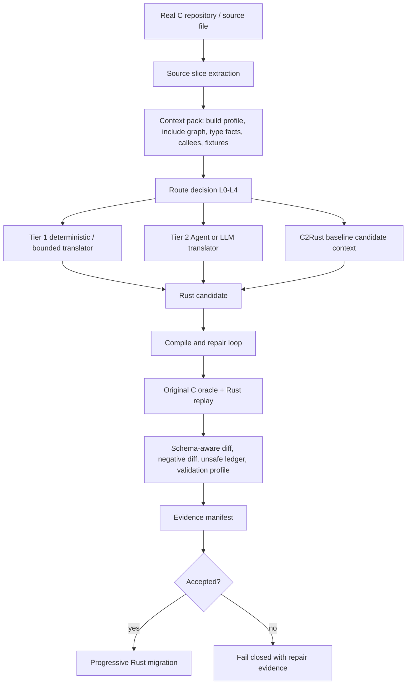

# CONTEXT.md

本文件用于把当前会话的关键上下文固化到仓库中。一个完全看不到聊天记录的新 Codex 会话，读取本文件和代码仓库后，应能准确理解当前项目状态，并直接继续工作。

## 1. 当前仓库与路径

- 当前应继续工作的本地路径：`C:\Users\Administrator\Documents\c-to-rust-flashdb`
- GitHub 仓库：`https://github.com/guoqihan342-svg/c-to-rust`
- 当前分支：`codex/flashdb-rust-skeleton`
- 当前远端分支：`origin/codex/flashdb-rust-skeleton`
- 最近已推送提交：
  - `3d12e65c5599441e9886acb29c8ac40f196d7b22`
  - message: `Add C2Rust baseline route evidence pipeline`
- 注意：`C:\Users\Administrator\Documents\c-to-rust` 是早期或主工作区路径，当前这轮 FlashDB/C2Rust pipeline 工作不要误切回那里继续开发，除非用户明确要求。
- C2Rust 参考源码路径：`F:\agent\c2rust-master`
  - 这是参考项目和潜在工具链来源。
  - 当前工作区没有确认可直接调用的 `c2rust` 可执行文件。

如果默认 Git HTTPS push 遇到 `Recv failure: Connection was reset`，此前可用的推送命令是：

```powershell
git -c http.version=HTTP/1.1 -c http.postBuffer=524288000 push origin codex/flashdb-rust-skeleton
```

## 2. 用户当前项目要求

项目目标是构建一个面向 Codex、OpenCode 或其他 Agent 调用的 C 到 Rust 渐进式迁移 Agent / pipeline。它不是只服务一个人工 demo，而是要逐步走向真实 C 项目的受限自动翻译与强验证。

当前明确要求：

- 使用 OpenSpec 管理需求、设计、任务和验收。
- 复杂任务可以开多个智能体或并行子任务，但共享文件写入必须受控，不能互相覆盖。
- 项目不再要求“小而精”，可以适当扩大规模以补齐真实翻译能力。
- 不再把 10000 轮回归作为每次开发的阻塞条件。
- 日常当前先跑 10 轮、默认 10000 轮等固定轮数要求已经去掉。
- 回归轮数应作为 validation profile 或运行策略输入，而不是硬编码全局门禁。
- Rust first-party non-test `unsafe` 比例必须小于 10%。
- “最好为 0% unsafe”已从硬性要求中去掉，不能把 0% 当作验收条件。
- 实际只有一个 Agent/LLM 接口，不再区分廉价模型和强模型。
- C2Rust、LLM、手写规则都只能提供 candidate，不是 correctness source。
- 正确性以原始 C 行为和证据链为准。
- 真正的翻译证据必须来自真实 C 源文件自动抽取的 slice/context，不应把手写 `c_source` demo 当作真实迁移成果。
- 需要跨文件深度关联性上下文管理，在不破坏项目模块调用关系的前提下，实现单点渐进式重构。
- 编译/编译自愈需要双向闭环：根据 error stack 精确定位、自动打补丁、重新验证。
- 语义等价性要求非常高：业务逻辑不能被破坏，测试和 oracle 证据必须覆盖主干路径。
- 重构后的 FlashDB Rust 目录名目标仍可使用 `flashDB_rust`，但当前本分支重点已经从手写 FlashDB 重写转向“受限自动翻译器 + 强验证项目”。

一个重要边界：不要再恢复旧的 `flashdb-10000` 自动心跳或默认长跑监控。用户已经明确表示自动化消息让人困扰，并取消了 10000 轮作为日常阻塞条件。

## 3. 当前核心方案

当前采用的是治理优先的混合式 C 到 Rust 迁移 pipeline：



设计原则：

- C2Rust baseline 用于候选上下文、对照和 cross-check，不作为正确性证明。
- LLM/Agent 翻译可以作为兜底，但所有候选必须走统一验证门禁。
- Tree-sitter 或手写语法扫描只能提供 syntax indexing，不能直接证明类型、别名和 UB 语义。
- 真实 typed semantic facts 需要 compile profile、clang/libclang、原始 C oracle 或显式 unsupported/block 记录。
- C-side UB 和 Rust-side UB 证据要分开。MIRI 不是 C UB 证明。
- OpenSpec 管能力和批次，slice evidence manifest 管每个函数迁移证据。
- 不支持的情况必须 fail closed，不能假装翻译成功。

## 4. 已完成的主要实现

最近完成并推送的 OpenSpec change：

- `openspec/changes/add-c2rust-baseline-migration-pipeline/`

该 change 的任务已全部勾选完成，核心目标是把 C2Rust baseline、route decision 和 validation profile 纳入 L3 自动翻译证据链。

关键新增或修改：

- `validation/tools/auto_migrate.py`
  - 生成 C2Rust baseline manifest。
  - 生成 route decision。
  - 生成 validation profile。
  - 将这三类证据绑定到 auto manifest、L3 evidence manifest、final verification、cache metadata 和 generated artifacts。
  - cache identity 包含 `c2rust_baseline_identity`、`route_decision_identity`、`validation_profile_identity`。
  - route 为 L4 时 fail closed，写出 blocked repair evidence。
  - semantic pass 改为基于 `accepted`、Rust compile/check 和 validation profile 共同判定，不能绕过 profile。

- `validation/tools/validate_auto_translation_evidence.py`
  - 校验 C2Rust baseline manifest schema。
  - 校验 route decision schema。
  - 校验 validation profile schema。
  - 校验 auto manifest、L3 manifest、final verification、cache metadata 之间的引用一致性。
  - 校验 sha256、status consistency、route/profile consistency、cache identity fields。
  - semantic pass 要求 profile passed、没有 skipped gates、route 不是 L4，并且 C2Rust 仍保持 `candidate_context_only`。

- `validation/tools/extract_source_slice.py`
  - 用于从真实 C 源文件自动抽取函数 slice。
  - 真实源函数迁移必须先走这个工具或等价自动抽取路径。

- `validation/tools/test_extract_source_slice.py`
  - 覆盖真实源 slice 抽取行为。

- 新增 schema：
  - `validation/auto-translation-template/c2rust-baseline-manifest.schema.json`
  - `validation/auto-translation-template/route-decision.schema.json`
  - `validation/auto-translation-template/validation-profile.schema.json`

- 修改 schema：
  - `validation/l3-template/evidence-manifest.schema.json`
    - 已要求 L3 evidence manifest 包含 `c2rust_baseline`、`route_decision`、`validation_profile`。

- 文档更新：
  - `validation/README.md`
  - `validation/gates.md`

- OpenSpec active spec 更新：
  - `openspec/specs/flashdb-l3-agent-migration-loop/spec.md`
  - 已将 `unsafe` 要求改为 first-party non-test `<10%`，不再写 0% 硬性要求。

## 5. 当前真实证据状态

真实 FlashDB slice spec：

- `validation/slice-specs/flashdb-real-fdb-calc-crc32.json`

对应证据目录：

- `validation/evidence/flashdb/auto-translation/real-fdb-calc-crc32/`

此前运行命令：

```powershell
python validation/tools/auto_migrate.py --slice-spec validation/slice-specs/flashdb-real-fdb-calc-crc32.json --skip-c-oracle
python validation/tools/validate_auto_translation_evidence.py --target-id flashdb --slice-id real-fdb-calc-crc32 --slice-spec validation/slice-specs/flashdb-real-fdb-calc-crc32.json
```

当前结果必须如实理解：

- schema validation 通过。
- semantic pass 不成立。
- route decision 是 `L4`。
- route status 是 `refused`。
- `translator.kind` 是 `refuse`。
- `candidate_generation_allowed` 是 `false`。
- validation profile 是 `L4-dev`，status 是 `blocked`。
- C2Rust baseline manifest status 是 `skipped`，原因是本机当前没有可用的 `c2rust` 可执行工具链。
- C2Rust baseline 的 `correctness_role` 是 `candidate_context_only`。
- auto manifest status 是 `candidate_generated`，但 `semantic_pass=false`，并且没有 accepted evidence binding。

严禁误判：

- 不要声称 `real-fdb-calc-crc32` 已经完成语义接受。
- 不要声称当前工具已经能自动翻译真实 FlashDB 函数并通过 L3。
- 当前完成的是“证据合约、路线决策、C2Rust baseline 接入点、fail-closed 机制和验证器硬化”，不是完整真实函数迁移成功。

## 6. 最近验证结果

最近一次代码提交前完成的验证：

```powershell
python -m unittest validation.tools.test_extract_source_slice validation.tools.test_auto_migrate validation.tools.test_validate_auto_translation_evidence
```

结果：

```text
Ran 32 tests in 37.812s
OK
```

OpenSpec 验证：

```powershell
openspec validate --all --strict
```

结果：

```text
37 passed, 0 failed
```

空白和补丁检查：

```powershell
git diff --check
```

结果：通过。Windows 下曾出现 CRLF warning，但不是失败。

当前分支已推送到远端，推送后远端验证为：

```text
3d12e65c5599441e9886acb29c8ac40f196d7b22 refs/heads/codex/flashdb-rust-skeleton
```

## 7. 新会话接手后的第一组命令

建议新会话先运行：

```powershell
cd C:\Users\Administrator\Documents\c-to-rust-flashdb
git status --short --branch --untracked-files=all
git log -3 --oneline --decorate
openspec validate --all --strict
python -m unittest validation.tools.test_extract_source_slice validation.tools.test_auto_migrate validation.tools.test_validate_auto_translation_evidence
python validation/tools/validate_auto_translation_evidence.py --target-id flashdb --slice-id real-fdb-calc-crc32 --slice-spec validation/slice-specs/flashdb-real-fdb-calc-crc32.json
```

如果只是文档改动，不需要重跑完整迁移。若要继续开发 translator、validator 或 evidence schema，至少跑上面的 unittest 和 OpenSpec validate。

## 8. 代码地图

核心 pipeline：

- `validation/tools/auto_migrate.py`
  - 自动迁移主入口。
  - 负责生成 candidate、manifest、route、profile、cache metadata 和最终证据。

- `validation/tools/validate_auto_translation_evidence.py`
  - 自动迁移证据校验器。
  - 是防止证据链退化的关键门禁。

- `validation/tools/extract_source_slice.py`
  - 从真实 C 源文件抽取函数 slice。
  - 后续真实函数迁移应优先扩展这里，而不是继续手写 `c_source` demo。

关键 schema：

- `validation/auto-translation-template/auto-translation-manifest.schema.json`
- `validation/auto-translation-template/c2rust-baseline-manifest.schema.json`
- `validation/auto-translation-template/route-decision.schema.json`
- `validation/auto-translation-template/validation-profile.schema.json`
- `validation/l3-template/evidence-manifest.schema.json`

关键 docs：

- `validation/README.md`
- `validation/gates.md`
- `openspec/specs/flashdb-l3-agent-migration-loop/spec.md`
- `openspec/changes/add-c2rust-baseline-migration-pipeline/design.md`
- `openspec/changes/add-c2rust-baseline-migration-pipeline/tasks.md`

## 9. 下一步建议

建议优先级如下：

1. 不要继续堆 demo 规则。先把真实源函数自动抽取、typed context 和 oracle harness 做实。
2. 安装或接入可用 C2Rust 工具链，让 baseline manifest 从 `skipped` 进入真实 `generated` 或明确 `blocked`。
3. 选一个比 `fdb_calc_crc32` 更小、更清晰的真实 FlashDB 函数，目标是跑出第一个真实 accepted L3 semantic pass。
4. 将当前 route 逻辑提前到 candidate generation 之前，避免“先生成再 backfill route”的时序不够干净。
5. 接入 clang/libclang 或等价 typed semantic fact provider，补足 tree-sitter/字符串扫描无法提供的类型、别名、宏和 include 事实。
6. 自动生成 C oracle harness 初稿和 Rust replay test 初稿。
7. 对 compile error stack 做结构化 repair hints，并将修复循环限制为 fail-closed。
8. 增加 fuzz/property profile，但不要恢复 10000 轮硬阻塞。
9. 如用户要求提交或发 PR，再基于当前分支创建 PR；当前不要擅自改变目标仓库或路径。

## 10. 与外部评价和论文对齐后的结论

用户接受过的关键判断：

- 之前的手写翻译规则和少量 demo 不能代表真实自动翻译能力。
- `flashDB_rust` 更接近手写 safe Rust 重写 + 差分验证成果，不能当作翻译器自动产出的证据。
- Corrode 的优点是能作为通用 C99 到 Rust 翻译器处理广度，即使输出不够 idiomatic 或 unsafe 偏多；当前项目需要吸收的是自动读取 C 文件、解析函数、生成候选和证据的 pipeline 能力。
- Rustine/SACTOR/Syzygy 等方案说明，“LLM/Agent 候选 + 强验证 + 修复闭环”比只靠手写规则更现实。
- 本项目差异化不应吹成“验证世界第一”或“翻译已规模化”，而应定位为：
  - Agent 编排友好。
  - OpenSpec 治理。
  - 机器可读证据交接。
  - fail-closed。
  - 原始 C oracle 驱动的可审计渐进迁移。

## 11. 工作习惯与沟通注意

- 用户偏好中文状态、中文文档和清晰的路径说明。
- 用户反复强调“开多几个智能体干活”，但并行应只用于互不冲突的分析、测试、调研或独立文件任务。
- 用户不喜欢无意义等待和频繁自动消息。长跑监控不应主动恢复。
- 如果问“好了没有”，必须回答已验证状态、剩余缺口和下一步，不要把 partial pass 说成 done。
- 如果要提交或推送，必须先验证，并且只有实际完成 git action 后才能在最终答复里发 git directive。
- 如果工作涉及 OpenSpec artifact，保留 parser-required anchors，例如 `Purpose`、`Requirements`、`Scenario`、`WHEN`、`THEN`、`## ADDED Requirements` 和任务 checkbox 语法。

