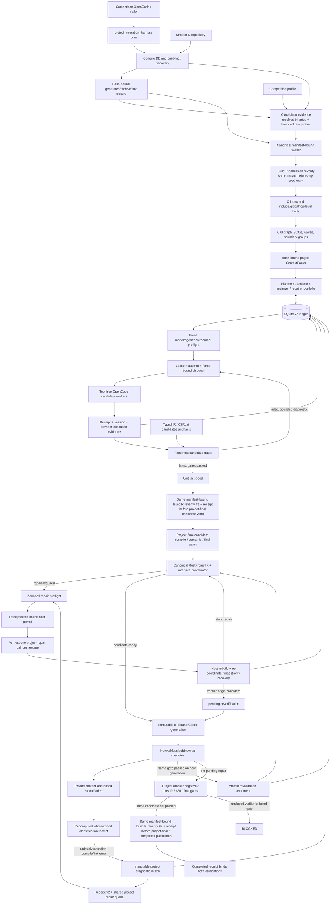
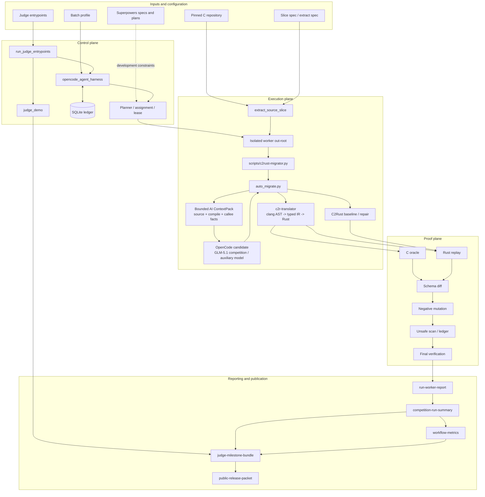
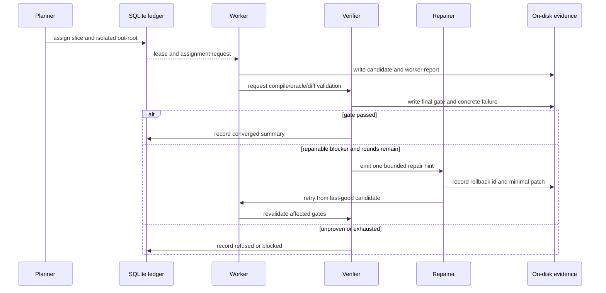

# Verifiable C-to-Rust Migration Harness

This repository is a progressive C-to-Rust translation and verification system for real C projects. clang/typed IR, C2Rust, and OpenCode/LLM output are candidate sources only. A shared C oracle, Rust replay, schema diff, negative mutation, unsafe ledger, and final-verification chain decides whether a candidate is accepted.

```text
real C source -> bounded Rust candidate -> executable equivalence evidence -> accepted / refused / blocked
```

## Current Status

| Item | Status |
| --- | --- |
| Translator-generated semantic pass | `38` named slices, derived from `validation/translator-coverage-matrix.json` |
| Accepted-evidence authoritative | `1`, reported separately from the translator numerator |
| Latest development stage | P0-A19: unfamiliar-repository build closure, verification authority, and real held-out contract closure |
| Active translator task | P0-A19 project orchestration first; P0-A18c/P0-A10 remain finite regression and held-out acceptance tracks |
| Current environment proof | `wsl-local-simulation`, not `competition-exact` |
| P0-A19 finite gate | 518/518 on Windows with five platform-conditional skips; 518/518 on WSL with three platform-conditional skips |
| FlashDB competition source pin | branch `competition`, commit `f9d0421315c564fb890a1b14eee77b290e0d7bbe` |
| Development workflow | Superpowers specs/plans, canonical roadmap, and harness evidence gates |

These counts cover declared named-slice boundaries only. They do not prove complete C support, complete `fdb_kv_iterate`, whole-project FlashDB migration, or production safety.

The canonical backlog is [future-vision-and-mvp.md](docs/c2rust-migration-agent/future-vision-and-mvp.md). Designs and implementation plans live under `docs/superpowers/specs/` and `docs/superpowers/plans/`.

## What the Harness Does

1. Pins repository, branch, commit, function, compile database, and fixture input.
2. Plans isolated worker assignments with one out-root per worker.
3. Uses OpenCode/GLM-5.1 as the primary generator for new translations, with generic typed IR and C2Rust/C2Rust+repair as auditable alternatives.
4. Executes the shared C oracle, Rust replay, diff, negative-diff, unsafe, and profile gates.
5. Applies one bounded repair per round and rolls back to the last-good candidate on failure.
6. Stores scheduling state in SQLite and semantic facts in on-disk validated artifacts.
7. Produces workflow metrics, before/after exhibits, judge bundles, release notes, and public packets.

OpenCode retries are also guarded by a no-progress gate: after two identical deterministic failures with identical effective inputs, a third launch is refused before the runner and recorded as a hash-bound event. Transient environment, credential, lock, and contract failures remain retryable. This saves calls without changing semantic acceptance gates.

OpenCode worker and preflight prompts retain one executable `Command line:`. The duplicate JSON argv text was removed while structured argv, command hashes, sessions, and handoff evidence remain intact. Representative prompt size dropped by 13.2%-16.1% without changing semantic gates.

Batch profiles also support a deterministic-first `mode=auto` admission gate. It selects deterministic execution before OpenCode preflight only when every worker binds accepted evidence, an existing evidence root, a source hash, and a slice spec with no repair policy. All other inputs fail closed. `competition-exact`, hostless rehearsal, and explicit OpenCode attestation cannot auto-downgrade.

SQLite and agent conversation are not semantic evidence. Only on-disk artifacts and validators establish acceptance.

## AI-first Translation Contract

AI is the competition translation primary, not a fallback invoked only after deterministic translation fails. Every new slice first receives a hash-bound ContextPack, then OpenCode `zai/glm-5.1` + `c2rust-candidate` + `max` emits one primary Rust candidate. Typed IR and C2Rust remain zero-token alternatives, failure controls, and repair bases. They cannot silently claim that AI ran or bypass the common gates.

ContextPack v4 gives the model only bounded facts: the real source span, compile arguments and response files, type/CFG/pointer excerpts, failure summaries, ABI and pointer policy, direct-callee contracts, and the complete Rust replay source contract generated before provider launch. Replay source, SHA, size, and real call count share one input binding. Missing, sensitive, oversized, call-free, or drifted replay evidence fails closed. Required callee context that is truncated or over budget is still refused with zero provider calls.

Candidate and repair prompts place the same generated replay source contract before a ContextPack projection, followed by the declared signature and Rust public-API, raw-pointer, and unsafe policies. The complete replay source and ReplayCallPlan payload each appear once. The bounded declarative DSL binds the C source function, Rust `api_name`, parameter order/types, C mappings, retained lengths, return/field types, fixture codecs, ABI, unsafe policy, and plan SHA; the renderer, provider readiness, and fresh binding consume the same object. All inventoried scalar, mutable-out, record-state, scripted-external, record-pointer, buffer/length identity, and opaque-context adapters now consume ReplayCallPlan. Dedicated fallback dispatch and readiness OR lists are removed; function and project names remain contract data rather than routing keys.

AI candidate manifest v9 derives `prompt_scope` from the actual ContextPack and records `generated_replay_api_contract`. ReplayCallPlan also derives a recomputable `required_candidate_api` containing the exact function signature, required supporting structs, ABI, unsafe marker, and reference-return lifetime. Provider readiness and the fresh validator independently recompute it and fail closed on drift. The required API also carries a closed self-contained source contract: nonempty `supporting_types_source` must appear exactly once, the harness does not inject missing types, and the model must not replace the compiler-owned fixture model with invented extern, FFI, or opaque types. Every real invocation binds its response, minimal invocation receipt, and session-export identity. One same-prompt retry is allowed only for valid tool-free JSONL that has no assistant text, ends at `step_finish`, and reports zero output and reasoning tokens. Balance, authentication, timeout, nonzero exit, tool events, and ordinary malformed responses are not retried. The competition lane accepts only `zai/glm-5.1`; when GLM balance is unavailable, `opencode/deepseek-v4-flash-free` is used only for `auxiliary-local-validation` and never enters competition or translator numerators. AI output remains `semantic_gate=false`; only common gates can accept it.

Slice candidate generation uses the tool-free `c2rust-candidate`; the existing `opencode_agent_harness` command-execution lane retains `c2rust-migrator`. P0-A19 project preflight and workers use a separate fixed contract with `c2rust-candidate` + `max` for both. Any nested OpenCode `tool` or `tool_use` event fails closed. Competition probing uses logical model `GLM-5.1`, while candidate CLI calls use resolved id `zai/glm-5.1`. The parser accepts strict JSON or explanatory text containing exactly one complete JSON fence; multiple or incomplete fences, extra tool access, and unbounded fields remain rejected. OpenCode 1.17.18 uses the `opencode-file-attachment-v2` order: fixed short message first and `--file=<prompt>` second, preventing `--file` from consuming the message as another file.

## Whole-Project AI Orchestration

The outer OpenCode process on the competition platform does not need one hand-written spec per function. It calls `project_migration_harness.py plan` with a repository root. The harness discovers compile databases, CMake/Ninja/Meson build facts, compile outputs, static archives, link edges, and translation units, then materializes SCC/DAG structure, paged ContextPacks, role portfolios, and SQLite state. The `plan` CLI defaults to `--profile competition` and `--build-closure-policy required`; `--profile development` is only an explicitly selected non-competition compatibility path. Incomplete closure defers every ready worker. `bounded-source` may produce only investigative `semantic_gate=false` candidates and cannot complete a project.

After discovery and before any worker or AI launch, the competition profile constructs `c-toolchain-evidence` from the discovered compiler drivers/wrappers, linker drivers/linkers, archivers, and ranlib tools. It binds the path/SHA/size/profile id of `config/competition-env/environment.json`, the environment allowlist and PATH-snapshot hashes, host/WSL fingerprints, absolute resolved paths, and binary SHA/size, then runs only fixed bounded version, target, sysroot, resource-dir, and derived-linker probes. Each probe's raw stdout/stderr is stored as bounded base64, SHA-256, and size inside a content-addressed attachment bound by BuildIR. A missing tool, failed or drifted probe, platform mismatch, or competition GCC-version mismatch fails closed before scheduling.

Competition canonical BuildIR uses each TU, ABI fact, and object/link/archive target's `toolchain_id` as a foreign key into host-probed toolchain records; missing or unknown foreign keys and token-only evidence cannot pass. On every reopen, the verifier reads the original `c-toolchain-evidence` attachment through BuildIR raw-fact references, rechecks base64/hash/size, reparses the profile, repository bindings, and absolute executables, reruns the fixed probes, rederives linker/role mappings, and reprojects BuildIR byte for byte. Any PATH, environment, binary, probe, or projection drift blocks.

BuildIR adapter convergence is locked by a same-source Git-tracked fixture: CMake, Ninja, and Meson produce one canonical projection for two TUs, a static archive, a ranlib pass, a final multi-input link, and an external dependency. Meson-private target/source/compiler summaries remain provenance only and cannot enter the downstream DAG or ContextPack. The orchestrator reopens the same BuildIR reference again before CIndex or DAG work; failure during initial validation or admission creates no migration graph, portfolio, ledger, or model call. This evidence remains `semantic_gate=false` and does not claim build or program-semantic success.

AI is primary at runtime. Boundary groups first use a planner to select translation with context, preservation of a verifiable FFI boundary, or an explicit refusal. Translators emit Rust source, reviewers provide structural findings only, and repairers consume only allowlisted failure diagnostics. Typed IR and C2Rust are fact or candidate sources rather than a default routing priority. No model may write semantic pass, last-good, or project-complete state.

Project preflight fixes the exact model, `c2rust-candidate`, `max`, and an immutable agent snapshot. Each attempt inherits an explicit environment allowlist and isolated config/data/state/cache/tmp/out roots. Invocation receipts, the session-export projection, prompt/response SHAs, and provider-execution reports share the same ledger attempt/fence. Fixed host authorities own acceptance. Candidate gates, project gates, evidence hashes, latest epochs, and immutable candidate sets are stored in SQLite and content-addressed evidence is reopened before promotion or completion. Cargo output uses immutable generations behind an atomic `CURRENT` pointer. Candidate `cargo check/test` runs only in a networkless Linux bubblewrap sandbox. Under rustup, `rustup which` resolves the actual `cargo/rustc/rustdoc`; the bounded toolchain tree is fully content-hashed, rehashed before execution, and mounted read-only. Missing sandbox, oracle, or ABI evidence blocks instead of executing on the host.

Cargo generation is forced through canonical RustProjectIR. Wave-provisional generations contain the current candidates plus last-good dependencies and bind back to the immutable complete DAG; project-final generations must cover every migration unit. The host recomputes public, required, unsafe, and FFI facts from current Rust source, reopens BuildIR, DAG, and every candidate, and runs one interface coordinator over module topology and cross-unit API/type/global/FFI/feature/cfg/init conflicts. Only a `candidate-ready` receipt can generate Cargo. Production code has removed descriptor-only generation entrypoints and the direct `integrate` CLI; only ledger-bound `integrate-verified` can publish a full-project generation.

`CompletionCoordinator` obtains the sole BuildIR reference from the immutable migration manifest. Competition `complete` must provide the original C repository through `--repo-root` as a reopen locator. It runs the same BuildIR verifier before any project-final candidate compile/semantic/final work, then runs it again after integration, Cargo, and downstream gates but before host project-final state and the completed receipt are published. Both content-addressed verification receipts are bound into the completion receipt, and either drift result stops later work.

A19d3 is still open. RustProjectIR and generation manifests remain `interface_completeness.status=partial`, automatically derived signatures remain unresolved, and the authoritative generator currently supports flat library modules only. The schema v7 TransitionAuthority ledger and the dedicated AI repairer now persist and execute the project repair queue. Completion first observes the latest receipt without creating an attempt. After isolated zero-call preflight, a host-issued permit binds the exact receipt, queue, item state, model, agent, and runtime input, and one resume can launch at most one provider call. Complete provider results are hash-bound before ingest; after an ingest crash, the next resume reopens all evidence and performs ingest only. Incomplete or unknown results require manual reconciliation. Diagnostic-lineage budgets survive receipt epochs, with hard per-run caps of 64 provider calls and 65 receipt epochs.

Schema v7 also adds an immutable project-diagnostic intake. The host reopens the current candidate set, managed generation, and canonical RustProjectIR, then admits only structured rustc `error` diagnostics from a proven sandboxed Cargo execution. Cargo check/test freezes the complete candidate cohort and validates gate order, execution status, unique candidate identity/content ownership, and classification of every error before recording any repair. Bounded stdout/stderr for each gate is first stored as a private content-addressed artifact, and observation v3 binds a classification receipt that is recomputable from those raw references. The receipt cross-binds the run, cohort, project input, RustProjectIR/interface, unit partition, and admitted diagnostics. Unit ownership comes from the cross-binding between RustProjectIR module paths and the candidate set. The shared linker parser accepts only bounded GNU/lld/MSVC unresolved-symbol forms, and a symbol must map uniquely to one module in the current RustProjectIR. Unknown, ambiguous, or mixed errors, duplicate owners, stale unit paths, toolchain-sensitive rustc failures, environment failures, and diagnostic overflow block the complete repair batch. Only after whole-batch admission do uniquely owned errors become unit repairs. An `E####` compile error with a repository-relative project location or a unique project link symbol binds the cohort, IR/interface, generation input, raw observation, and verifier receipt. Warnings, generic Cargo failures, and environment or sandbox blockers produce zero intake and zero AI calls; private raw text never enters model context.

Validated intakes now enter a coordinator receipt v2 that remains compatible with the schema v7 database and shares the project-repair queue with static interface diagnostics; verifier-origin items dispatch first. Request materialization and provider launch reopen the content-addressed intake, current candidate set, original managed generation, RustProjectIR/interface, and verifier receipt. AI submits only bounded IR operations. After host reconstruction, the public state can be only `pending-reverification`; internal `candidate-ready` means that the ledger is awaiting host revalidation, and neither an ordinary static receipt nor a low-level resolve API can close the external diagnostic. CompletionCoordinator also rejects every historical project-repair obligation not in `resolved/cancelled`.

Closure requires a higher-epoch pass from the same host gate on a new managed generation and a content-addressed revalidation receipt. One settlement transaction reopens the source intake, current cohort, old and new project inputs, ledger gate record, raw observation/evidence, classification receipt, candidate IR/interface, and current generation before it registers the successor receipt, resolves the target, and cancels queue siblings superseded by that successor. A failed recheck rolls back the old candidate, records the new diagnostics, and inherits the attempt budget. This loop now accepts strictly classified Cargo compile/link diagnostics. Dedicated initialization, feature/cfg, and ABI verifiers, the A19e7 process capability boundary, the A19e8 non-degrading SandboxBackend, and complete project-final semantic acceptance remain open; AI candidates add nothing to the translator numerator.

The positive completion path remains open. Host-owned integration/Cargo adapters and failure routing exist, but positive candidate compile/oracle/negative/unsafe-alias/ABI/final runners are not all connected. In-process raw-output references, a recomputable classification receipt, and competition-profile C-toolchain input closure now exist. The A19e7 independent verifier process/capability channel/one-time nonce and A19e8 complete sandbox capability/receipt/backend equivalence do not. The current host-issued receipt therefore proves canonical binding and drift rejection, not that the caller is unforgeable, and it is not `competition-exact`. Real held-out mode reopens SQLite read-only and revalidates AI provider evidence, every candidate gate, the immutable candidate set, the project final bundle, and original repository/build bindings. A self-reported JSON `semantic_gate=true` cannot contribute success.

These commands establish planning, model preflight, and conditional dispatch only; they are not a completed translation claim:

```bash
python3 -B validation/tools/project_migration_harness.py plan \
  --repo-root /path/to/c-project \
  --profile competition \
  --compile-database /path/to/c-project/build/compile_commands.json \
  --out-root target/project-migration/run-001 \
  --run-id run-001 \
  --build-closure-policy required
python3 -B validation/tools/project_migration_harness.py preflight \
  --out-root target/project-migration/run-001 \
  --run-id run-001 \
  --logical-model GLM-5.1 \
  --resolved-model zai/glm-5.1
python3 -B validation/tools/project_migration_harness.py dispatch \
  --plan target/project-migration/run-001/project-migration-plan.json
python3 -B validation/tools/project_migration_harness.py complete \
  --db target/project-migration/run-001/state/project-migration.sqlite3 \
  --run-id run-001 \
  --repo-root /path/to/c-project \
  --logical-model GLM-5.1 \
  --resolved-model zai/glm-5.1
```

`complete` is resumable and launches at most one project-repair provider call per invocation. It publishes a completion receipt only after the latest queue is resolved and the downstream whole-project gates pass.

The real WSL auxiliary smoke `a19-deepseek-smoke-20260713` used `opencode/deepseek-v4-flash-free` + `c2rust-candidate` + `max`. Its preflight-report SHA is `f0bc76b6b2489597e782cd1f0e532b7483f03658680b4352401ee12c814913c0`, provider-execution SHA is `9e04b437135aa9f1e2171a180f2e77272374fc8bba3c1257d314e8a963c10b5d`, and candidate SHA is `359cb2ef234f85d9aa1cbdf2d77e07a296f55cb8bd7d4ad9dd37afe4d9ea72ef`. This is only `candidate-ready` / `auxiliary-local-validation` / `semantic_gate=false`; WSL has no `bwrap`, so candidate code was not executed.

LangGraph and LangChain are not runtime dependencies. This layer needs an auditable fixed state machine, transactions, foreign keys, leases, fencing, and evidence replay; repository-owned Python plus SQLite currently provides those properties directly. A framework should be introduced only if it reduces code without weakening these contracts.



## Whole-Project Data Flow

```mermaid
flowchart LR
    A["1. Repo root"] --> B["2. Discovery + generated/archive/link closure"]
    P["Competition profile"] --> C["3. C toolchain evidence + raw probe attachment"]
    B --> C
    B --> D["4. Canonical manifest-bound BuildIR"]
    C --> D
    D --> BIRADMIT["4b. BuildIR admission reverify"]
    BIRADMIT --> E["5. Include, symbol, SCC migration DAG"]
    E --> F["6. Paged ContextPack"]
    F --> G["7. Preflight-bound worker request"]
    G --> H["8. AI candidate + provider evidence"]
    H --> I["9. Host candidate gates"]
    I -->|"repairable"| G
    I -->|"passed"| J["10. Unit last-good"]
    J --> V1["11. Same manifest-bound BuildIR reverify #1 before project-final candidate work"]
    V1 --> Q["12. Project-final candidate compile / semantic / final gates"]
    Q --> K["13. RustProjectIR + interface receipt"]
    K -->|"repair-required"| R["14. Preflight + state-bound permit + one AI repair"]
    R --> S["15. Host rebuild / re-coordinate or ingest-only resume"]
    S -->|"static repair"| K
    S -->|"verifier-origin"| T["16. pending-reverification"]
    K -->|"candidate-ready"| L["17. Cargo generation"]
    T --> L
    L --> M["18. Sandboxed build/test"]
    M --> O["19. Private raw refs + classification receipt"]
    O -->|"uniquely classified compile/link error"| U["20. Bound intake + receipt v2 queue"]
    U --> R
    M -->|"fresh same-gate pass"| W["21. Atomic revalidation settlement"]
    W --> K
    M --> X["22. Project semantic and safety gates"]
    X --> V2["23. Same manifest-bound BuildIR reverify #2 before publication"]
    V2 --> N["24. Completed receipt binds both verifications"]
```



Every edge carries schema-bound artifacts with repository-relative paths and SHA-256, not chat conclusions. This stage adds same-source CMake/Ninja/Meson BuildIR convergence, multi-TU/static-archive/ranlib/multi-input-link facts, competition-profile C-toolchain input closure, a pre-DAG BuildIR admission reopen, two CompletionCoordinator checkpoints, CLI constraints, and read-only held-out evidence. Remaining work includes constrained Meson/configure generation, positive candidate verifiers, the A19e7 independent process capability, the A19e8 non-degrading sandbox, a usable competition-equivalent environment, and real held-out build/oracle semantic acceptance. This profile-bound input evidence keeps `competition_exact=false`; the diagram is an implementation contract, not a whole-project success claim.

## Slice Verification and Publication Architecture



## Slice Artifact Data Flow



```mermaid
flowchart LR
    A["1. Source pin\nrepo + branch + commit"]
    B["2. Source extraction\nfunction + dependencies"]
    C["3. Slice spec\nboundary + fixture + build profile"]
    D["4. Context pack\nsource + compile + callee facts + hashes"]
    E["5. Worker assignment\nworker id + isolated out-root"]
    F["6. AI-primary inventory\nOpenCode + typed IR + C2Rust"]
    G["7. Fresh exact proof\ncandidate SHA + current-run oracle"]
    H["8. Executed gates\nrustc + Rust replay + schema diff"]
    I["9. Safety gates\nnegative + unsafe + alias + ABI"]
    J{"10. Gate-only router"}
    K["accepted\ndeclared slice only"]
    L["refused\nunsupported construct"]
    M["blocked\nmissing environment/evidence"]
    N["11. Worker summary\nartifact refs + hashes"]
    O["12. Merge and metrics\ncompetition summary + workflow metrics"]
    P["13. Judge publication\nbundle + notes + public packet"]

    A --> B --> C --> D --> E --> F --> G --> H --> I --> J
    J -->|"AI passes"| K
    J -->|"AI fails; exact deterministic passes"| K
    J -->|"repairable; all zero-token candidates failed"| F
    J -->|"known unsupported"| L
    J -->|"missing proof/tool"| M
    K --> N
    L --> N
    M --> N
    N --> O --> P
```

Every stage emits repo-relative paths and hashes. Downstream validators reopen artifacts instead of trusting upstream prose.

## Repair / Retry Flow



The default repair cap is five rounds. Process exit status, model text, and repair history prove execution only; a candidate is accepted only after shared gates pass again.

## Main Components

| Component | Responsibility | Main output |
| --- | --- | --- |
| `extract_source_slice.py` | Extract function, dependencies, and source identity from a real checkout | slice spec |
| `crates/c2r-translator/` | clang AST, typed IR, generic Rust emitter, fail-closed reasons | candidate and lowering report |
| `auto_migrate.py` | Orchestrate generation, oracle/replay drafts, route/profile, and evidence | auto-translation evidence |
| `validate_auto_translation_evidence.py` | Cross-check schema, hashes, identity, and semantic gates | strict validation result |
| `project_migration_harness.py` / `_project_migration_harness/build_ir_*.py` / `c_toolchain_*.py` | Arbitrary-repository inventory, competition-profile C-toolchain evidence, canonical BuildIR, SCC/DAG, ContextPacks, role scheduling, gates, and Cargo generations | `c-toolchain-evidence`, canonical BuildIR, project plan, SQLite v7, worker requests, last-good project |
| `rust_project_ir*.py` / `project_interface_*.py` | Reopen BuildIR/DAG/candidates, coordinate cross-unit interfaces, and deterministically generate IR-bound Cargo generations | canonical RustProjectIR, coordinator receipt, project repair queue, generation manifest |
| `opencode_agent_harness.py` | Run/plan/worker/retry/evaluate, SQLite state, isolation, recovery | worker reports, indexes, merge plan |
| `run_competition.py` | Aggregate slices/workers and run environment, unsafe, and summary gates | competition summary and workflow metrics |
| `judge_demo.py` | Build the before/after safety exhibit | exhibit and judge evidence index |
| `run_judge_entrypoints.py` | Run smoke, before/after, multi-worker, and OpenCode entrypoints | run report, bundle, public packet |

## Candidate and Acceptance Boundary

| Source | Purpose | Semantic pass by itself? |
| --- | --- | --- |
| Generic typed IR | Generic AST/type/alias-driven candidate | No |
| Raw C2Rust | Broad unsafe baseline | No |
| C2Rust + repair | Safety before/after candidate | No |
| OpenCode / LLM | Candidate generation and bounded repair | No |
| C oracle + Rust replay + diff gates | Executable equivalence within the declared boundary | Yes |

The AI exact path cannot be combined with accepted-evidence reuse. Candidate and repair prompts are SHA-bound files passed with the `opencode-file-attachment-v2` ordering: the fixed short message precedes `--file=<prompt-path>`, so the full ContextPack and failure facts do not enter process argv. A passing auxiliary-model run remains local evaluation evidence rather than competition evidence.

When GLM balance is unavailable, `run_ai_auxiliary_cross_project_suite` provides a separate lane that defaults to `opencode/deepseek-v4-flash-free`. It rejects competition-eligible models, nonempty out-roots, unsafe or duplicate project/slice identities, and slice-spec SHA drift before or during execution. Concurrent units receive isolated OpenCode config/data/cache/state/tmp directories, separating SQLite, sessions, and logs. Its report hard-codes both competition and translation numerators to zero and cannot close P0-A6/A10/H9.

The latest WSL auxiliary run, `ai-auxiliary-p0-a18c1-deepseek-wsl-20260712-204206`, used the fixed 12 items and `opencode/deepseek-v4-flash-free`: 12/12 preflight ready, 12 initial plus 4 response-proven repair calls, 16 provider invocations total. It produced 11 candidates, 2 exact passes, 9 exact failures, no contract failure, 1 execution failure, and no provider block. The exact passes remain `real-fdb-calc-crc32` and `real-fdb-is-str`, so exact success did not improve. Relative to the previous run, candidates increased 8 to 11, contract failures fell 2 to 0, provider blocks fell 1 to 0, total calls fell 18 to 16, and first-round rustc API mismatches under a valid target contract fell 3 to 1. `tsl_to_blob` and `kv_set` now compile, while `kv_to_blob` still does not. The execution failure was a zero-start AI draft violating the safe owner-interior alias contract before that exception was structured; P0-A18c2 now records such rejection as a fail-closed replay failure. Report SHA-256 is `512641d1ece1d6dcf8b5bc20af3208da467a1c5284931d3c2a32bdb5cf8551c1`. This remains `wsl-local-simulation` with both public numerators fixed at zero.

P0-A18c1 fixes that accounting and removes low-information calls. Fixture-only compile stubs exist only during checking, after which the canonical AI draft is restored byte-for-byte. Repair prompts request only a complete self-contained Rust candidate. AI repair is skipped with a recorded reason when the fresh C oracle did not pass, the target contract is absent, or no structured candidate failure exists. The auxiliary timeout defaults to 300 seconds. The implementation passes 161 focused Windows tests; the P0-A18c2 structured safety-refusal path passes 4/4 on both Windows and WSL. The fixed suite still has only two exact passes, so P0-A18c remains open.

The P0-A18c3 zero-repair targeted DeepSeek run for `kv_to_blob` proves the closed source contract works: one initial call emitted every supporting struct and passed both rustc and generated replay. The router SHA-256 is `0c5f8f7130f4b6b8c163f1007af130cc6016f48234a54e6dde4485a8a7b31316`. Its only remaining blocker was `alias_proof_missing`, caused by an unobserved compiler-owned proxy field whose contract required only a null default but still used `*mut c_void`. P0-A18c4 maps only such record-default fields to `Option<NonNull<c_void>> = None`; fields that participate in buffer, length, or pointer-identity semantics keep their original contracts.

P0-A18c5 no longer counts a safe `Option<core::ptr::NonNull<T>>` type declaration itself as a raw-pointer operation. The exemption applies only when the candidate contains no `unsafe` and `NonNull` appears in a generic type position. `NonNull::<T>` construction, other `core/std::ptr` APIs, `as_ptr/as_mut_ptr/from_raw/into_raw`, raw-pointer types, and every `unsafe` + `NonNull` combination still require a current-candidate alias proof. The related 53-test gate passes on both Windows and WSL.

In the post-`ecbb2ef3` WSL DeepSeek zero-repair checks, both `kv_to_blob` and `tsl_to_blob` reached AI exact pass with one provider invocation. Their router SHA-256 values are `4f753f9cd00359d46ed13044f9845b9dff04702c84a4c9ede0aacfc85de31cac` and `93f7b5fe6d2f7f3d903d7042d2a78236b96b86afa491faeea5c971ed00d7a68b`; both candidates have zero unsafe tokens and zero raw-pointer operations. `kv_set` still failed under the same profile: its candidate passed rustc/unsafe/oracle, but replay expected the external-callee fixture result `7` while the candidate implemented `-1`; the failed router SHA-256 is `4a6b7b99095e2c91fde2c40a9eac9ca141a9bb276d4c981dd886115350d6f6a0`. The next generic step is a recomputable executable external-callee behavior contract in ContextPack, not a function-specific exception. The WSL worktree reported `UNKNOWN0` Git metadata in all three runs because its `.git` file contains a Windows path, so these are hash-bound local AI-routing results, not competition-exact or full-project acceptance evidence.

```bash
python3 -B -m validation.tools.run_ai_auxiliary_cross_project_suite \
  --suite validation/ai-finite-cross-project-suite.json \
  --out-root target/ai-auxiliary-$(date +%Y%m%dT%H%M%S) \
  --model opencode/deepseek-v4-flash-free \
  --repair-rounds 1 --max-workers 3
```

The AI candidate cache is disabled by default and is enabled only through the standalone generator's `--cache-root` or `auto_migrate`/competition runner's `--ai-candidate-cache-root`. Its content key binds the ContextPack payload SHA, prompt schema version, actual prompt SHA, resolved model, agent name, repository-local agent-definition SHA, variant, and parse contract version. It publishes only successful responses whose `entry.json`, `response.jsonl`, and `candidate.rs` can be reopened, reparsed, and verified by SHA. Same-key requests use single-flight plus locked first-writer-wins directory publication; a corrupt entry is quarantined and rebuilt by one real call. Provider failures, timeouts, refusals, and malformed responses are never cached. A hit records `provider_invocations=0`, `cache.status=hit`, and metrics `cache_hits=1`; later repair calls remain separate invocations. The summary validator independently reopens the copied cache entry, raw response, and initial candidate. A cache hit reuses candidate input only, still traverses every common gate, and remains `semantic_gate=false`. The competition runner accepts only repository-local cache roots so host paths cannot enter replay commands.

ContextPack v3 performs bounded expansion of compile-command response files. It currently accepts only an explicit `gnu-v1` dialect for clang/gcc/cc families; MSVC `cl` and unknown compilers are structurally refused instead of guessing a tokenizer. Relative `@file` references must resolve inside the source root, with hard limits on recursion depth, expansion count, per-file and total bytes, and argument count. Cycles, links, escapes, encoding errors, NULs, malformed quoting, and budget overflow block before provider invocation. Each file's logical path, SHA, size, and depth is bound in both the selected entry and ContextPack inputs, and the summary validator independently recomputes the binding.

A named slice may increase the semantic numerator only when source/fixture/candidate hashes agree, C and Rust execute, schema diff and a discriminating negative mutation pass, unsafe/route/profile/final-verification artifacts are cross-bound, and the strict validator passes with `--require-semantic-pass`.

## Worker Isolation and State

```text
target/competition-out/
  state/opencode-agent-harness.sqlite3
  harness/
    context-pack.json
    agent-index.json
    plans/*.json
    merge-plan.json
    resume-manifest.json
  workers/<worker-id>/
    request.json
    evidence/
    harness/run-worker-report.json
    summary/competition-run-summary.json
  summary/
    competition-run-summary.json
    workflow-metrics.json
```

Each worker writes only its assigned out-root. Request and ledger paths must match. Stale summaries are removed before execution. OpenCode workers require a passed preflight from the same run. Merge consumes machine-readable worker summaries only and fails closed on missing summaries, hash drift, or failed final gates.

## Competition Proof Classes

The machine-readable environment profile is `config/competition-env/environment.json`.

| Proof class | Source | Closes competition-host acceptance? |
| --- | --- | --- |
| `local-simulation` | Windows/local host | No |
| `wsl-local-simulation` | WSL | No |
| `ci-approximation` | Linux CI | No |
| `competition-exact` | Real host with `COMPETITION_EXACT_HOST=1` | Yes |

Current WSL differs from the target in kernel, Rust/Cargo, Node/npm, Java/Maven, CMake baseline, and strict GLM model probe. See the competition-environment section in the canonical roadmap for the exact comparison.

## Quick Start

```bash
# Development verification
cargo fmt --all --check
cargo test --manifest-path crates/c2r-translator/Cargo.toml --all-features
python3 -B -m unittest validation.tools.test_auto_migrate validation.tools.test_validate_auto_translation_evidence
python3 -B validation/tools/translator_coverage_matrix.py --matrix validation/translator-coverage-matrix.json

# WSL competition-profile simulation
source config/competition-env/env.sh
export CLANG_PATH=/usr/bin/clang
bash config/competition-env/toolchain-check.sh
bash config/competition-env/smoke.sh wsl-local-simulation target/competition-smoke-wsl

# Judge before/after exhibit
python3 -B -m validation.tools.judge_demo \
  --profile config/competition-env/planned-batches/flashdb-fdb-utils-before-after.json \
  --run-id competition-flashdb-before-after-exhibit \
  --out-root target/competition-out-flashdb-before-after-exhibit \
  --review-checklist config/competition-env/review-checklists/flashdb-harness-internal-review.json

# All judge entrypoints
python3 -B -m validation.tools.run_judge_entrypoints \
  --config config/competition-env/judge-entrypoints/flashdb-harness.json \
  --out target/competition-out-flashdb-judge-entrypoints/summary/judge-entrypoints-run-report.json
```

On the real competition host, set `COMPETITION_EXACT_HOST=1` and add `--proof-class competition-exact`.

Slice OpenCode preflight (not the P0-A19 project preflight):

```bash
python3 -B -m validation.tools.opencode_agent_harness opencode-preflight \
  --run-id <run-id> \
  --out-root target/opencode-preflight \
  --opencode-model GLM-5.1 \
  --opencode-agent c2rust-migrator \
  --opencode-variant max
```

## Superpowers Workflow

The project uses these development entrypoints:

1. `docs/superpowers/specs/` for behavioral and architectural designs.
2. `docs/superpowers/plans/` for executable implementation, test, and rollback plans.
3. `docs/c2rust-migration-agent/future-vision-and-mvp.md` as the only global backlog.
4. `validation/**` as executable contracts and evidence; documentation checkboxes cannot replace them.

Superpowers documents guide development. They are not competition preflight inputs or semantic gates.

## Core Directories

| Path | Contents |
| --- | --- |
| `crates/c2r-translator/` | translator, clang frontend, typed IR, emitter |
| `validation/tools/` | migration, harness, validation, judge, and report tools |
| `validation/slice-specs/` | real source-backed slice contracts |
| `validation/evidence/` | hash-bound oracle/replay/diff/unsafe/route/profile evidence |
| `validation/l2_slices/` | Rust replay and C oracle fixtures |
| `flashDB_rust/` | FlashDB Rust skeleton/reference runtime |
| `config/competition-env/` | environment, batch profiles, judge entrypoints, OpenCode runbook |
| `docs/superpowers/` | current designs and implementation plans |
| `docs/c2rust-migration-agent/` | architecture, runbooks, roadmap, and boundaries |
| `scripts/` | full regression and helper scripts |

## Core Principles

- Candidates are not correctness; every route passes the same gates.
- The C oracle is ground truth only within its declared fixture/compiler/ABI contract.
- Fail closed with an actionable next step when proof is missing.
- FlashDB is a real test input, never a project/function-name translation specialization.
- Unsafe counts are metrics, not complete proof for FFI, volatile, concurrency, ABI, or hardware.
- Public artifacts use repo-relative paths and never contain secrets or host absolute paths.

## Repository

- Main development branch: `codex/flashdb-rust-skeleton`
- GitHub: `https://github.com/guoqihan342-svg/c-to-rust`
