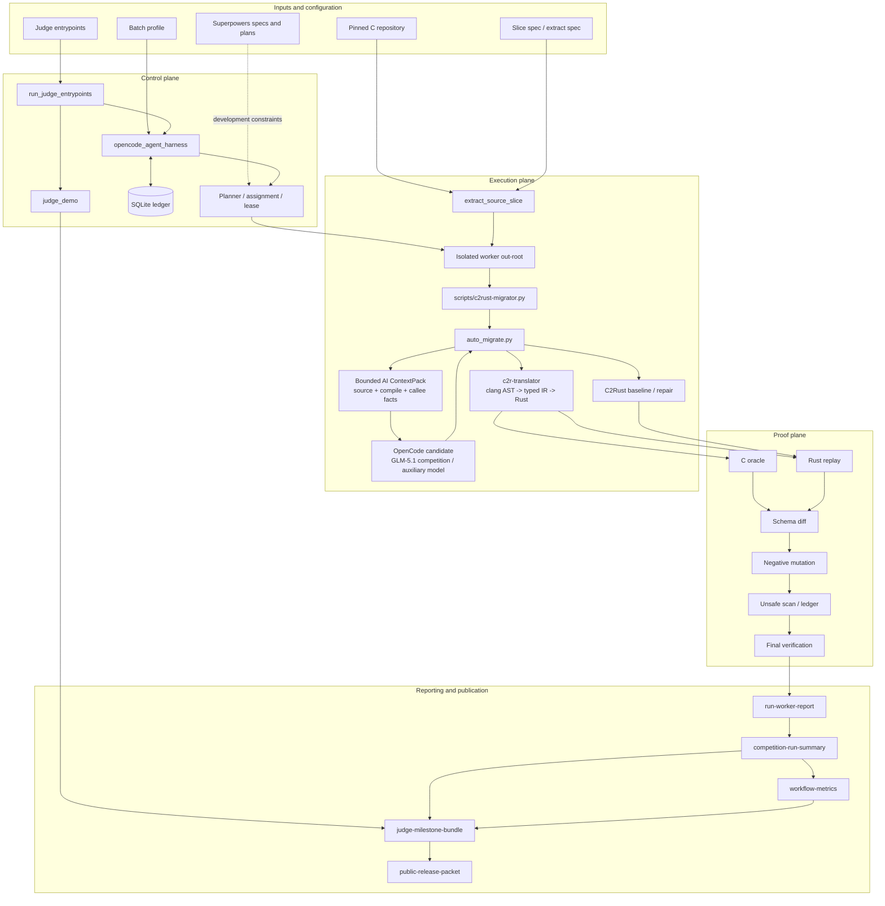
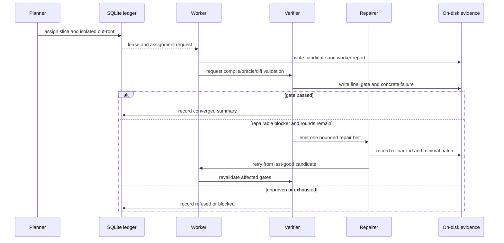

# Verifiable C-to-Rust Migration Harness

This repository is a progressive C-to-Rust translation and verification system for real C projects. clang/typed IR, C2Rust, and OpenCode/LLM output are candidate sources only. A shared C oracle, Rust replay, schema diff, negative mutation, unsafe ledger, and final-verification chain decides whether a candidate is accepted.

```text
real C source -> bounded Rust candidate -> executable equivalence evidence -> accepted / refused / blocked
```

## Current Status

| Item | Status |
| --- | --- |
| Translator-generated semantic pass | `38` named slices, derived from `validation/translator-coverage-matrix.json` |
| Accepted-evidence authoritative | `1`, reported separately from the translator numerator |
| Latest development stage | P0-A18c3: add a closed self-contained source contract to the required API |
| Active translator task | P0-A18c: re-evaluate AI exact and first-round API match rates on the fixed cross-project suite |
| Current environment proof | `wsl-local-simulation`, not `competition-exact` |
| FlashDB competition source pin | branch `competition`, commit `f9d0421315c564fb890a1b14eee77b290e0d7bbe` |
| Development workflow | Superpowers specs/plans, canonical roadmap, and harness evidence gates |

These counts cover declared named-slice boundaries only. They do not prove complete C support, complete `fdb_kv_iterate`, whole-project FlashDB migration, or production safety.

The canonical backlog is [future-vision-and-mvp.md](docs/c2rust-migration-agent/future-vision-and-mvp.md). Designs and implementation plans live under `docs/superpowers/specs/` and `docs/superpowers/plans/`.

## What the Harness Does

1. Pins repository, branch, commit, function, compile database, and fixture input.
2. Plans isolated worker assignments with one out-root per worker.
3. Uses OpenCode/GLM-5.1 as the primary generator for new translations, with generic typed IR and C2Rust/C2Rust+repair as auditable alternatives.
4. Executes the shared C oracle, Rust replay, diff, negative-diff, unsafe, and profile gates.
5. Applies one bounded repair per round and rolls back to the last-good candidate on failure.
6. Stores scheduling state in SQLite and semantic facts in on-disk validated artifacts.
7. Produces workflow metrics, before/after exhibits, judge bundles, release notes, and public packets.

OpenCode retries are also guarded by a no-progress gate: after two identical deterministic failures with identical effective inputs, a third launch is refused before the runner and recorded as a hash-bound event. Transient environment, credential, lock, and contract failures remain retryable. This saves calls without changing semantic acceptance gates.

OpenCode worker and preflight prompts retain one executable `Command line:`. The duplicate JSON argv text was removed while structured argv, command hashes, sessions, and handoff evidence remain intact. Representative prompt size dropped by 13.2%-16.1% without changing semantic gates.

Batch profiles also support a deterministic-first `mode=auto` admission gate. It selects deterministic execution before OpenCode preflight only when every worker binds accepted evidence, an existing evidence root, a source hash, and a slice spec with no repair policy. All other inputs fail closed. `competition-exact`, hostless rehearsal, and explicit OpenCode attestation cannot auto-downgrade.

SQLite and agent conversation are not semantic evidence. Only on-disk artifacts and validators establish acceptance.

## AI-first Translation Contract

AI is the competition translation primary, not a fallback invoked only after deterministic translation fails. Every new slice first receives a hash-bound ContextPack, then OpenCode `zai/glm-5.1` + `c2rust-candidate` + `max` emits one primary Rust candidate. Typed IR and C2Rust remain zero-token alternatives, failure controls, and repair bases. They cannot silently claim that AI ran or bypass the common gates.

ContextPack v4 gives the model only bounded facts: the real source span, compile arguments and response files, type/CFG/pointer excerpts, failure summaries, ABI and pointer policy, direct-callee contracts, and the complete Rust replay source contract generated before provider launch. Replay source, SHA, size, and real call count share one input binding. Missing, sensitive, oversized, call-free, or drifted replay evidence fails closed. Required callee context that is truncated or over budget is still refused with zero provider calls.

Candidate and repair prompts place the same generated replay source contract before a ContextPack projection, followed by the declared signature and Rust public-API, raw-pointer, and unsafe policies. The complete replay source and ReplayCallPlan payload each appear once. The bounded declarative DSL binds the C source function, Rust `api_name`, parameter order/types, C mappings, retained lengths, return/field types, fixture codecs, ABI, unsafe policy, and plan SHA; the renderer, provider readiness, and fresh binding consume the same object. All inventoried scalar, mutable-out, record-state, scripted-external, record-pointer, buffer/length identity, and opaque-context adapters now consume ReplayCallPlan. Dedicated fallback dispatch and readiness OR lists are removed; function and project names remain contract data rather than routing keys.

AI candidate manifest v9 derives `prompt_scope` from the actual ContextPack and records `generated_replay_api_contract`. ReplayCallPlan also derives a recomputable `required_candidate_api` containing the exact function signature, required supporting structs, ABI, unsafe marker, and reference-return lifetime. Provider readiness and the fresh validator independently recompute it and fail closed on drift. The required API also carries a closed self-contained source contract: nonempty `supporting_types_source` must appear exactly once, the harness does not inject missing types, and the model must not replace the compiler-owned fixture model with invented extern, FFI, or opaque types. Every real invocation binds its response, minimal invocation receipt, and session-export identity. One same-prompt retry is allowed only for valid tool-free JSONL that has no assistant text, ends at `step_finish`, and reports zero output and reasoning tokens. Balance, authentication, timeout, nonzero exit, tool events, and ordinary malformed responses are not retried. The competition lane accepts only `zai/glm-5.1`; when GLM balance is unavailable, `opencode/deepseek-v4-flash-free` is used only for `auxiliary-local-validation` and never enters competition or translator numerators. AI output remains `semantic_gate=false`; only common gates can accept it.

Candidate generation uses the tool-free `c2rust-candidate` agent, and any nested OpenCode `tool` or `tool_use` event fails closed. Worker/preflight execution retains `c2rust-migrator`, so candidate and command-execution agents are no longer conflated. Competition probing uses logical model `GLM-5.1`, while candidate CLI calls use resolved id `zai/glm-5.1`. The parser accepts strict JSON or explanatory text containing exactly one complete JSON fence; multiple or incomplete fences, extra tool access, and unbounded fields remain rejected. OpenCode 1.17.18 uses the `opencode-file-attachment-v2` order: fixed short message first and `--file=<prompt>` second, preventing `--file` from consuming the message as another file.

## Harness Architecture



## Artifact Data Flow

```mermaid
flowchart LR
    A["1. Source pin\nrepo + branch + commit"]
    B["2. Source extraction\nfunction + dependencies"]
    C["3. Slice spec\nboundary + fixture + build profile"]
    D["4. Context pack\nsource + compile + callee facts + hashes"]
    E["5. Worker assignment\nworker id + isolated out-root"]
    F["6. AI-primary inventory\nOpenCode + typed IR + C2Rust"]
    G["7. Fresh exact proof\ncandidate SHA + current-run oracle"]
    H["8. Executed gates\nrustc + Rust replay + schema diff"]
    I["9. Safety gates\nnegative + unsafe + alias + ABI"]
    J{"10. Gate-only router"}
    K["accepted\ndeclared slice only"]
    L["refused\nunsupported construct"]
    M["blocked\nmissing environment/evidence"]
    N["11. Worker summary\nartifact refs + hashes"]
    O["12. Merge and metrics\ncompetition summary + workflow metrics"]
    P["13. Judge publication\nbundle + notes + public packet"]

    A --> B --> C --> D --> E --> F --> G --> H --> I --> J
    J -->|"AI passes"| K
    J -->|"AI fails; exact deterministic passes"| K
    J -->|"repairable; all zero-token candidates failed"| F
    J -->|"known unsupported"| L
    J -->|"missing proof/tool"| M
    K --> N
    L --> N
    M --> N
    N --> O --> P
```



Every stage emits repo-relative paths and hashes. Downstream validators reopen artifacts instead of trusting upstream prose.

## Repair / Retry Flow



The default repair cap is five rounds. Process exit status, model text, and repair history prove execution only; a candidate is accepted only after shared gates pass again.

## Main Components

| Component | Responsibility | Main output |
| --- | --- | --- |
| `extract_source_slice.py` | Extract function, dependencies, and source identity from a real checkout | slice spec |
| `crates/c2r-translator/` | clang AST, typed IR, generic Rust emitter, fail-closed reasons | candidate and lowering report |
| `auto_migrate.py` | Orchestrate generation, oracle/replay drafts, route/profile, and evidence | auto-translation evidence |
| `validate_auto_translation_evidence.py` | Cross-check schema, hashes, identity, and semantic gates | strict validation result |
| `opencode_agent_harness.py` | Run/plan/worker/retry/evaluate, SQLite state, isolation, recovery | worker reports, indexes, merge plan |
| `run_competition.py` | Aggregate slices/workers and run environment, unsafe, and summary gates | competition summary and workflow metrics |
| `judge_demo.py` | Build the before/after safety exhibit | exhibit and judge evidence index |
| `run_judge_entrypoints.py` | Run smoke, before/after, multi-worker, and OpenCode entrypoints | run report, bundle, public packet |

## Candidate and Acceptance Boundary

| Source | Purpose | Semantic pass by itself? |
| --- | --- | --- |
| Generic typed IR | Generic AST/type/alias-driven candidate | No |
| Raw C2Rust | Broad unsafe baseline | No |
| C2Rust + repair | Safety before/after candidate | No |
| OpenCode / LLM | Candidate generation and bounded repair | No |
| C oracle + Rust replay + diff gates | Executable equivalence within the declared boundary | Yes |

The AI exact path cannot be combined with accepted-evidence reuse. Candidate and repair prompts are SHA-bound files passed with the `opencode-file-attachment-v2` ordering: the fixed short message precedes `--file=<prompt-path>`, so the full ContextPack and failure facts do not enter process argv. A passing auxiliary-model run remains local evaluation evidence rather than competition evidence.

When GLM balance is unavailable, `run_ai_auxiliary_cross_project_suite` provides a separate lane that defaults to `opencode/deepseek-v4-flash-free`. It rejects competition-eligible models, nonempty out-roots, unsafe or duplicate project/slice identities, and slice-spec SHA drift before or during execution. Concurrent units receive isolated OpenCode config/data/cache/state/tmp directories, separating SQLite, sessions, and logs. Its report hard-codes both competition and translation numerators to zero and cannot close P0-A6/A10/H9.

The latest WSL auxiliary run, `ai-auxiliary-p0-a18c1-deepseek-wsl-20260712-204206`, used the fixed 12 items and `opencode/deepseek-v4-flash-free`: 12/12 preflight ready, 12 initial plus 4 response-proven repair calls, 16 provider invocations total. It produced 11 candidates, 2 exact passes, 9 exact failures, no contract failure, 1 execution failure, and no provider block. The exact passes remain `real-fdb-calc-crc32` and `real-fdb-is-str`, so exact success did not improve. Relative to the previous run, candidates increased 8 to 11, contract failures fell 2 to 0, provider blocks fell 1 to 0, total calls fell 18 to 16, and first-round rustc API mismatches under a valid target contract fell 3 to 1. `tsl_to_blob` and `kv_set` now compile, while `kv_to_blob` still does not. The execution failure was a zero-start AI draft violating the safe owner-interior alias contract before that exception was structured; P0-A18c2 now records such rejection as a fail-closed replay failure. Report SHA-256 is `512641d1ece1d6dcf8b5bc20af3208da467a1c5284931d3c2a32bdb5cf8551c1`. This remains `wsl-local-simulation` with both public numerators fixed at zero.

P0-A18c1 fixes that accounting and removes low-information calls. Fixture-only compile stubs exist only during checking, after which the canonical AI draft is restored byte-for-byte. Repair prompts request only a complete self-contained Rust candidate. AI repair is skipped with a recorded reason when the fresh C oracle did not pass, the target contract is absent, or no structured candidate failure exists. The auxiliary timeout defaults to 300 seconds. The implementation passes 161 focused Windows tests; the P0-A18c2 structured safety-refusal path passes 4/4 on both Windows and WSL. The fixed suite still has only two exact passes, so P0-A18c remains open.

```bash
python3 -B -m validation.tools.run_ai_auxiliary_cross_project_suite \
  --suite validation/ai-finite-cross-project-suite.json \
  --out-root target/ai-auxiliary-$(date +%Y%m%dT%H%M%S) \
  --model opencode/deepseek-v4-flash-free \
  --repair-rounds 1 --max-workers 3
```

The AI candidate cache is disabled by default and is enabled only through the standalone generator's `--cache-root` or `auto_migrate`/competition runner's `--ai-candidate-cache-root`. Its content key binds the ContextPack payload SHA, prompt schema version, actual prompt SHA, resolved model, agent name, repository-local agent-definition SHA, variant, and parse contract version. It publishes only successful responses whose `entry.json`, `response.jsonl`, and `candidate.rs` can be reopened, reparsed, and verified by SHA. Same-key requests use single-flight plus locked first-writer-wins directory publication; a corrupt entry is quarantined and rebuilt by one real call. Provider failures, timeouts, refusals, and malformed responses are never cached. A hit records `provider_invocations=0`, `cache.status=hit`, and metrics `cache_hits=1`; later repair calls remain separate invocations. The summary validator independently reopens the copied cache entry, raw response, and initial candidate. A cache hit reuses candidate input only, still traverses every common gate, and remains `semantic_gate=false`. The competition runner accepts only repository-local cache roots so host paths cannot enter replay commands.

ContextPack v3 performs bounded expansion of compile-command response files. It currently accepts only an explicit `gnu-v1` dialect for clang/gcc/cc families; MSVC `cl` and unknown compilers are structurally refused instead of guessing a tokenizer. Relative `@file` references must resolve inside the source root, with hard limits on recursion depth, expansion count, per-file and total bytes, and argument count. Cycles, links, escapes, encoding errors, NULs, malformed quoting, and budget overflow block before provider invocation. Each file's logical path, SHA, size, and depth is bound in both the selected entry and ContextPack inputs, and the summary validator independently recomputes the binding.

A named slice may increase the semantic numerator only when source/fixture/candidate hashes agree, C and Rust execute, schema diff and a discriminating negative mutation pass, unsafe/route/profile/final-verification artifacts are cross-bound, and the strict validator passes with `--require-semantic-pass`.

## Worker Isolation and State

```text
target/competition-out/
  state/opencode-agent-harness.sqlite3
  harness/
    context-pack.json
    agent-index.json
    plans/*.json
    merge-plan.json
    resume-manifest.json
  workers/<worker-id>/
    request.json
    evidence/
    harness/run-worker-report.json
    summary/competition-run-summary.json
  summary/
    competition-run-summary.json
    workflow-metrics.json
```

Each worker writes only its assigned out-root. Request and ledger paths must match. Stale summaries are removed before execution. OpenCode workers require a passed preflight from the same run. Merge consumes machine-readable worker summaries only and fails closed on missing summaries, hash drift, or failed final gates.

## Competition Proof Classes

The machine-readable environment profile is `config/competition-env/environment.json`.

| Proof class | Source | Closes competition-host acceptance? |
| --- | --- | --- |
| `local-simulation` | Windows/local host | No |
| `wsl-local-simulation` | WSL | No |
| `ci-approximation` | Linux CI | No |
| `competition-exact` | Real host with `COMPETITION_EXACT_HOST=1` | Yes |

Current WSL differs from the target in kernel, Rust/Cargo, Node/npm, Java/Maven, CMake baseline, and strict GLM model probe. See the competition-environment section in the canonical roadmap for the exact comparison.

## Quick Start

```bash
# Development verification
cargo fmt --all --check
cargo test --manifest-path crates/c2r-translator/Cargo.toml --all-features
python3 -B -m unittest validation.tools.test_auto_migrate validation.tools.test_validate_auto_translation_evidence
python3 -B validation/tools/translator_coverage_matrix.py --matrix validation/translator-coverage-matrix.json

# WSL competition-profile simulation
source config/competition-env/env.sh
export CLANG_PATH=/usr/bin/clang
bash config/competition-env/toolchain-check.sh
bash config/competition-env/smoke.sh wsl-local-simulation target/competition-smoke-wsl

# Judge before/after exhibit
python3 -B -m validation.tools.judge_demo \
  --profile config/competition-env/planned-batches/flashdb-fdb-utils-before-after.json \
  --run-id competition-flashdb-before-after-exhibit \
  --out-root target/competition-out-flashdb-before-after-exhibit \
  --review-checklist config/competition-env/review-checklists/flashdb-harness-internal-review.json

# All judge entrypoints
python3 -B -m validation.tools.run_judge_entrypoints \
  --config config/competition-env/judge-entrypoints/flashdb-harness.json \
  --out target/competition-out-flashdb-judge-entrypoints/summary/judge-entrypoints-run-report.json
```

On the real competition host, set `COMPETITION_EXACT_HOST=1` and add `--proof-class competition-exact`.

OpenCode preflight:

```bash
python3 -B -m validation.tools.opencode_agent_harness opencode-preflight \
  --run-id <run-id> \
  --out-root target/opencode-preflight \
  --opencode-model GLM-5.1 \
  --opencode-agent c2rust-migrator \
  --opencode-variant max
```

## Superpowers Workflow

The project uses these development entrypoints:

1. `docs/superpowers/specs/` for behavioral and architectural designs.
2. `docs/superpowers/plans/` for executable implementation, test, and rollback plans.
3. `docs/c2rust-migration-agent/future-vision-and-mvp.md` as the only global backlog.
4. `validation/**` as executable contracts and evidence; documentation checkboxes cannot replace them.

Superpowers documents guide development. They are not competition preflight inputs or semantic gates.

## Core Directories

| Path | Contents |
| --- | --- |
| `crates/c2r-translator/` | translator, clang frontend, typed IR, emitter |
| `validation/tools/` | migration, harness, validation, judge, and report tools |
| `validation/slice-specs/` | real source-backed slice contracts |
| `validation/evidence/` | hash-bound oracle/replay/diff/unsafe/route/profile evidence |
| `validation/l2_slices/` | Rust replay and C oracle fixtures |
| `flashDB_rust/` | FlashDB Rust skeleton/reference runtime |
| `config/competition-env/` | environment, batch profiles, judge entrypoints, OpenCode runbook |
| `docs/superpowers/` | current designs and implementation plans |
| `docs/c2rust-migration-agent/` | architecture, runbooks, roadmap, and boundaries |
| `scripts/` | full regression and helper scripts |

## Core Principles

- Candidates are not correctness; every route passes the same gates.
- The C oracle is ground truth only within its declared fixture/compiler/ABI contract.
- Fail closed with an actionable next step when proof is missing.
- FlashDB is a real test input, never a project/function-name translation specialization.
- Unsafe counts are metrics, not complete proof for FFI, volatile, concurrency, ABI, or hardware.
- Public artifacts use repo-relative paths and never contain secrets or host absolute paths.

## Repository

- Main development branch: `codex/flashdb-rust-skeleton`
- GitHub: `https://github.com/guoqihan342-svg/c-to-rust`
