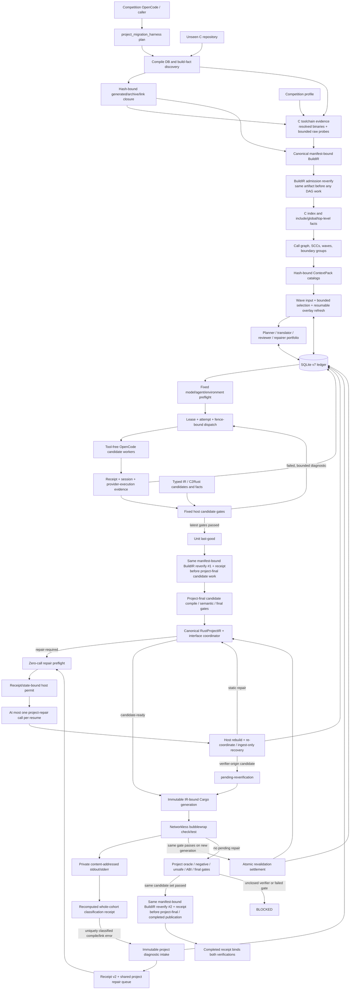
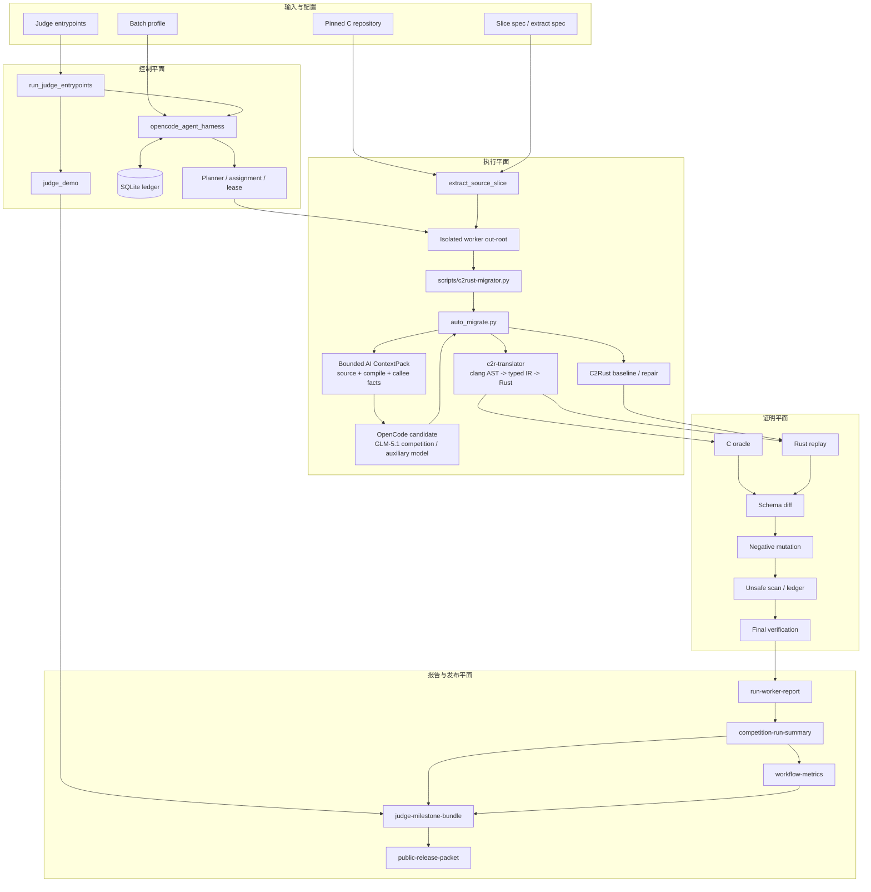
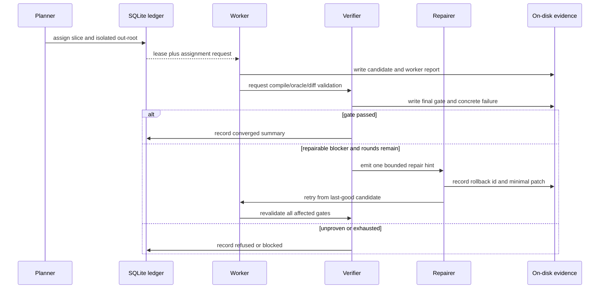

英文镜像见 `README.en.md`。

# C-to-Rust 可验证迁移 Harness

本项目是一套面向真实 C 项目的渐进式 C-to-Rust 翻译与验证系统。它把 clang/typed IR、C2Rust 和 OpenCode/LLM 都视为候选来源，再通过同一套 C oracle、Rust replay、差异比较、负向变异、unsafe ledger 和 final verification 决定候选是否可以接受。

项目重点不是“生成一段看起来像 Rust 的代码”，而是建立一条可复现、可审计、失败时自动收口的迁移链：

```text
真实 C 源码 -> 有边界的 Rust candidate -> 可执行等价性证据 -> accepted / refused / blocked
```

## 当前状态

| 项目 | 当前状态 |
| --- | --- |
| Translator-generated semantic pass | `38` 个 named slices，由 `validation/translator-coverage-matrix.json` 派生 |
| Accepted-evidence authoritative | `1` 个，单独统计，不进入 translator numerator |
| 最近开发阶段 | P0-A19：陌生仓库构建闭包、验证权威与真实 held-out 合同收口 |
| 当前翻译任务 | P0-A19 项目级编排优先；P0-A18c/P0-A10 保留为有限回归与 held-out 验收 |
| 当前环境证明 | `wsl-local-simulation`，不是 `competition-exact` |
| P0-A19 有限门禁 | Windows 共 867 项：861 项通过、6 项平台条件跳过；WSL 显式开启 live gate 后 867/867 全通过 |
| FlashDB 比赛源码 pin | `competition` 分支，commit `f9d0421315c564fb890a1b14eee77b290e0d7bbe` |
| 开发工作流 | canonical roadmap + code/tests + harness evidence gates |

能力计数只代表已绑定 named-slice 边界。它不表示完整 C 语言覆盖、完整 `fdb_kv_iterate`、FlashDB 全项目自动迁移或生产级安全性。

全局待办、阶段状态和实施顺序的唯一入口是 [future-vision-and-mvp.md](docs/c2rust-migration-agent/future-vision-and-mvp.md)；架构合同维护在 `docs/c2rust-migration-agent/`，是否通过只由代码、测试和 `validation/**` 证据决定。

## Harness 解决什么问题

普通翻译器通常在“输出 Rust”处结束。本项目的 harness 继续负责：

1. **固定输入**：绑定仓库、分支、commit、真实函数、编译数据库和 fixture。
2. **规划与隔离**：把 source file 拆成独立 worker assignment，每个 worker 使用独立 out-root。
3. **候选生成**：新翻译默认由 OpenCode/GLM-5.1 生成主候选，generic typed IR、raw C2Rust/C2Rust+repair 作为可审计替代候选。
4. **共同验证**：执行 C oracle、Rust replay、schema diff、negative diff、unsafe 和 profile gates。
5. **自动修复**：每轮只处理一个具体 compile/semantic/unsafe blocker；失败回滚 last-good。
6. **状态恢复**：SQLite 保存 assignment、lease、event 和 artifact index，磁盘 summary 保存语义事实。
7. **评委输出**：生成 workflow metrics、before/after、judge bundle、release notes 和 public packet。

OpenCode retry 额外受 no-progress 门控制：相同有效输入和相同确定性失败连续两次后，第三次启动会在 runner 前被拒绝并留下 hash-bound 事件；暂态环境、凭据、锁和合同问题继续重试。该机制只节省无效调用，不改变语义验收门禁。

OpenCode worker 与 preflight prompt 只保留一条可执行 `Command line:`；重复 JSON argv 文本已删除，结构化 argv、命令 hash、session 与 handoff 证据仍完整保留。该调整减少 13.2%-16.1% 的代表性 prompt bytes，不改变语义门禁。

批处理还支持 `mode=auto` 的 deterministic-first admission gate：只有全部 worker 都绑定 accepted evidence、现存 evidence root、source hash 和 slice spec，且没有 repair policy 时，才会在 OpenCode preflight 前选择 deterministic；其余输入 fail closed。`competition-exact`、hostless rehearsal 和显式 OpenCode attestation 不允许自动降级。

SQLite 不是语义事实源，Agent 对话也不是 evidence。语义结论只来自落盘 artifact 和 validator。

## AI-first 翻译合同

本项目以 AI 作为比赛翻译主通道，而不是在确定性翻译失败后才调用 AI。每个新切片先构造 hash-bound ContextPack，再由 OpenCode `zai/glm-5.1` + `c2rust-candidate` + `max` 生成单一 Rust 主候选。typed IR 和 C2Rust 继续保留，用于零 token 替代、失败对照和 repair base；它们不能静默冒充 AI 已运行，也不能绕过共同验证门禁。

ContextPack v4 只向模型提供有界事实：真实 source span、编译参数与 response files、类型/CFG/指针摘要、失败摘要、ABI/指针策略、直接被调函数合同，以及 provider 启动前生成的完整 Rust replay source contract。replay 的源码、SHA、大小和真实调用次数进入同一 input binding；缺失、敏感、超限、无真实函数调用或文件漂移均 fail closed。敏感字段、带引号密钥赋值、宿主绝对路径和路径逃逸会被清理；必需的 callee boundary 超限或截断时同样在 provider 启动前零调用拒绝。

clang typed IR 会进一步投影为 hash-bound ordered behavior digest，保留 assignment target/RHS、嵌套分支与循环、调用顺序、字段写入、`continue`、返回值、unsigned wrapping 和 all-ones sentinel。未知节点、预算截断或投影 SHA 漂移会在 OpenCode 启动前拒绝，不会把部分摘要描述为 exact semantics。ReplayCallPlan 声明的 scripted callees 由验证 harness 注入并已在候选词法作用域；模型只能按源码位置调用，不能自行声明、定义、mock 或 inline，违反时写入结构化 rust-check 失败证据。

真实项目 C oracle 可通过 `linked_artifacts_v1` native-build closure 消费 repo-owned compile database、source/generated include、静态库、有序系统链接参数、源符号到实际链接符号映射、构建配置、toolchain 和 target ABI。所有路径必须是 repo-relative，manifest、目录树和文件逐项 SHA-256 复核，symlink、逃逸、缺失或漂移均在编译前以零 argv fail closed；`c_boundary.files` 不再被误当作链接闭包。静态闭包只解决可复现构建与链接，harness 未执行 fixture call/output comparison 时仍保持 `semantic_gate=false`。

候选和 repair prompt 会在 ContextPack 投影前单独展示同一份 generated replay source contract，并重申函数签名、Rust public API、raw-pointer 与 unsafe 策略。完整 replay source 和 ReplayCallPlan payload 均只出现一次。声明式 plan 通过受限 DSL 绑定 C source function、Rust `api_name`、参数顺序/类型、C 参数映射、保留的 length、返回/字段类型、fixture codec、ABI、unsafe 和 plan SHA；renderer、provider readiness 与 fresh binding 使用同一对象。所有已盘点 adapter 均已计划化，专用 fallback dispatch 与 readiness OR 列表已删除。record identity 使用闭合 JSON 路径、递归 record initializer、受限 null/constant leaf、调用前后 reference identity 和显式 noalias proof；record buffer/length 使用显式可空 byte storage、保留 length 和 raw-pointer identity；opaque context 生成 `&KvDbFixture`、`&str`、`Option<&str>` 安全 Rust replay model，拒绝 marker、`zeroed`、地址字面量和任意 Rust 表达式。动态 slice 继续使用有界 `Vec<i32>` 与最多 4096 项的 codec。以上均是 harness/replay 能力，不自动增加 translator semantic numerator。

AI candidate manifest v9 的 `prompt_scope` 由实际 ContextPack 计算，并显式记录 `generated_replay_api_contract`。ReplayCallPlan 现在额外生成可复算的 `required_candidate_api`，把精确函数签名、必要 supporting structs、ABI、unsafe 和引用返回生命周期在模型调用前单独展示；provider readiness 与 fresh validator 都从同一 plan 复算，漂移即 fail closed。required API 还声明闭合的 self-contained source 合同：非空 `supporting_types_source` 必须原样出现一次，harness 不补注入缺失类型，模型不能用自造 extern/FFI/opaque 类型替代 compiler-owned fixture model。manifest 把 provider、logical/resolved model、`competition_eligible` 和 `evaluation_scope` 绑定到 generator 与 candidate；每次真实调用都绑定独立 response、最小 invocation receipt 和 session-export identity。仅当合法 JSONL 无工具、无 assistant 文本、以 `step_finish` 结束且 output/reasoning token 都为 0 时，才允许原 prompt 原模型再调用一次；余额、鉴权、timeout、非零退出、工具事件和普通 malformed response 均不重试。比赛主通道只认 `zai/glm-5.1`；GLM 余额不足时改用 `opencode/deepseek-v4-flash-free` 做 `auxiliary-local-validation`，但不能关闭比赛待办或进入比赛成功率分子。AI 输出始终保持 `semantic_gate=false`，最终接受只由共同门禁决定。

切片级候选生成使用无工具 `c2rust-candidate`；既有 `opencode_agent_harness` 命令执行通道继续使用 `c2rust-migrator`。P0-A19 项目级 preflight/worker 属于独立固定合同，两者均使用 `c2rust-candidate` + `max`。OpenCode 事件中出现任何层级的 `tool`/`tool_use` 都会 fail closed。比赛探针使用逻辑模型名 `GLM-5.1`，candidate CLI 使用 resolved id `zai/glm-5.1`。解析器接受严格 JSON，或带少量说明但只有一个完整 JSON 围栏的响应；多围栏、不完整围栏、额外工具访问和不受限字段仍会拒绝。OpenCode 1.17.18 的文件参数按“固定短消息在前，`--file=<prompt>` 在后”的 `opencode-file-attachment-v2` 合同传输，避免 `--file` 把消息误解析为第二个文件。

## 整项目 AI 编排

比赛平台上的外层 OpenCode 不需要逐函数编写 spec。它只调用 `project_migration_harness.py plan` 并提供仓库根；后续由 harness 自己发现 compile database、CMake/Ninja/Meson 构建事实、编译输出、静态归档和链接边，生成 SCC/DAG、内容寻址 ContextPack catalog/frontier、角色组合和 SQLite 状态。`plan` CLI 默认使用 `--profile competition` 和 `--build-closure-policy required`；`--profile development` 只是必须显式选择的非比赛兼容路径。闭包不完整时所有 ready worker 都 deferred，`bounded-source` 只允许生成 `semantic_gate=false` 的调查候选，不能进入项目完成路径。

competition profile 在发现完成后、任何 worker/AI 启动前，从发现到的 compiler driver/wrapper、linker driver/linker、archiver 和 ranlib 构造 `c-toolchain-evidence`。证据绑定 `config/competition-env/environment.json` 的 path/SHA/size/profile id、环境白名单与 PATH 快照哈希、host/WSL 指纹、绝对解析路径和 binary SHA/size，并只运行固定且有界的 version、target、sysroot、resource-dir 和 derived-linker 探针。每个探针的原始 stdout/stderr 以有界 base64、SHA-256 和 size 保存在 BuildIR 哈希绑定的内容寻址 attachment；工具缺失、探针失败或漂移、平台不符以及 competition GCC 版本不符都会在调度前 fail closed。

competition 的 canonical BuildIR 把 TU、ABI facts 以及 object/link/archive target 的 `toolchain_id` 作为到 host-probed toolchain records 的外键，缺失或未知外键以及 token-only evidence 不能通过。每次重开时，verifier 都从 BuildIR raw-fact refs 读取原始 `c-toolchain-evidence` attachment，复核 base64/hash/size，重新解析 profile、repository bindings 和绝对 executable，重跑固定探针，重新派生 linker/role mapping，并逐字节重投影 BuildIR；PATH、环境、binary、probe 或 projection 任一漂移都会阻断。

BuildIR 适配器收敛由同源 Git-tracked fixture 锁定：CMake、Ninja、Meson 对两个 TU、静态归档、ranlib、最终多输入链接和外部依赖产生相同 canonical projection；Meson 私有 target/source/compiler 摘要只能留在 provenance，不能进入下游 DAG 或 ContextPack。编排器在 CIndex/DAG 前再次重开同一 BuildIR 引用；首次验证或 admission 重开失败时，不生成 migration graph、portfolio、ledger，也不启动模型。该证据固定为 `semantic_gate=false`，不代表 build 或程序语义已经通过。

ContextPack 检索不再只靠 lexical identifier seed 判断可启动性。`pending_retrieval` assignment 保持零租约、零模型调用；host-owned single-SCC refresh 会重开 portfolio、catalog、receipt、page/group、refresh input 与 overlay 的完整 CAS 依赖后才恢复 `ready`。每波结束后，`prepare-next-context-frontier-wave` 从 portfolio-bound DAG、上一波 last-good、显式失败证据与 expansion query 派生受限 directives，原子失效整波，再逐 SCC 物化 overlay；中断后用同一 CAS 输入只续跑 pending SCC。跨 SCC fact、旧/未来 query epoch、legacy refresh、引用漂移和调用方自报身份都会在 provider 前 fail closed。该层仍是非语义调度门禁，不增加 translator numerator；AST type/layout/macro producer、计划期单体 CIndex 与重复 context 移除仍未完成。

运行时以 AI 为主：boundary group 先由 planner 选择“带上下文翻译、保留可验证 FFI 边界或明确拒绝”，translator 输出 Rust source，reviewer 只给结构审查，repairer 只消费允许的失败诊断。typed IR/C2Rust 是事实或候选来源，不是默认路由优先级；任何模型都不能写 semantic pass、last-good 或项目完成状态。

项目级 preflight 固定精确模型、`c2rust-candidate`、`max` 和不可变 agent snapshot。每个 attempt 只继承显式环境白名单，并使用独立 config/data/state/cache/tmp/out；真实调用的 receipt、session export projection、prompt/response SHA 和 provider-execution report 进入同一 ledger attempt/fence。候选接受由固定 host authority 完成：候选 gate、项目 gate、证据 SHA、最新 epoch 和不可变 candidate set 全部进入 SQLite，并在晋升/完成前重新打开内容寻址证据。Cargo 项目使用不可变 generation 和原子 `CURRENT` 指针；候选 `cargo check/test` 只允许在通过 capability probe 的 Linux bubblewrap 无网络沙箱中运行。VerificationPlan 显式绑定固定命令、managed-generation 输入、timeout 与严格能力集；rustup 场景先用 `rustup which` 解析实际 `cargo/rustc/rustdoc`，对受限 toolchain 树做完整内容哈希、执行前复算并只读挂载。candidate compile 与 project Cargo 复用同一 reopener，重新核对 contract、probe、plan、command-start、input 和 cleanup；项目 final/completion 还要求 check/test 输入等于最新 integration manifest。缺沙箱、能力 probe、oracle 或 ABI 证据时返回 blocked，不在宿主机降级执行。

Cargo generation 现在强制经过 canonical RustProjectIR。wave-provisional 会生成“当前候选 + last-good 依赖”的内容寻址子 DAG，并回指不可变完整 DAG；project-final 必须覆盖全部迁移单元。host 从当前 Rust source 复算 public/required/unsafe/FFI facts，重开 BuildIR、DAG 和每个 candidate source，再由唯一 interface coordinator 检查 module parent/cycle/orphan、跨单元 API/type/global/FFI/feature/cfg/init 冲突。只有 `candidate-ready` receipt 才能生成 Cargo；generation 内嵌 IR，并绑定 IR/interface/domain/coordinator SHA，integration verifier 会从原 artifact root 重建并逐字节比较。生产模块已删除 descriptor-only 写入口和直接写 generation 的 `integrate` CLI；只有绑定权威 ledger/run contract 的 `integrate-verified` 可以发布 full-project generation。

`CompletionCoordinator` 只从不可变 migration manifest 取得唯一 BuildIR 引用；competition 的 `complete` 必须用 `--repo-root` 提供原始 C 仓库作为重开 locator。它先在任何 project-final candidate compile/semantic/final work 前运行同一 BuildIR verifier；integration、Cargo 和下游 gate 完成后，在写入 host project-final 和发布 completed receipt 前再运行一次。两次内容寻址 verification receipt 都绑定进 completion receipt，任一次漂移都会终止后续工作。

这一层尚未完成全部 A19d3：RustProjectIR 和 generation manifest 会固定写入 `interface_completeness.status=partial`，自动派生 signature 仍明确标为 unresolved；候选 cohort 和 full-project candidate generation 可继续用于隔离检查，但 CompletionCoordinator 会阻止它进入 project-final gate 和 completed receipt。当前权威生成只支持 flat library modules；完整 shared-type layout、ownership、init/destruction、native link、多 crate/bin/target 和嵌套模块仍需 host extractor 或受验证 AI interface proposal。

project repair queue 已接入 schema v7 TransitionAuthority ledger 和专属 AI repairer。CompletionCoordinator 首次只观察最新 receipt，不创建 attempt；隔离的零调用 preflight 通过后，host-issued permit 会绑定精确 receipt/queue/item 状态、模型、agent 和运行时输入，再允许一次 resume 最多启动一个 provider call。provider 完整结果先按哈希写入 ledger，摄取阶段崩溃时下一次 resume 只重开证据并摄取，不再调用模型；证据不全或结果未知仍进入人工对账。attempt 预算沿稳定 diagnostic lineage 跨 receipt epoch 单调继承，另有每 run 64 次 provider call 和 65 个 receipt epoch 的硬上限。

schema v7 还增加了不可变 project diagnostic intake：host 会重开当前 candidate set、managed generation 和 canonical RustProjectIR，只接纳沙箱内 Cargo 实际执行后产生的结构化 rustc `error`。Cargo check/test 现在先冻结整个 candidate cohort，并在任何 repair 落账前统一验证 gate 顺序、执行状态、candidate identity/content owner 和每条 error 的唯一分类；unit owner 来自 RustProjectIR module path 与 candidate set 的交叉绑定，跨 module unresolved symbol 会进入 project queue。每个 gate 的有界 stdout/stderr 先写入私有内容寻址 artifact，observation v3 再绑定一个可从原始引用复算的 classification receipt；该 receipt 同时交叉绑定 run、cohort、project input、RustProjectIR/interface、unit partition 和准入 diagnostics。共享 linker parser 只接纳受限 GNU/lld/MSVC unresolved-symbol 形态，并要求 symbol 由当前 RustProjectIR 唯一映射到一个 module。任一未知、歧义、混合、重复 owner、旧 unit 路径、toolchain-sensitive rustc、环境故障或诊断溢出都会阻断整批 repair。只有整批准入后，唯一 unit 错误才进入 unit repair；带项目内位置、无法归到 unit 的 `E####` 编译错误或唯一 project link symbol 才绑定 cohort、IR/interface、generation input、raw observation 和 verifier receipt。warning、generic Cargo failure、环境/沙箱阻塞均为零 intake、零 AI 调用；私有原始文本不会进入模型上下文。

已验证 intake 现在进入兼容 schema v7 数据库的 coordinator receipt v2，并与静态接口诊断共用 project repair queue；verifier-origin 项优先调度。request 物化和 provider 启动前都会重开内容寻址 intake、当前 candidate set、原始 managed generation、RustProjectIR/interface 和 verifier receipt。AI 只提交有界 IR 操作，host 重建候选后对外状态只能是 `pending-reverification`；内部 `candidate-ready` 只是等待 host 复验的 ledger 状态，普通静态 receipt 和低层 resolve API 均不能关闭外部诊断。CompletionCoordinator 还会拒绝任何未 `resolved/cancelled` 的历史项目 repair 义务。

只有在新 managed generation 上由同一 host gate 产生更高 epoch 的新 pass，才能写出内容寻址 revalidation receipt。结算事务会同时重开 source intake、当前 cohort、原始与新 project input、ledger gate record、raw observation/evidence、分类回执、候选 IR/interface 和当前 generation，然后注册 successor receipt、resolve 目标并取消已被 successor 取代的同队列项；复验失败则回滚旧候选、登记新诊断并继承 attempt 预算。该闭环已接入 Cargo compile/link 的严格分类路径；initialization、feature/cfg、ABI 专属 verifier、A19e7 独立进程 capability、A19e8 non-degrading SandboxBackend 和完整 project-final semantic acceptance 仍未完成，AI 候选不会增加 translator numerator。

当前正向完成链仍未闭合：CLI 已有 host-owned integration/Cargo adapter 和失败诊断回投，但 candidate 的 oracle/negative/unsafe-alias/ABI/final 正向 runner 尚未全部接通。进程内 raw-output 引用、可复算 classification receipt 和 competition profile C toolchain input closure 已落地；A19e7 独立 verifier 进程/capability channel/一次性 nonce 与 A19e8 完整 sandbox capability/receipt/backend 等价性仍未落地。因此当前 host-issued receipt 只能证明 canonical 绑定与漂移拒绝，不能声明调用方不可伪造，也不能称为 `competition-exact`。真实 held-out 模式只重开只读 SQLite，复验 AI provider evidence、每个 candidate gate、不可变 candidate set、项目 final bundle 和原始 repository/build 绑定；任何自报 `semantic_gate=true` 的 JSON 都不能计入成功。

阶段入口如下；它只完成规划、模型预检和条件调度，不代表翻译验收结束：

```bash
python3 -B validation/tools/project_migration_harness.py plan \
  --repo-root /path/to/c-project \
  --profile competition \
  --compile-database /path/to/c-project/build/compile_commands.json \
  --out-root target/project-migration/run-001 \
  --run-id run-001 \
  --build-closure-policy required
python3 -B validation/tools/project_migration_harness.py preflight \
  --out-root target/project-migration/run-001 \
  --run-id run-001 \
  --logical-model GLM-5.1 \
  --resolved-model zai/glm-5.1
python3 -B validation/tools/project_migration_harness.py dispatch \
  --plan target/project-migration/run-001/project-migration-plan.json
python3 -B validation/tools/project_migration_harness.py prepare-next-context-frontier-wave \
  --plan target/project-migration/run-001/project-migration-plan.json \
  --latest-dag-path target/project-migration/run-001/project/portfolio-dag.json \
  --latest-dag-sha256 SHA256 --latest-dag-size-bytes SIZE \
  --completed-wave-index 0 \
  --failure-evidence target/project-migration/run-001/failure-evidence.json \
  --expansion-queries target/project-migration/run-001/expansion-queries.json
python3 -B validation/tools/project_migration_harness.py complete \
  --db target/project-migration/run-001/state/project-migration.sqlite3 \
  --run-id run-001 \
  --repo-root /path/to/c-project \
  --logical-model GLM-5.1 \
  --resolved-model zai/glm-5.1
```

`complete` 可重复执行；每次恢复最多启动一个 project-repair provider call。只有最新队列已解决且后续全项目门禁通过时才会发布 completion receipt。

真实 WSL 辅助 smoke `a19-deepseek-smoke-20260713` 使用 `opencode/deepseek-v4-flash-free` + `c2rust-candidate` + `max`：preflight report SHA 为 `f0bc76b6b2489597e782cd1f0e532b7483f03658680b4352401ee12c814913c0`，provider-execution SHA 为 `9e04b437135aa9f1e2171a180f2e77272374fc8bba3c1257d314e8a963c10b5d`，candidate SHA 为 `359cb2ef234f85d9aa1cbdf2d77e07a296f55cb8bd7d4ad9dd37afe4d9ea72ef`。该结果仅为 `candidate-ready` / `auxiliary-local-validation` / `semantic_gate=false`；WSL 缺 `bwrap`，未执行候选代码。

当前没有运行时依赖 LangGraph 或 LangChain。这里需要的是可审计的固定状态机、事务、外键、租约、围栏和证据重放；这些由仓库内 Python 编排器与 SQLite 实现。以后只有在框架能减少代码且不削弱上述合同校验时才考虑引入。



## 整项目数据流

```mermaid
flowchart LR
    A["1. Repo root"] --> B["2. Discovery + generated/archive/link closure"]
    P["Competition profile"] --> C["3. C toolchain evidence + raw probe attachment"]
    B --> C
    B --> D["4. Canonical manifest-bound BuildIR"]
    C --> D
    D --> BIRADMIT["4b. BuildIR admission reverify"]
    BIRADMIT --> E["5. Include, symbol, SCC migration DAG"]
    E --> F["6. ContextPack catalog + frontier CAS"]
    F --> F2["6b. Atomic wave invalidation + resumable SCC overlays"]
    F2 --> G["7. Preflight-bound worker request"]
    G --> H["8. AI candidate + provider evidence"]
    H --> I["9. Host candidate gates"]
    I -->|"repairable"| G
    I -->|"passed"| J["10. Unit last-good"]
    J --> V1["11. Same manifest-bound BuildIR reverify #1 before project-final candidate work"]
    V1 --> Q["12. Project-final candidate compile / semantic / final gates"]
    Q --> K["13. RustProjectIR + interface receipt"]
    K -->|"repair-required"| R["14. Preflight + state-bound permit + one AI repair"]
    R --> S["15. Host rebuild / re-coordinate or ingest-only resume"]
    S -->|"static repair"| K
    S -->|"verifier-origin"| T["16. pending-reverification"]
    K -->|"candidate-ready"| L["17. Cargo generation"]
    T --> L
    L --> M["18. Sandboxed build/test"]
    M --> O["19. Private raw refs + classification receipt"]
    O -->|"uniquely classified compile/link error"| U["20. Bound intake + receipt v2 queue"]
    U --> R
    M -->|"fresh same-gate pass"| W["21. Atomic revalidation settlement"]
    W --> K
    M --> X["22. Project semantic and safety gates"]
    X --> V2["23. Same manifest-bound BuildIR reverify #2 before publication"]
    V2 --> N["24. Completed receipt binds both verifications"]
```



每个箭头传递的都是受 schema、repo-relative path 和 SHA-256 约束的 artifact，不传递聊天结论。本阶段已处理已知 runtime/gate-authority 审查项，并补齐 CMake/Ninja/Meson 同源 BuildIR 收敛、multi-TU/静态归档/ranlib/多输入 link、competition profile C toolchain input closure、DAG 前 BuildIR admission 重开、CompletionCoordinator 双 checkpoint、CLI 与只读 held-out 证据约束。当前开放项仍包括受限 Meson/configure 生成、正向 candidate verifier、A19e7 独立进程 capability、A19e8 non-degrading sandbox、可用比赛等价环境和真实 held-out build/oracle semantic acceptance；这些 profile-bound 输入证据保持 `competition_exact=false`，该流程图是实现合同，不是整项目成功声明。

## 切片验证与发布架构



## 切片证据数据流

```mermaid
flowchart LR
    A["1. Source pin\nrepo + branch + commit"]
    B["2. Source extraction\nfunction + dependencies"]
    C["3. Slice spec\nboundary + fixture + build profile"]
    D["4. Context pack\nsource + compile + callee facts + hashes"]
    E["5. Worker assignment\nworker id + isolated out-root"]
    F["6. AI-primary inventory\nOpenCode + typed IR + C2Rust"]
    G["7. Fresh exact proof\ncandidate SHA + current-run oracle"]
    H["8. Executed gates\nrustc + Rust replay + schema diff"]
    I["9. Safety gates\nnegative + unsafe + alias + ABI"]
    J{"10. Gate-only router"}
    K["accepted\ndeclared slice only"]
    L["refused\nunsupported construct"]
    M["blocked\nmissing environment/evidence"]
    N["11. Worker summary\nartifact refs + hashes"]
    O["12. Merge and metrics\ncompetition summary + workflow metrics"]
    P["13. Judge publication\nbundle + notes + public packet"]

    A --> B --> C --> D --> E --> F --> G --> H --> I --> J
    J -->|"AI passes"| K
    J -->|"AI fails; exact deterministic passes"| K
    J -->|"repairable; all zero-token candidates failed"| F
    J -->|"known unsupported"| L
    J -->|"missing proof/tool"| M
    K --> N
    L --> N
    M --> N
    N --> O --> P
```



每个阶段都写出 repo-relative path 和 hash。下游 validator 会重新打开 artifact，而不是信任上游报告中的文字结论。

## Repair / Retry 数据流



默认 repair cap 是 3 轮，比赛合同硬上限是 5 轮。生产路径先验证 AI、typed IR 和当前运行 raw C2Rust；任一零 token 候选通过即停止 repair。全部失败后只修一个 base：raw C2Rust 的通过 gate 数严格高于 AI 时生成 `c2rust-repair`，否则修 AI，平局仍保持 AI-primary。进程返回码、LLM 文本和 repair history 只能说明执行过程；只有重新通过同一组 fresh exact gates 的 candidate 才能被 router 选择。

## 关键组件

| 组件 | 职责 | 主要输出 |
| --- | --- | --- |
| `extract_source_slice.py` | 从真实 C checkout 抽取函数、依赖和 source identity | slice spec |
| `crates/c2r-translator/` | clang AST、typed IR、通用 Rust emitter、fail-closed reason | Rust candidate、lowering report |
| `auto_migrate.py` | 编排候选生成、oracle/replay 草稿、route/profile 和 evidence | `validation/evidence/<target>/auto-translation/...` |
| `validate_auto_translation_evidence.py` | schema、hash、identity、semantic gate 交叉校验 | strict validation result |
| `validate_ai_exact_evidence.py` | 重开 fresh oracle、candidate gate-index、router 和 canonical SHA | AI exact strict result |
| `validate_ai_finite_cross_project_suite.py` | 校验最多 20 项、至少 3 个真实项目/10 类构造的固定套件输入完备性 | ready/blocked preflight，不产生成功率 |
| `project_migration_harness.py` / `_project_migration_harness/build_ir_*.py` / `c_toolchain_*.py` | 任意仓库 inventory、competition profile C toolchain evidence、canonical BuildIR、SCC/DAG、ContextPack、角色调度、门禁和 Cargo generation | `c-toolchain-evidence`、canonical BuildIR、project plan、SQLite v7、worker request、last-good project |
| `rust_project_ir*.py` / `project_interface_*.py` | 重开 BuildIR/DAG/candidate，协调跨单元接口并阻断冲突，确定性生成 IR-bound Cargo generation | canonical RustProjectIR、coordinator receipt、project repair queue、generation manifest |
| `opencode_agent_harness.py` | run/plan/worker/retry/evaluate、SQLite ledger、隔离和恢复 | worker reports、context pack、agent index、merge plan |
| `run_competition.py` | 汇总 slice/worker，执行环境、unsafe、summary gates | competition summary、workflow metrics |
| `judge_demo.py` | 构建 before/after 安全化展品 | before-after exhibit、judge evidence index |
| `run_judge_entrypoints.py` | 执行 smoke、before/after、多 worker、OpenCode 入口 | run report、milestone bundle、public packet |

## Candidate 与语义验收

| 来源 | 用途 | 单独能否 semantic pass |
| --- | --- | --- |
| Generic typed IR | 项目无关的 AST/type/alias 驱动候选 | 否 |
| Raw C2Rust | 广覆盖 unsafe baseline | 否 |
| C2Rust + repair | 安全化 before/after candidate | 否 |
| OpenCode / LLM | 候选生成和最小修复 | 否 |
| Fresh C oracle + exact replay/diff/safety/final gates | 声明边界内、绑定当前 candidate SHA 的可执行等价证据 | 是 |

AI exact 路径禁止同时传入 `--accept-existing-evidence`。历史 accepted reports 可以复验历史切片，但不能给新 AI candidate 补写 SHA 或 semantic status。

GLM 余额不足时使用独立的 `run_ai_auxiliary_cross_project_suite`，默认模型为 `opencode/deepseek-v4-flash-free`。它拒绝 competition-eligible 模型、非空 out-root、路径不安全或重复的 project/slice identity，并在每个单元启动前后复核 spec SHA；并发单元使用独立的 OpenCode config/data/cache/state/tmp，从而隔离 SQLite、session 与日志。报告固定 `competition_success_numerator=0`、`translation_coverage_numerator=0`，不能关闭 P0-A6/A10/H9。

最新 WSL 辅助运行 `ai-auxiliary-p0-a18c1-deepseek-wsl-20260712-204206` 使用固定 12 项和 `opencode/deepseek-v4-flash-free`：12/12 preflight ready，12 次 initial 加 4 次有 response 证明的 repair，共 16 次 provider 调用；生成 11 个候选，结果为 2 个 exact pass、9 个 exact failure、0 contract failure、1 个 execution failure、0 provider block。exact pass 仍是 `real-fdb-calc-crc32` 与 `real-fdb-is-str`，因此成功率没有提升。相比上一轮，候选数 8→11、contract failure 2→0、provider block 1→0、总调用 18→16；有效 target contract 下首轮 rustc API mismatch 从 3 项降到 1 项，`tsl_to_blob` 与 `kv_set` 已可编译，但 `kv_to_blob` 仍失败。唯一 execution failure 是 zero-start AI draft 不满足安全 owner-interior alias 合同，且当时异常未结构化；P0-A18c2 已把这类拒绝改为 fail-closed replay failure。报告 SHA-256 为 `512641d1ece1d6dcf8b5bc20af3208da467a1c5284931d3c2a32bdb5cf8551c1`。该运行仍是 `wsl-local-simulation`，两个公开 numerator 均为 0。

P0-A18c1 已修正聚合计量并减少无信息调用：canonical draft 的 fixture-only 编译 stub 只在检查期间存在，随后逐字节恢复 AI candidate，避免 manifest SHA 与落盘 draft 分叉；repair prompt 只请求完整自包含 Rust candidate；fresh C oracle 未通过、目标契约缺失或没有结构化候选失败时，不调用 AI repair并记录跳过原因。辅助套件默认 timeout 提升到 300 秒。实现通过 161 项 Windows 聚焦回归；P0-A18c2 的结构化安全拒绝在 Windows/WSL 聚焦门禁均为 4/4。固定 12 项 exact pass 仍为 2，因此 P0-A18c 未完成。

P0-A18c3 的 `kv_to_blob` 单项 0-repair DeepSeek 验证证明闭合 source 合同有效：一次 initial 调用即输出全部 supporting structs，rustc 与 generated replay 均通过；router SHA-256 为 `0c5f8f7130f4b6b8c163f1007af130cc6016f48234a54e6dde4485a8a7b31316`。剩余阻断只有 `alias_proof_missing`，原因是 compiler-owned proxy 中一个未观测、仅以 null 默认值初始化的字段仍使用 `*mut c_void`。P0-A18c4 仅把这类 record-default 字段投影为 `Option<NonNull<c_void>> = None`；真正参与 buffer、length 或 pointer identity 的字段不受影响。

P0-A18c5 不再把安全的 `Option<core::ptr::NonNull<T>>` 类型声明本身误计为 raw-pointer operation。该豁免只在候选完全不含 `unsafe` 且 `NonNull` 出现在泛型类型位置时生效；`NonNull::<T>` 构造、`core/std::ptr` 其他 API、`as_ptr/as_mut_ptr/from_raw/into_raw`、raw pointer 类型和任何 `unsafe` + `NonNull` 组合仍要求 current-candidate alias proof。Windows 与 WSL 的 53 项相关门禁均通过。

提交 `ecbb2ef3` 后的 WSL DeepSeek 0-repair 验证中，`kv_to_blob` 与 `tsl_to_blob` 均以 1 次 provider 调用获得 AI exact pass；router SHA-256 分别为 `4f753f9cd00359d46ed13044f9845b9dff04702c84a4c9ede0aacfc85de31cac` 和 `93f7b5fe6d2f7f3d903d7042d2a78236b96b86afa491faeea5c971ed00d7a68b`，unsafe token 与 raw-pointer operation 均为 0。`kv_set` 同配置下仍失败：候选通过 rustc/unsafe/oracle，但 replay 期望外部 callee fixture 返回 `7`，候选自行实现为 `-1`；失败 router SHA-256 为 `4a6b7b99095e2c91fde2c40a9eac9ca141a9bb276d4c981dd886115350d6f6a0`。下一项不是增加函数特例，而是让 ContextPack 提供可复算、可执行的外部 callee 行为合同。三次运行的 WSL worktree Git 元数据均因 Windows `.git` 路径显示 `UNKNOWN0`，因此只作为 hash-bound 本地 AI 路由证据，不作为 competition-exact 或完整项目验收结论。

P0-A18c7 的固定 12 项 WSL 辅助运行 `ai-auxiliary-p0-a18c8-deepseek-wsl-20260712-02` 使用空 out-root、`opencode/deepseek-v4-flash-free`、3 worker 和最多 1 轮 repair：12/12 candidates 生成，12 次 initial 加 4 次 repair，共 16 次 provider 调用；6 个 exact pass、6 个 exact failure，contract/execution/provider-block 均为 0。新增 exact pass 为 `tsl_to_blob`、`kv_set`、`kv_del`，报告 SHA-256 为 `dfff968ad274924b763a8cede749338f37dcca25e38b5148fbeaaef0d09c2927`。该结果仍是 `wsl-local-simulation`，两个公开 numerator 固定为 0；P0-A18c、P0-A10 和 P0-H9 均未关闭。

```bash
CLANG_PATH=/usr/bin/clang python3 -B -m validation.tools.run_ai_auxiliary_cross_project_suite \
  --suite validation/ai-finite-cross-project-suite.json \
  --out-root target/ai-auxiliary-$(date +%Y%m%dT%H%M%S) \
  --model opencode/deepseek-v4-flash-free \
  --repair-rounds 1 --max-workers 3
```

跨项目稳定性使用 `validation/ai-finite-cross-project-suite.json` 的固定集合。`validate_ai_finite_cross_project_suite --require-all-ready` 会离线核验三条 pinned checkout 的 Git identity、真实 source/span、spec 和 fixture；preflight 不调用模型、不执行翻译。AI candidate producer 还会在进程启动前检查 ContextPack source span；missing、越界、hash 漂移、超限或编码不支持时写入 `context_not_provider_ready`，并明确记录 `provider_invocations=0`。fragment wrapper 只有在 carrier source、真实 upstream fragment、声明文本与 `verbatim_once` 嵌入全部通过 SHA/行段复核后才是 `inline_translation_carrier_bound`，且不会扩大 whole-function 语义声明。candidate 与 repair prompt 均先写入 hash-bound 文件，再通过 OpenCode `opencode-file-attachment-v2` 传入：固定短消息位于 `--file=<prompt-path>` 之前；完整 ContextPack、候选和失败事实不进入进程 argv。`run_ai_finite_cross-project_suite` 把整套 spec 一次交给同一个 competition runner，禁止历史 accepted evidence 和外层重试；底层 summary validator 未通过时，上层不得复制指标。余额不足、鉴权失败或 provider 无法启动会在首次失败后熔断；timeout 仍需连续两次，不同 kind 会重置计数。未启动项只记为 skipped，不伪造 AI unit。OpenCode 非零退出或超时后的日志诊断绑定首选日志及调用前偏移，首次创建日志时从偏移 0 读取，并且只输出固定错误哨兵，禁止把原始日志或密钥写入证据。缺输入或 fresh runner 时必须保留为 `blocked`，不能过滤难例或用 synthetic carrier 冒充真实项目成功。输入 ready、辅助模型通过或本地 Cargo cache 旁路都不能代替一次完整的 AI-primary/fresh-exact 比赛验收。

AI candidate cache 默认禁用，只能通过独立生成器的 `--cache-root`、`auto_migrate`/competition runner 的 `--ai-candidate-cache-root` 显式启用。内容寻址 key 绑定 ContextPack payload SHA、prompt schema version、实际 prompt SHA、resolved model、agent 名称、repo 内 agent 定义 SHA、variant 和 parse contract version；只发布能够重新解析且 `entry.json`、`response.jsonl`、`candidate.rs` SHA 一致的成功结果。并发同 key 采用 single-flight 与锁内 first-writer-wins 原子目录发布，损坏 entry 会隔离后由一次真实调用重建；provider failure、timeout、拒绝和非法响应不进入缓存。命中记录 `provider_invocations=0`、`cache.status=hit` 和 metrics `cache_hits=1`；后续 repair 调用单独计入 `invocations`。summary validator 会重开本次 evidence 中的 cache entry、原始响应和初始 candidate 并复算 key。缓存命中只复用候选，仍执行完整 common gates，且始终保持 `semantic_gate=false`。competition runner 只接受 repo 内缓存目录，避免宿主绝对路径进入可重放命令。

ContextPack v3 会受限展开 compile command 中的 response file。当前只接受 clang/gcc/cc 系列的明确 `gnu-v1` dialect；MSVC `cl` 和未知 compiler 结构化拒绝，不猜测 tokenizer。相对 `@file` 必须解析后仍位于 source root，递归深度、展开次数、单文件/总字节和参数数均有硬上限；cycle、link、逃逸、编码、NUL、引号或预算错误都会在 provider 调用前 blocked。每个文件的 logical path、SHA、大小和深度同时绑定到 selected entry 与 ContextPack inputs，summary validator 会独立重算绑定。

Named slice 增加 semantic numerator 必须同时满足：

1. source/commit/fixture/carrier/candidate hash 一致；
2. C oracle 和 Rust replay 实际编译执行；
3. schema-aware diff 通过；
4. 至少一个可区分错误实现的 negative mutation 被检测；
5. unsafe ledger、route、profile、final verification 相互绑定；
6. strict validator 以 `--require-semantic-pass` 通过。

## Worker 隔离与状态

默认目录结构：

```text
target/competition-out/
  state/opencode-agent-harness.sqlite3
  harness/
    context-pack.json
    agent-index.json
    plans/*.json
    merge-plan.json
    resume-manifest.json
  workers/<worker-id>/
    request.json
    evidence/
    harness/run-worker-report.json
    summary/competition-run-summary.json
  summary/
    competition-run-summary.json
    workflow-metrics.json
```

规则：

- 一个 worker 只写自己的 `isolated_out_root`。
- `request.out_root` 必须与 SQLite assignment 一致。
- worker 启动前删除 stale expected summary。
- OpenCode worker 必须绑定同一 run 的 passed preflight report。
- merge 只消费机器可读 worker summary；缺 summary、hash drift 或 final gate 失败都会 fail-closed。

## 比赛环境与 proof class

机器可读环境入口：`config/competition-env/environment.json`。

| Proof class | 来源 | 能否关闭比赛环境验收 |
| --- | --- | --- |
| `local-simulation` | Windows/本机 | 否 |
| `wsl-local-simulation` | WSL | 否 |
| `ci-approximation` | Linux CI | 否 |
| `competition-exact` | 真实比赛主机 + `COMPETITION_EXACT_HOST=1` | 是 |

当前 WSL 与官方 profile 并不完全一致：kernel、Rust/Cargo、Node/npm、Java/Maven、CMake 基线和 strict GLM model probe 仍有差异。完整对照见 canonical roadmap 的“比赛环境”章节。

## 快速开始

### 1. 开发验证

```bash
cargo fmt --all --check
cargo test --manifest-path crates/c2r-translator/Cargo.toml --all-features
python3 -B -m unittest validation.tools.test_auto_migrate validation.tools.test_validate_auto_translation_evidence
python3 -B validation/tools/translator_coverage_matrix.py --matrix validation/translator-coverage-matrix.json
```

### 2. WSL 比赛配置模拟

```bash
source config/competition-env/env.sh
export CLANG_PATH=/usr/bin/clang
bash config/competition-env/toolchain-check.sh
bash config/competition-env/smoke.sh wsl-local-simulation target/competition-smoke-wsl
```

`toolchain-check.sh` 在当前 WSL 会如实报告与目标机的差异；不能因为部分工具可用就改写为 `competition-exact`。

### 3. 单切片翻译与严格验证

```bash
python3 -B validation/tools/auto_migrate.py \
  --slice-spec validation/slice-specs/flashdb-real-fdb-kv-iterate-next-sector-advance-continue.json \
  --out-root target/auto-translation \
  --competition-clang-lane

python3 -B validation/tools/validate_auto_translation_evidence.py \
  --target-id flashdb \
  --slice-id real-fdb-kv-iterate-next-sector-advance-continue \
  --slice-spec validation/slice-specs/flashdb-real-fdb-kv-iterate-next-sector-advance-continue.json \
  --evidence-root target/auto-translation \
  --require-semantic-pass
```

### 4. Harness before/after 展品

```bash
python3 -B -m validation.tools.judge_demo \
  --profile config/competition-env/planned-batches/flashdb-fdb-utils-before-after.json \
  --run-id competition-flashdb-before-after-exhibit \
  --out-root target/competition-out-flashdb-before-after-exhibit \
  --review-checklist config/competition-env/review-checklists/flashdb-harness-internal-review.json
```

### 5. 评委全入口

```bash
python3 -B -m validation.tools.run_judge_entrypoints \
  --config config/competition-env/judge-entrypoints/flashdb-harness.json \
  --out target/competition-out-flashdb-judge-entrypoints/summary/judge-entrypoints-run-report.json
```

真实比赛主机运行时追加 `--proof-class competition-exact` 并设置 `COMPETITION_EXACT_HOST=1`。

### 6. 切片级 OpenCode preflight（非 P0-A19 project preflight）

```bash
python3 -B -m validation.tools.opencode_agent_harness opencode-preflight \
  --run-id <run-id> \
  --out-root target/opencode-preflight \
  --opencode-model GLM-5.1 \
  --opencode-agent c2rust-migrator \
  --opencode-variant max
```

只有同一 run/runtime 的 preflight report 为 passed、marker 存在且 contract verification 已执行，才能启动 OpenCode worker。

## 开发与验收入口

项目只维护以下权威入口：

1. `docs/c2rust-migration-agent/future-vision-and-mvp.md`：唯一全局 backlog、实施顺序和当前状态。
2. `docs/c2rust-migration-agent/`：维护架构、运行手册、能力边界和比赛环境说明。
3. `validation/**`：机器可执行合同和 evidence；它们决定是否通过，不由文档勾选替代。

设计或计划变更必须与实际代码、测试、coverage matrix 和 evidence 一起收口。文档不进入比赛 preflight，也不是 semantic gate。

## 核心目录

| 路径 | 内容 |
| --- | --- |
| `crates/c2r-translator/` | Rust translator、clang frontend、typed IR、emitter |
| `validation/tools/` | migration、harness、validator、judge 和 report 工具 |
| `validation/slice-specs/` | 真实 source-backed slice 合同 |
| `validation/evidence/` | hash-bound oracle/replay/diff/unsafe/route/profile evidence |
| `validation/l2_slices/` | Rust replay 与 C oracle fixture |
| `flashDB_rust/` | FlashDB Rust skeleton/reference runtime |
| `config/competition-env/` | 比赛环境、planned batch、judge entrypoints、OpenCode runbook |
| `docs/c2rust-migration-agent/` | 架构、运行手册、roadmap 和边界说明 |
| `scripts/` | 全量回归和辅助脚本 |

## 核心原则

- **Candidate 不等于正确**：任何生成路径都必须经过共同门禁。
- **C oracle 是声明边界内的 ground truth**：但它仍受 fixture、compiler、ABI 和 observable contract 限制。
- **Fail-closed**：证据不足时拒绝或阻塞，并给出下一最小步骤。
- **禁止项目特判**：FlashDB 是测试输入，不是 translator 中的项目名/函数名模板。
- **Unsafe 数字不是完整安全证明**：FFI、volatile、并发、ABI 和硬件需要独立 evidence。
- **路径和 hash 可移植**：公开 artifact 使用 repo-relative path，不记录密钥和宿主绝对路径。

## 分支与仓库

- 主开发分支：`codex/flashdb-rust-skeleton`
- GitHub：`https://github.com/guoqihan342-svg/c-to-rust`
