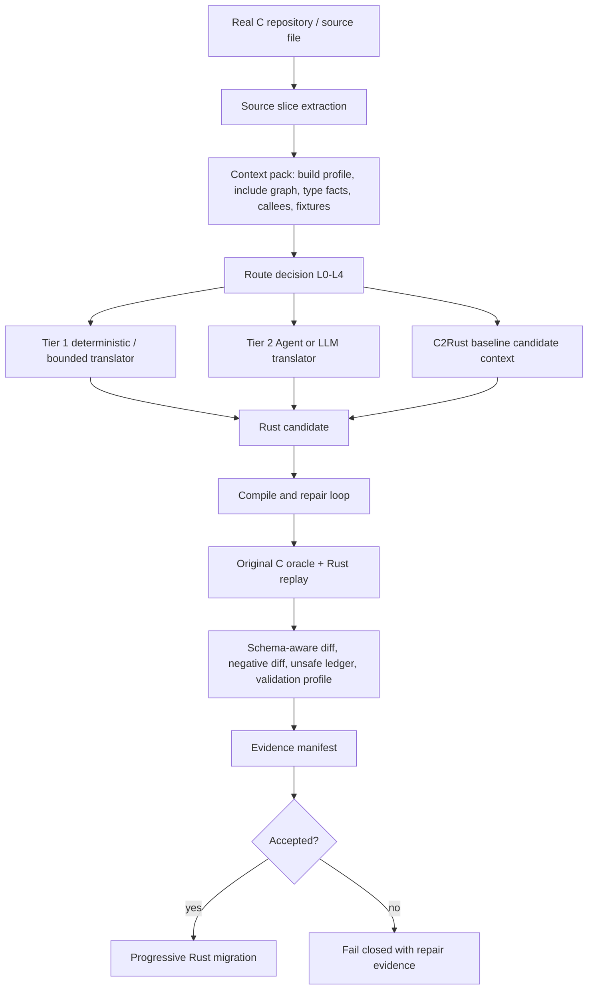

# CONTEXT.md

本文件用于把当前会话的关键上下文固化到仓库中。一个完全看不到聊天记录的新 Codex 会话，读取本文件和代码仓库后，应能准确理解当前项目状态，并直接继续工作。

## 1. 当前仓库与路径

- 当前应继续工作的本地路径：`F:\agent\crustpaper\0625ctr`
- GitHub 仓库：`https://github.com/guoqihan342-svg/c-to-rust`
- 当前分支：`codex/flashdb-rust-skeleton`
- 当前远端分支：`origin/codex/flashdb-rust-skeleton`
- 最近已推送提交：
  - `8dd4b4f8ed2867b1477e2582666c6fb78a7eebcc`
  - message: `Add typed IR continue and competition env profile`
- 注意：`C:\Users\Administrator\Documents\c-to-rust` 和 `C:\Users\Administrator\Documents\c-to-rust-flashdb` 是早期工作区路径，当前这轮 C2Rust pipeline 工作不要误切回那里继续开发，除非用户明确要求。
- C2Rust 参考源码路径：`F:\agent\c2rust-master`
  - 这是参考项目和潜在工具链来源。
  - 当前工作区没有确认可直接调用的 `c2rust` 可执行文件。

如果默认 Git HTTPS push 遇到 `Recv failure: Connection was reset`，此前可用的推送命令是：

```powershell
git -c http.version=HTTP/1.1 -c http.postBuffer=524288000 push origin codex/flashdb-rust-skeleton
```

## 2. 用户当前项目要求

项目目标是构建一个面向 Codex、OpenCode 或其他 Agent 调用的 C 到 Rust 渐进式迁移 Agent / pipeline。它不是只服务一个人工 demo，而是要逐步走向真实 C 项目的受限自动翻译与强验证。

当前明确要求：

- 复杂任务可以开多个智能体或并行子任务，但共享文件写入必须受控，不能互相覆盖。
- 项目不再要求“小而精”，可以适当扩大规模以补齐真实翻译能力。
- 不再把 10000 轮回归作为每次开发的阻塞条件。
- 日常当前先跑 10 轮、默认 10000 轮等固定轮数要求已经去掉。
- 回归轮数应作为 validation profile 或运行策略输入，而不是硬编码全局门禁。
- Rust first-party non-test `unsafe` 比例必须小于 10%。
- “最好为 0% unsafe”已从硬性要求中去掉，不能把 0% 当作验收条件。
- 实际只有一个 Agent/LLM 接口，不再区分廉价模型和强模型。
- C2Rust、LLM、手写规则都只能提供 candidate，不是 correctness source。
- 正确性以原始 C 行为和证据链为准。
- 真正的翻译证据必须来自真实 C 源文件自动抽取的 slice/context，不应把手写 `c_source` demo 当作真实迁移成果。
- 需要跨文件深度关联性上下文管理，在不破坏项目模块调用关系的前提下，实现单点渐进式重构。
- 编译/编译自愈需要双向闭环：根据 error stack 精确定位、自动打补丁、重新验证。
- 语义等价性要求非常高：业务逻辑不能被破坏，测试和 oracle 证据必须覆盖主干路径。
- 重构后的 FlashDB Rust 目录名目标仍可使用 `flashDB_rust`，但当前本分支重点已经从手写 FlashDB 重写转向“受限自动翻译器 + 强验证项目”。

一个重要边界：不要再恢复旧的 `flashdb-10000` 自动心跳或默认长跑监控。用户已经明确表示自动化消息让人困扰，并取消了 10000 轮作为日常阻塞条件。

## 3. 当前核心方案

当前采用的是治理优先的混合式 C 到 Rust 迁移 pipeline：



设计原则：

- C2Rust baseline 用于候选上下文、对照和 cross-check，不作为正确性证明。
- LLM/Agent 翻译可以作为兜底，但所有候选必须走统一验证门禁。
- Tree-sitter 或手写语法扫描只能提供 syntax indexing，不能直接证明类型、别名和 UB 语义。
- 真实 typed semantic facts 需要 compile profile、clang/libclang、原始 C oracle 或显式 unsupported/block 记录。
- C-side UB 和 Rust-side UB 证据要分开。MIRI 不是 C UB 证明。
- 不支持的情况必须 fail closed，不能假装翻译成功。

## 4. 已完成的主要实现


该 change 的任务已全部勾选完成，核心目标是把 C2Rust baseline、route decision 和 validation profile 纳入 L3 自动翻译证据链。

关键新增或修改：

- `validation/tools/auto_migrate.py`
  - 生成 C2Rust baseline manifest。
  - 生成 route decision。
  - 生成 validation profile。
  - 将这三类证据绑定到 auto manifest、L3 evidence manifest、final verification、cache metadata 和 generated artifacts。
  - cache identity 包含 `c2rust_baseline_identity`、`route_decision_identity`、`validation_profile_identity`。
  - route 为 L4 时 fail closed，写出 blocked repair evidence。
  - semantic pass 改为基于 `accepted`、Rust compile/check 和 validation profile 共同判定，不能绕过 profile。

- `validation/tools/validate_auto_translation_evidence.py`
  - 校验 C2Rust baseline manifest schema。
  - 校验 route decision schema。
  - 校验 validation profile schema。
  - 校验 auto manifest、L3 manifest、final verification、cache metadata 之间的引用一致性。
  - 校验 sha256、status consistency、route/profile consistency、cache identity fields。
  - semantic pass 要求 profile passed、没有 skipped gates、route 不是 L4，并且 C2Rust 仍保持 `candidate_context_only`。

- `validation/tools/extract_source_slice.py`
  - 用于从真实 C 源文件自动抽取函数 slice。
  - 真实源函数迁移必须先走这个工具或等价自动抽取路径。

- `validation/tools/test_extract_source_slice.py`
  - 覆盖真实源 slice 抽取行为。

- 新增 schema：
  - `validation/auto-translation-template/c2rust-baseline-manifest.schema.json`
  - `validation/auto-translation-template/route-decision.schema.json`
  - `validation/auto-translation-template/validation-profile.schema.json`

- 修改 schema：
  - `validation/l3-template/evidence-manifest.schema.json`
    - 已要求 L3 evidence manifest 包含 `c2rust_baseline`、`route_decision`、`validation_profile`。

- 文档更新：
  - `validation/README.md`
  - `validation/gates.md`

  - 已将 `unsafe` 要求改为 first-party non-test `<10%`，不再写 0% 硬性要求。

## 5. 当前真实证据状态

真实 FlashDB slice spec：

- `validation/slice-specs/flashdb-real-fdb-calc-crc32.json`

对应证据目录：

- `validation/evidence/flashdb/auto-translation/real-fdb-calc-crc32/`

此前运行命令：

```powershell
python validation/tools/auto_migrate.py --slice-spec validation/slice-specs/flashdb-real-fdb-calc-crc32.json --skip-c-oracle
python validation/tools/validate_auto_translation_evidence.py --target-id flashdb --slice-id real-fdb-calc-crc32 --slice-spec validation/slice-specs/flashdb-real-fdb-calc-crc32.json
```

当前结果必须如实理解：

- schema validation 通过。
- semantic pass 不成立。
- route decision 是 `L4`。
- route status 是 `refused`。
- `translator.kind` 是 `refuse`。
- `candidate_generation_allowed` 是 `false`。
- validation profile 是 `L4-dev`，status 是 `blocked`。
- C2Rust baseline manifest status 是 `skipped`，原因是本机当前没有可用的 `c2rust` 可执行工具链。
- C2Rust baseline 的 `correctness_role` 是 `candidate_context_only`。
- auto manifest status 是 `candidate_generated`，但 `semantic_pass=false`，并且没有 accepted evidence binding。

严禁误判：

- 不要声称 `real-fdb-calc-crc32` 已经完成语义接受。
- 不要声称当前工具已经能自动翻译真实 FlashDB 函数并通过 L3。
- 当前完成的是“证据合约、路线决策、C2Rust baseline 接入点、fail-closed 机制和验证器硬化”，不是完整真实函数迁移成功。

## 6. 最近验证结果

最近一次代码提交前完成的验证：

```powershell
python -m unittest validation.tools.test_extract_source_slice validation.tools.test_auto_migrate validation.tools.test_validate_auto_translation_evidence
```

结果：

```text
Ran 32 tests in 37.812s
OK
```


```powershell
```

结果：

```text
37 passed, 0 failed
```

空白和补丁检查：

```powershell
git diff --check
```

结果：通过。Windows 下曾出现 CRLF warning，但不是失败。

当前分支已推送到远端，推送后远端验证为：

```text
3d12e65c5599441e9886acb29c8ac40f196d7b22 refs/heads/codex/flashdb-rust-skeleton
```

## 7. 新会话接手后的第一组命令

建议新会话先运行：

```powershell
cd C:\Users\Administrator\Documents\c-to-rust-flashdb
git status --short --branch --untracked-files=all
git log -3 --oneline --decorate
python -m unittest validation.tools.test_extract_source_slice validation.tools.test_auto_migrate validation.tools.test_validate_auto_translation_evidence
python validation/tools/validate_auto_translation_evidence.py --target-id flashdb --slice-id real-fdb-calc-crc32 --slice-spec validation/slice-specs/flashdb-real-fdb-calc-crc32.json
```


## 8. 代码地图

核心 pipeline：

- `validation/tools/auto_migrate.py`
  - 自动迁移主入口。
  - 负责生成 candidate、manifest、route、profile、cache metadata 和最终证据。

- `validation/tools/validate_auto_translation_evidence.py`
  - 自动迁移证据校验器。
  - 是防止证据链退化的关键门禁。

- `validation/tools/extract_source_slice.py`
  - 从真实 C 源文件抽取函数 slice。
  - 后续真实函数迁移应优先扩展这里，而不是继续手写 `c_source` demo。

关键 schema：

- `validation/auto-translation-template/auto-translation-manifest.schema.json`
- `validation/auto-translation-template/c2rust-baseline-manifest.schema.json`
- `validation/auto-translation-template/route-decision.schema.json`
- `validation/auto-translation-template/validation-profile.schema.json`
- `validation/l3-template/evidence-manifest.schema.json`

关键 docs：

- `validation/README.md`
- `validation/gates.md`

## 9. 下一步建议

建议优先级如下：

1. 不要继续堆 demo 规则。先把真实源函数自动抽取、typed context 和 oracle harness 做实。
2. 安装或接入可用 C2Rust 工具链，让 baseline manifest 从 `skipped` 进入真实 `generated` 或明确 `blocked`。
3. 选一个比 `fdb_calc_crc32` 更小、更清晰的真实 FlashDB 函数，目标是跑出第一个真实 accepted L3 semantic pass。
4. 将当前 route 逻辑提前到 candidate generation 之前，避免“先生成再 backfill route”的时序不够干净。
5. 接入 clang/libclang 或等价 typed semantic fact provider，补足 tree-sitter/字符串扫描无法提供的类型、别名、宏和 include 事实。
6. 自动生成 C oracle harness 初稿和 Rust replay test 初稿。
7. 对 compile error stack 做结构化 repair hints，并将修复循环限制为 fail-closed。
8. 增加 fuzz/property profile，但不要恢复 10000 轮硬阻塞。
9. 如用户要求提交或发 PR，再基于当前分支创建 PR；当前不要擅自改变目标仓库或路径。

## 10. 与外部评价和论文对齐后的结论

用户接受过的关键判断：

- 之前的手写翻译规则和少量 demo 不能代表真实自动翻译能力。
- `flashDB_rust` 更接近手写 safe Rust 重写 + 差分验证成果，不能当作翻译器自动产出的证据。
- Corrode 的优点是能作为通用 C99 到 Rust 翻译器处理广度，即使输出不够 idiomatic 或 unsafe 偏多；当前项目需要吸收的是自动读取 C 文件、解析函数、生成候选和证据的 pipeline 能力。
- Rustine/SACTOR/Syzygy 等方案说明，“LLM/Agent 候选 + 强验证 + 修复闭环”比只靠手写规则更现实。
- 本项目差异化不应吹成“验证世界第一”或“翻译已规模化”，而应定位为：
  - Agent 编排友好。
  - 机器可读证据交接。
  - fail-closed。
  - 原始 C oracle 驱动的可审计渐进迁移。

## 11. 工作习惯与沟通注意

- 用户偏好中文状态、中文文档和清晰的路径说明。
- 用户反复强调“开多几个智能体干活”，但并行应只用于互不冲突的分析、测试、调研或独立文件任务。
- 用户不喜欢无意义等待和频繁自动消息。长跑监控不应主动恢复。
- 如果问“好了没有”，必须回答已验证状态、剩余缺口和下一步，不要把 partial pass 说成 done。
- 如果要提交或推送，必须先验证，并且只有实际完成 git action 后才能在最终答复里发 git directive。

## 12. 2026-06-26 最新接手状态

本轮继续推进了两个 fail-closed 证据硬化点：

1. L4/refused route 不再被记录为 `candidate_generated`。
   - `validation/tools/auto_migrate.py` 会把 L4/refused 自动迁移 run 的 auto manifest 标为 `candidate_refused`。
   - 对应 plan/events/replay 里的 Rust draft 状态为 `blocked` diagnostic，而不是 candidate evidence。
   - `validation/tools/validate_auto_translation_evidence.py` 会拒绝 L4/refused 下顶层或嵌套残留的 `candidate_generated` / `status: candidate` 证据。

2. 真实源码 slice 抽取开始记录同文件顶层全局对象依赖。
   - `validation/tools/extract_source_slice.py` 现在会从 masked function body 中识别同文件顶层对象引用。
   - 已加测试覆盖：真实引用会记录 global dependency；注释、字符串、参数同名 shadowing 和局部变量同名 shadowing 不会误报。
   - 局部同名 shadowing 现在按作用域 span 判断，不会因为内层 block 声明过同名局部变量，就漏掉 block 外对同文件全局对象的真实引用。
   - 复审后又修了一个 `:` 解析边界：三元表达式初始化（如 `value ? 1U : 2U`）不会被误当成 C label，从而不会漏记局部 shadow binding。
   - `validation/slice-specs/flashdb-real-fdb-calc-crc32.json` 已刷新，`c_boundary.direct_dependencies` 现在包含 `crc32_table`：
     - `kind: global`
     - `name: crc32_table`
     - `source: extracted_function_body_reference`
     - `definition_status: same_file_top_level_declared`
     - `source_span.file: src/fdb_utils.c`
     - `source_span.line_start: 21`
     - `source_span.line_end: 66`

真实 `real-fdb-calc-crc32` evidence 已用当前工具刷新，但状态仍必须如实理解：

- auto manifest status: `candidate_refused`
- route level/status: `L4` / `refused`
- validation profile: `L4-dev` / `blocked`
- semantic pass: `false`
- C2Rust baseline: `skipped`
- 不要声明该 slice 已 accepted L3，也不要声明当前工具已能自动翻译真实 FlashDB 函数通过语义门禁。
- 即使将来对 L4/refused 路线使用 `--accept-existing-evidence`，生成 draft 的 evidence status 也必须保持 `blocked`，不能被 promotion 路径重新写成 `candidate`。

本轮已验证过的命令：

```powershell
python -m unittest validation.tools.test_extract_source_slice validation.tools.test_auto_migrate validation.tools.test_validate_auto_translation_evidence
python validation/tools/validate_auto_translation_evidence.py --target-id flashdb --slice-id real-fdb-calc-crc32 --slice-spec validation/slice-specs/flashdb-real-fdb-calc-crc32.json
```

建议下一步优先级：

1. 继续把真实源 context 做实：把 `direct_dependencies` 中的 `global` 依赖喂给 context pack/type-map/oracle harness draft。
2. 针对 `crc32_table` 这类同文件全局 const 数据，生成明确的 harness/linkage requirement，而不是继续把 oracle harness 停留在占位 `puts()`。
3. 仍然不要恢复 10000 轮硬阻塞；验证轮数只作为 profile/run-policy 输入。

## 13. 2026-06-26 继续推进：global dependency 进入证据链

本轮把 `c_boundary.direct_dependencies` 里的同文件 global 依赖从“原始 metadata”提升为一等证据字段：

1. `validation/tools/auto_migrate.py`
   - 新增 `global_dependency_requirements(spec)`，统一从 slice spec 过滤 `kind=global` 依赖。
   - `context-pack` 现在写入：
     - `global_dependencies`
     - `source_boundary.globals`
   - `type-map` 现在写入 `global_dependencies`，不再让全局对象依赖在 type-map 中静默空白。
   - `pointer-graph.source_boundary.globals` 现在来自同一份 global dependency 列表。
   - C oracle status 现在写入 `global_linkage_requirements`。
   - C oracle harness draft 现在至少在注释中记录 `global dependency: <name>`，用于提醒后续真实 harness 必须把该全局对象纳入同一编译/链接边界。
   - cache metadata 增加 `global_dependency_identity`，并把它列入 `cache_input_fields`。

2. `validation/tools/validate_auto_translation_evidence.py`
   - 新增跨 artifact invariant：只要 slice spec 存在 `kind=global` 依赖，就要求 context-pack、type-map、oracle status、pointer source boundary、cache identity 和 harness draft 同步声明该依赖。
   - 已加负测：删除 type-map 的 `global_dependencies` 或删除 oracle status 的 `global_linkage_requirements` 时，schema-only validator 也必须失败。
   - 复审后继续加严：global dependency 不再只按 `name` 校验，还会校验完整 canonical object，包括 `source_span`、`sha256`、`definition_status`、`linkage_requirement` 和 `semantic_status`。
   - validator 现在也检查 `slice-contract.c_boundary.direct_dependencies`，防止 slice-contract 陈旧但其它 artifact 看似同步。
   - cache metadata 的 `global_dependency_identity.count/names/sha256` 会按 canonical global dependency 列表重算校验。
   - L4/refused 下的状态扫描扩展为拒绝 `candidate`、`candidate_generated`、`draft_generated` 和 `accepted_after_gates`，避免 refused route 混入候选或接受态 artifact。

3. `real-fdb-calc-crc32` 已刷新：
   - `crc32_table` 已出现在 `context-pack.global_dependencies`。
   - `crc32_table` 已出现在 `type-map.global_dependencies`。
   - `crc32_table` 已出现在 `pointer-graph.source_boundary.globals`。
   - `crc32_table` 已出现在 `c-oracle-status.global_linkage_requirements`。
   - harness draft 中已有 `global dependency: crc32_table` 注释。
   - cache metadata 中已有 `global_dependency_identity.names: ["crc32_table"]`。

状态仍然是 fail-closed：

- auto manifest status: `candidate_refused`
- route level/status: `L4` / `refused`
- validation profile: `L4-dev` / `blocked`
- semantic pass: `false`
- 不要把这次证据链补强解释成 accepted L3 或真实语义通过。

下一步建议：

1. 把 oracle harness 从注释要求推进到可编译初稿：包含真实函数 prototype、fixture 输入绑定、同文件 global/source linkage 说明和待编译命令。
2. 为 global dependency 增加更强 typed fact：数组维度、元素类型、const/extern/static/linkage 属性。
3. 继续保持 validator 的 fail-closed 风格：任何将来要 claim semantic pass 的路径，都必须证明 global dependency 被 oracle/replay/diff 一致覆盖。

## 14. 2026-06-26 路由内嵌证据引用和 cache identity 继续加固

本轮复核发现 real-fdb 的 `route_decision.source_artifacts.translation_plan.sha256`
曾经保留旧值，validator 只检查顶层 manifest/final/cache 引用时会漏过这种嵌套
artifact drift。已修复：

1. `validation/tools/validate_auto_translation_evidence.py`
   - 新增 `validate_route_source_artifact_refs()`。
   - 强校验 route 内的 `type_map`、`cfg`、`pointer_graph`、`c2rust_baseline`
     路径、状态和 sha。
   - 对 `translation_plan` 校验 path/status；如果 route 中出现 sha，则必须匹配
     当前 plan 文件，否则拒绝。
2. `validation/tools/auto_migrate.py`
   - 生成 route decision 时，`source_artifacts.translation_plan` 不再写 sha。
   - 原因是后续 `bind_route_decision_to_generated_artifacts()` 会把 route ref 反向写入
     plan；route 若同时绑定 plan 文件 hash，会形成不稳定的循环引用。
3. `validation/tools/test_validate_auto_translation_evidence.py`
   - 新增 route source artifact stale sha 负测。
   - `cache` identity drift 负测现在覆盖 `c2rust_baseline_identity`、
     `route_decision_identity`、`validation_profile_identity` 三类字段。
   - no-global 场景下也会拒绝残留的 `global_dependency_identity`。

当前 `real-fdb-calc-crc32` 已刷新，`route_decision.source_artifacts.translation_plan`
只保留 path/status，不再保留旧 sha。状态仍是 fail-closed：

- auto manifest status: `candidate_refused`
- route level/status: `L4` / `refused`
- validation profile: `L4-dev` / `blocked`
- semantic pass: `false`

本轮最终验证命令：

```powershell
python -m unittest validation.tools.test_extract_source_slice validation.tools.test_auto_migrate validation.tools.test_validate_auto_translation_evidence
python validation/tools/validate_auto_translation_evidence.py --target-id flashdb --slice-id real-fdb-calc-crc32 --slice-spec validation/slice-specs/flashdb-real-fdb-calc-crc32.json
git diff --check
```

## 15. 2026-06-26 C oracle harness draft 可审计化推进

本轮把 C oracle harness draft 从“只有占位 puts 和 global 注释”推进到更可审计的
draft，但仍然保持 fail-closed，不声明语义通过。

1. `validation/tools/auto_migrate.py`
   - `generate_oracle_harness_draft()` 现在从 slice spec 生成目标函数 prototype。
   - harness draft 现在写入：
     - draft-only 边界注释；
     - fixture input 路径；
     - source file/hash 绑定；
     - global dependency trace；
     - 目标函数 prototype；
     - TODO 占位，明确还没有 fixture value load 和 observable assertion。
   - `c-oracle-status.json` 新增：
     - `toolchain_status: DRAFT_NOT_EXECUTED`
     - `fixture_binding`
     - `harness_contract`
     - `compile_command_draft`
   - `status` 仍是 `SKIPPED_LOCAL_NO_C_TOOLCHAIN` 或 `DRAFT_GENERATED`，`semantic_pass` 仍是 `false`。
2. `validation/tools/validate_auto_translation_evidence.py`
   - 新增 `validate_oracle_harness_contract()`。
   - 当 slice spec 有 global dependency 时，强制 oracle status 提供 `harness_contract`。
   - 校验 function prototype、fixture binding、source file list、compile command draft 和
     `harness_contract.global_dependencies` 与 canonical global dependency 列表一致。
   - 新增 draft oracle fail-closed invariant：如果 C oracle 不是 `C_ORACLE_GENERATED`
     且 `semantic_pass=true`，则 final verification、evidence manifest、validation profile
     不得宣称 passed 或 semantic pass。
   - 为兼容旧无 global 的静态 demo evidence，`harness_contract` 只在存在 global dependency
     或 artifact 自己声明该 contract 时强制。
3. `real-fdb-calc-crc32` 已刷新：
   - `harness_contract.function_prototype` 为
     `uint32_t fdb_calc_crc32(uint32_t crc, const void *buf, size_t size);`
   - `fixture_binding.binding_status` 为 `missing_or_empty`。
   - `toolchain_status` 为 `DRAFT_NOT_EXECUTED`。
   - 没有写入 `C_ORACLE_GENERATED`、`semantic_pass=true` 或 `accepted_evidence_bound`。

本轮验证命令：

```powershell
python -m unittest validation.tools.test_extract_source_slice validation.tools.test_auto_migrate validation.tools.test_validate_auto_translation_evidence
python validation/tools/validate_auto_translation_evidence.py --target-id flashdb --slice-id real-fdb-calc-crc32 --slice-spec validation/slice-specs/flashdb-real-fdb-calc-crc32.json
rg -n '"toolchain_status"\s*:\s*"C_ORACLE_GENERATED"|"semantic_pass"\s*:\s*true|"status"\s*:\s*"accepted_evidence_bound"' validation/evidence/flashdb/auto-translation/real-fdb-calc-crc32
```

下一步建议：

1. 给 harness draft 增加 `harness_draft_ref` 或 `c_oracle_harness_identity`，并放进
   cache input fields，防止 harness 文件内容漂移但 status/cache 不失效。
2. 把 compile command 从 evidence-dir 相对 `-Iinc` 推进到 source-root 解析后的 include/source
   linkage plan。
3. 只有在 fixture cases、expected outputs、编译执行和 diff/negative/unsafe gates 都齐全时，
   才允许推进 `C_ORACLE_GENERATED`。

## 16. 2026-06-26 C oracle harness draft identity 纳入 cache

本轮把 harness draft 文件本身纳入证据身份，防止 C harness 文件内容变化但
`c-oracle-status.json` 和 cache metadata 不失效。

1. `validation/tools/auto_migrate.py`
   - `generate_oracle_harness_draft()` 写完 harness 文件后生成 `harness_draft_ref`。
   - `harness_draft_ref` 绑定：
     - `path`
     - `status: draft`
     - harness 文件内容 `sha256`
   - `CACHE_INPUT_FIELDS` 新增 `c_oracle_harness_identity`。
   - `cache_identity()` 新增 `c_oracle_harness_identity`，值来自 oracle status 的
     `harness_draft_ref`，只 hash harness 文件，不 hash 整个 oracle status，避免自引用或过宽失效。
   - `promote_accepted_oracle()` 保留 draft harness identity；accepted oracle 语义仍来自外部
     accepted evidence，不来自 draft harness。
2. `validation/tools/validate_auto_translation_evidence.py`
   - `validate_oracle_harness_contract()` 现在校验 `harness_draft_ref` 指向同一个 harness 文件，
     且 sha/status 匹配。
   - cache metadata 必须包含 `c_oracle_harness_identity`，并且该字段必须列在
     `cache_input_fields` 中。
   - cache 中的 `c_oracle_harness_identity` 必须完整等于 oracle status 的 `harness_draft_ref`。
   - draft/pass 判断改为以 `toolchain_status == C_ORACLE_GENERATED` 为准；仅伪造顶层
     `status: C_ORACLE_GENERATED` 不能越过 draft fail-closed 检查。
3. `validation/tools/test_auto_migrate.py`
   - 覆盖生成端 `harness_draft_ref` 和 cache identity 输出。
4. `validation/tools/test_validate_auto_translation_evidence.py`
   - 覆盖 harness draft ref sha 漂移。
   - 覆盖 cache oracle harness identity 漂移。
   - 覆盖顶层 oracle status 伪装通过但 `toolchain_status` 仍为 draft 的拒绝路径。

当前 `real-fdb-calc-crc32` 已刷新：

- `c-oracle-status.json` 有 `harness_draft_ref`。
- `auto-cache-metadata.json` 有 `c_oracle_harness_identity`，并列入 `cache_input_fields`。
- 状态仍是 fail-closed：`toolchain_status: DRAFT_NOT_EXECUTED`、`semantic_pass: false`、
  `candidate_refused`、`L4/refused`。

下一步建议：

1. 把 `compile_command_draft` 从 evidence-dir 相对 `-Iinc` 推进到 source-root 解析后的 include/source linkage plan。
2. 给 fixture cases 和 expected outputs 建立真实 oracle 输入输出绑定。
3. 只有在 C oracle 编译/执行和 diff/negative/unsafe gates 齐全时，才考虑推进 `C_ORACLE_GENERATED`。

## 17. 2026-06-26 C oracle compile draft source-root linkage

本轮把 `compile_command_draft` 从只包含 evidence-dir 相对 `-Iinc` 的弱 draft，推进为可由 validator
复算的 source-root include/source linkage plan。状态仍然 fail-closed，不声明 C oracle 已编译或语义通过。

1. `validation/tools/auto_migrate.py`
   - `c_oracle_compile_command()` 现在写入：
     - `source_root`
     - `defines`
     - `resolved_include_paths`
     - `link_source_files`
     - `link_strategy: compile_harness_with_declared_c_boundary_sources`
     - 精确 `argv`
   - include path 由 `source.source_root + build_profile.include_paths[]` 解析。
   - C source linkage 由 `source.source_root + c_boundary.files[]` 解析，并保留原始 path、role、sha256。
   - 已兼容 `c_boundary.files[].path` 已经带 source-root 前缀的历史样本，避免生成 `unit/unit/...`。
   - `build_profile.defines[]` 现在显式进入 `defines` 和 `argv` 的 `-D...`。
2. `validation/tools/validate_auto_translation_evidence.py`
   - `validate_oracle_harness_contract()` 不再只检查 argv 中有 harness 文件名。
   - 新增 `validate_compile_command_draft()`，按 slice spec 复算并强校验：
     - `working_directory`
     - `source_root`
     - `defines`
     - `resolved_include_paths`
     - `link_source_files`
     - `link_strategy`
     - 完整 `argv`
     - `status: draft_not_executed`
   - 额外 object、response-file、错误 include 或漏掉 source file 都会因 argv 不匹配而失败。
3. `validation/tools/test_auto_migrate.py`
   - `test_global_dependency_flows_into_context_type_map_and_oracle_requirements` 覆盖：
     - `source_root: unit`
     - `-DUNIT_TEST=1`
     - `-Iunit/inc`
     - `unit/global.c` source linkage
4. `validation/tools/test_validate_auto_translation_evidence.py`
   - 新增 include path drift 负测。
   - 新增 source linkage drift 负测。

当前 `real-fdb-calc-crc32` 已刷新：

- `compile_command_draft.resolved_include_paths` 为
  `C:/Users/Administrator/Documents/c-to-rust/sources/FlashDB/inc`。
- `compile_command_draft.link_source_files[0].resolved_path` 为
  `C:/Users/Administrator/Documents/c-to-rust/sources/FlashDB/src/fdb_utils.c`。
- `compile_command_draft.defines` 为空数组，符合当前 slice spec。
- 状态仍是 fail-closed：`toolchain_status: DRAFT_NOT_EXECUTED`、`semantic_pass: false`、
  `candidate_refused`、`L4/refused`。

本轮最终验证命令：

```powershell
python -m unittest validation.tools.test_extract_source_slice validation.tools.test_auto_migrate validation.tools.test_validate_auto_translation_evidence
python validation/tools/validate_auto_translation_evidence.py --target-id flashdb --slice-id real-fdb-calc-crc32 --slice-spec validation/slice-specs/flashdb-real-fdb-calc-crc32.json
rg -n '"toolchain_status"\s*:\s*"C_ORACLE_GENERATED"|"semantic_pass"\s*:\s*true|"status"\s*:\s*"accepted_evidence_bound"' validation/evidence/flashdb/auto-translation/real-fdb-calc-crc32
git diff --check
```

验证结果：

- 59 个 Python 单测通过。
- real-fdb validator 通过，且 `semantic_pass=false`。
- 禁止状态扫描无匹配。
- `git diff --check` 通过，仅有 Windows CRLF 提示。

下一步建议：

1. 给 fixture cases 和 expected outputs 建立真实 oracle 输入输出绑定。
2. 将 compile draft 推进到可实际执行的 C oracle 编译命令，但只有执行和输出 diff 证据齐全后才允许
   `C_ORACLE_GENERATED`。
3. 继续保持 validator fail-closed：任何新路径要 claim semantic pass，必须同时覆盖 C oracle、Rust replay、
   diff、negative diff、unsafe gates 和版本/config 绑定。

## 18. 2026-06-26 C oracle fixture case/output binding

本轮把 `fixture_contract.cases` 和 expected outputs 纳入 C oracle draft 的可审计绑定，但仍不执行
C oracle，也不声明语义通过。

1. `validation/tools/auto_migrate.py`
   - `oracle_fixture_binding()` 现在写入：
     - `observable_outputs`
     - `case_bindings`
     - `expected_output_status`
   - `case_bindings[]` 记录：
     - `id`
     - `input_ref`
     - `expected_ref`
     - `expected_outputs`
     - `observable_outputs`
     - `missing_observable_outputs`
     - `binding_status`
   - 支持两类 expected output 来源：
     - case 内联 `expected_outputs`
     - JSON fixture/expected 文件中的 `{ "cases": [...] }` 或顶层数组，并按 `cases[N]` 引用解析
   - 解析时只抽取 `observable_outputs` 指定字段，避免把 input-only 字段误标成 oracle output。
   - harness draft 新增审计注释：
     - `fixture cases: <N>`
     - `observable outputs: ...`
     - `fixture case: <id> input_ref=... expected_ref=... expected_outputs=...`
2. `validation/tools/validate_auto_translation_evidence.py`
   - 新增同构 fixture binding 复算逻辑。
   - `validate_oracle_harness_contract()` 现在强制：
     - `oracle.fixture_binding` 等于从 slice spec 复算的 binding
     - `harness_contract.fixture` 等于同一份 binding
     - harness draft 文本包含 fixture case/output 审计注释
   - 顶层 fixture binding 或 harness contract fixture 任一处 expected output 漂移都会失败。
3. `validation/tools/test_auto_migrate.py`
   - 新增 direct unit test：从临时 fixture JSON 的 `cases[1]` 提取 `value: 42`，并确认不会抽取
     `input_only` 字段。
   - 既有 global dependency 测试现在覆盖内联 expected output、harness 注释和
     `harness_contract.fixture == fixture_binding`。
4. `validation/tools/test_validate_auto_translation_evidence.py`
   - 新增顶层 `fixture_binding.case_bindings[].expected_outputs` 漂移负测。
   - 新增 `harness_contract.fixture.case_bindings[].expected_outputs` 漂移负测。

当前 `real-fdb-calc-crc32` 已刷新：

- `fixture_binding.case_bindings` 为空数组。
- `fixture_binding.expected_output_status` 为 `missing_or_empty`。
- harness draft 包含 `fixture cases: 0` 和 `observable outputs: return_code`。
- 状态仍是 fail-closed：`toolchain_status: DRAFT_NOT_EXECUTED`、`semantic_pass: false`、
  `candidate_refused`、`L4/refused`。

本轮最终验证命令：

```powershell
python -m unittest validation.tools.test_extract_source_slice validation.tools.test_auto_migrate validation.tools.test_validate_auto_translation_evidence
python validation/tools/validate_auto_translation_evidence.py --target-id flashdb --slice-id real-fdb-calc-crc32 --slice-spec validation/slice-specs/flashdb-real-fdb-calc-crc32.json
rg -n '"toolchain_status"\s*:\s*"C_ORACLE_GENERATED"|"semantic_pass"\s*:\s*true|"status"\s*:\s*"accepted_evidence_bound"' validation/evidence/flashdb/auto-translation/real-fdb-calc-crc32
git diff --check
```

验证结果：

- 62 个 Python 单测通过。
- real-fdb validator 通过，且 `semantic_pass=false`。
- 禁止状态扫描无匹配。
- `git diff --check` 通过，仅有 Windows CRLF 提示。

下一步建议：

1. 将 C oracle compile draft 推进到真实可执行的编译步骤，但先只记录 execution attempt/diagnostics，
   不直接提升 `C_ORACLE_GENERATED`。
2. 给 real-fdb 增加最小 fixture cases/expected outputs，或显式记录当前缺少 fixture cases 的阻塞原因。
3. 只有 C oracle 编译、执行、Rust replay、diff/negative/unsafe/version gates 全部通过后，才允许
   语义通过路径。

## 19. 2026-06-26 C oracle compile execution diagnostics

本轮把 C oracle compile draft 推进到可执行的编译尝试记录，但仍只作为诊断证据；
不会因为 C draft 编译成功就声明 `C_ORACLE_GENERATED` 或 `semantic_pass=true`。

1. `validation/tools/auto_migrate.py`
   - `generate_oracle_harness_draft()` 现在写入 `compile_execution`。
   - `c_oracle_compile_execution()` 支持：
     - `skipped_by_flag`
     - `missing_argv`
     - `compiler_not_found`
     - `compile_timeout`
     - `compile_failed`
     - `compile_succeeded_not_oracle`
   - 非 skip 路径会在 evidence dir 下执行 `compile_command_draft.argv`，记录 `compiler_path`、
     `returncode`、截断后的 `stdout/stderr` 和 diagnostics。
   - `compile_succeeded_not_oracle` 只表示 draft 编译命令可跑通，仍不是 C oracle 语义通过。
2. `validation/tools/validate_auto_translation_evidence.py`
   - `validate_compile_execution()` 强制校验：
     - `argv` 必须等于 `compile_command_draft.argv`
     - `working_directory` 必须等于 `compile_command_draft.working_directory`
     - `semantic_pass` 必须为 `false`
     - `status` 必须映射到唯一允许的 `toolchain_status_after_attempt`
     - `toolchain_status_after_attempt` 必须等于顶层 `toolchain_status`
   - 状态映射为：
     - `skipped_by_flag -> DRAFT_NOT_EXECUTED`
     - `missing_argv/compiler_not_found -> COMPILE_NOT_EXECUTED`
     - `compile_failed/compile_timeout -> COMPILE_FAILED`
     - `compile_succeeded_not_oracle -> COMPILE_SUCCEEDED_NOT_ORACLE`
   - 新增负向约束：`skipped_by_flag` 不能伪造 `C_ORACLE_GENERATED`。
   - `validate_draft_oracle_fail_closed()` 的 accepted early return 现在必须同时满足
     `status == C_ORACLE_GENERATED`、`toolchain_status == C_ORACLE_GENERATED` 和
     `semantic_pass is true`。
3. `validation/tools/test_auto_migrate.py`
   - 覆盖 skip 模式下的 `compile_execution` 输出结构。
4. `validation/tools/test_validate_auto_translation_evidence.py`
   - 覆盖 `compile_execution.argv` 漂移。
   - 覆盖 `skipped_by_flag` 伪造 generated toolchain 的拒绝路径。
   - 覆盖顶层 `toolchain_status`/`semantic_pass` 伪造但 oracle `status` 仍非 generated 的拒绝路径。
5. 并行审查结论
   - 子智能体读到的主要风险是：`compile_execution` 不能成为 `C_ORACLE_GENERATED` 的旁路。
   - 已按该风险加了 status/toolchain 硬映射和负向测试。

当前 `real-fdb-calc-crc32` 已刷新：

- `compile_execution.status` 为 `skipped_by_flag`。
- `compile_execution.attempted` 为 `false`。
- `compile_execution.toolchain_status_after_attempt` 为 `DRAFT_NOT_EXECUTED`。
- 顶层状态仍是 fail-closed：`toolchain_status: DRAFT_NOT_EXECUTED`、`semantic_pass: false`。
- 禁止状态扫描没有发现 `C_ORACLE_GENERATED`、`semantic_pass: true` 或
  `accepted_evidence_bound`。

本轮最终验证命令：

```powershell
python -m unittest validation.tools.test_extract_source_slice validation.tools.test_auto_migrate validation.tools.test_validate_auto_translation_evidence
python validation/tools/validate_auto_translation_evidence.py --target-id flashdb --slice-id real-fdb-calc-crc32 --slice-spec validation/slice-specs/flashdb-real-fdb-calc-crc32.json
rg -n '"toolchain_status"\s*:\s*"C_ORACLE_GENERATED"|"semantic_pass"\s*:\s*true|"status"\s*:\s*"accepted_evidence_bound"' validation/evidence/flashdb/auto-translation/real-fdb-calc-crc32
git diff --check
```

验证结果：

- 65 个 Python 单测通过。
- real-fdb validator 通过，且 `semantic_pass=false`。
- 禁止状态扫描无匹配。
- `git diff --check` 通过，仅有 Windows CRLF 提示。

下一步建议：

1. 对 real-fdb 跑一次非 `--skip-c-oracle` 的 compile attempt，保留真实编译器/缺编译器诊断。
2. 给 real-fdb 增加最小 fixture cases/expected outputs，解除当前 `missing_or_empty` 状态。
3. 在 C oracle 编译诊断稳定后，再推进执行、Rust replay、diff/negative/unsafe/version gates；
   只有这些证据齐全时才允许进入 `C_ORACLE_GENERATED` 路径。

## 20. 2026-06-26 real-fdb compile diagnostics and minimal fixture binding

本轮沿第 19 节的下一步继续推进两件事：

1. 对 `real-fdb-calc-crc32` 跑了一次非 `--skip-c-oracle` 的 auto migrate。
2. 给 `real-fdb-calc-crc32` 补了一个最小 fixture case，并刷新 evidence 绑定。

### 非 skip compile attempt

运行命令：

```powershell
python validation/tools/auto_migrate.py --slice-spec validation/slice-specs/flashdb-real-fdb-calc-crc32.json
```

当前 Windows 环境没有 `cc`：

```powershell
where.exe cc
cc --version
```

两者都确认 `cc` 不在 PATH。FlashDB 源路径本身存在：

- `C:\Users\Administrator\Documents\c-to-rust\sources\FlashDB\src\fdb_utils.c`
- `C:\Users\Administrator\Documents\c-to-rust\sources\FlashDB\inc`

刷新后的 `c-oracle-status.json` 记录为：

- `compile_execution.status: compiler_not_found`
- `compile_execution.attempted: false`
- `compile_execution.diagnostics: ["C compiler not found on PATH: cc"]`
- `compile_execution.toolchain_status_after_attempt: COMPILE_NOT_EXECUTED`
- 顶层 `status: DRAFT_GENERATED`
- 顶层 `toolchain_status: COMPILE_NOT_EXECUTED`
- 顶层 `semantic_pass: false`

这仍然是 fail-closed 诊断证据，不是 C oracle 通过证据。

### 最小 fixture case

新增文件：

- `validation/l2_slices/fixtures/real-fdb-calc-crc32.json`

新增的 case：

- `id: empty-crc-zero`
- `crc: 0`
- `buf: []`
- `size: 0`
- `return_code: 0`
- `coverage_kind: empty_buffer_identity`

选择这个 case 的原因：`size=0` 时 `fdb_calc_crc32()` 不解引用 `buf`，也不会读取 `crc32_table`；
函数返回输入 `crc`，所以 `crc=0` 的 expected `return_code=0` 是一个最小可审计边界 case。

`validation/slice-specs/flashdb-real-fdb-calc-crc32.json` 现在在 `fixture_contract.cases[]`
引用该 fixture：

- `input_ref: cases[0]`
- `expected_ref: validation/l2_slices/fixtures/real-fdb-calc-crc32.json`

刷新后的绑定状态：

- `fixture_binding.case_count: 1`
- `fixture_binding.binding_status: declared_not_executed`
- `fixture_binding.expected_output_status: declared_not_executed`
- `fixture_binding.case_bindings[0].expected_outputs: {"return_code": 0}`
- `fixture_binding.case_bindings[0].missing_observable_outputs: []`

harness draft 也已刷新，包含：

```c
/* fixture cases: 1 */
/* observable outputs: return_code */
/* fixture case: empty-crc-zero input_ref=cases[0] expected_ref=validation/l2_slices/fixtures/real-fdb-calc-crc32.json expected_outputs={"return_code": 0} */
```

### 并行审查结论

本轮两个 explorer 子智能体均为只读：

- compile diagnostics explorer 确认非 skip auto migrate 会重写整包 evidence；当前因 `cc` 不在 PATH，
  只记录 `compiler_not_found`，不会进入 subprocess，也不会提升 `C_ORACLE_GENERATED`。
- fixture binding explorer 确认：case payload 应放 fixture JSON，binding metadata 应放 slice spec；
  validator 只从 `observable_outputs` 中抽取 expected output 字段，因此 `crc/buf/size/status`
  不会被误当成 oracle output。

### 本轮最终验证命令

```powershell
python -m unittest validation.tools.test_extract_source_slice validation.tools.test_auto_migrate validation.tools.test_validate_auto_translation_evidence
python validation/tools/validate_auto_translation_evidence.py --target-id flashdb --slice-id real-fdb-calc-crc32 --slice-spec validation/slice-specs/flashdb-real-fdb-calc-crc32.json
rg -n '"toolchain_status"\s*:\s*"C_ORACLE_GENERATED"|"semantic_pass"\s*:\s*true|"status"\s*:\s*"accepted_evidence_bound"' validation/evidence/flashdb/auto-translation/real-fdb-calc-crc32 validation/l2_slices/fixtures/real-fdb-calc-crc32.json validation/slice-specs/flashdb-real-fdb-calc-crc32.json
git diff --check
```

验证结果：

- 65 个 Python 单测通过。
- real-fdb validator 通过，且 `semantic_pass=false`。
- 禁止状态扫描无匹配。
- `git diff --check` 通过，仅有 Windows CRLF 提示。

下一步建议：

1. 先修一个小的 manifest fixture path 漂移点：顶层 summary 仍从 `fixture_contract.input`
   取值，导致当前 summary 的 `fixture.path` 可能为 `null`；应改为优先 `fixture_contract.path`。
2. 在有 `cc`/clang/gcc 的环境下复跑非 skip compile attempt，记录真实 `compile_failed`
   或 `compile_succeeded_not_oracle`。
3. 之后再推进真实 C harness fixture 加载、函数调用、输出比较、Rust replay 和 diff gates；
   在这些门全部通过之前仍不能进入 `C_ORACLE_GENERATED`。

## 21. 2026-06-26 fixture path fallback consistency

本轮修复了第 20 节发现的 `fixture.path` 漂移：部分输出只读取
`fixture_contract.input`，而 `real-fdb-calc-crc32` 使用的是 `fixture_contract.path`。

### 根因

`validation/tools/auto_migrate.py` 中旧逻辑有两处未统一使用 `fixture_path(spec)`：

1. `emit_manifest()` 顶层 `payload["fixture"]["path"]` 直接读
   `spec.get("fixture_contract", {}).get("input")`。
2. `generate_rust_replay_test_draft()` 的 Rust draft 文本里直接读
   `fixture.get("input", "")`，导致 path-only spec 生成 `let _fixture = '';`。

`write_context_pack()`、L3 evidence manifest、C oracle harness draft 和 replay JSON payload 的多数位置
已经能使用 `path or input`，但上述两处仍有漂移。

### TDD 过程

在 `validation/tools/test_auto_migrate.py` 的
`test_route_baseline_and_validation_profile_evidence_are_emitted` 中把测试 spec 改为只含
`fixture_contract.path`，不含 `input`，并新增两个断言：

- `manifest["fixture"]["path"] == "unit-test-fixture.json"`
- Rust replay draft 包含 `let _fixture = 'unit-test-fixture.json';`

红测结果：

```powershell
python -m unittest validation.tools.test_auto_migrate.AutoMigrateTests.test_route_baseline_and_validation_profile_evidence_are_emitted
```

先失败于：

- `manifest["fixture"]["path"]` 为 `None`
- 修第一处后，又失败于 replay draft 仍为 `let _fixture = '';`

### 实现

`validation/tools/auto_migrate.py` 现在统一使用 `fixture_path(spec)`：

- `emit_manifest().fixture.path`
- `emit_manifest().fixture.hash` 同步改用 `fixture_hash(spec)`
- `generate_rust_replay_test_draft()` 的 draft 文本 `let _fixture = ...`
- `generate_rust_replay_test_draft()` 的 `source_test_inputs.fixtures[].path`
- `generate_rust_replay_test_draft()` 的 `translation_mappings[].source`

### real-fdb 刷新状态

已重跑：

```powershell
python validation/tools/auto_migrate.py --slice-spec validation/slice-specs/flashdb-real-fdb-calc-crc32.json
```

当前 real-fdb evidence：

- auto-translation manifest 顶层 `fixture.path` 为
  `validation/l2_slices/fixtures/real-fdb-calc-crc32.json`。
- Rust replay draft 为：

```rust
let _fixture = 'validation/l2_slices/fixtures/real-fdb-calc-crc32.json';
```

- `test-translation-generated.json` 中：
  - `source_test_inputs.fixtures[0].path` 为实际 fixture 路径。
  - `translation_mappings[0].source` 为实际 fixture 路径。
- `compile_execution.status` 仍为 `compiler_not_found`。
- 顶层 `toolchain_status` 仍为 `COMPILE_NOT_EXECUTED`。
- `semantic_pass` 仍为 `false`。

### 并行审查结论

本轮两个 explorer 子智能体均为只读：

- manifest/replay explorer 找到剩余漂移点：Rust replay draft 的 `let _fixture = ''`。
- validator/evidence explorer 确认当前 validator 不读取 summary 内容；本轮只需修生成端并刷新 evidence，
  不需要立即新增 summary fixture validator 约束。

### 本轮最终验证命令

```powershell
python -m unittest validation.tools.test_auto_migrate.AutoMigrateTests.test_route_baseline_and_validation_profile_evidence_are_emitted
python -m unittest validation.tools.test_extract_source_slice validation.tools.test_auto_migrate validation.tools.test_validate_auto_translation_evidence
python validation/tools/validate_auto_translation_evidence.py --target-id flashdb --slice-id real-fdb-calc-crc32 --slice-spec validation/slice-specs/flashdb-real-fdb-calc-crc32.json
rg -n '"path"\s*:\s*null|let _fixture = ''''|"toolchain_status"\s*:\s*"C_ORACLE_GENERATED"|"semantic_pass"\s*:\s*true|"status"\s*:\s*"accepted_evidence_bound"' validation/evidence/flashdb/auto-translation/real-fdb-calc-crc32 validation/l2_slices/fixtures/real-fdb-calc-crc32.json validation/slice-specs/flashdb-real-fdb-calc-crc32.json
git diff --check
```

验证结果：

- 目标红测已转绿。
- 65 个 Python 单测通过。
- real-fdb validator 通过，且 `semantic_pass=false`。
- 空 fixture path / 空 replay fixture / 禁止状态扫描无匹配。
- `git diff --check` 通过，仅有 Windows CRLF 提示。

下一步建议：

1. 在生成端补一个更明确的 summary provenance 字段，或确认 summary 继续保持极简状态；
   如果新增 summary fixture 字段，先加 validator 约束。
2. 继续推进真实 C harness：从只写 fixture 路径变为加载 `real-fdb-calc-crc32.json`、
   调用 `fdb_calc_crc32()`，并比较 `return_code`。
3. 在有 C 编译器环境下复跑 compile attempt，进入 `compile_failed` 或
   `compile_succeeded_not_oracle` 诊断，再推进执行/diff gates。
