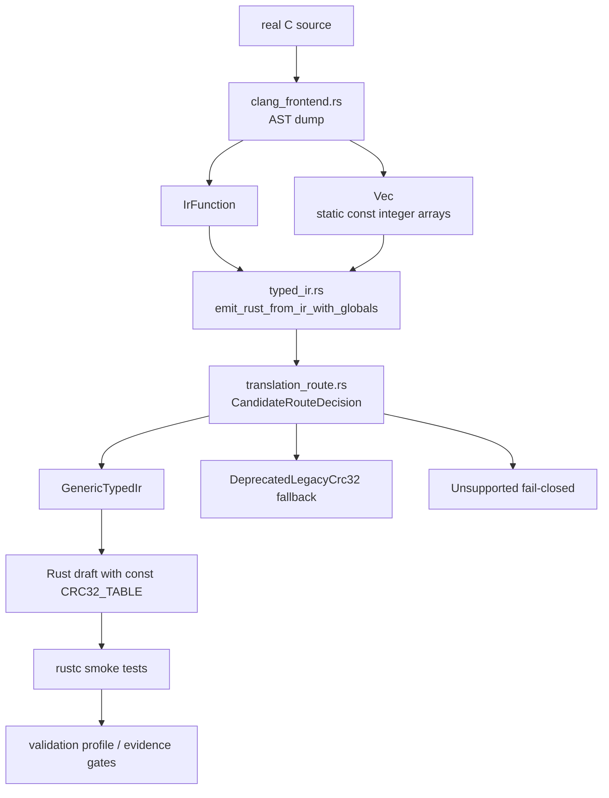
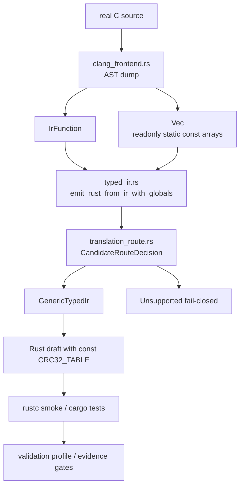

## 65. 2026-06-26 generated-candidate diff diagnostic gate

本轮承接第 64 节：real-fdb `fdb_calc_crc32` 已能经真实 clang-lowered typed IR 生成 Rust draft、type-map、cfg、pointer graph，并且 generated Rust replay 可通过 fixture；当前 blocker 是 C oracle 仍是 `DRAFT_GENERATED`、`output_gate.status=matched_not_oracle`，不能提升为 accepted semantic pass。

核心改动：
- `validation/tools/auto_migrate.py`
  - 新增 `c_oracle_output_gate_from_oracle()` / `c_oracle_output_gate_status()`。
  - 新增 `generated_candidate_diff_from_diagnostics()`，只在以下条件全部满足时返回诊断性 candidate diff：
    `oracle.status=DRAFT_GENERATED`、`toolchain_status=COMPILE_SUCCEEDED_NOT_ORACLE`、`compile_execution.status=compile_succeeded_not_oracle`、`harness_execution.status=exited_zero_not_oracle`、`output_gate.status=matched_not_oracle`、generated Rust replay `status=passed` 且 `generated_draft_semantic_pass` 不是 true。
  - `write_l3_candidate_supporting_evidence()` 在上述条件满足时，仍保持 `l3-*-diff.json` 顶层 `status=incomplete`、`semantic_pass=false`、`accepted_diff_required=true`，但新增 `generated_candidate_diff_pass=true`、`blocked_by=["accepted_c_oracle"]`、`candidate_diff.status=matched_not_oracle`、`candidate_diff.semantic_pass=false`、`candidate_diff.matched_stdout_fragments` 和 `reason_code=candidate_matched_accepted_oracle_required`。
- `validation/test-translation-template/test-translation.schema.json`
  - 允许 generated replay 执行后的 `status=passed|failed`。
  - 允许 `translation_mappings[].status=passed|failed`。
- `validation/tools/validate_auto_translation_evidence.py`
  - 普通 validator 增加 `validate_generated_candidate_diff_boundary()`。
  - 允许非语义 candidate diff 使用 `blocked_by=["accepted_c_oracle"]`。
  - candidate diff 必须和同目录真实 `l3-*-c-oracle-status.json` / `l3-*-rust-report.json` 交叉一致；不能只靠 diff 文件自证。
  - 继续拒绝 `candidate_diff.semantic_pass=true`，`--require-semantic-pass` 路径未放宽。
- `validation/tools/test_auto_migrate.py`
  - 新增候选 diff 正例：C output gate matched + generated replay passed 时写入 `candidate_diff`，但不声明 semantic pass。
  - 新增 fail-closed 负例：`mismatch_not_oracle` 不会生成 candidate diff。
  - real-fdb generated replay 测试增加普通 validator 断言。
- `validation/tools/test_validate_auto_translation_evidence.py`
  - 新增 validator helper 边界测试：candidate diff 不能声明 `semantic_pass=true`。
  - 新增跨文件负例：真实 oracle output gate 漂移为 `mismatch_not_oracle` 时，普通 validator 拒绝仍标记 `generated_candidate_diff_pass=true` 的 diff。

已验证命令：
```powershell
python -B -m unittest validation.tools.test_auto_migrate.AutoMigrateTests.test_harness_output_gate_matches_fixture_stdout_without_oracle_claim validation.tools.test_auto_migrate.AutoMigrateTests.test_harness_output_gate_uses_raw_stdout_before_report_truncation validation.tools.test_auto_migrate.AutoMigrateTests.test_generated_candidate_diff_records_matched_diagnostic_without_semantic_claim validation.tools.test_auto_migrate.AutoMigrateTests.test_generated_candidate_diff_requires_matched_oracle_output_gate validation.tools.test_auto_migrate.AutoMigrateTests.test_route_baseline_and_validation_profile_evidence_are_emitted
python -B -m unittest validation.tools.test_auto_migrate.AutoMigrateTests.test_real_fdb_calc_crc32_generated_replay_executes_candidate_fixture
python -B -m unittest validation.tools.test_validate_auto_translation_evidence.ValidateAutoTranslationEvidenceTests.test_generated_candidate_diff_boundary_remains_non_semantic validation.tools.test_validate_auto_translation_evidence.ValidateAutoTranslationEvidenceTests.test_schema_diff_contract_rejects_candidate_diff_when_oracle_output_gate_drifts
python -B validation/tools/auto_migrate.py --slice-spec validation/slice-specs/flashdb-real-fdb-calc-crc32.json --out-root <temp> --emit-clang-lowering-report
python -B validation/tools/validate_auto_translation_evidence.py --target-id flashdb --slice-id real-fdb-calc-crc32 --slice-spec validation/slice-specs/flashdb-real-fdb-calc-crc32.json --evidence-root <temp>
python -B validation/tools/validate_auto_translation_evidence.py --target-id flashdb --slice-id real-fdb-calc-crc32 --slice-spec validation/slice-specs/flashdb-real-fdb-calc-crc32.json --evidence-root <temp> --require-semantic-pass
```

验证结果：
- focused auto-migrate 5 tests：`Ran 5 tests ... OK`。
- real-fdb generated replay + normal validator：`Ran 1 test ... OK`。
- validator helper/cross-file boundary：`Ran 2 tests ... OK`。
- 临时 real-fdb 真实 C harness 路径：
  - C harness 经 WSL `/usr/bin/cc` 编译成功，执行 stdout marker 全匹配。
  - generated Rust replay `status=passed`。
  - `l3-real-fdb-calc-crc32-diff.json` 顶层仍是 `status=incomplete`、`semantic_pass=false`。
  - `candidate_diff.status=matched_not_oracle`、`generated_candidate_diff_pass=true`。
  - 普通 validator：`schema_status=passed`、`semantic_pass=false`。
  - `--require-semantic-pass` 仍失败，原因是 manifest/final/profile 没有 accepted semantic pass。

当前核心翻译功能状态：
- real-fdb `fdb_calc_crc32` 已具备“真实 clang-lowered typed IR -> 可编译 Rust draft -> generated replay fixture passed -> C harness output matched -> candidate diff diagnostic recorded”的非语义闭环。
- `generated_draft_semantic_pass=false` 仍是正确状态。
- 下一步不要直接把 candidate diff 改成 semantic pass；应继续做 accepted oracle/diff/negative-diff 的正式绑定，或把 validation profile 的 candidate gate 单独建模为 diagnostic gate。

## 66. 2026-06-26 scalar typed IR recursive emitter

本轮承接第 65 节和 phase1b emitter 方案讨论：先不动 CLI、Python validation、oracle/diff 证据和 CRC32 特例删除，只打通一个保守的“clang-lowered typed IR -> 标量递归 emitter -> 可编译 Rust”切片。

核心改动：
- `crates/c2r-translator/src/typed_ir.rs`
  - `emit_rust_from_ir()` 仍优先命中严格的 `is_crc32_byte_cursor_ir()`，保持现有 CRC32 安全模板输出。
  - 未命中 CRC32 时进入新的私有 `emit_scalar_rust_from_ir()`。
  - 标量 emitter 当前只支持整数和 void return；pointer、array、record、function、unsupported type 全部 fail-closed。
  - 支持 `Return`、`Decl`、`Assign`、`Expr` 的最小递归输出；`If`、`While` 仍 fail-closed。
  - 支持 `Var`、整数 literal、`Add`、`BitAnd`、`BitXor`、`Shr`、`BitNot`、整数到整数 `Cast`。
  - `Return`、`Assign`、`Decl init` 和二元表达式会做保守类型一致性校验；不确定时 fail-closed，而不是输出可能不可编译的 Rust。
  - `BitNot` 也校验 operand/result 类型一致；非 void 函数必须以 `Return(Some(_))` 结束；无初始化 scalar `Decl` 先 fail-closed；Rust 关键字、单独 `_` 或非法标识符先 fail-closed。
  - 表达式读取和赋值目标必须来自参数或已初始化 local decl；integer literal 会按目标整数类型做范围检查。
  - `Deref`、`Index`、`IncDec`、`Call`、`AddrOf` 和未列入的 binop/unop 均 fail-closed。
  - 会扫描赋值目标；如果参数被赋值，函数签名输出 `mut param`，避免生成不可编译 Rust。
- `crates/c2r-translator/tests/bounded_translation.rs`
  - 新增 `typed_ir_emits_add_one_from_clang_lowered_ir`：从 `ClangFunctionSkeleton` lower 出 `add_one` 的 `IrFunction`，再经 public `emit_rust_from_ir()` 输出 `pub fn add_one(value: i32) -> i32` 和 `return (value + 1i32);`。
  - 新增直接 typed IR 覆盖：参数赋值变 `mut`、声明初始化加整数 cast、指针参数必须 fail-closed、二元表达式操作数类型不匹配必须 fail-closed、return/assign/decl-init 类型不匹配必须 fail-closed、bitnot operand 类型不匹配必须 fail-closed、非 void 缺 return 必须 fail-closed、无初始化 decl 必须 fail-closed、Rust 关键字和 `_` 标识符必须 fail-closed、未声明变量读写必须 fail-closed、integer literal 越界必须 fail-closed。
  - 对 add_one、CRC32 模板、参数赋值、声明/cast 正向输出增加 `rustc --crate-type lib` smoke，证明这些 snippets 至少可被 Rust 编译器接受。

已验证命令：
```powershell
cargo test --manifest-path crates/c2r-translator/Cargo.toml --features typed-ir,clang-frontend --test bounded_translation typed_ir_emits_add_one_from_clang_lowered_ir -- --nocapture
cargo test --manifest-path crates/c2r-translator/Cargo.toml --features typed-ir,clang-frontend --test bounded_translation typed_ir_emits_flashdb_crc32_without_string_recognizer -- --nocapture
cargo test --manifest-path crates/c2r-translator/Cargo.toml --features typed-ir,clang-frontend --test bounded_translation typed_ir_rejects_crc32_loop_with_extra_top_level_term -- --nocapture
cargo test --manifest-path crates/c2r-translator/Cargo.toml --features typed-ir,clang-frontend --test bounded_translation clang_lowering_skeleton_builds_typed_ir_for_add_one_fixture -- --nocapture
cargo test --manifest-path crates/c2r-translator/Cargo.toml --features typed-ir,clang-frontend --test bounded_translation typed_ir_emits_scalar_assignment_to_mut_param -- --nocapture
cargo test --manifest-path crates/c2r-translator/Cargo.toml --features typed-ir,clang-frontend --test bounded_translation typed_ir_emits_scalar_decl_init_and_integer_cast -- --nocapture
cargo test --manifest-path crates/c2r-translator/Cargo.toml --features typed-ir,clang-frontend --test bounded_translation typed_ir_rejects_pointer_param_in_generic_emitter -- --nocapture
cargo test --manifest-path crates/c2r-translator/Cargo.toml --features typed-ir,clang-frontend --test bounded_translation typed_ir_rejects_mismatched_binary_operand_types_in_generic_emitter -- --nocapture
cargo test --manifest-path crates/c2r-translator/Cargo.toml --features typed-ir,clang-frontend --test bounded_translation typed_ir_rejects_return_type_mismatch_in_generic_emitter -- --nocapture
cargo test --manifest-path crates/c2r-translator/Cargo.toml --features typed-ir,clang-frontend --test bounded_translation typed_ir_rejects_assign_type_mismatch_in_generic_emitter -- --nocapture
cargo test --manifest-path crates/c2r-translator/Cargo.toml --features typed-ir,clang-frontend --test bounded_translation typed_ir_rejects_decl_init_type_mismatch_in_generic_emitter -- --nocapture
cargo test --manifest-path crates/c2r-translator/Cargo.toml --features typed-ir,clang-frontend --test bounded_translation typed_ir_rejects_bitnot_operand_type_mismatch_in_generic_emitter -- --nocapture
cargo test --manifest-path crates/c2r-translator/Cargo.toml --features typed-ir,clang-frontend --test bounded_translation typed_ir_rejects_non_void_function_without_return_value_in_generic_emitter -- --nocapture
cargo test --manifest-path crates/c2r-translator/Cargo.toml --features typed-ir,clang-frontend --test bounded_translation typed_ir_rejects_uninitialized_decl_in_generic_emitter -- --nocapture
cargo test --manifest-path crates/c2r-translator/Cargo.toml --features typed-ir,clang-frontend --test bounded_translation typed_ir_rejects_rust_keyword_identifier_in_generic_emitter -- --nocapture
cargo test --manifest-path crates/c2r-translator/Cargo.toml --features typed-ir,clang-frontend --test bounded_translation typed_ir_rejects_underscore_identifier_in_generic_emitter -- --nocapture
cargo test --manifest-path crates/c2r-translator/Cargo.toml --features typed-ir,clang-frontend --test bounded_translation typed_ir_rejects_undeclared_var_in_generic_emitter -- --nocapture
cargo test --manifest-path crates/c2r-translator/Cargo.toml --features typed-ir,clang-frontend --test bounded_translation typed_ir_rejects_assign_to_undeclared_var_in_generic_emitter -- --nocapture
cargo test --manifest-path crates/c2r-translator/Cargo.toml --features typed-ir,clang-frontend --test bounded_translation typed_ir_rejects_out_of_range_integer_literal_in_generic_emitter -- --nocapture
cargo fmt --manifest-path crates/c2r-translator/Cargo.toml
cargo test --manifest-path crates/c2r-translator/Cargo.toml --features typed-ir,clang-frontend --test bounded_translation
cargo test --manifest-path crates/c2r-translator/Cargo.toml --features typed-ir,clang-frontend
```

验证结果：
- focused add_one 红绿：最初失败于 `add_one is outside the current typed IR emitter subset`；实现后 `1 passed`。
- CRC32 旧模板回归：`typed_ir_emits_flashdb_crc32_without_string_recognizer` 通过，仍包含 `crc32_update_byte`，不回退到 `crc32_table`。
- CRC32 fail-closed 回归：`typed_ir_rejects_crc32_loop_with_extra_top_level_term` 通过。
- 新增标量边界测试均通过；其中二元类型不匹配负例先红于 `return (x & 255i32);`，return 类型不匹配负例先红于 `return 1i32;`，收紧后通过。
- `BitNot` operand/result 类型不匹配负例先红于 `return !x;`，非 void 缺 return 负例先红于 `pub fn missing_return() -> i32 { 1i32; }`，收紧后通过。
- 未声明变量和 integer literal 越界负例分别先红于 `return x;` 和 `return 256u8;`，收紧后通过。
- `bounded_translation`：`103 passed`。
- translator crate with `typed-ir,clang-frontend`：lib `3 passed`，`bounded_translation` `103 passed`，doc tests `0`。

当前核心翻译功能状态：
- 现在已经有一条非 CRC32 特例的最小通路：`clang skeleton lowering -> typed IR -> scalar recursive emitter -> Rust`。
- real-fdb CRC32 路径仍由严格 matcher 和安全模板保护；本轮没有把 pointer/loop/call/index 语义交给通用 emitter。
- 下一步可以继续把 phase1b emitter 扩到小型结构化 IR：先加真实红灯测试，再逐步引入 `If`/`While`、更完整的整数算术语义、以及与 clang-lowered report 的可审计接线；不要一次性放开 pointer/deref/index/call。

## 67. 2026-06-26 scalar typed IR while emitter

本轮承接第 66 节：继续 phase1b emitter，但仍不碰 CLI、Python validation、oracle/diff evidence，也不放开 pointer/deref/index/call。两个只读子智能体结论一致：`While` 比 `If` 更适合作为下一刀，因为 clang skeleton 和 real AST lowering 已经能产出 `IrStmt::While`，而 `If` 在 clang skeleton 层还不存在。

核心改动：
- `crates/c2r-translator/src/typed_ir.rs`
  - 在 scalar emitter 中新增 `IrStmt::While` 输出。
  - 条件只支持当前 scalar integer truthiness，输出成 Rust bool：`while <expr> != 0suffix { ... }`。
  - 条件表达式仍复用 `emit_expr()`，所以 `Call`、`Index`、`Deref`、`AddrOf`、`IncDec` 等继续 fail-closed。
  - while body 递归复用现有 statement emitter；body symbol set 使用外层 clone，允许写外层参数/local，但不让 while body 内声明泄漏到外层。
  - CRC32 special-case 仍在 `emit_rust_from_ir()` 最前面，未改分流顺序。
- `crates/c2r-translator/tests/bounded_translation.rs`
  - 新增 direct typed IR 正例：`countdown(mut count: i32)` 输出 `while count != 0i32 { count = (count + !0i32); }`，并用 `rustc --crate-type lib` smoke。
  - 新增 fail-closed 负例：while condition 为 `Call` / `IncDec`、while body 非 `Var` assignment target、while body local decl 不泄漏。
  - 新增 clang skeleton -> typed IR -> emitter 集成测试：`crc_while(mut crc: u32)` 经 `lower_function_skeleton()` 后输出 `while crc != 0u32 { crc = (crc ^ !0u32); }`，并用 rustc smoke。

已验证命令：
```powershell
cargo test --manifest-path crates/c2r-translator/Cargo.toml --features typed-ir,clang-frontend --test bounded_translation typed_ir_emits_scalar_while_with_integer_condition -- --nocapture
cargo test --manifest-path crates/c2r-translator/Cargo.toml --features typed-ir,clang-frontend --test bounded_translation typed_ir_rejects_while_with_unsupported_condition_expr -- --nocapture
cargo test --manifest-path crates/c2r-translator/Cargo.toml --features typed-ir,clang-frontend --test bounded_translation typed_ir_rejects_while_with_incdec_condition_expr -- --nocapture
cargo test --manifest-path crates/c2r-translator/Cargo.toml --features typed-ir,clang-frontend --test bounded_translation typed_ir_rejects_while_with_non_var_assignment_target -- --nocapture
cargo test --manifest-path crates/c2r-translator/Cargo.toml --features typed-ir,clang-frontend --test bounded_translation typed_ir_rejects_while_body_decl_scope_leak -- --nocapture
cargo test --manifest-path crates/c2r-translator/Cargo.toml --features typed-ir,clang-frontend --test bounded_translation typed_ir_emits_scalar_while_from_clang_lowered_ir -- --nocapture
cargo fmt --manifest-path crates/c2r-translator/Cargo.toml
cargo test --manifest-path crates/c2r-translator/Cargo.toml --features typed-ir,clang-frontend --test bounded_translation typed_ir_ -- --nocapture
cargo test --manifest-path crates/c2r-translator/Cargo.toml --features typed-ir,clang-frontend --test bounded_translation clang_lowering_skeleton_maps_simple_while_statement -- --nocapture
cargo test --manifest-path crates/c2r-translator/Cargo.toml --features typed-ir,clang-frontend --test bounded_translation translates_while_loop_with_cfg_back_edge -- --nocapture
cargo test --manifest-path crates/c2r-translator/Cargo.toml --features typed-ir,clang-frontend --test bounded_translation
cargo test --manifest-path crates/c2r-translator/Cargo.toml --features typed-ir,clang-frontend
```

验证结果：
- direct typed IR while 红灯最初失败于 `stmt[0].while statement is unsupported`；实现后通过。
- typed IR focused suite：`25 passed`。
- `clang_lowering_skeleton_maps_simple_while_statement`：`1 passed`。
- `translates_while_loop_with_cfg_back_edge`：`1 passed`。
- `bounded_translation`：`109 passed`。
- translator crate with `typed-ir,clang-frontend`：lib `3 passed`，`bounded_translation` `109 passed`，doc tests `0`。

当前核心翻译功能状态：
- typed IR scalar emitter 已从单层语句推进到最小结构化 `while`，并能接已有 clang skeleton lowering。
- 这仍不是一般循环语义：`IncDec` 条件、比较运算、pointer/deref/index/call 仍 fail-closed。
- 下一刀建议：要么补 clang `IfStmt` skeleton/lowering 再做 `If` emitter，要么继续在 `while` 上加一个更真实的 clang AST opt-in smoke；不要直接把 CRC32 的 pointer/index/deref 普通化。

## 68. 2026-06-26 scalar typed IR if emitter and clang IfStmt skeleton

本轮承接第 67 节的下一刀建议：补 `If`，但仍维持 phase1b 的保守边界，不打开比较运算、pointer/deref/index/call，也不把 `IncDec` 条件普通化。并行只读意见有分歧：Nietzsche 建议 `If` 是合理小步；Dalton 建议优先加强真实 clang `while`。实际执行选择先收束 `If`，因为 `while (size--)` 需要有副作用条件语义，会冲掉上一轮刚钉住的 `IncDec` fail-closed 边界。

核心改动：
- `crates/c2r-translator/src/typed_ir.rs`
  - scalar emitter 新增 `IrStmt::If` 输出。
  - 条件复用 `emit_condition_expr()`，仍是整数 truthiness：`if <expr> != 0suffix { ... }`。
  - then/else body 分别使用外层 `symbols.clone()` 递归 emit，允许写外层变量，但分支内 local `Decl` 不泄漏。
  - `Call`、`Index`、`Deref`、`AddrOf`、`IncDec`、比较运算等仍通过 `emit_expr()` / `emit_binary_op()` fail-closed。
- `crates/c2r-translator/src/clang_frontend.rs`
  - `ClangStmtSkeleton` 新增 `If { condition, then_body, else_body }`。
  - `stmt_skeleton_from_ast()` 新增 `IfStmt` 分支。
  - `if_stmt_skeleton_from_ast()` 只接受 CompoundStmt then/else；缺 else 允许为空；非 CompoundStmt body fail-closed。
  - `lower_stmt()` 新增 `ClangStmtSkeleton::If -> IrStmt::If`。
- `crates/c2r-translator/tests/bounded_translation.rs`
  - direct typed IR 正例：`adjust(mut value, flag)` 输出 `if flag != 0i32 { ... } else { ... }`，并用 rustc smoke。
  - direct typed IR 负例：if condition 为 `Call` fail-closed；分支内 local decl 不泄漏。
  - clang skeleton 正例：`ClangStmtSkeleton::If` lower 成 `IrStmt::If`。
  - clang skeleton no-else 正例：缺 else lower 成空 `else_body`。
  - clang skeleton -> typed IR -> emitter 正例：`adjust_if` 输出可编译 Rust。
  - real clang AST opt-in smoke：真实 `IfStmt` 经 clang AST dump lower 到 typed IR，再经 scalar emitter 输出可编译 Rust。

TDD/验证要点：
- direct typed IR `If` 正例红灯最初失败于 `stmt[0].if statement is unsupported`。
- direct typed IR `If` condition 负例最初未包含 `stmt[0].if condition` 上下文，实现后通过。
- clang skeleton 红灯最初编译失败于 `no variant named If found for enum ClangStmtSkeleton`。

已验证命令：
```powershell
cargo fmt --manifest-path crates/c2r-translator/Cargo.toml
cargo test --manifest-path crates/c2r-translator/Cargo.toml --features typed-ir,clang-frontend --test bounded_translation typed_ir_emits_scalar_if_else_with_integer_condition -- --nocapture
cargo test --manifest-path crates/c2r-translator/Cargo.toml --features typed-ir,clang-frontend --test bounded_translation typed_ir_rejects_if_ -- --nocapture
cargo test --manifest-path crates/c2r-translator/Cargo.toml --features typed-ir,clang-frontend --test bounded_translation clang_lowering_skeleton_maps_simple_if_statement -- --nocapture
cargo test --manifest-path crates/c2r-translator/Cargo.toml --features typed-ir,clang-frontend --test bounded_translation clang_lowering_skeleton_maps_if_without_else_to_empty_else_body -- --nocapture
cargo test --manifest-path crates/c2r-translator/Cargo.toml --features typed-ir,clang-frontend --test bounded_translation typed_ir_emits_scalar_if_from_clang_lowered_ir -- --nocapture
$env:PATH = 'C:\Program Files\LLVM\bin;' + $env:PATH
$env:CLANG_PATH = 'C:\Program Files\LLVM\bin\clang.exe'
$env:LIBCLANG_PATH = 'C:\Program Files\LLVM\bin\libclang.dll'
$env:C2R_RUN_CLANG_AST_TESTS = '1'
cargo test --manifest-path crates/c2r-translator/Cargo.toml --features typed-ir,clang-frontend --test bounded_translation clang_ast_dump_emits_simple_if_statement_when_enabled -- --nocapture
cargo test --manifest-path crates/c2r-translator/Cargo.toml --features typed-ir,clang-frontend --test bounded_translation
cargo test --manifest-path crates/c2r-translator/Cargo.toml --features typed-ir,clang-frontend
$env:C2R_RUN_CLANG_AST_TESTS = '1'
cargo test --manifest-path crates/c2r-translator/Cargo.toml --features typed-ir,clang-frontend --test bounded_translation clang_ast_dump_ -- --nocapture
```

当前状态：
- typed IR scalar emitter 已支持最小结构化 `If` 和 `While`。
- clang skeleton/真实 AST lowering 已能产出最小 scalar `IfStmt` 并接到 emitter。
- translator crate with `typed-ir,clang-frontend`：lib `3 passed`，`bounded_translation` `116 passed`，doc tests `0`。
- real clang AST opt-in focused suite：`25 passed`。
- 这仍不是一般 C 控制流翻译：比较运算、`IncDec` condition、副作用条件、pointer/deref/index/call 仍 fail-closed。
- 下一步建议：补 `If` 的更多 fail-closed 边界测试（例如 `IncDec` condition、非 Var assignment target），再考虑比较运算的 typed IR 语义；不要直接做 `while (size--)` 泛化，除非先设计副作用条件 IR/emit 规则。

## 69. 2026-06-26 condition-only comparison support

本轮承接第 68 节：开始处理比较运算，但只允许它出现在 `If` / `While` condition 中。关键语义边界是：C 的比较表达式在 clang AST 中通常仍是 `int`，而 Rust 的 `< <= > >= == !=` 返回 `bool`。因此本轮没有把比较加入普通 `emit_expr()` / `emit_binary_op()`；`return value > 0;`、`x = value > 0;` 等位置仍必须 fail-closed。

核心改动：
- `crates/c2r-translator/src/typed_ir.rs`
  - 新增 `emit_comparison_op()`，只映射 `Eq`、`Neq`、`Lt`、`Le`、`Gt`、`Ge`。
  - `emit_condition_expr()` 对 comparison binary 做专用分支，输出 Rust bool：`(lhs > rhs)`，不再追加 `!= 0suffix`。
  - 普通整数 truthiness 仍保持 `expr != 0suffix`。
  - `emit_binary_op()` 仍只支持 `+`、`&`、`^`、`>>`；比较表达式离开 condition 继续 fail-closed。
  - `validate_comparison_condition_types()` 要求 comparison result 是 C `int`，且 lhs/rhs 是相同 Rust scalar type；不同 signedness/width 不生成 Rust。
- `crates/c2r-translator/src/clang_frontend.rs`
  - `ClangBinaryOperator` 新增 `Eq`、`Neq`、`Lt`、`Le`、`Gt`、`Ge`。
  - clang AST `BinaryOperator` opcode 新增 `==`、`!=`、`<`、`<=`、`>`、`>=` 映射。
  - `ImplicitCastExpr` 不再全部透明剥离：`IntegralCast` / `IntegralPromotion` 会 lower 成 `Cast { implicit: true }`，用于保留 `uint32_t value > 0` 中 `0` 的 unsigned 目标类型；`LValueToRValue` 等仍透明。
  - `lower_binary_operator()` 将这些 op lower 到对应 `IrBinOp`。
- `crates/c2r-translator/tests/bounded_translation.rs`
  - direct typed IR：`if value > 0`、casted unsigned comparison literal、六个 comparison op 表驱动、`while value > 0` 均输出 Rust bool condition，并用 rustc smoke。
  - fail-closed：comparison 离开 condition 时仍拒绝；comparison lhs/rhs 类型不匹配、comparison result 非 C `int` 时拒绝。
  - `If` 边界补测：`IncDec` condition 拒绝；else body 非 `Var` assignment target 拒绝。
  - clang skeleton：comparison if condition lower 到 `IrBinOp::Gt` 后能 emit 可编译 Rust。
  - real clang AST：`if (value > 0)` 和 `uint32_t value > 0` 能 lower+emit+rustc；`if (value++)` 和 `while (size--)` 能 lower，但 scalar emitter 必须拒绝，继续保护副作用条件边界。
- `crates/c2r-translator/src/clang_frontend.rs` 内部单测
  - ungated JSON AST parser 测试覆盖 6 个 comparison opcode。
  - ungated JSON AST parser 测试覆盖 `IntegralCast` 保留、`LValueToRValue` 透明剥离。
  - ungated JSON AST parser 测试覆盖非 comparison 表达式继续透明剥离 `IntegralCast`，避免破坏 CRC bitwise 识别。

TDD/验证要点：
- direct typed IR comparison-if 红灯最初失败于 `stmt[0].if condition binary op Gt is unsupported`。
- clang skeleton comparison-if 红灯最初编译失败于 `no variant or associated item named Gt found for enum ClangBinaryOperator`。
- 历史红灯复现：当时 `uint32_t value > 0` 的 RHS 仍是 `int` literal，缺少 `IntegralCast`，会被 typed emitter 作为 `u32` vs `i32` 拒绝；后续 clang lowering 已保留 `IntegralCast`，第 97 节又放开了窄化整数 comparison cast operand。
- comparison result 非 C `int` 红灯复现：手写错误 IR 曾能把 `u32` result comparison 作为 condition emit。
- 并行跑两个 `cargo test` 曾在 Windows 链接阶段撞同一个 test exe，出现 `LNK1104`；串行重跑后通过，属于测试运行方式问题，不是代码失败。

已验证命令：
```powershell
cargo fmt --manifest-path crates/c2r-translator/Cargo.toml
cargo test --manifest-path crates/c2r-translator/Cargo.toml --features typed-ir,clang-frontend clang_frontend::tests::expr_skeleton_from_ast -- --nocapture
cargo test --manifest-path crates/c2r-translator/Cargo.toml --features typed-ir,clang-frontend --test bounded_translation comparison -- --nocapture
cargo test --manifest-path crates/c2r-translator/Cargo.toml --features typed-ir,clang-frontend --test bounded_translation typed_ir_rejects_if_ -- --nocapture
cargo test --manifest-path crates/c2r-translator/Cargo.toml --features typed-ir,clang-frontend --test bounded_translation
cargo test --manifest-path crates/c2r-translator/Cargo.toml --features typed-ir,clang-frontend
$env:PATH = 'C:\Program Files\LLVM\bin;' + $env:PATH
$env:CLANG_PATH = 'C:\Program Files\LLVM\bin\clang.exe'
$env:LIBCLANG_PATH = 'C:\Program Files\LLVM\bin\libclang.dll'
$env:C2R_RUN_CLANG_AST_TESTS = '1'
cargo test --manifest-path crates/c2r-translator/Cargo.toml --features typed-ir,clang-frontend --test bounded_translation clang_ast_dump_ -- --nocapture
```

当前状态：
- condition-only comparison 支持已接到 direct typed IR、clang skeleton lowering 和 real clang AST opt-in smoke。
- comparison focused suite 当前为 `11 passed`。
- real clang AST focused suite 当前为 `29 passed`。
- translator crate with `typed-ir,clang-frontend`：lib `6 passed`，`bounded_translation` `131 passed`，doc tests `0`。
- 副作用条件仍 fail-closed：`IncDec` condition 不会被普通化成 Rust。
- 下一步建议：可以考虑把 comparison condition 支持接入 clang-lowering-report 的 evidence 路径，或继续补无大括号 `IfStmt`/`WhileStmt` unsupported smoke。

## 70. 2026-06-26 scalar initialized local declaration from clang AST

本轮承接第 69 节后的核心翻译小步：打开真实 clang AST 中的 scalar initialized local declaration，例如 `uint32_t next = crc;`。选择这一步的原因是 typed IR emitter 早已支持 `IrStmt::Decl { init: Some(_) }` 并做类型校验，缺口集中在 clang frontend 之前把所有 `VarDecl` initializer 拒掉。这个改动能扩大真实 C 覆盖，但不碰 pointer/deref/index/call，也不处理副作用条件。

核心改动：
- `crates/c2r-translator/src/clang_frontend.rs`
  - `decl_stmt_skeleton_from_ast()` 对单个 `VarDecl` 的单个 initializer child 调用 `expr_skeleton_from_ast()`。
  - 生成 `ClangStmtSkeleton::Decl { init: Some(expr) }`，后续复用既有 `lower_stmt()` 到 typed IR。
  - 无 initializer 且无 `init` marker 时仍生成 `init: None`；存在 `init` marker 但缺少 initializer child 时继续 `Unsupported`。
  - 多个 initializer child 继续 `Unsupported`。
  - initializer 如果是当前表达式子集外的节点，例如 `CallExpr`，会在 lower 阶段继续 fail-closed。
- `crates/c2r-translator/src/clang_frontend.rs` 内部单测
  - ungated JSON AST parser 测试覆盖 `uint32_t next = crc;`。
  - ungated JSON AST parser 测试覆盖多个 initializer child 拒绝。
  - ungated JSON AST parser 测试覆盖 `init` marker 无 initializer child 时拒绝，避免把有初始化但缺 AST child 的声明误降成无初始化。
- `crates/c2r-translator/tests/bounded_translation.rs`
  - real clang AST 正例：`uint32_t crc_init(uint32_t crc) { uint32_t next = crc; return next; }` lower+emit+rustc。
  - real clang AST 负例：`int value = helper();` 仍因 `CallExpr` fail-closed。
  - real clang AST 负例：`int a = 1, b = 2;` 多 `VarDecl` 的 `DeclStmt` 仍 fail-closed。

TDD/验证要点：
- 内部 parser 红灯最初失败于 `VarDecl initializer is outside the current clang lowering skeleton`。
- real clang AST 红灯最初报告 `unsupported_clang_stmt` / `VarDecl initializer is outside...`。
- code review 后补红灯：`init` marker 但无 initializer child 曾被误降成 `init: None`，现改为 fail-closed。
- 实现后，initialized decl 正例生成 `let mut next: u32 = crc;` 并通过 rustc smoke。

已验证命令：
```powershell
cargo fmt --manifest-path crates/c2r-translator/Cargo.toml
cargo test --manifest-path crates/c2r-translator/Cargo.toml --features typed-ir,clang-frontend clang_frontend::tests::decl_stmt_skeleton_from_ast -- --nocapture
$env:PATH = 'C:\Program Files\LLVM\bin;' + $env:PATH
$env:CLANG_PATH = 'C:\Program Files\LLVM\bin\clang.exe'
$env:LIBCLANG_PATH = 'C:\Program Files\LLVM\bin\libclang.dll'
$env:C2R_RUN_CLANG_AST_TESTS = '1'
cargo test --manifest-path crates/c2r-translator/Cargo.toml --features typed-ir,clang-frontend --test bounded_translation initialized_decl -- --nocapture
cargo test --manifest-path crates/c2r-translator/Cargo.toml --features typed-ir,clang-frontend --test bounded_translation "decl" -- --nocapture
cargo test --manifest-path crates/c2r-translator/Cargo.toml --features typed-ir,clang-frontend --test bounded_translation
cargo test --manifest-path crates/c2r-translator/Cargo.toml --features typed-ir,clang-frontend
$env:C2R_RUN_CLANG_AST_TESTS = '1'
cargo test --manifest-path crates/c2r-translator/Cargo.toml --features typed-ir,clang-frontend --test bounded_translation clang_ast_dump_ -- --nocapture
```

当前状态：
- clang frontend 已能把 scalar initialized local decl 接到 typed IR emitter。
- call initializer 仍 fail-closed；这一步没有打开通用 call expression、pointer/deref/index emitter。
- real clang AST focused suite 当前为 `31 passed`。
- translator crate with `typed-ir,clang-frontend`：lib `9 passed`，`bounded_translation` `133 passed`，doc tests `0`。
- 下一步建议：继续补无大括号 `IfStmt`/`WhileStmt` unsupported/positive smoke，或把 initialized decl/comparison 这类真实 clang 能力接入 lowering-report evidence。

## 71. 2026-06-26 clang no-brace IfStmt/WhileStmt bodies

本轮承接第 70 节后的小缺口：真实 clang AST 对 `if (...) stmt; else stmt;` 和 `while (...) stmt;` 会把 then/else/body 直接放成单条语句，而不是 `CompoundStmt`。之前 `if_stmt_skeleton_from_ast()` / `while_stmt_skeleton_from_ast()` 对这种结构 fail-closed，导致 scalar 已支持的控制流无法端到端通过。

核心改动：
- `crates/c2r-translator/src/clang_frontend.rs`
  - 新增 `stmt_body_skeleton_from_ast()`：如果 body 是 `CompoundStmt`，继续展开 compound body；否则把该 AST 节点按 `stmt_skeleton_from_ast()` lower 成单条 body statement。
  - `if_stmt_skeleton_from_ast()` 的 then/else body 改为复用该 helper；缺失 else 仍 lower 成空 `else_body`。
  - `while_stmt_skeleton_from_ast()` 的 body 改为复用该 helper。
  - 这是 clang frontend 结构补丁，不改变 typed IR emitter，也不放开 `CallExpr`、`IncDec` condition、pointer/deref/index 等语义边界。
- `crates/c2r-translator/src/clang_frontend.rs` 内部单测
  - 新增 `if_stmt_skeleton_from_ast_maps_single_statement_bodies`。
  - 新增 `while_stmt_skeleton_from_ast_maps_single_statement_body`。
- `crates/c2r-translator/tests/bounded_translation.rs`
  - 新增真实 clang AST opt-in smoke：`clang_ast_dump_emits_if_without_braces_when_enabled`。
  - 新增真实 clang AST opt-in smoke：`clang_ast_dump_emits_while_without_braces_when_enabled`。

TDD/验证要点：
- 两个内部 parser 测试先红，分别失败于 `IfStmt without CompoundStmt then body` 和 `WhileStmt without CompoundStmt body`。
- 实现 helper 后内部 parser 测试通过。
- 真实 clang no-brace focused suite 当前为 `2 passed`。

已验证命令：
```powershell
cargo fmt --manifest-path crates/c2r-translator/Cargo.toml
cargo test --manifest-path crates/c2r-translator/Cargo.toml --features typed-ir,clang-frontend clang_frontend::tests::if_stmt_skeleton_from_ast_maps_single_statement_bodies -- --nocapture
cargo test --manifest-path crates/c2r-translator/Cargo.toml --features typed-ir,clang-frontend clang_frontend::tests::while_stmt_skeleton_from_ast_maps_single_statement_body -- --nocapture
$env:PATH = 'C:\Program Files\LLVM\bin;' + $env:PATH
$env:CLANG_PATH = 'C:\Program Files\LLVM\bin\clang.exe'
$env:LIBCLANG_PATH = 'C:\Program Files\LLVM\bin\libclang.dll'
$env:C2R_RUN_CLANG_AST_TESTS = '1'
cargo test --manifest-path crates/c2r-translator/Cargo.toml --features typed-ir,clang-frontend --test bounded_translation without_braces -- --nocapture
```

当前核心翻译状态：
- scalar typed IR 路径继续覆盖 `If` / `While` / comparison / initialized local decl 等非 pointer 子集。
- no-brace control body 已接入真实 clang AST -> typed IR -> emitter -> rustc smoke。
- FlashDB crc32 的核心泛化仍未完成：`is_crc32_byte_cursor_ir()`、旧 `is_crc32_byte_cursor_loop()` 和 crc32 canned Rust 路径仍在；pointer-to-slice、`*p++`、`crc32_table[index]` 仍是下一阶段主线。

## 72. 2026-06-26 generic pointer slice and byte cursor emitter step

本轮继续推进 phase1b 的 typed IR -> 可编译 Rust 通路，重点不是删除 crc32 canned path，而是先把 crc32 所需的关键子能力做成通用 emitter 能力，并用真实 clang AST smoke 证明路径可跑。

核心改动：
- `crates/c2r-translator/src/typed_ir.rs`
  - `EmitContext` 增加 byte cursor source 记录：只有在函数体中能证明存在 `const uint8_t *p = (const uint8_t *)buf` 后续 byte post-increment read 时，才把 `const void *buf` 作为 `&[u8]` 参数暴露。
  - `emit_param()` 支持只读整数指针参数映射为 slice：`const uint32_t *table -> table: &[u32]`，`const uint8_t *p -> p: &[u8]`；必须是 pointee const，mutable pointer 继续 fail-closed。
  - `const void *` 只在 proven byte cursor 场景下映射为 `&[u8]`，避免宽松接受任意 void pointer。
  - byte cursor local declaration `const uint8_t *p;` 在 proven source 场景下降成 `let mut p: usize = 0;`，对应 cast assignment 不再输出 Rust 语句。
  - 新增 `emit_expr_with_prelude()`，递归处理 `Binary` / integer `Cast` / `Index` / `Deref(PostInc)` 的最小子集，使 `return crc ^ (uint32_t)*p++;` 能输出 byte temp prelude。
  - 嵌套 `*p++` 支持两条通用路径：`const void *buf` 经 byte cursor 读 `buf[p]`，以及 direct `const uint8_t *p` 参数读 `p[p_index]`。
  - 同一 return 表达式里多个 `*p++` 直接拒绝，错误为 `multiple post-increment byte reads are unsupported`，避免假设 C 子表达式求值顺序。
  - `const uint32_t *p` 的 `*p++`、non-const pointer、comparison return 等仍 fail-closed。
- `crates/c2r-translator/src/clang_frontend.rs`
  - 复用上一轮 no-brace body helper，使真实 clang 的 single-statement `if`/`while` body 可以端到端 lower。
  - `CStyleCastExpr` 从只接受 `BitCast` 扩到接受 `IntegralCast` / `IntegralPromotion`，用于 `(uint32_t)*p++` 这类真实 clang AST。
- `crates/c2r-translator/tests/bounded_translation.rs`
  - 新增/补强 typed IR 覆盖：`const uint32_t *` index read、direct `const uint8_t *p` `return *p++`、`const void * -> const uint8_t *` cursor read、nested byte cursor read、byte temp 名称冲突、cursor temp 名称冲突、生成临时不污染源符号表、多 `*p++` fail-closed、mutable/non-const/const-u32 postinc 负例。
  - 新增真实 clang AST opt-in smoke：`const uint32_t *table` index emit、`const void *` byte cursor emit、nested `const void *` byte cursor emit、nested direct `const uint8_t *p` byte cursor emit、integral C cast emit。

已验证命令：
```powershell
cargo fmt --manifest-path crates/c2r-translator/Cargo.toml
cargo test --manifest-path crates/c2r-translator/Cargo.toml --features typed-ir,clang-frontend --test bounded_translation typed_ir_rejects_comparison_expression_outside_condition -- --nocapture
cargo test --manifest-path crates/c2r-translator/Cargo.toml --features typed-ir,clang-frontend --test bounded_translation typed_ir_avoids_byte_temp_name_collision_for_nested_post_increment_read -- --nocapture
cargo test --manifest-path crates/c2r-translator/Cargo.toml --features typed-ir,clang-frontend --test bounded_translation typed_ir_rejects_multiple_nested_post_increment_reads_in_one_expr -- --nocapture
$env:PATH = 'C:\Program Files\LLVM\bin;' + $env:PATH
$env:CLANG_PATH = 'C:\Program Files\LLVM\bin\clang.exe'
$env:LIBCLANG_PATH = 'C:\Program Files\LLVM\bin\libclang.dll'
$env:C2R_RUN_CLANG_AST_TESTS = '1'
cargo test --manifest-path crates/c2r-translator/Cargo.toml --features typed-ir,clang-frontend --test bounded_translation nested_const_u8_byte_cursor_read -- --nocapture
cargo test --manifest-path crates/c2r-translator/Cargo.toml --features typed-ir,clang-frontend --test bounded_translation nested_const_void_byte_cursor_read -- --nocapture
cargo test --manifest-path crates/c2r-translator/Cargo.toml --features typed-ir,clang-frontend --test bounded_translation
cargo test --manifest-path crates/c2r-translator/Cargo.toml --features typed-ir,clang-frontend
$env:C2R_RUN_CLANG_AST_TESTS = '1'
cargo test --manifest-path crates/c2r-translator/Cargo.toml --features typed-ir,clang-frontend --test bounded_translation clang_ast_dump_ -- --nocapture
```

当前验证结果：
- `bounded_translation`: `151 passed`
- translator crate with `typed-ir,clang-frontend`: lib `11 passed`, bounded `151 passed`, doc tests `0`
- real clang AST opt-in focused suite: `37 passed`

当前核心翻译状态：
- typed IR generic emitter 已经不再只是 scalar：只读整数 pointer-to-slice、slice index read、direct byte cursor `*p++`、`const void *` proven byte cursor、nested byte read prelude 都已能输出可编译 Rust。
- 这仍不是“全程零 crc32 专用代码”：`is_crc32_byte_cursor_ir()`、旧 `is_crc32_byte_cursor_loop()`、`emit_crc32_byte_cursor_rust()` 和相关 crc32 rule 记录路径仍在。下一轮如果要回应“翻译能力不是 0”的质疑，必须继续把 crc32 主体从 generic emitter 跑出来，再删除 canned matcher。
- 下一步建议：把 crc32 table/global const array 与 loop 内 `crc = crc32_table[(crc ^ *p++) & 0xff] ^ (crc >> 8)` 拆成 generic `Index + Deref(PostInc) + Assign` emitter 能力；在 full generic 路径通过前，不要提前删除旧 canned path。

## 73. 2026-06-26 generic crc update assignment and postfix decrement while

本轮继续推进核心翻译泛化，目标是把 FlashDB crc32 主体拆成更小的 generic emitter 能力，而不是继续依赖 canned crc32 路径。并行只读代理结论一致：真实 clang lowering 已能表达 `Index(table, (crc ^ *p++) & mask) ^ (crc >> 8)`，但 real FlashDB 的 `static const crc32_table[256]` 仍缺显式 global table IR/context，不能声称 full generic crc32 已完成。

核心改动：
- `crates/c2r-translator/src/typed_ir.rs`
  - `Assign` RHS 改为走 `emit_expr_with_prelude()`，因此 assignment 内部也能生成 nested byte-read prelude。
  - `Assign` value 中多个 `*p++` 继续 fail-closed，错误文案包含 `assign value multiple post-increment byte reads are unsupported`。
  - 新增窄 `while(size--)` 支持：只接受 postfix `Dec` 的 `size_t`/`usize` 变量，生成 Rust `loop`，先保存旧值，再 `wrapping_sub(1usize)`，再按旧值为 0 决定 break，保留 C postfix decrement 副作用。
  - `collect_assigned_vars_from_body()` 只把 `while(size--)` 的 decrement target 纳入 `mut` 参数收集；没有把 byte cursor `*p++` 的 slice 参数错误标成 `mut`。
- `crates/c2r-translator/tests/bounded_translation.rs`
  - 新增 `typed_ir_emits_crc_update_assignment_with_nested_byte_read`，证明 `crc = table[(crc ^ (uint32_t)*p++) & 0xffU] ^ (crc >> 8U)` 能走 generic emitter，且不包含 `crc32_update_byte`。
  - 新增 `typed_ir_rejects_multiple_post_increment_reads_in_assign_value`。
  - 新增 `typed_ir_emits_postfix_decrement_while_condition_for_size_counter`。
  - 新增真实 clang AST smoke `clang_ast_dump_emits_crc_update_assignment_with_pointer_table_when_enabled`，使用参数表 `const uint32_t *table` 绕开 global table blocker，验证 clang AST -> typed IR -> generic emitter -> rustc smoke。
  - 原 `clang_ast_dump_rejects_postfix_decrement_while_condition_in_scalar_emitter_when_enabled` 改为正例 `clang_ast_dump_emits_postfix_decrement_while_condition_when_enabled`；prefix decrement 负例仍保留。
- `docs/c2rust-migration-agent/core-translation-architecture.md`
  - 新增架构图和核心代码地图。
  - 明确当前通路：C source / compile_commands -> clang AST dump -> skeleton -> typed IR -> generic emitter / legacy crc32 route -> Rust -> rustc/tests/evidence。
  - 明确核心文件：`clang_frontend.rs`、`typed_ir.rs`、`bounded_translation.rs`、`CONTEXT.md`。
  - 明确 blocker：real FlashDB 的 global const `crc32_table[256]` 还没有 typed IR global data model。
- `docs/c2rust-migration-agent/README.md`
  - Document Map 增加 `core-translation-architecture.md`。

已验证命令：
```powershell
cargo fmt --manifest-path crates/c2r-translator/Cargo.toml
cargo test --manifest-path crates/c2r-translator/Cargo.toml --features typed-ir,clang-frontend --test bounded_translation typed_ir_emits_crc_update_assignment_with_nested_byte_read -- --nocapture
cargo test --manifest-path crates/c2r-translator/Cargo.toml --features typed-ir,clang-frontend --test bounded_translation typed_ir_rejects_multiple_post_increment_reads_in_assign_value -- --nocapture
$env:PATH = 'C:\Program Files\LLVM\bin;' + $env:PATH
$env:CLANG_PATH = 'C:\Program Files\LLVM\bin\clang.exe'
$env:LIBCLANG_PATH = 'C:\Program Files\LLVM\bin\libclang.dll'
$env:C2R_RUN_CLANG_AST_TESTS = '1'
cargo test --manifest-path crates/c2r-translator/Cargo.toml --features typed-ir,clang-frontend --test bounded_translation clang_ast_dump_emits_crc_update_assignment_with_pointer_table_when_enabled -- --nocapture
cargo test --manifest-path crates/c2r-translator/Cargo.toml --features typed-ir,clang-frontend --test bounded_translation typed_ir_emits_postfix_decrement_while_condition_for_size_counter -- --nocapture
cargo test --manifest-path crates/c2r-translator/Cargo.toml --features typed-ir,clang-frontend --test bounded_translation clang_ast_dump_emits_postfix_decrement_while_condition_when_enabled -- --nocapture
cargo test --manifest-path crates/c2r-translator/Cargo.toml --features typed-ir,clang-frontend --test bounded_translation clang_ast_dump_rejects_prefix_decrement_while_condition_when_enabled -- --nocapture
cargo test --manifest-path crates/c2r-translator/Cargo.toml --features typed-ir,clang-frontend --test bounded_translation
cargo test --manifest-path crates/c2r-translator/Cargo.toml --features typed-ir,clang-frontend
$env:C2R_RUN_CLANG_AST_TESTS = '1'
cargo test --manifest-path crates/c2r-translator/Cargo.toml --features typed-ir,clang-frontend --test bounded_translation clang_ast_dump_ -- --nocapture
```

当前验证结果：
- `bounded_translation`: `155 passed`
- translator crate with `typed-ir,clang-frontend`: lib `11 passed`, bounded `155 passed`, doc tests `0`
- real clang AST opt-in focused suite: `38 passed`

当前核心翻译状态：
- `crc = table[(crc ^ (uint32_t)*p++) & 0xffU] ^ (crc >> 8U)` 已能在 table 作为 readonly pointer parameter 时走 generic typed IR emitter。
- `while(size--)` 已有窄 generic lowering，保留 postfix decrement 语义；`while(--size)`、`if(value++)`、signed int decrement condition 仍 fail-closed。
- real FlashDB crc32 仍没有完全泛化：`crc32_table` global const array 还只是表达式里的 array-typed Var，没有全局常量数据模型或 Rust table emitter。下一刀应设计 typed IR global readonly array/context，再替换并删除 legacy crc32 matcher。

## 74. 2026-06-26 bilingual docs convention for architecture docs

用户明确要求文档都要中英文版本。本轮先把刚新增和同步触及的 c2rust migration docs 按目录既有约定落成中文主文档 `.md` + 英文镜像 `.en.md`：

- `docs/c2rust-migration-agent/core-translation-architecture.md`
  - 改为中文主版本，保留架构图、核心代码地图、当前 generic emitter 能力和 crc32 blocker。
- `docs/c2rust-migration-agent/core-translation-architecture.en.md`
  - 新增英文镜像版本。
- `docs/c2rust-migration-agent/README.md`
  - 改为中文主版本。
  - Document Map 同步列出 `README.md` / `README.en.md`、`core-translation-architecture.md` / `core-translation-architecture.en.md`。
- `docs/c2rust-migration-agent/README.en.md`
  - 新增英文镜像版本。

注意：目录内部分早期文档仍是“中文说明 + English summary”的混合格式，还不是完整双文件版本。后续触及时应按本轮约定拆成完整双语版本；若用户要求一次性补齐历史文档，应批量处理这些文件的 `.en.md` 镜像和中文主文档。

## 75. 2026-06-27 CandidateRoute P0 skeleton

历史状态说明：本节已被第 77、81 节和后续条目取代。不要按本节恢复任何 `DeprecatedLegacyCrc32`、crc32 canned emitter 或 fallback route。

本轮承接 Candidate Route P0 设计，把 typed IR Rust emission 的候选生成路由从隐式 `String` 返回值升级为显式结构化元数据。

核心改动：
- `crates/c2r-translator/src/translation_route.rs`
  - 新增 `CandidateRoute`、`CandidateGenerator`、`CandidateRouteDecision`、`CandidateRouteReason` 和 `EmittedRust`。
  - 当前真实执行路线只有三类：`GenericTypedIr`、`DeprecatedLegacyCrc32`、`Unsupported`。
  - `DeprecatedLegacyCrc32` 记录 `LEGACY_CRC32_DELETE_WHEN`，避免 crc32 canned path 被误认为长期能力。
- `crates/c2r-translator/src/typed_ir.rs`
  - `emit_rust_from_ir()` 现在返回 `Result<EmittedRust, IrEmitError>`。
  - generic typed IR 成功时返回 `GenericTypedIr` route。
  - 当前 crc32 canned path 保留，但显式返回 `DeprecatedLegacyCrc32` route。
  - fail-closed 错误保留原 reason，同时在 `IrEmitError.route` 中返回 `Unsupported`。
  - `Unsupported.fallback = None`：它表示当前 generic typed IR emitter 已失败，后续 L2/L3 应由更高层 router 另起路线。
- `crates/c2r-translator/src/lib.rs`
  - 两个生产调用点已更新为取 `emitted.rust`。
- `crates/c2r-translator/tests/bounded_translation.rs`
  - 新增 legacy crc32 route metadata contract。
  - 新增 generic typed IR route metadata contract。
  - 在两个多 `*p++` fail-closed 样例中断言 `Unsupported` route。
  - 在真实 clang pointer-table generic 路径中断言 `GenericTypedIr`。
  - 在真实 clang/real-fdb crc32 lowering 路径中断言 `DeprecatedLegacyCrc32`。
- `docs/c2rust-migration-agent/core-translation-architecture.md`
- `docs/c2rust-migration-agent/core-translation-architecture.en.md`
  - 架构图和代码地图同步加入 `translation_route.rs`。
  - 明确 candidate route 只选择候选生成实现，不决定 `semantic_pass`，也不替代 `validation/tools/auto_migrate.py` 的 evidence `route_decision`。

已验证命令：
```powershell
cargo fmt --manifest-path crates/c2r-translator/Cargo.toml
cargo test --manifest-path crates/c2r-translator/Cargo.toml --features typed-ir,clang-frontend --test bounded_translation typed_ir_reports_ -- --nocapture
cargo test --manifest-path crates/c2r-translator/Cargo.toml --features typed-ir,clang-frontend --test bounded_translation typed_ir_ -- --nocapture
cargo test --manifest-path crates/c2r-translator/Cargo.toml --features typed-ir,clang-frontend --test bounded_translation typed_ir_rejects_multiple_post_increment_reads_in_assign_value -- --nocapture
cargo test --manifest-path crates/c2r-translator/Cargo.toml --features typed-ir,clang-frontend --test bounded_translation -- --nocapture
cargo test --manifest-path crates/c2r-translator/Cargo.toml --features typed-ir,clang-frontend
$env:PATH = 'C:\Program Files\LLVM\bin;' + $env:PATH
$env:CLANG_PATH = 'C:\Program Files\LLVM\bin\clang.exe'
$env:LIBCLANG_PATH = 'C:\Program Files\LLVM\bin\libclang.dll'
$env:C2R_RUN_CLANG_AST_TESTS = '1'
cargo test --manifest-path crates/c2r-translator/Cargo.toml --features typed-ir,clang-frontend --test bounded_translation clang_ast_dump_ -- --nocapture
git diff --check -- docs/c2rust-migration-agent/core-translation-architecture.md docs/c2rust-migration-agent/core-translation-architecture.en.md CONTEXT.md docs/superpowers/plans/2026-06-27-candidate-route-p0.md
```

当前结果：
- route metadata focused tests：`2 passed`
- typed IR focused suite：`56 passed`
- unsupported route focused test：`1 passed`
- `bounded_translation`：`157 passed`
- translator crate with `typed-ir,clang-frontend`：lib `11 passed`，bounded `157 passed`，doc tests `0`
- real clang AST opt-in focused suite：`38 passed`
- doc diff check：exit code `0`，只有 CRLF warning

当前边界：
- 这一步没有删除 crc32 特例，而是把它显式标为 deprecated candidate route。
- real FlashDB crc32 仍未全程 generic：`static const uint32_t crc32_table[256]` 的 typed IR global-data model 仍是下一刀。
- candidate route 不是最终验收结论；语义接受仍由 evidence route decision、validation profile 和 differential gates 决定。

## 76. 2026-06-27 readonly global table support and real FlashDB GenericTypedIr route

历史状态说明：本节已被第 77、81 节和后续条目取代。图中的 `DeprecatedLegacyCrc32 fallback` 是已删除的历史过渡状态，不是当前可实施路线。

本轮承接第 75 节 CandidateRoute P0 之后的核心翻译主线：不再让真实 FlashDB crc32 依赖 canned crc32 helper，而是把 `static const uint32_t crc32_table[] = {...}` 作为受限 readonly global facts 接到 generic typed IR emitter。

当前核心链路：



核心改动：

- `crates/c2r-translator/src/typed_ir.rs`
  - 新增 `IrGlobal` 和 `IrGlobalInit`。
  - 新增 `emit_rust_from_ir_with_globals(function, globals)`。
  - `EmitContext` 现在携带 readonly globals，`IrExpr::Var` 和 `IrExpr::Index` 可以解析 global const array。
  - generic emitter 能输出 Rust top-level `const CRC32_TABLE: [u32; 256] = [...]`，并生成 `CRC32_TABLE[index as usize]`。
  - `IrGlobalInit::IntegerArray` 长度必须与数组长度完全匹配；不匹配会 `Unsupported` fail-closed。
  - `IrGlobalInit::Zeroed` 只用于显式 typed IR 输入，不由 clang 无 initializer 自动合成。

- `crates/c2r-translator/src/clang_frontend.rs`
  - `ClangLoweringReport` 新增 `globals: Vec<IrGlobal>`。
  - clang AST report 现在同时返回 `function_ir` 和 readonly global facts。
  - 只收集顶层 `static const` 固定长度整数数组 initializer。
  - 支持真实 FlashDB 表里的 `ImplicitCastExpr(IntegralCast -> IntegerLiteral)` initializer 元素。
  - 无 initializer、非 static、非 const、非整数数组、长度不匹配或未知形状不会被合成 global。
  - 二元表达式 operands 现在保留 `IntegralCast` / `IntegralPromotion`，因此 `0xFF` 这类 C `int` literal 可以按 clang AST 转为 Rust cast，而不是误判为类型不匹配。

- `crates/c2r-translator/src/lib.rs`
  - `try_translate_slice_with_clang_lowered_ir()` 已把 `report.globals` 传给 `typed_ir::emit_rust_from_ir_with_globals()`。
  - `clang-lowering-report` feature 下写出的 Rust draft 可以走 global-aware generic emitter。

- `crates/c2r-translator/tests/bounded_translation.rs`
  - 新增 direct typed IR global table positive test，断言 route 为 `GenericTypedIr` 且不含 `crc32_update_byte`。
  - 新增真实 clang AST global capture/emit tests，包括 `static const uint32_t table[4] = {...}` 和 `static const uint32_t table[] = {...}`。
  - 新增 fail-closed tests：无 initializer 不合成 global；global initializer 长度不匹配拒绝。
  - `clang_ast_dump_emits_flashdb_crc32_from_lowered_ir_when_enabled` 已改为 initialized table + `emit_rust_from_ir_with_globals()` + `GenericTypedIr`。
  - `clang_parse_spec_emits_real_flashdb_crc32_from_lowered_ir_when_enabled` 已对真实 FlashDB `src/fdb_utils.c` 断言 `crc32_table` global length 256，并走 `GenericTypedIr`。
  - `clang_lowering_report_feature_can_drive_rust_draft_from_clang_lowered_ir_when_enabled` 已断言 artifact Rust draft 使用 `CRC32_TABLE[...]`，不再使用 `crc32_update_byte`。

文档同步：

- `docs/c2rust-migration-agent/core-translation-architecture.md`
- `docs/c2rust-migration-agent/core-translation-architecture.en.md`
- `docs/c2rust-migration-agent/README.md`
- `docs/c2rust-migration-agent/README.en.md`

这些文档已经同步到 `clang_frontend -> typed IR + globals -> translation_route -> validation` 的当前结构，并明确 candidate route 不等于 semantic pass。

已跑过的聚焦验证：

```powershell
cargo test --manifest-path crates/c2r-translator/Cargo.toml --features typed-ir,clang-frontend --test bounded_translation typed_ir_emits_flashdb_crc32_with_readonly_global_table_as_generic_route -- --nocapture
cargo test --manifest-path crates/c2r-translator/Cargo.toml --features typed-ir,clang-frontend --test bounded_translation clang_ast_dump_records_static_const_integer_array_global_when_enabled -- --nocapture
cargo test --manifest-path crates/c2r-translator/Cargo.toml --features typed-ir,clang-frontend --test bounded_translation clang_ast_dump_emits_static_const_integer_array_global_when_enabled -- --nocapture
cargo test --manifest-path crates/c2r-translator/Cargo.toml --features typed-ir,clang-frontend --test bounded_translation clang_ast_dump_records_static_const_incomplete_array_initializer_when_enabled -- --nocapture
cargo test --manifest-path crates/c2r-translator/Cargo.toml --features typed-ir,clang-frontend clang_frontend::tests::expr_skeleton_from_ast_preserves_integer_implicit_casts_for_bitwise_operands -- --nocapture
cargo test --manifest-path crates/c2r-translator/Cargo.toml --features typed-ir,clang-frontend clang_frontend::tests::readonly_globals_from_ast_maps_static_const_integer_array_initializer -- --nocapture
cargo test --manifest-path crates/c2r-translator/Cargo.toml --features typed-ir,clang-frontend --test bounded_translation clang_ast_dump_emits_flashdb_crc32_from_lowered_ir_when_enabled -- --nocapture
cargo test --manifest-path crates/c2r-translator/Cargo.toml --features typed-ir,clang-frontend --test bounded_translation clang_parse_spec_emits_real_flashdb_crc32_from_lowered_ir_when_enabled -- --nocapture
cargo test --manifest-path crates/c2r-translator/Cargo.toml --features clang-lowering-report --test bounded_translation clang_lowering_report_feature_can_drive_rust_draft_from_clang_lowered_ir_when_enabled -- --nocapture
cargo test --manifest-path crates/c2r-translator/Cargo.toml --features typed-ir,clang-frontend --test bounded_translation typed_ir_rejects_readonly_global_array_initializer_length_mismatch -- --nocapture
cargo test --manifest-path crates/c2r-translator/Cargo.toml --features typed-ir,clang-frontend --test bounded_translation clang_ast_dump_does_not_synthesize_uninitialized_static_const_global_when_enabled -- --nocapture
```

当前边界：

- 真实 FlashDB crc32 的 clang lowering + typed IR + globals + Rust draft 路径已经能走 `GenericTypedIr`，并通过 rustc smoke。
- 这还不是 semantic acceptance；C/Rust oracle、negative diff、unsafe ledger、validation profile 和 final verification 仍要跑完整证据链。
- `DeprecatedLegacyCrc32` fallback 仍存在，下一步应缩小并删除 `is_crc32_byte_cursor_ir()` / `emit_crc32_byte_cursor_rust()`，但删除前要确保现有 legacy coverage 不再承担唯一回退。

## 77. 2026-06-27 typed IR crc32 legacy fallback removal

历史状态说明：本节关于 typed IR fallback 删除仍有效；本节中如果提到旧 string translator 仍保留 legacy parser compatibility path，已被第 81 节取代。当前旧 string crc32 canned/template 生成路径也已删除。

本轮承接第 76 节：真实 FlashDB crc32 已经能通过 clang lowering + readonly globals + generic typed IR emitter 生成可编译 Rust，因此删除 typed IR 层的 crc32 canned fallback，不再让 no-globals crc32 IR 偷偷走 `crc32_update_byte()` 模板。

当前核心链路：



代码改动：

- `crates/c2r-translator/src/typed_ir.rs`
  - 删除 `is_crc32_byte_cursor_ir()` 和相关 crc32 shape matcher helpers。
  - 删除 typed IR 内的 canned `emit_crc32_byte_cursor_rust()`。
  - 删除 `crc32_byte_cursor_function()` hard-coded fixture helper。
  - `emit_rust_from_ir()` 与 `emit_rust_from_ir_with_globals()` 现在只走 generic emitter；不满足当前 subset 时返回 `Unsupported`。
  - 无 globals 的 FlashDB crc32 typed IR 现在 fail closed，错误会指向 `crc32_table` 未声明，而不是生成 bitwise helper。

- `crates/c2r-translator/src/translation_route.rs`
  - 删除 `CandidateRoute::DeprecatedLegacyCrc32`、`CandidateGenerator::LegacyCrc32Emitter`、`LEGACY_CRC32_DELETE_WHEN` 和 `deprecated_legacy_crc32_route()`。
  - typed IR candidate route 当前只保留 `GenericTypedIr` 与 `Unsupported`。

- `crates/c2r-translator/src/lib.rs`
  - 旧字符串 translator 的 crc32 byte-cursor 模板仍保留为 legacy parser compatibility path。
  - 该旧路径不再桥接 `typed_ir::crc32_byte_cursor_function()` 或 `typed_ir::emit_rust_from_ir()`。
  - 该旧路径不再记录 `typed-ir-crc32-emitter` provenance。
  - clang-lowered typed IR 规则记录也不再写入 `typed-ir-crc32-emitter`，只保留 `clang-lowered-typed-ir` 和结构化规则。

- `crates/c2r-translator/tests/bounded_translation.rs`
  - `typed_ir_rejects_flashdb_crc32_without_readonly_global_table` 断言 no-globals crc32 typed IR 必须 `Unsupported`。
  - `typed_ir_does_not_use_deprecated_crc32_route_for_no_globals_crc32` 断言不再存在 deprecated route 行为。
  - `typed_ir_emits_flashdb_crc32_with_readonly_global_table_as_generic_route` 继续证明 with-globals 路径是 `GenericTypedIr` 且不含 `crc32_update_byte`。
  - `flashdb_crc32_byte_cursor_loop_generates_safe_slice_boundary_and_rules` 继续覆盖旧字符串路径，但断言它不再声称 `typed-ir-crc32-emitter`。

文档同步：

- `docs/c2rust-migration-agent/core-translation-architecture.md`
- `docs/c2rust-migration-agent/core-translation-architecture.en.md`
- `docs/c2rust-migration-agent/README.md`
- `docs/c2rust-migration-agent/README.en.md`

这些文档已经改为：typed IR route 只有 `GenericTypedIr` 和 `Unsupported`；typed IR crc32 fallback 已删除；旧字符串 translator 的 crc32 模板仍是单独的 legacy parser 路径。

本轮已验证：

```powershell
cargo test --manifest-path crates/c2r-translator/Cargo.toml --features typed-ir typed_ir_rejects_flashdb_crc32_without_readonly_global_table
cargo test --manifest-path crates/c2r-translator/Cargo.toml --features typed-ir typed_ir_does_not_use_deprecated_crc32_route_for_no_globals_crc32
cargo test --manifest-path crates/c2r-translator/Cargo.toml --features typed-ir flashdb_crc32_byte_cursor_loop_generates_safe_slice_boundary_and_rules
cargo test --manifest-path crates/c2r-translator/Cargo.toml --features typed-ir,clang-frontend
cargo test --manifest-path crates/c2r-translator/Cargo.toml --features clang-lowering-report
```

最新验证结果：

- `--features typed-ir,clang-frontend`：12 个 lib tests passed，163 个 bounded tests passed，doc tests 0。
- `--features clang-lowering-report`：13 个 lib tests passed，164 个 bounded tests passed，doc tests 0。

当前边界：

- typed IR 核心翻译链路已经不再包含 crc32 canned fallback。
- 旧字符串 translator 仍有 `is_crc32_byte_cursor_loop()` 和本地 `emit_crc32_byte_cursor_rust()`；它是 legacy parser 路径，后续应单独清理或明确标为 compatibility。
- 真实 FlashDB crc32 仍只是 candidate generation + rustc smoke 通过；完整 semantic acceptance 还需要 validation profile、C/Rust oracle、negative diff、unsafe ledger 和 final verification。

## 78. 2026-06-27 typed IR candidate evidence binding

本轮承接第 77 节：typed IR 的 crc32 legacy fallback 已删除，下一步把 `GenericTypedIr` candidate route 和 `ClangLoweringReport.globals` 绑定进 validation evidence，而不是只停留在 Rust draft 可编译。

代码改动：

- `crates/c2r-translator/src/lib.rs`
  - `clang-lowering-report` artifact 新增 `typed_ir_candidate`。
  - 成功时记录 `candidate_route`，即 `CandidateRouteDecision` 的完整序列化结果。
  - 记录 `readonly_globals` 摘要：`name`、`spelled_type`、`canonical_type`、`array_len`、`init_kind`、`value_count`。
  - 失败或 unavailable 时也会写出稳定结构，并保持 `semantic_pass=false`。

- `crates/c2r-translator/tests/bounded_translation.rs`
  - `clang_lowering_report_feature_writes_report_artifact_without_changing_manifest_status` 断言 report artifact 总是包含 `typed_ir_candidate`，且不影响 manifest status / semantic pass。
  - `clang_lowering_report_feature_can_drive_rust_draft_from_clang_lowered_ir_when_enabled` 在真实 clang smoke 路径下断言 candidate route 为 `GenericTypedIr`，并断言 readonly global `crc32_table` 长度和值数量为 256。

- `validation/tools/auto_migrate.py`
  - `route_decision.candidate_generation.typed_ir` 现在从 `l3-<slice>-clang-lowering-report.json` 绑定 typed IR candidate route、readonly globals、readonly globals identity 和 Rust draft provenance。
  - `route_decision.source_artifacts.clang_lowering_report` 在 report 存在时记录 evidence ref。
  - `validation_profile.candidate_generation` 复述同一绑定，但继续保持 `generated_draft_semantic_pass=false`。
  - `readonly_globals_identity` 包含 `count`、`names` 和 `sha256`，用于后续 cache/profile 漂移检查。

- `validation/tools/validate_auto_translation_evidence.py`
  - 新增 `validate_typed_ir_candidate_binding()`。
  - 当 route/profile 声明 `typed_ir.status=generated` 时，validator 会校验 clang-lowering-report ref、sha、candidate route、readonly globals、globals identity 和 `semantic_pass=false`。
  - route/profile 的 `candidate_generation` 必须一致。

- `validation/tools/test_auto_migrate.py`
  - 新增 `test_route_and_profile_bind_clang_lowered_typed_ir_candidate_evidence`。

- `validation/tools/test_validate_auto_translation_evidence.py`
  - 新增 `test_validates_typed_ir_candidate_binding_against_clang_lowering_report`，覆盖正向绑定、route 漂移拒绝和 candidate semantic pass 拒绝。

- `docs/c2rust-migration-agent/core-translation-architecture.md`
- `docs/c2rust-migration-agent/core-translation-architecture.en.md`
  - 已同步当前结构：typed IR route/globals 已绑定为 validation provenance，但不代表 semantic acceptance。

本轮已跑过的验证：

```powershell
python -m unittest validation.tools.test_auto_migrate.AutoMigrateTests.test_route_and_profile_bind_clang_lowered_typed_ir_candidate_evidence
python -m unittest validation.tools.test_auto_migrate.AutoMigrateTests.test_route_baseline_and_validation_profile_evidence_are_emitted
python -m unittest validation.tools.test_validate_auto_translation_evidence.ValidateAutoTranslationEvidenceTests.test_validates_typed_ir_candidate_binding_against_clang_lowering_report
python -m unittest validation.tools.test_validate_auto_translation_evidence.ValidateAutoTranslationEvidenceTests.test_rejects_route_source_artifact_ref_sha_drift
python -m unittest validation.tools.test_validate_auto_translation_evidence.ValidateAutoTranslationEvidenceTests.test_rejects_cache_missing_route_baseline_profile_identities
cargo test --manifest-path crates/c2r-translator/Cargo.toml --features clang-lowering-report
```

最新边界：

- typed IR candidate route 和 readonly globals 已作为 provenance 进入 route/profile evidence。
- 这仍不是 semantic acceptance；`typed_ir_candidate.semantic_pass`、`validation_profile.generated_draft_semantic_pass` 和 manifest/final 的 generated-draft semantic flag 都必须保持 false。
- 下一步应对真实 FlashDB crc32 跑完整 C/Rust oracle、negative diff、unsafe ledger 和 final verification。

## 79. 2026-06-27 typed IR candidate evidence hardening

本轮承接第 78 节：在把 `GenericTypedIr` candidate route 和 readonly globals 绑定进 route/profile evidence 后，补强 validator 边界，避免非 semantic evidence 被静默篡改。

代码改动：

- `validation/tools/validate_auto_translation_evidence.py`
  - `validate_typed_ir_candidate_binding()` 现在会拒绝 profile 单边出现 `candidate_generation` 而 route 缺失的情况。
  - `typed_ir.status=generated` 或 clang report ref 明确不是 `missing` 时，必须校验 `source_artifact` / `source_artifacts.clang_lowering_report` 的 path 和 `sha256`。
  - `status=missing` 的旧证据兼容路径仍允许缺少 clang-lowering-report artifact，不会误伤 legacy/accepted evidence 回填测试。
  - `require_ref()` 新增 `require_sha` 参数，只在 typed IR clang report 边界强制 sha，不扩大影响其它旧 ref。
  - `semantic_pass` 仍必须为 `false`；本轮没有把 candidate generation 提升为 semantic acceptance。

- `validation/tools/test_validate_auto_translation_evidence.py`
  - 新增 `test_rejects_typed_ir_candidate_reference_boundary_gaps`。
  - 红测先确认当前 validator 会漏过缺失 `sha256`、profile 单边 `candidate_generation`、以及非 generated clang report ref 漂移。
  - 修复后该测试通过，并保持旧的 accepted/legacy evidence 流程通过。

- `crates/c2r-translator/tests/bounded_translation.rs`
  - `clang_lowering_report_feature_can_drive_rust_draft_from_clang_lowered_ir_when_enabled` 现在用测试发现的 `clang_path` 临时设置 `CLANG_PATH`。
  - 这样 artifact writer 能读取同一个 clang 路径，避免真实 clang smoke 在 shell 未设置 `CLANG_PATH` 时误报 `typed_ir_candidate.status=not_available`。
  - 该环境变量 guard 只用于 gated smoke；最终按 `--test-threads=1` 单线程验证，避免进程级 env 并发风险。

- `docs/c2rust-migration-agent/README.md`
- `docs/c2rust-migration-agent/README.en.md`
  - 补充双语入口，指向 `core-translation-architecture.md` / `.en.md`，说明 `GenericTypedIr` candidate generation 已绑定 evidence，但 semantic acceptance 仍由 validation gates 决定。

本轮补充验证：

```powershell
python -m unittest validation.tools.test_validate_auto_translation_evidence.ValidateAutoTranslationEvidenceTests.test_rejects_typed_ir_candidate_reference_boundary_gaps
$env:C2R_RUN_CLANG_AST_TESTS='1'; cargo test --manifest-path crates/c2r-translator/Cargo.toml --features clang-lowering-report --test bounded_translation clang_lowering_report_feature_can_drive_rust_draft_from_clang_lowered_ir_when_enabled -- --exact --nocapture --test-threads=1
python -m unittest validation.tools.test_validate_auto_translation_evidence.ValidateAutoTranslationEvidenceTests.test_rejects_cache_missing_route_baseline_profile_identities
python -m unittest validation.tools.test_auto_migrate.AutoMigrateTests.test_real_fdb_calc_crc32_generated_replay_executes_candidate_fixture
python -m unittest validation.tools.test_auto_migrate validation.tools.test_validate_auto_translation_evidence
cargo test --manifest-path crates/c2r-translator/Cargo.toml --features clang-lowering-report
cargo test --manifest-path crates/c2r-translator/Cargo.toml --features typed-ir,clang-frontend
python validation/tools/validate_auto_translation_evidence.py --target-id flashdb --slice-id real-fdb-calc-crc32 --slice-spec validation/slice-specs/flashdb-real-fdb-calc-crc32.json
```

已确认结果：

- Python evidence/validator suite：113 tests passed。
- `clang-lowering-report` Rust matrix：13 lib tests + 164 bounded tests passed。
- `typed-ir,clang-frontend` Rust matrix：12 lib tests + 163 bounded tests passed。
- 单线程真实 clang smoke：1 bounded test passed。
- FlashDB `real-fdb-calc-crc32` evidence validator：status `passed`，semantic 仍为 `false/not_required`。

下一步建议：

- 把 `typed_ir_candidate` 从 provenance 进一步接入 route signal：`generated` 进入 L1 typed IR route，`unsupported` 保留失败原因并进入后续 L2/L3 队列。
- 保留当前原则：candidate route 只描述生成路径，不替代 C/Rust oracle、negative diff、unsafe ledger 和 final verification。

## 80. 2026-06-27 typed IR route signal and bounded direct calls

本轮承接第 79 节：`typed_ir_candidate` 不再只是 route/profile provenance，它现在也参与 route decision；同时 generic typed IR emitter 扩展了一个非项目专用的 bounded direct-call 子集。

代码改动：

- `validation/tools/auto_migrate.py`
  - `emit_route_decision()` 先读取 `candidate_generation_evidence()`，再把它交给 `route_level()`。
  - `route_level()` 在 hard-refuse 条件之后、旧 scalar/pointer heuristic 之前检查 typed IR signal。
  - `typed_ir.status=generated`、route 为 `GenericTypedIr` 且 `rust_draft_generated=true` 时，route level 为 `L1`，rationale 写入 `typed_ir_candidate_generated`。
  - `typed_ir.status=unsupported` 时，route level 为 `L2`，rationale 写入 `typed_ir_candidate_unsupported`，并保留 `unsupported_reason` 或 `reason`。
  - `semantic_pass` 和 `generated_draft_semantic_pass` 仍保持 false；candidate route 不替代 validation gates。

- `validation/tools/test_auto_migrate.py`
  - 新增 `test_generated_typed_ir_candidate_is_l1_route_signal`。
  - 新增 `test_unsupported_typed_ir_candidate_preserves_reason_and_routes_l2`。

- `validation/tools/validate_auto_translation_evidence.py`
  - 对存在 `typed_ir_candidate` 的 clang-lowering-report，不再只校验 `generated` 状态；`unsupported_reason` / `reason` 也会参与 route/profile 与 report 的漂移比较。

- `validation/tools/test_validate_auto_translation_evidence.py`
  - 新增 `test_rejects_unsupported_typed_ir_candidate_reason_drift`。
  - 新增 `test_rejects_unsupported_typed_ir_candidate_missing_from_report`，拒绝 route/profile 声称 unsupported typed IR candidate、但 clang-lowering-report 不含 `typed_ir_candidate` 的伪绑定。

- `crates/c2r-translator/src/clang_frontend.rs`
  - clang `CallExpr` 可以 lowering 为 `ClangExprSkeleton::Call` 和 `IrExpr::Call`，前提是 callee 是带 `referencedDecl.kind=FunctionDecl` 的直接函数名。
  - 函数指针或非直接 callee、缺少 `FunctionDecl` 证明的 callee、嵌套 call 参数、inc/dec 参数、deref/address-of 参数继续 fail closed。
  - 审查后新增 `expr_skeleton_from_ast_rejects_call_expr_without_referenced_decl_kind`，避免仅凭 `qualType` 启发式放行。

- `crates/c2r-translator/src/typed_ir.rs`
  - generic emitter 支持 bounded direct identifier call。
  - 覆盖 call statement、declaration initializer、assignment RHS 和 return value。
  - calls in `if` / `while` condition 仍 unsupported，且现在递归检查 comparison lhs/rhs 等 condition 子树。
  - 审查后新增 `typed_ir_rejects_if_with_call_in_comparison_condition`，避免 `if helper(x) == 0` 被误放行。

- `validation/auto-translation-template/route-decision.schema.json`
- `validation/auto-translation-template/validation-profile.schema.json`
  - `candidate_generation` 对旧 evidence 保持可选。
  - 一旦出现 `candidate_generation.typed_ir`，schema 限制 route 为 `GenericTypedIr` / `Unsupported`，并要求 `semantic_pass=false`。

- `docs/c2rust-migration-agent/core-translation-architecture.md`
- `docs/c2rust-migration-agent/core-translation-architecture.en.md`
- `docs/c2rust-migration-agent/README.md`
- `docs/c2rust-migration-agent/README.en.md`
- `docs/superpowers/specs/2026-06-27-candidate-route-p0-design.md`
- `docs/superpowers/specs/2026-06-27-candidate-route-p0-design.en.md`
  - 已同步当前两路线 typed IR 模型、route signal、schema 兼容边界和 direct-call 覆盖。

本轮已跑过的聚焦验证：

```powershell
python -m unittest validation.tools.test_auto_migrate.AutoMigrateTests.test_generated_typed_ir_candidate_is_l1_route_signal validation.tools.test_auto_migrate.AutoMigrateTests.test_unsupported_typed_ir_candidate_preserves_reason_and_routes_l2
python -m unittest validation.tools.test_validate_auto_translation_evidence.ValidateAutoTranslationEvidenceTests.test_rejects_unsupported_typed_ir_candidate_reason_drift
python -m unittest validation.tools.test_auto_migrate.AutoMigrateTests.test_route_and_profile_bind_clang_lowered_typed_ir_candidate_evidence validation.tools.test_auto_migrate.AutoMigrateTests.test_generated_typed_ir_candidate_is_l1_route_signal validation.tools.test_auto_migrate.AutoMigrateTests.test_unsupported_typed_ir_candidate_preserves_reason_and_routes_l2 validation.tools.test_validate_auto_translation_evidence.ValidateAutoTranslationEvidenceTests.test_validates_typed_ir_candidate_binding_against_clang_lowering_report validation.tools.test_validate_auto_translation_evidence.ValidateAutoTranslationEvidenceTests.test_rejects_unsupported_typed_ir_candidate_reason_drift validation.tools.test_validate_auto_translation_evidence.ValidateAutoTranslationEvidenceTests.test_rejects_typed_ir_candidate_reference_boundary_gaps
python -m json.tool validation/auto-translation-template/route-decision.schema.json
python -m json.tool validation/auto-translation-template/validation-profile.schema.json
python validation/tools/validate_auto_translation_evidence.py --target-id flashdb --slice-id real-fdb-calc-crc32 --slice-spec validation/slice-specs/flashdb-real-fdb-calc-crc32.json
```

待本轮最终提交前仍需跑：

```powershell
cargo test --manifest-path crates/c2r-translator/Cargo.toml --features typed-ir,clang-frontend
cargo test --manifest-path crates/c2r-translator/Cargo.toml --features clang-lowering-report
python -m unittest validation.tools.test_auto_migrate validation.tools.test_validate_auto_translation_evidence
git diff --check -- <本轮目标文件>
```

下一步建议：

- 在 route signal 已接入后，继续把真实 FlashDB crc32 的 oracle/diff/negative/unsafe/final verification 跑完整。
- 继续扩展 generic typed IR 的常见 C 子集，例如更系统的 direct-call callee signature evidence、简单 struct field reads/writes、局部数组/指针边界，而不是恢复项目专用 fallback。

## 81. 2026-06-27 remove legacy string crc32 canned path

本轮承接第 80 节：route signal 已经接入后，继续处理“全程零 crc32 专用代码不能放水”的核心问题。结论要精确：仓库里仍有 FlashDB crc32 测试样本和回归 fixture，但旧 string translator 的 crc32 canned/template 真实生成路径已经删除；当前正向生成路径是 clang-lowered typed IR + readonly globals + generic emitter。

核心改动：

- `crates/c2r-translator/src/lib.rs`
  - 删除旧 `translate_slice()` 里的 `is_crc32_byte_cursor_loop()` 早返回分支。
  - 删除 `is_crc32_byte_cursor_loop()`、`record_crc32_byte_cursor_rules()`、本地 `emit_crc32_byte_cursor_rust()` 和只为旧 matcher 服务的 `normalize_expression()`。
  - 删除 `emit_pointer_graph()` 中基于旧 crc32 matcher 的 `buf -> &[u8]`、`*p++` 和 `byte_cursor_post_increment_read` 注入。
  - clang-lowered typed IR 证据 rule 从 `crc32-byte-cursor-loop` 改为更通用的 `byte-cursor-loop`。

- `crates/c2r-translator/tests/bounded_translation.rs`
  - 旧 string translator crc32 byte-cursor 正向用例改为 fail-closed 回归：
    `flashdb_crc32_byte_cursor_loop_blocks_without_legacy_canned_template`。
  - 该测试断言 raw string 输入不再生成 Rust、不含 `crc32_update_byte`、不记录 `crc32-byte-cursor-loop`，并报告 inc/dec unsupported。
  - clang-lowered FlashDB crc32 smoke 继续断言正向 plan 含 `byte-cursor-loop`，且不含 `crc32-byte-cursor-loop`。

- `validation/tools/auto_migrate.py`
  - `generated_rust_replay_supported()` 不再依赖 `crc32-byte-cursor-loop`，改为识别 `clang-lowered-typed-ir`。

- `validation/tools/test_auto_migrate.py`
  - 真实 FlashDB crc32 candidate/replay 测试改为显式开启 `--emit-clang-lowering-report`。
  - 测试环境在未设置 `CLANG_PATH` 时会使用 `C:/Program Files/LLVM/bin/clang.exe`，不存在则 skip。
  - 断言 draft 包含 `CRC32_TABLE`，不含 `crc32_update_byte` 和 `*p++`。

- `docs/c2rust-migration-agent/core-translation-architecture.md`
- `docs/c2rust-migration-agent/core-translation-architecture.en.md`
- `docs/superpowers/specs/2026-06-27-candidate-route-p0-design.md`
- `docs/superpowers/specs/2026-06-27-candidate-route-p0-design.en.md`
  - 双语同步当前态：旧 string translator crc32 recognizer/template 已删除；typed IR route 仍只有 `GenericTypedIr` / `Unsupported`；FlashDB crc32 正向生成只走 clang-lowered typed IR + readonly globals + generic emitter。

已跑过的聚焦验证：

```powershell
cargo fmt --manifest-path crates/c2r-translator/Cargo.toml
cargo test --manifest-path crates/c2r-translator/Cargo.toml flashdb_crc32_byte_cursor_loop_blocks_without_legacy_canned_template -- --nocapture
python -m unittest validation.tools.test_auto_migrate.AutoMigrateTests.test_real_fdb_calc_crc32_clang_typed_ir_translator_generates_candidate_route validation.tools.test_auto_migrate.AutoMigrateTests.test_real_fdb_calc_crc32_generated_replay_executes_candidate_fixture validation.tools.test_auto_migrate.AutoMigrateTests.test_real_fdb_calc_crc32_generated_replay_failure_stays_non_semantic
```

待最终提交前仍需跑：

```powershell
cargo test --manifest-path crates/c2r-translator/Cargo.toml --features typed-ir,clang-frontend
cargo test --manifest-path crates/c2r-translator/Cargo.toml --features clang-lowering-report
python -m unittest validation.tools.test_auto_migrate validation.tools.test_validate_auto_translation_evidence
python -B validation/tools/validate_auto_translation_evidence.py --target-id flashdb --slice-id real-fdb-calc-crc32 --slice-spec validation/slice-specs/flashdb-real-fdb-calc-crc32.json --require-semantic-pass
git diff --check -- <本轮目标文件>
```

当前边界：

- 可以说：旧 string translator 的 crc32 canned/template 生成路径已经删除。
- 不应说：仓库全程没有任何 crc32 专用代码。测试 fixture、FlashDB slice spec 和回归样本仍然保留 crc32，这是用例和验证输入，不是生成器 fallback。
- 真实 FlashDB crc32 的 semantic acceptance 仍由 validation gates 决定，不能由 `GenericTypedIr` candidate route 直接宣称通过。
