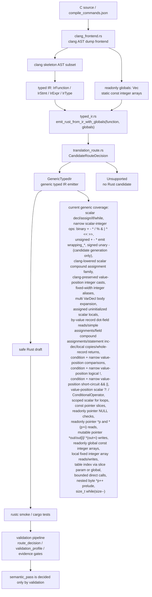

# Core Translation Architecture

This page records the current `c-to-rust` core translation pipeline, key code locations, and FlashDB crc32 generic-emitter progress. The Chinese mirror is `core-translation-architecture.md`.

## Architecture

## Core Code Map

- `crates/c2r-translator/src/clang_frontend.rs`
  - Reads real clang AST dump JSON.
  - Lowers supported C AST nodes into a compact clang skeleton.
  - Converts skeleton nodes into typed IR.
  - It now supports fixed-width integer typedef aliases through `type_from_qual_type()`: `int8_t`, `int16_t`, `int32_t`, `int64_t`, `uint8_t`, `uint16_t`, `uint32_t`, and `uint64_t`, plus exact `signed char` as a signed 8-bit integer. Other target-dependent spellings such as `short` / `long long` are still not treated as fixed-width typedefs.
  - Also collects top-level `static const` fixed-length integer array initializers, including restricted sparse/index-designated initializer forms that clang has semantically expanded into `array_filler` plus explicit non-negative integer enum constant references, as `ClangLoweringReport.globals: Vec<IrGlobal>`; complete uniquely named enum scalar types with explicit non-negative `int` constants and target ABI `int_width=32` are rewritten at the skeleton boundary to typed IR `i32`.
  - `compound_body_skeleton_from_ast()` now expands multiple simple `VarDecl` children from one `DeclStmt` in an ordinary compound body into multiple `ClangStmtSkeleton::Decl` entries in source order. `for_init_stmt_skeletons_from_ast()` reuses the same multi-`VarDecl` expansion helper for `DeclStmt` nodes in `ForStmt` init slots; assignment init still becomes a one-element vec.
  - It also lowers local fixed-length integer-array `InitListExpr` nodes into `IrExpr::ArrayLiteral`, supporting sequential initializers and restricted sparse/index-designated initializer forms that clang has semantically expanded into `array_filler`; it remains limited to one-dimensional fixed-length integer arrays whose elements are pure integer literals or integer casts around integer literals.
  - It lowers clang `NullToPointer` casts around integer zero into a typed IR null pointer literal for narrow pointer-parameter presence checks.
  - It preserves clang `IntegralCast` / `IntegralPromotion` wrappers in declaration initializers, assignment RHS, return values, and ordinary binary operands via `value_expr_skeleton_from_ast` plus binary operand cast preservation, so the typed IR emitter can prove and emit integer `as` casts instead of silently dropping mixed signedness or promotion information.
  - It carries `CompoundAssignOperator` result and compute types through `ClangStmtSkeleton::CompoundAssign`, allowing clang-proven integer promotion/truncation for simple scalar variable targets and by-value record dot-field targets while keeping target/result and compute-lhs/compute-result mismatches fail-closed.
  - It lowers ordinary clang `ConditionalOperator` / `?:` nodes into `ClangExprSkeleton::Conditional`, while explicitly rejecting GNU omitted-middle `BinaryConditionalOperator` nodes.
  - It lowers narrow dot-member reads on by-value record parameters, for example `struct point p; return p.x;`, into `ClangExprSkeleton::Member` and typed IR `IrExpr::Member`. A by-value record dot-field can also be a standalone compound-assignment target when the RHS is a simple integer variable, literal, or integer cast, so `p.x += value` lowers into the typed IR shape `p.x = p.x + value`. Direct by-value record dot-field standalone inc/dec statements such as `p.x++` / `--p.x` lower as value-discarded side effects into `p.x = p.x +/- 1`. It also extracts direct scalar field inventory from unique named complete `RecordDecl` / `FieldDecl` nodes for whole-record return candidates. Duplicate tags, bitfields, volatile/packed fields, and self-pointer/non-scalar fields do not form complete field inventory.
  - It lowers direct mutable record pointer arrow targets for the narrow single-pointer ownership subset: `p->x = value`, `p->x += value`, and standalone value-discarded `p->x++` / `--p->x` become typed IR assignment shapes. The inc/dec path is not a raw `IrExpr::IncDec` emitter; it is a clang statement desugar to `p->x = p->x +/- 1`. Const record pointers, complex bases, non-record pointer bases, and non-standalone arrow inc/dec still fail closed.
  - It lowers narrow clang `ForStmt` nodes into `ClangStmtSkeleton::For`, accepting only simple scalar declaration/assignment init, including multiple simple `VarDecl` declarators, condition, assignment/compound-assignment/postfix-or-prefix inc-dec step, and the existing body subset. Ordinary standalone `value++` / `++value` / `value--` / `--value` statements lower as value-discarded statement side effects into assignments. Direct by-value record dot-field and direct mutable record pointer arrow-field inc/dec are supported only for standalone statements; record-field inc/dec in `ForStmt` steps still fails closed. `DoStmt` lowers to `ClangStmtSkeleton::DoWhile`. `BreakStmt` lowers to loop-body `IrStmt::Break`, and `ContinueStmt` lowers to narrow loop-body `IrStmt::Continue`; condition variable slots, empty condition/step, and other unmodeled control flow still fail closed.
  - Important functions: `lower_function_from_clang_ast_dump_report`, `lower_function_from_clang_parse_spec_report`, `readonly_globals_from_ast`, `readonly_global_from_toplevel_var_decl`, `integer_literal_init_list_values`, `value_expr_skeleton_from_ast`, `expr_skeleton_from_ast_with_options`, `init_list_expr_skeleton_from_ast`, `for_stmt_skeleton_from_ast`, `for_init_stmt_skeletons_from_ast`, `lower_stmt`, `lower_expr`.
- `crates/c2r-translator/src/typed_ir.rs`
  - Defines `IrFunction`, `IrStmt`, `IrExpr`, `IrType`, `IrGlobal`, and `IrGlobalInit`.
  - `emit_rust_from_ir()` remains the no-globals compatibility entrypoint.
  - `emit_rust_from_ir_with_globals(function, globals)` is the main entrypoint for the clang lowering path and returns `EmittedRust { rust, route }`.
  - The generic emitter now emits readonly global integer arrays as Rust `const` items and supports table indexing such as `CRC32_TABLE[...]`.
  - The generic emitter runs a conservative definite-assignment guard before Rust emission. Scalar locals declared without initializers can emit as `let mut x: T;` only when every later read is proven to occur after an assignment in the supported subset, including direct `if` branches where every fallthrough path assigns and the non-assigning branch returns.
  - The generic emitter also supports typed IR local fixed-length integer array literals, index reads, and local array element assignment, emitting Rust local `[T; N]` arrays and `let mut` when an element is written.
  - The generic emitter supports narrow by-value record dot-field reads, simple field assignments, statement-position field compound assignment whose RHS is a simple integer variable, literal, or integer cast, statement-position direct dot-field inc/dec, local by-value copies, and whole-record returns when a unique named complete direct scalar field inventory is available. Field-read paths may still emit a minimal Rust struct derived from accessed scalar fields; whole-record return requires unique named complete direct scalar clang `RecordDecl` / `FieldDecl` inventory. For example `struct point { int x; int y; }; struct point identity_point(struct point p) { return p; }` emits a `Point` containing both `x` and `y` plus `return p;`. This is candidate generation only and does not claim complete C record layout or ABI equivalence.
  - The generic emitter also supports narrow mutable record pointer scalar field writes, simple field compound updates, same-field reads after a definite write, direct if-return branch merges where every fallthrough path writes the same field, and clang-desugared statement inc/dec updates under the single-pointer-parameter alias gate. For example `void bump_point_x(struct point *p) { p->x++; --p->x; }` emits `pub fn bump_point_x(mut p: &mut Point)` plus `p.x = (p.x + 1i32);` / `p.x = (p.x - 1i32);`, while `if (cond) { p->x = value; } else { return 0; } return p->x;` may emit `return p.x;`. Multiple pointer parameters, nullable mutable pointers, read-before-write, ordinary maybe-write reads, writes only on returning branches, loop/complex-path returns, complex bases/targets/RHS, non-scalar fields, layout/ABI claims, and semantic acceptance still fail closed.
  - The generic emitter supports a narrow readonly pointer null-presence surface: `const int *values; return values != NULL;` becomes `values: Option<&[i32]>` plus `.is_some()`. The same nullable parameter is rejected if it is used outside direct null comparisons.
  - The generic emitter supports narrow readonly pointer dereference reads: `const uint8_t *p; return *p;` becomes `p: &[u8]` and `return p[0usize];`, while bounded offset-deref reads such as `return *(p+i);` / `return *(i+p);` become `return p[i as usize];`. This covers only readonly integer pointers with a direct read or a side-effect-free integer offset; mutable pointer reads, other pointer arithmetic, and nullable pointer index/deref after a null check still fail closed.
  - The generic emitter supports narrow mutable integer pointer output writes: a function parameter `T *out` emits as `out: &mut [T]` only when that parameter appears as a write target, and `*out = value`, `out[i] = value`, `*(out+i) = value`, and `*(i+out) = value` emit Rust slice assignments. The element type must be a currently supported integer scalar, and the offset must be a side-effect-free integer literal, variable, or cast; writes through `const T *`, complex offsets, compound/update writes, nullable pointers, pointer escape, mutable pointer reads, alias/ownership proofs, and semantic acceptance still fail closed.
  - The generic emitter supports first-class lazy `IrExpr::Conditional` for pure integer value positions, emitting Rust `if cond { then } else { else }` expressions without hoisting branch side effects.
  - The generic emitter supports narrow value-position short-circuit `&&` / `||` by reusing `emit_condition_expr()` to preserve Rust `&&` / `||` lazy evaluation before materializing C `int` 0/1 results.
  - The generic emitter supports first-class scoped `IrStmt::For`, emitted as an outer Rust block plus `while`: loop-init declarations stay in the loop block and do not leak to the parent scope, and body-local declarations do not leak into the step. A narrow `continue` in the same scoped `ForStmt` body emits the current step before Rust `continue;`; nested-loop `continue` targets only the inner loop.
  - The generic emitter supports narrow `IrStmt::DoWhile`, emitted as Rust `loop { ... if !(condition) { break; } }`. A `continue` inside a `DoWhile` body emits the same loop-exit condition check before Rust `continue;`, avoiding the Rust-only behavior of jumping straight to the top of the loop and skipping the C `do-while` condition.
  - The typed IR legacy crc32 matcher, canned emitter, and `DeprecatedLegacyCrc32` fallback have been removed. A crc32 IR without modeled globals now fails closed instead of silently using a template.
- `crates/c2r-translator/src/translation_route.rs`
  - Defines route metadata for typed IR candidate generation.
  - `GenericTypedIr` is the normal typed IR emitter.
  - `Unsupported` means no Rust candidate; the error keeps route metadata and the fail-closed reason.
- `crates/c2r-translator/src/model.rs`
  - `TranslationSource` records the actual generator selected for the primary Rust draft, plus optional `fallback_from` and `fallback_reason`.
- `crates/c2r-translator/src/artifacts.rs`
  - `try_translate_slice_with_clang_lowered_ir()` passes both `ClangLoweringReport.function_ir` and `report.globals` into `emit_rust_from_ir_with_globals()`.
  - `write_translation_artifacts()` can produce a Rust draft driven by clang-lowered typed IR when the `clang-lowering-report` feature is enabled.
  - If clang-lowered typed IR is unavailable and the compatibility path falls back to the legacy string translator, the fallback is now recorded in `translation_source` and `translation_fallback` JSONL events instead of being silent.
  - The `clang-lowering-report` artifact now includes `typed_ir_candidate`, recording the `CandidateRouteDecision`, readonly globals summary, and the `semantic_pass=false` boundary.
  - Bounded direct identifier calls in clang-lowered typed IR now populate `plan.call_expressions`; `auto_migrate.py` maps that into `translation_summary.call_expressions` and context-pack `direct_call_edges`, and adds `callee_signature_id` / `call_edge_to_callee_binding` when the slice spec declares an external direct callee. This is signature/call-edge/source-binding provenance only; it hardens evidence consistency and does not raise `semantic_pass`.
  - The old string translator crc32 byte-cursor recognizer and local `emit_crc32_byte_cursor_rust()` have been removed. The raw string path now fails closed on unmodeled side effects such as `*p++` / `size--` and no longer emits the `crc32_update_byte()` template. The positive FlashDB crc32 Rust draft comes only from clang-lowered typed IR + readonly globals + `GenericTypedIr`.
- `validation/tools/auto_migrate.py`
  - Normalized auto-translation plans preserve `translation_source`, and route decisions bind it as `candidate_generation.primary_candidate`. This is route provenance, not semantic acceptance and not yet a full multi-candidate scheduler.
  - Route/profile evidence now writes `candidate_generation.selection_policy`, `selected_candidate_id`, and `candidate_set`: the selectable primary draft, the typed-IR signal (typed IR candidate status from the clang-lowering-report), and `c2rust-baseline` (`candidate_context_only`) are recorded in one post-generation candidate inventory. The legacy string translator may appear only as `compatibility_sources` / `compat:legacy-string-translator`, never as the primary or selected candidate. `selection_policy.full_router=false`, so this remains provenance rather than a score/hard-gate selection engine.
  - The `c2rust-baseline` candidate now binds `baseline_manifest` and `output_ref`. `baseline_manifest` points at the same `l3-<slice>-c2rust-baseline-manifest.json`; `output_ref` binds generated file path/status/sha256 when the baseline has `status=generated`, and must be `null` when the baseline is `skipped` or `blocked`. This proves the candidate context did not drift, not that C2Rust output is semantically correct.
  - Newly generated `route_decision.candidate_generation.typed_ir` binds the typed IR candidate route, readonly globals identity, and Rust draft provenance from the clang-lowering-report artifact.
  - Newly generated `validation_profile.candidate_generation` repeats the same binding while keeping `generated_draft_semantic_pass=false`.
  - `typed_ir.status=generated` with route `GenericTypedIr` acts as a typed IR route signal; if the slice is scalar-only and `token_cost=0`, it routes as an L0 deterministic candidate, otherwise generated typed IR remains at least an L1 signal. `typed_ir.status=unsupported` preserves the reason and acts as an L2 repair/baseline route signal. Hard-refuse conditions, `alias_blocked`, `requires_noalias_contract`, and unknown pointer-ownership floors still take priority; typed IR provenance stays in the rationale but cannot override those risk floors.
  - Newly generated pointer graphs use `schema_version=2`. Alias-sensitive read/write pointer graphs include `alias_contract`, `alias_risks`, `alias_sets`, `safe_boundary_preconditions`, and a structured `effect_graph`; cache metadata carries `effect_graph_identity`. The validator requires read/write effects plus a `requires_noalias` or `may_alias` edge for each alias risk in v2 alias-sensitive evidence, while legacy v1 artifacts may omit the field.
- `validation/auto-translation-template/*-schema.json`
  - `candidate_generation` remains optional for older route/profile evidence so legacy fixtures stay compatible.
  - Once `candidate_generation.typed_ir` is present, the schema allows only the `GenericTypedIr` / `Unsupported` typed IR routes and requires `semantic_pass=false`.
  - New-format `candidate_generation` must explicitly write `generated_draft_semantic_pass=false`; a C2Rust baseline candidate with `baseline_manifest` must also write `output_ref`, constrained by the baseline status as either generated output or null.
  - Legacy route/profile payloads may omit `candidate_generation`, but semantic-pass fixtures still must include `c2rust_baseline`, `route_decision`, and `validation_profile` refs.
- `validation/tools/validate_auto_translation_evidence.py`
  - Validates that typed IR candidate binding matches the clang-lowering-report artifact and rejects any candidate evidence claiming `semantic_pass=true`.
  - When new evidence includes `candidate_set`, it also checks candidate id uniqueness, requires `selected_candidate_id` to reference an item in the set, keeps `c2rust-baseline` as `candidate_context_only`, and requires every candidate to keep `semantic_pass=false`.
  - When a C2Rust baseline candidate carries `baseline_manifest`, the validator checks the manifest ref path/status/sha256, compares candidate status/reason/correctness_role against the manifest, and checks generated `output_ref` file path/status/sha256.
  - When the slice spec declares an external direct callee, both the default validation path and `--require-semantic-pass` check spec `external_direct_callees` / `signature_ref` / `source_files` against plan `translation_summary.call_expressions`, context-pack `direct_call_edges`, `callee_sources`, `signature_bindings`, and every `call_edge_to_callee_binding`; missing call sites, source-hash drift, signature-shape drift, `callee_signature_id` drift, missing bindings, or stub/semantics-boundary drift fail closed.
  - For real-slice external direct callees, `auto_migrate.py` now distinguishes `external_direct_callee_declarations` / `declared_spec_count` (signature/source provenance bound in the slice spec) from `external_direct_callees` / `declared_count` (callees that may currently receive compile-only stubs). If a signature contains unsupported boundaries such as `fdb_kvdb_t`, `fdb_blob_t`, `const char*`, or `size_t`, the callee remains in `external_direct_callee_blocks` with `stub_kind=none` and `semantics_verified=false`; this improves refusal-evidence granularity and does not raise `semantic_pass`.
  - `--require-semantic-pass` also requires legacy accepted auto-translation fixtures to persist baseline/route/profile refs, cache identities, schema-aware diff metadata, and negative-diff mutation evidence. Helper-only test backfill is not a substitute for committed evidence.
- `crates/c2r-translator/tests/bounded_translation.rs`
  - Main behavior contract for the bounded translator.
  - Covers direct typed IR tests, real clang AST smoke tests, the real FlashDB crc32 parse spec, fail-closed boundaries, and rustc smoke compilation.
- `CONTEXT.md`
  - Chronological handoff log for this branch.
  - Use the latest numbered section first when resuming work.

## Current Core Translation Status

The typed IR candidate generation layer now has two explicit outcomes:

- `GenericTypedIr`: the generic typed IR emitter. Real FlashDB `fdb_calc_crc32` now reaches this route through clang lowering plus globals and passes rustc smoke.
- `Unsupported`: no Rust candidate; the error carries route metadata and the fail-closed reason.

The typed IR `CandidateRouteDecision` selects the candidate generation implementation only. It does not decide `semantic_pass`. New route/profile evidence binds it into `route_decision.candidate_generation.typed_ir` and `validation_profile.candidate_generation` as provenance; route decision may use it to distinguish the scalar-only `token_cost=0` L0 deterministic typed IR path, the non-scalar L1 generic typed IR path, and the L2 typed IR unsupported repair path; existing route/profile evidence that does not yet carry the field remains accepted for legacy compatibility. Acceptance still belongs to validation profile gates such as C oracle, Rust replay, schema diff, negative diff, unsafe ledger, and final verification. Legacy compatibility covers optional fields only, not semantic-pass refs: `c2rust_baseline`, `route_decision`, `validation_profile`, schema-aware diff evidence, and negative-diff evidence must be persisted and consistently cross-referenced.

Generic typed IR emission now covers:

- scalar declarations, assignment, return, `if`, `while`, and narrow `do-while`;
- clang-lowered fixed-width integer scalar aliases: `int8_t` / `int16_t` / `int32_t` / `int64_t` / `uint8_t` / `uint16_t` / `uint32_t` / `uint64_t` can now enter typed IR as parameter, local, and return types, and emit Rust `i8` / `i16` / `i32` / `i64` / `u8` / `u16` / `u32` / `u64`; exact `signed char` can also enter as a signed 8-bit integer and emit Rust `i8`;
- multi-`VarDecl` declaration statements in ordinary compound bodies and scoped `ForStmt` init slots, for example `int a = 1, b = 2;` and `for (int i = 0, j = 0; i < limit; i++)`, expand into consecutive typed IR `Decl` statements and emit Rust locals in source order;
- uninitialized scalar local declarations when assignment-before-read is proven by the conservative typed IR guard, for example `int tmp; tmp = 7; return tmp;` emits `let mut tmp: i32; tmp = 7i32; return tmp;`, and direct if-return branches can prove fallthrough assignment when non-assigning branches return;
- by-value record dot-field reads, simple field assignments, statement-position field compound assignment whose RHS is a simple integer variable, literal, or integer cast, statement-position direct dot-field inc/dec, local by-value copies, and whole-record returns with unique named complete direct scalar field inventory. For example `struct point { int x; int y; }; int add_point_x(struct point p, int value) { p.x += value; return p.x; }` emits `mut p: Point`, `p.x = (p.x + value);`, and `return p.x;`, while `int bump_point_x(struct point p) { p.x++; return p.x; }` emits `p.x = (p.x + 1i32);` and `return p.x;`; `struct point identity_point(struct point p) { return p; }` lowers through real clang AST, extracts the complete field inventory, and emits Rust `Point { x, y }`, `pub fn identity_point(p: Point) -> Point`, and `return p;`;
- direct mutable record pointer scalar field writes, simple field compound updates, same-field reads after a definite write, direct if-return branch merges where every fallthrough path writes the same field, and clang-desugared statement-position field inc/dec under the single-pointer-parameter gate. For example `void bump_point_x(struct point *p) { p->x++; ++p->x; p->x--; --p->x; }` emits `p: &mut Point` and four direct Rust field assignments using `+/- 1i32`;
- scalar integer binary expressions `+`, `-`, `*`, `/`, `%`, `&`, `|`, `^`, `<<`, and `>>`; unsigned-result `+`, `-`, and `*` emit explicit Rust `wrapping_add`, `wrapping_sub`, and `wrapping_mul`;
- signed scalar integer unary minus `-value`;
- clang-lowered compound assignment family: `+=`, `-=`, `*=`, `/=`, `%=`, `&=`, `|=`, `^=`, `<<=`, and `>>=` desugar to `x = x op rhs` for standalone statements and simple `ForStmt` steps with a simple scalar variable target. Standalone statements with by-value record dot-field targets are also covered when the RHS is a simple integer variable, literal, or integer cast, for example `p.x += value`. When clang proves target/result are the same supported integer type and compute lhs/result are the same supported integer type, compute type may differ from the target type and is lowered through explicit casts such as `value = (((value as i32) + 1i32) as u8);`;
- clang-preserved value-position integer implicit casts in declaration initializers, assignment RHS, and return values, for example `uint32_t value = 1; value = 2; return 3;` can lower into typed IR casts that emit `(1i32 as u32)`, `(2i32 as u32)`, and `(3i32 as u32)` when the source and target are supported integer types;
- clang-preserved binary-operand integral casts: ordinary integer binary operations emit only when clang inserted `IntegralCast` / `IntegralPromotion` and the post-cast lhs/rhs/result types align exactly, for example `uint32_t add_byte(uint32_t acc, uint8_t byte) { return acc + byte; } -> return acc.wrapping_add((byte as u32));`, and `signed char value + 1 -> ((value as i32) + 1i32)`;
- comparison expressions in conditions and narrow value positions: `if` / `while` conditions emit Rust bool conditions, while value positions such as `return x > 0`, `out = x == y`, and `int ok = x != 0` materialize C `int` 0/1 results;
- logical not `!expr` in conditions and narrow value positions: `if (!value)` / `while (!value)` emit `value == 0`, `!(value > 0)` emits a negated comparison condition, and value positions such as `return !value`, assignment RHS, or declaration initializer emit C `int` 0/1 materialization such as `if value == 0 { 1i32 } else { 0i32 }`;
- short-circuit `&&` / `||` in condition positions and narrow value positions: `if (left && right)` / `while (left || right)` emit Rust bool conditions; `return left && right`, `out = left || right`, and `int out = left && (right > 0)` materialize C `int` 0/1 results; each operand recursively reuses the current `emit_condition_expr()` subset for integer truthiness, comparisons, logical-not, readonly deref, and bounded offset-deref reads;
- ordinary clang `ConditionalOperator` / `?:` in pure integer value positions: `return flag ? left : right`, `out = flag ? value : fallback`, and `int out = flag ? left : right` lower to lazy typed IR `IrExpr::Conditional` and emit Rust `if flag != 0 { ... } else { ... }` expressions; branch integer casts preserved by clang are kept, for example `uint32_t choose(uint32_t flag, uint32_t value) { return flag ? value : 2; }` emits `(2i32 as u32)` in the else arm;
- narrow scoped `ForStmt` plus standalone inc/dec statements: `for (int i = 0; i < limit; i++) { total = total + i; }`, `for (int i = 0; i < limit; ++i) { total = total + i; }`, and `for (int i = 0, j = 0; i < limit; i++) { total = total + i + j; }` lower to first-class `IrStmt::For` and emit a Rust block plus `while` shape; multiple init declarations emit in source order inside the loop block, do not leak outside that block, and body-local declarations do not leak into the step. Step-position and ordinary standalone-statement simple scalar `++i` / `--i` / `i++` / `i--` lower only as value-discarded statement side effects to `i = i +/- 1`; this does not mean value-position inc/dec is supported;
- narrow `DoStmt` / `do-while`: real clang `DoStmt` now lowers to `IrStmt::DoWhile`, emitted as a Rust `loop` with a trailing condition break check; the body runs at least once, and the condition still reuses the current `emit_condition_expr()` subset;
- loop-body `break`: real clang `BreakStmt` now lowers to `IrStmt::Break` and emits Rust `break;` only inside `while` / `do-while` / scoped `ForStmt` bodies; top-level `break` and other non-loop contexts still fail closed;
- narrow loop-body `continue`: real clang `ContinueStmt` now lowers to `IrStmt::Continue`; `while` bodies emit Rust `continue;`, `do-while` bodies check the same loop condition before `continue;`, scoped `ForStmt` bodies emit the simple step before Rust `continue;`, nested-loop `continue` does not accidentally run the outer loop step or condition shim, and top-level/non-loop `continue` still fails closed;
- initialized scalar locals from clang AST;
- no-brace `if` / `while` bodies from clang AST;
- readonly integer pointer parameters as Rust slices, for example `const uint32_t *table -> table: &[u32]`;
- readonly integer pointer parameter null-presence checks, for example `const int *values; return values != NULL; -> values: Option<&[i32]>` and `values.is_some()`; the nullable parameter must be used only in direct `== NULL` / `!= NULL` comparisons;
- readonly integer pointer parameter dereference reads, for example `const uint8_t *p; return *p; -> p: &[u8]` and `return p[0usize];`, plus bounded offset-deref reads such as `return *(p+i);` / `return *(i+p); -> return p[i as usize];`; the same reads can also act as ordinary scalar reads in comparison/logical-not candidate generation, for example `*p == 0`, `*(p+i) == 0`, `!*p`, and `!*(p+i)`;
- mutable integer pointer output writes: `int *out` emits as `out: &mut [i32]` only when it appears as a write target, and supports `*out = value; -> out[0usize] = value;`, `out[i] = value; -> out[i as usize] = value;`, and `*(out+i) = value; -> out[i as usize] = value;`; this currently covers integer element writes on function parameters only and does not cover mutable pointer reads, compound writes, complex offsets, nullable pointers, pointer escape, multi-pointer alias/noalias proofs, or semantic acceptance;
- `static const` readonly integer array initializers as Rust `const`, for example `crc32_table[] -> const CRC32_TABLE: [u32; 256]`; sequential initializers and restricted sparse/index-designated initializer forms represented by clang-semantic `array_filler` lower to `IrGlobalInit::IntegerArray`;
- explicit non-negative integer enum constant references plus the first enum scalar type subset: function-body `DeclRefExpr -> EnumConstantDecl` can be rewritten into typed IR integer literals, top-level readonly `static const` fixed-size integer global array initializers can consume the same proven constants into `IrGlobalInit::IntegerArray`, and enum params/returns can lower as `i32` scalars when the enum is complete, uniquely named, all constants are explicit non-negative `int` literals, and the target ABI reports `int_width=32`;
- clang-lowered typed IR local fixed-length integer array literals, index reads, and element writes, for example `uint32_t table[3] = {1,2,3}; table[i] = value; return table[i]; -> let mut table: [u32; 3] = ...; table[i as usize] = value;`; sequential initializers and restricted sparse/index-designated initializer forms represented by clang-semantic `array_filler` are zero-filled into complete array values. Only initializer elements canonicalized by clang AST to pure integer literals/casts are supported, and writes must target a declared local fixed-length integer array. Unexpanded `DesignatedInitExpr`, nested arrays, struct arrays, non-literal or side-effecting initializers, VLAs, incomplete arrays, writes to readonly global arrays, writes to const pointer slices, and general array-to-pointer decay still fail closed;
- `const void *buf` as `&[u8]` only when a proven `const uint8_t *p` cursor and byte read exist;
- nested byte cursor reads such as `(uint32_t)*p++` through prelude temporaries;
- assignment RHS prelude, covering `crc = table[(crc ^ (uint32_t)*p++) & 0xff] ^ (crc >> 8);`;
- bounded direct identifier calls: only direct function-name callees proven by clang `referencedDecl.kind=FunctionDecl`, covering call statements, declaration initializers, assignment RHS, and return values, while emitting callee, arguments, source expression, and statement context into `call_expressions` evidence; when the slice spec declares an external direct callee, the validator also requires every plan/context/binding call site and signature to match; the argument subset allows one immediate nested direct call when the whole argument is that call and its result is a supported integer scalar, for example `outer(inner(value))`; deeper nesting, multiple sibling nested calls, nested calls hidden inside binary/index/cast operands, function-pointer callees, callees without `FunctionDecl` proof, calls anywhere inside condition expression trees, and inc/dec or dereference arguments still fail closed;
- C macro / stdlib / extern direct calls: current explicit minimal models include `assert(int)`, `abs(int)`, target-ABI-bound `strlen(const char *)`, bounded `strnlen(const char *, size_t)`, `memcmp(const void *, const void *, size_t)`, statement-only `memset(dst, byte_literal, size)`, and statement-only `memcpy(out, src, size)`. `strlen` / `strnlen` require direct readonly 8-bit string pointer arguments and expose their NUL/length preconditions; `strnlen` also requires a `size_t`/`usize` bound. `memcmp` / `memset` / `memcpy` only cover their restricted byte-slice shapes. Every other reserved surface still needs a separate model or external-callee evidence binding; these models remain candidate generation, the complete support boundary is constrained by `COVERAGE.md` and the coverage matrix, and none of them imply corresponding named-slice L3 semantic evidence;
- narrow `size_t` postfix-decrement while conditions, lowering `while (size--)` into a Rust `loop` that preserves postfix side effects.

Still incomplete:

- The current work proves candidate generation plus rustc smoke and binds candidate provenance into route/profile evidence; raw string crc32 byte-cursor input now stays fail-closed. It is not semantic acceptance for the real FlashDB slice.
- Fixed-width integer alias and exact `signed char` coverage is only clang type skeleton / typed IR candidate generation. Other target-dependent spellings such as `short` / `long long`, plain `char`, plain `long`, target-ABI width inference, complete integer promotion/usual scalar conversions, and semantic acceptance remain unmodeled.
- Multi-`VarDecl` expansion covers only ordinary compound-body and scoped `ForStmt` init declarators that each already lower through the current subset. Unsupported types/initializers, VLA/incomplete arrays, initializer markers without children, multiple initializer children, duplicate symbols, complex init/step forms, and semantic acceptance still fail closed.
- Enum constant references cover only explicit non-negative integer `EnumConstantDecl` values with `ConstantExpr.value` plus a matching direct `IntegerLiteral` child. Enum types cover only the target-ABI-bound i32 scalar params/returns subset. No target ABI, implicit/negative/computed enum constants, non-i32 ABI, enum pointers/arrays/fields, Rust enum generation, and the full underlying ABI model still fail closed.
- Uninitialized scalar local declarations are candidate generation only and require a conservative assignment-before-read proof. Reads before assignment, first assignments that read the same variable, assignments that occur only inside a loop or a one-sided branch that can fall through, arrays without initializers, pointer/record/function declarations, address-taken initialization, indirect writes, alias writes, and semantic acceptance still fail closed.
- By-value record dot-field reads, simple field assignments, statement-position field compound assignment whose RHS is a simple integer variable, literal, or integer cast, statement-position direct dot-field inc/dec, initialized local by-value copies, whole-record returns with unique named complete direct scalar field inventory, and the narrow direct mutable record pointer subset are candidate generation only. Field-read paths may still emit a minimal candidate shape derived from accessed scalar fields; whole-record return emits a complete-field candidate only when clang provides a unique named complete direct scalar field inventory. This is still not a C layout or ABI proof. Record parameters with no modeled field use, pointer member access outside the direct readonly or single-pointer mutable subsets, whole-record return without complete inventory, uninitialized record locals, value-position field update/inc-dec, record-field inc/dec in `ForStmt` steps, complex-base field updates, field compound assignment complex RHS, multi-pointer alias-sensitive field writes, struct arrays, address-taken records, alias writes, and semantic acceptance still fail closed; whole-record inventory also fails closed on duplicate tags, nested/anonymous records, unions, bitfields, self-pointer/non-scalar fields, and volatile/packed fields.
- Unsigned scalar `+`, `-`, and `*` now emit explicit Rust wrapping methods, so checksum/hash candidates no longer depend on debug vs release overflow behavior. This is still candidate generation only; signed overflow, full usual arithmetic conversions, pointer arithmetic, and semantic acceptance still require separate evidence.
- `*`, `/`, and `%` are narrow scalar-integer candidate generation only. Division and modulo do not claim division-by-zero support, full C arithmetic, floating-point arithmetic, complete usual arithmetic conversions, overflow/UB parity, or pointer arithmetic. Division/modulo can only move toward semantic acceptance when the non-zero divisor is established by a literal, fixture input domain, or slice contract.
- Bitwise OR / left shift are narrow scalar-integer candidate generation only. Current `|` requires both operands and the result to share one scalar integer type, and `<<` follows the shift rule requiring lhs/result type agreement; this does not claim full C bitwise/shift semantics, usual arithmetic conversions, invalid shift counts, signed shift/overflow UB parity, pointer arithmetic, or semantic acceptance.
- Signed unary minus is also narrow candidate generation only. It requires the operand and result to be the same signed integer scalar type; unsigned or wrapping negation, floating-point negation, pointer arithmetic, compound `-=`, and literal edge cases such as `-2147483648` remain outside this subset until modeled explicitly.
- The compound assignment family is clang-lowered candidate generation only. It covers standalone statements and simple `ForStmt` steps with simple scalar variable targets, and standalone statements with by-value record dot-field targets whose RHS is a simple integer variable, literal, or integer cast. Narrow clang-proven integer promotion/truncation is supported only when target/result match, compute lhs/result match, and all involved types are supported integers. `*p += y`, `a[i] += y`, `p->f += y`, field compound assignments whose base is not a direct record variable, record field compound assignment complex RHS, value-position `(x += y)`, compound assignment in conditions or call arguments, unsupported promotion/truncation, pointer arithmetic, floating-point, volatile, complex RHS side effects, and semantic acceptance still fail closed.
- Value-position and binary-operand implicit cast preservation is clang-lowered candidate generation only. It preserves only clang `IntegralCast` / `IntegralPromotion` nodes in declaration initializers, assignment RHS, return values, or ordinary binary operands, and the typed IR emitter still requires supported integer source/target types plus exact post-cast lhs/rhs/result type alignment for binary operations. Function-pointer decay, pointer casts outside existing explicit byte-cursor handling, floating-point casts, hidden side-effect conversions, casts whose result still mismatches the statement boundary, and full usual scalar conversions still fail closed.
- Comparison expressions are candidate generation only, and both condition positions and narrow value positions keep `semantic_pass=false`. Current support covers narrow scalar-integer comparisons, C `int` 0/1 materialization, comparison operands with integral casts whose source and target are supported integer types and whose post-cast operand types match exactly, readonly integer pointer-parameter null presence checks, readonly direct deref read operands, and bounded readonly offset-deref read operands. Arbitrary pointer arithmetic beyond the bounded readonly `*(p+i)` read, arbitrary pointer comparison, floating-point comparison, mixed-width/unsigned conversions that are not aligned by clang-preserved or explicit integer casts, call/inc/dec side-effect operands, pointer truthiness, pointer null checks followed by dereference/index use, full usual scalar conversions, and semantic acceptance still fail closed.
- Logical not is candidate generation only, and both condition positions and narrow value positions keep `semantic_pass=false`. Current support covers integer zero checks, negated comparison conditions, readonly direct deref read operands, bounded readonly offset-deref read operands, and C `int` 0/1 materialization; it is not full C unary `!`, and operands containing calls, inc/dec, unmodeled deref side effects, pointer truthiness, pointer null checks outside the narrow readonly pointer-parameter presence surface, floating-point truthiness, unsupported types, or full usual scalar conversions still fail closed.
- Short-circuit `&&` / `||` is candidate generation only and covers condition positions plus narrow value positions, with a required C `int` result type. Value positions are limited to return values, assignment RHS, and declaration initializers, and use Rust `&&` / `||` to preserve lazy evaluation before C `int` 0/1 materialization; operands containing calls/inc/dec/side effects, pointer truthiness, floating-point truthiness, unsupported types, and cases requiring full usual scalar conversions still fail closed.
- Conditional `?:` is candidate generation only and currently covers pure integer value positions only. Condition-position `if (a ? b : c)` / `while (a ? b : c)`, expression statements, GNU omitted-middle `a ?: b`, call/inc/dec/post-increment/assignment/comma side effects inside arms, pointer or floating-point results, pointer truthiness, aggregate results, unmodeled usual scalar conversions, and semantic acceptance still fail closed.
- Structured loop and standalone inc/dec statement candidate generation is still narrow. `ForStmt` covers only simple scalar declaration/assignment init, including multiple simple `VarDecl` declarators, condition, assignment/compound-assignment/postfix-or-prefix inc-dec step, and the existing statement body subset. Ordinary standalone inc/dec covers only simple integer-variable targets, direct by-value record dot-field integer targets, or direct single-pointer mutable record pointer scalar field targets when the expression value is discarded as a statement. `DoWhile` covers only the existing body subset and conditions accepted by the current condition emitter. `break` emits only as direct loop exit. `continue` is supported only in loop bodies: a `while` body emits Rust `continue;`, a `do-while` body checks the condition before `continue;`, and the same scoped `ForStmt` body emits the current step before Rust `continue;`. `goto` / `switch`, condition variable slots, empty `ForStmt` condition/step, inc/dec in conditions/call arguments/return values, record-field inc/dec in `ForStmt` steps, complex init/step, complex inc/dec targets, value-position inc/dec, non-scalar step, full C loop control-flow semantics, and semantic acceptance still fail closed.
- Mutable pointer writes are narrow candidate generation only: the current subset emits direct `*out`, indexed `out[i]`, and simple add-offset `*(out+i)` / `*(i+out)` writes on function parameter `T *out` as `&mut [T]` slice assignments. Writes through `const T *`, mutable pointer reads, `out[i+j]` / `*(out+i+1)` / `*(out+f())`, compound/update writes, pointer self-increment, returning/forwarding the pointer, multi-mutable-pointer alias/noalias proofs, nullable pointers, and semantic acceptance still fail closed.
- Complex function pointers, unmodeled alias writes, volatile/hardware registers, macro side effects, and cross-thread/interrupt semantics should still fail closed or route higher.

## Next Implementation Cut

1. Keep extending generic typed IR coverage with red tests first. Good next cuts are multi-pointer alias/noalias proof for record pointers, value-position/complex-target record update field writes, deeper path-sensitive mutable field facts beyond direct if-return branches, or wider control-flow semantics for `switch` / `goto`. Multi-`VarDecl` body expansion, multi-declaration `ForStmt` init, assigned-before-read uninitialized scalar locals including direct if-return branches, by-value record dot-field reads/simple assignments/field compound assignment/statement inc-dec/local copies/complete-field whole-record returns, direct readonly record pointer reads/null guards, single-pointer mutable record pointer field assignment/compound/read-after-write/direct if-return fallthrough read/statement inc-dec, fixed-width integer aliases, exact `signed char`, binary-operand integral cast preservation, condition/value-position `&&` / `||`, the compound assignment family including narrow clang-proven promotion/truncation, value-position integer implicit cast preservation, pure integer value-position `ConditionalOperator` / `?:`, narrow scoped `ForStmt`, step-position prefix inc/dec, standalone value-discarded inc/dec statements, narrow `do-while`, loop-body `break`, narrow loop-body `continue`, readonly `*(p+i)` reads, mutable pointer output writes, and one-level single nested direct call arguments now have direct/clang-lowered/real-clang smoke coverage. The bounded readonly `*(p+i)` read, mutable pointer write fail-closed const/offset boundaries, mutable record pointer multi-pointer/nullable/read-before-write/ordinary-maybe-write/returning-branch-only-write/loop-complex-return boundaries, whole-record return missing-inventory/bitfield/volatile/packed boundaries, nested direct call deeper/multiple-sibling boundaries, lazy `?:` branch semantics, short-circuit lazy evaluation, for-loop scope boundary, `ForStmt` continue-step ordering, standalone/value-position inc/dec boundaries, and `DoWhile` continue-condition check should stay covered by real-clang and fail-closed boundary tests, while arbitrary pointer arithmetic, arbitrary pointer comparison, floating-point comparison, unmodeled mixed-width conversions, side-effect operands, and semantic acceptance must continue to fail closed.
2. Run full C/Rust oracle, negative diff, unsafe ledger, and final verification for the real FlashDB crc32 slice.
3. Keep the raw string crc32 byte-cursor fail-closed regression coverage so the `crc32_update_byte()` template and `crc32-byte-cursor-loop` rule are not reintroduced.
