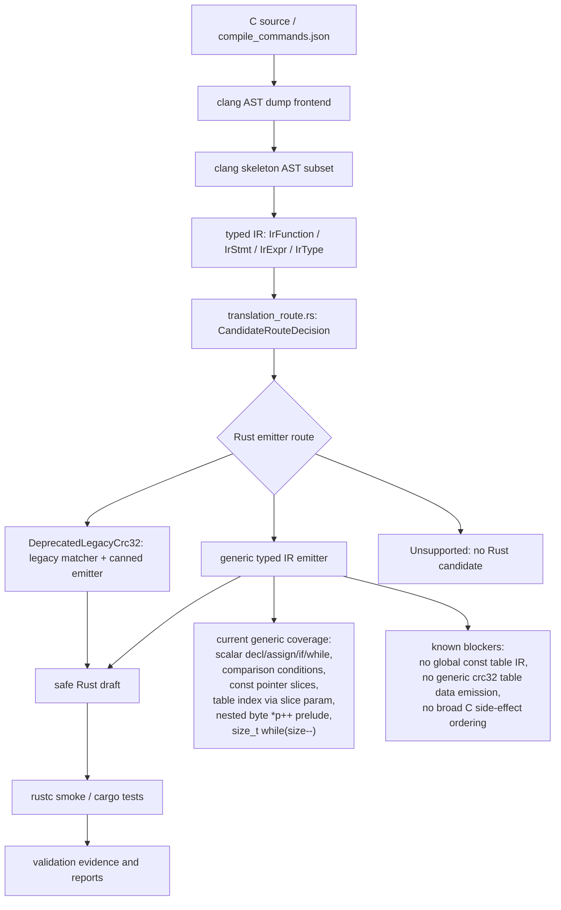

# Core Translation Architecture

This is the English version. It records the current `c-to-rust` core translation pipeline, key code locations, and FlashDB crc32 generic-emitter progress. The Chinese version is `core-translation-architecture.md`.

## Architecture

## Core Code Map

- `crates/c2r-translator/src/clang_frontend.rs`
  - Reads real clang AST dump JSON.
  - Lowers supported C AST nodes into a compact clang skeleton.
  - Converts skeleton nodes into typed IR.
  - Important functions: `expr_skeleton_from_ast_with_options`, `stmt_skeleton_from_ast`, `lower_function_from_clang_ast_dump_report`, `lower_stmt`, `lower_expr`.
- `crates/c2r-translator/src/typed_ir.rs`
  - Defines `IrFunction`, `IrStmt`, `IrExpr`, `IrType`.
  - Emits Rust from typed IR; `emit_rust_from_ir()` now returns `EmittedRust { rust, route }`.
  - Important functions: `emit_rust_from_ir`, `emit_scalar_rust_from_ir`, `emit_stmt`, `emit_expr_with_prelude`, `emit_post_increment_byte_read_expr`, `emit_postfix_decrement_while_loop`.
  - The legacy crc32 matcher and canned emitter still live here: `is_crc32_byte_cursor_ir`, `emit_crc32_byte_cursor_rust`, but they are now explicitly marked as a deprecated candidate route.
- `crates/c2r-translator/src/translation_route.rs`
  - Defines route metadata for typed IR candidate generation.
  - `GenericTypedIr` is the normal typed IR emitter.
  - `DeprecatedLegacyCrc32` is the currently retained crc32 canned path, with delete conditions recorded by `LEGACY_CRC32_DELETE_WHEN`.
  - `Unsupported` means no Rust candidate; the error keeps route metadata and the fail-closed reason.
- `crates/c2r-translator/tests/bounded_translation.rs`
  - Main behavior contract for the bounded translator.
  - Covers direct typed IR tests, real clang AST smoke tests, fail-closed boundaries, and rustc smoke compilation.
- `CONTEXT.md`
  - Chronological handoff log for this branch.
  - Use the latest numbered section first when resuming work.

## Current Core Translation Status

After P0, the Rust emitter route is no longer only a hidden `if` inside `emit_rust_from_ir()`. `translation_route.rs` returns a `CandidateRouteDecision`:

- `GenericTypedIr`: the normal typed IR emitter.
- `DeprecatedLegacyCrc32`: the existing crc32 canned path, explicitly deprecated.
- `Unsupported`: no Rust candidate; the error carries route metadata and the fail-closed reason.

Candidate route selects the candidate generation implementation only. It does not decide `semantic_pass` and does not replace the evidence `route_decision` in `validation/tools/auto_migrate.py`.

Generic typed IR emission now covers:

- scalar declarations, assignment, return, `if`, `while`;
- comparison expressions only in conditions;
- initialized scalar locals from clang AST;
- no-brace `if` / `while` bodies from clang AST;
- readonly integer pointer parameters as Rust slices, for example `const uint32_t *table -> table: &[u32]`;
- `const void *buf` as `&[u8]` only when a proven `const uint8_t *p` cursor and byte read exist;
- nested byte cursor reads such as `(uint32_t)*p++` through prelude temporaries;
- assignment RHS prelude, enough for `crc = table[(crc ^ (uint32_t)*p++) & 0xffU] ^ (crc >> 8U);` when `table` is a pointer parameter;
- narrow `size_t` postfix-decrement while conditions, lowering `while (size--)` into a Rust `loop` that preserves postfix side effects.

Still not generic:

- `static const uint32_t crc32_table[256]` has no explicit typed IR global-data model yet.
- Real FlashDB crc32 still passes through the `DeprecatedLegacyCrc32` legacy typed-IR shape matcher and canned Rust route.
- The project should not claim "zero crc32-specific code" until `is_crc32_byte_cursor_ir` and `emit_crc32_byte_cursor_rust` are removed after a generic path passes.

## Next Implementation Cut

The next useful cut is explicit global readonly table support:

1. Add typed IR representation for readonly global arrays, or a translation context that carries them.
2. Make `crc32_table[...]` resolve through that context instead of being an undeclared local.
3. Emit Rust for the table data or for a validated external table binding.
4. Run real FlashDB crc32 through `generic typed IR emitter -> rustc smoke`.
5. Only then remove the legacy crc32 matcher and canned emitter.
