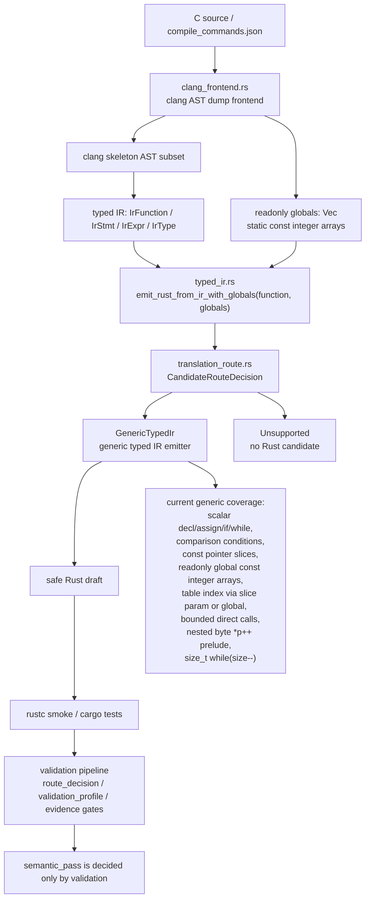

# Core Translation Architecture

This page records the current `c-to-rust` core translation pipeline, key code locations, and FlashDB crc32 generic-emitter progress. The Chinese mirror is `core-translation-architecture.md`.

## Architecture

## Core Code Map

- `crates/c2r-translator/src/clang_frontend.rs`
  - Reads real clang AST dump JSON.
  - Lowers supported C AST nodes into a compact clang skeleton.
  - Converts skeleton nodes into typed IR.
  - Also collects top-level `static const` fixed-length integer array initializers as `ClangLoweringReport.globals: Vec<IrGlobal>`.
  - Important functions: `lower_function_from_clang_ast_dump_report`, `lower_function_from_clang_parse_spec_report`, `readonly_globals_from_ast`, `readonly_global_from_toplevel_var_decl`, `integer_literal_init_list_values`, `expr_skeleton_from_ast_with_options`, `lower_stmt`, `lower_expr`.
- `crates/c2r-translator/src/typed_ir.rs`
  - Defines `IrFunction`, `IrStmt`, `IrExpr`, `IrType`, `IrGlobal`, and `IrGlobalInit`.
  - `emit_rust_from_ir()` remains the no-globals compatibility entrypoint.
  - `emit_rust_from_ir_with_globals(function, globals)` is the main entrypoint for the clang lowering path and returns `EmittedRust { rust, route }`.
  - The generic emitter now emits readonly global integer arrays as Rust `const` items and supports table indexing such as `CRC32_TABLE[...]`.
  - The typed IR legacy crc32 matcher, canned emitter, and `DeprecatedLegacyCrc32` fallback have been removed. A crc32 IR without modeled globals now fails closed instead of silently using a template.
- `crates/c2r-translator/src/translation_route.rs`
  - Defines route metadata for typed IR candidate generation.
  - `GenericTypedIr` is the normal typed IR emitter.
  - `Unsupported` means no Rust candidate; the error keeps route metadata and the fail-closed reason.
- `crates/c2r-translator/src/lib.rs`
  - `try_translate_slice_with_clang_lowered_ir()` passes both `ClangLoweringReport.function_ir` and `report.globals` into `emit_rust_from_ir_with_globals()`.
  - `write_translation_artifacts()` can produce a Rust draft driven by clang-lowered typed IR when the `clang-lowering-report` feature is enabled.
  - The `clang-lowering-report` artifact now includes `typed_ir_candidate`, recording the `CandidateRouteDecision`, readonly globals summary, and the `semantic_pass=false` boundary.
  - The old string translator still keeps a crc32 byte-cursor template path in `is_crc32_byte_cursor_loop()` and the local `emit_crc32_byte_cursor_rust()`. It no longer bridges into typed IR and no longer records `typed-ir-crc32-emitter` provenance.
- `validation/tools/auto_migrate.py`
  - Newly generated `route_decision.candidate_generation.typed_ir` binds the typed IR candidate route, readonly globals identity, and Rust draft provenance from the clang-lowering-report artifact.
  - Newly generated `validation_profile.candidate_generation` repeats the same binding while keeping `generated_draft_semantic_pass=false`.
  - `typed_ir.status=generated` with route `GenericTypedIr` acts as an L1 route signal; `typed_ir.status=unsupported` preserves the reason and acts as an L2 repair/baseline route signal. Hard-refuse conditions still take priority.
- `validation/auto-translation-template/*-schema.json`
  - `candidate_generation` remains optional for older route/profile evidence so legacy fixtures stay compatible.
  - Once `candidate_generation.typed_ir` is present, the schema allows only the `GenericTypedIr` / `Unsupported` typed IR routes and requires `semantic_pass=false`.
- `validation/tools/validate_auto_translation_evidence.py`
  - Validates that typed IR candidate binding matches the clang-lowering-report artifact and rejects any candidate evidence claiming `semantic_pass=true`.
- `crates/c2r-translator/tests/bounded_translation.rs`
  - Main behavior contract for the bounded translator.
  - Covers direct typed IR tests, real clang AST smoke tests, the real FlashDB crc32 parse spec, fail-closed boundaries, and rustc smoke compilation.
- `CONTEXT.md`
  - Chronological handoff log for this branch.
  - Use the latest numbered section first when resuming work.

## Current Core Translation Status

The typed IR candidate generation layer now has two explicit outcomes:

- `GenericTypedIr`: the generic typed IR emitter. Real FlashDB `fdb_calc_crc32` now reaches this route through clang lowering plus globals and passes rustc smoke.
- `Unsupported`: no Rust candidate; the error carries route metadata and the fail-closed reason.

The typed IR `CandidateRouteDecision` selects the candidate generation implementation only. It does not decide `semantic_pass`. New route/profile evidence binds it into `route_decision.candidate_generation.typed_ir` and `validation_profile.candidate_generation` as provenance; route decision may use it to distinguish the L1 generic typed IR path from the L2 typed IR unsupported repair path; existing route/profile evidence that does not yet carry the field remains accepted for legacy compatibility. Acceptance still belongs to validation profile gates such as C oracle, Rust replay, schema diff, negative diff, unsafe ledger, and final verification.

Generic typed IR emission now covers:

- scalar declarations, assignment, return, `if`, and `while`;
- comparison expressions only in conditions;
- initialized scalar locals from clang AST;
- no-brace `if` / `while` bodies from clang AST;
- readonly integer pointer parameters as Rust slices, for example `const uint32_t *table -> table: &[u32]`;
- `static const` readonly integer array initializers as Rust `const`, for example `crc32_table[] -> const CRC32_TABLE: [u32; 256]`;
- `const void *buf` as `&[u8]` only when a proven `const uint8_t *p` cursor and byte read exist;
- nested byte cursor reads such as `(uint32_t)*p++` through prelude temporaries;
- assignment RHS prelude, covering `crc = table[(crc ^ (uint32_t)*p++) & 0xff] ^ (crc >> 8);`;
- bounded direct identifier calls: only direct function-name callees proven by clang `referencedDecl.kind=FunctionDecl`, covering call statements, declaration initializers, assignment RHS, and return values; nested calls, function-pointer callees, callees without `FunctionDecl` proof, calls anywhere inside condition expression trees, and inc/dec or dereference arguments still fail closed;
- narrow `size_t` postfix-decrement while conditions, lowering `while (size--)` into a Rust `loop` that preserves postfix side effects.

Still incomplete:

- The old string translator still has a crc32 byte-cursor recognizer and canned Rust template. That is a legacy parser path, not a typed IR fallback.
- The current work proves candidate generation plus rustc smoke and binds candidate provenance into route/profile evidence, not semantic acceptance for the real FlashDB slice.
- Complex function pointers, unmodeled alias writes, volatile/hardware registers, macro side effects, and cross-thread/interrupt semantics should still fail closed or route higher.

## Next Implementation Cut

1. Run full C/Rust oracle, negative diff, unsafe ledger, and final verification for the real FlashDB crc32 slice.
2. Clean up the old string translator crc32 recognizer and canned template separately, or downgrade it to an explicit legacy compatibility path.
3. Keep extending generic typed IR instead of adding FlashDB-specific logic.
