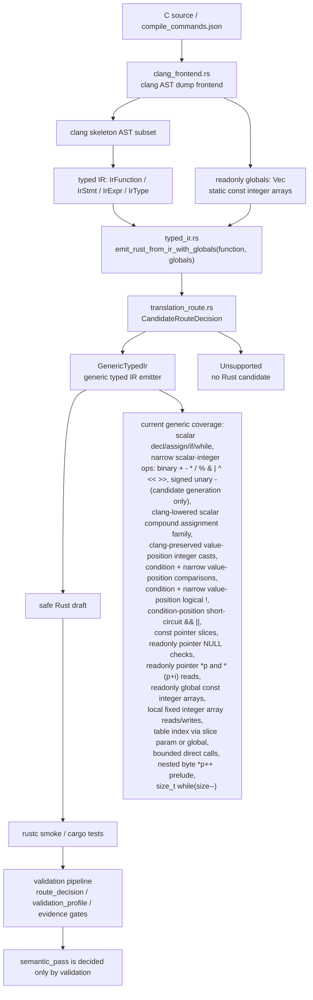

# Core Translation Architecture

This page records the current `c-to-rust` core translation pipeline, key code locations, and FlashDB crc32 generic-emitter progress. The Chinese mirror is `core-translation-architecture.md`.

## Architecture

## Core Code Map

- `crates/c2r-translator/src/clang_frontend.rs`
  - Reads real clang AST dump JSON.
  - Lowers supported C AST nodes into a compact clang skeleton.
  - Converts skeleton nodes into typed IR.
  - Also collects top-level `static const` fixed-length integer array initializers as `ClangLoweringReport.globals: Vec<IrGlobal>`.
  - It also lowers local fixed-length integer-array `InitListExpr` nodes into `IrExpr::ArrayLiteral`, limited to one-dimensional integer arrays whose initializer element count exactly matches the array length and whose elements are pure integer literals or integer casts around integer literals.
  - It lowers clang `NullToPointer` casts around integer zero into a typed IR null pointer literal for narrow pointer-parameter presence checks.
  - It preserves clang `IntegralCast` / `IntegralPromotion` wrappers in declaration initializers, assignment RHS, and return values via `value_expr_skeleton_from_ast`, so the typed IR emitter can prove and emit integer `as` casts instead of silently dropping mixed signedness literals.
  - Important functions: `lower_function_from_clang_ast_dump_report`, `lower_function_from_clang_parse_spec_report`, `readonly_globals_from_ast`, `readonly_global_from_toplevel_var_decl`, `integer_literal_init_list_values`, `value_expr_skeleton_from_ast`, `expr_skeleton_from_ast_with_options`, `init_list_expr_skeleton_from_ast`, `lower_stmt`, `lower_expr`.
- `crates/c2r-translator/src/typed_ir.rs`
  - Defines `IrFunction`, `IrStmt`, `IrExpr`, `IrType`, `IrGlobal`, and `IrGlobalInit`.
  - `emit_rust_from_ir()` remains the no-globals compatibility entrypoint.
  - `emit_rust_from_ir_with_globals(function, globals)` is the main entrypoint for the clang lowering path and returns `EmittedRust { rust, route }`.
  - The generic emitter now emits readonly global integer arrays as Rust `const` items and supports table indexing such as `CRC32_TABLE[...]`.
  - The generic emitter also supports typed IR local fixed-length integer array literals, index reads, and local array element assignment, emitting Rust local `[T; N]` arrays and `let mut` when an element is written.
  - The generic emitter supports a narrow readonly pointer null-presence surface: `const int *values; return values != NULL;` becomes `values: Option<&[i32]>` plus `.is_some()`. The same nullable parameter is rejected if it is used outside direct null comparisons.
  - The generic emitter supports narrow readonly pointer dereference reads: `const uint8_t *p; return *p;` becomes `p: &[u8]` and `return p[0usize];`, while bounded offset-deref reads such as `return *(p+i);` / `return *(i+p);` become `return p[i as usize];`. This covers only readonly integer pointers with a direct read or a side-effect-free integer offset; other pointer arithmetic, mutable pointers, pointer writes, and nullable pointer index/deref after a null check still fail closed.
  - The typed IR legacy crc32 matcher, canned emitter, and `DeprecatedLegacyCrc32` fallback have been removed. A crc32 IR without modeled globals now fails closed instead of silently using a template.
- `crates/c2r-translator/src/translation_route.rs`
  - Defines route metadata for typed IR candidate generation.
  - `GenericTypedIr` is the normal typed IR emitter.
  - `Unsupported` means no Rust candidate; the error keeps route metadata and the fail-closed reason.
- `crates/c2r-translator/src/lib.rs`
  - `try_translate_slice_with_clang_lowered_ir()` passes both `ClangLoweringReport.function_ir` and `report.globals` into `emit_rust_from_ir_with_globals()`.
  - `write_translation_artifacts()` can produce a Rust draft driven by clang-lowered typed IR when the `clang-lowering-report` feature is enabled.
  - The `clang-lowering-report` artifact now includes `typed_ir_candidate`, recording the `CandidateRouteDecision`, readonly globals summary, and the `semantic_pass=false` boundary.
  - Bounded direct identifier calls in clang-lowered typed IR now populate `plan.call_expressions`; `auto_migrate.py` maps that into `translation_summary.call_expressions` and context-pack `direct_call_edges`, and adds `callee_signature_id` / `call_edge_to_callee_binding` when the slice spec declares an external direct callee. This is signature/call-edge/source-binding provenance only; it hardens evidence consistency and does not raise `semantic_pass`.
  - The old string translator crc32 byte-cursor recognizer and local `emit_crc32_byte_cursor_rust()` have been removed. The raw string path now fails closed on unmodeled side effects such as `*p++` / `size--` and no longer emits the `crc32_update_byte()` template. The positive FlashDB crc32 Rust draft comes only from clang-lowered typed IR + readonly globals + `GenericTypedIr`.
- `validation/tools/auto_migrate.py`
  - Newly generated `route_decision.candidate_generation.typed_ir` binds the typed IR candidate route, readonly globals identity, and Rust draft provenance from the clang-lowering-report artifact.
  - Newly generated `validation_profile.candidate_generation` repeats the same binding while keeping `generated_draft_semantic_pass=false`.
  - `typed_ir.status=generated` with route `GenericTypedIr` acts as a typed IR route signal; if the slice is scalar-only and `token_cost=0`, it routes as an L0 deterministic candidate, otherwise generated typed IR remains at least an L1 signal. `typed_ir.status=unsupported` preserves the reason and acts as an L2 repair/baseline route signal. Hard-refuse conditions, `alias_blocked`, `requires_noalias_contract`, and unknown pointer-ownership floors still take priority; typed IR provenance stays in the rationale but cannot override those risk floors.
- `validation/auto-translation-template/*-schema.json`
  - `candidate_generation` remains optional for older route/profile evidence so legacy fixtures stay compatible.
  - Once `candidate_generation.typed_ir` is present, the schema allows only the `GenericTypedIr` / `Unsupported` typed IR routes and requires `semantic_pass=false`.
  - Legacy route/profile payloads may omit `candidate_generation`, but semantic-pass fixtures still must include `c2rust_baseline`, `route_decision`, and `validation_profile` refs.
- `validation/tools/validate_auto_translation_evidence.py`
  - Validates that typed IR candidate binding matches the clang-lowering-report artifact and rejects any candidate evidence claiming `semantic_pass=true`.
  - When the slice spec declares an external direct callee, both the default validation path and `--require-semantic-pass` check spec `external_direct_callees` / `signature_ref` / `source_files` against plan `translation_summary.call_expressions`, context-pack `direct_call_edges`, `callee_sources`, `signature_bindings`, and every `call_edge_to_callee_binding`; missing call sites, source-hash drift, signature-shape drift, `callee_signature_id` drift, missing bindings, or stub/semantics-boundary drift fail closed.
  - `--require-semantic-pass` also requires legacy accepted auto-translation fixtures to persist baseline/route/profile refs, cache identities, schema-aware diff metadata, and negative-diff mutation evidence. Helper-only test backfill is not a substitute for committed evidence.
- `crates/c2r-translator/tests/bounded_translation.rs`
  - Main behavior contract for the bounded translator.
  - Covers direct typed IR tests, real clang AST smoke tests, the real FlashDB crc32 parse spec, fail-closed boundaries, and rustc smoke compilation.
- `CONTEXT.md`
  - Chronological handoff log for this branch.
  - Use the latest numbered section first when resuming work.

## Current Core Translation Status

The typed IR candidate generation layer now has two explicit outcomes:

- `GenericTypedIr`: the generic typed IR emitter. Real FlashDB `fdb_calc_crc32` now reaches this route through clang lowering plus globals and passes rustc smoke.
- `Unsupported`: no Rust candidate; the error carries route metadata and the fail-closed reason.

The typed IR `CandidateRouteDecision` selects the candidate generation implementation only. It does not decide `semantic_pass`. New route/profile evidence binds it into `route_decision.candidate_generation.typed_ir` and `validation_profile.candidate_generation` as provenance; route decision may use it to distinguish the scalar-only `token_cost=0` L0 deterministic typed IR path, the non-scalar L1 generic typed IR path, and the L2 typed IR unsupported repair path; existing route/profile evidence that does not yet carry the field remains accepted for legacy compatibility. Acceptance still belongs to validation profile gates such as C oracle, Rust replay, schema diff, negative diff, unsafe ledger, and final verification. Legacy compatibility covers optional fields only, not semantic-pass refs: `c2rust_baseline`, `route_decision`, `validation_profile`, schema-aware diff evidence, and negative-diff evidence must be persisted and consistently cross-referenced.

Generic typed IR emission now covers:

- scalar declarations, assignment, return, `if`, and `while`;
- scalar integer binary expressions `+`, `-`, `*`, `/`, `%`, `&`, `|`, `^`, `<<`, and `>>`;
- signed scalar integer unary minus `-value`;
- clang-lowered simple scalar compound assignment family: `+=`, `-=`, `*=`, `/=`, `%=`, `&=`, `|=`, `^=`, `<<=`, and `>>=` desugar to `x = x op rhs` only for standalone statements with a simple scalar variable target, and only when clang `type`, `computeLHSType`, and `computeResultType` all match the target type;
- clang-preserved value-position integer implicit casts in declaration initializers, assignment RHS, and return values, for example `uint32_t value = 1; value = 2; return 3;` can lower into typed IR casts that emit `(1i32 as u32)`, `(2i32 as u32)`, and `(3i32 as u32)` when the source and target are supported integer types;
- comparison expressions in conditions and narrow value positions: `if` / `while` conditions emit Rust bool conditions, while value positions such as `return x > 0`, `out = x == y`, and `int ok = x != 0` materialize C `int` 0/1 results;
- logical not `!expr` in conditions and narrow value positions: `if (!value)` / `while (!value)` emit `value == 0`, `!(value > 0)` emits a negated comparison condition, and value positions such as `return !value`, assignment RHS, or declaration initializer emit C `int` 0/1 materialization such as `if value == 0 { 1i32 } else { 0i32 }`;
- short-circuit `&&` / `||` in condition positions: `if (left && right)` / `while (left || right)` emit Rust bool conditions, and each operand recursively reuses the current `emit_condition_expr()` subset for integer truthiness, comparisons, logical-not, readonly deref, and bounded offset-deref reads;
- initialized scalar locals from clang AST;
- no-brace `if` / `while` bodies from clang AST;
- readonly integer pointer parameters as Rust slices, for example `const uint32_t *table -> table: &[u32]`;
- readonly integer pointer parameter null-presence checks, for example `const int *values; return values != NULL; -> values: Option<&[i32]>` and `values.is_some()`; the nullable parameter must be used only in direct `== NULL` / `!= NULL` comparisons;
- readonly integer pointer parameter dereference reads, for example `const uint8_t *p; return *p; -> p: &[u8]` and `return p[0usize];`, plus bounded offset-deref reads such as `return *(p+i);` / `return *(i+p); -> return p[i as usize];`; the same reads can also act as ordinary scalar reads in comparison/logical-not candidate generation, for example `*p == 0`, `*(p+i) == 0`, `!*p`, and `!*(p+i)`;
- `static const` readonly integer array initializers as Rust `const`, for example `crc32_table[] -> const CRC32_TABLE: [u32; 256]`;
- clang-lowered typed IR local fixed-length integer array literals, index reads, and element writes, for example `uint32_t table[3] = {1,2,3}; table[i] = value; return table[i]; -> let mut table: [u32; 3] = ...; table[i as usize] = value;`; only initializer elements canonicalized by clang AST to pure integer literals/casts are supported, and writes must target a declared local fixed-length integer array. Partial-initializer zero fill, nested arrays, struct arrays, non-literal or side-effecting initializers, VLAs, incomplete arrays, writes to readonly global arrays, writes to const pointer slices, and array-to-pointer decay still fail closed;
- `const void *buf` as `&[u8]` only when a proven `const uint8_t *p` cursor and byte read exist;
- nested byte cursor reads such as `(uint32_t)*p++` through prelude temporaries;
- assignment RHS prelude, covering `crc = table[(crc ^ (uint32_t)*p++) & 0xff] ^ (crc >> 8);`;
- bounded direct identifier calls: only direct function-name callees proven by clang `referencedDecl.kind=FunctionDecl`, covering call statements, declaration initializers, assignment RHS, and return values, while emitting callee, arguments, source expression, and statement context into `call_expressions` evidence; when the slice spec declares an external direct callee, the validator also requires every plan/context/binding call site and signature to match; nested calls, function-pointer callees, callees without `FunctionDecl` proof, calls anywhere inside condition expression trees, and inc/dec or dereference arguments still fail closed;
- narrow `size_t` postfix-decrement while conditions, lowering `while (size--)` into a Rust `loop` that preserves postfix side effects.

Still incomplete:

- The current work proves candidate generation plus rustc smoke and binds candidate provenance into route/profile evidence; raw string crc32 byte-cursor input now stays fail-closed. It is not semantic acceptance for the real FlashDB slice.
- `*`, `/`, and `%` are narrow scalar-integer candidate generation only. They do not claim division-by-zero support, full C arithmetic, floating-point arithmetic, complete usual arithmetic conversions, overflow/UB parity, or pointer arithmetic. Division/modulo can only move toward semantic acceptance when the non-zero divisor is established by a literal, fixture input domain, or slice contract.
- Bitwise OR / left shift are narrow scalar-integer candidate generation only. Current `|` requires both operands and the result to share one scalar integer type, and `<<` follows the shift rule requiring lhs/result type agreement; this does not claim full C bitwise/shift semantics, usual arithmetic conversions, invalid shift counts, signed shift/overflow UB parity, pointer arithmetic, or semantic acceptance.
- Signed unary minus is also narrow candidate generation only. It requires the operand and result to be the same signed integer scalar type; unsigned or wrapping negation, floating-point negation, pointer arithmetic, compound `-=`, and literal edge cases such as `-2147483648` remain outside this subset until modeled explicitly.
- The compound assignment family is clang-lowered candidate generation only. It covers only standalone statements with simple scalar variable targets. `*p += y`, `a[i] += y`, `s.f += y`, `p->f += y`, value-position `(x += y)`, compound assignment in conditions or call arguments, promotion/truncation cases where compute types differ from the target type, pointer arithmetic, floating-point, volatile, complex RHS side effects, and semantic acceptance still fail closed.
- Value-position implicit cast preservation is clang-lowered candidate generation only. It preserves only clang `IntegralCast` / `IntegralPromotion` nodes in declaration initializers, assignment RHS, and return values, and the typed IR emitter still requires supported integer source and target types. Function-pointer decay, pointer casts outside existing explicit byte-cursor handling, floating-point casts, hidden side-effect conversions, casts whose result still mismatches the statement boundary, and full usual scalar conversions still fail closed.
- Comparison expressions are candidate generation only, and both condition positions and narrow value positions keep `semantic_pass=false`. Current support covers narrow scalar-integer comparisons, C `int` 0/1 materialization, comparison operands with integral casts whose source and target are supported integer types and whose post-cast operand types match exactly, readonly integer pointer-parameter null presence checks, readonly direct deref read operands, and bounded readonly offset-deref read operands. Arbitrary pointer arithmetic beyond the bounded readonly `*(p+i)` read, arbitrary pointer comparison, floating-point comparison, mixed-width/unsigned conversions that are not aligned by clang-preserved or explicit integer casts, call/inc/dec side-effect operands, pointer truthiness, pointer null checks followed by dereference/index use, full usual scalar conversions, and semantic acceptance still fail closed.
- Logical not is candidate generation only, and both condition positions and narrow value positions keep `semantic_pass=false`. Current support covers integer zero checks, negated comparison conditions, readonly direct deref read operands, bounded readonly offset-deref read operands, and C `int` 0/1 materialization; it is not full C unary `!`, and operands containing calls, inc/dec, unmodeled deref side effects, pointer truthiness, pointer null checks outside the narrow readonly pointer-parameter presence surface, floating-point truthiness, unsupported types, value-position short-circuit logic, or full usual scalar conversions still fail closed.
- Short-circuit `&&` / `||` is candidate generation only and currently covers condition positions only, with a required C `int` result type. `return a && b`, assignment RHS, declaration initializer, operands containing calls/inc/dec/side effects, pointer truthiness, floating-point truthiness, unsupported types, and cases requiring full usual scalar conversions still fail closed.
- Complex function pointers, unmodeled alias writes, volatile/hardware registers, macro side effects, and cross-thread/interrupt semantics should still fail closed or route higher.

## Next Implementation Cut

1. Keep extending generic typed IR coverage with red tests first. Good next cuts are pure scalar `ConditionalOperator` / `?:` with a first-class lazy `IrExpr::Conditional`, or `ForStmt` with an explicit scope model. Condition-position `&&` / `||`, the simple scalar compound assignment family, and value-position integer implicit cast preservation now have direct/skeleton/real-clang smoke coverage. The bounded readonly `*(p+i)` read should stay covered by real-clang and fail-closed boundary tests, while arbitrary pointer arithmetic, arbitrary pointer comparison, floating-point comparison, unmodeled mixed-width conversions, side-effect operands, and semantic acceptance must continue to fail closed.
2. Run full C/Rust oracle, negative diff, unsafe ledger, and final verification for the real FlashDB crc32 slice.
3. Keep the raw string crc32 byte-cursor fail-closed regression coverage so the `crc32_update_byte()` template and `crc32-byte-cursor-loop` rule are not reintroduced.
