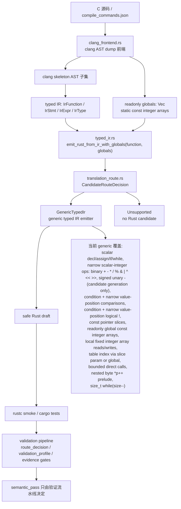

# 核心翻译架构

本页记录当前 `c-to-rust` 核心翻译链路、关键代码位置和 FlashDB crc32 泛化进度。英文镜像见 `core-translation-architecture.en.md`。

## 架构图

## 核心代码位置

- `crates/c2r-translator/src/clang_frontend.rs`
  - 读取真实 clang AST dump JSON。
  - 把支持的 C AST 节点 lowering 成紧凑的 clang skeleton。
  - 把 skeleton 节点转换成 typed IR。
  - 现在还会收集顶层 `static const` 固定长度整数数组 initializer，输出为 `ClangLoweringReport.globals: Vec<IrGlobal>`。
  - 现在也会把局部固定长度整数数组 `InitListExpr` lowering 成 `IrExpr::ArrayLiteral`，但只接受元素数量等于数组长度、且元素为纯整数字面量或整型 cast 包裹整数字面量的一维整数数组。
  - 关键函数：`lower_function_from_clang_ast_dump_report`、`lower_function_from_clang_parse_spec_report`、`readonly_globals_from_ast`、`readonly_global_from_toplevel_var_decl`、`integer_literal_init_list_values`、`expr_skeleton_from_ast_with_options`、`init_list_expr_skeleton_from_ast`、`lower_stmt`、`lower_expr`。
- `crates/c2r-translator/src/typed_ir.rs`
  - 定义 `IrFunction`、`IrStmt`、`IrExpr`、`IrType`、`IrGlobal`、`IrGlobalInit`。
  - `emit_rust_from_ir()` 仍保留无 globals 的兼容入口。
  - `emit_rust_from_ir_with_globals(function, globals)` 是 clang lowering 路径的核心入口，会生成 `EmittedRust { rust, route }`。
  - generic emitter 已支持 readonly global const integer array 的 Rust `const` 输出和 `CRC32_TABLE[...]` 形式的下标访问。
  - generic emitter 也支持 typed IR 层的局部固定长度整数数组字面量、下标读取和局部数组元素赋值，生成 Rust `[T; N]` 局部数组，并在元素被写入时发射 `let mut`。
  - typed IR 层的旧 crc32 matcher、canned emitter 和 `DeprecatedLegacyCrc32` fallback 已删除；无 globals 的 crc32 IR 会 fail closed，而不是偷偷走模板。
- `crates/c2r-translator/src/translation_route.rs`
  - 定义 typed IR candidate generation 的 route 元数据。
  - `GenericTypedIr` 表示通用 typed IR emitter。
  - `Unsupported` 表示没有 Rust candidate；错误中保留 route metadata 和 fail-closed reason。
- `crates/c2r-translator/src/lib.rs`
  - `try_translate_slice_with_clang_lowered_ir()` 把 `ClangLoweringReport.function_ir` 和 `report.globals` 一起传入 `emit_rust_from_ir_with_globals()`。
  - `write_translation_artifacts()` 在 `clang-lowering-report` feature 下可以写出由 clang-lowered typed IR 驱动的 Rust draft。
  - `clang-lowering-report` artifact 现在包含 `typed_ir_candidate`，记录 `CandidateRouteDecision`、readonly globals 摘要和 `semantic_pass=false` 边界。
  - clang-lowered typed IR 中的 bounded direct identifier call 现在会写入 `plan.call_expressions`；`auto_migrate.py` 会继续映射到 `translation_summary.call_expressions` 和 context-pack `direct_call_edges`，并在 slice spec 声明 external direct callee 时补 `callee_signature_id` / `call_edge_to_callee_binding`。这是 signature/call-edge/source binding provenance，只加固证据一致性，不提升 `semantic_pass`。
  - 旧字符串 translator 中的 crc32 byte-cursor recognizer 和本地 `emit_crc32_byte_cursor_rust()` 已删除；raw string 路径遇到 `*p++` / `size--` 这类未建模副作用会 fail closed，不再生成 `crc32_update_byte()` 模板。FlashDB crc32 的正向 Rust draft 只来自 clang-lowered typed IR + readonly globals + `GenericTypedIr`。
- `validation/tools/auto_migrate.py`
  - 新生成的 `route_decision.candidate_generation.typed_ir` 绑定 clang-lowering-report 中的 typed IR candidate route、readonly globals identity 和 Rust draft provenance。
  - 新生成的 `validation_profile.candidate_generation` 复述同一绑定，但仍保持 `generated_draft_semantic_pass=false`。
  - `typed_ir.status=generated` 且 route 为 `GenericTypedIr` 时作为 typed IR route signal；如果当前 slice 是 scalar-only 且 `token_cost=0`，它走 L0 deterministic candidate route；否则 generated typed IR 仍至少是 L1 signal。`typed_ir.status=unsupported` 会保留原因并作为 L2 repair/baseline route signal。硬拒绝条件、`alias_blocked`、`requires_noalias_contract` 和未知 pointer ownership floor 仍优先；typed IR provenance 会保留在 rationale 中，但不能覆盖这些风险 floor。
- `validation/auto-translation-template/*-schema.json`
  - `candidate_generation` 对旧 route/profile evidence 保持可选，避免破坏 legacy fixtures。
  - 一旦出现 `candidate_generation.typed_ir`，schema 只允许 `GenericTypedIr` / `Unsupported` 两条 typed IR route，并要求 `semantic_pass=false`。
  - 注意：旧 route/profile payload 可以不带 `candidate_generation`，不等于 semantic-pass fixture 可以缺 `c2rust_baseline`、`route_decision`、`validation_profile` refs。
- `validation/tools/validate_auto_translation_evidence.py`
  - 校验 typed IR candidate binding 必须与 clang-lowering-report 一致，并拒绝任何 `semantic_pass=true` 的 candidate 证据。
  - 当 slice spec 声明 external direct callee 时，默认校验路径和 `--require-semantic-pass` 都会把 spec 的 `external_direct_callees` / `signature_ref` / `source_files` 与 plan `translation_summary.call_expressions`、context-pack `direct_call_edges`、`callee_sources`、`signature_bindings` 和逐条 `call_edge_to_callee_binding` 做一致性校验；缺 call site、source hash 漂移、signature shape 漂移、`callee_signature_id` 漂移、binding 漏项或 stub/semantics 边界漂移都会 fail closed。
  - `--require-semantic-pass` 还要求 legacy accepted auto-translation fixtures 持久化 baseline/route/profile refs、cache identities、schema-aware diff metadata 和 negative-diff mutation evidence；测试 helper 临时补字段不能替代落盘 evidence。
- `crates/c2r-translator/tests/bounded_translation.rs`
  - bounded translator 的主要行为契约。
  - 覆盖直接 typed IR 测试、真实 clang AST smoke、真实 FlashDB crc32 parse spec、fail-closed 边界和 rustc smoke 编译。
- `CONTEXT.md`
  - 当前分支的时间顺序交接日志。
  - 恢复开发时优先看最新编号章节。

## 当前核心翻译状态

当前 typed IR candidate generation 层有两类清晰结果：

- `GenericTypedIr`：通用 typed IR emitter，当前真实 FlashDB `fdb_calc_crc32` 在 clang lowering + globals 路径下已经能走到这里并通过 rustc smoke。
- `Unsupported`：没有 Rust candidate，错误中带 fail-closed reason 和 route metadata。

注意：typed IR `CandidateRouteDecision` 只选择候选生成实现，不决定 `semantic_pass`。新 route/profile evidence 会把它绑定进 `route_decision.candidate_generation.typed_ir` 和 `validation_profile.candidate_generation`，作为 provenance；route decision 可以用它区分 scalar-only `token_cost=0` 的 L0 deterministic typed IR 路径、非 scalar 的 L1 generic typed IR 路径，以及 L2 typed IR unsupported repair 路径；存量 route/profile evidence 如果尚未带该字段，schema 仍按 legacy compatibility 接受。真正的接受结论仍由 validation profile、C oracle、Rust replay、schema diff、negative diff、unsafe ledger、final verification 等 gates 决定。legacy compatibility 只覆盖可选字段，不覆盖 semantic-pass refs：`c2rust_baseline`、`route_decision`、`validation_profile`、schema-aware diff 和 negative-diff evidence 必须真实落盘并互相引用一致。

generic typed IR emission 现在覆盖：

- scalar declaration、assignment、return、`if`、`while`；
- 标量整数二元表达式 `+`、`-`、`*`、`/`、`%`、`&`、`|`、`^`、`<<`、`>>`；
- signed 标量整数 unary minus `-value`；
- comparison expression 的条件位置和窄 value-position：`if` / `while` 条件继续发 Rust bool condition；`return x > 0`、`out = x == y`、`int ok = x != 0` 等 value-position 生成 C `int` 0/1 materialization；
- logical not `!expr` 的条件位置和窄 value-position：`if (!value)` / `while (!value)` 生成 `value == 0`，`!(value > 0)` 生成反转后的 comparison condition；`return !value`、assignment RHS 和 declaration initializer 等 value-position 生成 C `int` 0/1 materialization，例如 `if value == 0 { 1i32 } else { 0i32 }`；
- 来自 clang AST 的 initialized scalar local；
- 来自 clang AST 的无大括号 `if` / `while` body；
- readonly integer pointer parameter 到 Rust slice，例如 `const uint32_t *table -> table: &[u32]`；
- `static const` readonly integer array initializer 到 Rust `const`，例如 `crc32_table[] -> const CRC32_TABLE: [u32; 256]`；
- clang-lowered typed IR 的局部固定长度整数数组字面量、下标读取和元素写入，例如 `uint32_t table[3] = {1,2,3}; table[i] = value; return table[i]; -> let mut table: [u32; 3] = ...; table[i as usize] = value;`；只支持 clang AST 中已规整为纯整数字面量/cast 的 initializer 元素，且写入目标必须是已声明的局部固定长度整数数组。partial initializer zero-fill、nested array、struct array、非 literal 或有副作用的 initializer、VLA/incomplete array、readonly global array 写入、const pointer slice 写入和 array-to-pointer decay 仍 fail closed；
- 当已经证明存在 `const uint8_t *p` byte cursor 和 byte read 时，把 `const void *buf` 翻译成 `&[u8]`；
- 通过 prelude temporary 支持嵌套 byte cursor read，例如 `(uint32_t)*p++`；
- assignment RHS prelude，覆盖 `crc = table[(crc ^ (uint32_t)*p++) & 0xff] ^ (crc >> 8);`；
- bounded direct identifier call：只支持 clang `referencedDecl.kind=FunctionDecl` 的直接函数名 callee，覆盖 call statement、decl init、assignment RHS 和 return value，并把 callee、arguments、source expression、statement context 写入 `call_expressions` 证据；如果 slice spec 声明 external direct callee，validator 还要求 plan/context/binding 的每个 call site 和 signature 逐条一致；嵌套 call、函数指针 callee、缺少 `FunctionDecl` 证明的 callee、condition 表达式全树中的 call、inc/dec 或 deref 参数继续 fail closed；
- 窄化的 `size_t` postfix-decrement while condition，把 `while (size--)` lowering 成保留 postfix side effect 的 Rust `loop`。

仍未完成：

- 当前只是候选生成链路能生成并编译 Rust，并且 route/profile 已绑定 candidate provenance；raw string crc32 byte-cursor 输入现在保持 fail-closed。真实 FlashDB slice 的 semantic acceptance 仍需要完整 validation gates。
- `*`、`/`、`%` 只表示窄化标量整数 candidate generation。不能据此声明支持除零、全部 C 算术、浮点算术、完整 usual arithmetic conversions、overflow/UB parity 或指针算术；除法/取模只有在 divisor 非零由 literal、fixture 输入域或 slice contract 明确约束时，才可进入 semantic acceptance 讨论。
- bitwise OR / left shift 只表示窄化标量整数 candidate generation。当前 `|` 要求左右 operand 和 result 是同一个标量整数类型，`<<` 沿用 shift 规则要求 lhs/result 类型一致；它不声明完整 C 位运算/位移语义、usual arithmetic conversions、无效 shift count、signed shift/overflow UB parity、指针算术或 semantic acceptance。
- signed unary minus 也只是窄化 candidate generation。它要求 operand/result 是同一个 signed integer scalar type；unsigned 或 wrapping 取负、浮点取负、指针算术、复合 `-=`、以及 `-2147483648` 这类 literal 边界仍未建模，必须继续 fail closed。
- comparison expression 只是 candidate generation，条件位置和窄 value-position 都保持 `semantic_pass=false`。当前覆盖窄化标量整数比较、C `int` 0/1 materialization，以及 comparison operand 上 source/target 都是可发射整数类型且 cast 后两侧类型完全一致的 integral cast；pointer comparison、float comparison、未由显式整数 cast 对齐的 mixed-width/unsigned conversions、side-effect operands、short-circuit `&&` / `||`、完整 usual scalar conversions 和 semantic acceptance 继续 fail closed。
- logical not 只是 candidate generation，条件位置和窄 value-position 都保持 `semantic_pass=false`。当前只覆盖整数零比较、反转 comparison condition，以及 C `int` 0/1 结果 materialization；它不是完整 C unary `!`，operand 含 call、inc/dec、未建模 deref/side effect、pointer null test、float truthiness、unsupported type、短路逻辑或完整 usual scalar conversions 时继续 fail closed。
- 复杂函数指针、未建模 alias write、volatile/硬件寄存器、宏副作用和跨线程/中断语义仍应 fail closed 或进入更高路线。

## 下一步实现切口

1. 继续用红测优先扩展 generic typed IR 的标量表达式覆盖；当前更适合的后续切口是明确 usual-conversion 分类，而不是把 short-circuit、pointer/null comparison 或完整 C shift 语义混进同一刀。后续仍要让 pointer comparison、float comparison、未建模 mixed-width conversions、side-effect operands、short-circuit `&&` / `||` 和 semantic acceptance fail closed。
2. 对真实 FlashDB crc32 跑完整 C/Rust oracle、negative diff、unsafe ledger 和 final verification。
3. 保留 raw string crc32 byte-cursor fail-closed 回归测试，避免 `crc32_update_byte()` 模板或 `crc32-byte-cursor-loop` rule 被重新引入。
