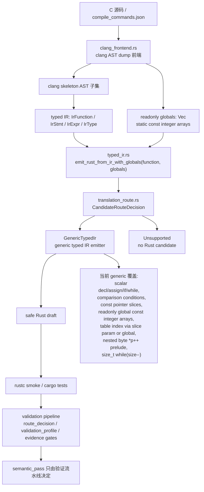

# 核心翻译架构

本页记录当前 `c-to-rust` 核心翻译链路、关键代码位置和 FlashDB crc32 泛化进度。英文镜像见 `core-translation-architecture.en.md`。

## 架构图

## 核心代码位置

- `crates/c2r-translator/src/clang_frontend.rs`
  - 读取真实 clang AST dump JSON。
  - 把支持的 C AST 节点 lowering 成紧凑的 clang skeleton。
  - 把 skeleton 节点转换成 typed IR。
  - 现在还会收集顶层 `static const` 固定长度整数数组 initializer，输出为 `ClangLoweringReport.globals: Vec<IrGlobal>`。
  - 关键函数：`lower_function_from_clang_ast_dump_report`、`lower_function_from_clang_parse_spec_report`、`readonly_globals_from_ast`、`readonly_global_from_toplevel_var_decl`、`integer_literal_init_list_values`、`expr_skeleton_from_ast_with_options`、`lower_stmt`、`lower_expr`。
- `crates/c2r-translator/src/typed_ir.rs`
  - 定义 `IrFunction`、`IrStmt`、`IrExpr`、`IrType`、`IrGlobal`、`IrGlobalInit`。
  - `emit_rust_from_ir()` 仍保留无 globals 的兼容入口。
  - `emit_rust_from_ir_with_globals(function, globals)` 是 clang lowering 路径的核心入口，会生成 `EmittedRust { rust, route }`。
  - generic emitter 已支持 readonly global const integer array 的 Rust `const` 输出和 `CRC32_TABLE[...]` 形式的下标访问。
  - typed IR 层的旧 crc32 matcher、canned emitter 和 `DeprecatedLegacyCrc32` fallback 已删除；无 globals 的 crc32 IR 会 fail closed，而不是偷偷走模板。
- `crates/c2r-translator/src/translation_route.rs`
  - 定义 typed IR candidate generation 的 route 元数据。
  - `GenericTypedIr` 表示通用 typed IR emitter。
  - `Unsupported` 表示没有 Rust candidate；错误中保留 route metadata 和 fail-closed reason。
- `crates/c2r-translator/src/lib.rs`
  - `try_translate_slice_with_clang_lowered_ir()` 把 `ClangLoweringReport.function_ir` 和 `report.globals` 一起传入 `emit_rust_from_ir_with_globals()`。
  - `write_translation_artifacts()` 在 `clang-lowering-report` feature 下可以写出由 clang-lowered typed IR 驱动的 Rust draft。
  - `clang-lowering-report` artifact 现在包含 `typed_ir_candidate`，记录 `CandidateRouteDecision`、readonly globals 摘要和 `semantic_pass=false` 边界。
  - 旧字符串 translator 仍保留一个 crc32 byte-cursor 模板路径，位置是 `is_crc32_byte_cursor_loop()` 和本地 `emit_crc32_byte_cursor_rust()`；它不再桥接 typed IR，也不再记录 `typed-ir-crc32-emitter` provenance。
- `validation/tools/auto_migrate.py`
  - `route_decision.candidate_generation.typed_ir` 绑定 clang-lowering-report 中的 typed IR candidate route、readonly globals identity 和 Rust draft provenance。
  - `validation_profile.candidate_generation` 复述同一绑定，但仍保持 `generated_draft_semantic_pass=false`。
- `validation/tools/validate_auto_translation_evidence.py`
  - 校验 typed IR candidate binding 必须与 clang-lowering-report 一致，并拒绝任何 `semantic_pass=true` 的 candidate 证据。
- `crates/c2r-translator/tests/bounded_translation.rs`
  - bounded translator 的主要行为契约。
  - 覆盖直接 typed IR 测试、真实 clang AST smoke、真实 FlashDB crc32 parse spec、fail-closed 边界和 rustc smoke 编译。
- `CONTEXT.md`
  - 当前分支的时间顺序交接日志。
  - 恢复开发时优先看最新编号章节。

## 当前核心翻译状态

当前 typed IR candidate generation 层有两类清晰结果：

- `GenericTypedIr`：通用 typed IR emitter，当前真实 FlashDB `fdb_calc_crc32` 在 clang lowering + globals 路径下已经能走到这里并通过 rustc smoke。
- `Unsupported`：没有 Rust candidate，错误中带 fail-closed reason 和 route metadata。

注意：typed IR `CandidateRouteDecision` 只选择候选生成实现，不决定 `semantic_pass`。它现在会被绑定进 `validation/tools/auto_migrate.py` 的 `route_decision.candidate_generation.typed_ir` 和 `validation_profile.candidate_generation`，作为 provenance；真正的接受结论仍由 validation profile、C oracle、Rust replay、schema diff、negative diff、unsafe ledger、final verification 等 gates 决定。

generic typed IR emission 现在覆盖：

- scalar declaration、assignment、return、`if`、`while`；
- 只允许出现在条件中的 comparison expression；
- 来自 clang AST 的 initialized scalar local；
- 来自 clang AST 的无大括号 `if` / `while` body；
- readonly integer pointer parameter 到 Rust slice，例如 `const uint32_t *table -> table: &[u32]`；
- `static const` readonly integer array initializer 到 Rust `const`，例如 `crc32_table[] -> const CRC32_TABLE: [u32; 256]`；
- 当已经证明存在 `const uint8_t *p` byte cursor 和 byte read 时，把 `const void *buf` 翻译成 `&[u8]`；
- 通过 prelude temporary 支持嵌套 byte cursor read，例如 `(uint32_t)*p++`；
- assignment RHS prelude，覆盖 `crc = table[(crc ^ (uint32_t)*p++) & 0xff] ^ (crc >> 8);`；
- 窄化的 `size_t` postfix-decrement while condition，把 `while (size--)` lowering 成保留 postfix side effect 的 Rust `loop`。

仍未完成：

- 旧字符串 translator 里仍有 crc32 byte-cursor recognizer 和 canned Rust 模板；这是 legacy parser 路径，不是 typed IR fallback。
- 当前只是候选生成链路能生成并编译 Rust，并且 route/profile 已绑定 candidate provenance；真实 FlashDB slice 的 semantic acceptance 仍需要完整 validation gates。
- 复杂函数指针、未建模 alias write、volatile/硬件寄存器、宏副作用和跨线程/中断语义仍应 fail closed 或进入更高路线。

## 下一步实现切口

1. 对真实 FlashDB crc32 跑完整 C/Rust oracle、negative diff、unsafe ledger 和 final verification。
2. 单独清理旧字符串 translator 的 crc32 recognizer 和 canned 模板，或把它降级为明确的 legacy compatibility path。
3. 继续扩展 generic typed IR，而不是为 FlashDB 写专用逻辑。
