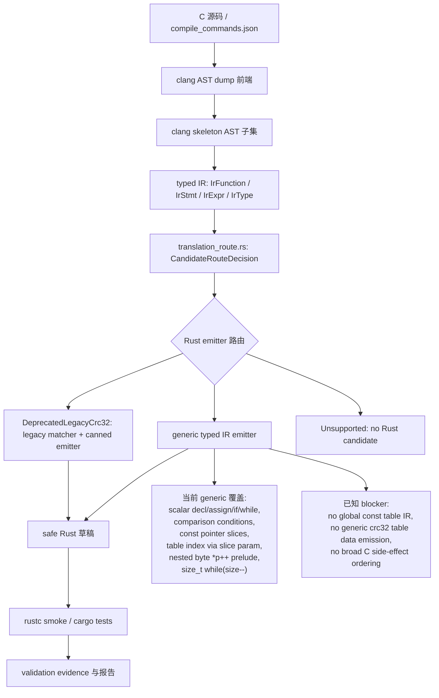

# 核心翻译架构

本页是中文版本，记录当前 `c-to-rust` 核心翻译链路、关键代码位置和 FlashDB crc32 泛化进度。英文版本见 `core-translation-architecture.en.md`。

## 架构图

## 核心代码位置

- `crates/c2r-translator/src/clang_frontend.rs`
  - 读取真实 clang AST dump JSON。
  - 把支持的 C AST 节点 lowering 成紧凑的 clang skeleton。
  - 把 skeleton 节点转换成 typed IR。
  - 关键函数：`expr_skeleton_from_ast_with_options`、`stmt_skeleton_from_ast`、`lower_function_from_clang_ast_dump_report`、`lower_stmt`、`lower_expr`。
- `crates/c2r-translator/src/typed_ir.rs`
  - 定义 `IrFunction`、`IrStmt`、`IrExpr`、`IrType`。
  - 从 typed IR 生成 Rust；`emit_rust_from_ir()` 现在返回 `EmittedRust { rust, route }`。
  - 关键函数：`emit_rust_from_ir`、`emit_scalar_rust_from_ir`、`emit_stmt`、`emit_expr_with_prelude`、`emit_post_increment_byte_read_expr`、`emit_postfix_decrement_while_loop`。
  - 旧 crc32 matcher 和 canned emitter 仍在这里：`is_crc32_byte_cursor_ir`、`emit_crc32_byte_cursor_rust`，但现在会被显式标记为 deprecated candidate route。
- `crates/c2r-translator/src/translation_route.rs`
  - 定义 typed IR candidate generation 的路由元数据。
  - `GenericTypedIr` 表示普通 typed IR emitter。
  - `DeprecatedLegacyCrc32` 表示当前保留的 crc32 canned path，删除条件由 `LEGACY_CRC32_DELETE_WHEN` 记录。
  - `Unsupported` 表示没有 Rust candidate；错误中保留 route metadata 和 fail-closed reason。
- `crates/c2r-translator/tests/bounded_translation.rs`
  - bounded translator 的主要行为契约。
  - 覆盖直接 typed IR 测试、真实 clang AST smoke 测试、fail-closed 边界和 rustc smoke 编译。
- `CONTEXT.md`
  - 当前分支的时间顺序交接日志。
  - 恢复开发时先看最新编号章节。

## 当前核心翻译状态

P0 后，Rust emitter route 不再只是隐藏在 `emit_rust_from_ir()` 里的 `if`。`translation_route.rs` 会返回 `CandidateRouteDecision`：

- `GenericTypedIr`：普通 typed IR emitter。
- `DeprecatedLegacyCrc32`：现有 crc32 canned path，显式标记为 deprecated。
- `Unsupported`：没有候选 Rust，错误中带 route metadata 和 fail-closed reason。

注意：candidate route 只选择候选生成实现，不决定 `semantic_pass`，也不替代 `validation/tools/auto_migrate.py` 里的 evidence `route_decision`。

generic typed IR emission 现在覆盖：

- scalar declaration、assignment、return、`if`、`while`；
- 只允许出现在条件中的 comparison expression；
- 来自 clang AST 的 initialized scalar local；
- 来自 clang AST 的无大括号 `if` / `while` body；
- readonly integer pointer parameter 到 Rust slice，例如 `const uint32_t *table -> table: &[u32]`；
- 当已经证明存在 `const uint8_t *p` byte cursor 和 byte read 时，把 `const void *buf` 翻译成 `&[u8]`；
- 通过 prelude temporary 支持嵌套 byte cursor read，例如 `(uint32_t)*p++`；
- assignment RHS prelude，足够覆盖 table 是 pointer parameter 时的 `crc = table[(crc ^ (uint32_t)*p++) & 0xffU] ^ (crc >> 8U);`；
- 窄化的 `size_t` postfix-decrement while condition，把 `while (size--)` lowering 成保留 postfix side effect 的 Rust `loop`。

仍未泛化：

- `static const uint32_t crc32_table[256]` 还没有显式 typed IR global-data model。
- 真实 FlashDB crc32 仍通过 `DeprecatedLegacyCrc32` legacy typed-IR shape matcher 和 canned Rust 路由。
- 在 `is_crc32_byte_cursor_ir` 和 `emit_crc32_byte_cursor_rust` 被删除、generic 路径通过前，项目不能声称“全程零 crc32 专用代码”。

## 下一步实现切口

下一刀应优先做显式 readonly global table 支持：

1. 增加 readonly global array 的 typed IR 表示，或增加携带 global table 的 translation context。
2. 让 `crc32_table[...]` 通过该 context 解析，而不是作为未声明 local。
3. 为 table data 或已验证的 external table binding 生成 Rust。
4. 让真实 FlashDB crc32 跑通 `generic typed IR emitter -> rustc smoke`。
5. 通过后再删除 legacy crc32 matcher 和 canned emitter。
