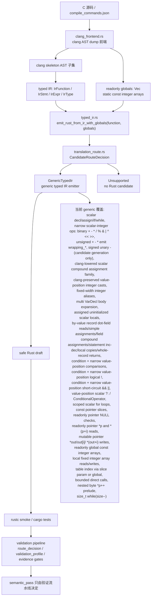

英文镜像见 `core-translation-architecture.en.md`。

# 核心翻译架构

本页记录当前 `c-to-rust` 核心翻译链路、关键代码位置和 FlashDB crc32 泛化进度。英文镜像见 `core-translation-architecture.en.md`。

## 架构图

## 核心代码位置

- `crates/c2r-translator/src/clang_frontend.rs`
  - 读取真实 clang AST dump JSON。
  - 把支持的 C AST 节点 lowering 成紧凑的 clang skeleton。
  - 把 skeleton 节点转换成 typed IR。
  - 现在通过 `type_from_qual_type()` 支持固定宽度整数 typedef aliases：`int8_t`、`int16_t`、`int32_t`、`int64_t`、`uint8_t`、`uint16_t`、`uint32_t`、`uint64_t`，并精确支持 `signed char` 作为 signed 8-bit integer；`short` / `long long` 等其他目标相关 spelling 仍不当作 fixed-width typedef。
  - 现在还会收集顶层 `static const` 固定长度整数数组 initializer，包含 clang 已语义化 `array_filler` 的受限 sparse/index-designated initializer，以及显式非负整数 enum 常量引用，输出为 `ClangLoweringReport.globals: Vec<IrGlobal>`；完整唯一命名、显式非负 `int` 常量、target ABI `int_width=32` 的 enum 标量类型会在 skeleton 边界降为 typed IR `i32`。
  - `compound_body_skeleton_from_ast()` 现在会把普通 compound body 中一个 `DeclStmt` 的多个简单 `VarDecl` 按源码顺序展开为多个 `ClangStmtSkeleton::Decl`；`for_init_stmt_skeletons_from_ast()` 对 `ForStmt` init 中的 `DeclStmt` 复用同一个多 `VarDecl` 展开 helper，assignment init 仍是一元素 vec。
  - 现在也会把局部固定长度整数数组 `InitListExpr` lowering 成 `IrExpr::ArrayLiteral`，支持连续 initializer 和 clang 已语义化 `array_filler` 的受限 sparse/index-designated initializer；仍只接受一维固定长度整数数组和纯整数字面量或整型 cast 包裹整数字面量。
  - 现在也会把 clang `NullToPointer` cast 包裹的整数零 lowering 成 typed IR null pointer literal，用于窄化的指针参数 presence check。
  - 现在会通过 `value_expr_skeleton_from_ast` 和二元 operand cast-preservation 保留 declaration initializer、assignment RHS、return value 和普通 binary operand 中的 clang `IntegralCast` / `IntegralPromotion` 包裹，让 typed IR emitter 能证明并发射整数 `as` cast，而不是静默丢掉 mixed signedness 或 promotion 信息。
  - 现在会把 `CompoundAssignOperator` 的 result type 和 compute type 带入 `ClangStmtSkeleton::CompoundAssign`，在 simple scalar variable target 和按值 record dot-field target 上支持 clang 已证明的窄化整数 promotion/truncation，同时继续拒绝 target/result 不一致和 compute-lhs/compute-result 不一致。
  - 现在会把普通 clang `ConditionalOperator` / `?:` lowering 成 `ClangExprSkeleton::Conditional`，并显式拒绝 GNU omitted-middle `BinaryConditionalOperator`。
  - 现在会把窄化的按值 record dot-member 读取 lowering 成 `ClangExprSkeleton::Member` 和 typed IR `IrExpr::Member`，例如 `struct point p; return p.x;`；按值 record dot-field 也可作为 standalone compound assignment target，例如 RHS 为简单整数变量/字面量/整数 cast 的 `p.x += value` 会 lowering 成 `p.x = p.x + value` 的 typed IR 形状；direct by-value record dot-field 的 standalone inc/dec statement（例如 `p.x++` / `--p.x`）会按 value-discarded side effect lowering 成 `p.x = p.x +/- 1`。也会从唯一具名、完整 `RecordDecl` / `FieldDecl` 提取直接标量字段清单，用于 whole-record return candidate。同名 tag、bitfield、volatile/packed 字段、self-pointer/non-scalar 字段不会形成完整字段清单；pointer `->` member access 仍保持 fail closed，直到 pointer/record ownership 模型明确。
  - 现在会把窄化 clang `ForStmt` lowering 成 `ClangStmtSkeleton::For`，只接受简单 scalar declaration/assignment init（含多个简单 `VarDecl` declarator）、condition、assignment/compound-assignment/postfix-or-prefix inc-dec step 和现有 body 子集；普通 standalone `value++` / `++value` / `value--` / `--value` 语句也会按值未使用的 statement side effect lowering 成 assignment；direct by-value record dot-field inc/dec 和 direct mutable record pointer arrow-field inc/dec 只在 standalone statement 中支持，`ForStmt` step 里的 record-field inc/dec 仍 fail closed；`DoStmt` 会 lowering 成 `ClangStmtSkeleton::DoWhile`；`BreakStmt` 会 lowering 成 loop-body `IrStmt::Break`，`ContinueStmt` 会 lowering 成窄化 loop-body `IrStmt::Continue`；condition variable slot、空 condition/step 等仍 fail closed。
  - 关键函数：`lower_function_from_clang_ast_dump_report`、`lower_function_from_clang_parse_spec_report`、`readonly_globals_from_ast`、`readonly_global_from_toplevel_var_decl`、`integer_literal_init_list_values`、`value_expr_skeleton_from_ast`、`expr_skeleton_from_ast_with_options`、`init_list_expr_skeleton_from_ast`、`for_stmt_skeleton_from_ast`、`for_init_stmt_skeletons_from_ast`、`lower_stmt`、`lower_expr`。
- `crates/c2r-translator/src/typed_ir.rs`
  - 定义 `IrFunction`、`IrStmt`、`IrExpr`、`IrType`、`IrGlobal`、`IrGlobalInit`。
  - `emit_rust_from_ir()` 仍保留无 globals 的兼容入口。
  - `emit_rust_from_ir_with_globals(function, globals)` 是 clang lowering 路径的核心入口，会生成 `EmittedRust { rust, route }`。
  - generic emitter 已支持 readonly global const integer array 的 Rust `const` 输出和 `CRC32_TABLE[...]` 形式的下标访问。
  - generic emitter 现在会在 Rust 发射前运行保守 definite-assignment guard；无 initializer 的标量局部声明只有在支持子集内能证明读取前已有赋值时，才会发射为 `let mut x: T;`。
  - generic emitter 也支持 typed IR 层的局部固定长度整数数组字面量、下标读取和局部数组元素赋值，生成 Rust `[T; N]` 局部数组，并在元素被写入时发射 `let mut`。
  - generic emitter 支持窄化的按值 record dot-field 读取、简单字段赋值、RHS 为简单整数变量/字面量/整数 cast 的 statement 位置字段 compound assignment、statement 位置 direct dot-field inc/dec、本地 by-value copy，以及唯一具名完整直接标量字段清单下的 whole-record return。字段读取路径仍可根据实际访问到的标量字段发射一个最小 Rust struct；whole-record return 必须由 clang `RecordDecl` / `FieldDecl` 清单提供唯一具名完整直接标量字段，例如 `struct point { int x; int y; }; struct point identity_point(struct point p) { return p; }` 会生成包含 `x` 和 `y` 的 `Point` 以及 `return p;`。这只是 candidate generation，不声明完整 C record layout 或 ABI 等价。
  - generic emitter 也支持 single-pointer-param alias gate 下的 narrow mutable record pointer scalar field assignment、简单 field compound update、同字段 definite write 后 read、会继续执行路径都写同字段的 direct if-return 分支合并，以及 clang desugar 后的 statement inc/dec update。例如 `void bump_point_x(struct point *p) { p->x++; --p->x; }` 会生成 `pub fn bump_point_x(mut p: &mut Point)` 以及 `p.x = (p.x + 1i32);` / `p.x = (p.x - 1i32);`，而 `if (cond) { p->x = value; } else { return 0; } return p->x;` 可发射 `return p.x;`。多 pointer 参数、nullable mutable pointer、read-before-write、普通 maybe-write 后读取、只在 returning 分支写入、loop/复杂路径 return、复杂 base/target/RHS、非标量字段、layout/ABI 声明和 semantic acceptance 仍 fail closed。
  - generic emitter 支持窄化的 readonly pointer null-presence 表面：`const int *values; return values != NULL;` 发射为 `values: Option<&[i32]>` 加 `.is_some()`；同一个 nullable 参数如果出现在直接 null comparison 之外会 fail closed。
  - generic emitter 支持窄化的 readonly pointer dereference read：`const uint8_t *p; return *p;` 发射为 `p: &[u8]` 和 `return p[0usize];`；bounded offset-deref read 例如 `return *(p+i);` / `return *(i+p);` 发射为 `return p[i as usize];`。这只覆盖 readonly integer pointer 的直接读或无副作用整数 offset 读；非写目标的 mutable pointer read、其他 pointer arithmetic、nullable pointer null check 后继续 deref/index 仍 fail closed。
  - generic emitter 支持窄化的 mutable integer pointer output write：只有函数参数 `T *out` 确实作为写目标出现时才发射为 `out: &mut [T]`，并支持 `*out = value`、`out[i] = value`、`*(out+i) = value` / `*(i+out) = value` 生成 Rust slice 写入。元素类型必须是当前支持的整数标量，offset 必须是无副作用的整数字面量/变量/cast；`const T *` 写入、复杂 offset、compound/update 写、nullable pointer、pointer escape、mutable pointer read、alias/ownership 证明和 semantic acceptance 仍 fail closed。
  - generic emitter 支持一等 lazy `IrExpr::Conditional` 的纯整数 value-position 发射，生成 Rust `if cond { then } else { else }` 表达式，并且不会把分支副作用提前到条件外。
  - generic emitter 支持窄化 value-position short-circuit `&&` / `||` 发射，复用 `emit_condition_expr()` 保留 Rust `&&` / `||` 的 lazy 求值，再 materialize 成 C `int` 0/1。
  - generic emitter 支持一等 scoped `IrStmt::For`，发射为外层 Rust block 加 `while`：loop-init 声明只进入 loop block scope，不泄漏到父级；body 局部声明也不会泄漏到 step。同一层 scoped `ForStmt` body 里的窄化 `continue` 会先发射当前 step 再发射 Rust `continue;`；嵌套循环里的 `continue` 只作用于内层循环。
  - generic emitter 支持窄化 `IrStmt::DoWhile`，发射为 Rust `loop { ... if !(condition) { break; } }`。`DoWhile` body 中的 `continue` 会先执行同一个 loop-exit condition check，再发射 Rust `continue;`，避免直接跳回 loop 顶部导致 C `do-while` condition 被跳过。
  - typed IR 层的旧 crc32 matcher、canned emitter 和 `DeprecatedLegacyCrc32` fallback 已删除；无 globals 的 crc32 IR 会 fail closed，而不是偷偷走模板。
- `crates/c2r-translator/src/translation_route.rs`
  - 定义 typed IR candidate generation 的 route 元数据。
  - `GenericTypedIr` 表示通用 typed IR emitter。
  - `Unsupported` 表示没有 Rust candidate；错误中保留 route metadata 和 fail-closed reason。
- `crates/c2r-translator/src/model.rs`
  - `TranslationSource` 记录主 Rust draft 实际选择的 generator，并可记录 `fallback_from` 和 `fallback_reason`。
- `crates/c2r-translator/src/artifacts.rs`
  - `try_translate_slice_with_clang_lowered_ir()` 把 `ClangLoweringReport.function_ir` 和 `report.globals` 一起传入 `emit_rust_from_ir_with_globals()`。
  - `write_translation_artifacts()` 在 `clang-lowering-report` feature 下可以写出由 clang-lowered typed IR 驱动的 Rust draft。
  - 如果 clang-lowered typed IR 不可用且 compatibility path fallback 到 legacy string translator，该 fallback 现在会写入 `translation_source` 和 `translation_fallback` JSONL 事件，不再静默发生。
  - `clang-lowering-report` artifact 现在包含 `typed_ir_candidate`，记录 `CandidateRouteDecision`、readonly globals 摘要和 `semantic_pass=false` 边界。
  - clang-lowered typed IR 中的 bounded direct identifier call 现在会写入 `plan.call_expressions`；`auto_migrate.py` 会继续映射到 `translation_summary.call_expressions` 和 context-pack `direct_call_edges`，并在 slice spec 声明 external direct callee 时补 `callee_signature_id` / `call_edge_to_callee_binding`。这是 signature/call-edge/source binding provenance，只加固证据一致性，不提升 `semantic_pass`。
  - 旧字符串 translator 中的 crc32 byte-cursor recognizer 和本地 `emit_crc32_byte_cursor_rust()` 已删除；raw string 路径遇到 `*p++` / `size--` 这类未建模副作用会 fail closed，不再生成 `crc32_update_byte()` 模板。FlashDB crc32 的正向 Rust draft 只来自 clang-lowered typed IR + readonly globals + `GenericTypedIr`。
- `validation/tools/auto_migrate.py`
  - 归一化后的 auto-translation plan 会保留 `translation_source`，route decision 会把它绑定为 `candidate_generation.primary_candidate`。这是 route provenance，不是 semantic acceptance，也还不是完整多候选调度器。
  - route/profile evidence 现在写入 `candidate_generation.selection_policy`、`selected_candidate_id` 和 `candidate_set`：可选中的 primary draft、typed-IR signal（clang-lowering-report 的 typed IR candidate 状态）和 `c2rust-baseline`（`candidate_context_only`）会进入同一份后生成阶段候选清单。legacy string translator 只能作为 `compatibility_sources` / `compat:legacy-string-translator` compatibility candidate 记录，不能作为 primary 或 selected candidate。`selection_policy.full_router=false`，所以这仍是 provenance，不是带 score/hard gate 的选择引擎。
  - `c2rust-baseline` candidate 现在绑定 `baseline_manifest` 和 `output_ref`。`baseline_manifest` 指向同一份 `l3-<slice>-c2rust-baseline-manifest.json`，`output_ref` 在 baseline `status=generated` 时绑定生成文件 path/status/sha256，在 `skipped` 或 `blocked` 时必须为 `null`。这只证明候选上下文没有漂移，不证明 C2Rust 输出语义正确。
  - 新生成的 `route_decision.candidate_generation.typed_ir` 绑定 clang-lowering-report 中的 typed IR candidate route、readonly globals identity 和 Rust draft provenance。
  - 新生成的 `validation_profile.candidate_generation` 复述同一绑定，但仍保持 `generated_draft_semantic_pass=false`。
  - `typed_ir.status=generated` 且 route 为 `GenericTypedIr` 时作为 typed IR route signal；如果当前 slice 是 scalar-only 且 `token_cost=0`，它走 L0 deterministic candidate route；否则 generated typed IR 仍至少是 L1 signal。`typed_ir.status=unsupported` 会保留原因并作为 L2 repair/baseline route signal。硬拒绝条件、`alias_blocked`、`requires_noalias_contract` 和未知 pointer ownership floor 仍优先；typed IR provenance 会保留在 rationale 中，但不能覆盖这些风险 floor。
  - 新生成的 pointer graph 使用 `schema_version=2`。alias-sensitive 指针读写图会写入 `alias_contract`、`alias_risks`、`alias_sets`、`safe_boundary_preconditions` 和结构化 `effect_graph`；cache metadata 同步写入 `effect_graph_identity`。validator 对 v2 alias-sensitive evidence 要求 read/write effects 和每个 alias risk 对应的 `requires_noalias` 或 `may_alias` 边，legacy v1 artifact 可缺省该字段。
- `validation/auto-translation-template/*-schema.json`
  - `candidate_generation` 对旧 route/profile evidence 保持可选，避免破坏 legacy fixtures。
  - 一旦出现 `candidate_generation.typed_ir`，schema 只允许 `GenericTypedIr` / `Unsupported` 两条 typed IR route，并要求 `semantic_pass=false`。
  - 新格式的 `candidate_generation` 必须显式写 `generated_draft_semantic_pass=false`；带 `baseline_manifest` 的 C2Rust baseline candidate 必须同时写 `output_ref`，并按 baseline status 约束 generated output 或 null。
  - 注意：旧 route/profile payload 可以不带 `candidate_generation`，不等于 semantic-pass fixture 可以缺 `c2rust_baseline`、`route_decision`、`validation_profile` refs。
- `validation/tools/validate_auto_translation_evidence.py`
  - 校验 typed IR candidate binding 必须与 clang-lowering-report 一致，并拒绝任何 `semantic_pass=true` 的 candidate 证据。
  - 当新 evidence 带有 `candidate_set` 时，还会校验 candidate id 唯一、`selected_candidate_id` 指向集合内候选、`c2rust-baseline` 只能是 `candidate_context_only`，且所有 candidate 的 `semantic_pass` 必须为 false。
  - 当 C2Rust baseline candidate 带 `baseline_manifest` 时，validator 会校验 manifest ref 的 path/status/sha256，比较 candidate 的 status/reason/correctness_role 与 manifest 一致性，并在 generated baseline 下校验 `output_ref` 的文件 path/status/sha256。
  - 当 slice spec 声明 external direct callee 时，默认校验路径和 `--require-semantic-pass` 都会把 spec 的 `external_direct_callees` / `signature_ref` / `source_files` 与 plan `translation_summary.call_expressions`、context-pack `direct_call_edges`、`callee_sources`、`signature_bindings` 和逐条 `call_edge_to_callee_binding` 做一致性校验；缺 call site、source hash 漂移、signature shape 漂移、`callee_signature_id` 漂移、binding 漏项或 stub/semantics 边界漂移都会 fail closed。
  - 对真实 slice 的 external direct callee，`auto_migrate.py` 现在会区分 `external_direct_callee_declarations` / `declared_spec_count`（slice spec 已绑定的 signature/source provenance）和 `external_direct_callees` / `declared_count`（当前可注入 compile-only stub 的 callee）。签名包含 `fdb_kvdb_t`、`fdb_blob_t`、`const char*`、`size_t` 等暂不支持边界时，callee 会保留在 `external_direct_callee_blocks`，`stub_kind=none`，`semantics_verified=false`；这只提高拒绝证据粒度，不提升 `semantic_pass`。
  - `--require-semantic-pass` 还要求 legacy accepted auto-translation fixtures 持久化 baseline/route/profile refs、cache identities、schema-aware diff metadata 和 negative-diff mutation evidence；测试 helper 临时补字段不能替代落盘 evidence。
- `crates/c2r-translator/tests/bounded_translation.rs`
  - bounded translator 的主要行为契约。
  - 覆盖直接 typed IR 测试、真实 clang AST smoke、真实 FlashDB crc32 parse spec、fail-closed 边界和 rustc smoke 编译。
- `CONTEXT.md`
  - 当前分支的时间顺序交接日志。
  - 恢复开发时优先看最新编号章节。

## 当前核心翻译状态

当前 typed IR candidate generation 层有两类清晰结果：

- `GenericTypedIr`：通用 typed IR emitter，当前真实 FlashDB `fdb_calc_crc32` 在 clang lowering + globals 路径下已经能走到这里并通过 rustc smoke。
- `Unsupported`：没有 Rust candidate，错误中带 fail-closed reason 和 route metadata。

注意：typed IR `CandidateRouteDecision` 只选择候选生成实现，不决定 `semantic_pass`。新 route/profile evidence 会把它绑定进 `route_decision.candidate_generation.typed_ir` 和 `validation_profile.candidate_generation`，作为 provenance；route decision 可以用它区分 scalar-only `token_cost=0` 的 L0 deterministic typed IR 路径、非 scalar 的 L1 generic typed IR 路径，以及 L2 typed IR unsupported repair 路径；存量 route/profile evidence 如果尚未带该字段，schema 仍按 legacy compatibility 接受。真正的接受结论仍由 validation profile、C oracle、Rust replay、schema diff、negative diff、unsafe ledger、final verification 等 gates 决定。legacy compatibility 只覆盖可选字段，不覆盖 semantic-pass refs：`c2rust_baseline`、`route_decision`、`validation_profile`、schema-aware diff 和 negative-diff evidence 必须真实落盘并互相引用一致。

generic typed IR emission 现在覆盖：

- scalar declaration、assignment、return、`if`、`while`、窄化 `do-while`；
- clang-lowered fixed-width integer scalar aliases：`int8_t` / `int16_t` / `int32_t` / `int64_t` / `uint8_t` / `uint16_t` / `uint32_t` / `uint64_t` 现在能作为参数、局部变量和 return 类型进入 typed IR，并发射为 Rust `i8` / `i16` / `i32` / `i64` / `u8` / `u16` / `u32` / `u64`；精确 `signed char` spelling 也可作为 signed 8-bit integer 发射为 Rust `i8`；
- 普通 compound body 和 scoped `ForStmt` init 中的多 `VarDecl` declaration statement，例如 `int a = 1, b = 2;` 和 `for (int i = 0, j = 0; i < limit; i++)`，会展开成连续 typed IR `Decl` 并按源码顺序发射 Rust 局部声明；
- 读取前可证明已有赋值的无初始化标量局部声明，例如 `int tmp; tmp = 7; return tmp;`，会发射为 `let mut tmp: i32; tmp = 7i32; return tmp;`；
- 按值 record dot-field 读取、简单字段赋值、RHS 为简单整数变量/字面量/整数 cast 的 statement 位置字段 compound assignment、statement 位置 direct dot-field inc/dec、本地 by-value copy 和唯一具名完整直接标量字段清单下的 whole-record return，并要求字段结果/赋值 RHS 是受支持标量，例如 `struct point { int x; int y; }; int add_point_x(struct point p, int value) { p.x += value; return p.x; }` 会生成 `mut p: Point`、`p.x = (p.x + value);` 和 `return p.x;`，`int bump_point_x(struct point p) { p.x++; return p.x; }` 会生成 `p.x = (p.x + 1i32);` 和 `return p.x;`；`struct point identity_point(struct point p) { return p; }` 可经真实 clang AST 提取完整字段清单并生成 Rust `Point { x, y }`、`pub fn identity_point(p: Point) -> Point` 和 `return p;`；
- single-pointer-param gate 下的 direct mutable record pointer scalar field assignment、简单 field compound update、同字段 definite write 后 read、会继续执行路径都写同字段的 direct if-return 分支合并，以及 clang desugar 后的 statement-position field inc/dec。例如 `void bump_point_x(struct point *p) { p->x++; ++p->x; p->x--; --p->x; }` 会生成 `p: &mut Point` 和四条 `+/- 1i32` 的直接 Rust 字段赋值；
- 标量整数二元表达式 `+`、`-`、`*`、`/`、`%`、`&`、`|`、`^`、`<<`、`>>`；其中无符号结果的 `+`、`-`、`*` 发射显式 Rust `wrapping_add`、`wrapping_sub`、`wrapping_mul`；
- signed 标量整数 unary minus `-value`；
- clang-lowered compound assignment family：`+=`、`-=`、`*=`、`/=`、`%=`、`&=`、`|=`、`^=`、`<<=`、`>>=` 覆盖 standalone statement 和 simple `ForStmt` step 中的 simple scalar variable target；也覆盖 standalone statement 中 RHS 为简单整数变量/字面量/整数 cast 的按值 record dot-field target，例如 `p.x += value`；当 clang 证明 target/result 是同一个受支持整数类型、compute lhs/result 是同一个受支持整数类型时，compute type 可以不同于 target type，并通过显式 cast lowering，例如 `value = (((value as i32) + 1i32) as u8);`；
- clang-preserved value-position integer implicit casts：覆盖 declaration initializer、assignment RHS 和 return value，例如 `uint32_t value = 1; value = 2; return 3;` 可在 source/target 都是受支持整数类型时 lowering 成 typed IR cast，并发射 `(1i32 as u32)`、`(2i32 as u32)`、`(3i32 as u32)`；
- clang-preserved binary operand integral casts：普通二元整数运算只在 clang 已插入 `IntegralCast` / `IntegralPromotion` 且 cast 后 lhs/rhs/result 类型严格对齐时发射，例如 `uint32_t add_byte(uint32_t acc, uint8_t byte) { return acc + byte; } -> return acc.wrapping_add((byte as u32));`，以及 `signed char value + 1 -> ((value as i32) + 1i32)`；
- comparison expression 的条件位置和窄 value-position：`if` / `while` 条件继续发 Rust bool condition；`return x > 0`、`out = x == y`、`int ok = x != 0` 等 value-position 生成 C `int` 0/1 materialization；
- logical not `!expr` 的条件位置和窄 value-position：`if (!value)` / `while (!value)` 生成 `value == 0`，`!(value > 0)` 生成反转后的 comparison condition；`return !value`、assignment RHS 和 declaration initializer 等 value-position 生成 C `int` 0/1 materialization，例如 `if value == 0 { 1i32 } else { 0i32 }`；
- short-circuit `&&` / `||` 的条件位置和窄 value-position：`if (left && right)` / `while (left || right)` 生成 Rust bool 条件；`return left && right`、`out = left || right` 和 `int out = left && (right > 0)` materialize 成 C `int` 0/1；左右操作数递归复用当前 `emit_condition_expr()` 支持的整数 truthiness、comparison、logical-not、readonly deref 和 bounded offset-deref 子集；
- 普通 clang `ConditionalOperator` / `?:` 的纯整数 value-position：`return flag ? left : right`、`out = flag ? value : fallback`、`int out = flag ? left : right` 会 lowering 成 lazy typed IR `IrExpr::Conditional`，并发射 Rust `if flag != 0 { ... } else { ... }` 表达式；clang 已保留的分支整型 cast 会继续保留，例如 `uint32_t choose(uint32_t flag, uint32_t value) { return flag ? value : 2; }` 的 else arm 会发射 `(2i32 as u32)`；
- 窄化 scoped `ForStmt` 和 standalone inc/dec statement：`for (int i = 0; i < limit; i++) { total = total + i; }`、`for (int i = 0; i < limit; ++i) { total = total + i; }` 和 `for (int i = 0, j = 0; i < limit; i++) { total = total + i + j; }` lowering 成一等 `IrStmt::For`，发射为 Rust block + `while` 形态；多个 init 声明按源码顺序在 loop block 内发射，不泄漏到 loop block 外，body 内声明不泄漏到 step；step-position 和普通 standalone statement 中的简单标量 `++i` / `--i` / `i++` / `i--` 只按值未使用的 statement side effect lowering 成 `i = i +/- 1`，不表示 direct-call 参数子集之外的通用 value-position inc/dec 已支持；
- 窄化 `DoStmt` / `do-while`：真实 clang `DoStmt` 现在 lowering 成 `IrStmt::DoWhile`，发射为 Rust `loop` 加尾部 condition break check；body 至少执行一次，condition 仍复用当前 `emit_condition_expr()` 子集；
- loop-body `break`：真实 clang `BreakStmt` 现在 lowering 成 `IrStmt::Break`，只在 `while` / `do-while` / scoped `ForStmt` body 内发射 Rust `break;`；顶层 `break` 和非 loop 上下文继续 fail closed；
- 窄化 loop-body `continue`：真实 clang `ContinueStmt` 现在 lowering 成 `IrStmt::Continue`；`while` body 发射 Rust `continue;`，`do-while` body 会先检查同一个 loop condition 再 `continue;`，scoped `ForStmt` body 会先发射简单 step 再发射 Rust `continue;`，嵌套循环里的 `continue` 不会误执行外层 loop 的 step/condition shim，顶层或非 loop 上下文的 `continue` 继续 fail closed；
- 来自 clang AST 的 initialized scalar local；
- 来自 clang AST 的无大括号 `if` / `while` body；
- readonly integer pointer parameter 到 Rust slice，例如 `const uint32_t *table -> table: &[u32]`；
- readonly integer pointer parameter 的 null-presence check，例如 `const int *values; return values != NULL; -> values: Option<&[i32]>` 和 `values.is_some()`；nullable 参数必须只出现在直接 `== NULL` / `!= NULL` comparison 中；
- readonly integer pointer parameter 的 dereference read，例如 `const uint8_t *p; return *p; -> p: &[u8]` 和 `return p[0usize];`，以及 bounded offset-deref read，例如 `return *(p+i);` / `return *(i+p); -> return p[i as usize];`；这些 read 也可以作为普通标量 read 参与 comparison/logical-not candidate generation，例如 `*p == 0`、`*(p+i) == 0`、`!*p` 和 `!*(p+i)`；
- mutable integer pointer output write：`int *out` 只有在作为写目标出现时发射为 `out: &mut [i32]`，并支持 `*out = value; -> out[0usize] = value;`、`out[i] = value; -> out[i as usize] = value;`、`*(out+i) = value; -> out[i as usize] = value;`；当前只覆盖函数参数上的整数元素写入，不覆盖 mutable pointer read、复合写入、复杂 offset、nullable pointer、pointer escape、多指针 alias/noalias 证明或 semantic acceptance；
- `static const` readonly integer array initializer 到 Rust `const`，例如 `crc32_table[] -> const CRC32_TABLE: [u32; 256]`；连续 initializer 和 clang 已语义化 `array_filler` 的受限 sparse/index-designated initializer 都会落到 `IrGlobalInit::IntegerArray`；
- 显式非负整数 enum 常量引用和第一批 enum 标量类型：函数表达式中的 `DeclRefExpr -> EnumConstantDecl` 可重写为 typed IR 整数字面量；顶层 readonly `static const` 固定长度整数全局数组 initializer 中同样可消费受证明 enum 常量，生成 `IrGlobalInit::IntegerArray`；完整唯一命名、所有常量显式非负 `int` literal 且 target ABI `int_width=32` 的 enum 参数/返回值可作为 `i32` 标量降入 typed IR；
- clang-lowered typed IR 的局部固定长度整数数组字面量、下标读取和元素写入，例如 `uint32_t table[3] = {1,2,3}; table[i] = value; return table[i]; -> let mut table: [u32; 3] = ...; table[i as usize] = value;`；连续 initializer 和 clang 已语义化 `array_filler` 的受限 sparse/index-designated initializer 会补零成完整数组值。只支持 clang AST 中已规整为纯整数字面量/cast 的 initializer 元素，且写入目标必须是已声明的局部固定长度整数数组。未展开 `DesignatedInitExpr`、nested array、struct array、非 literal 或有副作用的 initializer、VLA/incomplete array、readonly global array 写入、const pointer slice 写入和一般 array-to-pointer decay 仍 fail closed；
- 当已经证明存在 `const uint8_t *p` byte cursor 和 byte read 时，把 `const void *buf` 翻译成 `&[u8]`；
- 通过 prelude temporary 支持嵌套 byte cursor read，例如 `(uint32_t)*p++`；
- assignment RHS prelude，覆盖 `crc = table[(crc ^ (uint32_t)*p++) & 0xff] ^ (crc >> 8);`；
- bounded direct identifier call：只支持 clang `referencedDecl.kind=FunctionDecl` 的直接函数名 callee，覆盖 call statement、decl init、assignment RHS 和 return value，并把 callee、arguments、source expression、statement context 写入 `call_expressions` 证据；如果 slice spec 声明 external direct callee，validator 还要求 plan/context/binding 的每个 call site 和 signature 逐条一致；实参子集允许唯一实参是单标量 prefix/postfix inc/dec，也允许普通“一层、整个实参就是 direct call、返回 supported integer scalar”的 nested direct call；带单标量 inc/dec leaf 的 side-effect nested direct call 只允许单链多层形状，例如 `outer(inner(++value))`、`outer(inner(value++))` 和 `outer(middle(inner(value++)))`；非单链更深嵌套、多个 sibling nested call、藏在 binary/index/cast 里的 nested call、函数指针 callee、缺少 `FunctionDecl` 证明的 callee、condition 表达式全树中的 call、side-effect nested call 与普通实参混用、deref 参数或其它 side-effect 参数继续 fail closed；
- C macro / stdlib / extern direct call：当前显式最小模型包括 `assert(int)`、`abs(int)`、target-ABI-bound `strlen(const char *)`、bounded `strnlen(const char *, size_t)`、`memcmp(const void *, const void *, size_t)`、statement-only `memset(dst, byte_literal, size)` 和 statement-only `memcpy(out, src, size)`；`strlen` / `strnlen` 都要求直接 readonly 8-bit string pointer 参数并暴露各自的 NUL/长度前置条件，`strnlen` 还要求 `size_t`/`usize` bound；`memcmp` / `memset` / `memcpy` 只覆盖各自受限 byte-slice 形状。其它 reserved surface 仍需单独模型或 external callee 证据绑定；这些模型仍是 candidate generation，完整支持边界以 `COVERAGE.md` 和 coverage matrix 为准，不代表对应 named-slice L3 semantic evidence 已完成；
- 窄化的 `size_t` postfix-decrement while condition，把 `while (size--)` lowering 成保留 postfix side effect 的 Rust `loop`。

仍未完成：

- 当前只是候选生成链路能生成并编译 Rust，并且 route/profile 已绑定 candidate provenance；raw string crc32 byte-cursor 输入现在保持 fail-closed。真实 FlashDB slice 的 semantic acceptance 仍需要完整 validation gates。
- fixed-width integer alias 和精确 `signed char` coverage 只是 clang type skeleton / typed IR candidate generation。`short` / `long long` 这类其他目标相关 spelling、plain `char`、plain `long`、target ABI 宽度推断、完整 integer promotion/usual scalar conversions、以及 semantic acceptance 仍未建模。
- multi `VarDecl` expansion 只覆盖普通 compound body 和 scoped `ForStmt` init 中每个 declarator 本身已可 lowering 的场景；unsupported type/initializer、VLA/incomplete array、init marker 无 child、多个 initializer child、重复符号、复杂 init/step 和 semantic acceptance 仍 fail closed。
- enum 常量引用只覆盖显式非负整数 `EnumConstantDecl`，要求 `ConstantExpr.value` 和匹配的直接 `IntegerLiteral` child；enum 类型只覆盖 target-ABI-bound i32 标量参数/返回值子集；无 target ABI、隐式/负值/计算 enum 常量、非 i32 ABI、enum pointer/array/field、Rust enum 生成和完整底层 ABI 仍 fail closed。
- 无初始化标量局部声明仍只是 candidate generation，并要求保守的 assignment-before-read 证明。读取前未赋值、首次赋值读取自身、只在 loop 或可能继续执行的单侧 branch 中赋值、无 initializer 数组、pointer/record/function 声明、address-taken initialization、间接写入、alias write 和 semantic acceptance 仍 fail closed。
- 按值 record dot-field 读取、简单字段赋值、RHS 为简单整数变量/字面量/整数 cast 的 statement 位置字段 compound assignment、statement 位置 direct dot-field inc/dec、已初始化本地 by-value copy、唯一具名完整直接标量字段清单下的 whole-record return，以及窄化 direct mutable record pointer 子集都只是 candidate generation。字段读取路径发射的 Rust struct 可仍是从实际访问到的标量字段派生出来的最小候选形状；whole-record return 只在 clang 已提供唯一具名完整直接标量字段清单时生成完整字段候选，仍不是 C layout 或 ABI proof。没有任何建模字段使用的 record 参数、direct readonly/single-pointer mutable 子集之外的 pointer member access、无完整字段清单的 whole-record return、未初始化 record local、value-position 字段 update/inc-dec、`ForStmt` step 中 record-field inc/dec、复杂 base 字段 update、字段 compound assignment 复杂 RHS、多 pointer alias-sensitive 字段写、struct array、address-taken record、alias write 和 semantic acceptance 继续 fail closed；whole-record inventory 遇到同名 tag、嵌套/匿名 record、union、bitfield、self-pointer/non-scalar 字段、volatile/packed field 也继续 fail closed。
- 无符号标量 `+`、`-`、`*` 现在发射显式 Rust wrapping 方法，因此 checksum/hash 候选不再依赖 debug/release overflow 行为。这仍只是 candidate generation；signed overflow、完整 usual arithmetic conversions、pointer arithmetic 和 semantic acceptance 仍需要单独证据。
- `*`、`/`、`%` 只表示窄化标量整数 candidate generation。除法/取模不能据此声明支持除零、全部 C 算术、浮点算术、完整 usual arithmetic conversions、overflow/UB parity 或指针算术；除法/取模只有在 divisor 非零由 literal、fixture 输入域或 slice contract 明确约束时，才可进入 semantic acceptance 讨论。
- bitwise OR / left shift 只表示窄化标量整数 candidate generation。当前 `|` 要求左右 operand 和 result 是同一个标量整数类型，`<<` 沿用 shift 规则要求 lhs/result 类型一致；它不声明完整 C 位运算/位移语义、usual arithmetic conversions、无效 shift count、signed shift/overflow UB parity、指针算术或 semantic acceptance。
- signed unary minus 也只是窄化 candidate generation。它要求 operand/result 是同一个 signed integer scalar type；unsigned 或 wrapping 取负、浮点取负、指针算术、复合 `-=`、以及 `-2147483648` 这类 literal 边界仍未建模，必须继续 fail closed。
- compound assignment family 只是 clang-lowered candidate generation。它覆盖 standalone statement 和 simple `ForStmt` step 中的 simple scalar variable target，也覆盖 standalone statement 中 RHS 为简单整数变量/字面量/整数 cast 的按值 record dot-field target；窄化 clang-proven integer promotion/truncation 只在 target/result 一致、compute lhs/result 一致且所有类型都是受支持整数时可过。`*p += y`、`a[i] += y`、`p->f += y`、非直接 record 变量 base 的 field compound assignment、record field compound assignment 复杂 RHS、value-position `(x += y)`、condition/call argument 中的 compound assignment、未被该 guard 证明的 promotion/truncation、pointer arithmetic、float、volatile、复杂 RHS side effect 和 semantic acceptance 继续 fail closed。
- value-position 和 binary operand implicit cast preservation 只是 clang-lowered candidate generation。它只保留 declaration initializer、assignment RHS、return value 或普通二元 operand 中的 clang `IntegralCast` / `IntegralPromotion` 节点，typed IR emitter 仍要求 source/target 都是受支持整数类型，并且二元运算 cast 后 lhs/rhs/result 严格同型；函数指针 decay、现有显式 byte-cursor 处理之外的 pointer cast、float cast、隐藏副作用转换、cast 结果仍与语句边界类型不匹配的情况，以及完整 usual scalar conversions 继续 fail closed。
- comparison expression 只是 candidate generation，条件位置和窄 value-position 都保持 `semantic_pass=false`。当前覆盖窄化标量整数比较、C `int` 0/1 materialization、comparison operand 上 source/target 都是可发射整数类型且 cast 后两侧类型完全一致的 integral cast、readonly integer pointer 参数的 null presence check、readonly direct deref read operand，以及 bounded readonly offset-deref read operand；除 bounded readonly `*(p+i)` read 外的任意 pointer arithmetic、任意 pointer comparison、float comparison、未由 clang-preserved 或显式整数 cast 对齐的 mixed-width/unsigned conversions、call/inc/dec side-effect operands、pointer truthiness、null check 后继续 deref/index 使用、完整 usual scalar conversions 和 semantic acceptance 继续 fail closed。
- logical not 只是 candidate generation，条件位置和窄 value-position 都保持 `semantic_pass=false`。当前只覆盖整数零比较、反转 comparison condition、readonly direct deref read operand、bounded readonly offset-deref read operand，以及 C `int` 0/1 结果 materialization；它不是完整 C unary `!`，operand 含 call、inc/dec、未建模 deref side effect、pointer truthiness、窄化 readonly pointer-parameter presence 表面之外的 pointer null check、float truthiness、unsupported type 或完整 usual scalar conversions 时继续 fail closed。
- short-circuit `&&` / `||` 只是 candidate generation，覆盖条件位置和窄 value-position，且结果类型必须是 C `int`。value-position 只覆盖 return value、assignment RHS 和 declaration initializer，并用 Rust `&&` / `||` 保留 lazy 求值后 materialize C `int` 0/1；operand 含 call/inc/dec/side effect、pointer truthiness、float truthiness、unsupported type 或需要完整 usual scalar conversions 时继续 fail closed。
- conditional `?:` 只是 candidate generation，目前只覆盖纯整数 value-position。condition-position `if (a ? b : c)` / `while (a ? b : c)`、expression statement、GNU omitted-middle `a ?: b`、then/else 分支中的 call/inc/dec/post-increment/assignment/comma 副作用、pointer 或 floating-point 结果、pointer truthiness、aggregate 结果、未建模 usual scalar conversions 和 semantic acceptance 继续 fail closed。
- structured loop 和 standalone inc/dec statement candidate generation 仍是窄化子集。`ForStmt` 只覆盖简单 scalar declaration/assignment init（含多个简单 `VarDecl` declarator）、condition、assignment/compound-assignment/postfix-or-prefix inc-dec step 和现有 statement body 子集；普通 standalone inc/dec 只覆盖简单整数变量 target、direct by-value record dot-field integer target，或 direct single-pointer mutable record pointer scalar field target，且表达式值被丢弃的 statement。`DoWhile` 只覆盖 body 子集和当前 condition emitter 能证明的 condition。`break` 只作为直接 loop exit 发射；`continue` 只支持 loop body：`while` body 直接发射 Rust `continue;`，`do-while` body 先检查 condition 再 `continue;`，同一层 scoped `ForStmt` body 会先发射当前 step 再发射 Rust `continue;`。`goto` / `switch`、condition variable slot、空 `ForStmt` condition/step、condition/return value 中的 inc/dec、call argument 中除单标量 direct-call 或单链 nested direct-call 形状之外的 inc/dec、`ForStmt` step 中 record-field inc/dec、复杂 init/step、复杂 inc/dec target、通用 value-position inc/dec、非 scalar step、完整 C loop control-flow semantics 和 semantic acceptance 继续 fail closed。
- mutable pointer write 只是窄化 candidate generation：当前只把函数参数 `T *out` 上的直接 `*out`、下标 `out[i]`、简单加法 offset `*(out+i)` / `*(i+out)` 写入发射为 `&mut [T]` slice assignment。`const T *` 写入、mutable pointer read、`out[i+j]` / `*(out+i+1)` / `*(out+f())`、compound/update 写、pointer 自身递增、返回/转发 pointer、多 mutable pointer alias/noalias 证明、nullable pointer 和 semantic acceptance 仍 fail closed。
- 复杂函数指针、未建模 alias write、volatile/硬件寄存器、宏副作用和跨线程/中断语义仍应 fail closed 或进入更高路线。

## 局部实现切口（非 canonical backlog，以 future-vision-and-mvp.md 为准）

1. 继续用红测优先扩展 generic typed IR 覆盖；当前更适合的后续切口是 pointer-aware record access、value-position/复杂 target/pointer-alias-sensitive record update field write、direct if-return 之外更深的 path-sensitive mutable field facts，或继续设计 `switch` / `goto` 的控制流语义。multi `VarDecl` body expansion、`ForStmt` init 多声明、assignment-before-read 无初始化标量局部声明（含 direct if-return 分支）、按值 record dot-field 读取/简单赋值/字段 compound assignment/statement inc-dec/本地 copy/complete-field whole-record return、single-pointer mutable record pointer field assignment/compound/read-after-write/direct if-return fallthrough read/statement inc-dec、fixed-width integer aliases、精确 `signed char`、binary operand integral cast preservation、condition/value-position `&&` / `||`、包含窄化 clang-proven promotion/truncation 的 compound assignment family、value-position integer implicit cast preservation、纯整数 value-position `ConditionalOperator` / `?:`、窄化 scoped `ForStmt`、step-position prefix inc/dec、standalone value-discarded inc/dec statement、窄化 `do-while`、loop-body `break`、窄化 loop-body `continue`、readonly `*(p+i)` read、mutable pointer output write、一层单个 ordinary nested direct call argument，以及 direct-call 参数中的单标量 inc/dec 和单链多层 nested direct-call inc/dec leaf 已有 direct/clang-lowered/real-clang smoke 或 focused unit 覆盖；bounded readonly `*(p+i)` read、mutable pointer write 的 fail-closed offset/const 边界、mutable record pointer 的 multi-pointer/nullable/read-before-write/普通 maybe-write/returning-branch-only-write/loop-complex-return 边界、whole-record return 的 missing inventory/bitfield/volatile/packed 边界、nested direct call 的非单链 deeper/multiple sibling/mixed-side-effect-argument 边界、lazy `?:` 分支语义、short-circuit lazy 求值、for-loop scope 边界、`ForStmt` continue-step 顺序、standalone/通用 value-position inc/dec 边界和 `DoWhile` continue-condition check 要继续保留 real-clang 与 fail-closed 边界覆盖；除这些窄切片外的任意 pointer arithmetic、任意 pointer comparison、float comparison、未建模 mixed-width conversions、admitted direct-call 或单链 nested direct-call 形状之外的 side-effect operands 和 semantic acceptance 仍要 fail closed。
2. 对真实 FlashDB crc32 跑完整 C/Rust oracle、negative diff、unsafe ledger 和 final verification。
3. 保留 raw string crc32 byte-cursor fail-closed 回归测试，避免 `crc32_update_byte()` 模板或 `crc32-byte-cursor-loop` rule 被重新引入。
