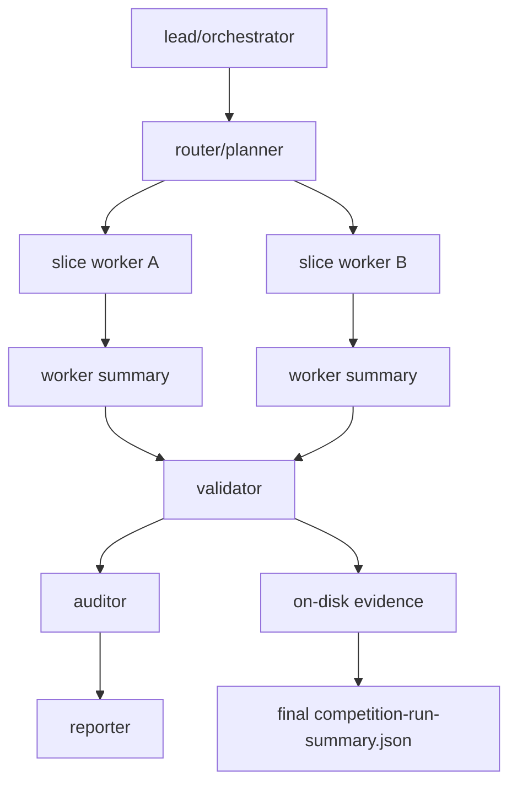

# OpenCode Agent Harness Design

This document defines the competition-path OpenCode-only Agent Harness. It is not a new translator and not a general agent platform. It is the control layer between the existing `run_competition.py`, `auto_migrate.py`, evidence validators, and OpenCode multi-agent execution.

> Note: this is architecture design material, not the canonical backlog; project-wide priorities follow `future-vision-and-mvp.md`.

## Goal

P0 uses **SQLite as a scheduling-queue persistence layer**. SQLite records runs, agents, tasks, slices, artifacts, gates, events, leases, and merge plans. Long-term knowledge-base behavior is left as a future interface only.

Semantic acceptance is still decided only by on-disk evidence and validators:

- `validate_auto_translation_evidence.py --require-semantic-pass`
- `validate_competition_run_summary.py`
- `unsafe_budget.py`

Any `passed` field inside SQLite can only index validated evidence. It cannot replace evidence.

## Multi-Agent Roles



- `lead/orchestrator`: reads `CONTEXT.md`, the competition profile, and SQLite run state; creates runs, assignments, leases, and merge plans.
- `router/planner`: assigns only independent real C slices to workers; shared APIs, schemas, unsafe ledgers, golden fixtures, and Cargo metadata are not edited concurrently.
- `slice worker`: processes one or more independent slices and writes only under `target/competition-out/workers/<worker-id>/`.
- `validator`: reads worker summaries and aggregates them with `--worker-summary`; its final verdict is the only accepted run-level verdict.
- `auditor`: checks proof class, artifact roots, paths/hashes, refused/blocked/failed classification, and unsafe/cache/version boundaries.
- `reporter`: writes human-facing summaries without expanding capability claims.

## SQLite State Store

Default location:

```text
target/competition-out/state/opencode-agent-harness.sqlite3
```

Lifecycle:

- Runtime artifact, not committed by default.
- Schema/migration files and docs may be committed; `.sqlite3` files are not committed.
- For audits, export `target/competition-out/summary/harness-db-manifest.json` as a diagnostic artifact only.

Core tables:

| Table | Purpose |
|---|---|
| `runs` | Run id, out-root, proof class, profile hash, final gate, and summary hash. |
| `agents` | OpenCode lead/worker/validator roles and isolated output roots. |
| `agent_tasks` | Worker tasks, phase, attempt, status, allowed paths, and error keys. |
| `slices` | Target/slice/source/function/source commit/slice spec hash. |
| `candidates` | typed IR, C2Rust, legacy compatibility, and future candidates; candidates are not semantic acceptance. |
| `gates` | environment, auto_migrate, semantic validator, unsafe, summary-validator gates, and the optional Superpowers historical-governance gate when explicitly enabled. |
| `artifacts` | Repo-relative artifact path, sha256, kind, and semantic role. |
| `artifact_links` | Manifest/cache/final-verification reference edges. |
| `events` | Mirror of `commands.jsonl`, auto-translation events, and harness events. |
| `leases` | Slice/out-root/shared-resource lease owner, heartbeat, and fencing token. |
| `context_packs` | ContextPack inputs, hashes, schema/profile/source commit bindings. |
| `repair_hints` | Diagnostic suggestions for blocked/refused slices; not evidence. |
| `metrics` | Recomputable statistics; not a fact source. |

## Directories And Isolation

```text
target/competition-out/
  state/opencode-agent-harness.sqlite3
  harness/
    assignments/<worker-id>.json
    assignments/<worker-id>-request.json
    merge-plan.json
  workers/<worker-id>/
    evidence/
    slice-specs/
    summary/competition-run-summary.json
    harness/run-worker-report.json
    logs/
  summary/competition-run-summary.json
  logs/commands.jsonl
```

Each worker must use a distinct `--out-root`. Final aggregation reads worker summaries only:

```bash
python validation/tools/run_competition.py \
  --worker-summary target/competition-out/workers/worker-a/summary/competition-run-summary.json \
  --worker-summary target/competition-out/workers/worker-b/summary/competition-run-summary.json \
  --out-root target/competition-out \
  --proof-class local-simulation
```

## OpenCode Entrypoint

OpenCode can invoke the repo-local wrapper directly:

```bash
python scripts/c2rust-migrator.py --phase migrate --input target/competition-out/harness/assignments/worker-a-request.json
```

The harness also provides a minimal executor for the reproducible path:

```bash
python -m validation.tools.opencode_agent_harness run-worker \
  --db target/competition-out/state/opencode-agent-harness.sqlite3 \
  --run-id run-demo \
  --worker-id worker-a \
  --mode deterministic
```

`run-worker --mode deterministic` invokes the same repo-local wrapper and writes stdout/stderr, return code, summary path, record status, and final task status to `workers/<worker-id>/harness/run-worker-report.json`. If the child process fails, the summary is missing, or the summary `final_gate.status` is not `passed`, the worker task must be recorded as failed and final aggregation must not treat it as passed.

`run-plan --max-workers <N> --auto-retry` is the LangGraph-inspired execution shape without adding a new runtime dependency: `load_plan -> fanout_workers -> worker -> repair_retry -> merge -> report`. Independent workers run in parallel up to `max_workers`, but `run-plan-report.json.graph.parallel_map.result_order=planner_order` keeps the fan-in deterministic. A failed worker can be retried with the same assignment through the persisted `repair_hints` ledger until it revalidates or reaches `REPAIR_ROUND_CAP=5`; failed intermediate attempts stay audit-visible, while semantic acceptance still comes only from the worker summary, final aggregation, and validators.

`run-worker --mode opencode` also records startup-level transient retries as `opencode_process_retries` when OpenCode itself fails with `database is locked` before the first shell command. This is intentionally narrower than repair retry: it only retries the agent process startup, keeps the exact-command verifier unchanged, and still requires the expected worker summary before any merge can pass.

`evaluate` is the judge/regression-first entrypoint: one command chains `init-run -> plan-source-file -> run-plan -> merge -> evaluate-report`. It also emits two context-management artifacts:

- `harness/context-pack.json`: a run-level context pack containing the source pin, graph, parallelism, entrypoints, worker summaries/reports, merge summary, and acceptance boundary; it is also written to the SQLite `context_packs` table so the next agent run or a judge can locate the evidence directly.
- `harness/agent-index.json`: an index by `worker_id` for assignments, requests, summaries, reports, isolated output directories, and final status, so OpenCode multi-agent runs can fan in quickly.

These files are indexes and context only. They are not semantic acceptance. Acceptance still comes from worker summaries, the merge summary, and validators.

`run-batch-profile`, the current before/after demo and profile-regression entrypoint, writes the same `context-pack.json` / `agent-index.json` artifacts with `harness/batch-profile-report.json` as the primary report. `evaluate --profile` reuses the full batch-profile pipeline and then writes `harness/evaluate-report.json` as the judge-discoverable one-command wrapper; that wrapper only indexes batch artifacts, summary validation, and context entrypoints, and is not a new semantic gate. This gives the judge demo path and the development evaluation path the same context index for continuation and audits.

When local OpenCode / GLM 5.1 is connected, OpenCode can wrap the same assignment request:

```bash
python -m validation.tools.opencode_agent_harness run-worker \
  --db target/competition-out/state/opencode-agent-harness.sqlite3 \
  --run-id run-demo \
  --worker-id worker-a \
  --mode opencode \
  --opencode-model GLM-5.1 \
  --opencode-agent c2rust-migrator \
  --opencode-variant max
```

When reusing committed accepted evidence, `assign-slice` must record both the real source metadata and the maintained `--slice-spec`, and must pass `--reuse-accepted-evidence --accepted-evidence-root validation/evidence` explicitly. This validates committed evidence only; it does not promote the regenerated Rust draft to semantic pass.

`request.json` can contain direct slice input:

```json
{
  "source_repo_root": "external/demo",
  "source_file": "src/demo.c",
  "function": "add_one",
  "target_id": "demo",
  "slice_id": "demo-add-one",
  "source_commit": "abc123",
  "compiler_command_source": "compile_commands.json",
  "include_paths": ["include"],
  "defines": ["DEMO=1"],
  "proof_class": "local-simulation",
  "out_root": "target/competition-out/workers/worker-a",
  "run_id": "run-demo-worker-a"
}
```

It can also contain worker-summary aggregation input:

```json
{
  "worker_summaries": [
    "target/competition-out/workers/worker-a/summary/competition-run-summary.json",
    "target/competition-out/workers/worker-b/summary/competition-run-summary.json"
  ],
  "proof_class": "local-simulation",
  "out_root": "target/competition-out",
  "run_id": "run-demo"
}
```

## Invariants

- Input must come from real C source slices; hand-written `c_source` is forbidden.
- Worker claims are not evidence; only disk evidence and validators count.
- SQLite is a ledger/cache/index, not an evidence database.
- C2Rust baseline is candidate context; `skipped`/`blocked` does not count as generated, accepted, or semantic pass.
- LLM candidates are not part of the P0 default path. If added in P2, they must record provider/model/prompt/input/output hashes and pass the same validation.
- MCP, Cron, daemon workers, and general Harness framework work are not P0.
