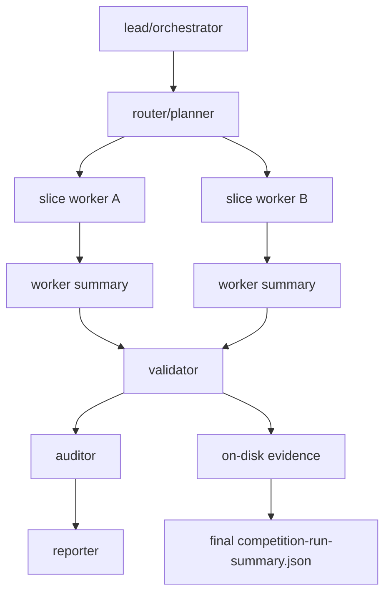

英文镜像见 `opencode-agent-harness-design.en.md`。

# OpenCode Agent Harness 设计

本文定义比赛主路径使用的 OpenCode-only Agent Harness。它不是新的翻译器，也不是通用 Agent 平台；它是现有 `run_competition.py`、`auto_migrate.py`、evidence validator 和 OpenCode 多 agent 工作流之间的控制层。

## 目标

P0 采用 **SQLite 调度队列级持久化**：SQLite 记录 run、agent、task、slice、artifact、gate、event、lease 和 merge plan；长期知识库能力只保留接口，不作为当前语义证明来源。

语义通过仍只由落盘 evidence 和 validator 裁决：

- `validate_auto_translation_evidence.py --require-semantic-pass`
- `validate_competition_run_summary.py`
- `unsafe_budget.py`
- `openspec validate --all --strict`

SQLite 中任何 `passed` 字段都只能索引这些证据，不能替代证据。

## 多 Agent 角色



- `lead/orchestrator`：读取 `CONTEXT.md`、competition profile 和 SQLite run 状态，创建 run、assignment、lease 和 merge plan。
- `router/planner`：只把互不依赖的真实 C slice 分给 worker；共享 API、schema、unsafe ledger、golden fixture 和 Cargo metadata 不并发写。
- `slice worker`：每个 worker 只处理一个或一组独立 slice，写入自己的 `target/competition-out/workers/<worker-id>/`。
- `validator`：只读 worker summary，用 `--worker-summary` 汇总；最终裁决唯一有效。
- `auditor`：检查 proof class、artifact root、path/hash、refused/blocked/failed 分类和 unsafe/cache/version 边界。
- `reporter`：生成面向人的摘要，但不得扩大能力声明。

## SQLite 状态库

默认位置：

```text
target/competition-out/state/opencode-agent-harness.sqlite3
```

生命周期：

- 运行产物，默认不提交仓库。
- 可提交 schema/migration 或文档，不提交 `.sqlite3`。
- 如需审计，导出 `target/competition-out/summary/harness-db-manifest.json`，只作为 diagnostic artifact。

核心表：

| 表 | 作用 |
|---|---|
| `runs` | 记录 run id、out-root、proof class、profile hash、final gate 和 summary hash。 |
| `agents` | 记录 OpenCode lead/worker/validator 等角色和隔离输出目录。 |
| `agent_tasks` | 记录 worker 任务、phase、attempt、status、allowed paths 和错误键。 |
| `slices` | 记录 target/slice/source/function/source commit/slice spec hash。 |
| `candidates` | 记录 typed IR、C2Rust、legacy compatibility 等候选；候选本身不等于 semantic pass。 |
| `gates` | 记录 environment、auto_migrate、semantic validator、unsafe、OpenSpec、summary validator 等 gate。 |
| `artifacts` | 索引落盘 artifact 的 repo-relative path、sha256、kind、semantic role。 |
| `artifact_links` | 记录 manifest/cache/final verification 引用关系。 |
| `events` | 镜像 `commands.jsonl`、auto-translation events 和 harness events。 |
| `leases` | 记录 slice/out-root/shared-resource lease、owner、heartbeat、fencing token。 |
| `context_packs` | 索引 ContextPack 输入、hash、schema/profile/source commit。 |
| `repair_hints` | 保存 blocked/refused 的诊断建议，不作为 evidence。 |
| `metrics` | 保存可重算统计，不作为事实源。 |

## 目录和隔离

```text
target/competition-out/
  state/opencode-agent-harness.sqlite3
  harness/
    assignments/<worker-id>.json
    assignments/<worker-id>-request.json
    merge-plan.json
  workers/<worker-id>/
    evidence/
    slice-specs/
    summary/competition-run-summary.json
    harness/run-worker-report.json
    logs/
  summary/competition-run-summary.json
  logs/commands.jsonl
```

worker 必须使用独立 `--out-root`。最终汇总只读 worker summary：

```bash
python validation/tools/run_competition.py \
  --worker-summary target/competition-out/workers/worker-a/summary/competition-run-summary.json \
  --worker-summary target/competition-out/workers/worker-b/summary/competition-run-summary.json \
  --out-root target/competition-out \
  --proof-class local-simulation
```

## OpenCode 入口

OpenCode 可以直接调用 repo-local wrapper：

```bash
python scripts/c2rust-migrator.py --phase migrate --input target/competition-out/harness/assignments/worker-a-request.json
```

Harness 也提供最小执行器，优先用于可复现路径：

```bash
python -m validation.tools.opencode_agent_harness run-worker \
  --db target/competition-out/state/opencode-agent-harness.sqlite3 \
  --run-id run-demo \
  --worker-id worker-a \
  --mode deterministic
```

`run-worker --mode deterministic` 调用同一个 repo-local wrapper，并把 stdout/stderr、return code、summary path、record status 和最终任务状态写入 `workers/<worker-id>/harness/run-worker-report.json`。如果子进程失败、summary 缺失，或 summary 的 `final_gate.status` 不是 `passed`，worker 任务必须记录为 failed，最终合并不能把它当成通过。

`run-plan --max-workers <N> --auto-retry` 是不新增运行时依赖的 LangGraph-inspired 执行形态：`load_plan -> fanout_workers -> worker -> repair_retry -> merge -> report`。独立 worker 最多并行到 `max_workers`，但 `run-plan-report.json.graph.parallel_map.result_order=planner_order` 固定 planner 顺序 fan-in。失败 worker 会通过已落盘的 `repair_hints` 账本用同一份 assignment 重试，直到重新验证通过或达到 `REPAIR_ROUND_CAP=5`；中间失败尝试保留审计记录，语义接受仍只来自 worker summary、最终聚合和 validator。

`run-worker --mode opencode` 还会在 OpenCode 自身于第一条 shell command 前报 `database is locked` 时，把启动层瞬时重试记录为 `opencode_process_retries`。这比 repair retry 更窄：它只重试 agent 进程启动，不改变 exact-command verifier，且仍要求 expected worker summary 存在后才能让 merge 通过。

`evaluate` 是评委/回归优先入口：一次命令串起 `init-run -> plan-source-file -> run-plan -> merge -> evaluate-report`。它额外生成两份上下文管理 artifact：

- `harness/context-pack.json`：run 级上下文包，包含 source pin、graph、parallelism、entrypoints、worker summary/report、merge summary 和 acceptance boundary；同时写入 SQLite `context_packs` 表，供下一轮 agent 或评委直接定位证据。
- `harness/agent-index.json`：按 `worker_id` 索引 assignment、request、summary、report、隔离输出目录和最终状态，供 OpenCode 多 agent 并行运行后快速 fan-in。

这两份文件只是索引和上下文，不构成 semantic acceptance。最终通过仍由 worker summary、merge summary 和 validator 决定。

`run-batch-profile` 作为当前 before/after demo 和 profile 回归入口，也写入同样的 `context-pack.json` / `agent-index.json`，其中 primary report 为 `harness/batch-profile-report.json`。`evaluate --profile` 会复用完整 batch-profile pipeline，再额外落 `harness/evaluate-report.json` 作为评委可发现的一键入口 wrapper；该 wrapper 只索引 batch artifacts、summary validator 和上下文入口，不是新的 semantic gate。因此评委 demo 入口和开发评测入口都能用同一种上下文索引续跑或审计。

连接本机 OpenCode / DeepSeek V4 Pro 时，可以让 OpenCode 包装同一份 assignment request：

```bash
python -m validation.tools.opencode_agent_harness run-worker \
  --db target/competition-out/state/opencode-agent-harness.sqlite3 \
  --run-id run-demo \
  --worker-id worker-a \
  --mode opencode \
  --opencode-variant max
```

复用已提交 accepted evidence 时，`assign-slice` 必须同时记录真实源信息和维护版 `--slice-spec`，并显式传 `--reuse-accepted-evidence --accepted-evidence-root validation/evidence`。这只验证已提交 evidence，不把重新生成的 Rust draft 提升为 semantic pass。

`request.json` 可包含直接 slice 输入：

```json
{
  "source_repo_root": "external/demo",
  "source_file": "src/demo.c",
  "function": "add_one",
  "target_id": "demo",
  "slice_id": "demo-add-one",
  "source_commit": "abc123",
  "compiler_command_source": "compile_commands.json",
  "include_paths": ["include"],
  "defines": ["DEMO=1"],
  "proof_class": "local-simulation",
  "out_root": "target/competition-out/workers/worker-a",
  "run_id": "run-demo-worker-a"
}
```

也可包含 worker summary 汇总输入：

```json
{
  "worker_summaries": [
    "target/competition-out/workers/worker-a/summary/competition-run-summary.json",
    "target/competition-out/workers/worker-b/summary/competition-run-summary.json"
  ],
  "proof_class": "local-simulation",
  "out_root": "target/competition-out",
  "run_id": "run-demo"
}
```

## 不变量

- 输入必须来自真实 C source slice；禁止手写 `c_source`。
- worker 口头结论无效；只认磁盘 evidence 和 validator。
- SQLite 是 ledger/cache/index，不是证据数据库。
- C2Rust baseline 是 candidate context；`skipped`/`blocked` 不计入 generated/accepted/semantic pass。
- LLM candidate 不进 P0 默认路径；未来 P2 接入时必须记录 provider/model/prompt/input/output hash，并走同一 validation。
- MCP、Cron、daemon、通用 Harness 框架都不是 P0。
